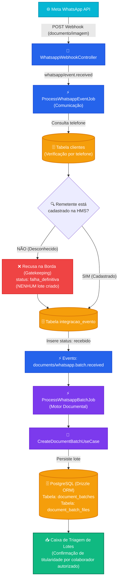
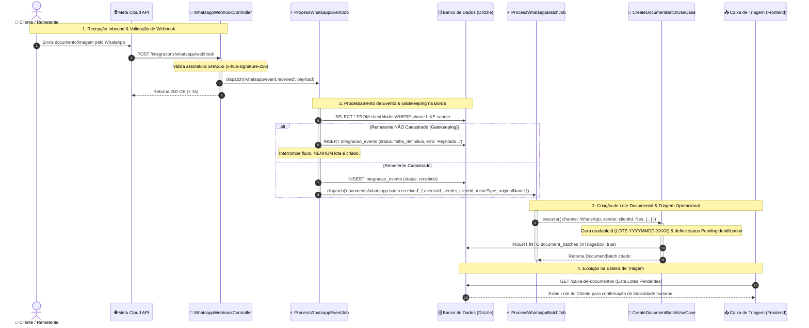

# Fluxo de Lotes Documentais (Motor Documental & WhatsApp)

Este documento detalha o fluxo arquitetural e cronológico da recepção de documentos e mídias via WhatsApp, do bloqueio na borda (gatekeeping) até a criação do Lote Documental para a Caixa de Triagem.

---

## 1. Fluxograma de Decisão e Processamento (Gatekeeping & Lote)

---

## 2. Diagrama de Sequência Cronológico

