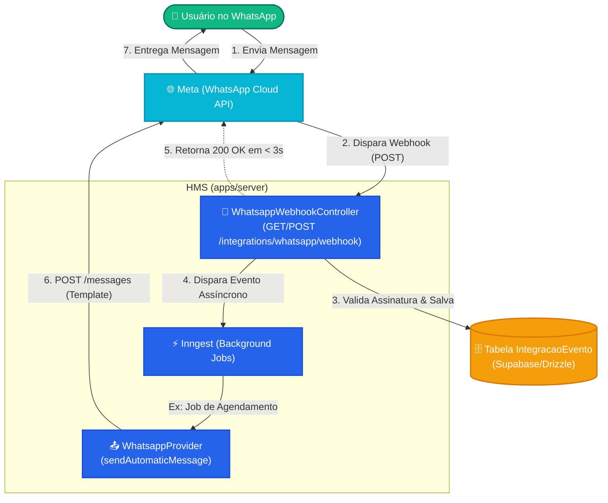

# Fluxo de Integração do WhatsApp

Este diagrama ilustra a interação entre o `WhatsappWebhookController` (fluxo de entrada / inbound) e o `WhatsappProvider` (fluxo de saída / outbound).

```mermaid
graph TD
    %% Estilos Gerais
    classDef hms fill:#2563eb,stroke:#1d4ed8,color:#ffffff,stroke-width:2px;
    classDef meta fill:#06b6d4,stroke:#0891b2,color:#ffffff,stroke-width:2px;
    classDef user fill:#10b981,stroke:#047857,color:#ffffff,stroke-width:2px;
    classDef database fill:#f59e0b,stroke:#d97706,color:#ffffff,stroke-width:2px;

    %% Elementos
    User(["👤 Usuário no WhatsApp"]):::user
    Meta["🌐 Meta (WhatsApp Cloud API)"]:::meta
    
    subgraph HMS_App ["HMS (apps/server)"]
        Controller["🔌 WhatsappWebhookController<br/>(GET/POST /integrations/whatsapp/webhook)"]:::hms
        Provider["📤 WhatsappProvider<br/>(sendAutomaticMessage)"]:::hms
        Inngest["⚡ Inngest (Background Jobs)"]:::hms
    end

    DB[("🗄️ Tabela IntegracaoEvento<br/>(Supabase/Drizzle)")]:::database

    %% Fluxo de Entrada (Inbound)
    User -->|"1. Envia Mensagem"| Meta
    Meta -->|"2. Dispara Webhook (POST)"| Controller
    Controller -->|"3. Valida Assinatura & Salva"| DB
    Controller -->|"4. Dispara Evento Assíncrono"| Inngest
    Controller -.->|"5. Retorna 200 OK em < 3s"| Meta

    %% Fluxo de Saída (Outbound)
    Inngest -->|"Ex: Job de Agendamento"| Provider
    Provider -->|"6. POST /messages (Template)"| Meta
    Meta -->|"7. Entrega Mensagem"| User
```