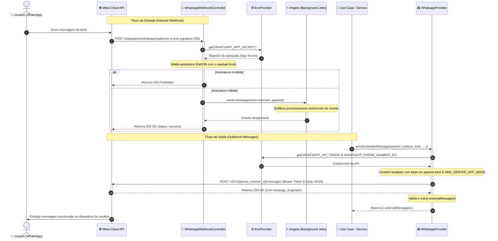

# Fluxo de Integração do WhatsApp

Este diagrama ilustra a interação entre o `WhatsappWebhookController` (fluxo de entrada / inbound) e o `WhatsappProvider` (fluxo de saída / outbound).

## Diagrama de Sequência de Comunicação (WhatsApp)

O diagrama a seguir detalha o fluxo cronológico das interações para recepção (inbound) e envio (outbound) de mensagens:

