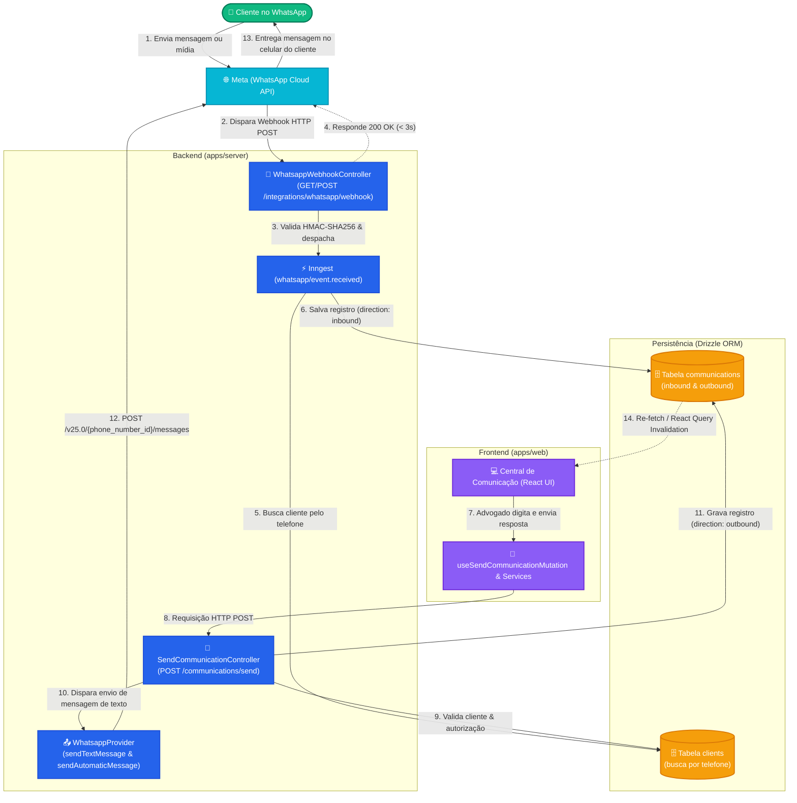
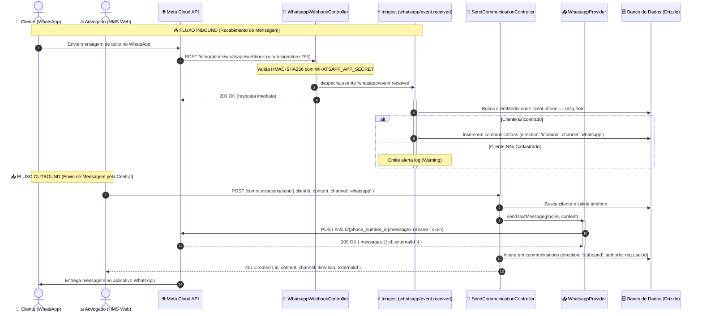

# Fluxo Completo de Integração do WhatsApp (Inbound & Outbound)

Este documento descreve e ilustra a arquitetura completa de comunicação via WhatsApp no HMS, cobrindo o fluxo de entrada (**Inbound** via Webhook e Inngest) e o fluxo de saída (**Outbound** via API REST, Provedores e Jobs).

---

## 🎨 Diagrama Unificado da Arquitetura WhatsApp (Inbound & Outbound)

O diagrama a seguir unifica os caminhos de entrada (cliente ➔ sistema) e de saída (advogado/sistema ➔ cliente), demonstrando como as tabelas do banco de dados (`communications`), os jobs do Inngest e as APIs REST se integram:

---

## ⏱️ Diagrama de Sequência Cronológico (End-to-End)

Este diagrama de sequência detalha a ordem exata de execução das chamadas nos fluxos de entrada (webhook/Inngest) e saída (API/Provedor/Meta API):

---

## 🔍 Resumo dos Componentes

| Componente | Responsabilidade | Tipo de Comunicação |
| :--- | :--- | :--- |
| **`WhatsappWebhookController`** | Recebe e valida assinaturas HMAC dos webhooks da Meta, encaminhando eventos ao Inngest. | Inbound (Entrada) |
| **`InngestService`** | Roteia e processa mensagens assíncronas do evento `whatsapp/event.received`, gravando como `inbound` no banco. | Inbound (Entrada) |
| **`SendCommunicationController`** | Endpoint REST `POST /communications/send` acionado pela UI para envio de mensagens pelos advogados. | Outbound (Saída) |
| **`WhatsappProvider`** | Envia mensagens de texto livre (`sendTextMessage`) e de modelo/template (`sendAutomaticMessage`) chamando a API da Meta. | Outbound (Saída) |
| **`communications` (DB)** | Tabela centralizada contendo os logs unificados de mensagens (`inbound` e `outbound`) em todos os canais. | Persistência |