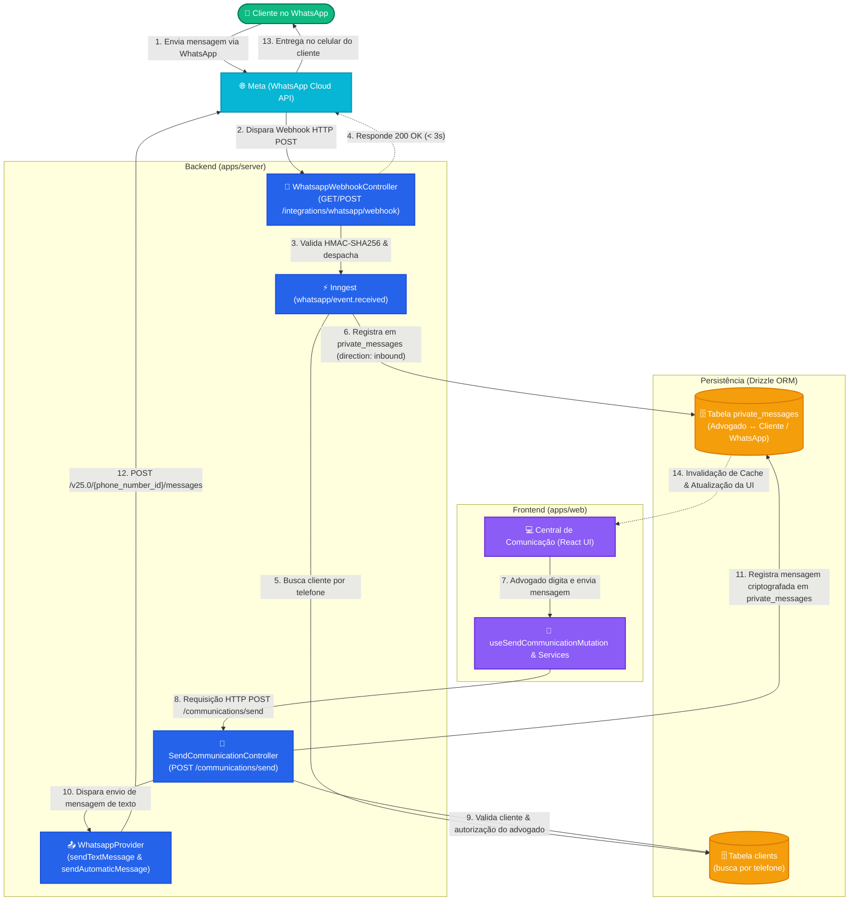
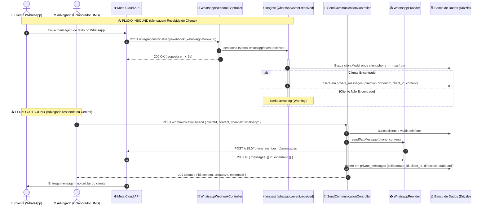

# Fluxo Completo de Integração do WhatsApp (Inbound & Outbound)

Este documento descreve a arquitetura de integração do WhatsApp no HMS, detalhando os papéis da tabela `private_messages` (mensagens diretas entre Advogado/Colaborador e Cliente) e da tabela `communications` (notificações oficiais do sistema/e-mail).

---

## 🎨 Diagrama Unificado da Arquitetura WhatsApp (Inbound & Outbound)

---

## ⏱️ Diagrama de Sequência Cronológico (End-to-End)

---

## 🔍 Separação de Responsabilidades entre Tabelas

| Tabela | Finalidade | Principais Atributos | Atores Envolvidos |
| :--- | :--- | :--- | :--- |
| **`private_messages`** | **Chat e Operações CRUD da Central de Comunicação**. Mensagens diretas de conversa entre o advogado e o cliente (WhatsApp / demandas de atendimento). | `client_id`, `collaborator_id`, `intake_id`, `content` (criptografado), `file_ids`, `direction` | Advogado (Colaborador) ↔ Cliente |