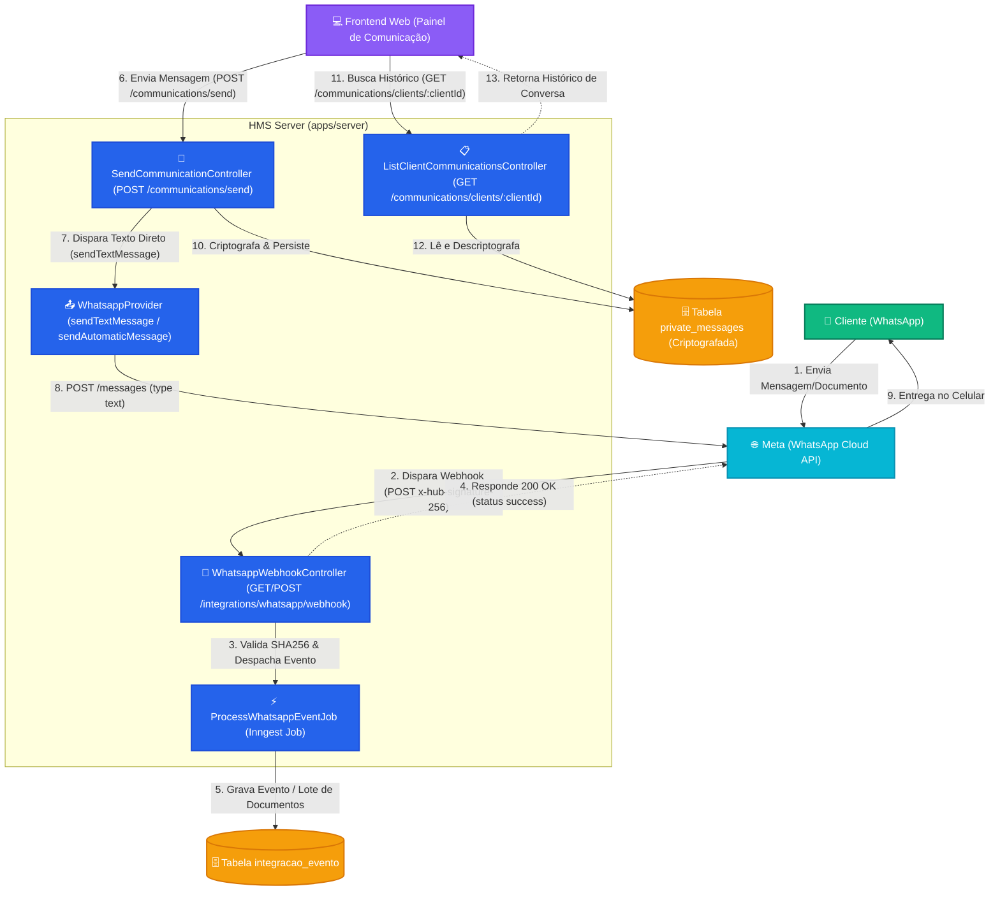
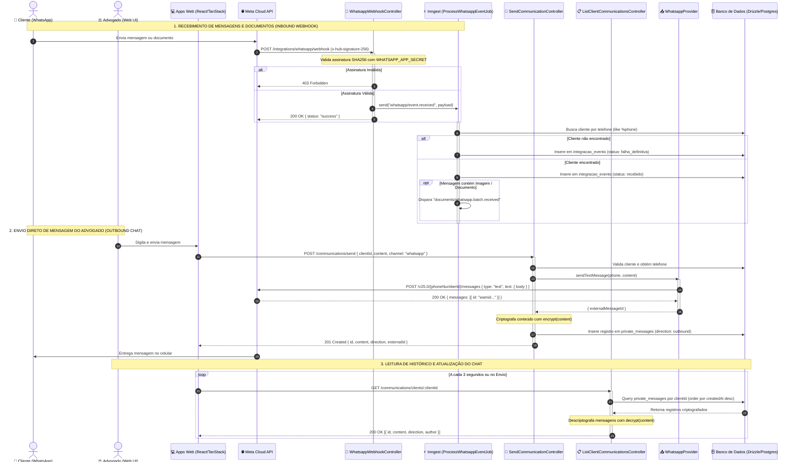

# Fluxo de Integração do WhatsApp e Comunicações

Este documento descreve a arquitetura e os fluxos reais de comunicação WhatsApp (Entrada / Inbound, Envio Direto via Painel / Outbound Chat e Mensagens Automáticas de Sistema).

---

## Diagrama de Sequência Detalhado

