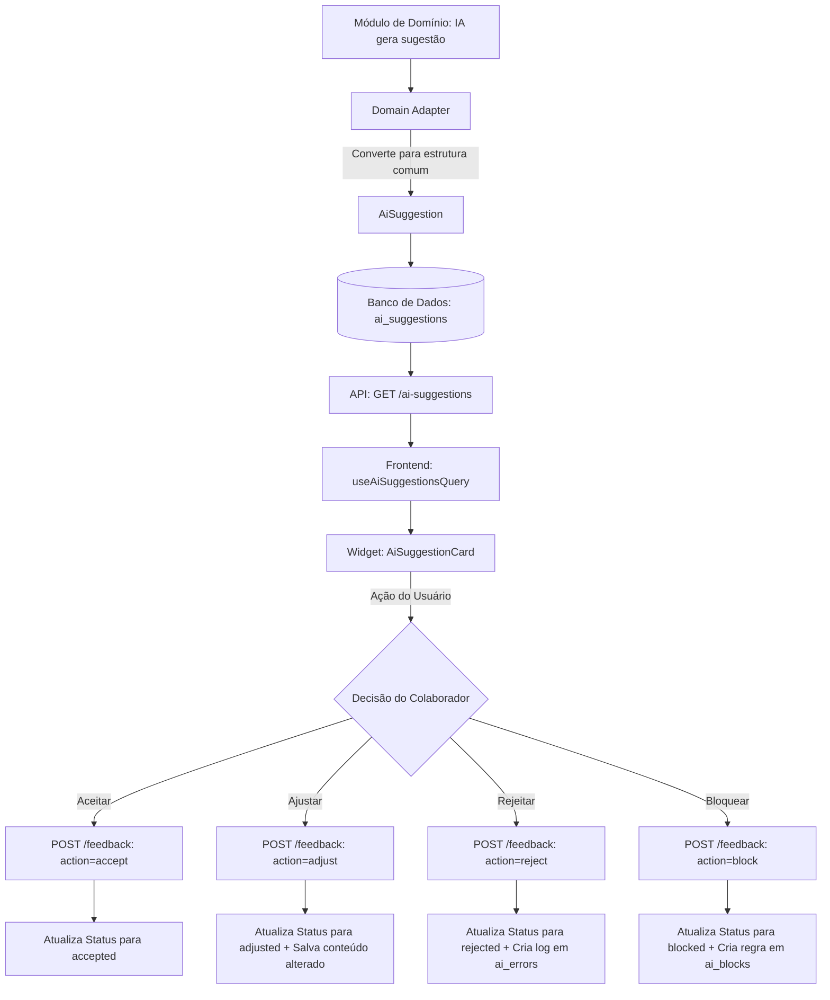

# Fluxo de Sugestões de IA (AI Suggestions Flow)

Este documento descreve o fluxo unificado de sugestões geradas por Inteligência Artificial no sistema HMS. O fluxo foi projetado para permitir que diferentes módulos (como Consulta e Document Engine) gerem sugestões que passam por uma camada de curadoria humana (Human-in-the-Loop) antes de serem consolidadas ou aplicadas.

---

## 1. Visão Geral do Fluxo

O ciclo de vida de uma sugestão de IA segue os seguintes passos:
1. **Geração & Adaptação:** Um serviço ou agente de IA gera uma sugestão específica para um domínio. Essa sugestão é adaptada para a estrutura comum `AiSuggestion` usando uma implementação de `AiSuggestionAdapter`.
2. **Persistência:** A sugestão adaptada é salva no banco de dados através do `AiSuggestionsRepository`.
3. **Exibição (Frontend):** O frontend consome os endpoints através do `AiSuggestionsService` e exibe os cards usando o componente `<AiSuggestionCard />`.
4. **Interação Humana:** O usuário (colaborador) revisa a sugestão na interface e pode tomar quatro ações:
   - **Aceitar (`accept`):** Aprova a sugestão como está.
   - **Ajustar (`adjust`):** Corrige o texto sugerido antes de aceitar.
   - **Rejeitar (`reject`):** Recusa a sugestão, exigindo a especificação de um motivo (que gera um log de erro de IA para auditoria).
   - **Bloquear (`block`):** Recusa a sugestão e cria uma regra de bloqueio para evitar futuras sugestões daquele tipo para a entidade.

---

## 2. Estrutura do Domínio (`packages/core`)

A camada de domínio compartilhado define as estruturas de dados, interfaces e casos de uso que guiam o fluxo de sugestão.

### Entidades e Estruturas de Dados
* **`AiSuggestion`** ([ai-suggestion.ts](file:///home/kauan/Documentos/HMS/hms/packages/core/src/shared/domain/structures/ai-suggestion.ts)):
  Define a estrutura de dados comum para qualquer sugestão.
  * `id`, `entityId` (ID do registro alvo), `entityType` (ex: `consultation`, `document_batch`), `suggestionType` (ex: `client_link`), `content` (texto sugerido).
  * `status`: Pode ser `pending`, `accepted`, `adjusted`, `rejected` ou `blocked`.
  * `confidence`: Nível de confiança da sugestão (`high` ou `low`).
  * `metadata`: Campo JSON para guardar informações específicas de cada domínio (ex: score de correspondência).

* **`AiBlock`** ([ai-block.ts](file:///home/kauan/Documentos/HMS/hms/packages/core/src/shared/domain/entities/ai-block.ts)):
  Registra o bloqueio de novas sugestões do mesmo tipo para uma determinada entidade.

* **`AiError`** ([ai-error.ts](file:///home/kauan/Documentos/HMS/hms/packages/core/src/shared/domain/entities/ai-error.ts)):
  Registra o histórico de rejeições de sugestões para fins de auditoria e calibragem fina dos modelos de IA.

### Adaptação de Dados (`AiSuggestionAdapter`)
Para unificar dados de diferentes domínios em uma única estrutura comum de UI e persistência, usa-se a interface `AiSuggestionAdapter<TSource>`:
* **`ConsultationSuggestionAdapter`** ([consultation-suggestion-adapter.ts](file:///home/kauan/Documentos/HMS/hms/packages/core/src/consultation/adapters/consultation-suggestion-adapter.ts)): Adapta as sugestões de consultas para o formato comum.
* **`ClientSuggestionAdapter`** ([client-suggestion-adapter.ts](file:///home/kauan/Documentos/HMS/hms/packages/core/src/document-engine/adapters/client-suggestion-adapter.ts)): Adapta sugestões de vínculos de cliente (calculando o score de confiança, onde score $\ge$ 0.8 é considerado `high` confidence, senão `low`).

### Casos de Uso (Use Cases)
* **`GetAiSuggestionsUseCase`** ([get-ai-suggestions-use-case.ts](file:///home/kauan/Documentos/HMS/hms/packages/core/src/shared/use-cases/get-ai-suggestions-use-case.ts)):
  Recupera a lista de sugestões vinculadas a um `entityId`.
* **`RegisterAiFeedbackUseCase`** ([register-ai-feedback-use-case.ts](file:///home/kauan/Documentos/HMS/hms/packages/core/src/shared/use-cases/register-ai-feedback-use-case.ts)):
  Centraliza a lógica de negócios para registrar a decisão do usuário:
  * Valida se a sugestão existe.
  * Valida campos obrigatórios (ex: `adjustedContent` para ajustes, e `rejectionReason` para rejeições).
  * Executa a atualização de status no repositório.
  * Em caso de **rejeição**, insere um registro em `AiError` via `createErrorLog`.
  * Em caso de **bloqueio**, cria uma regra de bloqueio em `AiBlock` via `createBlockRule`.

---

## 3. Camada do Servidor (`apps/server`)

Responsável pela persistência em banco de dados utilizando Drizzle ORM e exposição dos endpoints via NestJS.

### Modelos de Banco de Dados (Drizzle Schemas)
* **`aiSuggestionModel`** ([ai-suggestion-model.ts](file:///home/kauan/Documentos/HMS/hms/apps/server/src/shared/database/drizzle/models/ai-suggestion-model.ts)):
  Mapeia a tabela `ai_suggestions` com campos para status, conteúdo ajustado, motivo de rejeição, metadados (tipo JSONB) e timestamps de controle.
* **`aiBlockModel`** ([ai-block-model.ts](file:///home/kauan/Documentos/HMS/hms/apps/server/src/shared/database/drizzle/models/ai-block-model.ts)):
  Mapeia a tabela `ai_blocks` para as regras de bloqueio ativo.
* **`aiErrorModel`** ([ai-error-model.ts](file:///home/kauan/Documentos/HMS/hms/apps/server/src/shared/database/drizzle/models/ai-error-model.ts)):
  Mapeia a tabela `ai_errors` para log de rejeição.

### Repositório
* **`DrizzleAiSuggestionsRepository`** ([drizzle-ai-suggestions-repository.ts](file:///home/kauan/Documentos/HMS/hms/apps/server/src/shared/database/drizzle/repositories/drizzle-ai-suggestions-repository.ts)):
  Implementa `AiSuggestionsRepository` herdando de `DrizzleRepository`. Fornece as operações:
  * `findByEntityId(entityId)`: Busca sugestões associadas.
  * `findById(id)`: Busca uma única sugestão.
  * `add(suggestion)`: Insere uma nova sugestão.
  * `updateFeedback(params)`: Atualiza status e dados de revisão da sugestão.
  * `createErrorLog(error)`: Insere um log na tabela de erros.
  * `createBlockRule(block)`: Insere uma regra de bloqueio.

### Controller API
* **`AiSuggestionsController`** ([ai-suggestions.controller.ts](file:///home/kauan/Documentos/HMS/hms/apps/server/src/shared/rest/controllers/ai-suggestions.controller.ts)):
  Expõe a API sob a rota `/ai-suggestions`:
  * `GET /ai-suggestions?entityId=...`: Retorna a lista de sugestões daquela entidade.
  * `POST /ai-suggestions/:id/feedback`: Registra o feedback do usuário (payload contendo `action`, `adjustedContent` e/ou `rejectionReason`).

---

## 4. Camada Web / Frontend (`apps/web`)

Controla o estado de renderização e as mutações na interface de usuário.

### Serviços REST e Hooks React
* **`AiSuggestionsService`** ([AiSuggestionsService.ts](file:///home/kauan/Documentos/HMS/hms/apps/web/src/rest/services/AiSuggestionsService.ts)):
  Envelopa as chamadas HTTP para o backend para buscar sugestões e enviar feedbacks.
* **`useAiSuggestionsQuery`** ([use-ai-suggestions-query.ts](file:///home/kauan/Documentos/HMS/hms/apps/web/src/ui/shared/hooks/use-ai-suggestions-query.ts)):
  Hook do TanStack Query que busca as sugestões associadas a um `entityId`.
* **`useAiFeedbackAction`** ([use-ai-feedback-action.ts](file:///home/kauan/Documentos/HMS/hms/apps/web/src/ui/shared/hooks/use-ai-feedback-action.ts)):
  Mutação do TanStack Query para enviar o feedback. Invalida as queries com a chave `['ai-suggestions', entityId]` ao obter sucesso para recarregar a UI com os novos estados.

### Componente de Interface
* **`useAiSuggestionCard`** ([use-ai-suggestion-card.ts](file:///home/kauan/Documentos/HMS/hms/apps/web/src/ui/shared/widgets/components/ai-suggestion-card/use-ai-suggestion-card.ts)):
  Gerencia o estado local do card (se o usuário está no modo de edição/ajuste, se está no modo de preenchimento do motivo de rejeição, controle de loading de submissão, etc.).
* **`AiSuggestionCard`** ([index.tsx](file:///home/kauan/Documentos/HMS/hms/apps/web/src/ui/shared/widgets/components/ai-suggestion-card/index.tsx)):
  Renderiza o card de sugestão com estilos modernos alinhados ao design system (badges de confiança, contorno animado, suporte a campos de texto integrados para ajuste ou feedback de rejeição).
  * Possui identificadores únicos (`id={cardId}`, `id="btn-accept-..."`, etc.) para fins de automação de testes E2E, conforme regras descritas no `AGENTS.local.md`.
