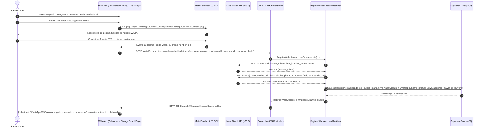

# 1. Contexto e Escopo

## Objetivo e Origem
Permitir que usuários com perfil de **Administrador** cadastrem e vinculem números de WhatsApp Business (WABA) institucionais aos advogados do escritório na plataforma HMS, utilizando o fluxo oficial da Meta (**Meta Embedded Signup** / Facebook JS SDK popup).

## Comportamento Atual e Lacuna do Produto
Atualmente, o cadastro de colaboradores com perfil **Advogado** (`profile === 'lawyer'`) não exige nem vincula obrigatoriamente um número de celular corporativo exclusivo para atendimento via WhatsApp Cloud API. A comunicação WhatsApp na plataforma dependia de um único número global estático configurado por variáveis de ambiente (`WHATSAPP_API_TOKEN`, `WHATSAPP_PHONE_NUMBER_ID`).

## Alinhamento de Produto e Escopo

| Área | No escopo | Fora do escopo |
| --- | --- | --- |
| **Público Alvo Exclusivo** | Advogados (`profile === 'lawyer'`). Perfis administrativos (`admin`) ou de outros setores não possuem número de atendimento WABA individual. | Uso de números pessoais de WhatsApp dos colaboradores (somente números corporativos fornecidos pelo escritório são permitidos). |
| **Interface de Cadastro (`apps/web`)** | No modal de criação/edição de colaborador (`CollaboratorRegisterDialog` / `CollaboratorEditDialog`), quando o perfil for `Advogado`, o campo **Celular / WhatsApp Profissional** torna-se **OBRIGATÓRIO** e aciona a integração com o Meta Embedded Signup. | Configuração de números WABA para perfis que não sejam Advogados. |
| **Detalhes do Colaborador (`apps/web`)** | Na página `/colaboradores/$colaboradorId`, exibir a seção **WhatsApp WABA Institucional** com o status do número, qualidade (`GREEN`, `YELLOW`, `RED`) e botão de reconexão via Meta Embedded Signup se inativo. | Múltiplos números de WhatsApp atribuídos ao mesmo advogado (vínculo estrito 1:1). |
| **Servidor REST & Persistência (`apps/server`)** | Endpoint `POST /api/v1/communication/waba/embedded-signup/exchange` enviando `lawyerId`, `code`, `wabaId` e `phoneNumberId`. Troca de token via Meta Graph API v25.0, persistência nas tabelas `waba_accounts` e `whatsapp_channels` com ativação automática de Webhook. | Processamento de autorização de novos números por usuários não-Administradores. |

---

# 2. Contrato de Implementação

## Requisitos Funcionais

| ID | Origem | Comportamento Requerido |
| --- | --- | --- |
| `RF-01` | Direct Request / Clarification | No cadastro de colaborador (`CollaboratorRegisterDialog`), ao selecionar o perfil **Advogado**, o campo **Celular / WhatsApp Profissional** torna-se obrigatório. |
| `RF-02` | Direct Request / Clarification | Durante o cadastro ou na tela de detalhes do advogado (`/colaboradores/$colaboradorId`), o Administrador pode acionar a autenticação **Meta Embedded Signup** (via Facebook JS SDK popup) para obter a autorização WABA daquele número fornecido pelo escritório. |
| `RF-03` | Direct Request / Clarification | O servidor deve receber os parâmetros `code`, `wabaId`, `phoneNumberId` e `lawyerId`, efetuar a troca pelo System User Token na Meta Graph API v25.0, salvar os dados e ativar automaticamente o canal WABA (vínculo 1:1 com o Advogado). |
| `RF-04` | Direct Request / Clarification | Se o advogado já possuir um número WABA ativo e um novo onboarding for realizado para ele pelo Administrador, o sistema deve **substituir** o vínculo pelo novo número WABA e **inativar** o canal anterior, preservando o histórico de conversas anteriores intacto. |
| `RF-05` | Direct Request / Clarification | Somente usuários autenticados com perfil `Administrador` podem cadastrar ou reconectar números WABA para advogados. |

## Critérios de Aceitação

| ID | RF Cobertos | Requisito | Dado | Quando | Então | Evidência Esperada |
| --- | --- | --- | --- | --- | --- | --- |
| `CA-01` | `RF-01` | Opcionalidade por Perfil | Um Administrador abrindo o `CollaboratorRegisterDialog` | Seleciona o perfil "Advogado" | O campo Celular/WhatsApp Profissional torna-se visível e obrigatório | Teste de Widget; `MV-01` |
| `CA-02` | `RF-02`, `RF-03` | Onboarding Meta e Ativação Automática | O Administrador submetendo o número do advogado no formulário ou na página do advogado | Conclui o fluxo no popup do Meta Embedded Signup | O frontend dispara `POST /api/v1/communication/waba/embedded-signup/exchange`, o servidor valida o token na Meta e o canal fica com status **Ativo** com vínculo 1:1 ao advogado | Teste de Integração REST; `MV-01` |
| `CA-03` | `RF-04` | Substituição com Preservação de Histórico | Um advogado que já possui um número WABA associado | O Administrador cadastra um novo número WABA para esse mesmo advogado | O número antigo é inativado, o novo é marcado como `active` e as conversas antigas no banco permanecem inalteradas | Teste de Caso de Uso; `MV-02` |
| `CA-04` | `RF-05` | Restrição de Segurança | Um usuário logado com perfil `Advogado` | Tenta acessar a rota REST de troca de código WABA | Servidor retorna HTTP `403 Forbidden` | Teste de Controller; `MV-01` |

---

# 3. Contrato Técnico

## Estado Técnico Atual
O cadastro de colaborador (`CollaboratorRegisterDialog` e `useCollaboratorRegisterDialog`) possui validação Zod para `professionalName`, `email`, `profile`, `jobTitle` e `legalExpertises`. O campo de telefone ainda não era validado obrigatoriamente para o perfil `lawyer`.

## Solução e Fluxo de Execução



## Mapeamento de Limites

| Limite | Produtor | Consumidor | Contrato Canônico | Garantias | Propriedade de Falha |
| --- | --- | --- | --- | --- | --- |
| `Web → Server REST` | `CollaboratorRegisterDialog` / `CollaboratorDetailsPage` | `RegisterWabaAccountController` | `RegisterWabaAccountDto` | Payload validado por Zod contendo `lawyerId`, `code`, `wabaId`, `phoneNumberId` | RestValidador (`400 Bad Request`) |
| `Server → Meta Graph API` | `MetaCloudApiProvider` | Meta Graph API `v25.0` | `MetaOAuthExchangeResponse` | HTTPS Bearer Token; timeout de 10s | MetaCloudApiProvider (`WabaRegistrationFailedError`) |
| `Server → Database` | `DrizzleWabaRepository` | Supabase PostgreSQL | `wabaAccountsModel` & `whatsappChannelsModel` | Transação atômica em Drizzle com inativação prévia de canal legado | DrizzleWabaRepository (`DatabaseError`) |

## Contratos por Camada

### `packages/core — Domain`

#### Entidades e Estruturas

```ts
// packages/core/src/communication/domain/entities/whatsapp-channel.ts
export type WhatsappChannelProps = {
  id: string
  wabaAccountId: string
  phoneNumberId: string
  displayPhoneNumber: string
  verifiedName: string
  qualityRating: 'GREEN' | 'YELLOW' | 'RED' | 'UNKNOWN'
  assignedLawyerId: string // Estritamente 1:1 para Advogados
  status: 'active' | 'disabled'
  createdAt: Date
  updatedAt: Date
}
```

**Esquema — `WhatsappChannel`**

| Campo | Tipo | Obrigatório | Validação | Descrição |
| --- | --- | --- | --- | --- |
| `id` | `string` | Sim | UUID v4 | Identificador único do canal WABA |
| `wabaAccountId` | `string` | Sim | Foreign Key | ID da conta WABA no banco |
| `phoneNumberId` | `string` | Sim | Numérico | Phone Number ID retornado pela Meta |
| `displayPhoneNumber` | `string` | Sim | Formato E.164 (+55...) | Número corporativo do advogado |
| `verifiedName` | `string` | Sim | Texto | Nome verificado da empresa na Meta |
| `qualityRating` | `string` | Sim | Enum Meta | Classificação de qualidade |
| `assignedLawyerId` | `string` | Sim | UUID v4 (FK `users.id`) | ID do Advogado proprietário exclusivo |
| `status` | `'active' \| 'disabled'` | Sim | Enum | Estado do canal no HMS |

### `packages/validation — Validation`

```ts
// packages/validation/src/communication/waba-embedded-signup.schema.ts
import { z } from 'zod'

export const registerWabaAccountSchema = z.object({
  lawyerId: z.string().uuid('ID do advogado inválido'),
  code: z.string().min(1, 'Código de autorização da Meta é obrigatório'),
  wabaId: z.string().min(1, 'WABA ID é obrigatório'),
  phoneNumberId: z.string().min(1, 'Phone Number ID é obrigatório'),
})

export type RegisterWabaAccountInput = z.infer<typeof registerWabaAccountSchema>
```

### `apps/server — REST`

| Caminho | Método | Controller | Segurança | Body | Resposta HTTP |
| --- | --- | --- | --- | --- | --- |
| `/api/v1/communication/waba/embedded-signup/exchange` | `POST` | `RegisterWabaAccountController` | Auth JWT (`Administrador`) | `RegisterWabaAccountDto` | `201 Created` (`WhatsappChannelResponseDto`) |
| `/api/v1/communication/waba/channels/lawyer/:lawyerId` | `GET` | `GetLawyerWhatsappChannelController` | Auth JWT | Path Params | `200 OK` (`WhatsappChannelResponseDto \| null`) |

---

# 4. Plano de Validação

## Testes Automatizados

1. **Camada Core & Use Cases (`packages/core`)**:
   - `RegisterWabaAccountUseCase.test.ts`: Testar registro de número WABA para um advogado e garantir que, se o advogado já possuía um canal ativo, o anterior passa para `disabled` e o novo fica `active`.
2. **Camada de Validação (`packages/validation`)**:
   - `waba-embedded-signup.schema.test.ts`: Testar validação de `lawyerId`, `code`, `wabaId` e `phoneNumberId`.
3. **Camada REST & Servidor (`apps/server`)**:
   - `register-waba-account.controller.test.ts`: Teste HTTP com Supertest verificando permissão restrita a `Administrador` (retornando `403` para outros perfis).
4. **Camada Web UI (`apps/web`)**:
   - Testar obrigatoriedade do campo Celular no `CollaboratorRegisterDialog` ao selecionar `profile = 'lawyer'`.

## Scenarios de Teste Manual (`MV-*`)

### `MV-01` — Cadastro de Advogado com Conexão WABA Meta
1. Autenticar como Administrador.
2. Abrir o modal **Novo colaborador**.
3. Selecionar o perfil **Advogado** (`profile = 'lawyer'`).
4. Verificar que o campo **Celular / WhatsApp Profissional** é exibido e marcado como obrigatório.
5. Preencher os dados e clicar em **"Conectar WhatsApp WABA"**.
6. Concluir o modal da Meta e verificar a criação do colaborador com o canal WABA em status `active`.

### `MV-02` — Troca de Número WABA de Advogado Existente
1. Acessar a página `/colaboradores/$colaboradorId` de um Advogado existente.
2. Na seção **WhatsApp WABA Institucional**, clicar em **"Substituir número WhatsApp"**.
3. Realizar novo onboarding no popup Meta.
4. Confirmar que o novo número é vinculado ao advogado e o histórico antigo permanece preservado no sistema.

---

# 5. Alinhamento de Documentação e Histórico de Revisões

## Histórico de Revisões

| Revisão | Data | Autor | Resumo de Alterações |
| --- | --- | --- | --- |
| `1` | 2026-09-22 | Agentic AI (Spec-Driven) | Especificação genérica inicial. |
| `2` | 2026-09-22 | Agentic AI (Grill-Me / Interview Reconciled) | Ajuste estrito do escopo: Vínculo 1:1 exclusivo para o perfil **Advogado**, obrigatoriedade do celular no modal de cadastro do colaborador, e ativação automática com substituição transparente de números. |
