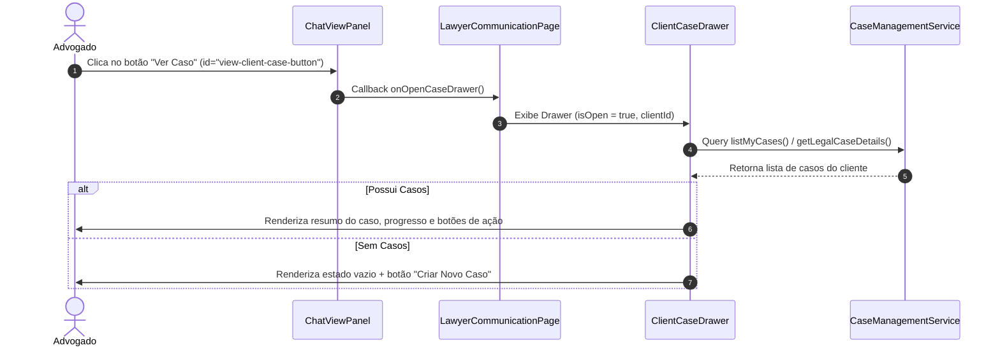

# Specification: Visualização de Caso do Cliente na Central de Comunicação (WhatsApp)

- **Status**: `open`
- **Revision**: `1`
- **Feature Domain**: `communication`
- **Feature Name**: `whatsapp-client-case-drawer`
- **Created Date**: 2026-09-16

---

## 1. Context and Scope

### Objective
Permitir que advogados e colaboradores visualizem de forma rápida e contextualizada os dados do caso/processo de um cliente diretamente no painel de conversa do WhatsApp (Central de Comunicação), abrindo um Drawer lateral com informações do caso, progresso do checklist de documentos e atalhos de navegação para o caso completo.

### Problem Statement & Current Gap
Atualmente, no componente `ChatViewPanel` (`apps/web/src/ui/identity/widgets/pages/lawyer-page/chat-view-panel.tsx`), o botão **"Ver Caso"** no cabeçalho da conversa é apenas um elemento estático de UI sem manipulador de evento `onClick` ou identificador único (`id`). O advogado não consegue verificar quais casos estão associados àquele cliente sem sair da Central de Comunicação e procurar manualmente em "Meus Casos".

### User Stories
- **Como** advogado atendendo um cliente via WhatsApp na Central de Comunicação,
- **Quero** clicar no botão "Ver Caso" no cabeçalho do chat ativo,
- **Para que** eu possa visualizar um Drawer lateral contendo o resumo do caso, área jurídica, status atual, progresso da documentação/checklist e links diretos para a página do caso sem perder o contexto da conversa.

### Boundaries and Assumptions
- O botão estará acessível no cabeçalho da conversa de qualquer cliente ativo na Central de Comunicação.
- O Drawer deve realizar o cruzamento entre os dados do cliente ativo (`activeClient.id` / `activeClient.name`) e os casos cadastrados em `CaseManagementService`.
- Se o cliente tiver 1 caso, ele é exibido diretamente. Se tiver múltiplos, um seletor (tab/dropdown) permite alternar. Se não tiver nenhum, exibe-se um estado vazio com botão para criar um novo caso.
- Design alinhado com o Design System do HMS (`documentation/design.md`), utilizando Shadcn UI (Sheet/Drawer, Badge, Button, Progress).

---

## 2. Implementation Contract

### Requirements (RF) & Acceptance Criteria (CA)

#### `RF-01`: Abertura e fechamento do Drawer de Resumo do Caso
- **`CA-01.1`**: O botão "Ver Caso" no `ChatViewPanel` deve possuir `id="view-client-case-button"` e acionar a abertura do Sheet/Drawer lateral.
- **`CA-01.2`**: O Drawer deve poder ser fechado através do botão de fechar (X), clicando no overlay externo ou pressionando a tecla `Esc`.

#### `RF-02`: Associação e busca dos casos do cliente
- **`CA-02.1`**: O sistema deve buscar a lista de casos associados ao `clientId` do cliente ativo selecionado no chat.
- **`CA-02.2`**: Se o cliente possuir 1 caso vinculado, as informações desse caso devem ser renderizadas automaticamente.
- **`CA-02.3`**: Se o cliente possuir múltiplos casos, o Drawer deve apresentar uma barra de seleção (tabs ou select) para o advogado alternar entre os casos do cliente.
- **`CA-02.4`**: Se o cliente não possuir casos cadastrados, deve ser exibido o componente de estado vazio (`id="client-case-empty-state"`) informando "Nenhum caso cadastrado para este cliente" e um botão `id="create-new-case-button"` redirecionando para `/advogado/meus-casos/novo-caso`.

#### `RF-03`: Exibição das Informações do Caso no Drawer
- **`CA-03.1`**: O Drawer deve exibir:
  - Nome do cliente e título do caso.
  - Código público do caso (ex: `CASO-20260916-0001`).
  - Área Jurídica e Matéria Jurídica.
  - Badge de Status do caso (ex: `Documentação em formação`).
  - Progresso do Checklist & Dossiê (porcentagem de conclusão, itens validados vs. pendentes).
  - Integrantes da equipe responsável pelo caso.
- **`CA-03.2`**: Deve haver um botão `id="go-to-full-case-button"` redirecionando para `/advogado/meus-casos/$caseId`.
- **`CA-03.3`**: Deve haver um botão `id="go-to-case-checklist-button"` redirecionando para `/advogado/meus-casos/$caseId` com foco na aba de checklist.

---

## 3. Technical Contract

### File and Component Structure

```text
apps/web/src/ui/identity/widgets/pages/lawyer-page/
├── chat-view-panel.tsx                         # Atualizado: aciona onOpenCaseDrawer
├── client-case-drawer/                         # NOVO: Widget do Drawer do Caso do Cliente
│   ├── index.tsx                               # Componente ClientCaseDrawer (Sheet)
│   ├── use-client-case-drawer.ts               # Hook de busca e gerenciamento dos casos do cliente
│   └── tests/
│       ├── client-case-drawer.test.tsx         # Testes de integração do Drawer
│       └── use-client-case-drawer.test.ts      # Testes unitários do Hook
└── communication.tsx                           # Atualizado: integra ClientCaseDrawer e estado de abertura
```

### Flow Diagram



---

## 4. Validation Contract

### Executable Scenarios (MV)

- **`MV-01`**: Abertura do Drawer ao clicar no botão "Ver Caso" no cabeçalho do chat.
- **`MV-02`**: Renderização correta dos dados do caso (título, código público, área jurídica e checklist) para um cliente que possui 1 caso.
- **`MV-03`**: Alternância entre casos para um cliente que possui múltiplos casos.
- **`MV-04`**: Exibição do estado vazio e redirecionamento para criação de caso quando o cliente não possui casos.
- **`MV-05`**: Navegação dos botões "Ver Caso Completo" e "Ver Checklist & Dossiê" para a rota `/advogado/meus-casos/$caseId`.

### Commands & Testing Seams
- **Unit & Widget Tests**: `pnpm --filter web exec vitest apps/web/src/ui/identity/widgets/pages/lawyer-page/client-case-drawer`
- **Component IDs Mandatórios** (conforme `AGENTS.local.md`):
  - `view-client-case-button`: Botão no cabeçalho do `ChatViewPanel`.
  - `client-case-drawer-container`: Container raiz do Sheet do Drawer.
  - `client-case-selector`: Seletor/tabs de casos (quando múltiplos).
  - `client-case-empty-state`: Estado vazio quando sem casos.
  - `go-to-full-case-button`: Botão para navegar para a página inteira do caso.
  - `go-to-case-checklist-button`: Botão para navegar diretamente para a aba de checklist.

---

## 5. Documentation Alignment and Revision History

- **PRD / Alignment**: `documentation/modules.md` (Módulo Case Management & Identity/Communication).
- **Rule Pack**: `ui-layer-rules.md`, `widget-testing-rules.md`, `code-conventions-rules.md`, `AGENTS.local.md`.
- **Revision History**:
  - `Rev 1` (2026-09-16): Especificação inicial criada via `/grill-me` (SDD).
