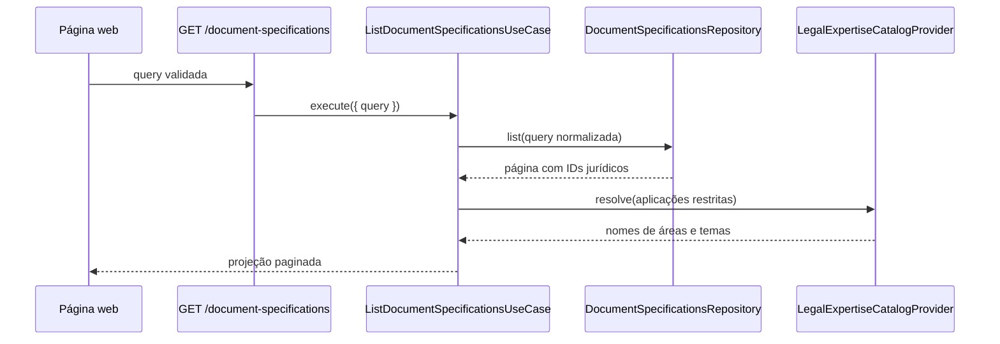

# Contexto e objetivo

O módulo de Produção Documental já possui estruturas iniciais no `packages/core`,
mas não possui persistência, API REST nem interface para consultar modelos. O
ticket `SCRUM-134` entrega a primeira experiência administrativa desse módulo.

A origem canônica de produto é a página Confluence `2588673`, referenciada pelo
tiny link `AYAn` em `documentation/modules.md`. A seção 11 do PRD, datada de
05/08/2026, prevalece sobre regras anteriores conflitantes e define uma aplicação
por modelo, os momentos aceitos e os estados **Disponível** e **Indisponível**.

O conteúdo principal do frame `K2Fvp` de `design/hms.pen` é a referência visual.
A sidebar do frame não deve ser redesenhada: a aplicação já possui e usa a
sidebar compartilhada do `AppLayout`, que deve receber o acesso a esta rota. A
página cobre listagem, busca, filtros, paginação e os controles visuais de ação
presentes no frame. Os fluxos de edição e duplicação permanecem dependentes de
handlers próprios e não devem ser inventados nesta entrega.

## Objetivo

Permitir que um administrador ativo encontre modelos de documentos e compreenda
sua aplicação, obrigatoriedade e disponibilidade, sem criar ou alterar dados.

# Escopo

## Incluído

- persistir a projeção necessária para consultar modelos e suas referências de
  aplicação no módulo Produção Documental;
- listar modelos por API com busca, filtros combináveis, ordenação estável e
  paginação;
- resolver nomes de áreas e temas pelo contrato público do Catálogo Jurídico, sem
  acessar diretamente a persistência de outro módulo;
- proteger a leitura para administradores ativos;
- disponibilizar a rota administrativa `/modelos-de-documentos`;
- incluir **Documentos** na sidebar administrativa existente, apontando para a
  rota canônica;
- sincronizar busca, filtros e página com a URL;
- exibir tabela e estados de carregamento, erro, base vazia e consulta sem
  resultados;
- exibir a coluna **Ação** com os botões **Editar** e **Duplicar** por modelo;
- validar domínio, persistência, REST, adaptação web, rota e comportamento no
  navegador.

## Fora de escopo

- cadastrar modelos por `Novo modelo`;
- editar configuração, template ou variáveis;
- disponibilizar ou indisponibilizar modelos;
- upload, importação, substituição de arquivo-base ou pré-visualização;
- configurar ou instanciar pacotes operacionais;
- criar, editar ou indisponibilizar áreas, temas ou fichas de atendimento;
- redesenhar, substituir ou reestruturar a sidebar e o `AppLayout`, além de
  registrar o novo item administrativo;
- atualizar automaticamente o status de `SCRUM-134`.

# Referências de design

| Fonte | Node | Estado observado | Aplicação na Spec |
|---|---|---|---|
| `design/hms.pen` | `K2Fvp` — administração de modelos de documentos | viewport desktop com lista preenchida, busca, filtros, tabela, ações e paginação | SR-002, SR-004, SR-005, SR-009 e CA-03, CA-04, CA-06, CA-10, CA-21 |

A aparência da sidebar do node é ignorada porque a implementação reutiliza a
sidebar existente do HMS; sua presença e o item **Documentos** continuam parte
do fluxo. O botão `Novo modelo` e os controles de disponibilidade são exceções
explícitas da referência. `Editar` e `Duplicar` devem ser renderizados na coluna
**Ação**, mesmo quando seus handlers ainda não estiverem conectados. O Pencil não fornece frames
canônicos separados para carregamento, erro, base vazia, ausência de resultados,
viewport estreito ou tema escuro; esses estados derivam do Contract, do Design
System e das Rules de UI e devem ser validados em runtime, sem inventar Node IDs.
O arquivo `.pen` é somente leitura nesta entrega e não integra o `scope` de
alteração.

# Contract

## Requisitos

### SR-001 — Autorizar somente administradores ativos

A rota e o endpoint devem aceitar somente uma sessão válida vinculada a um
colaborador local ativo com perfil `admin`. Uma sessão ausente recebe `401`; uma
conta sem vínculo ativo ou de outro perfil recebe `403`. Nenhum dado de Produção
Documental pode ser retornado antes da autorização.

### SR-002 — Listar modelos com projeção administrativa

Cada item deve apresentar:

- identificador do modelo;
- nome e descrição;
- momento da aplicação: `Consulta`, `Formalização` ou `Produção jurídica`;
- abrangência `Global` ou os nomes das áreas e temas jurídicos associados;
- obrigatoriedade por texto: `Obrigatório` ou `Opcional`;
- estado por texto: `Disponível` ou `Indisponível`.

A tabela possui as colunas **Modelo**, **Aplicação**, **Obrigatoriedade**,
**Estado** e **Ação**. A coluna **Ação** contém os controles **Editar** e
**Duplicar** por linha. A coluna **Atualizado** não é renderizada. Nome e
descrição permanecem juntos em **Modelo**. A aplicação global é identificada por
`Global`; a aplicação restrita apresenta os nomes disponíveis e resume
visualmente conjuntos longos sem retirar seu nome acessível completo.

### SR-003 — Buscar por nome ou descrição

A busca remove espaços periféricos e compara substring de nome ou descrição sem
diferença entre maiúsculas e minúsculas. Nome e descrição são combinados por
`OR`. Uma busca vazia ou composta apenas por espaços equivale à ausência de
busca.

### SR-004 — Filtrar modelos

A consulta aceita filtros opcionais por `legalAreaId`, `legalTopicId`, `moment`
e `status`. Filtros presentes são combinados por `AND`; cada um também é combinado
com a busca. Modelos globais não correspondem a filtros de área ou tema. Um filtro
de tema corresponde somente quando o tema está associado ao modelo e pertence à
área selecionada, quando esta também estiver presente.

Os valores de `moment` são `consultation`, `formalization` e `legal_production`.
Os valores de `status` são `available` e `unavailable`. Identificadores e enums
inválidos recebem `400` na API. Na rota web, parâmetros inválidos são descartados
deterministicamente antes da consulta, sem quebrar a página.

Os selects usam as operações existentes do Catálogo Jurídico para áreas e temas
ativos. Trocar ou limpar a área limpa o tema selecionado e recarrega as opções
compatíveis. Falha ao carregar essas opções mantém a listagem utilizável e
informa por que os filtros dependentes não estão disponíveis. Falha do provider
usado pelo servidor para resolver nomes da própria projeção é falha de listagem e
segue SR-007.

### SR-005 — Paginar e ordenar de forma estável

A query aceita `page?: number` e `pageSize?: number`. `page` começa em 1 e usa 1
como padrão; `pageSize` usa 20 como padrão e aceita valores de 1 a 100. A
ordenação é por nome após `trim` e conversão para minúsculas, preservando
diacríticos, em ordem ascendente e, em empate, por identificador ascendente.

A resposta contém `items`, `page`, `pageSize`, `total` e `totalPages`. Uma página
válida além do total retorna `items: []` e preserva os metadados reais, sem ajustar
silenciosamente a página solicitada.

### SR-006 — Preservar o estado da consulta na URL

A rota canônica é `/modelos-de-documentos`. Os parâmetros opcionais são
`search`, `legalAreaId`, `legalTopicId`, `moment`, `status`, `page` e `pageSize`.
A primeira página e o tamanho padrão podem ser omitidos da URL.

Alterar busca ou filtro reinicia `page` para 1. Alterar somente a página preserva
os demais parâmetros. Limpar filtros remove os parâmetros opcionais e restaura a
primeira página. Recarregar ou compartilhar a URL reproduz a mesma consulta e os
mesmos controles visíveis.

### SR-007 — Distinguir carregamento, vazio e falha

Antes da primeira resposta, a região da tabela apresenta carregamento sem simular
registros reais. Uma base sem modelos informa que ainda não há modelos
cadastrados, sem oferecer ação de cadastro. Uma consulta filtrada sem resultado
informa que nenhum modelo corresponde aos critérios e oferece **Limpar filtros**.
Falhas de listagem exibem mensagem orientada à recuperação e **Tentar novamente**.

### SR-008 — Manter limites entre módulos

Produção Documental é proprietária dos modelos, da obrigatoriedade, do momento,
da abrangência e da disponibilidade. Associações armazenam apenas referências de
área e tema. Nomes, atividade e compatibilidade pertencem ao Catálogo Jurídico e
são resolvidos pelo seu provider público; Produção Documental não importa models,
repositories ou tabelas do catálogo.

O tipo `DocumentSpecification` passa a representar explicitamente a
obrigatoriedade. Conteúdo e variáveis existentes no agregado não são retornados
pela projeção da listagem.

### SR-009 — Seguir fielmente a experiência visual e acessível do HMS

A composição deve reproduzir o conteúdo principal de `K2Fvp` para cabeçalho,
filtros, tabela, coluna de ações, chips e paginação, com a exceção de escopo
declarada para a sidebar. A implementação usa os tokens de `documentation/design.md`, título
serifado e controles em sans. Não adiciona cores, raios ou sombras hardcoded
quando há token semântico equivalente.

Busca, selects e paginação funcionam por teclado, mantêm foco visível e possuem
nomes acessíveis. Estado e obrigatoriedade usam texto e ícone, nunca somente cor.
A página preserva leitura e operação em viewport estreito, zoom/reflow, tema
escuro e WCAG 2.2 nível AA.

### SR-010 — Reutilizar a navegação administrativa existente

A página é acessível pelo item **Documentos** da sidebar já implementada no
`AppLayout`. O item existe somente para o perfil `admin`, usa a rota
`/modelos-de-documentos`, indica estado ativo nessa rota e em seus descendentes e
permanece operável nos estados expandido e recolhido da sidebar. Esta entrega não
altera estrutura, layout, responsividade ou comportamento compartilhado da
sidebar além de registrar o novo item.

## Critérios de aceitação

| CA | SR | Dado | Quando | Então | Evidência esperada |
|---|---|---|---|---|---|
| CA-01 | SR-001 | administrador ativo autenticado | acessa a rota ou consulta a API | a página e os dados são disponibilizados | integração REST + integração de rota + navegador real |
| CA-02 | SR-001 | sessão ausente, conta inativa, sem vínculo ou perfil não administrador | tenta ler modelos | recebe `401` ou `403` sem dados | integração REST + integração de rota |
| CA-03 | SR-002 | modelos globais e restritos, obrigatórios e opcionais | a listagem conclui | cada linha apresenta modelo, aplicação, obrigatoriedade e estado | teste de use case + integração REST + widget + navegador |
| CA-04 | SR-002 | tabela renderizada | inspeciona o cabeçalho e as linhas | **Atualizado** não existe; **Ação** contém **Editar** e **Duplicar** com nomes acessíveis por modelo | widget + navegador |
| CA-05 | SR-003 | modelos correspondentes somente por nome ou descrição, com caixa diferente | pesquisa | ambos são retornados e os demais são excluídos | teste de use case + integração REST |
| CA-06 | SR-004 | busca, área, tema, momento e estado válidos | aplica todos os critérios | o servidor combina todos por `AND` e retorna somente compatíveis | teste de use case + integração REST + integração de rota |
| CA-07 | SR-004 | área selecionada com tema | troca ou limpa a área | tema é limpo, opções são recarregadas e página volta para 1 | teste de hook/widget + navegador |
| CA-08 | SR-004 | REST de opções do Catálogo Jurídico indisponível e endpoint de modelos saudável | abre a página | lista continua consultável e filtros dependentes explicam a falha | widget + integração de rota |
| CA-09 | SR-004 | enum ou identificador inválido | consulta diretamente a API | recebe `400` com o erro REST padrão | integração REST |
| CA-10 | SR-005 | mais registros que `pageSize` | navega entre páginas | recorte, total e total de páginas são corretos, sem repetição ou salto | teste de use case + integração REST + widget |
| CA-11 | SR-005 | dois modelos com mesmo nome normalizado | lista repetidamente | ordem secundária por identificador permanece estável | integração REST |
| CA-12 | SR-005 | página válida além do total | consulta | mantém a página, retorna `items: []` e metadados reais | teste de use case + integração REST |
| CA-13 | SR-006 | URL com busca, filtros e página | abre ou recarrega a rota | controles, request e resultado reproduzem os parâmetros | teste de rota/hook + integração de rota + navegador |
| CA-14 | SR-006 | consulta em página posterior | altera busca ou filtro | URL e request voltam à página 1 sem perder outros critérios | teste de hook/widget + navegador |
| CA-15 | SR-007 | base sem modelos | conclui a primeira consulta | apresenta estado vazio sem ação de cadastro | widget + integração de rota |
| CA-16 | SR-007 | há modelos, mas nenhum corresponde | aplica critérios | oferece **Limpar filtros** | widget + navegador |
| CA-17 | SR-007 | API falha e depois se recupera | seleciona **Tentar novamente** | erro é substituído pelo resultado sem recarregar a aplicação | widget + integração de rota |
| CA-18 | SR-008 | modelo restrito com referências do catálogo | lista os modelos | nomes são resolvidos pelo provider público sem acesso às tabelas do catálogo pelo módulo | teste de use case + revisão arquitetural + integração REST |
| CA-19 | SR-009 | usuário usa teclado | percorre filtros e paginação | ordem, nomes e foco visível permitem concluir a consulta | widget + navegador real |
| CA-20 | SR-009 | viewport estreito, zoom/reflow ou tema escuro | consulta e filtra | conteúdo permanece legível, operável e com contraste AA | navegador real + auditoria de acessibilidade |
| CA-21 | SR-009 | conteúdo principal de `K2Fvp` | compara a implementação ignorando somente a sidebar | hierarquia, vocabulário, densidade, proporções, agrupamento da aplicação e ações correspondem à referência | comparação visual no Pencil + navegador |
| CA-22 | SR-010 | administrador autenticado com sidebar expandida ou recolhida | usa **Documentos** e visita a rota exata ou um descendente | navega para `/modelos-de-documentos`, o item permanece operável nos dois estados e fica ativo na rota e em descendentes | widget do AppLayout + integração de rota + navegador real |
| CA-23 | SR-010 | colaborador `attendant`, `lawyer`, `paralegal` ou `supervisor` | usa a aplicação | o item **Documentos** não integra a sidebar de nenhum perfil não administrador | teste matricial de `useAppLayout` + widget |

## Rastreabilidade

| Requisito | Origem |
|---|---|
| SR-001 | `SCRUM-134` — acesso administrativo; PRD REQ-027 |
| SR-002 | `SCRUM-134`; PRD REQ-005 e seção 11.4; frame `K2Fvp`; amendment de fidelidade visual |
| SR-003 | `SCRUM-134`; PRD REQ-005 e seção 11.4 |
| SR-004 | `SCRUM-134`; PRD seção 11.4; frame `K2Fvp` |
| SR-005 | `SCRUM-134`; PRD REQ-005 e seção 11.4 |
| SR-006 | `SCRUM-134`; regras de roteamento do repositório |
| SR-007 | `SCRUM-134`; PRD REQ-005; decisão direta de não cadastrar |
| SR-008 | PRD seções 2 e 8; `documentation/modules.md` |
| SR-009 | `SCRUM-134`; frame `K2Fvp`; `documentation/design.md`; amendment de fidelidade visual e exceção explícita somente para a sidebar |
| SR-010 | decisão direta do usuário sobre reutilizar a sidebar existente; frame `K2Fvp`; `AppLayout` atual |

# Estado atual

- `packages/core/src/document-production` contém entidades, estados e eventos
  iniciais, mas não contém repository, contrato de serviço ou caso de uso de
  listagem;
- `DocumentSpecification` ainda não representa a obrigatoriedade exigida pelo
  PRD e pelo frame;
- `apps/server` não possui módulo, persistência, seeder, controller ou rota de
  Produção Documental;
- `apps/web` não possui serviço, contexto, rota, navegação ou UI do módulo;
- o Catálogo Jurídico já oferece listagem de áreas/temas ativos e um provider para
  validar e resolver referências, que deve ser reutilizado;
- `ActiveAdminGuard` e `requireAdminMiddleware` já estabelecem os limites de
  autorização no servidor e na rota web.

## Mapeamento de evidência e fluxo

| Path | Estado | Evidência e responsabilidade |
|---|---|---|
| `packages/core/src/document-production/domain/entities/document-specification.ts` | existente | agregado possui aplicação, conteúdo, variáveis e estado; precisa de `isRequired` |
| `packages/core/src/legal-catalog/interfaces/legal-expertise-catalog-provider.ts` | existente | `resolve()` é o contrato público para nomes de áreas e temas |
| `packages/core/src/document-production/domain/structures/document-specification-list-query.ts` | novo arquivo | query normalizada da listagem |
| `packages/core/src/document-production/domain/structures/document-specification-list-item.ts` | novo arquivo | projeção pública sem conteúdo ou variáveis |
| `packages/core/src/document-production/domain/structures/document-specification-list-record.ts` | novo arquivo | projeção interna da persistência com IDs jurídicos |
| `packages/core/src/document-production/domain/entities/document-specification-creation.ts` | novo arquivo | creation record aceito pelo repository e pelo seeder |
| `packages/core/src/document-production/interfaces/document-specifications-repository.ts` | novo arquivo | port de persistência da listagem e do seeder |
| `packages/core/src/document-production/interfaces/document-production-service.ts` | novo arquivo | contrato REST consumido pelo web |
| `packages/core/src/document-production/use-cases/list-document-specifications-use-case.ts` | novo arquivo | normalização, consulta e resolução pelo catálogo |
| `packages/validation/src/document-production/schemas/document-specification-list-query-schema.ts` | novo arquivo | valida query HTTP/URL sem ampliar valores aceitos |
| `apps/server/src/document-production` | novo diretório | composição, persistência Drizzle, seeder, REST e testes do módulo |
| `apps/server/src/shared/database/seed.ts` | existente | ordena clear/run e encaminha IDs reais do Catálogo ao seeder |
| `apps/web/src/routes/modelos-de-documentos/index.tsx` | novo arquivo | entry point protegido e fonte do search state |
| `apps/web/src/ui/document-production/widgets/pages/document-specifications-page` | novo diretório | view, hook coordenador, filtros, tabela e paginação |
| `apps/web/src/constants/sidebar-items.ts` | existente | sidebar por perfil; recebe **Documentos** somente no array de admin |

Fluxo de dados:



A autenticação e a autorização acontecem na borda REST e na rota web. O client
não envia perfil, colaborador ou dados derivados da sessão. Produção Documental
consome somente o provider público do Catálogo Jurídico; nenhum model ou
repository do catálogo atravessa a fronteira.

# Solução técnica

## Core e validação

- modificar o arquivo existente `domain/entities/document-specification.ts` para
  adicionar `isRequired: boolean`, sem alterar o ownership de conteúdo e
  variáveis;
- criar `DocumentSpecificationListQuery` com `search?: string`,
  `legalAreaId?: string`, `legalTopicId?: string`,
  `moment?: DocumentGenerationMoment`, `status?: DocumentSpecificationStatus`,
  `page?: number` e `pageSize?: number`;
- criar `DocumentSpecificationCreation` em `domain/entities`, omitindo `id` e
  timestamps da entidade persistida;
- criar as queries e projections abaixo. A raiz usa
  `documentSpecificationId`, nunca `id`, e nenhuma projeção expõe `content` ou
  `variables`:

```ts
export type DocumentSpecificationCreation = Omit<
  DocumentSpecification,
  'id' | 'createdAt' | 'updatedAt'
>

export type DocumentSpecificationListQuery = {
  search?: string
  legalAreaId?: string
  legalTopicId?: string
  moment?: DocumentGenerationMoment
  status?: DocumentSpecificationStatus
  page?: number
  pageSize?: number
}

export type DocumentSpecificationListRecord = {
  documentSpecificationId: string
  name: string
  description: string
  application: DocumentSpecificationApplication
  isRequired: boolean
  status: DocumentSpecificationStatus
}

type GlobalApplication = {
  scope: 'global'
  moment: DocumentGenerationMoment
}

type LegalContextApplication = {
  scope: 'legal_context'
  moment: DocumentGenerationMoment
  legalExpertises: readonly {
    legalAreaId: string
    legalAreaName: string
    legalTopics: readonly {
      legalTopicId: string
      legalTopicName: string
    }[]
  }[]
}

export type DocumentSpecificationListItem = {
  documentSpecificationId: string
  name: string
  description: string
  application: GlobalApplication | LegalContextApplication
  isRequired: boolean
  status: DocumentSpecificationStatus
}
```

Os helpers da união permanecem não exportados no arquivo de
`DocumentSpecificationListItem`, respeitando uma declaração exportada por
arquivo;
- criar os contratos do repository e do serviço:

```ts
export interface DocumentSpecificationsRepository {
  list(
    query: DocumentSpecificationListQuery,
  ): Promise<PaginationResponse<DocumentSpecificationListRecord>>
  addMany(
    specifications: readonly DocumentSpecificationCreation[],
  ): Promise<readonly DocumentSpecification[]>
  removeAll(): Promise<void>
}

export interface DocumentProductionService {
  listDocumentSpecifications(
    query?: DocumentSpecificationListQuery,
  ): Promise<RestResponse<PaginationResponse<DocumentSpecificationListItem>>>
}
```

`addMany` e `removeAll` existem somente para o seeder e não originam endpoints
de mutação;
- criar `ListDocumentSpecificationsUseCase`, injetando
  `DocumentSpecificationsRepository` e `LegalExpertiseCatalogProvider`, com o
  contrato:

```ts
type Request = {
  query?: DocumentSpecificationListQuery
}

export declare class ListDocumentSpecificationsUseCase
  implements UseCase<
    Request,
    PaginationResponse<DocumentSpecificationListItem>
  > {
  execute(
    request: Request,
  ): Promise<PaginationResponse<DocumentSpecificationListItem>>
}
```

O caso de uso normaliza texto/paginação, consulta o repository e resolve somente
aplicações restritas;
- criar e exportar `documentSpecificationListQuerySchema` em
  `@hms/validation/document-production`, com coerção de inteiros na borda HTTP,
  limites de SR-005 e enums importados do core;
- exportar os novos subpaths `./document-production/interfaces` e
  `./document-production/use-cases` em `packages/core/package.json`; os subpaths
  de entities e structures já existentes apenas ganham novos exports internos.

## Persistência e servidor

- criar `document-specification-model.ts`,
  `document-specification-legal-area-model.ts` e
  `document-specification-legal-topic-model.ts` sob o novo módulo, com tabela
  principal com `id uuid primary key defaultRandom`, `name text not null`,
  `description text not null`, `moment text not null`, `application_scope text
  not null`, `is_required boolean not null default false`, `content text not null
  default ''`, `variables jsonb not null default '[]'`, `status text not null
  default 'unavailable'`, `created_at timestamptz not null default now()` e
  `updated_at timestamptz not null default now()`;
- adicionar checks para `moment IN ('consultation', 'formalization',
  'legal_production')`, `application_scope IN ('global', 'legal_context')`,
  `status IN ('available', 'unavailable')` e `jsonb_typeof(variables) = 'array'`;
- na associação de área, usar `document_specification_id uuid not null` e
  `legal_area_id uuid not null`, PK composta nos dois campos e FK interna para a
  tabela principal com `ON DELETE CASCADE`;
- na associação de tema, usar `document_specification_id uuid not null`,
  `legal_area_id uuid not null` e `legal_topic_id uuid not null`, PK composta nos
  três campos e FK composta
  `(document_specification_id, legal_area_id)` para a associação de área com
  `ON DELETE CASCADE`. IDs jurídicos continuam referências lógicas, sem FK para
  tabelas do Catálogo;
- indexar `lower(trim(name))`, momento, estado, `legalAreaId` e `legalTopicId`.
  Como as tabelas são novas, não há backfill; a migration cria constraints e
  defaults necessários. O acesso é exclusivo pelo servidor, sem grants diretos
  ao client nem política RLS específica;
- criar mapper, `DrizzleDocumentSpecificationsRepository`, tokens,
  `DocumentProductionDatabaseModule`, `DocumentProductionSeeder` e fixture. O
  mapper converte JSON de variáveis e a aplicação sem importar tipos internos do
  Catálogo Jurídico;
- definir o contrato do seeder:

```ts
type DocumentProductionSeedInput = {
  legalAreaId: string
  legalTopicId: string
}

export declare class DocumentProductionSeeder {
  clear(): Promise<void>
  run(
    input: DocumentProductionSeedInput,
  ): Promise<readonly DocumentSpecification[]>
}
```

`seed.ts` chama `clear()` antes de limpar o Catálogo, executa
  `LegalCatalogSeeder.run()`, seleciona IDs reais do resultado e só então chama
  `DocumentProductionSeeder.run(...)`; o seeder cria amostras globais e
  restritas por `addMany`, sem IDs jurídicos hardcoded;
- consultar com `ILIKE`, subqueries `EXISTS` para área/tema, contagem separada e
  paginação estável, evitando multiplicar linhas por joins de associação;
- criar `DocumentSpecificationListItemResponseDto` e
  `DocumentSpecificationsPageResponseDto` em
  `apps/server/src/document-production/rest/dtos`; o item expõe
  `documentSpecificationId`, nome, descrição, aplicação discriminada,
  `isRequired` e `status`, e a página expõe `items`, `page`, `pageSize`, `total`
  e `totalPages` com `@ApiProperty`;
- criar o controller com a assinatura declarativa:

```ts
export declare class ListDocumentSpecificationsController {
  handle(
    query: ListDocumentSpecificationsControllerRequestQuery,
  ): Promise<PaginationResponse<DocumentSpecificationListItem>>
}
```

O parâmetro real recebe `@Query()`. O controller expõe somente
`GET /document-specifications`; a query usa `createZodDto` e
  `ZodValidationPipe`, a resposta é
  `DocumentSpecificationsPageResponseDto`, e o método retorna exatamente
  `useCase.execute({ query })`; erros previstos são `400`, `401`, `403` e o erro
  REST padrão inesperado;
- proteger o controller com `AuthGuard` e `ActiveAdminGuard`, documentá-lo no
  Swagger e adicionar requests reproduzíveis ao REST client;
- compor `DocumentProductionModule` no `AppModule` e importar o contrato público
  do Catálogo Jurídico para resolução, sem atravessar sua persistência.

## Web

- criar `routes/modelos-de-documentos/index.tsx` com
  `beforeLoad: requireAdminMiddleware`, `ssr: false`, componente envolvido por
  `AppLayout` e `validateSearch` retornando `DocumentSpecificationListQuery`;
- regenerar o arquivo existente `routeTree.gen.ts`, adicionar
  `ROUTES.documentSpecifications = '/modelos-de-documentos'` e registrar
  `{ label: 'Documentos', route: 'documentSpecifications', icon: 'file-text' }`
  somente em `SIDEBAR_ITEMS[CollaboratorProfile.Admin]`. O `AppLayout`, o hook e
  o componente Sidebar existentes são reutilizados sem alteração estrutural;
- criar `DocumentProductionService(restClient)` implementando o contrato do core
  por `GET /document-specifications?<query>` e registrá-lo no `RestContext` como
  dependência readonly;
- criar `DocumentSpecificationsPage(): JSX.Element` e
  `useDocumentSpecificationsPage()` sob o novo diretório de UI; o hook coordena
  URL, queries e handlers, e a view recebe o estado já preparado;
- criar `useDocumentSpecificationsQuery(query)` com chave que contém todos os
  parâmetros de SR-006 e executa `listDocumentSpecifications(query)`;
- reutilizar o serviço do Catálogo Jurídico para opções e carregar temas somente
  quando uma área estiver selecionada;
- criar widgets de filtros, tabela e paginação com props derivadas do hook; a
  tabela recebe `readonly DocumentSpecificationListItem[]` e renderiza estados
  `loading`, `error`, `empty-base`, `empty-filtered` ou `content` de forma
  mutuamente exclusiva; no estado `content`, renderiza também a coluna **Ação**
  com **Editar** e **Duplicar** por modelo;
- receber callbacks opcionais para os controles de ação, sem inventar fluxos de
  edição ou duplicação quando eles ainda não estiverem disponíveis.

## Decisões técnicas e restrições

- **Rota e vocabulário:** usar `/modelos-de-documentos` e **Modelos de
  documentos**, alinhados ao PRD e ao frame; a alternativa `Documentos` do ticket
  perde precedência por ser menos específica;
- **Consulta server-side:** busca, filtros, ordenação e paginação ficam no banco;
  carregar tudo no browser foi rejeitado por quebrar SR-005 e escalar mal;
- **Resolução cross-domain:** armazenar somente IDs e resolver nomes pelo
  `LegalExpertiseCatalogProvider`; joins ou FKs com tabelas do Catálogo foram
  rejeitados pela fronteira modular;
- **Autorização na borda:** reutilizar `AuthGuard`, `ActiveAdminGuard` e
  `requireAdminMiddleware`; importar casos de uso de Identidade no core de
  Produção Documental foi rejeitado por acoplamento cross-domain;
- **Sidebar existente:** ignorar a aparência da sidebar de `K2Fvp`, mas reutilizar
  a sidebar real do `AppLayout` e acrescentar o item administrativo **Documentos**;
  criar uma segunda navegação foi rejeitado por duplicar infraestrutura existente;
- `Novo modelo` e controles de disponibilidade ficam fora da entrega; **Editar**
  e **Duplicar** são controles visuais da tabela e não implicam, sozinhos, a
  implementação dos fluxos de mutação;
- o filtro do Catálogo mostra somente opções ativas; modelos indisponíveis
  continuam consultáveis pelo filtro de estado.

# Plano de validação

## Automatizada

1. `pnpm format`;
2. `pnpm --filter @hms/core lint`, `check-types` e testes do caso de uso;
3. `pnpm --filter @hms/validation lint`, `check-types` e `test`;
4. `pnpm --filter server check:code` e `check:types`;
5. integrações REST com Testcontainers, cobrindo autorização, projeção, busca,
   filtros combinados, ordenação e paginação;
6. `pnpm --filter web generate-routes`, `check:code` e `check:types`;
7. `pnpm --filter web test`, incluindo serviço, hook, página, URL e estados;
8. integração de rota em `tests/routes/document-production`;
9. ciclo curto final `pnpm lint`, `pnpm check-types` e `pnpm test`.

`pnpm build` é a validação final do CI, não um sensor local do ciclo SDD.

## Navegador real

Com banco e Auth saudáveis, servidor e web reais em execução:

- autenticar como o administrador seed validado na fonte local;
- abrir `/modelos-de-documentos` e confirmar conteúdo autenticado;
- testar busca por nome e descrição, cada filtro e a combinação de todos;
- recarregar e compartilhar uma URL filtrada e paginada;
- verificar base vazia, consulta sem resultado, erro e retry;
- confirmar a presença da coluna **Ação**, dos botões **Editar** e **Duplicar** e
  seus nomes acessíveis por modelo; confirmar ausência de **Novo modelo** e dos
  controles de disponibilidade;
- navegar para a página pelo item **Documentos**, confirmar estado ativo e
  ausência do item para um perfil não administrador;
- percorrer busca, filtros e paginação por teclado;
- validar viewport estreito, zoom/reflow e tema escuro;
- comparar a listagem com `K2Fvp`, ignorando somente a sidebar;
- verificar console e requests, classificando erros, warnings de hidratação,
  `4xx/5xx` inesperados e falhas de refresh de autenticação.

# Avaliação

Status: `completed`. Implementação aceita pelos Judges, Quality Gate local e CI
do PR #41; Core, Server, Web e `check-size` passaram e o PR está mergeable.

# Alinhamento documental

- O Contract segue `SCRUM-134`, o PRD canônico `2588673`, especialmente
  REQ-005 e seção 11.4, `documentation/modules.md`, arquitetura, design,
  tooling, SDD e as Rules roteadas.
- A obrigatoriedade já decidida no PRD será adicionada ao domínio; isso alinha a
  implementação e não cria regra de produto.
- A entrega mantém os fluxos de mutação fora do escopo, mas renderiza os controles
  de ação previstos no frame para preservar a fidelidade visual.
- Nenhuma fronteira modular, dependência ou Rule global precisa mudar.
- O escopo ainda atravessa core, servidor e web; após aceite do Judge Spec, a rota
  adequada é `create-plan`.

# Premissas e questões pendentes

## Premissas aceitas nesta revisão

- o tiny link `AYAn` continua sendo a origem canônica mesmo existindo uma cópia
  mais recente do PRD em outro espaço; ambas continham o mesmo REQ-005 e a
  mesma seção 11 na data da pesquisa;
- a rota interna usa `/modelos-de-documentos`, alinhada ao PRD e ao frame;
- a página não executa mutações nesta entrega; os controles **Editar** e
  **Duplicar** podem existir visualmente sem handlers conectados.

## Questões pendentes

Nenhuma. Mudança das premissas após a abertura altera o Contract, exige nova
revisão e novo Judge Spec.

# Amendments

| Revisão | Data | Alteração | Motivo |
|---|---|---|---|
| 1 | 2026-08-05 | Contract inicial da listagem e da alternância de disponibilidade | `SCRUM-134`, PRD seção 11 e frame `K2Fvp` |
| 2 | 2026-08-05 | Inclui cadastro, edição, template, variáveis e duplicação | confirmação intermediária do usuário |
| 3 | 2026-08-05 | Reduz a entrega para listagem, busca, filtros e paginação; remove todas as mutações | orientação final direta do usuário |
| 4 | 2026-08-05 | Renomeia requisitos da Spec de `REQ-*` para `SR-*` | distinguir requisitos detalhados da Spec dos requisitos de produto do PRD |
| 5 | 2026-08-05 | Detalha evidências, design, fluxo, paths, assinaturas, persistência e decisões técnicas | reaplicação do prompt `create-spec` ampliado, sem expansão do escopo funcional |
| 6 | 2026-08-05 | Esclarece que a sidebar existente deve ser reutilizada e receber o item administrativo **Documentos** | correção direta do usuário sobre o significado de ignorar a sidebar do frame |
| 7 | 2026-08-05 | Torna a fidelidade visual ao Node `K2Fvp` normativa e inclui a coluna **Ação** com **Editar** e **Duplicar** | amendment `changes/visual-fidelity-and-row-actions` e correção direta do usuário |
