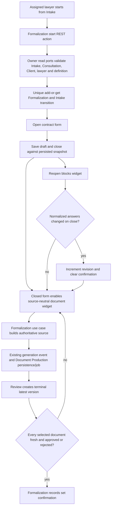

# 1. Context and scope

## Delivery outcome

Spec revision 8 was implemented across Core, Validation, Server and Web and is
delivered through the dependent PR chain [#89](https://github.com/hms-society/hms/pull/89),
[#90](https://github.com/hms-society/hms/pull/90),
[#91](https://github.com/hms-society/hms/pull/91) and
[#92](https://github.com/hms-society/hms/pull/92); all applicable PR CI checks
passed. Detailed acceptance, runtime, visual and CI evidence is maintained in
[`evaluation.md`](./evaluation.md).

## Objective and source

Deliver the complete-mode foundation described by Jira `SCRUM-139`: an assigned
lawyer or administrator can create or reopen the single Formalization associated with an Intake,
record database-defined commercial conditions, operate the existing Document
Production flow in a Formalization context and confirm the document set without
starting signature or contracting.

The governing product authority is the current Formalization PRD. The current
Document Production PRD governs document/version ownership. Direct decisions in
this task resolve the example-only status of the Pencil form, functional closure
without contracting, form close/reopen semantics, removal of batch generation and
the terminal version rule for document-set confirmation.

## Current behavior and product gap

The Intake page currently changes the Intake to `in_formalization` but has no
Formalization aggregate or destination page. Its placeholder can transition the
Intake directly to `contracted`. Core, Server and Web have no Formalization module.
Document Production already recognizes a `formalization` context and generation
moment, but every browser-facing document operation is coupled to Consultation.

## Scope and product alignment

| Area | In scope | Out of scope |
| --- | --- | --- |
| Formalization lifecycle | One aggregate per Intake; idempotent start; open/closed contract form; functional closure without contract; assigned-lawyer and administrator access | Contract confirmation, Case creation, reactivating a cancelled Formalization |
| Commercial conditions | Database-defined form, immutable definition snapshot, persisted replacement while open, draft answers, close/reopen, typed server validation, completion progress | Finance form builder/publication, multiple simultaneous forms, hardcoded JSX matching the Pencil example |
| Document Production | Source-neutral reuse of current Consultation widget and individual operations; Formalization source snapshot; terminal-version confirmation | Batch generation, download, signatures, Documenso, pending-marker expansion, unrelated Consultation behavior changes |
| Experience | Pencil-backed desktop hierarchy; narrow viewport; dark mode; keyboard and error states | Treating fixture names, values, counts or option lists as product enums |

| Source requirement | Delivery | Notes |
| --- | --- | --- |
| PRD REQ-001 — one Formalization per Intake | full | Initial state is `in_progress`; database uniqueness and create-or-get semantics cover retries/concurrency. |
| PRD REQ-002 — lifecycle | partial | This delivery creates `in_progress` and supports terminal `cancelled`; completion through contracting remains deferred. |
| PRD REQ-003/004 — versions and package confirmation | partial | Confirmation belongs to Formalization, accepts fresh latest versions with review decision `approved` or `rejected`, and creates no signature request. Signing remains deferred. |
| Jira — fixed dynamic commercial form | full | The initial seeded definition contains the listed commercial concerns, but the renderer and domain contract are generic. |
| Jira — preserve Consultation document capabilities | partial | Individual selection/generation/cancel/retry/review/edit/decision/current/history are included. Batch and download are intentionally excluded. |
| Jira — immutable `DocumentGenerationSource` | full | The server builds and publishes the complete snapshot; the browser cannot provide authoritative source data. |
| Jira — demonstrable seed and full-stack validation | full | Seed, persistence, authorization, responsive and authenticated real-service proof are contracted. |

## Product decisions and accepted assumptions

- `zetNe` is an illustrative definition and answer set. Field keys, labels,
  options, progress counts and values come from the persisted snapshot.
- The shared form vocabulary gains single selection, integer, currency and
  percentage types. Numeric answers are numbers; formatting is presentation only.
- `Salvar rascunho` persists valid provided values without requiring completeness.
  `Fechar formulário` atomically saves the submitted answers and changes the form
  to `closed` only after all definition rules pass.
- Reopening changes only the form state and blocks all Document Production actions.
  Closing it unchanged preserves documents and confirmation. Closing it with changed
  normalized answers increments the form revision, clears confirmation and makes all
  selected documents stale until each has a new version derived from that revision;
  old versions stay in history.
- `Encerrar sem contratação` is functional, requires the existing Intake closure
  reason and optional notes, and atomically cancels the Formalization and closes the
  linked Intake without a contract. Both transitions use optimistic versions inside
  one server transaction; it is terminal and retry-safe.
- Package confirmation requires at least one selected document and, for every
  selected document, a latest version derived from the current form revision whose
  status is `approved` or `rejected`. Historical versions do not independently block.
- The public page uses `/formalizacoes/$formalizationId`. Starting from an Intake is
  one server-owned create-or-get action and then navigates to that resource.
- Administrators may open and operate any Formalization. The assigned lawyer remains
  the responsible owner and is preserved in the Formalization projection; the
  authenticated administrator is recorded as the actor for audit fields.
- While the Formalization is `in_progress` and its contract form is `open`, the
  assigned lawyer or an administrator may replace the contract form from the
  available `formalization`-context definitions matching the Intake legal area and
  topic. Replacement persists a new immutable snapshot, clears all existing
  answers, resets the form revision to `0`, and clears any close/confirmation
  metadata. Closed, cancelled or document-confirmed Formalizations cannot replace
  the form.
- Revision 7 adds two temporary seeded Cível/Formalization definitions intended for
  exercising replacement: `Ficha provisória de contratação` and
  `Ficha complementar de contratação`. The existing commercial definition remains
  the default seed selection.
- Revision 8 makes legal inheritance explicit: `legalAreaId` and `legalTopicId` are
  copied from the Intake when the Formalization is created, exposed on the
  Formalization projection, and used as the authoritative context for replacing its
  contract form. They remain optional because the Intake contract permits an
  unclassified demand; legacy rows without the copied values fall back to their
  Intake reference until reseeded.
- Plan-backed implementation is recommended because delivery crosses Core,
  Validation, Server persistence/REST, Web extraction, migration, seed and security.

# 2. Implementation Contract

## Functional requirements

| ID | PRD/Jira/source coverage | Required behavior |
| --- | --- | --- |
| `RF-01` | PRD REQ-001; Jira “uma Formalização por Intake” | Starting Formalization from an eligible Intake returns the existing aggregate or creates exactly one `in_progress` aggregate linked to Intake, Client, completed Consultation and currently assigned lawyer, then opens its page. |
| `RF-02` | Jira access restriction; direct product decision | The currently assigned lawyer and administrators can read or mutate the Formalization, form or produced documents. Other authenticated collaborators and knowledge of an ID alone grant no access. |
| `RF-03` | Jira minimum page context; Pencil `F2GBfU` | The page shows Client, Intake, Consultation origin/context and assigned lawyer from server-authoritative projections, plus current Formalization/form/document states. |
| `RF-04` | Jira dynamic form; direct decision | The initial definition is seeded in the database, selected by Formalization purpose plus Intake legal context, snapshotted at creation and rendered generically. It includes the ticket’s commercial concerns without making the Pencil fixture a fixed UI schema. |
| `RF-05` | Jira persistence/validation; direct decision | The assigned lawyer or an administrator can save a draft, close a complete valid form and later reopen it. The server validates IDs, types, options, numeric constraints, required and conditional rules against the persisted snapshot and returns field-addressable errors. |
| `RF-05A` | Direct decision; revision 7 | While the aggregate is active and the contract form is open, the assigned lawyer or an administrator can explicitly select a different available Formalization form matching the Intake context. The server persists the selected definition snapshot, clears answers, resets revision/close/confirmation metadata, and returns the new aggregate version. |
| `RF-05B` | Direct decision; revision 8 | Formalization creation copies the Intake legal area/topic into its own projection. Contract-form discovery and replacement use those inherited values; no UI or client payload can override them. |
| `RF-06` | Direct decision on reopen | Document Production is blocked while the form is open. Reclosing unchanged preserves its state; reclosing changed increments the revision, invalidates confirmation and requires a fresh version for every selected document while retaining history. |
| `RF-07` | Jira reuse of Consultation document production | With the form closed, the assigned lawyer or an administrator can select applicable Formalization specifications, generate one document, cancel/retry it, review/edit a version, approve/reject it, choose the current version and inspect history through one source-neutral widget. There is no batch or download action. |
| `RF-08` | Jira authoritative generation source | Each generation persists an immutable server-built snapshot containing the current form definition/answers/revision and necessary Intake, Consultation, Client and assigned-lawyer data. Browser data cannot replace that source and Document Production does not reread source modules. |
| `RF-09` | Direct confirmation decision; PRD ownership | Formalization confirms its document set only when the form is closed, at least one document is selected, and every selected document has a fresh latest version in `approved` or `rejected`. Confirmation records actor, time and form revision and creates no signature request. |
| `RF-10` | Direct closure decision; PRD REQ-002 | The assigned lawyer or an administrator can close without contracting through a reason/notes confirmation. Successful closure leaves both Formalization `cancelled` and Intake `closed_without_contract`; retries converge and terminal content is read-only. |
| `RF-11` | Jira scope exclusions; Pencil `F2GBfU` | Signature configuration and contract confirmation remain disabled explanatory placeholders; no Intake transition to `contracted` is exposed by this page. |
| `RF-12` | Jira experience acceptance; design authority | All load/save/failure/forbidden/locked/stale states are visible and accessible; the supplied desktop hierarchy, dark theme, 390px layout and keyboard path work without console, hydration or unexpected network errors. |

## Acceptance criteria

| ID | RF coverage | Requirement | Given | When | Then | Expected evidence |
| --- | --- | --- | --- | --- | --- | --- |
| `CA-01` | `RF-01`, `RF-03` | Idempotent start and reload | An eligible Intake with Client, completed Consultation and assigned lawyer | The assigned lawyer starts Formalization repeatedly or two requests race | One aggregate/row exists, every response identifies it, the Intake is `in_formalization`, and reload restores the same page context | Core concurrency tests; Server database/controller tests; Web route test; `MV-01` |
| `CA-02` | `RF-01` | Reject invalid source | The Intake is absent, terminal, lacks a completed Consultation or has no assigned lawyer/applicable definition | Start is requested | No partial Formalization or Intake transition is committed and a named safe error is returned | Core and Server tests |
| `CA-03` | `RF-02` | Assigned-lawyer and administrator authorization | A Formalization belongs to lawyer A | Another lawyer or an administrator reads or mutates any form/document endpoint | The other lawyer receives 403 without content disclosure; the administrator can operate it, while ownership remains assigned to lawyer A and audit fields identify the administrator | Use-case tests; security-sensitive controller tests; `MV-02` |
| `CA-04` | `RF-04`, `RF-05` | Definition-driven rendering | A snapshot contains all supported types/options/rules | The page loads | Controls, labels, required/conditional state, progress and persisted answers derive from the snapshot; fixture values are not embedded in JSX | Shared widget tests; Web route test; `MV-01` |
| `CA-05` | `RF-05` | Draft persistence and field errors | The form is open | A valid partial draft is saved, reloaded, then an invalid value is submitted | Valid answers survive reload; invalid input is rejected without losing edits; `field:<fieldId>` issues and a form-level fallback are visible and associated with controls | Core validator tests; REST tests; Web action/widget tests |
| `CA-05A` | `RF-05A` | Replace and persist contract form | An active Formalization has an open form and at least two available Formalization definitions match the Intake context | An authorized actor selects and confirms another form, then reloads | The new form ID/snapshot/version persist, all previous answers are cleared, revision is `0`, and closed/confirmation metadata is absent; closed/cancelled/confirmed forms reject replacement | Core/use-case tests; REST/controller test; seeded database assertion; Web widget/route test |
| `CA-05B` | `RF-05B` | Inherit legal context | An Intake has legal area/topic values | Formalization starts and later lists/replaces a contract form | The Formalization projection contains the same values and form discovery uses those inherited values; omitted Intake values remain omitted | Core start test; Server persistence/seed test; Web selector request evidence |
| `CA-06` | `RF-05`, `RF-06` | Close/reopen revision semantics | The form is open with a complete valid draft | It is closed, reopened and closed with or without normalized changes | Initial close enables documents; unchanged reclose preserves revision/confirmation; changed reclose increments revision, clears confirmation and makes every selected document stale | Core lifecycle tests; database persistence test; Web tests; `MV-01` |
| `CA-07` | `RF-06`, `RF-07` | Document lock and selection | The form is open or closed | The assigned lawyer or an administrator enters document controls | While open all reads/actions are blocked with explanatory copy; while closed applicable Formalization specifications can be selected without losing versioned documents | Core/Server selection tests; Web widget/route tests |
| `CA-08` | `RF-07`, `RF-08` | Individual generation and immutable source | A selected document needs a version for current revision | The assigned lawyer or an administrator generates, cancels or retries it | Only one requested document is acted on; pending/polling/failure recovery is visible; the persisted generation contains the exact server-built current snapshot | Core event tests; Server event/controller tests; existing Document Production job regression |
| `CA-09` | `RF-07` | Review lifecycle | A generation produced a version | The assigned lawyer or an administrator edits/reviews it, approves or rejects it, changes current version or opens history | Existing Consultation-equivalent individual behavior works through shared UI logic; no batch/download control appears | Core use-case tests; Server controller tests; shared/Consultation/Formalization Web regressions |
| `CA-10` | `RF-09` | Confirm terminal fresh set | The form is closed and selected documents have combinations of missing, stale, pending, approved and rejected latest versions | Confirmation is attempted | It fails unless every selected document has a fresh latest `approved` or `rejected` version and at least one document exists; success records actor/time/revision once and emits no signature event | Core truth-table tests; Server persistence/controller tests; Web eligibility test |
| `CA-11` | `RF-10`, `RF-11` | Close without contract | The Formalization is active | The assigned lawyer or an administrator confirms an existing closure reason and optional notes, including retry after an interrupted response | Formalization becomes `cancelled`, Intake becomes `closed_without_contract`, content becomes read-only and no contracting/Case/signature side effect occurs | Core convergence tests; Server controller test; Web dialog/action test; `MV-01` |
| `CA-12` | `RF-12` | Responsive accessible experience | Seeded assigned-lawyer data exists | The complete flow runs at desktop and `390 × 844`, in light/dark and by keyboard | No horizontal overflow; focus and accessible names/errors/locks are correct; no console error, hydration warning or unexpected 4xx/5xx occurs | Web integration; screenshots; `MV-01` |
| `CA-13` | `RF-01`, `RF-04`, `RF-08` | Deterministic seed | The canonical seed is run more than once through its supported clear/run workflow | Formalization fixtures are loaded | One `in_formalization` scenario has matching Intake, Consultation, Client, lawyer, example definition/answers and Formalization-compatible document models without duplicate logical records | Server seed/database test; `MV-01` |

## Cross-cutting restrictions

| Concern | Contract |
| --- | --- |
| Trust | Actor, references, form snapshot, legal applicability and generation source are resolved server-side. The browser sends only identifiers, optimistic version, answers and action data. |
| Ownership | Formalization owns form lifecycle and set confirmation; Document Production owns documents, versions, generations and immutable stored sources; Intake owns closure status/reason. |
| Concurrency | Aggregate updates use `expectedVersion`; start is protected by a unique Intake key and add-or-get semantics; confirmation and closure are idempotent. |
| Historical integrity | Definition snapshots, answer revisions, generation sources and document versions are not rewritten after use. |
| PII | Generation source includes only fields enumerated by `FormalizationDocumentSourceData`; logs and errors never print answer payloads, tax IDs, contact/address data or document content. |

## Design Contract

The implementation must use the [design manifest](design/manifest.md) and its seven
verified PNGs. `F2GBfU` governs page hierarchy, `zetNe` the illustrative dynamic-form
card, `Z3Ll2j` the reusable package composition, and `b2f2jS`, `nFKJE`, `ZLBTF` and
`USNIG` the explicit close-form, reopen-form, package-confirmation and
close-without-contract dialogs. Accepted functional deviations, transient-state
assumptions, responsive behavior and validation targets are recorded in the manifest
and are normative.

# 3. Technical Contract

## Current technical state

| Evidence | Current responsibility | Gap |
| --- | --- | --- |
| `packages/core/src/shared/domain/**/dynamic-form-*` | Five field types, snapshot and string/boolean/list/null answers | No numeric/single-choice vocabulary, generic rule metadata or reusable snapshot validator |
| `packages/core/src/consultation/**` | Aggregate-local form snapshot and complete individual document orchestration | Consultation-specific names, admin document exception and stale package-owned confirmation cannot be copied |
| `packages/core/src/document-production/domain/structures/document-generation-source.ts` | Already accepts `formalization` source envelopes | Formalization producer and exact data projection are absent |
| `apps/server/src/document-production/**` | Persists and forwards sources unchanged; package context supports Formalization | No Formalization server module, producer REST, persistence, authorization or seed |
| `apps/web/src/ui/document-production/widgets/pages/consultation-documents-page/**` | Current package/list/action behavior | Page, hooks, cache keys, review navigation and REST service are Consultation-coupled |
| `apps/web/src/ui/intake/widgets/pages/intake-details-page/**` | Starts status transition and displays placeholder contract action | Does not create/open Formalization and incorrectly exposes direct contracting |

## Technical decisions

| Decision | Contract and rationale |
| --- | --- |
| Aggregate persistence | Store snapshot, answers, form state/revision and Formalization-owned confirmation on `formalizations`; one unique `intake_id`. This follows Consultation’s aggregate-local precedent and avoids an unapproved generic form-instance subsystem. |
| Purpose/applicability | A definition used here has `formalization_contract` purpose context plus legal area/topic context. Purpose prevents selecting a Consultation form. Options remain definition data, not Core enums. |
| Fresh document proof | A version is fresh when it or its `sourceDocumentVersionId` ancestry resolves to a generation whose `source.type`/`id` match the Formalization and whose source data has the current `contractFormRevision`. No historical row is mutated to simulate freshness. |
| Module reads | Intake, Consultation and Identity expose narrow owner-implemented read/command ports. Formalization never imports sibling Drizzle tables/repositories; Document Production consumes only the published source. |
| Closure convergence | The Formalization use case calls an Intake-owned closure boundary carrying both aggregate versions. The Server executes the Intake and Formalization CAS updates in one transaction, rolls back both on conflict, and treats an already converged cancellation as idempotent; no external event is emitted before both states converge. |
| REST errors | Authentication is 401, ownership is 403, absence is 404, optimistic/state conflict is 409 and syntactic/field validation is 400 with stable `issues[{path,message}]`. |
| UI reuse | Extract a source-neutral Web view model/component/actions. Consultation remains an adapter and keeps its existing behavior; Formalization injects its stricter lock/freshness/confirmation capabilities. |
| Structure mutability | `Formalization` remains a mutable Entity apart from its inherited identity. `DynamicFormFieldValidation` is readonly because it is fixed definition metadata. `FormalizationDocumentSourceData` is recursively readonly and converts dates to ISO strings because it crosses persistence/messaging as an immutable historical snapshot. No other Structure receives `readonly` by convention. |

## Solution and runtime flow



Start validates all prerequisites before transitioning the Intake. Repository
uniqueness is the final race guarantee. Form writes are conditional on
`expectedVersion`; the server normalizes numeric values before comparing revisions.
Generation creation and broker publication reuse the established event sequence; no
source-module read occurs after publication. Provider/job retry owns asynchronous
generation failures. Web polling owns only user feedback and never creates duplicate
generation requests.

## Runtime boundaries

| Boundary | Producer | Consumer | Canonical contract | Mapping/guarantees | Failure ownership |
| --- | --- | --- | --- | --- | --- |
| HTTP form write | `FormalizationService` | Formalization controllers/use cases | Validation schemas and `DynamicFormAnswer[]` | `expectedVersion`; field IDs/values only; persisted snapshot is authoritative | Zod handles shape; Core returns named field/state/version errors |
| Owner source reads | Formalization use cases | Intake/Consultation/Identity adapters | Narrow source projections | Server-authenticated references; no browser override or sibling table import | Owning port returns not-found/ineligible; Formalization translates safely |
| Generation event | `GenerateFormalizationDocumentUseCase` | existing Document Production job | `DocumentGenerationRequestedEvent` with `DocumentGenerationSource<FormalizationDocumentSourceData>` | JSON-safe deep snapshot; current form revision; add-or-get generation | Producer validates completeness; existing job owns provider retry/failure |
| Version freshness | Formalization list/confirm use cases | Web projection and confirmation | generation source revision reached through version ancestry | Old versions remain readable but cannot satisfy current revision | Formalization use case returns stale state/confirmation error |
| Closure command | `CloseFormalizationWithoutContractUseCase` | Intake-owned close service and Formalizations repository | closure reason/notes, actor and optimistic versions | Idempotent ordered convergence; no contract/signature effect | Use case returns 409 on unresolved version conflict and supports retry |

## `packages/core` — Domain

| Path | Change | Declaration | Domain role/schema | Invariants/transitions | Errors/events | Exports/consumers |
| --- | --- | --- | --- | --- | --- | --- |
| `packages/core/src/shared/domain/structures/dynamic-form-field-type.ts` | Modify | `DynamicFormFieldType` Structure | Add `single_selection`, `integer`, `currency`, `percentage` | Values map to the answer contract below | Validation errors are use-case owned | Shared barrel; form renderer/validator |
| `packages/core/src/shared/domain/structures/dynamic-form-answer-value.ts` | Modify | `DynamicFormAnswerValue` Structure | Add finite `number` | Currency precision and percentage/range come from field validation | — | Snapshot answer consumers |
| `packages/core/src/shared/domain/structures/dynamic-form-field-validation.ts` | Create | `DynamicFormFieldValidation` Structure | Immutable numeric and conditional definition metadata | `min <= max`; scale is a non-negative integer; `requiredWhen` references another field key | Invalid definition is rejected at seed/boundary | Shared barrel; field entity/validator/Web |
| `packages/core/src/shared/domain/entities/dynamic-form-field.ts` | Modify | `DynamicFormField` Entity | Add optional `validation` | Selection types require options; non-selection fields cannot depend on option membership | Named definition/answer errors | Dynamic form/snapshot |
| `packages/core/src/formalization/domain/structures/formalization-status.ts` | Create | `FormalizationStatus` Structure | `in_progress`, `completed`, `cancelled` | This delivery creates `in_progress` and may transition to `cancelled`; terminal states read-only | `InvalidFormalizationStateError` | Formalization entity/persistence |
| `packages/core/src/formalization/domain/structures/formalization-contract-form-state.ts` | Create | `FormalizationContractFormState` Structure | `open`, `closed` | Documents require `closed` | `FormalizationContractFormOpenError` | Formalization entity/use cases |
| `packages/core/src/formalization/domain/entities/formalization.ts` | Create | `Formalization` Entity | Aggregate root defined below | One per Intake; revision starts 1 after first close; changed reclose increments; terminal status read-only | Formalization named errors | Repository/use cases/REST |
| `packages/core/src/formalization/domain/structures/formalization-document-source-data.ts` | Create | `FormalizationDocumentSourceData` Structure | JSON-safe snapshot made deeply immutable by the file-local `ImmutableSnapshot<T>` helper | IDs match aggregate; form is closed; revision equals aggregate; dates serialize as ISO strings; contains no provider/transport types | `InvalidFormalizationGenerationSourceError` | Generation event/workflow |
| `packages/core/src/formalization/domain/errors/index.ts` | Create | Formalization named errors | Not found, access denied, ineligible source, form validation/open/stale documents, confirmation/state/version conflict | Transport independent | Errors extend existing shared error categories | Use cases/REST mapper |
| `packages/core/src/formalization/domain/index.ts` | Create | Domain barrel | Export Formalization declarations | — | — | Package subpaths |

```ts
// packages/core/src/shared/domain/structures/dynamic-form-field-validation.ts
export const DynamicFormFieldType = {
  ShortText: 'short_text',
  LongText: 'long_text',
  Date: 'date',
  Boolean: 'boolean',
  MultipleSelection: 'multiple_selection',
  SingleSelection: 'single_selection',
  Integer: 'integer',
  Currency: 'currency',
  Percentage: 'percentage',
} as const

export type DynamicFormFieldType =
  (typeof DynamicFormFieldType)[keyof typeof DynamicFormFieldType]

export type DynamicFormFieldValidation = {
  readonly min?: number
  readonly max?: number
  readonly scale?: number
  readonly requiredWhen?: {
    readonly fieldKey: string
    readonly equals: string | boolean | number
  }
}

// resulting shared declarations
export type DynamicFormAnswerValue = string | number | boolean | string[] | null

export type DynamicFormField = Entity & {
  key: string
  label: string
  type: DynamicFormFieldType
  position: number
  required: boolean
  description?: string
  placeholder?: string
  options?: DynamicFormFieldOption[]
  validation?: DynamicFormFieldValidation
}
```

**Allowed values — `DynamicFormFieldType`**

| Value | Answer shape | Contract |
| --- | --- | --- |
| `short_text`, `long_text`, `date` | `string \| null` | Trim text; date uses `YYYY-MM-DD` at the boundary |
| `boolean` | `boolean \| null` | `false` is an answered value |
| `multiple_selection` | `string[] \| null` | Unique values must belong to options |
| `single_selection` | `string \| null` | Value must belong to options |
| `integer` | `number \| null` | Finite integer within configured range |
| `currency` | `number \| null` | Finite value within range/scale; BRL formatting is UI-only |
| `percentage` | `number \| null` | Finite value, default domain range `0..100`, further constrained by metadata |

**Schema — `DynamicFormFieldValidation`**

| Field | Type | Required | Validation | Description |
| --- | --- | --- | --- | --- |
| `min` | `number` | No | finite; not greater than `max` | Inclusive numeric minimum |
| `max` | `number` | No | finite; not less than `min` | Inclusive numeric maximum |
| `scale` | `number` | No | integer `>= 0` | Maximum decimal places |
| `requiredWhen` | `{ readonly fieldKey: string; readonly equals: string \| boolean \| number }` | No | referenced key must exist and cannot self-reference | Immutable conditional-requiredness configuration |

**Schema — `DynamicFormField`**

| Field | Type | Required | Validation | Description |
| --- | --- | --- | --- | --- |
| `id` | `string` | Yes | UUID; stable in snapshots | Field identity used by answers/errors |
| `key` | `string` | Yes | non-empty; unique in definition | Stable semantic key for dependencies |
| `label` | `string` | Yes | non-empty | Visible label from definition |
| `type` | `DynamicFormFieldType` | Yes | allowed value above | Renderer/validator discriminator |
| `position` | `number` | Yes | integer `>= 0`; unique ordering recommended | Display order |
| `required` | `boolean` | Yes | — | Unconditional requiredness |
| `description` | `string` | No | trimmed | Supporting copy |
| `placeholder` | `string` | No | trimmed | Control hint, never a label |
| `options` | `DynamicFormFieldOption[]` | No | required and non-empty for selection types; unique values/positions | Definition-owned choices |
| `validation` | `DynamicFormFieldValidation` | No | compatible with field type | Numeric/conditional rules |

```ts
// packages/core/src/formalization/domain/structures/formalization-status.ts
export const FormalizationStatus = {
  InProgress: 'in_progress',
  Completed: 'completed',
  Cancelled: 'cancelled',
} as const

export type FormalizationStatus =
  (typeof FormalizationStatus)[keyof typeof FormalizationStatus]

// packages/core/src/formalization/domain/structures/formalization-contract-form-state.ts
export const FormalizationContractFormState = {
  Open: 'open',
  Closed: 'closed',
} as const

export type FormalizationContractFormState =
  (typeof FormalizationContractFormState)[keyof typeof FormalizationContractFormState]
```

**Allowed values — lifecycle structures**

| Declaration | Value | Contract |
| --- | --- | --- |
| `FormalizationStatus` | `in_progress` | Editable lifecycle; form/document operations still depend on form state |
| `FormalizationStatus` | `completed` | Reserved terminal state for later contracting delivery; never created here |
| `FormalizationStatus` | `cancelled` | Terminal/read-only closure without contract |
| `FormalizationContractFormState` | `open` | Draft/reopen state; all document operations blocked |
| `FormalizationContractFormState` | `closed` | Complete valid answers; document operations may proceed |

```ts
// packages/core/src/formalization/domain/entities/formalization.ts
export type Formalization = Entity & {
  intakeId: string
  clientId: string
  consultationId: string
  assignedLawyerId: string
  legalAreaId?: string
  legalTopicId?: string
  status: FormalizationStatus
  contractFormId: string
  contractFormSnapshot: DynamicFormSnapshot
  contractFormAnswers: DynamicFormAnswer[]
  contractFormState: FormalizationContractFormState
  contractFormRevision: number
  contractFormClosedAt?: Date
  contractFormClosedByCollaboratorId?: string
  documentsConfirmedAt?: Date
  documentsConfirmedByCollaboratorId?: string
  documentsConfirmedRevision?: number
  cancelledAt?: Date
  cancelledByCollaboratorId?: string
  version: number
  createdAt: Date
  updatedAt: Date
}
```

**Schema — `Formalization`**

| Field | Type | Required | Validation | Description |
| --- | --- | --- | --- | --- |
| `id` | `string` | Yes | UUID | Aggregate identity |
| `intakeId` | `string` | Yes | UUID; globally unique in repository | Owning Intake reference |
| `clientId` | `string` | Yes | UUID; must match Intake/Consultation | Single Client reference |
| `consultationId` | `string` | Yes | UUID; completed Consultation for Intake | Consultation reference |
| `assignedLawyerId` | `string` | Yes | UUID; current assigned lawyer | Sole form/document actor |
| `legalAreaId` | `string` | No | UUID; copied from Intake when classified | Inherited legal-area context for form discovery |
| `legalTopicId` | `string` | No | UUID; copied from Intake when classified | Inherited legal-topic context for form discovery |
| `status` | `FormalizationStatus` | Yes | initial `in_progress` | Aggregate lifecycle |
| `contractFormId` | `string` | Yes | UUID | Original definition reference |
| `contractFormSnapshot` | `DynamicFormSnapshot` | Yes | immutable definition copy | Authoritative validation/rendering definition |
| `contractFormAnswers` | `DynamicFormAnswer[]` | Yes | unique known field IDs | Mutable aggregate state containing the latest normalized answers; historical immutability belongs to generation snapshots |
| `contractFormState` | `FormalizationContractFormState` | Yes | initial `open` | Form lifecycle/Document Production gate |
| `contractFormRevision` | `number` | Yes | integer `>= 0`; starts `0`, first close becomes `1` | Freshness discriminator |
| `contractFormClosedAt` | `Date` | No | present when closed | Latest close time |
| `contractFormClosedByCollaboratorId` | `string` | No | UUID; present when closed | Latest closing actor |
| `documentsConfirmedAt` | `Date` | No | all confirmation fields co-present | Confirmation time |
| `documentsConfirmedByCollaboratorId` | `string` | No | UUID | Confirmation actor |
| `documentsConfirmedRevision` | `number` | No | equals current revision while valid | Confirmed source revision |
| `cancelledAt` | `Date` | No | present iff `cancelled` | Terminal time |
| `cancelledByCollaboratorId` | `string` | No | UUID; present iff `cancelled` | Terminal actor |
| `version` | `number` | Yes | integer `>= 1`; conditional update | Optimistic concurrency |
| `createdAt` | `Date` | Yes | immutable | Creation time |
| `updatedAt` | `Date` | Yes | monotonic | Last aggregate update |

```ts
// packages/core/src/formalization/domain/structures/formalization-document-source-data.ts
type ImmutableSnapshot<T> = T extends Date
  ? string
  : T extends readonly (infer Item)[]
    ? readonly ImmutableSnapshot<Item>[]
    : T extends object
      ? { readonly [Key in keyof T]: ImmutableSnapshot<T[Key]> }
      : T

type FormalizationDocumentSourceDataBase = {
  formalization: {
    id: string
    contractFormRevision: number
    contractFormSnapshot: DynamicFormSnapshot
    contractFormAnswers: DynamicFormAnswer[]
  }
  intake: {
    id: string
    sequenceNumber: number
    legalAreaId?: string
    legalTopicId?: string
    demandNotes?: string
  }
  consultation: {
    id: string
    primaryLegalQuestion: string
    guidanceProvided: string
    relevantFacts: Consultation['relevantFacts']
    potentialLegalRequests: Consultation['potentialLegalRequests']
    identifiedRisks: Consultation['identifiedRisks']
    suggestions: Consultation['suggestions']
    dynamicFormSnapshot?: DynamicFormSnapshot
    dynamicFormAnswers?: DynamicFormAnswer[]
  }
  client:
    | Pick<NaturalClient, 'id' | 'type' | 'name' | 'taxId' | 'email' | 'phone' | 'address'>
    | Pick<LegalClient, 'id' | 'type' | 'legalName' | 'tradeName' | 'taxId' | 'email' | 'phone' | 'address'>
  assignedLawyer: Pick<
    Collaborator,
    'id' | 'professionalName' | 'jobTitle' | 'profile' | 'legalExpertises'
  >
}

export type FormalizationDocumentSourceData =
  ImmutableSnapshot<FormalizationDocumentSourceDataBase>
```

**Schema — `FormalizationDocumentSourceData`**

| Field | Type | Required | Validation | Description |
| --- | --- | --- | --- | --- |
| `formalization` | deeply readonly form ID/revision/snapshot/answers projection | Yes | closed current revision; recursive arrays/objects immutable | Commercial source of truth |
| `intake` | deeply readonly ID/sequence/legal context/demand projection | Yes | IDs match aggregate | Intake context |
| `consultation` | deeply readonly completed attendance projection | Yes | same Intake/Client/lawyer; every `Date` becomes an ISO string | Consultation facts and advice |
| `client` | deeply readonly discriminated natural/legal identity/contact projection | Yes | same Client reference; nested address/tax ID immutable | Contracting party data |
| `assignedLawyer` | deeply readonly professional collaborator projection | Yes | profile is current assigned lawyer; expertise collections immutable | Responsible professional data |

## `packages/core` — Use cases and Interfaces

| Path | Change | Declarations and contract |
| --- | --- | --- |
| `packages/core/src/shared/use-cases/validate-dynamic-form-answers-use-case.ts` | Create | `ValidateDynamicFormAnswersUseCase` validates definition integrity and supplied answers against a snapshot in `draft` or `complete` mode; returns normalized unique answers or field-addressable issues. Consultation may adopt it without behavior regression. |
| `packages/core/src/shared/use-cases/tests/validate-dynamic-form-answers-use-case.test.ts` | Create | Validator unit suite covers every type/rule/mode, duplicate/unknown IDs and normalization. |
| `packages/core/src/formalization/use-cases/start-formalization-use-case.ts` | Create | `StartFormalizationUseCase.execute({ intakeId, actorId })` authorizes the current assigned lawyer, loads owner projections/definition, validates eligibility and calls concurrency-safe `addOrGet`; no partial Intake transition on prerequisite failure. |
| `packages/core/src/formalization/use-cases/get-formalization-use-case.ts` | Create | Returns the authorized aggregate plus Client/Intake/Consultation/lawyer projection and form state. |
| `packages/core/src/formalization/use-cases/save-formalization-contract-form-draft-use-case.ts` | Create | Validates provided values in draft mode and conditionally persists answers. |
| `packages/core/src/formalization/use-cases/replace-formalization-contract-form-use-case.ts` | Create | Authorizes an open active aggregate, resolves a matching Formalization-context definition, clears answers and close/confirmation metadata, snapshots the definition and conditionally persists the replacement. |
| `packages/core/src/formalization/use-cases/close-formalization-contract-form-use-case.ts` | Create | Complete validation; normalized change detection; revision/confirmation rules from `RF-06`; conditional replace. |
| `packages/core/src/formalization/use-cases/reopen-formalization-contract-form-use-case.ts` | Create | Opens an active form without changing answers/revision/confirmation; blocks document operations immediately. |
| `packages/core/src/formalization/use-cases/close-formalization-without-contract-use-case.ts` | Create | Uses Intake-owned closure command and conditionally cancels Formalization; retry converges already-closed Intake and active Formalization. |
| `packages/core/src/formalization/use-cases/get-formalization-document-selection-use-case.ts` | Create | Lists legal-context/`formalization` specifications only when form closed and actor authorized. |
| `packages/core/src/formalization/use-cases/replace-formalization-document-selection-use-case.ts` | Create | Reuses/creates Formalization package, preserves versioned items and applies actor/form locks. |
| `packages/core/src/formalization/use-cases/list-formalization-documents-use-case.ts` | Create | Produces source-neutral row projections including terminal status and freshness for current revision. |
| `packages/core/src/formalization/use-cases/generate-formalization-document-use-case.ts` | Create | Builds `FormalizationDocumentSourceData`, persists one pending generation and publishes one existing generation event after successful persistence. No batch method exists. |
| `packages/core/src/formalization/use-cases/cancel-formalization-document-generation-use-case.ts` | Create | Cancels the actor-owned pending generation using existing Document Production contracts. |
| `packages/core/src/formalization/use-cases/get-formalization-document-version-use-case.ts` | Create | Loads authorized content/history metadata for one version. |
| `packages/core/src/formalization/use-cases/save-manual-formalization-document-version-use-case.ts` | Create | Creates an edited descendant while preserving originating generation/revision ancestry. |
| `packages/core/src/formalization/use-cases/review-formalization-document-version-use-case.ts` | Create | Applies approve/reject rules and rejection reason through existing version contracts. |
| `packages/core/src/formalization/use-cases/select-current-formalization-document-version-use-case.ts` | Create | Selects an authorized version; freshness is computed, not rewritten. |
| `packages/core/src/formalization/use-cases/confirm-formalization-documents-use-case.ts` | Create | Applies the `RF-09` truth table and conditionally records confirmation on Formalization only; emits no signature event. |
| `packages/core/src/formalization/use-cases/tests` | Create | One focused unit test per named use case plus concurrency/retry, unauthorized admin/lawyer, revision freshness and exact source preservation. |
| `packages/core/src/formalization/interfaces/formalizations-repository.ts` | Create | `findById`, `findByIntakeId`, atomic `addOrGet`, conditional `replace`, `removeAll`; `addOrGet` returns the winner of unique-Intake races. |
| `packages/core/src/formalization/interfaces/formalization-source-reader.ts` | Create | Narrow server-side owner projection reads for Intake, completed Consultation, Client, assigned lawyer and applicable purpose/legal form; no persistence types. |
| `packages/core/src/formalization/interfaces/formalization-intake-closure-service.ts` | Create | Idempotent Intake-owned `closeWithoutContract` boundary carrying the linked Formalization, closure reason/notes and both expected aggregate versions. |
| `packages/core/src/formalization/interfaces/formalization-service.ts` | Create | Browser-facing start/get/draft/close/reopen/close-without-contract/confirm and individual document methods matching REST operations below. |
| `packages/core/src/formalization/interfaces/index.ts` | Create | Export Formalization ports. |
| `packages/core/src/formalization/domain/entities/index.ts` | Create | Export `Formalization`. |
| `packages/core/src/formalization/domain/structures/index.ts` | Create | Export Formalization status, form state and source structures. |
| `packages/core/src/formalization/use-cases/index.ts` | Create | Export Formalization actions. |
| `packages/core/src/formalization/index.ts` | Create | Feature barrel. |
| `packages/core/package.json` | Modify | Add `#formalization/*` imports and public `./formalization/*` exports without changing existing subpaths. |

All document use cases depend on shared Document Production repository/event interfaces,
not on its database declarations. Actor checks authorize the assigned lawyer or an
administrator; all audit fields continue to use the authenticated actor ID.

## `packages/validation` — Validation

| Path | Change | Schema/declaration | Fields/refinements | Consumers |
| --- | --- | --- | --- | --- |
| `packages/validation/src/formalization/schemas/formalization-contract-form-answers-schema.ts` | Create | `formalizationContractFormAnswersSchema` | UUID `fieldId`; value union includes finite numbers; duplicate/business checks remain Core-owned | Draft/close controllers and Web forms |
| `packages/validation/src/formalization/schemas/start-formalization-schema.ts` | Create | `startFormalizationSchema` | Semantic Intake UUID only; actor is excluded | Start controller |
| `packages/validation/src/formalization/schemas/update-formalization-contract-form-schema.ts` | Create | `updateFormalizationContractFormSchema` | `expectedVersion >= 1`, answers array | Draft/close controllers |
| `packages/validation/src/formalization/schemas/close-formalization-without-contract-schema.ts` | Create | `closeFormalizationWithoutContractSchema` | Reuses Intake closure reason/notes plus Formalization and Intake expected versions | Closure controller/Web dialog |
| `packages/validation/src/formalization/schemas/generate-formalization-document-schema.ts` | Create | `generateFormalizationDocumentSchema` | Reuses individual generation instruction shape; source excluded | Generation controller |
| `packages/validation/src/formalization/schemas/index.ts` | Create | Schema barrel | Exports schemas/types | Formalization root barrel |
| `packages/validation/src/formalization/index.ts` | Create | Feature barrel | Public exports | Core consumers via allowed Validation → Core dependency direction |
| `packages/validation/src/formalization/schemas/tests/formalization-schemas.test.ts` | Create | Schema suites | Numeric answers, request shapes and invalid transport values | Validation command |
| `packages/validation/package.json` | Modify | Package exports | Add `./formalization` subpath without a nonexistent root barrel | Server/Web |

The server returns `issues: { path: string; message: string }[]`; dynamic form paths are
`field:<fieldId>`. Requiredness, conditional dependencies, option membership, ranges and
revision/state are Core business rules, not duplicated in Zod.

## `apps/server` — Database

| Path | Change | Declaration/operation | Integrity/query contract | Registration/consumers |
| --- | --- | --- | --- | --- |
| `apps/server/src/formalization/constants/formalization-repositories.ts` | Create | `FORMALIZATIONS_REPOSITORY` token | One adapter binding | Formalization modules/controllers |
| `apps/server/src/formalization/database/drizzle/models/formalization-model.ts` | Create | `formalizationModel` | Model below; unique Intake and status/form-state checks | Schema barrel/repository |
| `apps/server/src/formalization/database/drizzle/types/entities/drizzle-formalization.ts` | Create | `DrizzleFormalization` | Inferred row type aligned with model | Mapper/repository |
| `apps/server/src/formalization/database/drizzle/mappers/drizzle-formalization-mapper.ts` | Create | `DrizzleFormalizationMapper` | Dates/JSON/nulls/version map losslessly | Repository |
| `apps/server/src/formalization/database/drizzle/repositories/drizzle-formalizations-repository.ts` | Create | `DrizzleFormalizationsRepository` | Conflict-safe add-or-get and compare-and-swap replace | Core port |
| `apps/server/src/formalization/database/formalization-database.module.ts` | Create | `FormalizationDatabaseModule` | Binds/exports token and seeder | Feature/seed modules |
| `apps/server/src/formalization/database/formalization-seeder.ts` | Create | `FormalizationSeeder` | Deterministic example instance/answers for seeded Intake | Canonical seed |
| `apps/server/src/formalization/database/drizzle/models/index.ts` | Create | Model barrel | Export `formalizationModel` | Schema/composition |
| `apps/server/src/formalization/database/drizzle/types/entities/index.ts` | Create | Entity-row barrel | Export `DrizzleFormalization` | Mapper/repository |
| `apps/server/src/formalization/database/drizzle/types/index.ts` | Create | Drizzle-type barrel | Export entity-row types | Database composition |
| `apps/server/src/formalization/database/drizzle/mappers/index.ts` | Create | Mapper barrel | Export `DrizzleFormalizationMapper` | Repository |
| `apps/server/src/formalization/database/drizzle/repositories/index.ts` | Create | Repository barrel | Export `DrizzleFormalizationsRepository` | Database module |
| `apps/server/src/formalization/database/index.ts` | Create | Database barrel | Export module/seeder | Feature/seed composition |
| `apps/server/src/shared/database/drizzle/schema.ts` | Modify | Schema barrel | Export `formalizationModel` | Drizzle generator/tests |
| `apps/server/src/shared/database/drizzle/migrations/<sequence>_<generated-name>.sql` | Generate | Formalizations migration | Generated only by `pnpm --filter server db:migration:generate` | Database fixture/deployment |
| `apps/server/src/shared/database/drizzle/migrations/meta/_journal.json` | Generate | Migration journal entry | Ordered after current latest migration | Drizzle migration runner |
| `apps/server/src/shared/database/drizzle/migrations/meta/<sequence>_snapshot.json` | Generate | Schema snapshot | Matches generated model | Future diffs |

### Table `formalizations`

| Column | Type | Nullable | Default | Description |
| --- | --- | --- | --- | --- |
| `id` | `uuid` | No | `gen_random_uuid()` or repository ID | Primary key |
| `intake_id` | `uuid` | No | — | Unique Intake reference, no cross-module FK |
| `client_id` | `uuid` | No | — | Client reference |
| `consultation_id` | `uuid` | No | — | Consultation reference |
| `assigned_lawyer_id` | `uuid` | No | — | Current assigned-lawyer reference |
| `status` | `text` | No | `in_progress` | Formalization lifecycle |
| `contract_form_id` | `uuid` | No | — | Definition reference |
| `contract_form_snapshot` | `jsonb` | No | — | Immutable copied definition |
| `contract_form_answers` | `jsonb` | No | `[]` | Latest normalized answers |
| `contract_form_state` | `text` | No | `open` | Form gate |
| `contract_form_revision` | `integer` | No | `0` | Freshness revision |
| `contract_form_closed_at` | `timestamptz` | Yes | — | Latest close time |
| `contract_form_closed_by_collaborator_id` | `uuid` | Yes | — | Latest close actor |
| `documents_confirmed_at` | `timestamptz` | Yes | — | Formalization-owned confirmation time |
| `documents_confirmed_by_collaborator_id` | `uuid` | Yes | — | Confirmation actor |
| `documents_confirmed_revision` | `integer` | Yes | — | Confirmed form revision |
| `cancelled_at` | `timestamptz` | Yes | — | Cancellation time |
| `cancelled_by_collaborator_id` | `uuid` | Yes | — | Cancellation actor |
| `version` | `integer` | No | `1` | Compare-and-swap version |
| `created_at` | `timestamptz` | No | `now()` | Creation time |
| `updated_at` | `timestamptz` | No | `now()` | Last update |

| Index name | Columns | Type | Purpose |
| --- | --- | --- | --- |
| `formalizations_pkey` | `id` | unique primary | Identity |
| `formalizations_intake_uq` | `intake_id` | unique | At most one aggregate per Intake under races |
| `formalizations_assigned_lawyer_idx` | `assigned_lawyer_id`, `status` | non-unique | Authorized lookup/support |

| Constraint | Type | Definition | Purpose |
| --- | --- | --- | --- |
| `formalizations_status_check` | check | status in `in_progress`, `completed`, `cancelled` | Domain state validity |
| `formalizations_form_state_check` | check | form state in `open`, `closed` | Form state validity |
| `formalizations_revision_check` | check | revision `>= 0` and version `>= 1` | Monotonic counters |
| `formalizations_confirmation_check` | check | confirmation columns are all null or all non-null | Prevent partial confirmation |
| `formalizations_cancellation_check` | check | cancellation columns present iff status is `cancelled` | Terminal-state integrity |

Migration delivery is additive; no backfill is required because the module is absent.
Generate model, SQL, journal and snapshot together, apply through the documented command
and prove the unique/check constraints with the real database fixture. PostgreSQL `jsonb`
and partial check expressions are intentional; no provider side effect belongs in the
migration transaction.

## `apps/server` — REST, Provision and Composition

| Operation | Server entry | Core action | Web method | Security/error owner |
| --- | --- | --- | --- | --- |
| `POST /formalizations/by-intake/:intakeId/start` | `StartFormalizationController` | `StartFormalizationUseCase` | `startByIntake` | Session actor; 403/404/409/400 |
| `GET /formalizations/:formalizationId` | `GetFormalizationController` | `GetFormalizationUseCase` | `get` | Assigned lawyer; safe 403/404 |
| `PATCH /formalizations/:formalizationId/contract-form/draft` | `SaveFormalizationContractFormDraftController` | draft use case | `saveContractFormDraft` | Actor + expected version; field issues |
| `PATCH /formalizations/:formalizationId/contract-form/close` | `CloseFormalizationContractFormController` | close use case | `closeContractForm` | Complete validation; 409 state/version |
| `PATCH /formalizations/:formalizationId/contract-form/reopen` | `ReopenFormalizationContractFormController` | reopen use case | `reopenContractForm` | Actor + expected version |
| `PUT /formalizations/:formalizationId/contract-form/definition` | `ReplaceFormalizationContractFormController` | replacement use case | `replaceContractForm` | Actor + expected version; open active form and matching Formalization context |
| `PATCH /formalizations/:formalizationId/close-without-contract` | `CloseFormalizationWithoutContractController` | closure use case | `closeWithoutContract` | Existing Intake reason schema; convergence |
| `GET/PUT /formalizations/:formalizationId/documents/selection` | selection controllers | selection use cases | `get/replaceDocumentSelection` | Form closed + actor |
| `GET /formalizations/:formalizationId/documents` | `ListFormalizationDocumentsController` | list use case | `listDocuments` | Freshness projection |
| `POST /formalizations/:formalizationId/documents/:documentId/generations` | `GenerateFormalizationDocumentController` | individual generation | `generateDocument` | Server-built source only |
| `PATCH /formalizations/:formalizationId/document-generations/:generationId/cancel` | cancellation controller | cancellation use case | `cancelGeneration` | Owned pending generation |
| `GET/PATCH /formalizations/:formalizationId/document-versions/:versionId` | version/read/manual-save/review/current controllers | matching individual use cases | `getVersion`, `saveManualVersion`, `reviewVersion`, `selectCurrentVersion` | Actor and version ownership |
| `PATCH /formalizations/:formalizationId/documents/confirm` | `ConfirmFormalizationDocumentsController` | confirmation use case | `confirmDocuments` | Closed/fresh/terminal truth table |

| Path | Change | Declaration/operation | Contract |
| --- | --- | --- | --- |
| `apps/server/src/formalization/decorators/formalizations-controller.decorator.ts` | Create | Base controller decorator | `/formalizations`, Swagger tag |
| `apps/server/src/formalization/rest/controllers/start-formalization.controller.ts`<br>`apps/server/src/formalization/rest/controllers/get-formalization.controller.ts`<br>`apps/server/src/formalization/rest/controllers/save-formalization-contract-form-draft.controller.ts`<br>`apps/server/src/formalization/rest/controllers/close-formalization-contract-form.controller.ts`<br>`apps/server/src/formalization/rest/controllers/reopen-formalization-contract-form.controller.ts`<br>`apps/server/src/formalization/rest/controllers/replace-formalization-contract-form.controller.ts`<br>`apps/server/src/formalization/rest/controllers/close-formalization-without-contract.controller.ts` | Create | Aggregate/form controllers | Thin schema/current-collaborator mapping; no authority decisions in transport |
| `apps/server/src/formalization/rest/controllers/get-formalization-document-selection.controller.ts`<br>`apps/server/src/formalization/rest/controllers/replace-formalization-document-selection.controller.ts`<br>`apps/server/src/formalization/rest/controllers/list-formalization-documents.controller.ts`<br>`apps/server/src/formalization/rest/controllers/generate-formalization-document.controller.ts`<br>`apps/server/src/formalization/rest/controllers/cancel-formalization-document-generation.controller.ts` | Create | Package/generation controllers | Actor/form gate and individual operations only; source is assembled by Core |
| `apps/server/src/formalization/rest/controllers/get-formalization-document-version.controller.ts`<br>`apps/server/src/formalization/rest/controllers/save-manual-formalization-document-version.controller.ts`<br>`apps/server/src/formalization/rest/controllers/review-formalization-document-version.controller.ts`<br>`apps/server/src/formalization/rest/controllers/select-current-formalization-document-version.controller.ts`<br>`apps/server/src/formalization/rest/controllers/confirm-formalization-documents.controller.ts` | Create | Version/confirmation controllers | Actor ownership, freshness projection and Formalization-owned confirmation |
| `apps/server/src/formalization/rest/controllers/tests` | Create | Controller integration suite directory | One co-located test per controller; real persistence plus non-associated 403, status, payload and event assertions |
| `apps/server/src/formalization/rest/controllers/index.ts` | Create | Controller barrel | Export every controller above | Formalization module |
| `apps/server/src/formalization/rest/dtos` | Create | Response/error DTO directory | Formalization details, document projections and stable field issues; serialize dates without leaking PII |
| `apps/server/src/formalization/rest/index.ts` | Create | REST barrel | Export controllers/DTOs | Feature composition |
| `apps/server/src/formalization/provision/formalization-source-reader.ts` | Create | `ServerFormalizationSourceReader` | Implements narrow owner ports through owner-exposed services; no sibling Drizzle model import |
| `apps/server/src/formalization/provision/formalization-intake-closure-service.ts` | Create | `ServerFormalizationIntakeClosureService` | Delegates to the transaction-owned closure boundary; preserves idempotency, rollback and version errors |
| `apps/server/src/formalization/fixtures/formalization-module-fixture.ts` | Create | `FormalizationModuleFixture` | Real DB, auth overrides, broker mock and owner source fixtures |
| `apps/server/src/formalization/formalization.module.ts` | Create | `FormalizationModule` | Registers database, owner adapters, controllers and existing Document Production dependencies |
| `apps/server/src/formalization/index.ts` | Create | Module barrel | Exports module only |
| `apps/server/src/app.module.ts` | Modify | Root composition | Import `FormalizationModule`; no new Inngest endpoint/job |
| `apps/server/src/shared/rest/filters/global-error-handler.ts` | Modify | Formalization error translation | Preserve stable 401/403/404/409/400 mappings and issue payload |
| `apps/server/src/shared/database/dynamic-forms-seed-data.ts` | Modify | Formalization contract example definition | Purpose + legal contexts; stable field IDs; ticket concerns; supported type/rule metadata; options are seed configuration, not enums |
| `apps/server/src/intake/database/intake-seeder.ts` | Modify | Seed result projection | Expose the deterministic `in_formalization` Intake |
| `apps/server/src/document-production/database/document-production-seeder.ts` | Modify | Formalization-compatible fixtures | Seed reusable `moment: formalization` specifications/package rows without batch/download assumptions |
| `apps/server/src/shared/database/seed.module.ts` | Modify | Seed DI | Import Formalization database module |
| `apps/server/src/shared/database/seed.ts` | Modify | Canonical seed orchestration | Create matching Intake → Consultation → Formalization → document scenario after dependencies; repeatable under supported clear/run lifecycle |
| `apps/server/rest-client/formalization/formalizations.rest` | Create | REST examples | Assigned-lawyer happy path, invalid field, reopen/stale, confirmation and closure requests; no secrets |

## `apps/web` — REST, UI and Composition

| Path | Change | Declaration/operation | Runtime guarantee |
| --- | --- | --- | --- |
| `apps/web/src/rest/services/formalization-service.ts` | Create | `createFormalizationService` implementing Core `FormalizationService` | Maps every operation above, preserves status/body/issues and never sends source snapshots |
| `apps/web/src/ui/shared/contexts/rest-context/use-rest-context-provider.ts` | Modify | REST provider | Construct one authenticated Formalization service |
| `apps/web/src/ui/shared/contexts/rest-context/types/rest-context-value.ts` | Modify | Context type | Expose `formalizationService` |
| `apps/web/src/ui/shared/contexts/rest-context/tests/rest-context.test.tsx` | Modify | Composition test | Prove shared authenticated client mapping |
| `apps/web/src/constants/routes.ts` | Modify | Route constants/builders | Add Formalization and version-review URLs |
| `apps/web/src/routes/formalizacoes/route.tsx` | Create | Protected layout route | `requireAuthMiddleware`, `AppLayout` |
| `apps/web/src/routes/formalizacoes/$formalizationId/index.tsx` | Create | Thin page route | Pass semantic ID to `FormalizationPage` |
| `apps/web/src/routes/formalizacoes/$formalizationId/documentos/$documentVersionId.tsx` | Create | Thin review route | Compose source-neutral review with Formalization adapter |
| `apps/web/src/routeTree.gen.ts` | Generate | TanStack route tree | Generate with `pnpm --filter web generate-routes`; never edit manually |
| `apps/web/src/ui/formalization/hooks/formalization-query-keys.ts` | Create | Cache keys | Namespace source kind and Formalization ID |
| `apps/web/src/ui/formalization/hooks/use-formalization-query.ts` | Create | Page query | Actor-safe loading/forbidden/retry mapping |
| `apps/web/src/ui/formalization/hooks/use-start-formalization-action.ts` | Create | Start/open action | One create-or-get request, deduplicated pending state and navigation |
| `apps/web/src/ui/formalization/hooks/use-save-formalization-contract-form-action.ts` | Create | Draft/close/reopen actions | Dirty/pending state; server issues; edits retained on failure; cache replacement on success |
| `apps/web/src/ui/formalization/widgets/pages/formalization-page/index.tsx` | Create | `FormalizationPage` | Pencil hierarchy and explicit child composition only |
| `apps/web/src/ui/formalization/widgets/pages/formalization-page/use-formalization-page.ts` | Create | Page orchestration | Queries/actions/dialog state; no behavior in page JSX |
| `apps/web/src/ui/formalization/widgets/pages/formalization-page/formalization-context-header/index.tsx` | Create | Context header | Client/Intake/Consultation/lawyer/status projection |
| `apps/web/src/ui/formalization/widgets/pages/formalization-page/commercial-conditions-card/index.tsx` | Create | Conditions card | Snapshot-driven fields, progress, draft/close/reopen and accessible errors |
| `apps/web/src/ui/formalization/widgets/pages/formalization-page/commercial-conditions-card/use-commercial-conditions-card.ts` | Create | Form hook | RHF state, normalized numeric inputs and server issue association |
| `apps/web/src/ui/formalization/widgets/pages/formalization-page/formalization-state-panels/index.tsx` | Create | Loading/error/forbidden/locked/stale/terminal panels | Safe copy, retry and no protected content before authorization |
| `apps/web/src/ui/formalization/widgets/pages/formalization-page/tests` | Create | Widget/hook suite directory | RF state matrix, draft persistence, reopen/freshness, closure and accessibility |
| `apps/web/src/ui/shared/widgets/dynamic-form/dynamic-form-fields/index.tsx` | Modify | `DynamicFormFieldsSection` | Render new types/options/rules, numeric raw values, `aria-invalid`/`aria-describedby`, disabled/read-only state |
| `apps/web/src/ui/shared/widgets/dynamic-form/dynamic-form-fields/tests/dynamic-form-fields.test.tsx` | Create | Shared renderer tests | Every type, conditional requiredness, numeric constraints and accessible errors |
| `apps/web/src/ui/document-production/widgets/components/document-package/index.tsx` | Create | `DocumentPackage` source-neutral view | Shared list/dialog/actions; capability props hide batch/download and apply form lock/freshness |
| `apps/web/src/ui/document-production/widgets/components/document-package/use-document-package.ts` | Create | Neutral orchestration | Context-keyed optimistic state, conflict recovery, polling and cleanup |
| `apps/web/src/ui/document-production/widgets/components/document-review/index.tsx` | Create | Neutral review/history view | Adapter-driven routes/actions while preserving current Consultation behavior |
| `apps/web/src/ui/document-production/widgets/components/document-review/use-document-review.ts` | Create | Neutral review orchestration | Source-aware query/actions, history, editing, decision and current-version selection |
| `apps/web/src/ui/document-production/widgets/pages/consultation-document-review-page` | Modify | Consultation review adapter directory | Compose the neutral review surface and preserve all current tests/copy/action behavior |
| `apps/web/src/ui/document-production/widgets/pages/consultation-documents-page/index.tsx`<br>`apps/web/src/ui/document-production/widgets/pages/consultation-documents-page/use-consultation-documents-page.ts`<br>`apps/web/src/ui/document-production/widgets/pages/consultation-documents-page/consultation-document-list/index.tsx`<br>`apps/web/src/ui/document-production/widgets/pages/consultation-documents-page/consultation-document-row/index.tsx`<br>`apps/web/src/ui/document-production/widgets/pages/consultation-documents-page/select-consultation-documents-dialog/index.tsx` | Modify | Consultation page adapter and legacy child composition | Compose neutral components and keep existing Consultation behavior unchanged |
| `apps/web/src/ui/document-production/widgets/pages/consultation-documents-page/consultation-documents-loading/index.tsx`<br>`apps/web/src/ui/document-production/widgets/pages/consultation-documents-page/consultation-documents-error-state/index.tsx`<br>`apps/web/src/ui/document-production/widgets/pages/consultation-documents-page/consultation-documents-empty-state/index.tsx` | Remove | Legacy local states | Replaced by source-neutral component states after consumers migrate |
| `apps/web/src/ui/document-production/widgets/pages/consultation-documents-page/tests/consultation-documents-page.test.tsx`<br>`apps/web/src/ui/document-production/widgets/pages/consultation-documents-page/tests/use-consultation-documents-page.test.ts` | Modify | Consultation reuse regressions | Preserve current admin/package semantics and absence of batch/download controls |
| `apps/web/src/ui/document-production/hooks/consultation-document-query-keys.ts` | Modify | Cache namespace | Delegate to source-aware keys without collisions |
| `apps/web/src/ui/intake/widgets/pages/intake-details-page/use-intake-details-page.ts` | Modify | Start/open mutation | Replace status-only start with Formalization start/navigation; remove direct contract mutation |
| `apps/web/src/ui/intake/widgets/pages/intake-details-page/intake-details-content/index.tsx` | Modify | Journey card | Open/create Formalization; no direct `Confirmar contratação` action |
| `apps/web/src/ui/intake/widgets/pages/intake-details-page/tests/intake-details-page.test.tsx` | Modify | Intake regression | Pending/error/idempotent navigation and absence of direct contracting |
| `apps/web/tests/fixtures/document-production-fixture.ts` | Modify | Stateful integration fixture | Separate Consultation/Formalization state and requests so cache/route mixups fail tests |
| `apps/web/tests/routes/formalization/formalization.index.test.tsx` | Create | Browser integration | Full mocked transport route contract, reload, failures, 390px and keyboard |
| `apps/web/tests/routes/document-production/consultation-documents.index.test.tsx` | Modify | Reuse regression | Existing Consultation behavior remains green after extraction |

No component hardcodes the seed’s commercial field order/options/values. `FieldError`
remains the accessible error primitive. All behavior-owning widgets have colocated hooks;
generated routes are regenerated only from route source files.

# 4. Validation Contract

## Automated coverage

| Evidence | RF/CA coverage | Command/boundary | Required assertions |
| --- | --- | --- | --- |
| Core Formalization/validator unit suites | `CA-01`–`CA-11` | `pnpm --filter @hms/core test` | State/authorization/concurrency/field truth tables; revision freshness; exact source; no batch/signature event |
| Core static quality | all Core contracts | `pnpm --filter @hms/core lint` and `pnpm --filter @hms/core check-types` | Public exports, infrastructure-free types and exhaustive unions |
| Validation suites/static quality | `CA-04`, `CA-05`, `CA-11` | `pnpm --filter @hms/validation test`, `lint`, `check-types` using actual package scripts | Numeric/request schemas and issue typing |
| Server controller/database/seed suites | `CA-01`–`CA-03`, `CA-05`–`CA-11`, `CA-13` | `pnpm --filter server test -- src/formalization` then `pnpm --filter server test` | Real migrations, unique race, persistence/reload, explicit 403, event source, convergence and seed |
| Server static/build | server delta | `pnpm --filter server check:code`, `check:types`, `build` | Nest composition boots; no `UnknownDependenciesException` |
| Migration proof | `CA-01`, `CA-06`, `CA-13` | `pnpm --filter server db:migration:generate`, `db:migration:apply`, `db:seed` | Generated artifacts clean, constraints apply and fixture is deterministic |
| Web unit/integration | `CA-03`–`CA-12` | `pnpm --filter web test` and focused `pnpm --filter web test:integration tests/routes/formalization/formalization.index.test.tsx` | Field lifecycle, locks, failures, shared widget, no batch/download, narrow/keyboard |
| Consultation regression | `CA-07`, `CA-09` | `pnpm --filter web test:integration tests/routes/document-production/consultation-documents.index.test.tsx` | Extraction does not change Consultation behavior |
| Web generated/static | Web delta | `pnpm --filter web generate-routes`, `check:code`, `check:types` | Route tree synchronized and all service/query types aligned |

Use the actual package scripts if the validation package exposes a differently named test
or static command; do not invent a root shortcut. Controller/database tests require the
repository’s Docker/Testcontainers boundary.

## Manual validation

### `MV-01` — assigned-lawyer end-to-end

1. Confirm Docker database/Auth health and `http://localhost:5555/health`, then start
   persistent Server and Web dev sessions as required by `AGENTS.md`.
2. Resolve `admin@hmsadvogados.com.br` and `HMS_USER_SEED_PASSWORD` from the seeder/env
   only for authentication setup; use the seeded currently assigned lawyer for the
   protected Formalization flow rather than assuming admin document access.
3. Sign in through `/login`, verify authenticated URL/content, open the seeded Intake,
   start/open Formalization twice and verify one Formalization ID.
4. Save a partial draft, reload, provoke a server field error, correct it and close the
   form. Verify the document widget changes from blocked to enabled.
5. Select documents; generate one; exercise cancel/retry; review/edit and approve or
   reject versions; verify no batch or download action.
6. Reopen and close unchanged; verify confirmation/freshness is preserved. Reopen,
   change an answer and close; verify confirmation clears, every selected document is
   stale, old versions remain in history and new generations use the new revision.
7. Bring every selected document’s latest fresh version to approved or rejected and
   confirm the set. Verify no signature request/network call and signing remains disabled.
8. On a fresh active seeded record, run `Encerrar sem contratação`, choose a reason and
   optional notes, retry if necessary, and verify both terminal states/read-only UI.
9. Repeat the main page path at `390 × 844`, in light/dark and using keyboard-only
   navigation. Capture desktop and narrow screenshots against the manifest.
10. Inspect fresh accessibility snapshots after navigation/rerender, then inspect console
    and network logs. Classify every console error, hydration warning, auth refresh issue
    and 4xx/5xx response as expected validation/authorization evidence, fixed,
    pre-existing or blocking.

### `MV-02` — authorization boundaries

1. Authenticate as a different lawyer and as an administrator not assigned to the seeded
   Formalization.
2. Attempt the page and representative read/write/document endpoints by known ID.
3. Verify the different lawyer receives 403, while the administrator can read and operate
   the Formalization without changing its assigned-lawyer projection; audit fields use the
   administrator’s collaborator ID.

## Quality gate

The Spec can be implemented only when every CA has its stated automated boundary and both
manual scenarios have an evidence slot in `evaluation.md`. Delivery is not green if Nest
fails bootstrap, a real authenticated route relies on transport mocks, any selected
document remains stale/non-terminal at confirmation, or console/network inspection is
omitted.

# 5. Documentation alignment and revision history

## Governing authority

| Authority | Reference | Alignment |
| --- | --- | --- |
| Jira | [SCRUM-139](https://plataformahms.atlassian.net/browse/SCRUM-139) | Primary delivery source; batch generation removed and form lifecycle clarified by direct decisions. |
| Formalization PRD | [PRD Módulo de Formalização](https://plataformahms.atlassian.net/wiki/spaces/~712020e69febeaca304dffb2d8d156ea17d2c4/pages/24051713) | Version 4 aligns aggregate/lifecycle/access/confirmation ownership and permits fresh latest versions with decision Aprovada or Rejeitada. |
| Document Production PRD | [PRD Módulo de Produção Documental](https://plataformahms.atlassian.net/wiki/spaces/~712020e69febeaca304dffb2d8d156ea17d2c4/pages/2588673) | Document/version/source ownership and no package-owned confirmation for new Formalization behavior. |
| Repository architecture/modules | `documentation/architecture.md`; `documentation/modules.md` | Formalization owns lifecycle/confirmation; source modules keep their records; Document Production consumes snapshots. Architecture’s DocuSeal reference is stale against the current PRD’s Documenso choice, but signing is outside this Spec. |
| Design | `documentation/design.md`; [design manifest](design/manifest.md) | Token use, Pencil frames and accepted deviations. |

The authorized Confluence update changed the PRD from approved-only wording to the
approved-or-rejected terminal review rule before this Spec was promoted to `open`. PRD
version 4, message `Alinha prontidão documental: versão vigente aprovada ou rejeitada`,
is therefore the governing product authority for `RF-09` and `CA-10`.

## Rule Pack

| Rule | Why it applies |
| --- | --- |
| `documentation/rules/sdd-rules.md` | Spec lifecycle, metadata, traceability and artifact boundaries |
| `documentation/rules/code-conventions-rules.md` | New declarations, imports, barrels and package exports |
| `documentation/rules/core-package-rules.md` | Formalization entity/structures/errors/interfaces/use cases; immutable snapshots use the explicit semantic `readonly` exception rather than a blanket Structure convention |
| `documentation/rules/use-case-testing-rules.md` | One behavior-focused suite per new use case |
| `documentation/rules/rest-layer-rules.md` | Thin authenticated controllers and semantic operations |
| `documentation/rules/controllers-testing-rules.md` | Real REST/database/security coverage |
| `documentation/rules/database-layer-rules.md` | Module-owned Drizzle model/repository/migration/seed |
| `documentation/rules/server-app-layer-rules.md` | Nest composition, tokens and bootstrap integrity |
| `documentation/rules/messaging-layer-rules.md` | Existing generation event/source publication and retry ownership |
| `documentation/rules/ui-layer-rules.md` | Page/widget/hook separation and accessible state handling |
| `documentation/rules/web-app-routing-rules.md` | Protected thin routes and generated route tree |
| `documentation/rules/widget-testing-rules.md` | Dynamic form, shared document widget and page behavior tests |
| `documentation/design.md` | Semantic tokens, typography, dark mode and accessibility |
| `documentation/tooling.md` | pnpm filters, Turbo, Biome, Vitest and generated migrations/routes |

No recurring affected boundary was found outside the Rules router. No new dependency or
provider is introduced.

## Revision history

| Revision | Date | Status | Material change |
| --- | --- | --- | --- |
| 1 | 2026-08-24 | draft | Complete local contract from SCRUM-139, repository research, Pencil Nodes `F2GBfU`/`Z3Ll2j`/`zetNe` and direct product clarifications; publication awaited PRD alignment. |
| 2 | 2026-08-24 | open | Updated Formalization PRD to version 4 with the approved-or-rejected terminal review rule, removed the authority discrepancy and promoted the implementation-ready Contract. |
| 3 | 2026-08-24 | open | Added and verified Pencil confirmation-dialog Nodes `b2f2jS`, `nFKJE`, `ZLBTF` and `USNIG`, exported their PNGs and made them normative design references. |
| 4 | 2026-08-24 | open | Codified semantic Structure mutability in `core-package-rules.md`; retained deep `readonly` only for the immutable Formalization generation snapshot and fixed validation configuration. |
| 5 | 2026-08-24 | open | Audited the Contract against the new mutability rule: restored mutable Entity answer state, made fixed validation metadata explicitly readonly and replaced shallow wrappers with a recursive JSON-safe immutable generation snapshot. |
| 6 | 2026-08-25 | in_progress | Added the explicit product decision that administrators may read and operate any Formalization while preserving assigned-lawyer ownership and authenticated audit actors. |
| 7 | 2026-08-25 | completed | Added persisted replacement of the open Formalization contract-form snapshot, answer clearing, revision reset and two temporary matching seed definitions. |
| 8 | 2026-08-25 | completed | Made Intake legal-area/topic inheritance explicit for form discovery and closed the delivery after final runtime, visual, reviewer and PR CI evidence. |
| 8 (reopened) | 2026-08-26 | open | Reopened the unchanged revision 8 implementation for three PR #89 corrections: bind closure to the authorized Intake, make Intake/Formalization closure atomic with retry-safe CAS, and compare normalized answers by deterministic `fieldId` identity. |
| 8 (closed) | 2026-08-26 | completed | Added the fourth review correction for preserving invalid answer item types, propagated all four corrections through PRs #89–#92, passed Docker/Testcontainers runtime validation, completed the same-Reviewer recheck and passed the final dependent-PR CI gate. |
