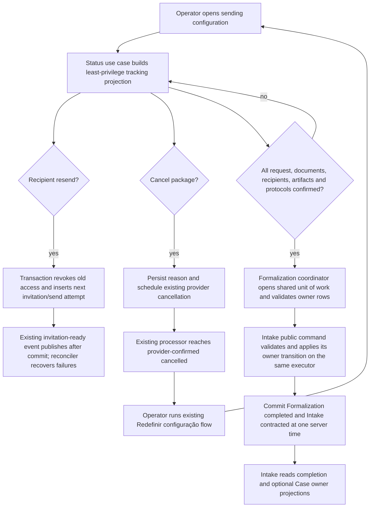

# 1. Context and scope

## Objective and source

Deliver the complete-mode conclusion of Formalization defined by Jira `SCRUM-145` and the updated Formalization PRD: authorized operators can monitor a sent signature package, resend an eligible recipient invitation, cancel an open package with an auditable reason, and confirm contracting only after authoritative completion. Confirmation atomically completes Formalization and moves Intake to `contracted` with one server timestamp; it neither creates nor requests a Case.

The Formalization PRD is the product authority. The Intake PRD governs the contracted Intake presentation and timestamp. The Document Production PRD governs the reusable approved/current-version PDF freeze. Jira `SCRUM-145` supplies the delivery slice; `SCRUM-128`, `SCRUM-130`, `SCRUM-139`, `SCRUM-140` and `SCRUM-144` are predecessor context, not alternative authority.

## Current behavior and product gap

The repository already supports Formalization, document-package confirmation, signature configuration, immutable request provisioning, the signer gateway, webhook/reconciliation processing, evidence artifacts, protocols, cancellation scheduling and aggregate request polling. The browser still exposes three configuration tabs, only aggregate tracking, no recipient resend, cancellation without a reason, and a disabled contracting placeholder. Formalization has no completion metadata, Intake has no server-owned contracting timestamp, and the generic Intake transition can incorrectly move `in_formalization` directly to `contracted`. Case Management has persisted cases but no public read projection. Signature preview conversion is implemented under Formalization instead of a reusable Document Production freeze capability.

## Scope and product alignment

| Area | In scope | Out of scope |
| --- | --- | --- |
| Signature tracking | Aggregate and per-document/per-signatory status, evidence presence, protocol number, timestamps and automatic polling/recovery | New signature provider, ICP-Brasil, exposing private signed artifacts to tracking-only viewers |
| Signature operations | Individual invitation resend on the configured still-consented channel; package cancellation with required reason | Channel selection during resend, creating another provider envelope, resending after provider submission |
| Contracting | Idempotent, optimistic and atomic Formalization completion plus Intake contracting with a server timestamp | Any automatic/manual Case creation or Case-creation request; changes to `SCRUM-27` |
| Contracted Intake | Completed Formalization summary and optional Case summary through owner boundaries | Duplicate signed-document list; Case editing, team/pipeline management or a new Case route |
| Document Production | Reusable freeze of the approved current version to immutable PDF with source/approval/hash metadata; Formalization consumes it | Migrating unrelated document exports or changing provider distribution |
| Experience | Two tabs, explicit loading/error/disabled states, desktop references and accepted `390 × 844` stacking | Treating fixture IDs, dates, names or counts as fixed product data |

| Source requirement | Delivery | Notes |
| --- | --- | --- |
| Formalization PRD — “Acompanhar assinaturas” | full | Tracking is grouped by document and signatory and is available as a least-privilege projection to an active eligible collaborator already registered as a signatory. |
| Formalization PRD — “Reenviar convite” and “Cancelar solicitação” | full | Resend rotates only invitation/session access; cancellation requires a trimmed reason preserved on the cancellation audit record. |
| Formalization PRD — “Confirmar contratação” | full | Confirmation requires authoritative request, document, recipient, artifact and protocol completion and updates both aggregates in one transaction. |
| Formalization PRD — “PDF imutável aprovado” | full | Document Production owns one frozen artifact per approved current document version and Formalization uses a lifecycle-isolated preview copy. |
| Intake PRD — contracted experience | full | The terminal pipeline ends at `contracted`, displays Formalization completion and optionally a related Case, and offers no Case creation. |
| Jira `SCRUM-145` — Case action | full | “Abrir caso” is present but disabled and explained in both Case states because no canonical route exists. |

## Product decisions and accepted assumptions

- The operational actors remain the assigned lawyer and administrators. An active eligible collaborator whose collaborator ID is already recorded as a request recipient may read only the tracking projection; full Formalization, commercial conditions, document content and operations continue to use existing ownership rules.
- The completed Formalization summary is an Intake enrichment available only inside the existing assigned-lawyer/administrator Intake access boundary. Linked signatories remain confined to the dedicated tracking projection and never gain access to the full Intake route or its client/history/commercial context.
- Individual resend is permitted before provider signing/submission for recipient states `invited`, `authenticating`, `locked`, `authenticated`, `reading` or `reconciliation_required`. It reuses the configured channel only if consent is still valid, revokes the previous invitation and active gateway access, creates the next opaque invitation generation and does not create or distribute provider resources. A channel change requires package cancellation and reconfiguration.
- Cancellation requires a non-empty trimmed reason of at most 500 characters. The reason, actor and request time are stored on the cancellation attempt, which is the durable audit record used by the existing cancellation processor.
- A retry with the same contracting `confirmationKey` converges on the completed state. A different key after completion is a conflict. Concurrent completion/closure or stale aggregate/request versions commit neither aggregate.
- The server produces the single `contractedAt`/`completedAt` timestamp. Intake `updatedAt` is not contracting evidence.
- “Abrir caso” is a disabled future affordance with accessible explanatory copy in both absent and present Case states. The Intake card itself is the delivered Case detail projection.
- Pencil node `FbWzH` is adapted into the `Assinaturas` tab; `Posicionar campos` is visible but read-only after sending. Existing dialogs/state panels supply missing loading/error/modal treatment. The accepted `390 × 844` contract stacks content without horizontal overflow.
- The PRD-authoritative green `Confirmar contratação` action remains on the main Formalization page, outside the sending-configuration card. The tracking panel supplies readiness/status but never relocates or duplicates the action.
- No event in this delivery requests or creates a Case. Analytics/reporting events beyond existing signature events are deferred; the committed aggregate state is authoritative.

# 2. Implementation Contract

## Functional requirements

| ID | PRD/Jira/source coverage | Required behavior |
| --- | --- | --- |
| `FR-01` | Formalization PRD “Acompanhamento”; Jira `SCRUM-145` progress criteria | The Formalization sending surface shows authoritative request progress and each document/signatory status, configured channel, invitation/delivery generation, relevant timestamps, protocol and signed-artifact presence without exposing private artifact identifiers. |
| `FR-02` | Jira `SCRUM-145`; accepted two-tab assumption | The sending surface has exactly `Assinaturas` and `Posicionar campos`: before sending, `Assinaturas` owns signatories and review/start; after sending it owns tracking, while fields remain visible and read-only. |
| `FR-03` | Formalization PRD permissions; accepted read decision | Assigned lawyer/admin can operate; an active eligible linked signatory collaborator can read only tracking. Other active collaborators receive 403 without Formalization, commercial or document disclosure. |
| `FR-04` | Formalization PRD “Reenvio individual”; accepted resend decision | An operator can resend an eligible pending recipient on the configured still-consented channel. The old invitation and active access are revoked atomically, the next generation is issued once, and provider resources are unchanged. |
| `FR-05` | Formalization PRD and predecessor cancellation criterion; accepted reason decision | An operator can cancel a nonterminal package only after providing a valid reason; cancellation preserves the existing provider-confirmed asynchronous lifecycle and records reason/actor/time durably. Editing remains locked while cancellation is pending or failed; after provider-confirmed cancellation, the existing `Redefinir configuração` flow releases the package for reconfiguration and a later new send. |
| `FR-06` | Formalization PRD “Confirmação”; Jira `SCRUM-145` | The green `Confirmar contratação` action is rendered on the main Formalization page outside the sending-configuration card and remains unavailable until the current request, every request document and every recipient are confirmed, each document has a signed PDF artifact, and each recipient has a protocol. |
| `FR-07` | Formalization and Intake PRDs | Successful confirmation atomically changes Formalization to `completed`, Intake to `contracted`, records actor/idempotency key and the same server time, and never creates or requests a Case. |
| `FR-08` | Document Production PRD; Jira `SCRUM-130`/`SCRUM-145` | Document Production idempotently freezes an approved current document version to immutable PDF with source/model, version number, approver, time, page, byte and SHA-256 metadata; Formalization consumes that capability without owning conversion. |
| `FR-09` | Intake PRD contracted journey; Pencil `JOoMf`, `w0QbVY`, `okATx`; existing Intake ownership | A contracted Intake, when opened by its existing assigned-lawyer/administrator audience, shows a read-only completed Formalization card with an enabled link to the existing Formalization route. The card does not repeat documents or expose terminal close/edit actions; linked signatories do not receive access to the full Intake route through this feature. |
| `FR-10` | Intake PRD Case boundary; Pencil `C4XC5D`, `N2Xvj`; accepted Case-action decision | The contracted Intake queries Case Management’s public summary. Absence shows “Caso não iniciado”; presence shows public code, status, legal area, primary lawyer and opened date. Both `Abrir caso` actions are disabled/explained. |
| `FR-11` | Intake PRD lifecycle alignment | The generic Intake status endpoint can no longer transition `in_formalization` to `contracted`; only Intake’s public contracting command, invoked by the Formalization coordinator, owns that transition and `contractedAt`. |
| `FR-12` | Design authority and repository accessibility rules | Loading, empty, forbidden, stale, provider/reconciliation failure, resend, cancel and confirmation states are accessible, restorable after reload and responsive at desktop and `390 × 844`, with no hydration, console or unexpected network failures. |

## Acceptance criteria

| ID | FR coverage | Requirement | Given | When | Then | Expected evidence |
| --- | --- | --- | --- | --- | --- | --- |
| `AC-01` | `FR-01`, `FR-02` | Detailed tracking | A sent request has multiple documents and mixed recipient states | An operator opens or reloads the sending surface | The `Assinaturas` tab shows correct grouped rows, counts, percentage, timestamps, channels, protocol/artifact indicators and polling resumes; `Posicionar campos` is read-only | Core status tests; controller/service tests; panel tests; `MV-01` |
| `AC-02` | `FR-01`, `FR-12` | Loading and reconciliation | Provisioning, polling or reconciliation is pending or fails | The status refreshes or the user retries | Busy/error copy is explicit, previous safe data may remain, actions follow authoritative state, and recovery causes no duplicate request | Core status tests; hook/panel tests; `MV-01` |
| `AC-03` | `FR-03` | Operator authorization | A Formalization belongs to lawyer A | Lawyer B or an administrator reads/operates tracking | Lawyer B receives 403; the administrator can track/resend/cancel/confirm under existing rules | Use-case/controller tests; `MV-03` |
| `AC-04` | `FR-03` | Linked tracking-only authorization | An active eligible collaborator is or is not a recipient on the current request | The collaborator opens the sending route | A linked recipient sees only tracking; an unlinked/inactive/ineligible collaborator receives 403; neither obtains commercial terms, document bytes or operational controls | Core authorization truth table; route test; `MV-03` |
| `AC-05` | `FR-04` | Invitation resend | A recipient is in an allowed pre-submission state and its configured channel retains consent | The operator confirms resend, including a concurrent/repeated click | One next-generation invitation/send attempt is committed, old access is revoked, delivery is published/recoverable, provider envelope/resources are unchanged, and UI reports success or retryable failure | Core/transaction/controller tests; hook/widget tests; `MV-01` |
| `AC-06` | `FR-05` | Reasoned cancellation and reconfiguration | A request is nonterminal | The operator submits blank, valid, duplicate or provider-failing cancellation and, after provider confirmation, selects `Redefinir configuração` | Blank/overlong reasons fail before mutation; valid trimmed reason/actor/time persist once; retries converge; pending/provider failure stays locked and visible; only confirmed cancellation exposes the existing reset action, whose successful reset restores editable configuration and permits one later new request without rewriting cancellation history | Core/controller integration tests; dialog/panel/reset tests; `MV-01` |
| `AC-07` | `FR-06` | Confirmation gate and placement | Any request/document/recipient/artifact/protocol prerequisite is missing or nonconfirmed | The main Formalization page evaluates confirmation | One green action appears outside the sending card, is disabled until ready and is rejected server-side with a safe named conflict; the sending/tracking page contains no duplicate action and no aggregate or Case effect occurs | Core truth-table tests; controller tests; Formalization page tests |
| `AC-08` | `FR-07`, `FR-11` | Atomic successful contracting | Every prerequisite is authoritative and versions are current | The assigned lawyer/admin confirms | Formalization and Intake commit together with matching server time, completion actor and confirmation key; generic Intake transition was not used and no Case/event side effect occurs | Core owner use-case tests; controller integration/service tests; `MV-01`, `MV-02` |
| `AC-09` | `FR-07` | Idempotency/concurrency | A confirmation succeeded or races closure/another confirmation | The same or a different key/stale version is submitted | Same-key retry returns the converged result; different key or stale/racing state is 409; partial state is impossible | Core/transaction/controller tests |
| `AC-10` | `FR-09` | Completed Formalization card | Intake is `contracted` through confirmation and an assigned lawyer/administrator opens it through the existing Intake access boundary | Intake details loads | The card uses `completedAt`, indicates all signatures confirmed, contains no duplicate document list or terminal close/edit action, and opens the canonical Formalization route; linked signatory access remains limited to tracking and does not authorize the Intake route | Completion use-case/service and Intake query/page/widget tests; `MV-02`, `MV-03` |
| `AC-11` | `FR-10` | Case public projection | The contracted Intake has no Case, a Case, or a failed optional Case query | Intake details loads | Correct empty/present/error-localized state appears; populated values come from Case/owner lookups; both Case actions stay disabled and no navigation/mutation occurs | Case use-case/controller/service tests; contracted widget/route tests; `MV-02` |
| `AC-12` | `FR-02`, `FR-09`, `FR-10`, `FR-12` | Responsive and accessible delivery | Seeded operator and linked-recipient fixtures exist | Flows run at `1200 × 900` and `390 × 844`, including keyboard-only dialogs/tabs/actions | Focus, names, descriptions, progress semantics and error alerts are correct; content stacks without page overflow; design comparisons pass; console/network are clean | Component/route tests; `MV-01`–`MV-03` |
| `AC-13` | `FR-08` | Frozen PDF integrity | A version is approved and current, or is stale/unapproved | Freeze is requested repeatedly or concurrently | Approved/current calls converge on one artifact whose version number, hashes, pages, source and approval metadata match the source and stored bytes; stale/unapproved calls create no file/row; Formalization preview copies the canonical bytes and preserves existing cleanup isolation | Document Production use-case/repository/job tests; migration assertion |

## Cross-cutting restrictions

| Concern | Contract |
| --- | --- |
| Trust and privacy | Actor identity/profile comes from the session. Tracking contains no private file IDs, tokens, hashes or document bytes. Reasons, invitation tokens, provider credentials and confirmation keys are never logged. |
| Ownership | Formalization owns signature/request/readiness policy; Intake owns the command that validates and applies its `contracted` status/timestamp; Document Production owns frozen PDFs; Case Management owns the Case read projection. No module imports another module’s Drizzle tables, repositories, mappers or seed data. |
| Consistency | Resend access rotation is one transaction. Contracting composes Formalization’s owner writes with Intake’s public contracting command through the shared ambient unit of work; every owner repository resolves the same executor, so both aggregates commit once or roll back together. External delivery publication occurs after commit and is recoverable from the pending send-attempt row. |
| Historical integrity | Existing invitations, sessions, provider resources, evidence, protocols and frozen artifacts are retained. Resend adds a generation; it does not rewrite history. |
| Failure safety | Optional Intake enrichment failure is localized. Provider cancellation remains asynchronous. No provider or messaging call occurs inside a retryable database transaction. |

## Design Contract

Implementation and visual validation must use the [design manifest](design/manifest.md) and all seven verified PNGs. The manifest’s accepted deviations are normative: `FbWzH` moves into the two-tab layout, fields become read-only after sending, contracted Intake omits its obsolete close action, Case actions are disabled in both states, and `390 × 844` uses the documented stacking assumption. Recommended supplemental screenshots are implementation evidence, not blockers to this open-ready Contract.

# 3. Technical Contract

## Current technical state

| Evidence | Current responsibility | Gap |
| --- | --- | --- |
| `GetFormalizationSignatureSendingStatusUseCase` and its shared schema | Returns aggregate request/document counts to assigned lawyer/admin | No recipient/document projection, linked-signatory permission, nullable pre-send state or contracting readiness |
| `CancelFormalizationSignatureSendingUseCase` and cancellation attempt model | Atomically schedules provider cancellation and revokes access | Reason absent; authorization is partly in the controller instead of the use case |
| `ResetFormalizationSignatureConfigurationUseCase`, its controller/service/hook and sending panel | After a request is `cancelled`, clears the editable signature configuration and permits a later send | Retain this established release path explicitly after reasoned/provider-confirmed cancellation; pending/failed cancellation must not expose it |
| Invitation/session/resource repositories and delivery reconciliation | Persist opaque generation 1, access state, provider resources and recoverable send attempts | No operator resend action/transaction; no latest-generation query |
| Formalization/Intake entities and models | Persist active/cancelled Formalization and Intake lifecycle | No completion/contracting timestamp/key; generic Intake transition still contracts directly |
| Formalization preview job and PDF providers | Convert, inspect, hash and store signature previews | Reusable approved/current freeze is absent and converter ownership is misplaced |
| Case Management Core/Server | Persists `LegalCase` and `CaseMember` seed data | No use case, REST projection or browser service by Intake |
| Formalization and Intake Web surfaces | Three sending tabs, aggregate status and a generic contracted card | No detailed tracking/resend/reason/confirmation, tracking-only page or Case/complete summaries |

## Solution and runtime flow



`FreezeApprovedDocumentVersionPdfUseCase` validates the Document, its current approved version and server-supplied specification association before conversion. It stores the canonical PDF and metadata once by `documentVersionId`; concurrent insert/file races converge and orphan files are removed. The Formalization preview job asks `DocumentPdfFreezeService` for that artifact, reads the canonical bytes and saves its existing lifecycle-isolated preview copy, so stale-preview cleanup cannot delete the reusable artifact.

Tracking loads the current request and immutable configuration plus documents, assignments, recipients, latest invitations, artifacts and protocols. Assigned lawyer/admin receive `viewerMode: 'operator'`; an active eligible collaborator must match a collaborator recipient on that request and receives `tracking_only`. The status endpoint returns `null` before a request instead of using an expected 409. Resend and contracting recheck operator authorization and all state server-side.

The contracting transaction uses expected Formalization, Intake and request versions and owner-local CAS writes. The main Formalization page obtains `expectedIntakeVersion` from its existing full-details `data.intake.version`, while request/Formalization versions and readiness come from the tracking response; tracking-only clients never need or receive the Intake version. The Formalization coordinator never imports Intake persistence: it opens `DrizzleClient.runInTransaction`, performs Formalization-owned checks/writes through Formalization repositories, and calls `IntakeContractingService`, whose Intake-owned use case/repository performs the Intake CAS on the ambient executor. It recognizes only an already-completed Formalization with the same `confirmationKey` as a duplicate. No event/provider call runs inside or immediately creates a Case. The contracted Intake page independently calls the Formalization completion and Case public-read endpoints inside its existing access boundary; failures remain optional enrichments and never alter the Intake state.

## Runtime boundaries

| Boundary | Producer | Consumer | Canonical contract | Mapping/guarantees | Failure ownership |
| --- | --- | --- | --- | --- | --- |
| Tracking HTTP | `GetFormalizationSignatureSendingStatusUseCase` | Web sending query/panel | `FormalizationSignatureSendingStatusResponse \| null` and Validation schema | Dates serialize as ISO/Date-compatible values; no private IDs/tokens | Validation handles shape; Core owns access/state errors |
| Resend transaction/event | `ResendFormalizationSignatureInvitationUseCase` | Drizzle transaction and existing delivery job | `FormalizationSignatureInvitationResendTransaction`; `FormalizationSignatureInvitationReadyEvent` v1 | Atomic generation/access rotation; publish after commit; pending row supports reconciliation | Core state/consent errors; broker/job owns delivery retry |
| Cancellation | cancel controller/use case | gateway transaction and cancellation job | Updated command plus cancellation-attempt Entity | Trimmed reason ≤500 stored before event; provider result remains async | Core owns authorization/state; existing job/provider owns retry |
| PDF freeze | Formalization preview processor | Document Production service/use case/providers/repository | `DocumentPdfFreezeService.freeze` → `FrozenDocumentPdf` | Current approved version, one artifact/version, hashes over stored bytes | Document Production errors; preview job maps retriable/nonretriable failure code |
| Contracting | confirm controller/use case | Formalization provision coordinator, shared unit of work and Intake public contracting service | `FormalizationContractingTransaction.confirm`; `IntakeContractingService.contract` → `FormalizationContractingResult` | Owner-local locks/CAS share one ambient executor; same-key duplicate; same timestamp; no partial commit | Core owner rules map to safe conflicts; coordinator conflict maps to 409 |
| Completion/Case reads | owner controllers | Intake Web query | `FormalizationCompletionSummary \| null`; `LegalCaseSummary \| null` | Owner modules construct projections; optional enrichment failures are local | Owner use cases/REST return safe 403/404/validation errors |

## Builder boundary

| Boundary | Contract |
| --- | --- |
| Allowed paths | Only the exact paths in the `Path \| Change` tables below, plus transient `documentation/features/formalization/formalization-completion/evaluation.md` and its implementation-time evidence artifacts. Metadata `scope` is authorization, not permission to change unlisted source files. |
| Prohibited paths | `design/hms.pen`, `SCRUM-27`, unrelated Document Production exporters, provider resource/envelope creation, a new Case details route, Case creation/event paths, and any source path absent from the affected-path tables. A newly discovered mandatory companion requires reopening this Spec before modification. |
| Ownership | Each affected-path table’s application/layer heading is the owning implementation boundary. Formalization owns signature/readiness/orchestration policy; Intake owns its contracting command and aggregate mutation; Document Production owns frozen PDFs; Case Management owns its projection; Shared Database owns ambient unit-of-work mechanics; Validation owns shared transport schemas. |
| Generated files | The three `Generate` rows under Server Database are derived from the named Drizzle model changes and migration command. The generated schema statements remain generator-owned; the migration may additionally contain only the explicitly specified, reviewed guarded data-transition statements because Drizzle cannot derive legacy-data backfills from models. Route-tree artifacts are unchanged because no route is created or removed. |
| Validation exits | A Builder must pass the layer commands in §4, the applicable mocked route suites, and `MV-01`–`MV-03`; actual results and transient screenshots/traces belong in `evaluation.md`. |

## `packages/core` — Domain

| Declaration | Kind | Ownership/identity | Contract summary | Related declarations | Consumers |
| --- | --- | --- | --- | --- | --- |
| `Formalization` | Entity | Formalization aggregate | Adds durable completion identity, actor and time | `FormalizationContractingResult`, `FormalizationCompletionSummary` | Contracting/status use cases, persistence, REST |
| `Intake` | Entity | Intake aggregate | Adds authoritative contracted time | `FormalizationContractingResult` | Contracting/transition use cases, persistence, Web |
| `FormalizationSignatureCancellationAttempt` | Entity | Formalization cancellation attempt | Preserves reason/actor/time for one provider-cancellation lifecycle | cancel command | Cancellation use case/job/persistence |
| `FrozenDocumentPdf` | Entity | Document Production artifact | Identifies one immutable PDF for one approved current version | PDF conversion/inspection Structures | Freeze use case/repository/service |
| `FormalizationSignatureSendingStatusResponse` | Structure | Formalization identity-free projection | Groups safe document/signatory status and permissions | tracking document/signatory Structures | Status use case, Validation, Web |
| Resend command/result Structures | Structure | Formalization action boundary | Carries CAS input and committed invitation generation | invitation/recipient entities | Resend use case, REST, Web |
| Contracting command/result/summary Structures | Structure | Formalization action/read boundaries | Carries CAS/idempotency and safe terminal projections | `Formalization`, `Intake` | Contracting/read use cases, REST, Web |
| `LegalCaseSummary` | Structure | Case Management public projection | Exposes safe Case identity/status/ownership facts by Intake | `LegalCaseStatus` | Case read use case, REST, Intake Web |

| Path | Change | Declaration | Domain role/schema | Invariants/transitions | Errors/events | Exports/consumers |
| --- | --- | --- | --- | --- | --- | --- |
| `packages/core/src/formalization/domain/entities/formalization.ts` | Modify | `Formalization` Entity | Add completion actor/time/idempotency fields | `completed` requires all three; other statuses require none | Contracting named errors | Mapper, repository, REST, summaries |
| `packages/core/src/formalization/domain/entities/fakers/formalization-faker.ts` | Modify | `fakeFormalization` | Produce invariant-valid completed/cancelled/active fixtures | Status-derived metadata | — | Core/server tests |
| `packages/core/src/intake/domain/entities/intake.ts` | Modify | `Intake`, `IntakeUpdate` | Add `contractedAt` and permitted repository update key | `contracted` iff `contractedAt` exists; closure fields remain exclusive | Intake transition errors | Intake mapper/repository/UI |
| `packages/core/src/intake/domain/entities/fakers/intake-faker.ts` | Modify | `IntakeFaker` | Produce valid contracted timestamp | Terminal metadata matches status | — | Tests |
| `packages/core/src/formalization/domain/entities/formalization-signature-cancellation-attempt.ts` | Modify | `FormalizationSignatureCancellationAttempt` Entity | Add required normalized reason | 1–500 chars; immutable audit fact | Existing cancellation failures | Mapper/job/audit |
| `packages/core/src/formalization/domain/entities/fakers/formalization-signature-cancellation-attempt-faker.ts` | Modify | `fakeFormalizationSignatureCancellationAttempt` | Supply valid reason | — | — | Tests |
| `packages/core/src/document-production/domain/entities/frozen-document-pdf.ts` | Create | `FrozenDocumentPdf` Entity | Canonical frozen PDF metadata | One per document version; approved/current at creation; hash/page/size integrity | PDF freeze errors | Repository/service/Formalization preview |
| `packages/core/src/document-production/domain/entities/frozen-document-pdf-creation.ts` | Create | `FrozenDocumentPdfCreation` | Exact immutable-artifact creation input | Omits persistence identity/time only | PDF freeze errors | Repository/freeze use case |
| `packages/core/src/document-production/domain/structures/document-pdf-conversion.ts` | Create | `DocumentPdfConversion` Structure | Provider-neutral DOCX conversion input | DOCX content type and copied bytes | Conversion error | Converter port |
| `packages/core/src/document-production/domain/structures/document-pdf-conversion-result.ts` | Create | `DocumentPdfConversionResult` Structure | PDF bytes/version output | PDF content type | Conversion error | Freeze use case |
| `packages/core/src/document-production/domain/structures/document-pdf-page.ts` | Create | `DocumentPdfPage` Structure | One page geometry row | Positive page/dimensions | Inspection error | Inspection/frozen artifact |
| `packages/core/src/document-production/domain/structures/document-pdf-inspection.ts` | Create | `DocumentPdfInspection` Structure | Complete PDF geometry metadata | Positive count matching page rows | Inspection error | Freeze entity/use case |
| `packages/core/src/formalization/domain/structures/formalization-signature-source-document.ts` | Modify | `FormalizationSignatureSourceDocument` Structure | Add server-resolved `documentSpecificationId` | IDs come from current package association | File/source unavailable | Source reader, freeze caller |
| `packages/core/src/formalization/domain/structures/formalization-signature-tracking-signatory.ts` | Create | `FormalizationSignatureTrackingSignatory` Structure | Safe recipient tracking row | No secrets/provider IDs; resend derived server-side | — | Status response/UI |
| `packages/core/src/formalization/domain/structures/formalization-signature-tracking-document.ts` | Create | `FormalizationSignatureTrackingDocument` Structure | Safe document group | Includes only evidence presence, not artifact location | — | Status response/UI |
| `packages/core/src/formalization/domain/structures/formalization-signature-sending-status-response.ts` | Modify | `FormalizationSignatureSendingStatusResponse` Structure | Full tracking aggregate/permissions | Percentage 0–100; actions derived from authoritative state | — | REST/Web |
| `packages/core/src/formalization/domain/structures/resend-formalization-signature-invitation-command.ts` | Create | `ResendFormalizationSignatureInvitationCommand` Structure | Optimistic resend input | Positive versions/generation | Conflict/channel errors | Service/controller/UI |
| `packages/core/src/formalization/domain/structures/resend-formalization-signature-invitation-result.ts` | Create | `ResendFormalizationSignatureInvitationResult` Structure | Safe resend result | Reports committed generation/delivery pending | — | REST/Web |
| `packages/core/src/formalization/domain/structures/cancel-formalization-signature-sending-command.ts` | Modify | `CancelFormalizationSignatureSendingCommand` Structure | Add required cancellation reason | Trimmed 1–500 chars | Validation/state errors | REST/Web dialog |
| `packages/core/src/formalization/domain/structures/confirm-formalization-contracting-command.ts` | Create | `ConfirmFormalizationContractingCommand` Structure | Optimistic idempotent confirmation input | UUID key; positive three versions | Readiness/version conflict | Service/controller/UI |
| `packages/core/src/formalization/domain/structures/formalization-contracting-result.ts` | Create | `FormalizationContractingResult` Structure | Two-aggregate result | Same timestamp; terminal statuses | — | REST/Web/transaction |
| `packages/core/src/formalization/domain/structures/formalization-completion-summary.ts` | Create | `FormalizationCompletionSummary` Structure | Least-privilege Intake card projection | Only completed Formalization | Access/not-found errors | REST/Intake UI |
| `packages/core/src/case-management/domain/structures/legal-case-summary.ts` | Create | `LegalCaseSummary` Structure | Public read projection by Intake | One optional primary lawyer reference | — | Use case/REST/Intake UI |
| `packages/core/src/document-production/domain/errors/document-pdf-conversion-error.ts` | Create | `DocumentPdfConversionError` Error | Provider-neutral retryable conversion failure | Retry flag is safe metadata | — | Provider/job |
| `packages/core/src/document-production/domain/errors/document-pdf-inspection-error.ts` | Create | `DocumentPdfInspectionError` Error | Invalid/unreadable PDF | Nonretriable | — | Provider/job |
| `packages/core/src/document-production/domain/errors/document-version-not-freezable-error.ts` | Create | `DocumentVersionNotFreezableError` Error | Missing/stale/unapproved source | No file/row committed | — | Freeze use case/job |
| `packages/core/src/formalization/domain/errors/formalization-contracting-not-ready-error.ts` | Create | `FormalizationContractingNotReadyError` Error | Missing completion prerequisite | Conflict without sensitive detail | — | Use case/REST |
| `packages/core/src/formalization/domain/errors/formalization-contracting-conflict-error.ts` | Create | `FormalizationContractingConflictError` Error | Version/key/concurrent state conflict | HTTP 409 mapping | — | Use case/REST |
| `packages/core/src/formalization/domain/errors/formalization-document-pdf-conversion-error.ts` | Remove | `FormalizationDocumentPdfConversionError` | Superseded by Document Production owner | — | — | Preview job migrates |
| `packages/core/src/formalization/domain/errors/formalization-document-pdf-inspection-error.ts` | Remove | `FormalizationDocumentPdfInspectionError` | Superseded by Document Production owner | — | — | Preview job migrates |
| `packages/core/src/formalization/domain/structures/formalization-document-pdf-conversion.ts` | Remove | `FormalizationDocumentPdfConversion` | Superseded owner-neutral type | — | — | — |
| `packages/core/src/formalization/domain/structures/formalization-document-pdf-conversion-result.ts` | Remove | `FormalizationDocumentPdfConversionResult` | Superseded owner-neutral type | — | — | — |
| `packages/core/src/formalization/domain/structures/formalization-document-pdf-inspection.ts` | Remove | `FormalizationDocumentPdfInspection` | Superseded owner-neutral type | — | — | — |

### Resulting Entity and Structure declarations

```ts
// packages/core/src/formalization/domain/entities/formalization.ts
export type Formalization = Entity & {
  intakeId: string; clientId: string; consultationId: string; assignedLawyerId: string
  legalAreaId?: string; legalTopicId?: string; status: FormalizationStatus
  contractFormId: string; contractFormSnapshot: DynamicFormSnapshot
  contractFormAnswers: DynamicFormAnswer[]; contractFormState: FormalizationContractFormState
  contractFormRevision: number; contractFormClosedAt?: Date
  contractFormClosedByCollaboratorId?: string; documentsConfirmedAt?: Date
  documentsConfirmedByCollaboratorId?: string; documentsConfirmedRevision?: number
  signatureRequestId?: string; signatureStatus?: FormalizationSignatureRequestStatus
  signatureSubmittedAt?: Date; signatureConfirmedAt?: Date; signatureTerminalAt?: Date
  completedAt?: Date; completedByCollaboratorId?: string; contractingConfirmationKey?: string
  cancelledAt?: Date; cancelledByCollaboratorId?: string
  version: number; createdAt: Date; updatedAt: Date
}

// packages/core/src/intake/domain/entities/intake.ts
// `IntakeCreation` and `IntakeUpdate` remain the existing legacy companion
// exports in this file; this feature changes only the existing `Intake` type
// by adding `contractedAt` and does not introduce another exported type here.
export type Intake = Entity & {
  sequenceNumber: number; clientId: string; responsibleId: string
  createdBy: string; updatedBy: string; origin: IntakeOrigin
  contactChannel: ContactChannel; legalAreaId?: string; legalTopicId?: string
  urgency: IntakeUrgency; demandNotes?: string; status: IntakeStatus
  contractedAt?: Date; closureReason?: IntakeClosureReason; closureNotes?: string
  closedAt?: Date; version: number; createdAt: Date; updatedAt: Date
}
export type IntakeCreation = Omit<Intake, 'createdAt' | 'id' | 'sequenceNumber' | 'updatedAt' | 'version'>
export type IntakeUpdate = Partial<Omit<Pick<Intake, 'clientId' | 'closureNotes' | 'closureReason' | 'closedAt' | 'contractedAt' | 'contactChannel' | 'demandNotes' | 'legalAreaId' | 'legalTopicId' | 'origin' | 'responsibleId' | 'status' | 'updatedBy' | 'urgency'>, 'demandNotes' | 'legalAreaId' | 'legalTopicId'>> & { legalAreaId?: string | null; legalTopicId?: string | null; demandNotes?: string | null }

// packages/core/src/formalization/domain/entities/formalization-signature-cancellation-attempt.ts
export type FormalizationSignatureCancellationAttempt = Entity & {
  requestId: string; attemptToken: string; status: 'pending' | 'processing' | 'cancelled' | 'failed'
  attempts: number; requestedBy: string; reason: string; requestedAt: Date
  leaseExpiresAt?: Date; nextAttemptAt?: Date; lastFailureCode?: string; updatedAt: Date
}

// packages/core/src/document-production/domain/entities/frozen-document-pdf.ts
export type FrozenDocumentPdf = Entity & {
  documentId: string; documentVersionId: string; documentVersionNumber: number; documentSpecificationId: string
  sourceDocumentVersionId?: string; source: DocumentVersionSource; sourceFileId: string
  pdfFileId: string; sourceSha256: string; pdfSha256: string; converterVersion: string
  pageCount: number; pages: readonly DocumentPdfPage[]; byteSize: number
  approvedByCollaboratorId: string; approvedAt: Date; frozenAt: Date; createdAt: Date
}
// packages/core/src/document-production/domain/entities/frozen-document-pdf-creation.ts
export type FrozenDocumentPdfCreation = Omit<FrozenDocumentPdf, 'createdAt' | 'id'>

// packages/core/src/document-production/domain/structures/document-pdf-conversion.ts
export type DocumentPdfConversion = { readonly fileName: string; readonly contentType: 'application/vnd.openxmlformats-officedocument.wordprocessingml.document'; readonly content: Uint8Array; readonly traceId: string }
// packages/core/src/document-production/domain/structures/document-pdf-conversion-result.ts
export type DocumentPdfConversionResult = { readonly contentType: 'application/pdf'; readonly content: Uint8Array; readonly converterVersion: string }
// packages/core/src/document-production/domain/structures/document-pdf-page.ts
export type DocumentPdfPage = { readonly page: number; readonly width: number; readonly height: number }
// packages/core/src/document-production/domain/structures/document-pdf-inspection.ts
export type DocumentPdfInspection = { readonly pageCount: number; readonly pages: readonly DocumentPdfPage[] }

// packages/core/src/formalization/domain/structures/formalization-signature-source-document.ts
export type FormalizationSignatureSourceDocument = { readonly documentId: string; readonly documentVersionId: string; readonly documentSpecificationId: string; readonly name: string; readonly reviewStatus: string; readonly fileId: string }

// packages/core/src/formalization/domain/structures/formalization-signature-tracking-signatory.ts
export type FormalizationSignatureTrackingSignatory = {
  readonly recipientId: string; readonly recipientVersion: number; readonly displayName: string
  readonly actorKind: FormalizationSignatureRecipientKind; readonly deliveryChannel: FormalizationSignatureChannelKind
  readonly status: FormalizationSignatureRecipientStatus; readonly invitationGeneration?: number
  readonly invitationStatus?: FormalizationSignatureInvitationStatus
  readonly invitationDeliveryStatus?: 'pending' | 'delivered' | 'failed'
  readonly invitedAt?: Date; readonly submittedAt?: Date; readonly confirmedAt?: Date
  readonly terminalAt?: Date; readonly protocolNumber?: string; readonly canResend: boolean
}

// packages/core/src/formalization/domain/structures/formalization-signature-tracking-document.ts
export type FormalizationSignatureTrackingDocument = {
  readonly requestDocumentId: string; readonly sourceDocumentId: string; readonly title: string
  readonly position: number; readonly status: FormalizationSignatureRequestDocumentStatus
  readonly submittedAt?: Date; readonly confirmedAt?: Date; readonly terminalAt?: Date
  readonly signedArtifactAvailable: boolean
  readonly signatories: readonly FormalizationSignatureTrackingSignatory[]
}

// packages/core/src/formalization/domain/structures/formalization-signature-sending-status-response.ts
export type FormalizationSignatureSendingStatusResponse = {
  readonly formalizationId: string; readonly formalizationStatus: FormalizationStatus
  readonly formalizationVersion: number; readonly completedAt?: Date
  readonly requestId: string; readonly status: FormalizationSignatureRequestStatus; readonly version: number
  readonly sentAt?: Date; readonly submittedAt?: Date; readonly confirmedAt?: Date; readonly terminalAt?: Date
  readonly totalDocuments: number; readonly completedDocuments: number; readonly failedDocuments: number
  readonly progressPercentage: number; readonly canCancel: boolean; readonly canRetry: boolean
  readonly canConfirmContracting: boolean; readonly viewerMode: 'operator' | 'tracking_only'
  readonly permissions: { readonly canOperate: boolean; readonly canViewDocumentContent: boolean }
  readonly documents: readonly FormalizationSignatureTrackingDocument[]
}

// command/result Structures
export type ResendFormalizationSignatureInvitationCommand = { readonly expectedRecipientVersion: number; readonly expectedInvitationGeneration: number }
export type ResendFormalizationSignatureInvitationResult = { readonly requestId: string; readonly recipientId: string; readonly invitationId: string; readonly generation: number; readonly deliveryPending: true }
export type CancelFormalizationSignatureSendingCommand = { readonly expectedRequestVersion: number; readonly expectedFormalizationVersion: number; readonly reason: string }
export type ConfirmFormalizationContractingCommand = { readonly expectedFormalizationVersion: number; readonly expectedIntakeVersion: number; readonly expectedRequestVersion: number; readonly confirmationKey: string }
export type FormalizationContractingResult = { readonly formalizationId: string; readonly formalizationStatus: 'completed'; readonly formalizationVersion: number; readonly intakeId: string; readonly intakeStatus: 'contracted'; readonly intakeVersion: number; readonly contractedAt: Date; readonly duplicate: boolean }
export type FormalizationCompletionSummary = { readonly formalizationId: string; readonly intakeId: string; readonly status: 'completed'; readonly completedAt: Date; readonly signatureRequestId: string; readonly signatureStatus: 'confirmed' }
export type LegalCaseSummary = { readonly caseId: string; readonly intakeId: string; readonly publicCode: string; readonly status: LegalCaseStatus; readonly legalAreaId: string; readonly primaryLawyerId?: string; readonly openedAt: Date }

// Named errors and their complete public metadata/signatures
export class DocumentPdfConversionError extends AppError {
  readonly retryable: boolean
  constructor(message?: string, retryable?: boolean)
}
export class DocumentPdfInspectionError extends AppError { constructor(message?: string) }
export class DocumentVersionNotFreezableError extends ConflictError {
  constructor(reason: 'not_found' | 'stale' | 'unapproved' | 'source_missing')
  readonly reason: 'not_found' | 'stale' | 'unapproved' | 'source_missing'
}
export class FormalizationContractingNotReadyError extends ConflictError { constructor(message?: string) }
export class FormalizationContractingConflictError extends ConflictError { constructor(message?: string) }
```

### Schema — `Formalization`

| Field | Type | Required | Validation | Description |
| --- | --- | --- | --- | --- |
| `id` | `string` | Yes | UUID | Entity identity |
| `intakeId` | `string` | Yes | UUID/unique aggregate relation | Owning Intake |
| `clientId` | `string` | Yes | UUID | Client snapshot reference |
| `consultationId` | `string` | Yes | UUID | Completed Consultation reference |
| `assignedLawyerId` | `string` | Yes | UUID | Operational owner |
| `legalAreaId` | `string` | No | UUID | Inherited legal area |
| `legalTopicId` | `string` | No | UUID | Inherited legal topic |
| `status` | `FormalizationStatus` | Yes | Existing enum | Aggregate lifecycle |
| `contractFormId` | `string` | Yes | UUID | Selected form definition |
| `contractFormSnapshot` | `DynamicFormSnapshot` | Yes | Existing snapshot rules | Immutable form definition snapshot |
| `contractFormAnswers` | `DynamicFormAnswer[]` | Yes | Existing answer rules | Commercial answers |
| `contractFormState` | `FormalizationContractFormState` | Yes | Existing enum | Open/closed state |
| `contractFormRevision` | `number` | Yes | Integer ≥0 | Form revision |
| `contractFormClosedAt` | `Date` | No | Existing lifecycle | Form close time |
| `contractFormClosedByCollaboratorId` | `string` | No | UUID | Form close actor |
| `documentsConfirmedAt` | `Date` | No | Existing lifecycle | Package confirmation time |
| `documentsConfirmedByCollaboratorId` | `string` | No | UUID | Package confirmation actor |
| `documentsConfirmedRevision` | `number` | No | Integer ≥0 | Confirmed form revision |
| `signatureRequestId` | `string` | No | UUID | Current signature request |
| `signatureStatus` | `FormalizationSignatureRequestStatus` | No | Existing enum | Projected request status |
| `signatureSubmittedAt` | `Date` | No | Existing lifecycle | First/full submission projection |
| `signatureConfirmedAt` | `Date` | No | Existing lifecycle | Signature confirmation projection |
| `signatureTerminalAt` | `Date` | No | Existing lifecycle | Signature terminal time |
| `completedAt` | `Date` | Conditional | Present iff `status='completed'` | Server contracting time |
| `completedByCollaboratorId` | `string` | Conditional | UUID; present iff completed | Contracting actor |
| `contractingConfirmationKey` | `string` | Conditional | UUID; present iff completed; unique | Idempotency key |
| `cancelledAt` | `Date` | Conditional | Existing cancellation rule | Cancellation time |
| `cancelledByCollaboratorId` | `string` | Conditional | Existing cancellation rule | Cancellation actor |
| `version` | `number` | Yes | Positive integer | Optimistic version |
| `createdAt` | `Date` | Yes | — | Creation time |
| `updatedAt` | `Date` | Yes | ≥ `createdAt` | Last update time |

### Schema — `Intake`

| Field | Type | Required | Validation | Description |
| --- | --- | --- | --- | --- |
| `id` | `string` | Yes | UUID | Entity identity |
| `sequenceNumber` | `number` | Yes | Positive integer | Public sequence |
| `clientId` | `string` | Yes | UUID | Client |
| `responsibleId` | `string` | Yes | UUID | Responsible collaborator |
| `createdBy` | `string` | Yes | UUID | Creator |
| `updatedBy` | `string` | Yes | UUID | Last actor |
| `origin` | `IntakeOrigin` | Yes | Existing enum | Origin |
| `contactChannel` | `ContactChannel` | Yes | Existing enum | Contact channel |
| `legalAreaId` | `string` | No | UUID | Legal area |
| `legalTopicId` | `string` | No | UUID | Legal topic |
| `urgency` | `IntakeUrgency` | Yes | Existing enum | Urgency |
| `demandNotes` | `string` | No | Existing limits | Demand notes |
| `status` | `IntakeStatus` | Yes | Existing enum | Lifecycle |
| `contractedAt` | `Date` | Conditional | Present iff `contracted` | Server contracting time |
| `closureReason` | `IntakeClosureReason` | Conditional | Present iff closed without contract | Closure reason |
| `closureNotes` | `string` | No | Only when closed without contract | Closure notes |
| `closedAt` | `Date` | Conditional | Present iff closed without contract | Closure time |
| `version` | `number` | Yes | Positive integer | Optimistic version |
| `createdAt` | `Date` | Yes | — | Creation time |
| `updatedAt` | `Date` | Yes | ≥ `createdAt` | Last update time |

### Schema — `FormalizationSignatureCancellationAttempt`

| Field | Type | Required | Validation | Description |
| --- | --- | --- | --- | --- |
| `id` | `string` | Yes | UUID | Attempt identity |
| `requestId` | `string` | Yes | UUID | Signature request |
| `attemptToken` | `string` | Yes | UUID | Claim/idempotency token |
| `status` | `'pending' \| 'processing' \| 'cancelled' \| 'failed'` | Yes | Existing lifecycle | Attempt state |
| `attempts` | `number` | Yes | Integer ≥0 | Processing count |
| `requestedBy` | `string` | Yes | UUID | Operator |
| `reason` | `string` | Yes | Trimmed 1–500 | Durable cancellation reason |
| `requestedAt` | `Date` | Yes | Server time | Request time |
| `leaseExpiresAt` | `Date` | No | Processing-only | Claim lease |
| `nextAttemptAt` | `Date` | No | Retry-only | Retry schedule |
| `lastFailureCode` | `string` | No | Safe code | Last provider failure |
| `updatedAt` | `Date` | Yes | — | Last update |

### Schema — `FrozenDocumentPdf`

| Field | Type | Required | Validation | Description |
| --- | --- | --- | --- | --- |
| `id` | `string` | Yes | UUID | Artifact identity |
| `documentId` | `string` | Yes | UUID/FK | Document |
| `documentVersionId` | `string` | Yes | UUID/FK/unique | Frozen version |
| `documentVersionNumber` | `number` | Yes | Positive integer | Auditable source version number |
| `documentSpecificationId` | `string` | Yes | UUID/FK | Source model |
| `sourceDocumentVersionId` | `string` | No | UUID/FK | Optional parent version |
| `source` | `DocumentVersionSource` | Yes | `ai \| manual` | Version origin |
| `sourceFileId` | `string` | Yes | UUID owner reference | Source DOCX |
| `pdfFileId` | `string` | Yes | UUID owner reference | Frozen PDF |
| `sourceSha256` | `string` | Yes | 64 lowercase hex | DOCX hash |
| `pdfSha256` | `string` | Yes | 64 lowercase hex | PDF hash |
| `converterVersion` | `string` | Yes | 1–64 | Converter identity |
| `pageCount` | `number` | Yes | Integer ≥1 | PDF pages |
| `pages` | `readonly DocumentPdfPage[]` | Yes | Length equals count | Page geometry |
| `byteSize` | `number` | Yes | Integer >0 | PDF bytes |
| `approvedByCollaboratorId` | `string` | Yes | UUID owner reference | Reviewer identity copied from the approved version |
| `approvedAt` | `Date` | Yes | From version | Approval time |
| `frozenAt` | `Date` | Yes | Server time | Freeze time |
| `createdAt` | `Date` | Yes | Server time | Row creation |

### Schema — `DocumentPdfConversion`

| Field | Type | Required | Validation | Description |
| --- | --- | --- | --- | --- |
| `fileName` | `string` | Yes | Non-empty safe name | Source name |
| `contentType` | DOCX literal | Yes | Exact literal | Source media type |
| `content` | `Uint8Array` | Yes | Non-empty | Copied source bytes |
| `traceId` | `string` | Yes | Non-empty, nonsecret | Provider correlation |

### Schema — `DocumentPdfConversionResult`

| Field | Type | Required | Validation | Description |
| --- | --- | --- | --- | --- |
| `contentType` | `'application/pdf'` | Yes | Exact literal | Output media type |
| `content` | `Uint8Array` | Yes | Non-empty | PDF bytes |
| `converterVersion` | `string` | Yes | Non-empty | Converter identity |

### Schema — `DocumentPdfPage`

| Field | Type | Required | Validation | Description |
| --- | --- | --- | --- | --- |
| `page` | `number` | Yes | Positive integer | One-based page |
| `width` | `number` | Yes | Finite >0 | PDF points |
| `height` | `number` | Yes | Finite >0 | PDF points |

### Schema — `DocumentPdfInspection`

| Field | Type | Required | Validation | Description |
| --- | --- | --- | --- | --- |
| `pageCount` | `number` | Yes | Integer ≥1 | Total pages |
| `pages` | `readonly DocumentPdfPage[]` | Yes | Length equals count | Page geometry |

### Schema — `FormalizationSignatureSourceDocument`

| Field | Type | Required | Validation | Description |
| --- | --- | --- | --- | --- |
| `documentId` | `string` | Yes | UUID | Document |
| `documentVersionId` | `string` | Yes | UUID | Current version |
| `documentSpecificationId` | `string` | Yes | UUID | Package specification |
| `name` | `string` | Yes | Non-empty | Display title |
| `reviewStatus` | `string` | Yes | Runtime source status | Review status |
| `fileId` | `string` | Yes | UUID | Source file |

### Schema — `FormalizationSignatureTrackingSignatory`

| Field | Type | Required | Validation | Description |
| --- | --- | --- | --- | --- |
| `recipientId` | `string` | Yes | UUID | Recipient |
| `recipientVersion` | `number` | Yes | Positive integer | Resend CAS version |
| `displayName` | `string` | Yes | Snapshot value | Safe name |
| `actorKind` | `FormalizationSignatureRecipientKind` | Yes | Existing enum | Client/collaborator |
| `deliveryChannel` | `FormalizationSignatureChannelKind` | Yes | Existing enum | Configured channel |
| `status` | `FormalizationSignatureRecipientStatus` | Yes | Existing enum | Recipient state |
| `invitationGeneration` | `number` | No | Positive integer | Latest generation |
| `invitationStatus` | `FormalizationSignatureInvitationStatus` | No | Existing enum | Latest invitation state |
| `invitationDeliveryStatus` | `'pending' \| 'delivered' \| 'failed'` | No | Existing enum | Latest delivery state |
| `invitedAt` | `Date` | No | — | Invitation time |
| `submittedAt` | `Date` | No | — | Submission time |
| `confirmedAt` | `Date` | No | — | Confirmation time |
| `terminalAt` | `Date` | No | — | Terminal time |
| `protocolNumber` | `string` | No | Safe public protocol | Confirmation protocol |
| `canResend` | `boolean` | Yes | Server-derived | Operator eligibility |

### Schema — `FormalizationSignatureTrackingDocument`

| Field | Type | Required | Validation | Description |
| --- | --- | --- | --- | --- |
| `requestDocumentId` | `string` | Yes | UUID | Request document |
| `sourceDocumentId` | `string` | Yes | UUID | Source document |
| `title` | `string` | Yes | Immutable configuration title | Display title |
| `position` | `number` | Yes | Integer ≥0 | Stable ordering |
| `status` | `FormalizationSignatureRequestDocumentStatus` | Yes | Existing enum | Document state |
| `submittedAt` | `Date` | No | — | Submission time |
| `confirmedAt` | `Date` | No | — | Confirmation time |
| `terminalAt` | `Date` | No | — | Terminal time |
| `signedArtifactAvailable` | `boolean` | Yes | Derived from signed-PDF artifact | Evidence presence only |
| `signatories` | `readonly FormalizationSignatureTrackingSignatory[]` | Yes | Assignment-filtered | Required recipients |

### Schema — `FormalizationSignatureSendingStatusResponse`

| Field | Type | Required | Validation | Description |
| --- | --- | --- | --- | --- |
| `formalizationId` | `string` | Yes | UUID | Formalization |
| `formalizationStatus` | `FormalizationStatus` | Yes | Existing enum | Aggregate state |
| `formalizationVersion` | `number` | Yes | Positive integer | Contracting CAS |
| `completedAt` | `Date` | No | Completed-only | Contracting time |
| `requestId` | `string` | Yes | UUID | Current request |
| `status` | `FormalizationSignatureRequestStatus` | Yes | Existing enum | Request state |
| `version` | `number` | Yes | Positive integer | Request CAS |
| `sentAt` | `Date` | No | — | Sent time |
| `submittedAt` | `Date` | No | — | Submission time |
| `confirmedAt` | `Date` | No | — | Confirmation time |
| `terminalAt` | `Date` | No | — | Terminal time |
| `totalDocuments` | `number` | Yes | Integer ≥0 | Total documents |
| `completedDocuments` | `number` | Yes | 0…total | Documents whose assigned signatures are submitted or confirmed |
| `failedDocuments` | `number` | Yes | 0…total | Failed/reconciliation documents |
| `progressPercentage` | `number` | Yes | 0…100 | Aggregate progress |
| `canCancel` | `boolean` | Yes | Server-derived | Package action |
| `canRetry` | `boolean` | Yes | Server-derived | Reconciliation action |
| `canConfirmContracting` | `boolean` | Yes | Server-derived complete graph | Contracting action |
| `viewerMode` | `'operator' \| 'tracking_only'` | Yes | Authorization-derived | Presentation mode |
| `permissions` | readonly object | Yes | Two booleans | Operation/content capabilities |
| `documents` | `readonly FormalizationSignatureTrackingDocument[]` | Yes | Position ordered | Tracking groups |

### Schema — `ResendFormalizationSignatureInvitationCommand`

| Field | Type | Required | Validation | Description |
| --- | --- | --- | --- | --- |
| `expectedRecipientVersion` | `number` | Yes | Positive integer | Recipient CAS version |
| `expectedInvitationGeneration` | `number` | Yes | Positive integer | Current invitation-generation CAS |

### Schema — `ResendFormalizationSignatureInvitationResult`

| Field | Type | Required | Validation | Description |
| --- | --- | --- | --- | --- |
| `requestId` | `string` | Yes | UUID | Current request |
| `recipientId` | `string` | Yes | UUID | Rotated recipient |
| `invitationId` | `string` | Yes | UUID | New invitation |
| `generation` | `number` | Yes | Prior generation +1 | New active generation |
| `deliveryPending` | `true` | Yes | Literal | Recoverable delivery attempt exists |

### Schema — `CancelFormalizationSignatureSendingCommand`

| Field | Type | Required | Validation | Description |
| --- | --- | --- | --- | --- |
| `expectedRequestVersion` | `number` | Yes | Positive integer | Request CAS version |
| `expectedFormalizationVersion` | `number` | Yes | Positive integer | Formalization CAS version |
| `reason` | `string` | Yes | Trimmed 1–500 | Durable cancellation reason |

### Schema — `ConfirmFormalizationContractingCommand`

| Field | Type | Required | Validation | Description |
| --- | --- | --- | --- | --- |
| `expectedFormalizationVersion` | `number` | Yes | Positive integer | Formalization CAS version |
| `expectedIntakeVersion` | `number` | Yes | Positive integer | Intake CAS version |
| `expectedRequestVersion` | `number` | Yes | Positive integer | Request CAS version |
| `confirmationKey` | `string` | Yes | UUID | Client-generated idempotency key |

### Schema — `FormalizationContractingResult`

| Field | Type | Required | Validation | Description |
| --- | --- | --- | --- | --- |
| `formalizationId` | `string` | Yes | UUID | Completed Formalization |
| `formalizationStatus` | `'completed'` | Yes | Literal | Formalization terminal state |
| `formalizationVersion` | `number` | Yes | Positive integer | Committed version |
| `intakeId` | `string` | Yes | UUID | Contracted Intake |
| `intakeStatus` | `'contracted'` | Yes | Literal | Intake terminal state |
| `intakeVersion` | `number` | Yes | Positive integer | Committed version |
| `contractedAt` | `Date` | Yes | Server time | Shared terminal timestamp |
| `duplicate` | `boolean` | Yes | Same-key convergence | Whether an earlier identical command supplied the result |

### Schema — `FormalizationCompletionSummary`

| Field | Type | Required | Validation | Description |
| --- | --- | --- | --- | --- |
| `formalizationId` | `string` | Yes | UUID | Formalization |
| `intakeId` | `string` | Yes | UUID | Owning Intake |
| `status` | `'completed'` | Yes | Literal | Formalization state |
| `completedAt` | `Date` | Yes | Contracting time | Completion time |
| `signatureRequestId` | `string` | Yes | UUID | Confirmed signature request |
| `signatureStatus` | `'confirmed'` | Yes | Literal | Signature terminal state |

### Schema — `LegalCaseSummary`

| Field | Type | Required | Validation | Description |
| --- | --- | --- | --- | --- |
| `caseId` | `string` | Yes | UUID | Case identity |
| `intakeId` | `string` | Yes | UUID | Originating Intake |
| `publicCode` | `string` | Yes | Non-empty | Public identifier |
| `status` | `LegalCaseStatus` | Yes | Existing enum | Case lifecycle |
| `legalAreaId` | `string` | Yes | UUID | Case legal area |
| `primaryLawyerId` | `string` | No | UUID | Primary active member, when assigned |
| `openedAt` | `Date` | Yes | Server time | Case opening time |

## `packages/core` — Use cases

| Use case | Actor/trigger | Input/output | Direct collaborators | Consistency boundary | Failures/side effects |
| --- | --- | --- | --- | --- | --- |
| `FreezeApprovedDocumentVersionPdfUseCase` | Formalization preview through public service | freeze request / `FrozenDocumentPdf` | document/version/specification/file repositories, converter, inspector, storage, hash/clock | Approved-current recheck plus unique version | Named source/conversion/inspection/storage failures; compensating orphan cleanup |
| `ProcessFormalizationSignaturePreviewUseCase` | Existing preview event/job | existing request/response | `DocumentPdfFreezeService`, file storage and preview repositories | Existing preview claim/finalize CAS | Creates/deletes only lifecycle-isolated preview copy |
| `GetFormalizationSignatureSendingStatusUseCase` | Operator or linked signatory | status request / nullable tracking response | Formalization/request/configuration/tracking repositories and source reader | Current request and actor linkage | Read-only; forbidden/not-found safe failures |
| `ResendFormalizationSignatureInvitationUseCase` | Assigned lawyer/admin | resend request/result | repositories, consent reader, resend transaction, cipher/hash/secret/clock/ID, broker | Recipient and generation CAS; one atomic rotation | Existing invitation-ready event only after commit |
| `CancelFormalizationSignatureSendingUseCase` | Assigned lawyer/admin | cancellation request/response | Formalization/current-request/access repositories, existing transaction, clock/ID/broker | Request/Formalization CAS | Existing cancellation event after commit; reason is durable |
| `ConfirmFormalizationContractingUseCase` | Assigned lawyer/admin | confirmation request/result | tracking/readiness repositories and contracting transaction | Three-version CAS and key idempotency | No event, provider call or Case effect |
| `ContractIntakeFromFormalizationUseCase` | Intake public contracting service | owner command / `Intake` | Intake repository and clock value supplied by coordinator | Intake status/version CAS on ambient transaction executor | Intake-owned not-found/transition/version failures; no event |
| `GetFormalizationCompletionByIntakeUseCase` | Existing authorized Intake operator | Intake/actor request / nullable summary | Formalization/request repositories | Assigned-lawyer/admin ownership | Read-only least-privilege result |
| `GetLegalCaseByIntakeUseCase` | Authenticated active collaborator | Intake request / nullable summary | Case/member repositories | Case owner boundary | Read-only; no navigation/mutation |
| `TransitionIntakeStatusUseCase` | Existing Intake actor | existing request/result | Intake repository | Existing Intake version CAS | Newly rejects direct `contracted` transition |

| Path | Change | Declaration/signature | Input/output/errors | Authorization/consistency | Side effects/dependencies | Consumers/tests |
| --- | --- | --- | --- | --- | --- | --- |
| `packages/core/src/document-production/use-cases/freeze-approved-document-version-pdf-use-case.ts` | Create | `FreezeApprovedDocumentVersionPdfUseCase.execute(Request): Promise<FrozenDocumentPdf>` | Request below; not-found/not-freezable/conversion/inspection/storage errors | Validates current approved version; repository uniqueness gives idempotency | Converter, inspector, storage, repository, clock/ID; removes orphan file on losing race | Server freeze service; unit test |
| `packages/core/src/document-production/use-cases/tests/freeze-approved-document-version-pdf-use-case.test.ts` | Create | Unit suite | Success, existing, stale/unapproved, invalid PDF, storage/race cleanup | — | Observable rows/files | `AC-13` |
| `packages/core/src/formalization/use-cases/process-formalization-signature-preview-use-case.ts` | Modify | `ProcessFormalizationSignaturePreviewUseCase.execute(ProcessSignaturePreviewRequest): Promise<ProcessSignaturePreviewResponse>` | Complete unchanged request/result below; maps frozen metadata to preview copy | Existing claim/finalize concurrency retained | Freeze service then file read/copy; no converter ownership | Preview job/test |
| `packages/core/src/formalization/use-cases/tests/process-formalization-signature-preview-use-case.test.ts` | Modify | Unit suite | Freeze reuse, copy integrity, claim/finalize cleanup | — | No canonical frozen deletion | `AC-13` |
| `packages/core/src/formalization/use-cases/get-formalization-signature-sending-status-use-case.ts` | Modify | `execute(Request): Promise<Response \| null>` | Full tracking projection or null | Operator or active linked collaborator; least privilege | Read-only repositories/source reader | Controller/unit test |
| `packages/core/src/formalization/use-cases/tests/get-formalization-signature-sending-status-use-case.test.ts` | Modify | Unit truth table | Null, progress/groups, authorization, action flags/readiness | — | — | `AC-01`–`AC-04`, `AC-07` |
| `packages/core/src/formalization/use-cases/resend-formalization-signature-invitation-use-case.ts` | Create | `execute(Request): Promise<ResendFormalizationSignatureInvitationResult>` | Request below; forbidden/conflict/channel/state errors | Assigned/admin; recipient/request/current generation CAS | Transaction, cipher/hasher/secret/clock/ID; existing event after commit | Controller/unit test |
| `packages/core/src/formalization/use-cases/tests/resend-formalization-signature-invitation-use-case.test.ts` | Create | Unit suite | Allowed/rejected states, consent, concurrency, provider-resource nonuse, recoverable publish | — | — | `AC-05` |
| `packages/core/src/formalization/use-cases/cancel-formalization-signature-sending-use-case.ts` | Modify | `execute(Request): Promise<FormalizationSignatureSendingCancellationResponse>` | Adds formalization/profile/reason | Moves authorization into Core; trims/persists reason | Existing cancellation transaction/event | Controller/unit test |
| `packages/core/src/formalization/use-cases/tests/cancel-formalization-signature-sending-use-case.test.ts` | Modify | Unit suite | Reason/authorization/idempotency/provider-pending cases | — | — | `AC-03`, `AC-06` |
| `packages/core/src/formalization/use-cases/confirm-formalization-contracting-use-case.ts` | Create | `execute(Request): Promise<FormalizationContractingResult>` | Request below; not-ready/access/conflict | Assigned/admin; validates complete graph; transaction/CAS/idempotency | No event/Case/provider side effect | Controller/unit test |
| `packages/core/src/formalization/use-cases/tests/confirm-formalization-contracting-use-case.test.ts` | Create | Unit truth table | All prerequisites, roles, same/different key, stale/race/no partial commit | — | — | `AC-07`–`AC-09` |
| `packages/core/src/intake/use-cases/contract-intake-from-formalization-use-case.ts` | Create | `execute(ContractIntakeRequest): Promise<Intake>` | Existing Intake errors below; status/version/timestamp validation | Accepts only `in_formalization`; owner repository CAS | One Intake replace on ambient executor | Server Intake service/unit test |
| `packages/core/src/intake/use-cases/tests/contract-intake-from-formalization-use-case.test.ts` | Create | Unit truth table | Current/stale/missing/already-terminal rows | Exact timestamp/update actor; zero write on invalid state | — | `AC-08`, `AC-09` |
| `packages/core/src/formalization/use-cases/get-formalization-completion-by-intake-use-case.ts` | Create | `execute(Request): Promise<FormalizationCompletionSummary \| null>` | Safe completed projection | Assigned lawyer/admin under existing Intake ownership; no linked-recipient expansion | Read-only repositories | Controller/unit test |
| `packages/core/src/formalization/use-cases/tests/get-formalization-completion-by-intake-use-case.test.ts` | Create | Unit suite | Null/completed and role truth table | — | — | `AC-10` |
| `packages/core/src/case-management/use-cases/get-legal-case-by-intake-use-case.ts` | Create | `execute(Request): Promise<LegalCaseSummary \| null>` | Public summary | Active-collaborator transport gate; read-only | Case/member repositories | Controller/unit test |
| `packages/core/src/case-management/use-cases/tests/get-legal-case-by-intake-use-case.test.ts` | Create | Unit suite | Absent/present/primary-member mapping | — | — | `AC-11` |
| `packages/core/src/intake/use-cases/transition-intake-status-use-case.ts` | Modify | `execute(TransitionIntakeStatusRequest): Promise<Intake>` | Complete unchanged request below; reject generic `in_formalization` → `contracted` | Intake’s dedicated public contracting use case is sole owner | No new side effect | Existing controller/unit test |
| `packages/core/src/intake/use-cases/tests/transition-intake-status-use-case.test.ts` | Modify | Unit suite | Explicitly rejects direct contracting | — | No replace call | `AC-08`, `AC-11` |

```ts
type FreezeApprovedDocumentVersionPdfRequest = { readonly documentId: string; readonly documentVersionId: string; readonly documentSpecificationId: string; readonly traceId: string }
class FreezeApprovedDocumentVersionPdfUseCase { execute(request: FreezeApprovedDocumentVersionPdfRequest): Promise<FrozenDocumentPdf> }

type ProcessSignaturePreviewRequest = { readonly formalizationId: string; readonly previewId: string; readonly attemptToken: string; readonly traceId?: string }
type ProcessSignaturePreviewResponse = { readonly previewId: string; readonly state: 'ready' }
class ProcessFormalizationSignaturePreviewUseCase { execute(request: ProcessSignaturePreviewRequest): Promise<ProcessSignaturePreviewResponse> }

type GetTrackingRequest = { readonly formalizationId: string; readonly actorId: string; readonly actorProfile?: FormalizationActor['actorProfile'] }
class GetFormalizationSignatureSendingStatusUseCase { execute(request: GetTrackingRequest): Promise<FormalizationSignatureSendingStatusResponse | null> }

type ResendInvitationRequest = ResendFormalizationSignatureInvitationCommand & { readonly formalizationId: string; readonly recipientId: string; readonly actorId: string; readonly actorProfile?: FormalizationActor['actorProfile'] }
class ResendFormalizationSignatureInvitationUseCase { execute(request: ResendInvitationRequest): Promise<ResendFormalizationSignatureInvitationResult> }

type CancelSendingRequest = CancelFormalizationSignatureSendingCommand & { readonly formalizationId: string; readonly actorId: string; readonly actorProfile?: FormalizationActor['actorProfile'] }
type FormalizationSignatureSendingCancellationResponse = { readonly requestId: string; readonly outcome: 'scheduled' | 'already_terminal'; readonly cancellationPending: boolean }
class CancelFormalizationSignatureSendingUseCase { execute(request: CancelSendingRequest): Promise<FormalizationSignatureSendingCancellationResponse> }

type ConfirmContractingRequest = ConfirmFormalizationContractingCommand & { readonly formalizationId: string; readonly actorId: string; readonly actorProfile?: FormalizationActor['actorProfile'] }
class ConfirmFormalizationContractingUseCase { execute(request: ConfirmContractingRequest): Promise<FormalizationContractingResult> }

type ContractIntakeRequest = { readonly intakeId: string; readonly expectedVersion: number; readonly contractedAt: Date; readonly updatedBy: string }
class ContractIntakeFromFormalizationUseCase { execute(request: ContractIntakeRequest): Promise<Intake> }

type GetCompletionRequest = { readonly intakeId: string; readonly actorId: string; readonly actorProfile?: FormalizationActor['actorProfile'] }
class GetFormalizationCompletionByIntakeUseCase { execute(request: GetCompletionRequest): Promise<FormalizationCompletionSummary | null> }

type GetLegalCaseByIntakeRequest = { readonly intakeId: string }
class GetLegalCaseByIntakeUseCase { execute(request: GetLegalCaseByIntakeRequest): Promise<LegalCaseSummary | null> }

type TransitionIntakeStatusRequest = { readonly intakeId: string; readonly expectedVersion: number; readonly status: IntakeStatus; readonly updatedBy: string }
class TransitionIntakeStatusUseCase { execute(request: TransitionIntakeStatusRequest): Promise<Intake> }
```

## `packages/core` — Interfaces

| Contract | Kind/owner | Capability | Implementers | Consumers | Guarantees/failures |
| --- | --- | --- | --- | --- | --- |
| `DocumentPdfConverter` / `DocumentPdfInspector` | providers, Document Production | Convert DOCX bytes and inspect PDF geometry | Gotenberg and PDF.js providers | Freeze use case | Provider-neutral bytes, safe retry classification |
| `FrozenDocumentPdfsRepository` | repository, Document Production | Read/add canonical artifact | Drizzle frozen-PDF repository | Freeze use case | Undefined add result signals unique race |
| `DocumentPdfFreezeService` | service, Document Production | Expose reusable freeze capability | Server freeze service | Formalization preview use case/job | Canonical artifact or named owner failure |
| `FormalizationSignatureInvitationsRepository` | repository, Formalization | Invitation reads/writes including latest generation | Existing Drizzle repository | Status/resend/cancel use cases | Deterministic latest ordering |
| `FormalizationSignatureInvitationResendTransaction` | database operation, Formalization | Rotate recipient invitation/access/audit atomically | Drizzle resend transaction | Resend use case | Applied/conflict; no provider mutation |
| `FormalizationContractingTransaction` | orchestration port, Formalization | Coordinate Formalization-owned terminal writes with Intake’s public command | Server Formalization contracting coordinator | Contracting use case | Applied/duplicate/conflict and no partial commit |
| `IntakeContractingService` | public application service, Intake | Validate/apply Intake contracting on the current unit of work | Server Intake contracting service | Formalization coordinator | Intake owner errors; no persistence details cross the boundary |
| `FormalizationService` | browser REST service contract, Formalization | Existing operations plus tracking/resend/cancel/confirm/completion | Web Formalization adapter | Formalization/Intake hooks | `RestResponse` errors and mapped domain dates |
| Case repository/service contracts | repositories/service, Case Management | Read Case and primary member by Intake/Case | Drizzle repositories and Web adapter | Case use case/Intake query | Safe nullable owner projection |

| Path | Change | Contract/signature | Capability semantics | Guarantees/failures | Implementers/consumers | Exports |
| --- | --- | --- | --- | --- | --- | --- |
| `packages/core/src/document-production/interfaces/document-pdf-converter.ts` | Create | `DocumentPdfConverter.convert` | DOCX→PDF | Safe retryable/nonretryable error | Gotenberg adapter/freeze use case | Interface barrel |
| `packages/core/src/document-production/interfaces/document-pdf-inspector.ts` | Create | `DocumentPdfInspector.inspect` | PDF geometry inspection | Reject malformed/empty PDF | PDF.js adapter/freeze use case | Interface barrel |
| `packages/core/src/document-production/interfaces/frozen-document-pdfs-repository.ts` | Create | `findByDocumentVersionId`, `add` | Immutable artifact repository using standard write vocabulary | `add` returns undefined when another insert wins the unique-version race | Drizzle repo/freeze use case | Interface barrel |
| `packages/core/src/document-production/interfaces/document-pdf-freeze-service.ts` | Create | `freeze` | Cross-module public capability | Returns canonical artifact only | Server service/Formalization preview | Interface barrel |
| `packages/core/src/formalization/interfaces/document-pdf-converter.ts` | Remove | Old Formalization-owned converter | Superseded | — | — | — |
| `packages/core/src/formalization/interfaces/formalization-document-pdf-inspector.ts` | Remove | Old Formalization-owned inspector | Superseded | — | — | — |
| `packages/core/src/formalization/interfaces/formalization-signature-invitations-repository.ts` | Modify | Add `findLatestByRecipientId` | Resolve current generation regardless of status | Deterministic generation/date/id ordering | Drizzle repo/resend/tracking | Interface barrel |
| `packages/core/src/formalization/interfaces/formalization-signature-invitation-resend-transaction.ts` | Create | `resend` | Atomic invitation/access rotation plus audit entry | Applied/conflict; no provider mutation | Drizzle transaction/resend use case | Interface barrel |
| `packages/core/src/formalization/interfaces/formalization-contracting-transaction.ts` | Create | `confirm` | Coordinate owner-local terminal transitions inside one unit of work | Applied/duplicate/conflict with result | Server provision coordinator/use case | Interface barrel |
| `packages/core/src/intake/interfaces/intake-contracting-service.ts` | Create | `contract` | Public owner command for optimistic Intake contracting | Reuses Intake errors; accepts authoritative timestamp and CAS | Server Intake service/Formalization coordinator | Intake interface barrel |
| `packages/core/src/formalization/interfaces/formalization-service.ts` | Modify | Add completion/resend/confirm methods; updated cancel command | Browser-facing REST abstraction | Preserves `RestResponse` and status/errors | Web adapter/hooks | Interface barrel |
| `packages/core/src/case-management/interfaces/legal-cases-repository.ts` | Modify | Add `findByIntakeId` | Owner read by unique Intake reference | Returns undefined on absence | Drizzle/use case | Interface barrel |
| `packages/core/src/case-management/interfaces/case-members-repository.ts` | Modify | Add `findPrimaryByCaseId` | Owner primary-member read | Returns undefined on absence | Drizzle/use case | Interface barrel |
| `packages/core/src/case-management/interfaces/case-management-service.ts` | Create | `getByIntakeId` | Browser-facing public summary | `RestResponse<LegalCaseSummary \| null>` | Web adapter/Intake query | Interface barrel |

```ts
export interface DocumentPdfConverter { convert(input: DocumentPdfConversion): Promise<DocumentPdfConversionResult> }
export interface DocumentPdfInspector { inspect(content: Uint8Array): Promise<DocumentPdfInspection> }
export interface FrozenDocumentPdfsRepository { findByDocumentVersionId(documentVersionId: string): Promise<FrozenDocumentPdf | undefined>; add(artifact: FrozenDocumentPdfCreation): Promise<FrozenDocumentPdf | undefined> }
export interface DocumentPdfFreezeService { freeze(request: { readonly documentId: string; readonly documentVersionId: string; readonly documentSpecificationId: string; readonly traceId: string }): Promise<FrozenDocumentPdf> }
export interface FormalizationSignatureInvitationsRepository {
  add(invitation: FormalizationSignatureInvitation): Promise<void>
  findById(invitationId: string): Promise<FormalizationSignatureInvitation | null>
  findByTokenHash(tokenHash: string): Promise<FormalizationSignatureInvitation | null>
  findActiveByRecipientId(recipientId: string): Promise<FormalizationSignatureInvitation | null>
  findLatestByRecipientId(recipientId: string): Promise<FormalizationSignatureInvitation | null>
  findConsumedByRecipientAndRequest(input: { recipientId: string; requestId: string }): Promise<FormalizationSignatureInvitation | null>
  replace(input: { invitationId: string; changes: FormalizationSignatureInvitationChanges }): Promise<void>
}
export interface FormalizationSignatureInvitationResendTransaction {
  resend(input: {
    readonly requestId: string; readonly recipientId: string; readonly expectedRecipientVersion: number
    readonly recipientChanges: FormalizationSignatureRecipientChanges
    readonly previousInvitationId: string; readonly expectedInvitationGeneration: number
    readonly previousInvitationChanges: FormalizationSignatureInvitationChanges
    readonly sessionIdsToRevoke: readonly string[]; readonly sessionChanges: FormalizationSignatureGatewaySessionChanges
    readonly bindingIdsToRevoke: readonly string[]; readonly bindingChanges: FormalizationSignatureProxyBindingChanges
    readonly invitation: FormalizationSignatureInvitation; readonly sendAttempt: FormalizationSignatureInvitationSendAttempt
    readonly audit: { readonly action: 'invitation_resent'; readonly actorReference: string; readonly occurredAt: Date; readonly correlationId: string; readonly metadata: Readonly<Record<string, string | number | boolean | null>> }
  }): Promise<'applied' | 'conflict'>
}
export interface FormalizationContractingTransaction {
  confirm(input: { readonly formalizationId: string; readonly intakeId: string; readonly requestId: string; readonly expectedFormalizationVersion: number; readonly expectedIntakeVersion: number; readonly expectedRequestVersion: number; readonly actorId: string; readonly confirmationKey: string; readonly contractedAt: Date }): Promise<{ readonly outcome: 'applied' | 'duplicate'; readonly result: FormalizationContractingResult } | { readonly outcome: 'conflict' }>
}
export interface IntakeContractingService {
  contract(input: { readonly intakeId: string; readonly expectedVersion: number; readonly contractedAt: Date; readonly updatedBy: string }): Promise<Intake>
}
export interface LegalCasesRepository { addMany(legalCases: readonly LegalCaseCreation[]): Promise<readonly LegalCase[]>; findByIntakeId(intakeId: string): Promise<LegalCase | undefined>; removeAll(): Promise<void> }
export interface CaseMembersRepository { addMany(caseMembers: readonly CaseMemberCreation[]): Promise<readonly CaseMember[]>; findPrimaryByCaseId(caseId: string): Promise<CaseMember | undefined>; removeAll(): Promise<void> }
export interface CaseManagementService { getByIntakeId(intakeId: string): Promise<RestResponse<LegalCaseSummary | null>> }
```

```ts
export interface FormalizationService {
  startByIntake(intakeId: string): Promise<RestResponse<FormalizationDetails>>
  get(formalizationId: string): Promise<RestResponse<FormalizationDetails>>
  getCompletionByIntake(intakeId: string): Promise<RestResponse<FormalizationCompletionSummary | null>>
  saveContractFormDraft(formalizationId: string, request: SaveFormalizationContractFormRequest): Promise<RestResponse<Formalization>>
  closeContractForm(formalizationId: string, request: SaveFormalizationContractFormRequest): Promise<RestResponse<Formalization>>
  reopenContractForm(formalizationId: string, expectedVersion: number): Promise<RestResponse<Formalization>>
  replaceContractForm(formalizationId: string, request: ReplaceFormalizationContractFormRequest): Promise<RestResponse<Formalization>>
  closeWithoutContract(formalizationId: string, request: CloseFormalizationWithoutContractRequest): Promise<RestResponse<Formalization>>
  getDocumentSelection(formalizationId: string): Promise<RestResponse<FormalizationDocumentSelection>>
  replaceDocumentSelection(formalizationId: string, documentSpecificationIds: readonly string[]): Promise<RestResponse<FormalizationDocumentSelection>>
  listDocuments(formalizationId: string): Promise<RestResponse<readonly FormalizationDocumentListItem[]>>
  generateDocument(formalizationId: string, documentId: string, request?: GenerateFormalizationDocumentRequest): Promise<RestResponse<{ readonly documentGenerationId: string; readonly documentId: string }>>
  cancelGeneration(formalizationId: string, generationId: string): Promise<RestResponse<DocumentGeneration>>
  getVersion(formalizationId: string, versionId: string): Promise<RestResponse<DocumentVersion>>
  saveManualVersion(formalizationId: string, versionId: string, request: SaveFormalizationDocumentVersionRequest): Promise<RestResponse<DocumentVersion>>
  reviewVersion(formalizationId: string, versionId: string, request: ReviewFormalizationDocumentVersionRequest): Promise<RestResponse<DocumentVersion>>
  selectCurrentVersion(formalizationId: string, documentId: string, versionId: string): Promise<RestResponse<DocumentVersion>>
  confirmDocuments(formalizationId: string, expectedVersion: number): Promise<RestResponse<Formalization>>
  getSignatureConfiguration(formalizationId: string): Promise<RestResponse<FormalizationSignatureConfiguration>>
  getSignatureSendingReview(formalizationId: string): Promise<RestResponse<FormalizationSignatureSendingReviewResponse>>
  confirmSignatureSending(formalizationId: string, input: ConfirmFormalizationSignatureSendingCommand): Promise<RestResponse<FormalizationSignatureSendingStatusResponse>>
  getSignatureSendingStatus(formalizationId: string): Promise<RestResponse<FormalizationSignatureSendingStatusResponse | null>>
  resendSignatureInvitation(formalizationId: string, recipientId: string, input: ResendFormalizationSignatureInvitationCommand): Promise<RestResponse<ResendFormalizationSignatureInvitationResult>>
  cancelSignatureSending(formalizationId: string, input: CancelFormalizationSignatureSendingCommand): Promise<RestResponse<FormalizationSignatureSendingCancellationResponse>>
  confirmContracting(formalizationId: string, input: ConfirmFormalizationContractingCommand): Promise<RestResponse<FormalizationContractingResult>>
  initializeSignatureConfiguration(formalizationId: string, expectedVersion: number): Promise<RestResponse<FormalizationSignatureConfiguration>>
  listSignatureCandidates(formalizationId: string, query: { readonly page?: number; readonly limit?: number; readonly search?: string }): Promise<RestResponse<FormalizationSignatureCandidatePage>>
  addSignatureSignatory(formalizationId: string, input: { readonly personId: string; readonly expectedVersion: number }): Promise<RestResponse<FormalizationSignatureConfiguration>>
  removeSignatureSignatory(formalizationId: string, signatoryId: string, expectedVersion: number): Promise<RestResponse<FormalizationSignatureConfiguration>>
  replaceSignatureSignatoryDocuments(formalizationId: string, signatoryId: string, input: { readonly documentIds: readonly string[]; readonly expectedVersion: number }): Promise<RestResponse<FormalizationSignatureConfiguration>>
  selectSignatureSignatoryChannel(formalizationId: string, signatoryId: string, input: { readonly channel: CommunicationChannel; readonly selected: boolean; readonly expectedVersion: number }): Promise<RestResponse<FormalizationSignatureConfiguration>>
  replaceSignatureFields(formalizationId: string, documentId: string, input: { readonly previewId: string; readonly fields: readonly FormalizationSignatureFieldView[]; readonly expectedVersion: number }): Promise<RestResponse<FormalizationSignatureConfiguration>>
  retrySignaturePreview(formalizationId: string, previewId: string, expectedVersion: number): Promise<RestResponse<FormalizationSignatureConfiguration>>
  getSignaturePreviewContent(formalizationId: string, previewId: string): Promise<RestResponse<Blob>>
  resetSignatureConfiguration(formalizationId: string, expectedVersion: number): Promise<RestResponse<FormalizationSignatureConfiguration>>
  reopenDocumentPackage(formalizationId: string, expectedVersion: number): Promise<RestResponse<Formalization>>
}
```

## `packages/core` — Composition

| Composition boundary | Kind/scope | Imports/dependencies | Provides/exports | Consumers | Lifecycle/order |
| --- | --- | --- | --- | --- | --- |
| Domain/interface/use-case barrels | public exports per owner module | Declarations named in the Domain, Interfaces and Use cases tables | Document Production freeze, Formalization action/projection and Case read contracts | Validation, Server and Web through approved subpaths | Static exports; no runtime lifecycle |
| `packages/core/package.json` | package export map | Case Management use-case barrel | `./case-management/use-cases` | Server Case controller | Resolved at build/runtime import |

| Path | Change | Declaration | Wiring/configuration | Lifecycle/order | Connected contracts | Generation/consumers |
| --- | --- | --- | --- | --- | --- | --- |
| `packages/core/package.json` | Modify | Package exports | Add `./case-management/use-cases` | Static | New Case use-case barrel | Server imports |
| `packages/core/src/document-production/domain/entities/index.ts` | Modify | Entity barrel | Export frozen artifact | — | Domain | Consumers |
| `packages/core/src/document-production/domain/structures/index.ts` | Modify | Structure barrel | Export PDF contracts | — | Domain | Consumers |
| `packages/core/src/document-production/domain/errors/index.ts` | Modify | Error barrel | Export freeze errors | — | Domain | Providers/job |
| `packages/core/src/document-production/interfaces/index.ts` | Modify | Interface barrel | Export four ports | — | Use case/adapters | Consumers |
| `packages/core/src/document-production/use-cases/index.ts` | Modify | Use-case barrel | Export freeze action | — | Server service | Consumers |
| `packages/core/src/formalization/domain/structures/index.ts` | Modify | Structure barrel | Add tracking/commands/results; remove old PDF exports | — | Formalization | Consumers |
| `packages/core/src/formalization/domain/errors/index.ts` | Modify | Error barrel | Add contracting; remove old PDF errors | — | Formalization | REST/job |
| `packages/core/src/formalization/interfaces/index.ts` | Modify | Interface barrel | Add transactions/service changes; remove old PDF ports | — | Core/server/web | Consumers |
| `packages/core/src/formalization/use-cases/index.ts` | Modify | Use-case barrel | Export three new actions | — | Server controllers | Consumers |
| `packages/core/src/intake/interfaces/index.ts` | Modify | Interface barrel | Export public Intake contracting service | — | Server composition | Consumers |
| `packages/core/src/intake/use-cases/index.ts` | Modify | Use-case barrel | Export Intake-owned contracting action | — | Server Intake service | Consumers |
| `packages/core/src/case-management/domain/structures/index.ts` | Modify | Structure barrel | Export summary | — | Case Management | Consumers |
| `packages/core/src/case-management/interfaces/index.ts` | Modify | Interface barrel | Export service/repository changes | — | Server/Web | Consumers |
| `packages/core/src/case-management/use-cases/index.ts` | Create | Use-case barrel | Export Case read use case | — | Server | Package export |

## `packages/validation` — Validation

| Schema | Concern/owner | Shape responsibility | Composes/derives from | Boundary consumers | Error/type contract |
| --- | --- | --- | --- | --- | --- |
| `formalizationSignatureSendingStatusSchema` | Formalization transport | Nullable serialized tracking projection | Core tracking Structures and enum literals | Status controller and Web adapter | `FormalizationSignatureSendingStatusDto`; strict object/date strings or null |
| `cancelFormalizationSignatureSendingSchema` | Formalization command | Request versions and normalized reason | Core cancel command | Cancel controller and Web adapter | `CancelFormalizationSignatureSendingInput`; field issues map to 400 |
| `resendFormalizationSignatureInvitationSchema` | Formalization command | Recipient/invitation CAS versions | Core resend command | Resend controller and Web adapter | `ResendFormalizationSignatureInvitationInput`; field issues map to 400 |
| `resendFormalizationSignatureInvitationResultSchema` | Formalization response | Committed generation and delivery-pending marker | Core resend result | Resend controller documentation/Web adapter | `ResendFormalizationSignatureInvitationResultDto` |
| `confirmFormalizationContractingSchema` | Formalization command | Three CAS versions plus UUID key | Core contracting command | Contracting controller and Web adapter | `ConfirmFormalizationContractingInput`; field issues map to 400 |
| `formalizationContractingResultSchema` | Formalization response | Serialized terminal result | Core contracting result | Controller documentation/Web adapter | `FormalizationContractingResultDto` |
| `formalizationCompletionSummarySchema` | Formalization response | Serialized least-privilege summary | Core completion summary | Completion controller/Web adapter | `FormalizationCompletionSummaryDto` |
| `intakeSchema` | Intake response | Existing Intake plus serialized contracting time | Core Intake | Existing Intake REST/Web paths | Existing schema output with optional ISO `contractedAt` |
| `legalCaseSummarySchema` | Case Management response | Nullable-safe public Case fields | Core Case summary and status enum | Case controller/Web adapter | `LegalCaseSummaryDto` |

| Path | Change | Schema/declaration | Fields/refinements | Composition/ownership | Consumers | Export/tests |
| --- | --- | --- | --- | --- | --- | --- |
| `packages/validation/package.json` | Modify | `./case-management` package export | Export Case validation barrel using existing package conditions | Package composition | Server/Web | Typecheck |
| `packages/validation/src/formalization/signing-gateway/formalization-signature-sending-schema.ts` | Modify | `formalizationSignatureSendingStatusSchema`, `cancelFormalizationSignatureSendingSchema`, resend command/result schemas and inferred types below | Strict nullable full tracking response; positive versions; trimmed reason 1–500; fixed resend marker | Reuses Core literals/primitives; no auth rules | Controllers/Web | Formalization barrel |
| `packages/validation/src/formalization/schemas/formalization-contracting-schema.ts` | Create | `confirmFormalizationContractingSchema`, `formalizationContractingResultSchema`, `formalizationCompletionSummarySchema` and inferred types below | Strict UUID IDs/key; positive versions; ISO timestamps; fixed terminal values | Transport shape only | Controllers/Web | Schema barrel |
| `packages/validation/src/formalization/schemas/index.ts` | Modify | Barrel | Export contracting schema | — | Root formalization barrel | — |
| `packages/validation/src/formalization/signing-gateway/index.ts` | Modify | Barrel | Export changed schemas/types | — | Root formalization barrel | — |
| `packages/validation/src/intake/schemas/intake-schema.ts` | Modify | `intakeSchema` | Add optional ISO-datetime `contractedAt` response field | No lifecycle business decision | REST/Web | Intake barrel |
| `packages/validation/src/case-management/legal-case-summary-schema.ts` | Create | `legalCaseSummarySchema`, `LegalCaseSummaryDto` | Strict UUIDs, non-empty public code, Core status, ISO opened date, optional lawyer | Case transport shape | Controller/Web | Package barrel |
| `packages/validation/src/case-management/index.ts` | Create | Barrel | Export Case schema/type | — | Package subpath | — |

```ts
// packages/validation/src/formalization/signing-gateway/formalization-signature-sending-schema.ts
export type FormalizationSignatureSendingStatusDto =
  | (Omit<FormalizationSignatureSendingStatusResponse, 'completedAt' | 'sentAt' | 'submittedAt' | 'confirmedAt' | 'terminalAt' | 'documents'> & {
      completedAt?: string; sentAt?: string; submittedAt?: string; confirmedAt?: string; terminalAt?: string
      documents: readonly (Omit<FormalizationSignatureTrackingDocument, 'submittedAt' | 'confirmedAt' | 'terminalAt' | 'signatories'> & {
        submittedAt?: string; confirmedAt?: string; terminalAt?: string
        signatories: readonly (Omit<FormalizationSignatureTrackingSignatory, 'invitedAt' | 'submittedAt' | 'confirmedAt' | 'terminalAt'> & {
          invitedAt?: string; submittedAt?: string; confirmedAt?: string; terminalAt?: string
        })[]
      })[]
    })
  | null
export const formalizationSignatureSendingStatusSchema: z.ZodType<FormalizationSignatureSendingStatusDto>
export const cancelFormalizationSignatureSendingSchema: z.ZodType<CancelFormalizationSignatureSendingCommand>
export type CancelFormalizationSignatureSendingInput = z.infer<typeof cancelFormalizationSignatureSendingSchema>
export const resendFormalizationSignatureInvitationSchema: z.ZodType<ResendFormalizationSignatureInvitationCommand>
export type ResendFormalizationSignatureInvitationInput = z.infer<typeof resendFormalizationSignatureInvitationSchema>
export const resendFormalizationSignatureInvitationResultSchema: z.ZodType<ResendFormalizationSignatureInvitationResult>
export type ResendFormalizationSignatureInvitationResultDto = z.infer<typeof resendFormalizationSignatureInvitationResultSchema>

// packages/validation/src/formalization/schemas/formalization-contracting-schema.ts
export type FormalizationContractingResultDto = Omit<FormalizationContractingResult, 'contractedAt'> & { contractedAt: string }
export type FormalizationCompletionSummaryDto = Omit<FormalizationCompletionSummary, 'completedAt'> & { completedAt: string }
export const confirmFormalizationContractingSchema: z.ZodType<ConfirmFormalizationContractingCommand>
export type ConfirmFormalizationContractingInput = z.infer<typeof confirmFormalizationContractingSchema>
export const formalizationContractingResultSchema: z.ZodType<FormalizationContractingResultDto>
export const formalizationCompletionSummarySchema: z.ZodType<FormalizationCompletionSummaryDto>

// packages/validation/src/case-management/legal-case-summary-schema.ts
export type LegalCaseSummaryDto = Omit<LegalCaseSummary, 'openedAt'> & { openedAt: string }
export const legalCaseSummarySchema: z.ZodType<LegalCaseSummaryDto>
```

## `apps/server` — REST

| Operation | Server entry | Core action/contract | Web consumer | Security/tenant source | Compatibility/error owner |
| --- | --- | --- | --- | --- | --- |
| `GET /formalizations/by-intake/:intakeId/completion` | `GetFormalizationCompletionByIntakeController.handle` | completion use case | Formalization service/Intake query | Auth + existing assigned-lawyer/admin Intake ownership | Shared schema/error translator |
| `GET /formalizations/:formalizationId/signature-sending/status` | Existing status controller | expanded nullable status | sending hook | Auth + active collaborator; use-case access | Shared schema/error translator |
| `POST /formalizations/:formalizationId/signature-sending/recipients/:recipientId/resend` | resend controller | resend use case | sending hook | Auth + operator use-case check | Shared command/result schema |
| `POST /formalizations/:formalizationId/signature-sending/cancel` | Existing cancel controller | updated cancel use case | sending hook | Auth + operator use-case check | Shared command schema |
| `POST /formalizations/:formalizationId/contracting/confirm` | contracting controller | confirm use case | sending hook | Auth + operator use-case check | Shared command/result schema |
| `GET /cases/by-intake/:intakeId` | Case controller | Case read use case | Case service/Intake query | Auth + active collaborator | Case schema/error translator |

| Path | Change | Declaration/operation | Boundary/security | Request/response/errors | Effects/consumers | Registration/examples |
| --- | --- | --- | --- | --- | --- | --- |
| `apps/server/src/formalization/rest/controllers/get-formalization-completion-by-intake.controller.ts` | Create | Completion GET | Session actor/profile | `summary \| null`; 400/401/403 | Read-only | Module/barrel/REST example |
| `apps/server/src/formalization/rest/controllers/tests/get-formalization-completion-by-intake.controller.test.ts` | Create | Controller integration | Guards overridden only per fixture convention | Mapping/status/errors | — | `AC-10` |
| `apps/server/src/formalization/rest/controllers/get-formalization-signature-sending-status.controller.ts` | Modify | Status GET | Pass actor/profile; no controller business rule | Nullable expanded schema; 401/403 | Read-only | Existing group |
| `apps/server/src/formalization/rest/controllers/tests/get-formalization-signature-sending-status.controller.test.ts` | Modify | Controller integration | Role cases | Serialization/null/error | — | `AC-01`–`AC-04` |
| `apps/server/src/formalization/rest/controllers/resend-formalization-signature-invitation.controller.ts` | Create | Resend POST | Session actor/profile; UUID params | Command/result; 400/403/409 | Commits rotation then event | Module/barrel/REST example |
| `apps/server/src/formalization/rest/controllers/tests/resend-formalization-signature-invitation.controller.test.ts` | Create | Controller integration | Role/version cases with real Formalization persistence | Body/params/status plus committed/rolled-back owner rows | Event boundary observed after commit | `AC-05` |
| `apps/server/src/formalization/rest/controllers/cancel-formalization-signature-sending.controller.ts` | Modify | Cancel POST | Thin controller; authorization removed from controller | Reasoned command; 400/403/409 | Existing cancellation flow | Group example |
| `apps/server/src/formalization/rest/controllers/tests/cancel-formalization-signature-sending.controller.test.ts` | Modify | Controller integration | Actor mapping | Reason trim/rejection/status | — | `AC-06` |
| `apps/server/src/formalization/rest/controllers/confirm-formalization-contracting.controller.ts` | Create | Contracting POST | Session actor/profile | Command/result; 400/403/409 | Atomic transaction | Module/barrel/REST example |
| `apps/server/src/formalization/rest/controllers/tests/confirm-formalization-contracting.controller.test.ts` | Create | Controller integration | Role/version/idempotency with real Formalization and Intake owner modules | Serialization/errors plus both-owner commit/rollback assertions | No Case event | `AC-07`–`AC-09` |
| `apps/server/src/formalization/rest/controllers/index.ts` | Modify | Controller barrel | Export three new controllers | — | Module | — |
| `apps/server/rest-client/formalization/formalizations.rest` | Modify | Formalizations route examples | Bearer token; reusable IDs | Must contain one executable request example for every `@FormalizationsController` operation: `POST /by-intake/:intakeId/start`, all `GET`, `PATCH`, `PUT`, `POST` and `DELETE` operations for the Formalization, contract-form, documents, document-generations, document-versions, signature-configuration, signature-sending and close-without-contract routes, plus `GET /formalizations/by-intake/:intakeId/completion`, `POST /formalizations/:formalizationId/signature-sending/recipients/:recipientId/resend`, `POST /formalizations/:formalizationId/signature-sending/cancel` and `POST /formalizations/:formalizationId/contracting/confirm`; each request includes the declared body/query/response expectation | Manual API exercise and parity review against controller decorators | Route-group companion |
| `apps/server/src/case-management/rest/controllers/get-legal-case-by-intake.controller.ts` | Create | `@CasesController()` Case GET | Auth + active collaborator | `summary \| null`; 400/401 | Read-only | Case module/REST example |
| `apps/server/src/case-management/rest/controllers/tests/get-legal-case-by-intake.controller.test.ts` | Create | Controller integration | Guard/session | Absent/present serialization | — | `AC-11` |
| `apps/server/src/case-management/rest/controllers/index.ts` | Create | Controller barrel | Export `GetLegalCaseByIntakeController` only | — | Case module import | — |
| `apps/server/src/case-management/decorators/cases-controller.decorator.ts` | Create | `CasesController` grouped-route decorator | Compose `Controller('cases')` and `ApiTags('Case Management')` | Shared controller metadata only | Case GET controller | Decorator barrel |
| `apps/server/src/case-management/decorators/index.ts` | Create | Decorator barrel | Export `CasesController` only | — | Case controller import | — |
| `apps/server/rest-client/case-management/cases.rest` | Create | Case route group example | Bearer token/intake ID | GET and representative response expectation | Read-only | Mandatory companion |

## `apps/server` — Provision

| Capability | Core contract | Adapter | Runtime/provider | Registration | Consumers |
| --- | --- | --- | --- | --- | --- |
| DOCX-to-PDF conversion | `DocumentPdfConverter` | `GotenbergDocumentPdfConverterProvider` | Existing Gotenberg HTTP configuration | Document Production provision module/token | Freeze use case/service |
| PDF inspection | `DocumentPdfInspector` | `PdfJsDocumentPdfInspectorProvider` | Existing PDF.js runtime | Document Production provision module/token | Freeze use case/service |
| Reusable PDF freeze | `DocumentPdfFreezeService` | `DocumentPdfFreezeProvider` | Core use case plus Document Production repositories/storage/providers | Exported Document Production provision token | Formalization preview job |
| Formalization source association | `FormalizationSignatureSourceReader` | existing server source reader | Owner repositories | Formalization provision module | Preview/status use cases |
| Intake contracting | `IntakeContractingService` | `IntakeContractingProvider` | Intake-owned use case/repository; ambient executor resolved by shared database layer | Exported Intake provision token | Formalization coordinator |
| Formalization contracting coordination | `FormalizationContractingTransaction` | `FormalizationContractingProvider` | Shared unit of work plus Formalization owner repositories and Intake public service | Formalization provision token | Confirmation use case |

| Path | Change | Adapter/signature | Contract mapping/config | Failure/retry/secret boundary | Lifecycle/registration | Consumers/tests |
| --- | --- | --- | --- | --- | --- | --- |
| `apps/server/src/document-production/provision/gotenberg-document-pdf-converter-provider.ts` | Create | `GotenbergDocumentPdfConverterProvider` | Existing HTTP behavior implements owner-neutral converter | Existing timeout/retryable classification; no content logs | Singleton token | Freeze service |
| `apps/server/src/document-production/provision/pdf-js-document-pdf-inspector-provider.ts` | Create | `PdfJsDocumentPdfInspectorProvider` | Existing PDF.js behavior implements owner-neutral inspector | Malformed PDF safe error | Singleton token | Freeze service |
| `apps/server/src/document-production/provision/document-pdf-freeze-provider.ts` | Create | `DocumentPdfFreezeProvider implements DocumentPdfFreezeService` | Constructs/delegates freeze use case with repository/storage/providers | Preserves named failures; no transport types | Exported provider token | Formalization preview job |
| `apps/server/src/document-production/provision/document-production-provision.module.ts` | Modify | Provision module | Import DB/shared provision; register/export converter, inspector, freeze service | Deterministic singleton wiring | Document Production module | Formalization module |
| `apps/server/src/formalization/provision/gotenberg-document-pdf-converter-provider.ts` | Remove | Misowned adapter | Moved unchanged in behavior | — | — | — |
| `apps/server/src/formalization/provision/pdf-js-formalization-document-pdf-inspector-provider.ts` | Remove | Misowned adapter | Moved/renamed | — | — | — |
| `apps/server/src/formalization/provision/formalization-signature-source-reader.ts` | Modify | `findDocumentVersion` mapping | Include package-owned specification ID | Server-only owner read | Existing provider lifecycle | Preview/tracking |
| `apps/server/src/formalization/provision/tests/formalization-signature-source-reader.test.ts` | Modify | Source-reader adapter suite | Current package document/version/specification mapping | Missing/stale source stays absent | Test-scoped repositories | `AC-13` |
| `apps/server/src/intake/provision/intake-contracting-provider.ts` | Create | `IntakeContractingProvider implements IntakeContractingService` | `contract` constructs/delegates the Intake-owned use case with the Intake repository token | Preserves Intake errors; never exposes repository/table types | Singleton exported token | Formalization coordinator |
| `apps/server/src/intake/provision/intake-provision.module.ts` | Create | Intake provision module | Import Intake database; register service and bind public token with `useExisting` | Owner database resolves before export | Intake feature module | Formalization module |
| `apps/server/src/intake/provision/index.ts` | Create | Provision barrel | Export server service and module | — | Feature composition | — |
| `apps/server/src/formalization/provision/formalization-contracting-provider.ts` | Create | `FormalizationContractingProvider implements FormalizationContractingTransaction` | Opens shared unit of work; uses only Formalization owner repositories plus `IntakeContractingService` | Same-key convergence; maps owner conflicts; no provider/event call | Singleton Formalization provider token | Confirmation use case/controller integration test |
| `apps/server/src/formalization/provision/formalization-provision.module.ts` | Modify | Formalization provision module | Remove PDF adapters/tokens; consume Document Production and Intake public exports; register contracting coordinator | No duplicate provider instances or cross-owner persistence imports | Formalization runtime | Jobs/controllers |
| `apps/server/src/formalization/provision/index.ts` | Modify | Provision barrel | Remove moved adapter exports | — | Module | — |

## `apps/server` — Database

| Persistence capability | Domain owner | Core contract | Models/types | Mapper | Repository/transaction owner |
| --- | --- | --- | --- | --- | --- |
| Frozen PDF | Document Production | `FrozenDocumentPdfsRepository` | `frozen_document_pdfs` | `DrizzleFrozenDocumentPdfMapper` | Drizzle repo |
| Completion | Formalization + Intake | Owner repositories behind `FormalizationContractingTransaction` and `IntakeContractingService` | existing aggregates with owner-local completion columns | existing owner mappers | Shared ambient unit of work; Formalization and Intake adapters remain in their own modules |
| Resend | Formalization | `FormalizationSignatureInvitationResendTransaction` | existing invitations/sessions/bindings/recipients/audit | existing mappers | Drizzle Formalization transaction |
| Case summary | Case Management | repository read methods | existing cases/members | existing mappers | existing Drizzle repos |

| Path | Change | Declaration/operation | Schema/mapping | Integrity/query contract | Migration/transaction | Registration/consumers |
| --- | --- | --- | --- | --- | --- | --- |
| `apps/server/src/document-production/database/drizzle/models/frozen-document-pdf-model.ts` | Create | `frozenDocumentPdfModel` | Table below | Unique version, FKs, checks | `0043` | Model barrel/repo |
| `apps/server/src/document-production/database/drizzle/types/entities/drizzle-frozen-document-pdf.ts` | Create | `DrizzleFrozenDocumentPdf` | Infer select model | Exact model type | — | Type barrel/mapper |
| `apps/server/src/document-production/database/drizzle/mappers/drizzle-frozen-document-pdf-mapper.ts` | Create | Mapper | Row↔Entity including JSON pages/dates | No lossy fields | — | Repo/module |
| `apps/server/src/document-production/database/drizzle/repositories/drizzle-frozen-document-pdfs-repository.ts` | Create | Repository | `findByDocumentVersionId`, conflict-safe `add` | Unique version; `add` uses conflict-do-nothing and returns undefined to the losing caller | Compensating file cleanup/re-read remains use-case owned | DB module |
| `apps/server/src/document-production/database/drizzle/models/index.ts` | Modify | Model barrel | Export frozen model | Schema discovery | — | Shared schema |
| `apps/server/src/document-production/database/drizzle/types/entities/index.ts` | Modify | Type barrel | Export frozen row type | — | — | Mapper |
| `apps/server/src/document-production/database/drizzle/mappers/index.ts` | Modify | Mapper barrel | Export mapper | — | — | Module |
| `apps/server/src/document-production/database/drizzle/repositories/index.ts` | Modify | Repository barrel | Export repository | — | — | Module |
| `apps/server/src/document-production/database/document-production-database.module.ts` | Modify | DB module | Register/export mapper/repository token | Singleton | — | Freeze service |
| `apps/server/src/formalization/database/drizzle/models/formalization-model.ts` | Modify | Formalization model | Completion columns/check/index | Status-metadata equivalence; key unique | Preflight blocks any legacy completed row without authoritative metadata | Mapper/transaction |
| `apps/server/src/formalization/database/drizzle/mappers/drizzle-formalization-mapper.ts` | Modify | Mapper | Map completion fields | Lossless | — | Repo |
| `apps/server/src/intake/database/drizzle/models/intake-model.ts` | Modify | Intake model | `contracted_at` + terminal check | Contracted iff timestamp; closure exclusivity | No legacy contracted row left null after backfill from authoritative Formalization completion, else migration blocks | Mapper/transaction |
| `apps/server/src/intake/database/drizzle/mappers/drizzle-intake-mapper.ts` | Modify | Mapper | Map `contractedAt` | Lossless | — | Repo |
| `apps/server/src/intake/database/intake-seeder.ts` | Modify | `IntakeSeeder` contracted fixtures | Supply deterministic `contractedAt` for every seeded contracted Intake | Seed data satisfies the terminal invariant | Runs only through existing seed workflow | Local/manual fixtures |
| `apps/server/src/formalization/database/drizzle/models/formalization-signature-cancellation-attempt-model.ts` | Modify | Cancellation model | Required varchar reason | 1–500 chars | Backfill legacy rows before not-null | Mapper/job |
| `apps/server/src/formalization/database/drizzle/mappers/drizzle-formalization-signature-cancellation-attempt-mapper.ts` | Modify | Mapper | Map reason | Lossless | — | Repo |
| `apps/server/src/formalization/database/drizzle/repositories/drizzle-formalization-signature-invitations-repository.ts` | Modify | Invitation repository | Latest-generation ordered query | recipient/generation/date/id deterministic | — | Resend/tracking |
| `apps/server/src/formalization/database/formalization-signature-invitation-resend-transaction.ts` | Create | Drizzle resend transaction | CAS recipient/invitation, revoke access, insert new generation/attempt/audit | One transaction; no provider writes | Rollback on any conflict | Use case/token |
| `apps/server/src/shared/database/drizzle/drizzle-client.ts` | Modify | `runInTransaction`, `requireExecutor` | `AsyncLocalStorage` binds the current Drizzle transaction executor to the async call chain | Nested owner services reuse the current executor; top-level calls use the configured database | One commit/rollback controlled by outer callback | Owner repositories/coordinator/controller integration tests |
| `apps/server/src/shared/database/drizzle/drizzle-repository.ts` | Modify | Repository executor getter | Resolve explicit test override first, then ambient executor, then configured database | No feature policy; no cross-module imports | Shared unit-of-work participation | All Drizzle repositories |
| `apps/server/src/case-management/database/drizzle/repositories/drizzle-legal-cases-repository.ts` | Modify | `findByIntakeId` | Indexed owner query | At most one logical result | — | Case use case |
| `apps/server/src/case-management/database/drizzle/repositories/drizzle-case-members-repository.ts` | Modify | `findPrimaryByCaseId` | Primary member ordered/read | Optional result | — | Case use case |
| `apps/server/src/shared/database/drizzle/migrations/0043_formalization_completion.sql` | Generate | Drizzle migration | Tables/columns below | Safe ordered backfill/constraints/indexes | Generated with named migration command | Deployment |
| `apps/server/src/shared/database/drizzle/migrations/meta/0043_snapshot.json` | Generate | Drizzle snapshot | Resulting schema | Must match models | Generator-owned | Future diffing |
| `apps/server/src/shared/database/drizzle/migrations/meta/_journal.json` | Generate | Drizzle journal | Append `0043_formalization_completion` | Monotonic | Generator-owned | Migration runner |
| `apps/server/src/shared/database/drizzle/migrations/tests/formalization-completion-migration.test.ts` | Create | Migration contract suite | Generated SQL ordering, backfill guards, checks, foreign keys and indexes | Reject unresolved legacy contracted rows; no guessed timestamp | Reads generated migration as repository precedent permits | `AC-06`, `AC-08`, `AC-13` |

### Data model — `frozen_document_pdfs`

| Column | Type | Nullable | Default | Description |
| --- | --- | --- | --- | --- |
| `id` | uuid | No | random UUID | Artifact identity |
| `document_id` | uuid | No | — | Document owner |
| `document_version_id` | uuid | No | — | Frozen approved/current version |
| `document_version_number` | integer | No | — | Auditable source version number |
| `document_specification_id` | uuid | No | — | Source model/specification |
| `source_document_version_id` | uuid | Yes | — | Optional parent/source version |
| `source` | document version source enum | No | — | `ai` or `manual` |
| `source_file_id` | uuid | No | — | Immutable DOCX file reference |
| `pdf_file_id` | uuid | No | — | Immutable stored PDF reference |
| `source_sha256` | varchar(64) | No | — | Lowercase source DOCX SHA-256 hex |
| `pdf_sha256` | varchar(64) | No | — | Lowercase frozen PDF SHA-256 hex |
| `converter_version` | varchar(64) | No | — | Conversion implementation version |
| `page_count` | integer | No | — | Positive page total |
| `pages` | jsonb | No | `[]` | `DocumentPdfPage[]` geometry |
| `byte_size` | bigint | No | — | Positive PDF bytes |
| `approved_by_collaborator_id` | uuid | No | — | Version reviewer |
| `approved_at` | timestamptz | No | — | Source-version approval time |
| `frozen_at` | timestamptz | No | server time | Artifact freeze time |
| `created_at` | timestamptz | No | server time | Row creation time |

| Index name | Columns | Type | Purpose |
| --- | --- | --- | --- |
| `frozen_document_pdfs_document_version_uq` | `document_version_id` | unique | One canonical artifact/version |
| `frozen_document_pdfs_document_idx` | `document_id`, `frozen_at` | btree | Document history/read |
| `frozen_document_pdfs_specification_idx` | `document_specification_id` | btree | Source-model audit |

| Constraint | Type | Definition | Purpose |
| --- | --- | --- | --- |
| Owner-local references | foreign keys | Document, document version and document specification only; restrict artifact dependencies | Referential integrity inside Document Production |
| Cross-owner identifiers | indexed/check-constrained UUID values | Stored-file IDs and approving collaborator ID have no cross-module foreign key | Preserve module ownership; existence is validated through public owner contracts before insert |
| Hashes | check | Exactly 64 lowercase hex characters | Integrity metadata |
| Version/pages/size | check | `document_version_number >= 1`, `page_count >= 1`, JSON array length equals count, `byte_size > 0` | Auditable source and usable PDF |

### Data model — `formalizations` additions

Only the changed columns and their supporting integrity objects are listed; existing Formalization columns remain unchanged.

| Column | Type | Nullable | Default | Description |
| --- | --- | --- | --- | --- |
| `completed_at` | timestamptz | Yes | — | Authoritative completion/contracting time |
| `completed_by_collaborator_id` | uuid | Yes | — | Operator who confirmed contracting |
| `contracting_confirmation_key` | uuid | Yes | — | Client idempotency key |

| Index name | Columns | Type | Purpose |
| --- | --- | --- | --- |
| `formalizations_contracting_confirmation_key_uq` | `contracting_confirmation_key` | unique partial, non-null | Prevent one key from identifying multiple confirmations |

| Constraint | Type | Definition | Purpose |
| --- | --- | --- | --- |
| Completion actor reference | opaque UUID | `completed_by_collaborator_id` has no cross-module foreign key; session/Identity authorization is validated before write | Preserve audit identity without importing Identity persistence |
| Completion-state equivalence | check | `status='completed'` iff all three completion columns are non-null; otherwise all are null | Prevent partial or misleading completion metadata |

### Data model — `intakes` additions

| Column | Type | Nullable | Default | Description |
| --- | --- | --- | --- | --- |
| `contracted_at` | timestamptz | Yes | — | Formalization-owned terminal contracting time |

| Index name | Columns | Type | Purpose |
| --- | --- | --- | --- |
| No new index | — | — | The feature reads Intake by its existing identity/relationship paths; `contracted_at` is not a new lookup key |

| Constraint | Type | Definition | Purpose |
| --- | --- | --- | --- |
| Contracted-state equivalence | check | `status='contracted'` iff `contracted_at` is non-null | Keep lifecycle and timestamp inseparable |
| Terminal-state exclusivity | check | A contracted row has no closure reason, closure notes or `closed_at` | Prevent contradictory terminal outcomes |

### Data model — `formalization_signature_cancellation_attempts` additions

| Column | Type | Nullable | Default | Description |
| --- | --- | --- | --- | --- |
| `reason` | varchar(500) | No | — | Trimmed operator cancellation reason |

| Index name | Columns | Type | Purpose |
| --- | --- | --- | --- |
| No new index | — | — | Reason does not add a read path; existing request/attempt indexes remain unchanged |

| Constraint | Type | Definition | Purpose |
| --- | --- | --- | --- |
| Cancellation reason length | check | `char_length(btrim(reason)) BETWEEN 1 AND 500` | Reject blank, padded-only and overlong audit values |

### Cross-database notes

PostgreSQL `jsonb`, partial indexes, UUIDs, `btrim`, row locks and Node `AsyncLocalStorage` transaction context are intentional and match the approved Node/Drizzle/PostgreSQL stack. No portability fallback is required. The ambient context carries only the Drizzle executor; it owns no business rule and never permits a module to import another owner’s persistence. External provider calls, broker publication and file writes remain outside retryable database transactions.

### Migration delivery

Migration `apps/server/src/shared/database/drizzle/migrations/0043_formalization_completion.sql` is generated with `pnpm --filter server db:migration:generate --name formalization_completion`; the model changes are authoritative and the SQL, snapshot and journal are reviewed together. Because the generator cannot express legacy-data transitions, the generated SQL receives only the following Orchestrator-owned, reviewed additions: add new columns nullable first; abort and report any legacy `formalizations.status='completed'` row because actor, idempotency key and authoritative completion time cannot be inferred safely; retain null completion metadata for noncompleted Formalizations; backfill `intakes.contracted_at` only from a matching completed Formalization that already has authoritative completion metadata and abort/report any remaining legacy `contracted` Intake rather than infer from `updated_at`; backfill existing cancellation attempts with the exact marker `Motivo indisponível: solicitação anterior à obrigatoriedade.` before setting `reason` non-null and adding its check. Create the frozen table and indexes after referenced tables are available, validate backfills, then add terminal checks and partial unique indexes before application rollout.

## `apps/server` — Messaging

| Path | Change | Declaration | Event/trigger/payload | Reliability/steps | Lifecycle/registration | Producers/consumers |
| --- | --- | --- | --- | --- | --- | --- |
| `apps/server/src/formalization/messaging/inngest/jobs/generate-formalization-signature-preview-job.ts` | Modify | `GenerateFormalizationSignaturePreviewJob` | Existing preview event; inject freeze service and map Document Production errors | Existing retry/nonretry classification and step IDs remain stable | Existing registry | Preview producer/service |
| `apps/server/src/formalization/messaging/inngest/jobs/tests/generate-formalization-signature-preview-job.test.ts` | Modify | Preview job integration suite | Existing event/step IDs with freeze-service fixture | Retry/nonretry classification and terminal preview state | Existing registry fixture | `AC-13` |

Resend continues to publish `FormalizationSignatureInvitationReadyEvent._NAME` v1 after its database commit; no event/schema/job file changes. The existing pending send-attempt reconciler is the recovery guarantee if direct publication fails.

## `apps/server` — Composition

| Composition boundary | Kind/scope | Imports/dependencies | Provides/exports | Consumers | Lifecycle/order |
| --- | --- | --- | --- | --- | --- |
| Document Production feature composition | Nest feature/provision/database modules | Frozen repository, converter, inspector, storage | Exported freeze-service token | Formalization module/job | Database/provider construction precedes service injection |
| Intake feature composition | Nest feature/provision/database modules | Intake repository/use case and shared database executor | Exported Intake contracting-service token | Formalization coordinator | Intake owner composition precedes consumer construction |
| Formalization feature composition | Nest feature/database/provision module | Core actions, Document Production freeze, Intake public service and existing broker | REST controllers, jobs and orchestration binding | Application root already imports Formalization | Imports resolve before controller/job construction |
| Case Management feature composition | Nest feature module | Existing Case database plus new read use case/controller | Public Case GET | Application root already imports Case Management | Existing module bootstrap; no root-module change |

| Path | Change | Declaration | Wiring/configuration | Lifecycle/order | Connected contracts | Generation/consumers |
| --- | --- | --- | --- | --- | --- | --- |
| `apps/server/src/document-production/constants/document-production-providers.ts` | Modify | Provider tokens | Add converter, inspector, freeze service | Stable symbols | Provision module/Formalization | — |
| `apps/server/src/document-production/constants/document-production-repositories.ts` | Modify | Repository tokens | Add frozen PDF repository | Stable symbol | DB/provision | — |
| `apps/server/src/document-production/document-production.module.ts` | Modify | Feature module | Import/export provision module | DB before service use | Freeze public capability | Formalization |
| `apps/server/src/intake/constants/intake-providers.ts` | Create | `INTAKE_PROVIDERS.contractingService` | Stable symbol for the public owner service | Provision binding precedes export | Core service contract | Formalization injection |
| `apps/server/src/intake/constants/index.ts` | Create | Constants barrel | Export repository/list/provider token constants only | Static before module imports | Intake constants | Owner modules/consumers |
| `apps/server/src/intake/intake.module.ts` | Modify | Feature module | Import/export `IntakeProvisionModule` while retaining existing database/messaging exports | Intake owner service available to consumers | Intake contracting boundary | Formalization module |
| `apps/server/src/formalization/constants/formalization-providers.ts` | Modify | Provider tokens | Remove PDF converter/inspector and add `contractingTransaction` | Stable symbols; orchestration is not a repository token | Provision/use case | — |
| `apps/server/src/formalization/constants/formalization-repositories.ts` | Modify | DB operation tokens | Add resend transaction only | Stable symbol | DB/module/use case | — |
| `apps/server/src/formalization/database/formalization-database.module.ts` | Modify | DB module | Register/export resend transaction and frozen/cancellation dependencies | Singleton owner-local database adapter | Resend port | Provision/controllers |
| `apps/server/src/formalization/database/index.ts` | Modify | DB barrel | Export resend transaction only | — | Module | — |
| `apps/server/src/formalization/formalization.module.ts` | Modify | Feature module | Register controllers; replace the direct `IntakeDatabaseModule` import with `IntakeModule`, preserving its existing exported legacy tokens while new contracting consumes only `INTAKE_PROVIDERS.contractingService`; consume Document Production/Formalization Provision bindings | Controllers after imports | Core/REST/owner services | App module unchanged |
| `apps/server/src/formalization/fixtures/formalization-module-fixture.ts` | Modify | Test fixture | Replace old PDF overrides with freeze-service override and expose Intake public-service/coordinator fixtures without concrete foreign repositories | Deterministic reset | Controller/job tests | — |
| `apps/server/src/case-management/case-management.module.ts` | Modify | Feature module | Register Case controller and retain DB exports | Application bootstrap | Use case/repos/REST | App module already imports |
| `apps/server/src/case-management/fixtures/case-management-module-fixture.ts` | Create | `CaseManagementModuleFixture.register` | Compose `RestFixture`, real Case module/repositories and valid Case/member helpers | Shared database lifecycle remains `RestFixture`-owned; deterministic reset | Case controller integration test | — |

## `apps/web` — REST

| Path | Change | Declaration/operation | Boundary/security | Request/response/errors | Effects/consumers | Registration/examples |
| --- | --- | --- | --- | --- | --- | --- |
| `apps/web/src/rest/services/formalization-service.ts` | Modify | Five operations above | Current session via `RestClient` | Maps response dates; preserves 400/403/409 | Hooks/Intake query | Rest context |
| `apps/web/src/rest/services/tests/formalization-service.test.ts` | Modify | Adapter unit suite | Auth handled by client fixture | Exact methods/paths/bodies/date mapping/errors | — | `AC-01`, `AC-05`–`AC-10` |
| `apps/web/src/rest/services/case-management-service.ts` | Create | `CaseManagementService` adapter | Current session | GET summary/null; maps `openedAt` | Intake query | Rest context |
| `apps/web/src/rest/services/tests/case-management-service.test.ts` | Create | Adapter unit suite | Client fixture | Exact path/null/date/error | — | `AC-11` |

## `apps/web` — UI

| Widget | Kind | Parent/entry | Direct children | Public contract | Behavior owner |
| --- | --- | --- | --- | --- | --- |
| `FormalizationPage` | Page | `/formalizacoes/$formalizationId` | Existing children and `ConfirmContractingAction` | `formalizationId` prop; composes PRD-authoritative main-page action | `useFormalizationPage` |
| `ConfirmContractingAction` | Component | `FormalizationPage` | Existing shadcn confirmation dialog primitives | `ConfirmContractingActionProps`; green action outside sending card | `useConfirmContractingAction` |
| `FormalizationSendingConfigurationPage` | Page | `/formalizacoes/$formalizationId/configuracao-envio` | `FormalizationSendingConfigurationPanel`, state panels | `FormalizationSendingConfigurationPageProps`; supports operator or tracking-only result | `useFormalizationSendingConfigurationPage` |
| `FormalizationSendingConfigurationPanel` | Component | Sending page | `SignatoriesTab`, `SignatureFieldsTab`, `SignatureTrackingPanel` | Existing controller props below | `useFormalizationSendingConfiguration` |
| `SignatureTrackingPanel` | Component | Sending panel | `SignatureProgressSummary`, repeated `SignatureDocumentGroup`, resend/cancel dialogs | `SignatureTrackingPanelProps`; composes tracking and operations only | `useSignatureTrackingPanel` |
| `SignatureProgressSummary` | Component | `SignatureTrackingPanel` | Existing `Progress` primitive | `SignatureProgressSummaryProps`; aggregate counts/percentage/status | `useSignatureProgressSummary` |
| `SignatureDocumentGroup` | Component | `SignatureTrackingPanel` | Repeated `SignatureSignatoryRow` | `SignatureDocumentGroupProps`; document status/evidence and recipient grouping | `useSignatureDocumentGroup` |
| `SignatureSignatoryRow` | Component | `SignatureDocumentGroup` | Existing badge/button primitives | `SignatureSignatoryRowProps`; safe recipient facts and resend affordance | `useSignatureSignatoryRow` |
| `ResendSignatureInvitationDialog` | Component | `SignatureTrackingPanel` | Existing shadcn dialog primitives | `ResendSignatureInvitationDialogProps`; one selected recipient | `useResendSignatureInvitationDialog` |
| `CancelSignatureSendingDialog` | Component | `SignatureTrackingPanel` | Existing shadcn dialog/form primitives | `CancelSignatureSendingDialogProps`; required reason and package versions | `useCancelSignatureSendingDialog` |
| `IntakeDetailsPage` | Page | `/intakes/$intakeId` | `IntakeDetailsContent` | Existing `intakeId` prop | `useIntakeDetailsPage` |
| `IntakeDetailsContent` | Component | Intake page | Existing cards/dialogs plus `ContractedOutcomeSection` | `IntakeDetailsContentController` | `useIntakeDetailsContent` |
| `ContractedOutcomeSection` | Component | Intake details content | `FormalizationCompletionCard`, `CaseSummaryCard` | `ContractedOutcomeSectionProps`; composes independent owner projections | `useContractedOutcomeSection` |
| `FormalizationCompletionCard` | Component | `ContractedOutcomeSection` | Existing card/badge/link primitives | `FormalizationCompletionCardProps`; completed/loading/error states | `useFormalizationCompletionCard` |
| `CaseSummaryCard` | Component | `ContractedOutcomeSection` | Existing card/badge/button primitives | `CaseSummaryCardProps`; absent/present/error states and disabled Case action | `useCaseSummaryCard` |

The main-page `FormalizationSendingConfigurationSummary` badge reflects the current signature-request status when one exists. A `confirmed` request takes precedence over the document-configuration status and is rendered as `Confirmado` with the success treatment.

**Formalization affected widget/file tree**

Every leaf below is one exact affected file. The feature query/action hook is an orchestration boundary and deliberately has no dedicated test; its transport and consumer-visible behavior are covered by the REST-adapter, widget-hook and route tests.

```text
Formalization Web
├── REST boundary
│   ├── adapter                  apps/web/src/rest/services/formalization-service.ts
│   └── adapter test             apps/web/src/rest/services/tests/formalization-service.test.ts
├── query/action boundary
│   └── sending action hook      apps/web/src/ui/formalization/hooks/use-formalization-signature-sending-action.ts
├── main Formalization surface
│   ├── FormalizationPage
│   │   ├── entry                apps/web/src/ui/formalization/widgets/pages/formalization-page/index.tsx
│   │   ├── behavior hook        apps/web/src/ui/formalization/widgets/pages/formalization-page/use-formalization-page.ts
│   │   ├── component test       apps/web/src/ui/formalization/widgets/pages/formalization-page/tests/formalization-page.test.tsx
│   │   ├── hook test            apps/web/src/ui/formalization/widgets/pages/formalization-page/tests/use-formalization-page.test.ts
│   │   └── ConfirmContractingAction
│   │       ├── entry            apps/web/src/ui/formalization/widgets/pages/formalization-page/confirm-contracting-action/index.tsx
│   │       ├── behavior hook    apps/web/src/ui/formalization/widgets/pages/formalization-page/confirm-contracting-action/use-confirm-contracting-action.ts
│   │       ├── component test   apps/web/src/ui/formalization/widgets/pages/formalization-page/confirm-contracting-action/tests/confirm-contracting-action.test.tsx
│   │       └── hook test        apps/web/src/ui/formalization/widgets/pages/formalization-page/confirm-contracting-action/tests/use-confirm-contracting-action.test.ts
│   └── route test               apps/web/tests/routes/formalization/formalization.index.test.tsx
└── sending-configuration surface
    ├── route entry              apps/web/src/routes/formalizacoes/$formalizationId/configuracao-envio/index.tsx
    ├── route test               apps/web/tests/routes/formalization/formalization-sending-configuration.test.tsx
    └── FormalizationSendingConfigurationPage
        ├── entry                apps/web/src/ui/formalization/widgets/pages/formalization-sending-configuration-page/index.tsx
        ├── behavior hook        apps/web/src/ui/formalization/widgets/pages/formalization-sending-configuration-page/use-formalization-sending-configuration-page.ts
        ├── component test       apps/web/src/ui/formalization/widgets/pages/formalization-sending-configuration-page/tests/formalization-sending-configuration-page.test.tsx
        ├── hook test            apps/web/src/ui/formalization/widgets/pages/formalization-sending-configuration-page/tests/use-formalization-sending-configuration-page.test.ts
        └── FormalizationSendingConfigurationPanel
            ├── entry            apps/web/src/ui/formalization/widgets/pages/formalization-sending-configuration/index.tsx
            ├── behavior hook    apps/web/src/ui/formalization/widgets/pages/formalization-sending-configuration/use-formalization-sending-configuration.ts
            ├── component test   apps/web/src/ui/formalization/widgets/pages/formalization-sending-configuration/tests/formalization-sending-configuration.test.tsx
            ├── hook test        apps/web/src/ui/formalization/widgets/pages/formalization-sending-configuration/tests/use-formalization-sending-configuration.test.ts
            └── SignatureTrackingPanel
                ├── entry        apps/web/src/ui/formalization/widgets/pages/formalization-sending-configuration/signature-tracking-panel/index.tsx
                ├── behavior hook apps/web/src/ui/formalization/widgets/pages/formalization-sending-configuration/signature-tracking-panel/use-signature-tracking-panel.ts
                ├── component test apps/web/src/ui/formalization/widgets/pages/formalization-sending-configuration/signature-tracking-panel/tests/signature-tracking-panel.test.tsx
                ├── hook test    apps/web/src/ui/formalization/widgets/pages/formalization-sending-configuration/signature-tracking-panel/tests/use-signature-tracking-panel.test.ts
                ├── SignatureProgressSummary
                │   ├── entry    apps/web/src/ui/formalization/widgets/pages/formalization-sending-configuration/signature-tracking-panel/signature-progress-summary/index.tsx
                │   ├── behavior hook apps/web/src/ui/formalization/widgets/pages/formalization-sending-configuration/signature-tracking-panel/signature-progress-summary/use-signature-progress-summary.ts
                │   ├── component test apps/web/src/ui/formalization/widgets/pages/formalization-sending-configuration/signature-tracking-panel/signature-progress-summary/tests/signature-progress-summary.test.tsx
                │   └── hook test apps/web/src/ui/formalization/widgets/pages/formalization-sending-configuration/signature-tracking-panel/signature-progress-summary/tests/use-signature-progress-summary.test.ts
                ├── SignatureDocumentGroup
                │   ├── entry    apps/web/src/ui/formalization/widgets/pages/formalization-sending-configuration/signature-tracking-panel/signature-document-group/index.tsx
                │   ├── behavior hook apps/web/src/ui/formalization/widgets/pages/formalization-sending-configuration/signature-tracking-panel/signature-document-group/use-signature-document-group.ts
                │   ├── component test apps/web/src/ui/formalization/widgets/pages/formalization-sending-configuration/signature-tracking-panel/signature-document-group/tests/signature-document-group.test.tsx
                │   ├── hook test apps/web/src/ui/formalization/widgets/pages/formalization-sending-configuration/signature-tracking-panel/signature-document-group/tests/use-signature-document-group.test.ts
                │   └── SignatureSignatoryRow
                │       ├── entry apps/web/src/ui/formalization/widgets/pages/formalization-sending-configuration/signature-tracking-panel/signature-document-group/signature-signatory-row/index.tsx
                │       ├── behavior hook apps/web/src/ui/formalization/widgets/pages/formalization-sending-configuration/signature-tracking-panel/signature-document-group/signature-signatory-row/use-signature-signatory-row.ts
                │       ├── component test apps/web/src/ui/formalization/widgets/pages/formalization-sending-configuration/signature-tracking-panel/signature-document-group/signature-signatory-row/tests/signature-signatory-row.test.tsx
                │       └── hook test apps/web/src/ui/formalization/widgets/pages/formalization-sending-configuration/signature-tracking-panel/signature-document-group/signature-signatory-row/tests/use-signature-signatory-row.test.ts
                ├── ResendSignatureInvitationDialog
                │   ├── entry    apps/web/src/ui/formalization/widgets/pages/formalization-sending-configuration/signature-tracking-panel/resend-signature-invitation-dialog/index.tsx
                │   ├── behavior hook apps/web/src/ui/formalization/widgets/pages/formalization-sending-configuration/signature-tracking-panel/resend-signature-invitation-dialog/use-resend-signature-invitation-dialog.ts
                │   ├── component test apps/web/src/ui/formalization/widgets/pages/formalization-sending-configuration/signature-tracking-panel/resend-signature-invitation-dialog/tests/resend-signature-invitation-dialog.test.tsx
                │   └── hook test apps/web/src/ui/formalization/widgets/pages/formalization-sending-configuration/signature-tracking-panel/resend-signature-invitation-dialog/tests/use-resend-signature-invitation-dialog.test.ts
                └── CancelSignatureSendingDialog
                    ├── entry    apps/web/src/ui/formalization/widgets/pages/formalization-sending-configuration/signature-tracking-panel/cancel-signature-sending-dialog/index.tsx
                    ├── behavior hook apps/web/src/ui/formalization/widgets/pages/formalization-sending-configuration/signature-tracking-panel/cancel-signature-sending-dialog/use-cancel-signature-sending-dialog.ts
                    ├── component test apps/web/src/ui/formalization/widgets/pages/formalization-sending-configuration/signature-tracking-panel/cancel-signature-sending-dialog/tests/cancel-signature-sending-dialog.test.tsx
                    └── hook test apps/web/src/ui/formalization/widgets/pages/formalization-sending-configuration/signature-tracking-panel/cancel-signature-sending-dialog/tests/use-cancel-signature-sending-dialog.test.ts
```

**Contracted Intake affected widget/file tree**

```text
Contracted Intake Web
├── REST boundary
│   ├── Case adapter             apps/web/src/rest/services/case-management-service.ts
│   └── adapter test             apps/web/src/rest/services/tests/case-management-service.test.ts
├── query boundary
│   └── Intake details query     apps/web/src/ui/intake/hooks/use-intake-details-query.ts
├── authenticated REST context
│   ├── context type             apps/web/src/ui/shared/contexts/rest-context/types/rest-context-value.ts
│   ├── provider hook            apps/web/src/ui/shared/contexts/rest-context/use-rest-context-provider.ts
│   └── context test             apps/web/src/ui/shared/contexts/rest-context/tests/rest-context.test.tsx
└── Intake details surface
    ├── route entry              apps/web/src/routes/intakes/$intakeId.tsx
    ├── route test               apps/web/tests/routes/intake/intakes.$intakeId.test.tsx
    └── IntakeDetailsPage
        ├── entry                apps/web/src/ui/intake/widgets/pages/intake-details-page/index.tsx
        ├── behavior hook        apps/web/src/ui/intake/widgets/pages/intake-details-page/use-intake-details-page.ts
        ├── component test       apps/web/src/ui/intake/widgets/pages/intake-details-page/tests/intake-details-page.test.tsx
        ├── hook test            apps/web/src/ui/intake/widgets/pages/intake-details-page/tests/use-intake-details-page.test.ts
        └── IntakeDetailsContent
            ├── entry            apps/web/src/ui/intake/widgets/pages/intake-details-page/intake-details-content/index.tsx
            ├── behavior hook    apps/web/src/ui/intake/widgets/pages/intake-details-page/intake-details-content/use-intake-details-content.ts
            ├── component test   apps/web/src/ui/intake/widgets/pages/intake-details-page/intake-details-content/tests/intake-details-content.test.tsx
            ├── hook test        apps/web/src/ui/intake/widgets/pages/intake-details-page/intake-details-content/tests/use-intake-details-content.test.ts
            └── ContractedOutcomeSection
                ├── entry        apps/web/src/ui/intake/widgets/pages/intake-details-page/intake-details-content/contracted-outcome-section/index.tsx
                ├── behavior hook apps/web/src/ui/intake/widgets/pages/intake-details-page/intake-details-content/contracted-outcome-section/use-contracted-outcome-section.ts
                ├── component test apps/web/src/ui/intake/widgets/pages/intake-details-page/intake-details-content/contracted-outcome-section/tests/contracted-outcome-section.test.tsx
                ├── hook test    apps/web/src/ui/intake/widgets/pages/intake-details-page/intake-details-content/contracted-outcome-section/tests/use-contracted-outcome-section.test.ts
                ├── FormalizationCompletionCard
                │   ├── entry    apps/web/src/ui/intake/widgets/pages/intake-details-page/intake-details-content/contracted-outcome-section/formalization-completion-card/index.tsx
                │   ├── behavior hook apps/web/src/ui/intake/widgets/pages/intake-details-page/intake-details-content/contracted-outcome-section/formalization-completion-card/use-formalization-completion-card.ts
                │   ├── component test apps/web/src/ui/intake/widgets/pages/intake-details-page/intake-details-content/contracted-outcome-section/formalization-completion-card/tests/formalization-completion-card.test.tsx
                │   └── hook test apps/web/src/ui/intake/widgets/pages/intake-details-page/intake-details-content/contracted-outcome-section/formalization-completion-card/tests/use-formalization-completion-card.test.ts
                └── CaseSummaryCard
                    ├── entry    apps/web/src/ui/intake/widgets/pages/intake-details-page/intake-details-content/contracted-outcome-section/case-summary-card/index.tsx
                    ├── behavior hook apps/web/src/ui/intake/widgets/pages/intake-details-page/intake-details-content/contracted-outcome-section/case-summary-card/use-case-summary-card.ts
                    ├── component test apps/web/src/ui/intake/widgets/pages/intake-details-page/intake-details-content/contracted-outcome-section/case-summary-card/tests/case-summary-card.test.tsx
                    └── hook test apps/web/src/ui/intake/widgets/pages/intake-details-page/intake-details-content/contracted-outcome-section/case-summary-card/tests/use-case-summary-card.test.ts
```

| Path | Change | Declaration/surface | Widget/role | State/actions contract | Async/failure contract | Design/responsive/accessibility | Dependencies/tests |
| --- | --- | --- | --- | --- | --- | --- | --- |
| `apps/web/src/routes/formalizacoes/$formalizationId/configuracao-envio/index.tsx` | Modify | Thin sending route | Route | Preserve param-only composition; set `ssr: false` for authenticated client queries | Route pending state delegates to Page | Hydration-safe | Sending Page/route test |
| `apps/web/src/ui/formalization/hooks/use-formalization-signature-sending-action.ts` | Modify | Sending query/actions | Non-widget query/action hook | Nullable status polling, resend, cancel reason, confirm and invalidations; reusable by sending and main pages | Preserve safe stale data; action errors isolated; no optimistic terminal state | — | Service tests plus consumer widget-hook/route tests; no dedicated query/action-hook test |
| `apps/web/src/ui/formalization/widgets/pages/formalization-sending-configuration-page/index.tsx` | Create | Sending Page renderer | Page | Render operator config or tracking-only surface | Full query 403 plus allowed status is not a page error | Tracking-only semantics | Paired tests |
| `apps/web/src/ui/formalization/widgets/pages/formalization-sending-configuration-page/use-formalization-sending-configuration-page.ts` | Create | Page behavior | Page hook | Loads status independently; derives mode | Retry full/status separately | Hydration-stable derivation | Hook test |
| `apps/web/src/ui/formalization/widgets/pages/formalization-sending-configuration-page/tests/formalization-sending-configuration-page.test.tsx` | Create | Page component test | Test | Operator/tracking-only/error render | Retry | Accessible route surface | — |
| `apps/web/src/ui/formalization/widgets/pages/formalization-sending-configuration-page/tests/use-formalization-sending-configuration-page.test.ts` | Create | Page hook test | Test | Mode/query orchestration | 403/status recovery | — | — |
| `apps/web/src/ui/formalization/widgets/pages/formalization-sending-configuration/index.tsx` | Modify | Sending panel renderer | Component | Exactly two tabs; pre-send config/review, post-send tracking; fields read-only; existing reset appears only after provider-confirmed `cancelled` and restores editable configuration | Pending/failed cancellation stays locked and visible; all loading/forbidden/retry states explicit | `FbWzH`, `MC4E2`; tabs keyboard semantics; narrow stacking | Existing/new children and tests |
| `apps/web/src/ui/formalization/widgets/pages/formalization-sending-configuration/use-formalization-sending-configuration.ts` | Create | Panel behavior | Component hook | Tab union `signatures \| fields`; dirty-field guard; request-derived editability | No state reset on poll | Focus returns after guard dialog | Hook test |
| `apps/web/src/ui/formalization/widgets/pages/formalization-sending-configuration/tests/formalization-sending-configuration.test.tsx` | Create | Component test | Test | Two-tab/state/action composition | Errors/disabled/read-only | Keyboard/a11y/responsive classes | — |
| `apps/web/src/ui/formalization/widgets/pages/formalization-sending-configuration/tests/use-formalization-sending-configuration.test.ts` | Create | Hook test | Test | Tab/dirty guard/request transitions | Poll stability | Focus state | — |
| `apps/web/src/ui/formalization/widgets/pages/formalization-sending-configuration/signature-tracking-panel/index.tsx` | Create | `SignatureTrackingPanel` renderer | Component | Progress, groups, rows and resend/cancel dialogs/actions; no contracting action | Busy/error/status announcements and retry | Reference hierarchy; `Progress`; 44px actions; stacked narrow layout | Paired tests |
| `apps/web/src/ui/formalization/widgets/pages/formalization-sending-configuration/signature-tracking-panel/use-signature-tracking-panel.ts` | Create | Tracking behavior hook | Component hook | Selects recipient, opens/closes resend/cancel child widgets and maps parent callbacks | Child widgets own form/submission lifecycle; parent preserves selection until close | Keyboard/focus target contracts | Hook test |
| `apps/web/src/ui/formalization/widgets/pages/formalization-sending-configuration/signature-tracking-panel/tests/signature-tracking-panel.test.tsx` | Create | Component test | Test | Child-widget composition and absence of contracting action | Maps status/action props to children | Region/headings/composition | `AC-01`–`AC-07`, `AC-12` |
| `apps/web/src/ui/formalization/widgets/pages/formalization-sending-configuration/signature-tracking-panel/tests/use-signature-tracking-panel.test.ts` | Create | Hook test | Test | Recipient selection/dialog routing/callback mapping | Selection retained on child failure and cleared on close | Focus target | — |
| `apps/web/src/ui/formalization/widgets/pages/formalization-sending-configuration/signature-tracking-panel/signature-progress-summary/index.tsx` | Create | `SignatureProgressSummary` | Component | Render aggregate request status, document count, percentage and progress | Preserve last safe values during refresh | `Progress` semantics; stacked narrow metrics | Paired tests |
| `apps/web/src/ui/formalization/widgets/pages/formalization-sending-configuration/signature-tracking-panel/signature-progress-summary/use-signature-progress-summary.ts` | Create | Summary behavior hook | Component hook | Derive labels, percentage and completed/total copy from safe props | Pure deterministic fallback for zero documents | Stable accessible value text | Hook test |
| `apps/web/src/ui/formalization/widgets/pages/formalization-sending-configuration/signature-tracking-panel/signature-progress-summary/tests/signature-progress-summary.test.tsx` | Create | Component test | Test | Status/count/progress rendering | Refresh-safe values | Roles/value text/narrow classes | `AC-01`, `AC-02`, `AC-12` |
| `apps/web/src/ui/formalization/widgets/pages/formalization-sending-configuration/signature-tracking-panel/signature-progress-summary/tests/use-signature-progress-summary.test.ts` | Create | Hook test | Test | Aggregate label/value derivation | Zero/mixed/complete totals | Exact percentage/value text | — |
| `apps/web/src/ui/formalization/widgets/pages/formalization-sending-configuration/signature-tracking-panel/signature-document-group/index.tsx` | Create | `SignatureDocumentGroup` | Component | Render one document status/evidence block and repeated recipient rows | Document-local reconciliation/failure state | Semantic heading/list; narrow stacking | Paired tests |
| `apps/web/src/ui/formalization/widgets/pages/formalization-sending-configuration/signature-tracking-panel/signature-document-group/use-signature-document-group.ts` | Create | Document-group hook | Component hook | Derive document labels, evidence state and stable ordered signatories | Pure projection; callbacks retain document context | Stable IDs/descriptions | Hook test |
| `apps/web/src/ui/formalization/widgets/pages/formalization-sending-configuration/signature-tracking-panel/signature-document-group/tests/signature-document-group.test.tsx` | Create | Component test | Test | Document status/evidence and child-row composition | Failed/reconciliation states | Heading/list semantics/responsive | `AC-01`, `AC-02`, `AC-12` |
| `apps/web/src/ui/formalization/widgets/pages/formalization-sending-configuration/signature-tracking-panel/signature-document-group/tests/use-signature-document-group.test.ts` | Create | Hook test | Test | Label/evidence/order derivation | Empty/mixed recipient arrays | Stable order and IDs | — |
| `apps/web/src/ui/formalization/widgets/pages/formalization-sending-configuration/signature-tracking-panel/signature-document-group/signature-signatory-row/index.tsx` | Create | `SignatureSignatoryRow` | Component | Render safe recipient status/channel/timestamps/protocol and resend button | Row-local eligibility/busy description; mutation failures remain in the recipient-specific dialog | 44px action; labelled row/status | Paired tests |
| `apps/web/src/ui/formalization/widgets/pages/formalization-sending-configuration/signature-tracking-panel/signature-document-group/signature-signatory-row/use-signature-signatory-row.ts` | Create | Signatory-row hook | Component hook | Format safe values and derive resend label/help/callback | No secret/provider identifiers | Stable described-by IDs | Hook test |
| `apps/web/src/ui/formalization/widgets/pages/formalization-sending-configuration/signature-tracking-panel/signature-document-group/signature-signatory-row/tests/signature-signatory-row.test.tsx` | Create | Component test | Test | Status/channel/protocol/resend rendering | Eligible/ineligible/busy; recipient mutation error is dialog-owned | Accessible action and narrow layout | `AC-01`, `AC-04`, `AC-05`, `AC-12` |
| `apps/web/src/ui/formalization/widgets/pages/formalization-sending-configuration/signature-tracking-panel/signature-document-group/signature-signatory-row/tests/use-signature-signatory-row.test.ts` | Create | Hook test | Test | Formatting and resend-handler mapping | Missing timestamps/protocol and disabled states | No unsafe output; exact callback | — |
| `apps/web/src/ui/formalization/widgets/pages/formalization-sending-configuration/signature-tracking-panel/resend-signature-invitation-dialog/index.tsx` | Create | `ResendSignatureInvitationDialog` | Component | Recipient-specific confirmation and result/error feedback | Busy guard; retains dialog on failure; closes/refocuses on success | Dialog name/description/focus return | Paired tests |
| `apps/web/src/ui/formalization/widgets/pages/formalization-sending-configuration/signature-tracking-panel/resend-signature-invitation-dialog/use-resend-signature-invitation-dialog.ts` | Create | Resend-dialog hook | Component hook | Build recipient/generation command and submit once | Preserve retryable failure; prevent repeat click | Trigger refocus contract | Hook test |
| `apps/web/src/ui/formalization/widgets/pages/formalization-sending-configuration/signature-tracking-panel/resend-signature-invitation-dialog/tests/resend-signature-invitation-dialog.test.tsx` | Create | Component test | Test | Confirmation/busy/error/success render | Retry and double submit | Keyboard/focus/announcement | `AC-05`, `AC-12` |
| `apps/web/src/ui/formalization/widgets/pages/formalization-sending-configuration/signature-tracking-panel/resend-signature-invitation-dialog/tests/use-resend-signature-invitation-dialog.test.ts` | Create | Hook test | Test | Command/submission/open-state lifecycle | Success/failure/repeat click | Exact recipient/version/generation and focus | — |
| `apps/web/src/ui/formalization/widgets/pages/formalization-sending-configuration/signature-tracking-panel/cancel-signature-sending-dialog/index.tsx` | Create | `CancelSignatureSendingDialog` | Component | Required reason input and destructive package confirmation | Blank/overlong/busy/error/success states | Label/error/description/focus return | Paired tests |
| `apps/web/src/ui/formalization/widgets/pages/formalization-sending-configuration/signature-tracking-panel/cancel-signature-sending-dialog/use-cancel-signature-sending-dialog.ts` | Create | Cancellation-dialog hook | Component hook | Own normalized reason, validation and one-submit lifecycle | Preserve reason/error on failure; clear after settled success | Trigger refocus contract | Hook test |
| `apps/web/src/ui/formalization/widgets/pages/formalization-sending-configuration/signature-tracking-panel/cancel-signature-sending-dialog/tests/cancel-signature-sending-dialog.test.tsx` | Create | Component test | Test | Form validation/busy/error/success rendering | Retry and double submit | Keyboard/focus/error announcement | `AC-06`, `AC-12` |
| `apps/web/src/ui/formalization/widgets/pages/formalization-sending-configuration/signature-tracking-panel/cancel-signature-sending-dialog/tests/use-cancel-signature-sending-dialog.test.ts` | Create | Hook test | Test | Reason normalization/validation/submit lifecycle | Blank/overlong/failure/success | Exact command and retained/cleared state | — |
| `apps/web/src/ui/formalization/widgets/pages/formalization-page/index.tsx` | Modify | `FormalizationPage` | Page | Replace obsolete placeholder with one green `Confirmar contratação` action outside the sending card and an accessible confirmation dialog | Status/readiness/error are explicit; no optimistic terminal state | PRD placement; 44px target; narrow action stacking | New pair test |
| `apps/web/src/ui/formalization/widgets/pages/formalization-page/use-formalization-page.ts` | Modify | Page hook | Page hook | Consume sending status/action and supply `data.intake.version`, status request/Formalization versions and action callback to `ConfirmContractingAction` | Refetch details/status after settled success; child owns dialog/key/double-submit state | Stable child props | Hook test |
| `apps/web/src/ui/formalization/widgets/pages/formalization-page/tests/formalization-page.test.tsx` | Create | Page component test | Test | Child action placement outside sending card and no duplicate sending-panel action | Maps loading/readiness/action props | Page hierarchy/responsive | `AC-07`–`AC-09`, `AC-12` |
| `apps/web/src/ui/formalization/widgets/pages/formalization-page/tests/use-formalization-page.test.ts` | Create | Page hook test | Test | Intake/request/Formalization version producer and child callback orchestration | Stale/status/query/action errors and success refetch | Exact child props | — |
| `apps/web/src/ui/formalization/widgets/pages/formalization-page/confirm-contracting-action/index.tsx` | Create | `ConfirmContractingAction` | Component | Render the single green main-page action and confirmation dialog | Disabled/readiness/busy/error/completed states | Outside sending card; 44px; keyboard/focus | Paired tests |
| `apps/web/src/ui/formalization/widgets/pages/formalization-page/confirm-contracting-action/use-confirm-contracting-action.ts` | Create | Contracting-action hook | Component hook | Combine supplied Intake/request/Formalization versions, own per-attempt key and submit lifecycle | Stable key across retry; regenerate after settled command; no optimistic completion | Trigger refocus and status announcement | Hook test |
| `apps/web/src/ui/formalization/widgets/pages/formalization-page/confirm-contracting-action/tests/confirm-contracting-action.test.tsx` | Create | Component test | Test | Placement/readiness/dialog/busy/error/completed render | Retry and double submit | Green semantic action, focus and narrow stacking | `AC-07`–`AC-09`, `AC-12` |
| `apps/web/src/ui/formalization/widgets/pages/formalization-page/confirm-contracting-action/tests/use-confirm-contracting-action.test.ts` | Create | Hook test | Test | Version/key/submit lifecycle | Stale failure, retry, success and repeated click | Exact command/key stability/refocus | — |
| `apps/web/src/routes/intakes/$intakeId.tsx` | Modify | Thin Intake route | Route | Preserve param-only composition and expose existing loading UI as route pending state | Full failure remains Page-owned | `ssr: false`; hydration-safe | Intake Page/route test |
| `apps/web/src/ui/intake/hooks/use-intake-details-query.ts` | Modify | `IntakeDetailsData`, query | Non-widget query hook | Add completion/Case/primary lawyer projections | Optional failures local; Intake remains primary | — | Services/page tests |
| `apps/web/src/ui/intake/widgets/pages/intake-details-page/index.tsx` | Modify | `IntakeDetailsPage` renderer | Page | Compose updated controller/content and distinguish primary loading/error from optional enrichment | Optional completion/Case failure does not enter page-fatal panel | Existing accessible main/error/pending surfaces | Paired tests |
| `apps/web/src/ui/intake/widgets/pages/intake-details-page/use-intake-details-page.ts` | Modify | `IntakeDetailsContentController` | Page hook | Supplies contracted projections and terminal controls | Optional enrichment state preserved | — | Hook/component tests |
| `apps/web/src/ui/intake/widgets/pages/intake-details-page/tests/intake-details-page.test.tsx` | Modify | Page component test | Test | Contracted composition | Primary query failure | — | — |
| `apps/web/src/ui/intake/widgets/pages/intake-details-page/tests/use-intake-details-page.test.ts` | Create | Page hook test | Test | Controller/terminal projection/actions | Optional errors | — | — |
| `apps/web/src/ui/intake/widgets/pages/intake-details-page/intake-details-content/index.tsx` | Modify | `IntakeDetailsContent` renderer | Component | Replace generic `ContractedCard` with child section; no terminal close/edit | Local child states | `w0QbVY`, `okATx` | Paired tests |
| `apps/web/src/ui/intake/widgets/pages/intake-details-page/intake-details-content/use-intake-details-content.ts` | Create | Content behavior hook | Component hook | Builds terminal/timeline presentation data | Localizes optional summary state | Stable SSR derivation | Hook test |
| `apps/web/src/ui/intake/widgets/pages/intake-details-page/intake-details-content/tests/intake-details-content.test.tsx` | Create | Component test | Test | Contracted placement/no obsolete card | Optional error | Responsive/a11y | — |
| `apps/web/src/ui/intake/widgets/pages/intake-details-page/intake-details-content/tests/use-intake-details-content.test.ts` | Create | Hook test | Test | Derived terminal data | Missing optional values | — | — |
| `apps/web/src/ui/intake/widgets/pages/intake-details-page/intake-details-content/contracted-outcome-section/index.tsx` | Create | `ContractedOutcomeSection` renderer | Component | Formalization/Case cards and disabled Case actions | Loading/absent/present/local error/retry | Nodes `JOoMf`, `C4XC5D`, `N2Xvj`; stack at narrow | Paired tests |
| `apps/web/src/ui/intake/widgets/pages/intake-details-page/intake-details-content/contracted-outcome-section/use-contracted-outcome-section.ts` | Create | Outcome behavior hook | Component hook | Map independent Formalization/Case projection states and retry callbacks into child props | One child failure never suppresses the other | No Case navigation callback | Hook test |
| `apps/web/src/ui/intake/widgets/pages/intake-details-page/intake-details-content/contracted-outcome-section/tests/contracted-outcome-section.test.tsx` | Create | Component test | Test | Two child-card composition and order | Independent optional failures | Section hierarchy/responsive | `AC-10`–`AC-12` |
| `apps/web/src/ui/intake/widgets/pages/intake-details-page/intake-details-content/contracted-outcome-section/tests/use-contracted-outcome-section.test.ts` | Create | Hook test | Test | Child-prop and independent retry mapping | Missing/present/error projections | Exact child callbacks | — |
| `apps/web/src/ui/intake/widgets/pages/intake-details-page/intake-details-content/contracted-outcome-section/formalization-completion-card/index.tsx` | Create | `FormalizationCompletionCard` | Component | Render completed Formalization summary and canonical link | Loading/unavailable/completed states with local retry | Node `JOoMf`; narrow action stacking | Paired tests |
| `apps/web/src/ui/intake/widgets/pages/intake-details-page/intake-details-content/contracted-outcome-section/formalization-completion-card/use-formalization-completion-card.ts` | Create | Completion-card hook | Component hook | Format completion/status metrics and route params | Safe fallback and retry callback mapping | Stable status/help IDs | Hook test |
| `apps/web/src/ui/intake/widgets/pages/intake-details-page/intake-details-content/contracted-outcome-section/formalization-completion-card/tests/formalization-completion-card.test.tsx` | Create | Component test | Test | Loading/error/completed card and enabled link | Local retry without hiding Intake | Accessible status/link and no overflow | `AC-10`, `AC-12` |
| `apps/web/src/ui/intake/widgets/pages/intake-details-page/intake-details-content/contracted-outcome-section/formalization-completion-card/tests/use-formalization-completion-card.test.ts` | Create | Hook test | Test | Date/status/route/retry derivation | Missing/error/completed summary | Exact labels/params/callback | — |
| `apps/web/src/ui/intake/widgets/pages/intake-details-page/intake-details-content/contracted-outcome-section/case-summary-card/index.tsx` | Create | `CaseSummaryCard` | Component | Render absent/present/error Case projection and disabled `Abrir caso` | Local retry; no navigation/mutation in either data state | Nodes `C4XC5D`, `N2Xvj`; labelled facts; narrow stacking | Paired tests |
| `apps/web/src/ui/intake/widgets/pages/intake-details-page/intake-details-content/contracted-outcome-section/case-summary-card/use-case-summary-card.ts` | Create | Case-card hook | Component hook | Format code/status/area/lawyer/date and explanatory help | Safe fallbacks and local retry callback | Stable help/description IDs | Hook test |
| `apps/web/src/ui/intake/widgets/pages/intake-details-page/intake-details-content/contracted-outcome-section/case-summary-card/tests/case-summary-card.test.tsx` | Create | Component test | Test | Absent/present/error card states | Retry and optional missing owner lookups | Disabled/described action and no overflow | `AC-11`, `AC-12` |
| `apps/web/src/ui/intake/widgets/pages/intake-details-page/intake-details-content/contracted-outcome-section/case-summary-card/tests/use-case-summary-card.test.ts` | Create | Hook test | Test | Fact/fallback/help/retry derivation | Absent/present/error and partial lookups | Exact labels/no navigation callback | — |
| `apps/web/src/ui/shared/contexts/rest-context/types/rest-context-value.ts` | Modify | `RestContextValue` | Non-widget context type | Add `caseManagementService` | — | — | Provider/consumers |
| `apps/web/src/ui/shared/contexts/rest-context/use-rest-context-provider.ts` | Modify | Provider hook | Non-widget composition hook | Instantiate Case service with authenticated client | Existing unauthorized handling | Hydration-safe memoization | Context test |
| `apps/web/src/ui/shared/contexts/rest-context/tests/rest-context.test.tsx` | Modify | Context component test | Test | New service available/stable | Auth client behavior | — | — |

```ts
export type FormalizationSendingConfigurationPageProps = { formalizationId: string }
export type FormalizationSendingConfigurationTab = 'signatures' | 'fields'
export type SignatureTrackingDialog = 'resend' | 'cancel' | null
export type FormalizationSendingConfigurationPanelProps = {
  formalizationId: string; expectedVersion: number; isPackageConfirmed: boolean
  isReadOnly?: boolean; configuration: FormalizationSignatureConfiguration | undefined
  controller: FormalizationSignatureConfigurationController
  sending: FormalizationSignatureSendingController
}
export type SignatureTrackingPanelProps = {
  status: FormalizationSignatureSendingStatusResponse
  isRefreshing: boolean; isResending: boolean; isCancelling: boolean
  resendError: Error | null; cancelError: Error | null
  onRefresh: () => Promise<void>
  onResend: (recipientId: string, input: ResendFormalizationSignatureInvitationCommand) => Promise<ResendFormalizationSignatureInvitationResult>
  onCancel: (input: CancelFormalizationSignatureSendingCommand) => Promise<FormalizationSignatureSendingCancellationResponse>
}
export type SignatureProgressSummaryProps = {
  status: Pick<FormalizationSignatureSendingStatusResponse, 'status' | 'totalDocuments' | 'completedDocuments' | 'failedDocuments' | 'progressPercentage'>
  isRefreshing: boolean
}
export type SignatureDocumentGroupProps = {
  document: FormalizationSignatureTrackingDocument
  isResending: boolean
  onRequestResend: (signatory: FormalizationSignatureTrackingSignatory) => void
}
export type SignatureSignatoryRowProps = {
  signatory: FormalizationSignatureTrackingSignatory
  isResending: boolean
  onRequestResend: (signatory: FormalizationSignatureTrackingSignatory) => void
}
export type ResendSignatureInvitationDialogProps = {
  open: boolean; signatory: FormalizationSignatureTrackingSignatory | null
  isPending: boolean; error: Error | null
  onOpenChange: (open: boolean) => void
  onSubmit: (recipientId: string, input: ResendFormalizationSignatureInvitationCommand) => Promise<ResendFormalizationSignatureInvitationResult>
}
export type CancelSignatureSendingDialogProps = {
  open: boolean; formalizationVersion: number; requestVersion: number
  isPending: boolean; error: Error | null
  onOpenChange: (open: boolean) => void
  onSubmit: (input: CancelFormalizationSignatureSendingCommand) => Promise<FormalizationSignatureSendingCancellationResponse>
}
export type ConfirmContractingActionProps = {
  intakeVersion: number; status: FormalizationSignatureSendingStatusResponse | null
  isLoading: boolean; isPending: boolean; error: Error | null
  onConfirm: (input: ConfirmFormalizationContractingCommand) => Promise<FormalizationContractingResult>
}
export type ContractedOutcomeSectionProps = {
  intake: Intake; formalization?: FormalizationCompletionSummary; legalCase?: LegalCaseSummary
  legalAreaName?: string; primaryLawyerName?: string
  isFormalizationUnavailable: boolean; isCaseUnavailable: boolean
  onRetryFormalization: () => void; onRetryCase: () => void
}
export type FormalizationCompletionCardProps = {
  summary?: FormalizationCompletionSummary; isUnavailable: boolean
  onRetry: () => void
}
export type CaseSummaryCardProps = {
  legalCase?: LegalCaseSummary; legalAreaName?: string; primaryLawyerName?: string
  isUnavailable: boolean; onRetry: () => void
}
export type IntakeDetailsData = {
  intake: Intake; client?: ClientDetails; responsible?: CollaboratorSummary
  legalArea?: LegalArea; legalTopic?: LegalTopic; previousIntakes: readonly Intake[]
  consultationId?: string; formalizationCompletion?: FormalizationCompletionSummary
  legalCase?: LegalCaseSummary; caseLegalArea?: LegalArea; casePrimaryLawyer?: CollaboratorSummary
  formalizationCompletionUnavailable: boolean; legalCaseUnavailable: boolean
}
export type IntakeDetailsContentController = {
  data: IntakeDetailsData
  isEditDialogOpen: boolean; isClosureDialogOpen: boolean
  closureReason: IntakeClosureReason | ''; closureNotes: string
  canEdit: boolean; canClose: boolean; isClosing: boolean; isTransitioning: boolean
  closeError: Error | null; actionError: Error | null; responsibleName: string
  onEditDialogOpenChange: (open: boolean) => void
  onClosureDialogOpenChange: (open: boolean) => void
  onClosureReasonChange: (reason: IntakeClosureReason | '') => void
  onClosureNotesChange: (notes: string) => void
  onConfirmClosure: () => void
  onStartFormalization: () => void
}
export type RestContextValue = {
  intakeService: ReturnType<typeof IntakeService>
  identityService: ReturnType<typeof IdentityService>
  legalCatalogService: ReturnType<typeof LegalCatalogService>
  communicationService: ReturnType<typeof CommunicationService>
  consultationService: ReturnType<typeof ConsultationService>
  consultationDocumentProductionService: ReturnType<typeof ConsultationDocumentProductionService>
  documentProductionService: ReturnType<typeof DocumentProductionService>
  schedulingService: ReturnType<typeof SchedulingService>
  documentService: ReturnType<typeof DocumentEngineService>
  documentValidationService: ReturnType<typeof DocumentValidationService>
  aiSuggestionsService: ReturnType<typeof AiSuggestionsService>
  dynamicFormService: ReturnType<typeof DynamicFormService>
  formalizationService: ReturnType<typeof FormalizationService>
  signingGatewayService: ReturnType<typeof SigningGatewayService>
  caseManagementService: ReturnType<typeof CaseManagementService>
}
```

The complete `IntakeDetailsContentController` deliberately adds no Case navigation callback. `Abrir caso` remains a disabled, explained future affordance in both Case states.

## `apps/web` — route validation

| Path | Change | Declaration/surface | Widget/role | State/actions contract | Async/failure contract | Design/responsive/accessibility | Dependencies/tests |
| --- | --- | --- | --- | --- | --- | --- | --- |
| `apps/web/tests/routes/formalization/formalization-sending-configuration.test.tsx` | Modify | Mocked route integration | Route | Two tabs, tracking-only/operator, resend/cancel/reset lifecycle and no contracting action | Mocked REST failures/reload | Desktop/narrow/keyboard assertions | `AC-01`–`AC-07`, `AC-12` |
| `apps/web/tests/routes/formalization/formalization.index.test.tsx` | Modify | Mocked route integration | Route | Main-page green contracting action, readiness/dialog/versions and configuration destination | Existing/status/action failures | Accessibility/narrow layout | `AC-02`, `AC-07`–`AC-09`, `AC-12` |
| `apps/web/tests/routes/intake/intakes.$intakeId.test.tsx` | Create | Mocked route integration | Route | Contracted no-Case/Case cards and disabled actions | Optional enrichment failures | Desktop/narrow/keyboard | `AC-10`–`AC-12` |

## Technical decisions

| Decision | Chosen approach | Alternative considered | Reason | Accepted trade-off |
| --- | --- | --- | --- | --- |
| Frozen artifact reuse | Document Production stores one canonical frozen PDF; Formalization copies bytes into its existing preview lifecycle | Point Formalization previews directly at the canonical file | Preserves reusable ownership and prevents stale-preview cleanup from deleting shared evidence | One internal storage copy per Formalization preview |
| Tracking authorization | Expand the existing status endpoint into a safe projection and return null pre-send | Relax full Formalization GET | Least privilege and no commercial/document leakage | Tracking-only page has reduced context |
| Resend | Dedicated atomic access-rotation transaction and existing delivery event | Recreate provider envelope or mutate existing invitation | No provider duplication; generation history and reconciliation remain intact | Channel changes require cancellation/reconfiguration |
| Contracting | Formalization provision coordinator plus Intake-owned public command on one shared ambient unit of work | Import Intake persistence into a Formalization database adapter or call the generic Intake transition afterward | Preserves owner boundaries while making partial commit and false contracting timestamps impossible | Shared database infrastructure gains executor context, covered through controller integration |
| Case navigation | Disabled affordance in both Case states | Invent a new details route | No canonical route or scoped Case workflow exists | Present Case summary cannot be opened in this delivery |

# 4. Validation Contract

## Testing strategy

| Test file | Test type | Target | Coverage goal |
| --- | --- | --- | --- |
| `packages/core/src/document-production/use-cases/tests/freeze-approved-document-version-pdf-use-case.test.ts` | unit | `FreezeApprovedDocumentVersionPdfUseCase` | Approved/current eligibility, idempotency, inspection, storage and cleanup |
| `packages/core/src/formalization/use-cases/tests/process-formalization-signature-preview-use-case.test.ts` | unit | `ProcessFormalizationSignaturePreviewUseCase` | Frozen-artifact reuse and Formalization-owned preview-copy lifecycle |
| `packages/core/src/formalization/use-cases/tests/get-formalization-signature-sending-status-use-case.test.ts` | unit | tracking use case | Projection, grouping, action flags and role truth table |
| `packages/core/src/formalization/use-cases/tests/resend-formalization-signature-invitation-use-case.test.ts` | unit | resend use case | Authorization, channel/consent, CAS, publication and provider nonduplication |
| `packages/core/src/formalization/use-cases/tests/cancel-formalization-signature-sending-use-case.test.ts` | unit | cancellation use case | Reason, authorization, terminal/idempotent handling and publication |
| `packages/core/src/formalization/use-cases/tests/confirm-formalization-contracting-use-case.test.ts` | unit | contracting use case | Readiness, access, concurrency, idempotency and absence of Case effects |
| `packages/core/src/intake/use-cases/tests/contract-intake-from-formalization-use-case.test.ts` | unit | Intake contracting use case | Owner status/version/timestamp transition and invalid-state rejection |
| `packages/core/src/formalization/use-cases/tests/get-formalization-completion-by-intake-use-case.test.ts` | unit | completion-read use case | Safe nullable summary under existing Intake ownership |
| `packages/core/src/case-management/use-cases/tests/get-legal-case-by-intake-use-case.test.ts` | unit | Case-read use case | Nullable public projection and primary-member mapping |
| `packages/core/src/intake/use-cases/tests/transition-intake-status-use-case.test.ts` | unit | generic Intake transition | Direct contracting rejection |
| `apps/server/src/shared/database/drizzle/migrations/tests/formalization-completion-migration.test.ts` | migration contract | `0043_formalization_completion` | Generated SQL ordering, guarded backfills, checks, references and indexes |
| `apps/server/src/formalization/provision/tests/formalization-signature-source-reader.test.ts` | unit | Formalization source-reader adapter | Current package association includes exact specification ID |
| `apps/server/src/formalization/messaging/inngest/jobs/tests/generate-formalization-signature-preview-job.test.ts` | job integration | preview job | Freeze-service wiring and retry/terminal-state mapping |
| `apps/server/src/formalization/rest/controllers/tests/get-formalization-completion-by-intake.controller.test.ts` | controller integration | completion GET | Session mapping, nullable serialization and errors |
| `apps/server/src/formalization/rest/controllers/tests/get-formalization-signature-sending-status.controller.test.ts` | controller integration | tracking GET | Session mapping, expanded response and errors |
| `apps/server/src/formalization/rest/controllers/tests/resend-formalization-signature-invitation.controller.test.ts` | controller integration | resend POST through real owner persistence | Param/body validation, atomic generation/access/audit commit and rollback |
| `apps/server/src/formalization/rest/controllers/tests/cancel-formalization-signature-sending.controller.test.ts` | controller integration | cancel POST | Reason validation, actor mapping and status |
| `apps/server/src/formalization/rest/controllers/tests/confirm-formalization-contracting.controller.test.ts` | controller integration | contracting POST through real Formalization/Intake owner services | Both-aggregate commit/rollback, same-key convergence, conflict serialization and no Case effect |
| `apps/server/src/case-management/rest/controllers/tests/get-legal-case-by-intake.controller.test.ts` | controller integration | Case GET | Guard, nullable serialization and public fields |
| `apps/web/src/rest/services/tests/formalization-service.test.ts` | unit | Formalization REST adapter | Exact methods/paths/bodies/date/error preservation |
| `apps/web/src/rest/services/tests/case-management-service.test.ts` | unit | Case REST adapter | Summary/null/date/error mapping |
| `apps/web/src/ui/formalization/widgets/pages/formalization-sending-configuration-page/tests/formalization-sending-configuration-page.test.tsx` | component | sending Page | Operator/tracking-only/loading/error composition |
| `apps/web/src/ui/formalization/widgets/pages/formalization-sending-configuration-page/tests/use-formalization-sending-configuration-page.test.ts` | unit | sending Page hook | Independent full/status queries and presentation mode |
| `apps/web/src/ui/formalization/widgets/pages/formalization-sending-configuration/tests/formalization-sending-configuration.test.tsx` | component | sending panel | Two tabs, read-only fields and child composition |
| `apps/web/src/ui/formalization/widgets/pages/formalization-sending-configuration/tests/use-formalization-sending-configuration.test.ts` | unit | sending-panel hook | Tab, dirty guard, request transitions and focus |
| `apps/web/src/ui/formalization/widgets/pages/formalization-sending-configuration/signature-tracking-panel/tests/signature-tracking-panel.test.tsx` | component | tracking panel | Progress/groups/dialogs/actions/errors/accessibility |
| `apps/web/src/ui/formalization/widgets/pages/formalization-sending-configuration/signature-tracking-panel/tests/use-signature-tracking-panel.test.ts` | unit | tracking-panel hook | Recipient/dialog/reason/submit guard and refocus |
| `apps/web/src/ui/formalization/widgets/pages/formalization-sending-configuration/signature-tracking-panel/signature-progress-summary/tests/signature-progress-summary.test.tsx` | component | progress summary | Aggregate sending status, counts, progress and refresh state |
| `apps/web/src/ui/formalization/widgets/pages/formalization-sending-configuration/signature-tracking-panel/signature-progress-summary/tests/use-signature-progress-summary.test.ts` | unit | progress-summary hook | Status labels, percentage normalization and count presentation |
| `apps/web/src/ui/formalization/widgets/pages/formalization-sending-configuration/signature-tracking-panel/signature-document-group/tests/signature-document-group.test.tsx` | component | document group | Document heading, grouped rows and resend prop routing |
| `apps/web/src/ui/formalization/widgets/pages/formalization-sending-configuration/signature-tracking-panel/signature-document-group/tests/use-signature-document-group.test.ts` | unit | document-group hook | Document metadata and stable signatory-row projection |
| `apps/web/src/ui/formalization/widgets/pages/formalization-sending-configuration/signature-tracking-panel/signature-document-group/signature-signatory-row/tests/signature-signatory-row.test.tsx` | component | signatory row | Recipient status, timestamps, eligibility and resend action |
| `apps/web/src/ui/formalization/widgets/pages/formalization-sending-configuration/signature-tracking-panel/signature-document-group/signature-signatory-row/tests/use-signature-signatory-row.test.ts` | unit | signatory-row hook | Labels, timestamp fallbacks, disabled reason and callback mapping |
| `apps/web/src/ui/formalization/widgets/pages/formalization-sending-configuration/signature-tracking-panel/resend-signature-invitation-dialog/tests/resend-signature-invitation-dialog.test.tsx` | component | resend dialog | Confirmation, pending/error state, repeat-submit guard and focus return |
| `apps/web/src/ui/formalization/widgets/pages/formalization-sending-configuration/signature-tracking-panel/resend-signature-invitation-dialog/tests/use-resend-signature-invitation-dialog.test.ts` | unit | resend-dialog hook | Recipient command, submission lifecycle and failed-selection retention |
| `apps/web/src/ui/formalization/widgets/pages/formalization-sending-configuration/signature-tracking-panel/cancel-signature-sending-dialog/tests/cancel-signature-sending-dialog.test.tsx` | component | cancellation dialog | Required reason, pending/error state, submit guard and focus return |
| `apps/web/src/ui/formalization/widgets/pages/formalization-sending-configuration/signature-tracking-panel/cancel-signature-sending-dialog/tests/use-cancel-signature-sending-dialog.test.ts` | unit | cancellation-dialog hook | Trimmed reason, versioned command and retry/reset lifecycle |
| `apps/web/src/ui/formalization/widgets/pages/formalization-page/tests/formalization-page.test.tsx` | component | Formalization Page | PRD-aligned green contracting action, dialog/readiness and destination composition |
| `apps/web/src/ui/formalization/widgets/pages/formalization-page/tests/use-formalization-page.test.ts` | unit | Formalization Page hook | Intake/request/Formalization version production, key lifecycle and action recovery |
| `apps/web/src/ui/formalization/widgets/pages/formalization-page/confirm-contracting-action/tests/confirm-contracting-action.test.tsx` | component | contracting action | Readiness gate, confirmation, pending/error/result and duplicate-submit prevention |
| `apps/web/src/ui/formalization/widgets/pages/formalization-page/confirm-contracting-action/tests/use-confirm-contracting-action.test.ts` | unit | contracting-action hook | Versioned command, idempotency-key lifecycle, retry and settlement callbacks |
| `apps/web/src/ui/intake/widgets/pages/intake-details-page/tests/intake-details-page.test.tsx` | component | Intake Page | Primary versus optional state composition |
| `apps/web/src/ui/intake/widgets/pages/intake-details-page/tests/use-intake-details-page.test.ts` | unit | Intake Page hook | Terminal controller and optional projections |
| `apps/web/src/ui/intake/widgets/pages/intake-details-page/intake-details-content/tests/intake-details-content.test.tsx` | component | Intake content | Contracted section placement and obsolete-card removal |
| `apps/web/src/ui/intake/widgets/pages/intake-details-page/intake-details-content/tests/use-intake-details-content.test.ts` | unit | Intake-content hook | Terminal/timeline presentation derivation |
| `apps/web/src/ui/intake/widgets/pages/intake-details-page/intake-details-content/contracted-outcome-section/tests/contracted-outcome-section.test.tsx` | component | contracted outcome | Completion/Case states, actions, accessibility and narrow layout |
| `apps/web/src/ui/intake/widgets/pages/intake-details-page/intake-details-content/contracted-outcome-section/tests/use-contracted-outcome-section.test.ts` | unit | contracted-outcome hook | Formatting, lookup absence and retry callbacks |
| `apps/web/src/ui/intake/widgets/pages/intake-details-page/intake-details-content/contracted-outcome-section/formalization-completion-card/tests/formalization-completion-card.test.tsx` | component | completion card | Loading/error/completed presentation, retry and enabled Formalization link |
| `apps/web/src/ui/intake/widgets/pages/intake-details-page/intake-details-content/contracted-outcome-section/formalization-completion-card/tests/use-formalization-completion-card.test.ts` | unit | completion-card hook | Date/status/route/fallback and retry derivation |
| `apps/web/src/ui/intake/widgets/pages/intake-details-page/intake-details-content/contracted-outcome-section/case-summary-card/tests/case-summary-card.test.tsx` | component | Case summary card | Absent/present/error facts, retry and disabled explained Case action |
| `apps/web/src/ui/intake/widgets/pages/intake-details-page/intake-details-content/contracted-outcome-section/case-summary-card/tests/use-case-summary-card.test.ts` | unit | Case-card hook | Fact fallbacks, help description and no-navigation callback surface |
| `apps/web/src/ui/shared/contexts/rest-context/tests/rest-context.test.tsx` | component | REST context | Stable authenticated Case service availability |
| `apps/web/tests/routes/formalization/formalization-sending-configuration.test.tsx` | mocked route | Formalization sending route | Integrated two-tab and action states; explicitly not real REST evidence |
| `apps/web/tests/routes/formalization/formalization.index.test.tsx` | mocked route | Formalization route | Removed placeholder and retained configuration destination |
| `apps/web/tests/routes/intake/intakes.$intakeId.test.tsx` | mocked route | Contracted Intake route | Integrated Formalization/Case states; explicitly not real REST evidence |
| `MV-01`–`MV-03` | manual Playwright CLI | Real local Auth/REST/DB/Inngest/provider-stub stack | Authenticated end-to-end behavior, persistence, design, network and console evidence |

## Test cases by file

| Test file | Test case | Description | Assertions |
| --- | --- | --- | --- |
| `packages/core/src/document-production/use-cases/tests/freeze-approved-document-version-pdf-use-case.test.ts` | freezes once and rejects invalid source | Approved/current success, duplicate/race and provider/storage failures | Canonical row/hashes/pages, orphan cleanup and named failures |
| `packages/core/src/formalization/use-cases/tests/process-formalization-signature-preview-use-case.test.ts` | copies the canonical artifact | Existing/new freeze and preview claim/finalize failure | Byte-identical preview, stable metadata and no canonical deletion |
| `packages/core/src/formalization/use-cases/tests/get-formalization-signature-sending-status-use-case.test.ts` | projects safe tracking by role | Null, operator, linked/unlinked/inactive and mixed progress | Exact grouping/flags, no secrets and forbidden paths |
| `packages/core/src/formalization/use-cases/tests/resend-formalization-signature-invitation-use-case.test.ts` | rotates invitation access | Allowed/rejected state, consent, double click and broker failure | One generation/attempt, revoked access and unchanged provider resources |
| `packages/core/src/formalization/use-cases/tests/cancel-formalization-signature-sending-use-case.test.ts` | requires and audits reason | Role, normalization, duplicate/terminal and scheduling | Reason/actor/time persisted and zero mutation on reject |
| `packages/core/src/formalization/use-cases/tests/confirm-formalization-contracting-use-case.test.ts` | completes atomically | Missing prerequisites, roles, same/different key and races | Both/neither states, same time and no Case/event/provider call |
| `packages/core/src/intake/use-cases/tests/contract-intake-from-formalization-use-case.test.ts` | applies the owner transition | Current, stale, missing and invalid-status Intake | Exact contracted timestamp/actor/version or zero write with named owner error |
| `packages/core/src/formalization/use-cases/tests/get-formalization-completion-by-intake-use-case.test.ts` | returns an authorized completion summary | Absent/in-progress/completed and assigned/admin/other collaborator roles | Exact safe fields for assigned/admin; null/forbidden without ownership; no linked-signatory expansion |
| `packages/core/src/case-management/use-cases/tests/get-legal-case-by-intake-use-case.test.ts` | maps optional Case | Absent/present with or without primary member | Stable public summary or null |
| `packages/core/src/intake/use-cases/tests/transition-intake-status-use-case.test.ts` | blocks generic contracting | `in_formalization` → `contracted` | Named invalid transition and zero writes |
| `apps/server/src/shared/database/drizzle/migrations/tests/formalization-completion-migration.test.ts` | protects rollout invariants | Generated SQL with representative legacy terminal/cancellation rows | Nullable-first ordering, guarded authoritative backfill, abort condition and final constraints |
| `apps/server/src/formalization/provision/tests/formalization-signature-source-reader.test.ts` | maps the package source | Current and missing/stale package document associations | Exact document/version/specification/file fields or absence |
| `apps/server/src/formalization/messaging/inngest/jobs/tests/generate-formalization-signature-preview-job.test.ts` | processes freeze outcomes | Success, retryable conversion/storage failure and nonretryable source/PDF failure | Stable function/step IDs, retry behavior and ready/failed preview transition |
| `apps/server/src/formalization/rest/controllers/tests/get-formalization-completion-by-intake.controller.test.ts` | serializes completion | Valid/invalid Intake ID, actor roles and absence | 200 summary/null, 400/401/403 and no extra fields |
| `apps/server/src/formalization/rest/controllers/tests/get-formalization-signature-sending-status.controller.test.ts` | serializes tracking | Valid/invalid ID and operator/linked/forbidden roles | Expanded dates/groups/flags or null/error |
| `apps/server/src/formalization/rest/controllers/tests/resend-formalization-signature-invitation.controller.test.ts` | validates resend and persistence | Invalid params/body, success, stale versions and forced dependent-write failure | Exact response/400/403/409 plus all generation/access/audit writes or full rollback |
| `apps/server/src/formalization/rest/controllers/tests/cancel-formalization-signature-sending.controller.test.ts` | validates cancellation transport | Blank/valid reason and actor/Core failures | Thin mapping, normalized contract and 400/403/409 |
| `apps/server/src/formalization/rest/controllers/tests/confirm-formalization-contracting.controller.test.ts` | validates contracting and unit of work | Invalid body, success, same-key duplicate, stale owner version and forced Intake-owner failure | Exact result/status; matching timestamps/versions on commit; both aggregates unchanged on rollback; no Case side effect |
| `apps/server/src/case-management/rest/controllers/tests/get-legal-case-by-intake.controller.test.ts` | serializes Case summary | Invalid ID, absent/present and unauthenticated | Public fields/null and 400/401 |
| `apps/web/src/rest/services/tests/formalization-service.test.ts` | maps Formalization HTTP | Five new/changed operations and failures | Exact URL/method/body, date revival and preserved errors |
| `apps/web/src/rest/services/tests/case-management-service.test.ts` | maps Case HTTP | Present/null/error | Exact GET, date revival and preserved errors |
| `apps/web/src/ui/formalization/widgets/pages/formalization-sending-configuration-page/tests/formalization-sending-configuration-page.test.tsx` | renders sending Page | Operator, tracking-only, pending and error | Correct child/state panel and retry control |
| `apps/web/src/ui/formalization/widgets/pages/formalization-sending-configuration-page/tests/use-formalization-sending-configuration-page.test.ts` | derives sending Page mode | Full query success/403 and status success/failure | Independent retries and no false fatal state |
| `apps/web/src/ui/formalization/widgets/pages/formalization-sending-configuration/tests/formalization-sending-configuration.test.tsx` | renders two-tab panel | Pre/post-send and fields tab | Exactly two accessible tabs and read-only post-send fields |
| `apps/web/src/ui/formalization/widgets/pages/formalization-sending-configuration/tests/use-formalization-sending-configuration.test.ts` | owns panel state | Tab changes, dirty guard and polling | Stable selection, confirmed guard and focus target |
| `apps/web/src/ui/formalization/widgets/pages/formalization-sending-configuration/signature-tracking-panel/tests/signature-tracking-panel.test.tsx` | renders and operates tracking | Groups, progress, dialogs, actions and errors | Accessible labels/status, disabled gates and refocus |
| `apps/web/src/ui/formalization/widgets/pages/formalization-sending-configuration/signature-tracking-panel/tests/use-signature-tracking-panel.test.ts` | owns tracking interaction | Recipient/dialog/reason lifecycle and repeat clicks | One resend/cancel submit, retained failed input and focus return |
| `apps/web/src/ui/formalization/widgets/pages/formalization-sending-configuration/signature-tracking-panel/signature-progress-summary/tests/signature-progress-summary.test.tsx` | renders aggregate progress | Pending, partial, complete, failed and refreshing status | Accessible status/counts/progress with bounded percentage |
| `apps/web/src/ui/formalization/widgets/pages/formalization-sending-configuration/signature-tracking-panel/signature-progress-summary/tests/use-signature-progress-summary.test.ts` | derives progress presentation | Zero, partial, complete and malformed-boundary percentages | Stable labels/counts and percentage clamped to 0–100 |
| `apps/web/src/ui/formalization/widgets/pages/formalization-sending-configuration/signature-tracking-panel/signature-document-group/tests/signature-document-group.test.tsx` | renders one document group | Empty and multiple signatories with eligible and busy resend states | Document identity, ordered child rows and exact callbacks |
| `apps/web/src/ui/formalization/widgets/pages/formalization-sending-configuration/signature-tracking-panel/signature-document-group/tests/use-signature-document-group.test.ts` | derives document group | Metadata fallbacks and stable recipient ordering | Exact heading/metadata and row keys/props |
| `apps/web/src/ui/formalization/widgets/pages/formalization-sending-configuration/signature-tracking-panel/signature-document-group/signature-signatory-row/tests/signature-signatory-row.test.tsx` | renders one signatory | Pending/signed/failed, eligible/ineligible and resend busy state | Status/timestamp copy, disabled reason and one callback invocation; mutation errors stay in the selected-recipient dialog |
| `apps/web/src/ui/formalization/widgets/pages/formalization-sending-configuration/signature-tracking-panel/signature-document-group/signature-signatory-row/tests/use-signature-signatory-row.test.ts` | derives signatory presentation | Missing dates, every status and resend gates | Exact labels/fallbacks/action state and recipient callback |
| `apps/web/src/ui/formalization/widgets/pages/formalization-sending-configuration/signature-tracking-panel/resend-signature-invitation-dialog/tests/resend-signature-invitation-dialog.test.tsx` | confirms individual resend | Closed/open, pending, failure and repeated confirmation | Recipient/context shown, one submit, retained failure and focus restoration |
| `apps/web/src/ui/formalization/widgets/pages/formalization-sending-configuration/signature-tracking-panel/resend-signature-invitation-dialog/tests/use-resend-signature-invitation-dialog.test.ts` | owns resend dialog lifecycle | Missing recipient, success, failure, close and retry | Exact recipient command, guarded promise and state reset/retention |
| `apps/web/src/ui/formalization/widgets/pages/formalization-sending-configuration/signature-tracking-panel/cancel-signature-sending-dialog/tests/cancel-signature-sending-dialog.test.tsx` | captures cancellation reason | Blank, trimmed valid, pending, failure and repeated confirmation | Inline validation, one submit, retained reason and focus restoration |
| `apps/web/src/ui/formalization/widgets/pages/formalization-sending-configuration/signature-tracking-panel/cancel-signature-sending-dialog/tests/use-cancel-signature-sending-dialog.test.ts` | owns cancellation dialog lifecycle | Blank/valid reason, versions, success, failure and close | Trimmed command, guarded promise and correct reset/retention |
| `apps/web/src/ui/formalization/widgets/pages/formalization-page/tests/formalization-page.test.tsx` | renders authoritative contracting action | Unready/ready/submitting/error/completed Formalization Page | One green action outside sending card, accessible dialog, correct disabled/result state and no duplicate tracking action |
| `apps/web/src/ui/formalization/widgets/pages/formalization-page/tests/use-formalization-page.test.ts` | coordinates contracting | Existing detail Intake version plus tracking request/Formalization versions; retry/success/conflict | Exact command, stable key during retry, regenerated key after settlement and both queries invalidated |
| `apps/web/src/ui/formalization/widgets/pages/formalization-page/confirm-contracting-action/tests/confirm-contracting-action.test.tsx` | confirms contracting | Unready, ready, pending, failure, success and repeated confirmation | Gate/help/dialog/result, one submit and focus restoration |
| `apps/web/src/ui/formalization/widgets/pages/formalization-page/confirm-contracting-action/tests/use-confirm-contracting-action.test.ts` | owns contracting action lifecycle | Version changes, retry, success and conflict settlement | Exact versioned command, stable retry key, rotated settled key and callback state |
| `apps/web/src/ui/intake/widgets/pages/intake-details-page/tests/intake-details-page.test.tsx` | composes contracted Intake | Primary pending/error and optional enrichment failure | Fatal state only for primary Intake; content survives optional failure |
| `apps/web/src/ui/intake/widgets/pages/intake-details-page/tests/use-intake-details-page.test.ts` | derives terminal controller | Contracted and nonterminal Intake | Correct edit/close gates and unchanged callback surface |
| `apps/web/src/ui/intake/widgets/pages/intake-details-page/intake-details-content/tests/intake-details-content.test.tsx` | places contracted outcome | Contracted/no-Case/Case data | New section position, no obsolete card and terminal controls absent |
| `apps/web/src/ui/intake/widgets/pages/intake-details-page/intake-details-content/tests/use-intake-details-content.test.ts` | derives content presentation | Optional values and terminal timeline | Stable copy/timeline without mutation or navigation |
| `apps/web/src/ui/intake/widgets/pages/intake-details-page/intake-details-content/contracted-outcome-section/tests/contracted-outcome-section.test.tsx` | renders owner summaries | No Case, Case and optional failures for the existing Intake audience | Exact cards/copy, enabled Formalization link, disabled Case actions and no overflow |
| `apps/web/src/ui/intake/widgets/pages/intake-details-page/intake-details-content/contracted-outcome-section/tests/use-contracted-outcome-section.test.ts` | formats outcome data | Missing/present lookups and retry | Safe fallback labels and independent retry callbacks |
| `apps/web/src/ui/intake/widgets/pages/intake-details-page/intake-details-content/contracted-outcome-section/formalization-completion-card/tests/formalization-completion-card.test.tsx` | renders completion summary | Loading/error/completed and retry | Status/date/link semantics, localized recovery and no overflow |
| `apps/web/src/ui/intake/widgets/pages/intake-details-page/intake-details-content/contracted-outcome-section/formalization-completion-card/tests/use-formalization-completion-card.test.ts` | derives completion card | Missing/error/completed summary | Exact labels/date/route parameters and retry callback |
| `apps/web/src/ui/intake/widgets/pages/intake-details-page/intake-details-content/contracted-outcome-section/case-summary-card/tests/case-summary-card.test.tsx` | renders Case summary | Absent/present/error and partial owner lookups | Facts/fallbacks, local retry, disabled described action and no overflow |
| `apps/web/src/ui/intake/widgets/pages/intake-details-page/intake-details-content/contracted-outcome-section/case-summary-card/tests/use-case-summary-card.test.ts` | derives Case card | Absent/present/error with missing area/lawyer | Exact fact/help labels, independent retry and no navigation callback |
| `apps/web/src/ui/shared/contexts/rest-context/tests/rest-context.test.tsx` | exposes Case service | Authenticated provider render/rerender | Service exists and retains stable identity |
| `apps/web/tests/routes/formalization/formalization-sending-configuration.test.tsx` | integrates sending route with mocked REST | Tabs, roles, actions, errors and narrow viewport | Route content, keyboard/focus and responsive classes; labeled mocked |
| `apps/web/tests/routes/formalization/formalization.index.test.tsx` | integrates Formalization route with mocked REST | Unready/ready/action failure Formalization | Main-page action placement/versions/dialog and destination retained; labeled mocked |
| `apps/web/tests/routes/intake/intakes.$intakeId.test.tsx` | integrates Intake route with mocked REST | No Case, Case, optional error and narrow viewport | Exact cards/actions/keyboard/overflow; labeled mocked |

## Acceptance coverage

| Acceptance | Automated boundary | Manual scenario | Evidence target |
| --- | --- | --- | --- |
| `AC-01`, `AC-02` | Core status; server status; sending hook/panel/route | `MV-01` | `evaluation.md` tracking screenshots/trace/network |
| `AC-03`, `AC-04` | Core/controller role truth tables; tracking-only route | `MV-03` | `evaluation.md` role matrix and no-disclosure network evidence |
| `AC-05` | Resend use case plus controller integration/hook/widget | `MV-01` | `evaluation.md` invitation generation and Inngest run evidence |
| `AC-06` | Cancel use case/controller/widget/reset regression plus migration assertion | `MV-01` | `evaluation.md` reason row/provider terminal status and editable rebuilt configuration |
| `AC-07`–`AC-09` | Formalization/Intake use-case truth tables, controller unit-of-work integration, service and main-page widget | `MV-01`, `MV-02` | `evaluation.md` before/after rows, response and no Case effect |
| `AC-10`, `AC-11` | Completion/Case use cases/controllers/services and Intake widgets/route | `MV-02` | `evaluation.md` both Case-state screenshots/network |
| `AC-12` | Widget and mocked route accessibility/responsive assertions | `MV-01`–`MV-03` | `evaluation.md` 1200/390 screenshots, keyboard/console evidence |
| `AC-13` | Freeze use case/job integration and migration checks | `MV-01` | `evaluation.md` hashes/file metadata and preview evidence |

## Manual validation scenarios

### `MV-01` — operator tracking, resend, cancellation and contracting

Map: `AC-01`, `AC-02`, `AC-05`–`AC-09`, `AC-12`, `AC-13`.

Preconditions: Docker database/Auth/Inngest are healthy; Server and Web have completed bootstrap; use the seed administrator resolved from `identity-seeder.ts` and local `HMS_USER_SEED_PASSWORD`; fixture Formalizations cover mixed pending/signed, cancellable and fully confirmed packages; provider integration uses the repository-approved local configuration.

1. At `1200 × 900`, sign in through `/login`, verify authenticated destination/content, then open `/formalizacoes/<id>/configuracao-envio`.
2. Verify `Assinaturas`/`Posicionar campos`, grouped tracking, polling after reload and read-only fields. Capture `FbWzH`/`MC4E2` comparisons, trace, console and failed requests.
3. By keyboard, open resend for an eligible recipient, confirm once and repeat; verify focus return, one new invitation generation/send attempt, revoked prior access, unchanged provider resource IDs and terminal delivery through Inngest MCP/DB.
4. On a cancellable fixture, open cancellation by keyboard; prove blank rejection, submit a valid reason, observe pending/provider result, and verify normalized reason/actor/time in the attempt. Prove pending/failed cancellation keeps editing and reset locked; after provider-confirmed `cancelled`, run `Redefinir configuração`, edit the rebuilt configuration and prove one later send creates a new request while retaining cancellation history.
5. Return to the main `/formalizacoes/<id>` page. On incomplete and complete fixtures, verify the single green contracting action is outside the sending card, disabled/server-rejected before readiness, then confirm at 100%; repeat same key and a different key. Verify the command uses `data.intake.version` plus tracking request/Formalization versions, both owner aggregates share one time, rollback is complete on conflict, and no Case row/event is created.
6. Repeat the tracking/action layout at `390 × 844`; verify no horizontal page overflow, 44px actions, correct focus, clean console and no unexpected 4xx/5xx.
7. End on `/formalizacoes/<completed-id>/configuracao-envio`, record all request/invitation/attempt/Inngest/file identifiers in `evaluation.md`, and retain the disposable terminal fixtures for `MV-02`; do not reuse them for another mutation scenario.

### `MV-02` — contracted Intake with and without Case

Map: `AC-08`, `AC-10`–`AC-12`.

Preconditions: the completed fixture from `MV-01`; one contracted Intake without Case and one with seeded Case/primary lawyer; real REST/Auth services.

1. Open each `/intakes/<id>` at `1200 × 900`; verify terminal pipeline, absence of edit/close, Formalization card timestamp/status/action, and no document duplication.
2. Verify absent Case copy and populated public code/status/area/lawyer/opened date. Use keyboard to reach each “Abrir caso” and confirm it is disabled/described and causes no URL, network or persistence change.
3. Open the Formalization action and verify canonical URL/content. Return and simulate/observe an optional Case read failure; the Intake and completion card remain intact with localized recovery.
4. Repeat at `390 × 844`, compare saved nodes, inspect DOM semantics/overflow/focus, and record screenshots, trace, console and failed requests.
5. End on `/intakes/<id>`, record the two fixture/Case identifiers and leave the read-only fixtures unchanged; no Case or Intake cleanup mutation is authorized by this scenario.

### `MV-03` — permission projection

Map: `AC-03`, `AC-04`, `AC-12`.

Preconditions: assigned lawyer, administrator, active eligible linked signatory collaborator, active unlinked collaborator and inactive/ineligible collaborator accounts/fixtures.

1. For each role, start a fresh authenticated context and open the sending route at `1200 × 900`.
2. Verify assigned/admin operator controls; linked collaborator tracking-only content; 403 safe state for unlinked/inactive/ineligible users.
3. For tracking-only, attempt full Formalization/document endpoints directly and verify 403/no content while status succeeds. Confirm no commercial terms, document bytes, private file IDs, invitation tokens/hashes or provider IDs appear in DOM/network.
4. As the linked signatory, call the new Formalization-completion endpoint directly and verify 403/no projection; do not add the linked role as a contracted-Intake scenario. Assigned/admin coverage of the existing Intake route, Case enrichment and enabled Formalization link remains in `MV-02`.
5. Exercise tab/refresh navigation by keyboard and record role matrix, URL, responses, focus, console and failed-request evidence.
6. End each context on `/formalizacoes/<id>/configuracao-envio`, close the role-specific browser contexts, and retain the authorization fixtures unchanged for reproducibility.

## Commands

| Command | Purpose/coverage |
| --- | --- |
| `pnpm --filter @hms/core check:architecture && pnpm --filter @hms/core check-types && pnpm --filter @hms/core test` | Core boundaries and all use-case tests |
| `pnpm --filter @hms/validation check:architecture && pnpm --filter @hms/validation check-types && pnpm --filter @hms/validation lint` | Shared schema architecture/types/style |
| `pnpm --filter server check:architecture && pnpm --filter server check:types && pnpm --filter server test:integration` | Server wiring, REST, DB and job regressions, including Dockerized Inngest integration |
| `pnpm --filter web generate-routes` | Regenerate the route tree from canonical route files; generated `routeTree.gen.ts` remains read-only |
| `pnpm --filter web check:code` | Required Web Biome source check |
| `pnpm --filter web check:architecture && pnpm --filter web check:types && pnpm --filter web test` | Web architecture, types and unit/widget regressions |
| `pnpm --filter web exec playwright test tests/routes/formalization/formalization-sending-configuration.test.tsx` | Focused mocked route coverage for tracking, resend, cancellation and reset |
| `pnpm --filter web exec playwright test tests/routes/formalization/formalization.index.test.tsx` | Focused mocked route coverage for main-page contracting action and readiness |
| `pnpm --filter web exec playwright test 'tests/routes/intake/intakes\.\$intakeId\.test\.tsx'` | Focused mocked route coverage for contracted Intake and Case-summary states; the regex escapes are required by Playwright while preserving the canonical `$intakeId` filename |
| `pnpm --filter web test:integration` | Full configured route/integration suite; focused route tests remain separately attributable and mocked route tests are labeled as such |
| `pnpm lint && pnpm check-types` | Workspace Biome/style and cross-package type gates |
| `pnpm build` | Full workspace production build after generation, architecture, lint and type gates and before runtime validation |
| `docker compose ps -a` | Required local dependency health precheck |
| `curl http://localhost:8000/auth/v1/health` | Auth health precheck |
| `curl http://localhost:5555/health` | Inngest health precheck |
| `pnpm --filter server db:migration:apply` | Apply `0043` only to the approved disposable local database after health and migration-contract checks |
| `pnpm --filter server db:seed` | Rebuild only the approved disposable local database fixtures after migration; verify every seeded contracted Intake has `contractedAt` |
| `pnpm --filter server dev` | Start Server in a recorded persistent session and wait for successful Nest bootstrap before manual/browser validation |
| `pnpm --filter web dev` | Start Web in a recorded persistent session and wait for compilation before manual/browser validation |
| `pnpm --filter server db:migration:generate --name formalization_completion` | Generate exact migration/snapshot/journal from models before review |

Execution order is contractual: generate and inspect migration artifacts after model changes; pass Core, Validation, Server, Web and workspace architecture/lint/type/test gates; pass `pnpm build`; run the Dockerized Inngest suite; confirm Docker/Auth/Inngest health; apply the migration through the approved local workflow and run `db:seed` only against the disposable local database; start Server and Web in recorded persistent sessions; then run the configured route suite and `MV-01`–`MV-03`. Stop only the recorded Server/Web sessions with Ctrl-C after evidence capture and leave shared Docker services unchanged.

Actual results, screenshots, traces, request/console logs, DB/provider/Inngest identifiers and findings belong in [evaluation.md](./evaluation.md).

# 5. Documentation alignment and revision history

## Documentation affected paths

| Path | Change | Ownership alignment | Contract coverage | Validation |
| --- | --- | --- | --- | --- |
| `documentation/modules.md` | Modify | Orchestrator-owned documentation alignment | Formalization owns completion/signature policy; Intake owns the public contracting command and `contractedAt`; Document Production owns immutable approved/current PDF freezes; Case Management owns the public Case summary; no automatic Case creation or cross-module persistence imports | Structural path gate and final documentation/conformance review |

## Governing documentation

| Document | Authority for | State | Required change/confirmation |
| --- | --- | --- | --- |
| [Formalization PRD](https://plataformahms.atlassian.net/wiki/spaces/~712020e69febeaca304dffb2d8d156ea17d2c4/pages/24051713) | Completion, permissions, tracking, resend, cancellation, freeze and no-Case boundary | changed | Version 6 now makes completion independent of Case and records the accepted permission/resend/cancellation contracts |
| [Intake PRD](https://plataformahms.atlassian.net/wiki/spaces/~712020e69febeaca304dffb2d8d156ea17d2c4/pages/2719765) | Contracted timestamp, terminal presentation and Case summary | changed | Version 9 now removes the Case gate/creation and makes `data_contratacao` server-owned |
| `documentation/modules.md` | Bounded ownership across Formalization, Intake, Document Production and Case Management | changed | Aligned completion, frozen PDF and public Case-read responsibilities before this Spec |
| `documentation/architecture.md` | Layer/module dependency direction | confirmed | Core ports and owner adapters preserve existing dependency direction |
| `documentation/design.md` | Web tokens, typography, theme, responsive/accessibility behavior | confirmed | Manifest maps references to existing tokens/primitives; no design-system change |
| `documentation/infrastructure.md` | Approved stack/integrations | confirmed | No new dependency/provider introduced |
| `documentation/tooling.md` | Commands, generation and validation | confirmed | Drizzle/pnpm/Playwright commands above are canonical |
| `documentation/sdd.md` | Spec lifecycle and evidence ownership | confirmed | Complete Spec requires independent review and Plan-backed implementation recommendation |

## Rule Pack

| Rule | Applies to | Evaluated revision |
| --- | --- | --- |
| `documentation/rules/rules.md` | Dynamic routing for every affected layer and test boundary | Worktree at 2026-09-08 |
| `documentation/rules/code-conventions-rules.md` | All TypeScript/source changes | Worktree at 2026-09-08 |
| `documentation/rules/core-package-rules.md` | Entities, Structures, errors, ports, use cases and exports | Worktree at 2026-09-08 |
| `documentation/rules/use-case-testing-rules.md` | Core action truth tables | Worktree at 2026-09-08 |
| `documentation/rules/validation-package-rules.md` | Shared Zod contracts and exports | Worktree at 2026-09-08 |
| `documentation/rules/rest-layer-rules.md` | Controllers, services, DTO/schema/error mapping and `.rest` companions | Worktree at 2026-09-08 |
| `documentation/rules/controllers-testing-rules.md` | Server controller integration tests | Worktree at 2026-09-08 |
| `documentation/rules/database-layer-rules.md` | Drizzle models/mappers/repos/transactions/migrations | Worktree at 2026-09-08 |
| `documentation/rules/provision-layer-rules.md` | Gotenberg/PDF.js/freeze plus Intake/Formalization owner-service adapters | Worktree at 2026-09-08 |
| `documentation/rules/server-app-layer-rules.md` | Nest modules/tokens/bootstrap composition | Worktree at 2026-09-08 |
| `documentation/rules/messaging-layer-rules.md` | Existing invitation/preview event delivery and recovery | Worktree at 2026-09-08 |
| `documentation/rules/jobs-testing-rules.md` | Preview job/provider failure mapping | Worktree at 2026-09-08 |
| `documentation/rules/ui-layer-rules.md` | Widget/hook ownership, test pairs, states and accessibility | Worktree at 2026-09-08 |
| `documentation/rules/web-app-routing-rules.md` | Thin existing routes and route integration | Worktree at 2026-09-08 |
| `documentation/rules/widget-testing-rules.md` | Component/hook test ownership and filenames | Worktree at 2026-09-08 |

## Revision history

| Revision | Date | Material change | Reason |
| --- | --- | --- | --- |
| `1` | 2026-09-08 | Created the completion, tracking, resend, reasoned cancellation/reconfiguration, owner-safe atomic contracting, frozen-PDF, contracted-Intake and Case-read Contract with seven saved design references | Jira `SCRUM-145`, updated PRDs, the user-approved clarification frontier and independent draft-review corrections |
| `2` | 2026-09-08 | Removed the dedicated feature query/action-hook test from implementation scope and reorganized both Web trees by boundary, route and widget ownership while retaining every exact affected file | User clarification and the query/action-hook exception in the UI/widget testing Rules |
| `3` | 2026-09-08 | Split complex confirmation, signature tracking and contracted-Intake regions into eight explicit nested widgets, each with its required component hook and paired component/hook tests | User-requested child-widget decomposition and nested-widget ownership Rules |
| `4` | 2026-09-08 | Added the canonical affected-path row for `documentation/modules.md` | Reconciled the documentation scope entry with the exact-path structural gate and Orchestrator ownership |
| `5` | 2026-09-08 | Enumerated Formalizations REST-client parity, added required focused Web validation commands, and clarified the legacy multi-type Intake entity exception | Resolved the current Spec Reviewer findings before Plan creation |
| `6` | 2026-09-08 | Clarified that the generated migration’s schema statements remain generator-owned while the explicitly contracted guarded legacy-data transitions are reviewed Orchestrator additions | Reconciled the model-generator limitation with the required safe backfill/abort semantics without changing runtime product behavior |
