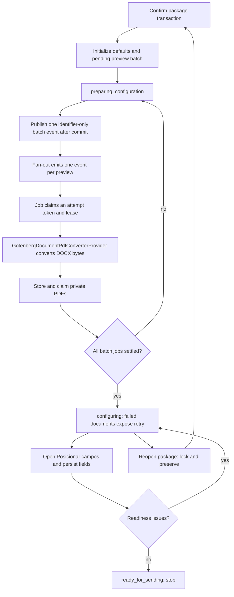

# 1. Context and scope

## Objective and source

This complete-mode Spec delivers only the configuration that precedes signing-link
creation. From `/formalizacoes/$formalizationId`, an authorized actor opens the dedicated
`/formalizacoes/$formalizationId/configuracao-envio` page to manage contextual signatories,
explicitly assign confirmed documents, choose an available channel, generate private PDF
previews and position signature fields. The result is a
server-derived `ready_for_sending` state; this delivery creates no request, link,
invitation, message or signing-provider integration.

The Formalization PRD and Jira `SCRUM-140` remain authoritative. Direct decisions in
this task narrow this delivery to pre-send configuration, approve Gotenberg as an
internal DOCX-to-PDF service and define package-reopen reconciliation.

## Current behavior and product gap

SCRUM-139 delivered the Formalization aggregate, contract form, Document Production
operations and document-package confirmation. The Web contains a static disabled
`FormalizationSendingConfiguration`, but Core and Server have no signatories,
assignments, fields, previews or readiness contracts. Approved document versions retain
TipTap content and an exported DOCX file. The existing `react-pdf` reader can display a
PDF but does not generate one or support accessible field placement.

## Scope and product alignment

| Area | In scope | Out of scope |
| --- | --- | --- |
| Signatories | Natural-person client first and non-removable; responsible lawyer by default; add/remove active Lawyer, Paralegal or Supervisor; purpose-built Identity projection without CPF | Legal-person clients, representatives, external signatories and new Identity contact fields |
| Documents | Explicit many-to-many assignment over the confirmed package; package reopen/reconfirm reconciliation | Editing Document Production content from the signature section |
| Preview | After package confirmation, one asynchronous private PDF preview per current document version, converted from its generated DOCX through Gotenberg; per-document processing/error/retry; `react-pdf` display | Final send snapshot, signed artifacts and evidence retention |
| Fields | Signature-only normalized page geometry; pointer, touch and keyboard editing; debounced persistence | Other field types and signing experience |
| Channels/readiness | Server-authoritative available channels, independently selectable channels per signatory, actionable readiness summary | Consent enforcement at delivery time, editable messages and channel fallback |
| Sending | Disabled future handoff visible in the expected card | Requests, recipients, links, invitations, delivery, resend, cancellation, webhooks and post-send progress |

| Source requirement | Delivery | Notes |
| --- | --- | --- |
| PRD contextual signatories | full | Client and responsible lawyer defaults plus eligible collaborators; CPF is excluded. |
| PRD remove additional signatory | partial | Full pre-send cascade is delivered; open-request restrictions are deferred because requests do not exist. |
| PRD assign documents | full | Assignments are explicit and initially empty. |
| PRD position fields | full | HMS owns normalized coordinates over versioned PDF previews. |
| PRD review before sending | partial | Summary, message preview, channel choice and readiness are included; send/review execution is deferred. |
| PRD delivery/provider outcomes | deferred | No signing or delivery integration is introduced. |
| Jira `SCRUM-140` | partial by direct request | Configuration only, ending at `ready_for_sending`. |
| Direct package-reopen decision | full | Reopen locks configuration immediately; reconfirm reconciles retained configuration by document/version identity. |
| Direct PDF timing/state decision | full | Confirmation creates an asynchronous batch immediately; UI reports `preparing_configuration` until all current jobs settle. |

## Product decisions and assumptions

- Configuration is editable only while the contract form and document package are
  confirmed and the Formalization is non-terminal.
- Defaults are initialized atomically when the package is confirmed. An idempotent
  initialization command supports already-confirmed legacy Formalizations; queries never
  mutate state.
- Every `DocumentVersion` continues to generate its DOCX exactly when the version is
  created. Confirmation does not regenerate DOCX.
- Package confirmation uses one dedicated transaction adapter to confirm the Formalization,
  initialize defaults and create/reconcile durable `pending` preview rows. After commit it
  publishes one batch event; an Inngest fan-out job emits one independently retryable event
  per preview. Confirmation does not wait for conversion.
- `ProcessFormalizationSignaturePreviewUseCase` resolves and loads the immutable DOCX
  associated with `DocumentVersion.fileId`. `GotenbergDocumentPdfConverterProvider`
  receives only those bytes and conversion options and returns PDF bytes; it reads no
  repository or storage and has no signing responsibility.
- Configuration status is `preparing_configuration` while at least one current preview is
  `pending` or `processing`. The card shows batch progress (`ready/total`) and field editing
  remains locked. When no job remains active, status becomes `configuring`; failed documents
  expose retry and keep readiness false.
- The current `FileStorageProvider` production binding is an in-memory fake. This delivery
  replaces it with durable private Supabase object storage plus persisted file metadata and
  read/remove capabilities for all existing version producers. A historical version whose
  bytes are absent is never regenerated or repointed automatically; it exposes
  `document_version_file_unavailable` and requires a newly generated version followed by
  package reconfirmation.
- Reopening the package immediately locks editing and makes readiness false while
  preserving signatories, channels, previews, assignments and fields provisionally.
  Reconfirmation reconciles them: unchanged document/version pairs are reused; removed
  documents lose assignments/fields and queue preview cleanup; changed versions retain
  old artifacts as stale while a replacement preview enters the new batch; added documents
  start without assignments/fields and with a pending preview. Reconfirmation therefore
  re-enters `preparing_configuration` whenever changed or added versions require PDFs.
- A collaborator currently exposes account e-mail only. Client channels derive from
  existing Identity contacts. No fallback channel is inferred.
- `Cancelar configuração` restores only the two defaults with empty assignments and
  channels, removes fields, and retains ready previews for the confirmed current versions.
  Only stale/orphan previews enter cleanup, so reset never leaves a confirmed package
  without a path back to configuration.
- Preview workers use attempt-token/lease CAS and never increment `Formalization.version`.
  Actor commands use the aggregate CAS; retry increments it once when `failed → pending`.
- A read-only query of an already-confirmed legacy Formalization without configuration
  returns `initialization_required`; the Web may issue exactly one explicit idempotent
  initialization command for that state.
- The expected frame shows the future send button as active. The approved pre-send scope
  intentionally renders it disabled with explanatory accessible text and no side effect.

# 2. Implementation Contract

## Functional requirements

| ID | PRD/Jira/source coverage | Required behavior |
| --- | --- | --- |
| `RF-01` | PRD actors; Jira `SCRUM-140` | Only the assigned lawyer or an administrator can read or mutate configuration; identifiers alone grant no access. |
| `RF-02` | PRD workflow; direct scope decision | Configuration is locked until form and package confirmation, locks immediately on package reopen and is read-only for terminal Formalizations. |
| `RF-03` | PRD contextual signatories | Confirmation or explicit legacy initialization creates exactly one client and one responsible-lawyer signatory, with empty assignments and no query-side mutation. |
| `RF-04` | PRD contextual signatories; modules authority | Candidate search is server-paginated and returns only active eligible collaborators not configured, with name, profile and available e-mail; CPF is never selected, returned, persisted or logged. |
| `RF-05` | PRD contextual signatories | Adding a collaborator rereads Identity and rejects duplicates, inactive/ineligible people and people without an available channel. |
| `RF-06` | PRD removal; frame `GlZGA` | Removing an additional collaborator atomically removes only that signatory's assignments, fields and selected channels; defaults and unrelated configuration remain. |
| `RF-07` | PRD document assignment | Each signatory owns an explicit replace-all document set. Every confirmed document needs a signatory and every signatory needs a document for readiness. |
| `RF-08` | Direct PDF timing decision; frame `HcT8k` | Confirmation atomically records a durable batch for every missing/stale approved selected-current version. After commit one batch event fans out through Inngest to an independently leased job per preview. The job loads the immutable DOCX, converts through Gotenberg, stores a private PDF and records page metadata; `Posicionar campos` only observes status and offers retry for failed previews. |
| `RF-09` | Frame `HcT8k`; accessibility decision | Viewer supports document/page selection, zoom, internal scrolling, loading/error/retry and pointer, touch and keyboard operation without page-level overflow. |
| `RF-10` | PRD field positioning | A field is `signature`, belongs to one current assignment/preview, uses a one-based page and normalized `0..100` top-left geometry, stays within the page and has positive size. |
| `RF-11` | PRD field positioning | Add/move/resize/remove auto-save through debounced replace-all with `expectedVersion`; failed saves remain visibly unsaved and retriable, while 409 reloads authoritative state. |
| `RF-12` | Accessibility decision | Keyboard users can add at a deterministic position, select, move with arrows, resize with modified arrows and delete; fields have semantic document/page/signatory labels. |
| `RF-13` | PRD channel selection | Each selected channel must remain among the signatory's current server-resolved channels; every channel selection or deselection rereads/revalidates availability without fallback. |
| `RF-14` | PRD review; direct scope decision | Readiness requires confirmed package, natural-person client, approved current versions/current previews, every document assigned, every assignment containing a valid current field and every signatory having an assignment and at least one available selected channel. |
| `RF-15` | PRD review; frame `YWfhi`; direct batch-state decision | The Formalization page shows the authoritative configuration summary and links to the dedicated configuration page. That page shows documents, signatories, assignments, channels, fixed message preview and issues. While post-confirmation PDFs run in batch it reports `preparing_configuration`, generated/total progress and locked field editing; after preparation it returns to `configuring` or, when complete, `ready_for_sending`. The send control stays disabled and produces no signing or delivery effect. |
| `RF-16` | Direct package-reopen and PDF timing decisions | Reopen preserves configuration provisionally and removes readiness; reconfirming the current package preserves the existing configuration atomically and creates no duplicate current previews. |
| `RF-17` | Direct reset decision | Reset requires destructive confirmation, restores default signatories with empty assignments/channels, removes fields, retains ready previews of current versions and schedules cleanup only for stale/orphan previews. |
| `RF-18` | PRD audit/concurrency | Actor mutations record actor/time and use Formalization `expectedVersion`; worker transitions record system audit and use preview attempt-token/lease CAS without incrementing the aggregate version. Conflicts never partially persist critical state. |

## Acceptance criteria

| ID | RF coverage | Requirement | Given | When | Then | Expected evidence |
| --- | --- | --- | --- | --- | --- | --- |
| `CA-01` | `RF-01`, `RF-02` | Access and lifecycle lock | Unconfirmed, confirmed, reopened or terminal Formalizations | Owner or administrator opens configuration | The authorized actor receives the correct lock state and lifecycle behavior | Core/controller tests; `MV-01` |
| `CA-02` | `RF-03` | Default initialization | New or legacy confirmed Formalization without rows | Confirmation/initialization races and configuration is queried | Exactly two unique defaults exist, ordered client first, with empty assignments; GET causes no write | Core/database/controller tests |
| `CA-03` | `RF-04`, `RF-05` | Authoritative eligible collaborators | Identity has eligible/ineligible and active/inactive people | Search/add receives pagination and forged attributes | Only authoritative eligible projections appear; invalid adds fail; no payload/log contains CPF | Core/controller tests; `MV-01` |
| `CA-04` | `RF-06`, `RF-07` | Assignment/removal cascade | Additional/default signatories have overlapping assignments and fields | Assignments are replaced or removal is confirmed | Only targeted pairs/fields are removed; defaults cannot be removed; nothing is auto-assigned | Core/database/widget tests |
| `CA-05` | `RF-08` | Post-confirmation independent previews | Package contains multiple approved selected-current versions with durable DOCX files | Confirmation commits; the batch fans out; one asynchronous conversion fails and retry succeeds | Missing/stale previews become pending atomically, jobs run independently with token/lease CAS, successful PDFs persist/reuse, one failure does not block siblings and retry creates no duplicate current ready preview | Transaction/event/job/provider/controller/database tests; `MV-01`, `MV-04` |
| `CA-06` | `RF-09`, `RF-10`, `RF-11`, `RF-12` | Accessible field editing | Multipage preview and assignment exist | Pointer, touch and keyboard edit valid/invalid field sets, including concurrent saves | Valid geometry reloads; invalid geometry is rejected; unsaved/conflict state is visible; focus and controls remain usable at 390px | Core/widget/route tests plus Validation lint/type-check; `MV-03` |
| `CA-07` | `RF-13`, `RF-14`, `RF-15` | Preparation/channel/readiness truth | Configuration is preparing, incomplete or complete and channel availability changes | It reloads during batch conversion and after mutation | Preparation shows accurate generated/total progress and locks fields; failures expose per-document retry; ready state appears only when all rules hold; send control makes zero signing/delivery side effects | Core/server/web tests; `MV-01`, `MV-04` |
| `CA-08` | `RF-16` | Reopen preservation and lock | Ready configuration exists | Package reopens and is reconfirmed without changing the current package | Editing locks immediately, configuration remains preserved, and no duplicate current preview is created | Core/database/controller/widget tests; `EV-15` |
| `CA-09` | `RF-17` | Reset behavior | Configuration contains additional rows and current/stale previews | Reset is confirmed and retried if necessary | Reset converges to empty defaults, retains usable current previews and cleanup owns only stale/orphan objects | Core/database/controller/web tests; `EV-15` |
| `CA-10` | all | Real authenticated completion | Auth, database, Server, Web and Gotenberg are healthy | Seeded administrator completes and reloads configuration | URL/content/persistence/PDF are real, no unexpected console/hydration/request error occurs and no signing or delivery request exists | `MV-01` evidence bundle |

## Cross-cutting restrictions

| Concern | Contract |
| --- | --- |
| Trust/privacy | Actor, people, contacts, documents, versions, approval, DOCX and page metadata are server-resolved. Purpose-built responses exclude CPF, addresses, source snapshots and storage paths. |
| Retention/LGPD | Gotenberg temporary files end with the request; Inngest carries only opaque IDs/tokens and safe codes. Current previews remain for the configuration purpose and stale/orphan objects are cleanup-owned. This delivery does not invent a new legal-retention period; later deletion follows the repository retention policy. No public URL or content-bearing log is created. |
| Tenancy | Every query and mutation is scoped through the accessible Formalization and its package; cross-formalization IDs fail without revealing ownership. |
| Concurrency | Formalization version is the actor-command CAS. Preview claims create a unique attempt token and lease; finalize/fail require that token. Worker transitions do not increment the aggregate version. Database uniqueness protects defaults, roles, assignments and current preview-work keys. |
| Transactions | A dedicated confirmation transaction performs Formalization CAS, defaults and current-preview reconciliation. Broker publication occurs after commit. Conversion/storage occurs outside transactions; metadata finalization uses token CAS and compensating cleanup. |
| Architecture validation | Dependency Cruiser runs for Core, Validation, Server and Web with no ignored violation baseline. Cross-module database access, Web REST/React Query boundaries and generated-route exceptions are explicitly owned by the workspace configurations. |
| Storage | DOCX and PDF bytes live in the private `documents` bucket with persisted `stored_files` metadata. Authorized server streaming is preferred over exposing paths. Stale/orphan cleanup is idempotent and must not affect a current ready preview. |
| External boundary | Gotenberg receives only DOCX bytes, an opaque trace ID and conversion options; it has no database/storage credentials and is unreachable from the browser/public network. |
| Exclusions | No signing-provider contract, recipient/request table, invitation, link, delivery event, webhook, resend, cancellation or post-send state may be introduced. |

## Design Contract

The normative bundle is [the design manifest](design/manifest.md). Expected nodes are
`YWfhi`, `Vx43H`, `sxENj`, `HcT8k` and `GlZGA`; `CNjkl` is the PDF-viewer subframe inside
`HcT8k`. Contextual/deferred images are not acceptance targets. Desktop frames govern
hierarchy and tokens, while 390 × 844 reflows controls above the viewer and keeps dialogs
inside the viewport. Loading, empty, per-preview error/retry, stale, unsaved, forbidden,
conflict, dark, focus and reduced-motion states reuse HMS patterns. The batch
`preparing_configuration` state uses the existing HMS progress/state-panel language and is
an accepted supplemental visual assumption. The disabled future send control is the
approved visual deviation.

# 3. Technical Contract

## Implementation boundary

Only metadata scope and the exact paths/trees declared below are writable for this
delivery. Formalization owns preview conversion, lifecycle and UI; Document Production owns
immutable source versions; Identity owns candidate data; shared Provision owns generic file
storage. Prohibited additions include signing-provider/request/link/message/webhook code,
PDF conversion ports under Document Production, browser Storage credentials or Gotenberg
access, generic outbox/event tables, generated route-tree edits and automatic mutation of a
historical `DocumentVersion.fileId`. Drizzle SQL/snapshot/journal files are generated only by
the documented migration command. Builder exits are Core, Validation, Server and Web tests,
static checks/builds, focused Playwright and the real `MV-*` scenarios in section 4.

## Current technical state

| Evidence | Current responsibility | Gap |
| --- | --- | --- |
| `apps/server/src/document-production/provision/docx-provider.ts` | Converts supported TipTap content to DOCX through `DocumentFileExporter` | No PDF conversion capability |
| `DocumentVersion.fileId`, `FileStorageProvider` and `FakeFileStorageProvider` | A DOCX is generated for every version and receives a file ID | Production binding keeps bytes/metadata only in an in-memory map and exposes no read operation; persisted versions are not durably retrievable after restart |
| `apps/web` dependencies `react-pdf@10.4.1` / `pdfjs-dist@5` | Display PDF content | Existing page reader is mouse-oriented and not a field editor |
| `ConfirmFormalizationDocumentsUseCase` and confirmation controller | Confirm current package | No default initialization or signature reconciliation |
| `FormalizationSendingConfiguration` | Static disabled Web card, now extracted as a dedicated page | No server query/actions or configured states |
| `docker-compose.yaml` | Local runtime services; `templates-server` serves Auth HTML only | No document-to-PDF service |

## Solution and runtime flow

Confirmation initializes defaults inside `FormalizationDocumentConfirmationTransaction`,
the same database consistency boundary that performs Formalization CAS and preview
reconciliation. A legacy POST initialization command is idempotent; GET is read-only and
returns `initialization_required` when applicable. Actor mutations use aggregate CAS;
worker lifecycle mutations use preview token/lease CAS.

Package confirmation atomically creates/reconciles one durable preview row per approved
selected-current version with `pending` state. After commit, the application publishes one
`FormalizationSignaturePreviewBatchGenerationRequestedEvent`; its fan-out job uses the
array form of `step.sendEvent` to emit one
`FormalizationSignaturePreviewGenerationRequestedEvent` per preview. A scheduled bounded
Inngest reconciliation function finds undispatched pending work, lease-expired processing
and cleanup-pending objects, so failures cannot permanently strand a confirmed package or
private object. Event payloads contain identifiers only; checksums are computed when the
worker loads the durable bytes.
If immediate Broker publication fails after commit, confirmation still succeeds and reports
`preparing_configuration`; the failure is recorded safely, a repeated confirmation call may
republish pending IDs idempotently and scheduled reconciliation is the final recovery owner.

`GenerateFormalizationSignaturePreviewJob` claims `pending → processing` with the
event's persisted attempt token and a new lease, loads the version's durably stored DOCX, computes its checksum,
calls `GotenbergDocumentPdfConverterProvider`, derives PDF checksum/page
metadata, stores the immutable PDF at
`formalization/{formalizationId}/signature-previews/{documentId}/{documentVersionId}/{previewId}.pdf`,
then atomically claims `processing → ready` only if attempt token, lease and version still
match. A lost claim
marks/removes the object idempotently. Retryable conversion failures use Inngest retries;
terminal exhaustion invokes `FailFormalizationSignaturePreviewUseCase`; it marks `failed`
only for the current token. `Posicionar campos` polls configuration while its status
is `preparing_configuration` and never initiates first-time generation. Authorized PDF
streaming reloads ownership on every request.

A retry of the same individual event may renew/re-enter `processing` only with its existing
attempt token and increments the durable attempt count. After lease expiry, reconciliation
CASes the row back to `pending` with a fresh token before publishing another batch; any late
finalize or `onFailure` from the old token becomes a no-op and cleans its unclaimed object.



## Boundary contracts

| Boundary | Producer | Consumer | Canonical contract | Mapping/guarantees | Failure ownership |
| --- | --- | --- | --- | --- | --- |
| Batch event | confirmation/initialization/reconciler | `GenerateFormalizationSignaturePreviewsInBatchJob` | `FormalizationSignaturePreviewBatchGenerationRequestedEvent` | One committed list of pending preview IDs; fan-out uses one memoized `step.sendEvent` array | direct post-commit Broker publication plus approved bounded reconciliation |
| Preview event | fan-out and actor retry | `GenerateFormalizationSignaturePreviewJob` | `FormalizationSignaturePreviewGenerationRequestedEvent` | Preview/Formalization/attempt identifiers only; at-least-once and idempotent by preview plus attempt token | token/lease CAS, Inngest retry and terminal-failure use case |
| DOCX conversion | `ProcessFormalizationSignaturePreviewUseCase` | `GotenbergDocumentPdfConverterProvider` | `DocumentPdfConverter.convert` | Durably loaded DOCX bytes in; bounded `application/pdf` bytes out; timeout and no provider persistence/read access | Provider returns a typed retryable/permanent error |
| PDF inspection | `ProcessFormalizationSignaturePreviewUseCase` | `PdfJsFormalizationDocumentPdfInspectorProvider` | `FormalizationDocumentPdfInspector.inspect` | Parses returned bytes server-side into one-based page count/point dimensions; no browser trust | inspector maps malformed/unsupported PDF safely |
| File storage | document-version creation and preview job | `SupabaseFileStorageProvider` | extended `FileStorageProvider` | Private bucket `documents`, persisted metadata, immutable paths, read/remove, no browser credential | provider maps storage failures; job compensates unclaimed PDF |
| Configuration persistence | Formalization use cases | Drizzle repository | `FormalizationSignatureConfigurationRepository` | Formalization-scoped CAS, atomic rows/reconciliation | Repository returns version conflict; use case translates domain errors |
| HTTP configuration | Controllers | `FormalizationService`/Web hooks | Core request/projection structures plus Validation schemas | UUID/finite geometry validation, authenticated actor, no storage paths | Controllers map 400/403/404/409/422/503 |
| PDF bytes | Authorized controller | `useSignaturePdfViewer` | `GET /formalizations/:id/signature-configuration/previews/:previewId/content` | Rechecks access/current-or-stale ownership; `application/pdf`, private cache policy | Controller maps access/not-found and streams safely |

## packages/core — Domain

| Declaration | Kind | Ownership/identity | Contract summary | Related declarations | Consumers |
| --- | --- | --- | --- | --- | --- |
| `FormalizationSignatory` | Entity | Formalization-owned UUID | Contextual person, order and independently selected channels | assignments | configuration use cases/repository |
| `FormalizationSignatoryDocument` | Entity | Formalization-owned UUID | Explicit signatory/document/version pair | signatory, fields | assignment/preview use cases |
| `FormalizationSignatureField` | Entity | Formalization-owned UUID | Normalized signature geometry bound to preview | assignment, preview | field use case/viewer |
| `FormalizationSignaturePreview` | Entity | Formalization-owned UUID | Versioned private PDF metadata/lifecycle | page metadata | preview/readiness/cleanup |
| `FormalizationSignatureConfiguration` | Structure | Identity-free projection | Complete server-authoritative UI view | all view structures | REST/Web |
| `FormalizationSignaturePreviewBatchGenerationRequestedEvent` | Event | Formalization-owned fact | Requests durable fan-out for a committed preview list | preview IDs | broker/fan-out job |
| `FormalizationSignaturePreviewGenerationRequestedEvent` | Event | Formalization-owned fact | Requests one idempotent preview job without document bytes or personal attributes | preview/version/checksum | broker/Inngest job |

| Path | Change | Declaration | Domain role/schema | Invariants/transitions | Errors/events | Exports/consumers |
| --- | --- | --- | --- | --- | --- | --- |
| `packages/core/src/formalization/domain/entities/formalization-signatory.ts` | Create | `FormalizationSignatory` Entity | Schema below | unique person/formalization; client first; defaults non-removable | configuration errors | entities barrel |
| `packages/core/src/formalization/domain/entities/formalization-signatory-document.ts` | Create | `FormalizationSignatoryDocument` Entity | Schema below | unique signatory/document; version belongs to current package document | configuration errors | entities barrel |
| `packages/core/src/formalization/domain/entities/formalization-signature-field.ts` | Create | `FormalizationSignatureField` Entity | Schema below | signature-only; valid normalized rectangle/page; preview matches pair/version | field errors | entities barrel |
| `packages/core/src/formalization/domain/entities/formalization-signature-preview.ts` | Create | `FormalizationSignaturePreview` Entity | Schema below | lifecycle `pending → processing → ready/failed`; ready may become stale/cleanup pending | preview errors | entities barrel |
| `packages/core/src/formalization/domain/structures/formalization-signature-{configuration,signatory-view,document-view,preview-view,field-view,readiness,readiness-issue,preview-preparation,status,signatory-role,preview-state,field-type}.ts` | Create | One exported canonical Structure per file | Schemas below and closed `as const` unions | readiness derived; no CPF/path/source content | — | structures barrel/REST/Web |
| `packages/core/src/formalization/domain/errors/formalization-signature-*.ts` | Create | One named Error per file | Access, state, field, preview, conversion and file-unavailable failures | no provider/framework types; conversion error carries `retryable` | named errors | errors barrel/use cases |
| `packages/core/src/formalization/domain/events/formalization-signature-preview-batch-generation-requested-event.ts` | Create | `FormalizationSignaturePreviewBatchGenerationRequestedEvent extends Event` | Committed preview IDs and ISO occurrence time | one event per committed/reconciled batch | stable `_NAME` | events barrel/fan-out job |
| `packages/core/src/formalization/domain/events/formalization-signature-preview-generation-requested-event.ts` | Create | `FormalizationSignaturePreviewGenerationRequestedEvent` Event | Serializable payload below | emitted only for committed pending preview; at-least-once safe | stable `_NAME` | events barrel/broker/job |
| `packages/core/src/formalization/domain/entities/index.ts` | Modify | public exports | Exports four entities | — | — | module consumers |
| `packages/core/src/formalization/domain/structures/index.ts` | Modify | public exports | Exports configuration structures | — | — | module consumers |
| `packages/core/src/formalization/domain/errors/index.ts` | Modify | public exports | Exports named errors | — | — | module consumers |
| `packages/core/src/formalization/domain/events/index.ts` | Create | public exports | Exports batch/individual preview request events | — | — | broker/jobs |
| `packages/core/src/formalization/domain/index.ts` | Modify | domain exports | Exports the new events namespace alongside entities/errors/structures | — | — | package consumers |

Exact Formalization declaration tree (one exported declaration per file):

```text
packages/core/src/formalization/domain/structures/formalization-signature-configuration.ts
packages/core/src/formalization/domain/structures/formalization-signature-signatory-view.ts
packages/core/src/formalization/domain/structures/formalization-signature-document-view.ts
packages/core/src/formalization/domain/structures/formalization-signature-preview-view.ts
packages/core/src/formalization/domain/structures/formalization-signature-field-view.ts
packages/core/src/formalization/domain/structures/formalization-signature-readiness.ts
packages/core/src/formalization/domain/structures/formalization-signature-readiness-issue.ts
packages/core/src/formalization/domain/structures/formalization-signature-preview-preparation.ts
packages/core/src/formalization/domain/structures/formalization-signature-status.ts
packages/core/src/formalization/domain/structures/formalization-signatory-role.ts
packages/core/src/formalization/domain/structures/formalization-signature-preview-state.ts
packages/core/src/formalization/domain/structures/formalization-signature-preview-failure-code.ts
packages/core/src/formalization/domain/structures/formalization-signature-field-type.ts
packages/core/src/formalization/domain/structures/formalization-signature-candidate.ts
packages/core/src/formalization/domain/structures/formalization-signature-candidate-page.ts
packages/core/src/formalization/domain/structures/formalization-signature-source-person.ts
packages/core/src/formalization/domain/structures/formalization-signature-source-document.ts
packages/core/src/formalization/domain/structures/formalization-signature-preview-claim.ts
packages/core/src/formalization/domain/structures/formalization-signature-preview-cleanup-candidate.ts
packages/core/src/formalization/domain/structures/formalization-document-pdf-conversion.ts
packages/core/src/formalization/domain/structures/formalization-document-pdf-conversion-result.ts
packages/core/src/formalization/domain/structures/formalization-document-pdf-inspection.ts
packages/core/src/formalization/domain/events/formalization-signature-preview-batch-generation-requested-event.ts
packages/core/src/formalization/domain/events/formalization-signature-preview-generation-requested-event.ts
packages/core/src/formalization/domain/errors/formalization-document-pdf-conversion-error.ts
packages/core/src/formalization/domain/errors/formalization-document-pdf-inspection-error.ts
packages/core/src/formalization/domain/errors/formalization-signature-access-error.ts
packages/core/src/formalization/domain/errors/formalization-signature-not-initialized-error.ts
packages/core/src/formalization/domain/errors/formalization-signatory-ineligible-error.ts
packages/core/src/formalization/domain/errors/formalization-signatory-duplicate-error.ts
packages/core/src/formalization/domain/errors/formalization-default-signatory-removal-error.ts
packages/core/src/formalization/domain/errors/formalization-signature-channel-unavailable-error.ts
packages/core/src/formalization/domain/errors/formalization-signature-assignment-error.ts
packages/core/src/formalization/domain/errors/formalization-signature-field-error.ts
packages/core/src/formalization/domain/errors/formalization-signature-preview-not-ready-error.ts
packages/core/src/formalization/domain/errors/formalization-signature-preview-claim-conflict-error.ts
packages/core/src/formalization/domain/errors/formalization-signature-document-version-file-unavailable-error.ts
```

`FormalizationSignatureCandidate` contains readonly collaborator ID, name,
`CollaboratorProfile`, e-mail and canonical available channels; its page contains readonly
items plus `page`, `limit` and `total`. Source-person and source-document Structures are the
minimal no-CPF projections consumed by use cases. Preview claim contains preview ID,
attempt token and lease expiry; cleanup candidate contains only preview/file IDs.

```ts
export type FormalizationSignatory = Entity & {
  formalizationId: string
  role: FormalizationSignatoryRole
  personId: string
  position: number
  selectedChannels: readonly CommunicationChannel[]
  createdByCollaboratorId: string; createdAt: Date; updatedByCollaboratorId: string; updatedAt: Date
}
```

**Schema — `FormalizationSignatory`**

| Field | Type | Required | Validation | Description |
| --- | --- | --- | --- | --- |
| `id`, `formalizationId`, `personId` | `string` | Yes | UUID; referenced identity | Entity, owner and person IDs |
| `role` | `FormalizationSignatoryRole` | Yes | `client \| responsible_lawyer \| additional_collaborator` | Persisted role; `removable` derives only for additional collaborator |
| `position` | `number` | Yes | integer ≥ 1; unique per owner | Display order |
| `selectedChannels` | `readonly CommunicationChannel[]` | Yes | every selected channel must remain available; may be empty while configuring | Selected e-mail/WhatsApp channels |
| `createdByCollaboratorId`, `updatedByCollaboratorId` | `string` | Yes | UUID | Audit actors |
| `createdAt`, `updatedAt` | `Date` | Yes | valid date | Audit time |

```ts
export type FormalizationSignatoryDocument = Entity & {
  formalizationId: string; signatoryId: string; documentId: string
  documentVersionId: string; createdByCollaboratorId: string; createdAt: Date
}
```

**Schema — `FormalizationSignatoryDocument`**

| Field | Type | Required | Validation | Description |
| --- | --- | --- | --- | --- |
| `id`, `formalizationId`, `signatoryId`, `documentId`, `documentVersionId` | `string` | Yes | UUID; owner-consistent references | Identity, owner, signatory, document and pinned current version |
| `createdByCollaboratorId` | `string` | Yes | UUID | Audit actor |
| `createdAt` | `Date` | Yes | valid date | Creation time |

```ts
export type FormalizationSignatureField = Entity & {
  formalizationId: string; signatoryDocumentId: string; previewId: string
  type: typeof FormalizationSignatureFieldType.Signature; page: number; positionX: number; positionY: number
  width: number; height: number; createdByCollaboratorId: string; createdAt: Date
  updatedByCollaboratorId: string; updatedAt: Date
}
```

**Schema — `FormalizationSignatureField`**

| Field | Type | Required | Validation | Description |
| --- | --- | --- | --- | --- |
| `id`, `formalizationId`, `signatoryDocumentId`, `previewId` | `string` | Yes | UUID; owner-consistent references | Identity and owning pair/preview |
| `type` | `'signature'` | Yes | exact literal | Supported field type |
| `page` | `number` | Yes | integer 1..preview page count | PDF page |
| `positionX`, `positionY` | `number` | Yes | finite 0..100 | Normalized top-left position |
| `width`, `height` | `number` | Yes | finite > 0..100; rectangle contained | Normalized size |
| audit actor/time fields | `string` / `Date` | Yes | UUID / valid date | Creation/update audit |

```ts
export type FormalizationSignaturePreview = Entity & {
  formalizationId: string; documentId: string; documentVersionId: string
  fileId?: string; contentChecksumSha256?: string; pdfChecksumSha256?: string
  converterVersion?: string; pageCount?: number
  pages: ReadonlyArray<{ page: number; width: number; height: number }>
  byteSize?: number
  state: FormalizationSignaturePreviewState
  attemptsCount: number; attemptToken?: string; processingStartedAt?: Date; leaseExpiresAt?: Date
  failureCode?: FormalizationSignaturePreviewFailureCode; createdAt: Date; updatedAt: Date
}
```

**Schema — `FormalizationSignaturePreview`**

| Field | Type | Required | Validation | Description |
| --- | --- | --- | --- | --- |
| `id`, `formalizationId`, `documentId`, `documentVersionId` | `string` | Yes | UUID; owner/version consistent | Preview and source identity |
| `fileId` | `string` | Conditional | UUID when ready/stale/cleanup pending | Private stored PDF reference |
| `contentChecksumSha256` | `string` | Conditional | lowercase SHA-256 hex after the first claim loads bytes | DOCX input identity; not required at confirmation |
| `pdfChecksumSha256` | `string` | Conditional | lowercase SHA-256 hex when PDF exists | PDF identity |
| `converterVersion` | `string` | Conditional | non-empty when PDF exists | Cache invalidation key |
| `pageCount` | `number` | Conditional | integer ≥ 1 when PDF exists | PDF page count |
| `pages` | `ReadonlyArray<{ page; width; height }>` | Yes | empty before PDF; otherwise contiguous/positive | Natural PDF geometry |
| `byteSize` | `number` | Conditional | positive bounded integer when PDF exists | PDF size |
| `state` | `'pending' \| 'processing' \| 'ready' \| 'failed' \| 'stale' \| 'cleanup_pending'` | Yes | closed lifecycle | Queue/conversion/reuse/cleanup state |
| `attemptsCount` | `number` | Yes | integer ≥ 0 | Durable attempt count |
| `attemptToken` | `string` | Pending/processing | UUID assigned when work is scheduled | Identifies the exact delivery/retry generation |
| `processingStartedAt`, `leaseExpiresAt` | `Date` | Processing only | valid ordered dates | Prevents stale-worker ABA and bounds recovery |
| `failureCode` | `FormalizationSignaturePreviewFailureCode` | No | safe closed code; no remote body | Last visible failure category |
| `createdAt`, `updatedAt` | `Date` | Yes | valid dates | Lifecycle times |

```ts
export class FormalizationSignaturePreviewBatchGenerationRequestedEvent extends Event<{
  formalizationId: string
  items: readonly { previewId: string; attemptToken: string }[]
  occurredAt: string
}> {
  static readonly _NAME = 'formalization/signature-preview.batch-generation-requested'
  constructor(payload: {
    formalizationId: string
    items: readonly { previewId: string; attemptToken: string }[]
    occurredAt: string
  }) {
    super(FormalizationSignaturePreviewBatchGenerationRequestedEvent._NAME, payload)
  }
}
```

```ts
export class FormalizationSignaturePreviewGenerationRequestedEvent extends Event<{
  previewId: string
  formalizationId: string
  attemptToken: string
  occurredAt: string
}> {
  static readonly _NAME = 'formalization/signature-preview.generation-requested'
  constructor(payload: {
    previewId: string
    formalizationId: string
    attemptToken: string
    occurredAt: string
  }) {
    super(FormalizationSignaturePreviewGenerationRequestedEvent._NAME, payload)
  }
}
```

Each projection above is declared in its own kebab-case file. Projection identities use
`signatoryId`, `previewId` and `fieldId`, never a bare `id`. All properties and nested
collections are readonly. `FormalizationSignatureStatus` additionally contains
`initialization_required`; during package reopen, `documents` is the retained
last-confirmed snapshot and GET performs no reconciliation.

**Schema — `FormalizationSignatureConfiguration`**

| Field | Type | Required | Validation | Description |
| --- | --- | --- | --- | --- |
| `formalizationId` | `string` | Yes | UUID | Owner |
| `version` | `number` | Yes | integer ≥ 0 | CAS version |
| `editable` | `boolean` | Yes | derived | Mutation availability |
| `status` | `FormalizationSignatureStatus` | Yes | lifecycle-derived | Initialization-required/locked/preparing/configuring/ready/read-only state |
| `previewPreparation` | `FormalizationSignaturePreviewPreparation` | Yes | counts sum to total | Batch-generation progress |
| `signatories` | `ReadonlyArray<FormalizationSignatureSignatoryView>` | Yes | ordered | Signatory projections |
| `documents` | `ReadonlyArray<FormalizationSignatureDocumentView>` | Yes | confirmed package order | Document projections |
| `readiness` | `FormalizationSignatureReadiness` | Yes | derived | Issues and count |

**Schema — `FormalizationSignatureSignatoryView`**

| Field | Type | Required | Validation | Description |
| --- | --- | --- | --- | --- |
| `signatoryId`, `personId` | `string` | Yes | UUID | Signatory and Identity references |
| `role` | `FormalizationSignatoryRole` | Yes | canonical closed union | Client, responsible lawyer or additional collaborator |
| `name` | `string` | Yes | non-empty bounded text | Display name |
| `profile` | `'lawyer' \| 'paralegal' \| 'supervisor'` | Conditional | collaborator only | Eligible profile |
| `removable` | `boolean` | Yes | false for defaults | Removal affordance |
| `availableChannels` | `ReadonlyArray<'email' \| 'whatsapp'>` | Yes | unique values | Current authoritative choices |
| `selectedChannels` | `readonly ('email' \| 'whatsapp')[]` | Yes | subset of available channels | Selected future channels |
| `documentIds` | `ReadonlyArray<string>` | Yes | unique UUIDs | Explicit assignments |

**Schema — `FormalizationSignatureDocumentView`**

| Field | Type | Required | Validation | Description |
| --- | --- | --- | --- | --- |
| `documentId`, `documentVersionId` | `string` | Yes | UUID/current-version relation | Document/version identity |
| `name`, `reviewStatus` | `string` | Yes | non-empty/authoritative | Display and review state |
| `preview` | `FormalizationSignaturePreviewView` | No | current or retained stale preview | Preview metadata |
| `fields` | `ReadonlyArray<FormalizationSignatureFieldView>` | Yes | owner-consistent | Positioned fields |

**Schema — `FormalizationSignaturePreviewView`**

| Field | Type | Required | Validation | Description |
| --- | --- | --- | --- | --- |
| `previewId` | `string` | Yes | UUID | Preview identity |
| `state` | `'pending' \| 'processing' \| 'ready' \| 'failed' \| 'stale' \| 'cleanup_pending'` | Yes | closed lifecycle | Preview usability/progress |
| `failureCode` | `string` | No | safe bounded code; failed state only | Actionable retry category |
| `pageCount` | `number` | Conditional | integer ≥ 1 when ready/stale | Page count |
| `pages` | `ReadonlyArray<{ page: number; width: number; height: number }>` | Yes | empty before ready; otherwise contiguous/positive | Viewer geometry |

**Schema — `FormalizationSignatureFieldView`**

| Field | Type | Required | Validation | Description |
| --- | --- | --- | --- | --- |
| `fieldId`, `signatoryId`, `previewId` | `string` | Yes | UUID/owner-consistent | Field/signatory/preview identity |
| `type` | `'signature'` | Yes | exact literal | Field kind |
| `page` | `number` | Yes | one-based within preview | Page |
| `positionX`, `positionY`, `width`, `height` | `number` | Yes | finite contained normalized rectangle | Geometry |

**Schema — `FormalizationSignatureReadiness`**

| Field | Type | Required | Validation | Description |
| --- | --- | --- | --- | --- |
| `ready` | `boolean` | Yes | equals zero issues | Completion flag |
| `assignmentCount` | `number` | Yes | integer ≥ 0 | Summary count |
| `issues` | `ReadonlyArray<{ path: string; code: FormalizationSignatureReadinessIssueCode }>` | Yes | stable path/closed code union | Actionable blockers |

**Schema — `FormalizationSignaturePreviewPreparation`**

| Field | Type | Required | Validation | Description |
| --- | --- | --- | --- | --- |
| `total` | `number` | Yes | integer ≥ 0 | Current package previews expected |
| `pending` | `number` | Yes | integer ≥ 0 | Durable requests awaiting work |
| `processing` | `number` | Yes | integer ≥ 0 | Jobs currently converting |
| `ready` | `number` | Yes | integer ≥ 0 | Current PDFs available |
| `failed` | `number` | Yes | integer ≥ 0; all counts sum to total | Current previews requiring retry |

Canonical readiness codes are
`package_unconfirmed`, `initialization_required`, `preparation_pending`,
`preview_failed`, `version_not_approved`, `document_unassigned`,
`signatory_unassigned`, `field_missing`, `selected_channel_missing` and
`selected_channel_unavailable`. Canonical preview failure codes are
`document_version_file_unavailable`, `conversion_rejected`,
`conversion_unavailable`, `invalid_pdf` and `storage_unavailable`. Provider details never
cross these closed unions.

The PDF conversion input, result, inspection and stored-file content are each declared
as one exported readonly Structure in their own kebab-case file. Conversion declarations
are Formalization-owned; `StoredFileContent` remains shared infrastructure-neutral data.

**Schema — `FormalizationDocumentPdfConversion`**

| Field | Type | Required | Validation | Description |
| --- | --- | --- | --- | --- |
| `fileName` | `string` | Yes | bounded `.docx` name | Safe multipart filename |
| `contentType` | DOCX MIME literal | Yes | exact literal | Input media type |
| `content` | `Uint8Array` | Yes | non-empty/provider-bounded | DOCX bytes |
| `traceId` | `string` | Yes | opaque bounded value | Correlation without business data |

**Schema — `FormalizationDocumentPdfConversionResult`**

| Field | Type | Required | Validation | Description |
| --- | --- | --- | --- | --- |
| `contentType` | `'application/pdf'` | Yes | exact literal | Output media type |
| `content` | `Uint8Array` | Yes | non-empty/bounded/PDF signature | PDF bytes |
| `converterVersion` | `string` | Yes | non-empty bounded value | Cache identity |

**Schema — `StoredFileContent`**

| Field | Type | Required | Validation | Description |
| --- | --- | --- | --- | --- |
| `file` | `File` | Yes | persisted metadata entity | File identity/path/media/size/timestamp |
| `content` | `Uint8Array` | Yes | bytes match metadata size | Private object content |

**Schema — `FormalizationDocumentPdfInspection`**

| Field | Type | Required | Validation | Description |
| --- | --- | --- | --- | --- |
| `pageCount` | `number` | Yes | integer ≥ 1 | Parsed PDF page count |
| `pages` | `ReadonlyArray<{ page: number; width: number; height: number }>` | Yes | contiguous one-based pages; positive point dimensions | Server-authoritative geometry |

### packages/core — Formalization PDF conversion and shared stored content

| Path | Change | Declaration | Domain role/schema | Invariants | Errors | Exports/consumers |
| --- | --- | --- | --- | --- | --- | --- |
| `packages/core/src/formalization/domain/structures/formalization-document-pdf-{conversion,conversion-result,inspection}.ts` | Create | One exported readonly Structure per file | Schemas above | DOCX input/PDF output only; no service/storage types | conversion/inspection errors | structures barrel/converter ports |
| `packages/core/src/formalization/domain/errors/formalization-document-pdf-{conversion,inspection}-error.ts` | Create | One named Error per file | Safe typed failures; conversion includes retryable/permanent discriminator | no remote body, parser internals or secret | self | errors barrel/use case |
| `packages/core/src/shared/domain/structures/stored-file-content.ts` | Create | `StoredFileContent` Structure | Schema above | metadata and bytes remain consistent | storage error | shared structures barrel/file consumers |
| `packages/core/src/shared/domain/structures/index.ts` | Modify | public export | Exports `StoredFileContent` | — | — | storage consumers |

## packages/core — Use cases and Interfaces

| Use case | Actor/trigger | Input/output | Direct collaborators | Consistency boundary | Failures/side effects |
| --- | --- | --- | --- | --- | --- |
| `GetFormalizationSignatureConfigurationUseCase` | owner/admin | actor + ID → projection | repository/source reader | read-only tenant scope | access/not found |
| `ListFormalizationSignatureCandidatesUseCase` | owner/admin | actor + ID + page query → candidates | source reader/repository | read-only tenant scope | access/not found |
| `InitializeFormalizationSignatureConfigurationUseCase` | owner/admin legacy command | actor + ID + expectedVersion → projection | repository/source reader/Broker | idempotent CAS transaction | creates pending batch and publishes after commit for already-confirmed legacy package |
| `AddFormalizationSignatoryUseCase` | owner/admin | person ID + expectedVersion → projection | repository/source reader | one CAS transaction | eligibility/duplicate/channel errors |
| `RemoveFormalizationSignatoryUseCase` | owner/admin | signatory ID + expectedVersion → projection | repository | one CAS transaction | protected-default/not-found errors; owned cascade |
| `ReplaceFormalizationSignatoryDocumentsUseCase` | owner/admin | signatory/document IDs + expectedVersion → projection | repository/source reader | one CAS transaction | package/version/assignment errors |
| `SelectFormalizationSignatoryChannelUseCase` | owner/admin | signatory/channel + expectedVersion → projection | repository/source reader | one CAS transaction | unavailable-channel error |
| `ReplaceFormalizationSignatureFieldsUseCase` | owner/admin | document/preview/fields + expectedVersion → projection | repository | one CAS transaction | assignment/preview/geometry errors |
| `ResetFormalizationSignatureConfigurationUseCase` | owner/admin | ID + expectedVersion → projection | repository | one CAS transaction | retains current ready previews; stale/orphan cleanup after commit |
| `RequestFormalizationSignaturePreviewGenerationUseCase` | owner/admin retry | failed preview ID + expectedVersion → projection | repository/broker | CAS `failed → pending`, publish after commit | duplicate request is idempotent |
| `ProcessFormalizationSignaturePreviewUseCase` | Inngest job | preview ID + attempt token → attempt result | source reader, converter, inspector, file storage, repository | activates token/lease claim; final CAS includes token | throws retryable failures; compensates lost claim; missing historical DOCX is permanent |
| `FailFormalizationSignaturePreviewUseCase` | Inngest `onFailure` | preview ID + attempt token + safe code → void | repository | token CAS | only current attempt becomes failed |
| `ReconcileFormalizationSignaturePreviewsUseCase` | scheduled Inngest job | bounded pending/expired/cleanup query → batch IDs/actions | repository, broker, file storage | bounded token-aware claims | publishes batch events, expires leases and removes cleanup objects |
| `GetFormalizationSignaturePreviewContentUseCase` | owner/admin | preview ID → private file | repository/storage | read-only tenant scope | access/not found/stale policy |
| `ReopenFormalizationDocumentPackageUseCase` | owner/admin | ID + expectedVersion → Formalization | repositories | atomic lock transition | no external cancellation |
| `ConfirmFormalizationDocumentsUseCase` | owner/admin | existing request → committed result | readers, `FormalizationDocumentConfirmationTransaction`, Broker | one dedicated DB transaction | publishes one batch event after commit; scheduled reconciliation covers publish failure |

| Path | Change | Declaration/signature | Contract and consumers |
| --- | --- | --- | --- |
| `packages/core/src/formalization/interfaces/document-pdf-converter.ts` | Create | `DocumentPdfConverter.convert(input): Promise<FormalizationDocumentPdfConversionResult>` | Formalization-owned provider-neutral conversion port |
| `packages/core/src/formalization/interfaces/formalization-document-pdf-inspector.ts` | Create | `inspect(content): Promise<FormalizationDocumentPdfInspection>` | Formalization-owned server-authoritative page metadata port |
| `packages/core/src/shared/interfaces/file-storage-provider.ts` | Modify | `save(input)`, `get(fileId)`, `remove(fileId)` | Durable metadata+private bytes; `get` returns `StoredFileContent \| null`; remove is idempotent |
| `packages/core/src/shared/interfaces/storage-provider.ts` | Modify | `upload(path, bytes, mime)`, `download(path)`, `remove(path)` | Private object capability used only by server adapters |
| `packages/core/src/shared/interfaces/stored-files-repository.ts` | Create | `add`, `findById`, `remove` | Persisted `File` metadata capability |
| `packages/core/src/shared/interfaces/index.ts` | Modify | public exports | Exports changed/new storage contracts |
| `packages/core/src/formalization/interfaces/formalization-signature-configuration-repository.ts` | Create | scoped reads plus primitive actor CAS and token/lease preview mutations | Use cases own defaults, lifecycle, reconciliation and readiness; repository only persists decided transitions |
| `packages/core/src/formalization/interfaces/formalization-document-confirmation-transaction.ts` | Create | `confirm(request)` and `initializeConfirmed(request)` return `{ formalization; pendingPreviewIds }` | Atomic Formalization CAS + defaults + approved selected-version current-preview reconciliation for new or legacy confirmed packages; no Broker call |
| `packages/core/src/formalization/interfaces/formalization-signature-source-reader.ts` | Create | resolve people/channels and package/document/version/file metadata | Cross-module authoritative projections only; bytes load through `FileStorageProvider` |
| `packages/core/src/formalization/interfaces/formalization-service.ts` | Modify | exact configuration CRUD, initialize/retry/reopen and `getSignaturePreviewContent` methods | Shared Web/Server action contract; PDF method returns file response rather than JSON |
| `packages/core/src/identity/interfaces/collaborators-repository.ts` | Modify | list query accepts canonical `profiles?: readonly CollaboratorProfile[]` with page/limit | Database paginates the eligible union; no post-pagination filtering |
| `packages/core/src/formalization/use-cases/get-formalization-signature-configuration-use-case.ts` | Create | exact use case named above | Read-only query |
| `packages/core/src/formalization/use-cases/list-formalization-signature-candidates-use-case.ts` | Create | exact use case named above | Read-only authoritative eligible-person query |
| `packages/core/src/formalization/use-cases/initialize-formalization-signature-configuration-use-case.ts` | Create | exact use case named above | Legacy/idempotent defaults plus post-commit pending-preview publication |
| `packages/core/src/formalization/use-cases/add-formalization-signatory-use-case.ts` | Create | add collaborator command | Authoritative eligibility and duplicate checks |
| `packages/core/src/formalization/use-cases/remove-formalization-signatory-use-case.ts` | Create | remove signatory command | Non-default cascade |
| `packages/core/src/formalization/use-cases/replace-formalization-signatory-documents-use-case.ts` | Create | replace-all document IDs | Explicit assignments/current versions |
| `packages/core/src/formalization/use-cases/select-formalization-signatory-channel-use-case.ts` | Create | channel command | Revalidates current availability |
| `packages/core/src/formalization/use-cases/replace-formalization-signature-fields-use-case.ts` | Create | replace-all fields for document/preview | Geometry, assignment and current-preview rules |
| `packages/core/src/formalization/use-cases/request-formalization-signature-preview-generation-use-case.ts` | Create | failed-preview retry command | CAS to pending and after-commit request event |
| `packages/core/src/formalization/use-cases/process-formalization-signature-preview-use-case.ts` | Create | Inngest processing action | Loads generated DOCX, conversion, PDF storage, page metadata, ready claim and compensation |
| `packages/core/src/formalization/use-cases/fail-formalization-signature-preview-use-case.ts` | Create | terminal failure action | Marks only the current attempt token failed with a safe code |
| `packages/core/src/formalization/use-cases/reconcile-formalization-signature-previews-use-case.ts` | Create | scheduled reconciliation action | Publishes bounded batch events, recovers expired leases and deletes cleanup-pending files/metadata idempotently |
| `packages/core/src/formalization/use-cases/get-formalization-signature-preview-content-use-case.ts` | Create | authorized content query | Rechecks Formalization ownership and returns private file |
| `packages/core/src/formalization/use-cases/reset-formalization-signature-configuration-use-case.ts` | Create | reset command | Atomic defaults/reset and cleanup candidates |
| `packages/core/src/formalization/use-cases/reopen-formalization-document-package-use-case.ts` | Create | reopen command | Immediate configuration lock/preservation |
| `packages/core/src/formalization/use-cases/confirm-formalization-documents-use-case.ts` | Modify | existing confirmation action | Loads `Document.currentVersionId`, requires approved/fresh selected versions, invokes dedicated transaction, then publishes one batch event after commit |
| `packages/core/src/formalization/use-cases/index.ts` | Modify | public exports | Exports all actions |
| `packages/core/src/formalization/interfaces/index.ts` | Modify | public exports | Exports repository/source ports |

The signature repository exposes primitive, Formalization-scoped operations: read the
snapshot; apply one actor mutation with `expectedFormalizationVersion`; schedule pending
work with a fresh attempt token; claim that token and return its lease; finalize/fail only
with `{ previewId, attemptToken }`; list bounded pending/expired/cleanup candidates; and
mark cleanup complete. `FormalizationDocumentConfirmationTransaction` is the only port that
combines `FormalizationsRepository` and signature rows for both confirmation and explicit
legacy initialization. Retry changes `failed → pending`
inside an actor CAS, then publishes one individual event after commit. The scheduled
reconciler groups pending IDs into a batch event; it never stores arbitrary event envelopes.

| Test path | Change | Target |
| --- | --- | --- |
| `packages/core/src/formalization/use-cases/tests/get-formalization-signature-configuration-use-case.test.ts` | Create | read-only projection/access |
| `packages/core/src/formalization/use-cases/tests/list-formalization-signature-candidates-use-case.test.ts` | Create | eligibility/privacy/pagination |
| `packages/core/src/formalization/use-cases/tests/initialize-formalization-signature-configuration-use-case.test.ts` | Create | legacy idempotency/concurrency |
| `packages/core/src/formalization/use-cases/tests/add-formalization-signatory-use-case.test.ts` | Create | authoritative add rules |
| `packages/core/src/formalization/use-cases/tests/remove-formalization-signatory-use-case.test.ts` | Create | protected defaults/cascade |
| `packages/core/src/formalization/use-cases/tests/replace-formalization-signatory-documents-use-case.test.ts` | Create | replace-all assignments |
| `packages/core/src/formalization/use-cases/tests/select-formalization-signatory-channel-use-case.test.ts` | Create | current channel validation |
| `packages/core/src/formalization/use-cases/tests/replace-formalization-signature-fields-use-case.test.ts` | Create | geometry/current preview/CAS |
| `packages/core/src/formalization/use-cases/tests/request-formalization-signature-preview-generation-use-case.test.ts` | Create | retry state/event/idempotency |
| `packages/core/src/formalization/use-cases/tests/process-formalization-signature-preview-use-case.test.ts` | Create | generated-DOCX load/conversion/claim/compensation |
| `packages/core/src/formalization/use-cases/tests/fail-formalization-signature-preview-use-case.test.ts` | Create | current-token terminal failure and stale-token no-op |
| `packages/core/src/formalization/use-cases/tests/reconcile-formalization-signature-previews-use-case.test.ts` | Create | publish/worker/storage recovery |
| `packages/core/src/formalization/use-cases/tests/get-formalization-signature-preview-content-use-case.test.ts` | Create | authorized private content |
| `packages/core/src/formalization/use-cases/tests/reset-formalization-signature-configuration-use-case.test.ts` | Create | atomic reset/cleanup candidates |
| `packages/core/src/formalization/use-cases/tests/reopen-formalization-document-package-use-case.test.ts` | Create | immediate lock/preservation |
| `packages/core/src/formalization/use-cases/tests/confirm-formalization-documents-use-case.test.ts` | Modify | initialization/current-preview reconciliation |

## packages/validation — Validation

| Path | Change | Schema/declaration | Fields/refinements | Consumers/exports |
| --- | --- | --- | --- | --- |
| `packages/validation/src/formalization/formalization-signature-configuration-schema.ts` | Create | query/candidate/add/assignment/channel/field/preview/reset schemas and inferred types | UUIDs; page/limit; canonical channel; finite normalized geometry; bounded arrays; `expectedVersion` | Server DTO/controllers and Web service; root formalization barrel |
| `packages/validation/src/formalization/formalization-signature-preview-batch-event-schema.ts` | Create | batch event schema | bounded unique preview/attempt UUID items and ISO occurrence time; no bytes/person data | fan-out job event type |
| `packages/validation/src/formalization/formalization-signature-preview-event-schema.ts` | Create | individual event schema | preview/Formalization/attempt UUIDs and ISO occurrence time; no checksum, bytes or person data | conversion job event type |
| `packages/validation/src/formalization/index.ts` | Modify | exports | exposes schemas/types | package root consumers |

The Validation package is intentionally test-free. Its schemas are statically checked with
`lint` and `check-types`; boundary behavior is covered by consuming Core, Server and Web
tests, and root test/coverage commands exclude `@hms/validation` from scheduling.

## apps/server — Provision, Database, REST and Composition

| Layer/path | Change | Declaration/operation | Runtime guarantee |
| --- | --- | --- | --- |
| Provision `apps/server/src/formalization/provision/gotenberg-document-pdf-converter-provider.ts` | Create | `GotenbergDocumentPdfConverterProvider implements DocumentPdfConverter` | POST provided DOCX bytes to private Gotenberg; validate PDF signature/content type/size; timeout; typed permanent/retryable failures; no storage access or internal retry |
| Provision `apps/server/src/formalization/provision/gotenberg-document-pdf-converter-provider.test.ts` | Create | adapter contract test | success, malformed response, size, timeout and 4xx/5xx classification |
| Provision `apps/server/src/formalization/provision/pdf-js-formalization-document-pdf-inspector-provider.ts` | Create | `PdfJsFormalizationDocumentPdfInspectorProvider` | Uses server-side `pdfjs-dist@5` for page count/point dimensions without rendering |
| Provision `apps/server/src/formalization/provision/pdf-js-formalization-document-pdf-inspector-provider.test.ts` | Create | inspector contract test | Multipage geometry and malformed/encrypted/empty PDF failures |
| Composition `apps/server/package.json` | Modify | `pdfjs-dist` runtime dependency | Pins the same major/version used by Web for server-side metadata parsing; no new PDF renderer |
| Provision `apps/server/src/formalization/provision/formalization-signature-source-reader.ts` | Create | source adapter | Purpose-built Identity and Document Production metadata projections, no CPF/bytes |
| Provision `apps/server/src/formalization/provision/formalization-provision.module.ts` | Create | adapter/token module | Binds/exports source reader, converter and inspector without importing the Formalization root module |
| Composition `apps/server/src/formalization/constants/formalization-providers.ts` | Create | source/converter/inspector tokens | Stable feature-owned injection tokens |
| Composition `apps/server/src/formalization/constants/index.ts` | Modify | constant exports | Exposes feature-owned provider tokens |
| Provision `apps/server/src/shared/provision/file-storage/supabase-file-storage-provider.ts` | Create | `SupabaseFileStorageProvider implements FileStorageProvider` | Persists metadata through repository and private bytes through Storage; compensates partial save/remove |
| Provision `apps/server/src/shared/provision/file-storage/supabase-file-storage-provider.test.ts` | Create | durable file-provider tests | save/get/remove, metadata/object partial failure and idempotency |
| Provision `apps/server/src/shared/provision/file-storage/fake-file-storage-provider.ts` | Modify | test adapter | Implements new get/remove-by-ID contract; no production binding |
| Provision `apps/server/src/shared/provision/storage/supabase-storage-provider.ts` | Modify | private object adapter | Immutable upload with `upsert: false`, bounded download and idempotent remove; bucket is provisioned outside request handling and arbitrary create-bucket errors are not swallowed |
| Provision `apps/server/src/shared/provision/storage/supabase-storage-provider.test.ts` | Modify | object adapter tests | upload/download/remove and provider errors |
| Database `apps/server/src/shared/database/drizzle/models/stored-file-model.ts` | Create | `stored_files` model | Durable `File` metadata; data model below |
| Database `apps/server/src/shared/database/drizzle/mappers/stored-file-mapper.ts` | Create | `StoredFileMapper` | Row/domain dates and metadata |
| Database `apps/server/src/shared/database/drizzle/repositories/drizzle-stored-files-repository.ts` | Create | `DrizzleStoredFilesRepository` | add/find/remove metadata, immutable unique path |
| Database `apps/server/src/shared/database/drizzle/repositories/index.ts` | Modify | repository export | Exports stored-files adapter |
| Composition `apps/server/src/shared/database/drizzle/database.module.ts` | Modify | `STORED_FILES_REPOSITORY` binding/export | Registers shared metadata repository before file-storage provider construction |
| `packages/core/src/document-production/use-cases/save-generated-document-version-use-case.ts` and test | Modify | generated version producer | On version insert failure, removes the newly saved durable file |
| `packages/core/src/formalization/use-cases/save-manual-formalization-document-version-use-case.ts` and test | Modify | manual Formalization producer | Same compensation; successful version keeps immutable file ID |
| `packages/core/src/consultation/use-cases/save-manual-consultation-document-version-use-case.ts` and test | Modify | manual Consultation producer | Same compensation; successful version keeps immutable file ID |
| `apps/server/src/document-production/ai/mastra/tools/save-generated-document-version-tool.ts` | Modify | generated-version composition | Uses the durable provider and preserves tool behavior/errors |
| `apps/server/src/document-production/ai/mastra/tools/save-generated-document-version-tool.test.ts` | Create | tool regression | Durable save success and compensated failure |
| Identity `packages/core/src/identity` and `apps/server/src/identity/database` | Modify | multi-profile page query | SQL `inArray` pagination over Lawyer/Paralegal/Supervisor; no in-memory filtering |
| Database `apps/server/src/formalization/database/drizzle/models/formalization-signature-model.ts` | Create | four tables/enums/relations | Data model below |
| Database `apps/server/src/formalization/database/drizzle/types/entities/drizzle-formalization-signature.ts` | Create | row types | Exact model/domain mapping types |
| Database `apps/server/src/formalization/database/drizzle/mappers/drizzle-formalization-signature-mapper.ts` | Create | mapper | Dates, decimals and page JSON mapping |
| Database `apps/server/src/formalization/database/drizzle/repositories/drizzle-formalization-signature-configuration-repository.ts` | Create | primitive repository | Tenant-qualified reads, actor CAS primitives, token/lease preview transitions and bounded candidate queries; no business decisions |
| Database `apps/server/src/formalization/database/formalization-document-confirmation-transaction.ts` | Create | `DrizzleFormalizationDocumentConfirmationTransaction` | One Drizzle transaction combines Formalization CAS, role defaults and current-preview reconciliation, returning pending IDs after commit |
| Database `apps/server/src/formalization/database/formalization-database.module.ts` | Modify | token registration | Registers repository implementation |
| Database `apps/server/src/shared/database/drizzle/schema.ts` | Modify | schema export | Exports new model |
| Database `apps/server/src/shared/database/drizzle/migrations/0040_formalization_signature_configuration.sql` | Generate | migration | Generated from models with `pnpm --filter server db:migration:generate --name formalization_signature_configuration` |
| Database `apps/server/src/shared/database/drizzle/migrations/meta/0040_snapshot.json` | Generate | snapshot | Generated artifact |
| Database `apps/server/src/shared/database/drizzle/migrations/meta/_journal.json` | Generate | journal | Generated ordering entry |
| REST `apps/server/src/formalization/rest/controllers/get-formalization-signature-configuration.controller.ts` | Create | GET configuration | Read-only authenticated dispatch |
| REST `apps/server/src/formalization/rest/controllers/initialize-formalization-signature-configuration.controller.ts` | Create | POST initialize | Idempotent legacy command |
| REST `apps/server/src/formalization/rest/controllers/list-formalization-signature-candidates.controller.ts` | Create | GET candidates | Validated page/limit/search and privacy-safe database page |
| REST `apps/server/src/formalization/rest/controllers/add-formalization-signatory.controller.ts` | Create | POST signatory | Validated ID/CAS command |
| REST `apps/server/src/formalization/rest/controllers/remove-formalization-signatory.controller.ts` | Create | DELETE signatory | Validated ID/CAS command |
| REST `apps/server/src/formalization/rest/controllers/replace-formalization-signatory-documents.controller.ts` | Create | PUT assignments | Replace-all body/CAS command |
| REST `apps/server/src/formalization/rest/controllers/select-formalization-signatory-channel.controller.ts` | Create | PUT channel | Validated channel/CAS command |
| REST `apps/server/src/formalization/rest/controllers/request-formalization-signature-preview-generation.controller.ts` | Create | POST failed-preview retry | CAS to pending and after-commit publish; returns updated preparation projection |
| REST `apps/server/src/formalization/rest/controllers/get-formalization-signature-preview-content.controller.ts` | Create | GET PDF content | Authorized streaming with private cache policy |
| REST `apps/server/src/formalization/rest/controllers/replace-formalization-signature-fields.controller.ts` | Create | PUT fields | Validated finite geometry/CAS command |
| REST `apps/server/src/formalization/rest/controllers/reset-formalization-signature-configuration.controller.ts` | Create | POST reset | Destructive CAS command |
| REST `apps/server/src/formalization/rest/controllers/reopen-formalization-document-package.controller.ts` | Create | PATCH package reopen | Clears all `documentsConfirmed*` fields and immediately locks/preserves configuration |
| REST controller tests | Create | exact tree below; one file per controller | Real DB/auth fixture; fake converter only at external boundary; exact auth/status/contract per action |
| REST `apps/server/src/formalization/rest/controllers/confirm-formalization-documents.controller.ts` | Modify | existing `PATCH .../documents/confirm` | Returns compatible Formalization response; client then primes/invalidates configuration query |
| REST `apps/server/src/formalization/rest/controllers/index.ts` | Modify | controller export | Registers controller |
| REST client `apps/server/rest-client/formalization/formalizations.rest` | Modify | complete Formalization route-group request inventory | Adds every signature-configuration GET/POST/PUT/DELETE route plus package reopen with reusable signatory/preview IDs, auth headers, query parameters and representative CAS/geometry bodies; existing requests remain synchronized |
| Composition `apps/server/src/formalization/formalization-application.service.ts` | Modify | REST action composition | Constructs only actor/query use cases; messaging use cases are composed by jobs |
| Messaging `apps/server/src/formalization/messaging/inngest/jobs/generate-formalization-signature-previews-in-batch-job.ts` | Create | `GenerateFormalizationSignaturePreviewsInBatchJob` | Validates batch and sends all individual domain events in one memoized `step.sendEvent` array |
| Messaging `apps/server/src/formalization/messaging/inngest/jobs/generate-formalization-signature-previews-in-batch-job.test.ts` | Create | fan-out contract | bounded schema, exact child events and sibling independence |
| Messaging `apps/server/src/formalization/messaging/inngest/jobs/generate-formalization-signature-preview-job.ts` | Create | `GenerateFormalizationSignaturePreviewJob` | Low global conversion concurrency, bounded retries and timeout; `step.run` invokes process use case; `onFailure` invokes fail use case with current token |
| Messaging `apps/server/src/formalization/messaging/inngest/jobs/generate-formalization-signature-preview-job.test.ts` | Create | job test | Event validation, process step, retry and terminal failure |
| Messaging `apps/server/src/formalization/messaging/inngest/jobs/reconcile-formalization-signature-previews-job.ts` | Create | `ReconcileFormalizationSignaturePreviewsJob` | Scheduled bounded reconciliation of pending/lease-expired/cleanup work |
| Messaging `apps/server/src/formalization/messaging/inngest/jobs/reconcile-formalization-signature-previews-job.test.ts` | Create | reconciliation job test | Schedule, bounded query, duplicate-safe republish/recovery/cleanup |
| Messaging `apps/server/src/formalization/messaging/inngest/jobs/index.ts` | Create | job exports | Exposes fan-out, individual and reconciler jobs |
| Messaging `apps/server/src/formalization/messaging/formalization-messaging.module.ts` | Create | `FORMALIZATION_INNGEST_FUNCTIONS` | Registers/export functions with shared messaging, database, provision and feature dependencies |
| Composition `apps/server/src/formalization/formalization.module.ts` | Modify | feature wiring | Imports Database, Provision and Messaging modules and registers controllers; no circular messaging import |
| Composition `apps/server/src/formalization/fixtures/formalization-module-fixture.ts` | Modify | test overrides | Deterministic fake converter/source boundaries |
| Composition `apps/server/src/shared/provision/provision.module.ts` | Modify | production/test bindings | Binds `PROVISION_PROVIDERS.fileStorage` to `SupabaseFileStorageProvider`; fake remains explicit fixture override |
| Composition `apps/server/src/app.module.ts` | Modify | Inngest root registry | Imports/injects/spreads `FORMALIZATION_INNGEST_FUNCTIONS` exactly once |
| Composition `apps/server/src/shared/provision/env/env-provider.ts` | Modify | `GOTENBERG_URL`, timeout/max-byte config | Validated private URL and bounded defaults; no browser exposure |
| Composition `apps/server/src/shared/provision/env/env-provider.test.ts` | Modify | env tests | Defaults and invalid config |
| Composition `apps/server/.env.example` | Modify | example values | Documents local internal URL/timeouts |
| Composition `docker-compose.yaml` | Modify | `gotenberg` service using `gotenberg/gotenberg:8.34.0-libreoffice` | Local bind only on `127.0.0.1:${GOTENBERG_PORT}:3000`, healthcheck and CPU/memory limits; production uses private Coolify DNS with no Traefik route |
| Documentation `documentation/infrastructure.md` | Modify | PDF conversion runtime | Deployment, health, fonts, resource limits, privacy and failure behavior |

Exact new/modified REST test tree:

```text
apps/server/src/formalization/rest/controllers/tests/get-formalization-signature-configuration.controller.test.ts
apps/server/src/formalization/rest/controllers/tests/initialize-formalization-signature-configuration.controller.test.ts
apps/server/src/formalization/rest/controllers/tests/list-formalization-signature-candidates.controller.test.ts
apps/server/src/formalization/rest/controllers/tests/add-formalization-signatory.controller.test.ts
apps/server/src/formalization/rest/controllers/tests/remove-formalization-signatory.controller.test.ts
apps/server/src/formalization/rest/controllers/tests/replace-formalization-signatory-documents.controller.test.ts
apps/server/src/formalization/rest/controllers/tests/select-formalization-signatory-channel.controller.test.ts
apps/server/src/formalization/rest/controllers/tests/request-formalization-signature-preview-generation.controller.test.ts
apps/server/src/formalization/rest/controllers/tests/get-formalization-signature-preview-content.controller.test.ts
apps/server/src/formalization/rest/controllers/tests/replace-formalization-signature-fields.controller.test.ts
apps/server/src/formalization/rest/controllers/tests/reset-formalization-signature-configuration.controller.test.ts
apps/server/src/formalization/rest/controllers/tests/reopen-formalization-document-package.controller.test.ts
apps/server/src/formalization/rest/controllers/tests/confirm-formalization-documents.controller.test.ts
```

### Database model

#### `stored_files`

| Column | Type | Nullable | Default | Description |
| --- | --- | --- | --- | --- |
| `id` | uuid | No | — | `File` identity referenced by document versions/previews |
| `file_path` | text | No | — | Immutable private bucket object path |
| `file_name`, `content_type` | text/varchar | No | — | Safe display name and media type |
| `size_in_bytes` | bigint | No | — | Object size |
| `created_at` | timestamptz | No | now | Creation time |

| Index name | Columns | Type | Purpose |
| --- | --- | --- | --- |
| `stored_files_file_path_uq` | file_path | unique | One metadata record per immutable object |

| Constraint | Type | Definition | Purpose |
| --- | --- | --- | --- |
| `stored_files_pkey` | primary key | id | Stable file identity |
| `stored_files_positive_size_ck` | check | size_in_bytes > 0 | Reject empty metadata |

#### `formalization_signatories`

| Column | Type | Nullable | Default | Description |
| --- | --- | --- | --- | --- |
| `id` | uuid | No | — | Primary key |
| `formalization_id`, `person_id` | uuid | No | — | Owner and Identity reference |
| `role` | enum | No | — | client/responsible_lawyer/additional_collaborator |
| `position` | integer | No | — | Ordered position |
| `selected_channels` | jsonb | No | `[]` | Selected e-mail/WhatsApp channels |
| audit actor/time columns | uuid/timestamptz | No | now for times | Created/updated audit |

| Index name | Columns | Type | Purpose |
| --- | --- | --- | --- |
| `formalization_signatories_owner_position_uq` | formalization_id, position | unique | Stable order |
| `formalization_signatories_owner_person_uq` | formalization_id, person_id | unique | No duplicate person |
| `formalization_signatories_default_client_uq` | formalization_id where role=client | partial unique | Exactly one client default at initialization |
| `formalization_signatories_default_lawyer_uq` | formalization_id where role=responsible_lawyer | partial unique | Exactly one responsible-lawyer default at initialization |

| Constraint | Type | Definition | Purpose |
| --- | --- | --- | --- |
| primary/owner FK | PK/FK | id; formalization cascade | Owned lifecycle |
| positive position | check | position ≥ 1 | Valid ordering |

#### `formalization_signatory_documents`

| Column | Type | Nullable | Default | Description |
| --- | --- | --- | --- | --- |
| `id`, `formalization_id`, `signatory_id`, `document_id`, `document_version_id` | uuid | No | — | Identity and logical references |
| `created_by_collaborator_id`, `created_at` | uuid/timestamptz | No | now | Audit |

| Index name | Columns | Type | Purpose |
| --- | --- | --- | --- |
| `formalization_signatory_documents_pair_uq` | signatory_id, document_id | unique | Explicit pair uniqueness |
| `formalization_signatory_documents_owner_document_idx` | formalization_id, document_id | btree | Readiness/reconciliation |

| Constraint | Type | Definition | Purpose |
| --- | --- | --- | --- |
| primary/signatory FK | PK/FK | id; signatory cascade | Assignment lifecycle |
| owner consistency | composite FK/check | signatory belongs to formalization | Tenant integrity |

#### `formalization_signature_previews`

| Column | Type | Nullable | Default | Description |
| --- | --- | --- | --- | --- |
| identity/owner/document/version IDs | uuid | No | — | Preview/source identity |
| `file_id` | uuid | Yes | — | Stored PDF after conversion |
| `content_checksum_sha256` | varchar | Yes | — | DOCX identity populated by the claimed worker after loading bytes |
| `pdf_checksum_sha256`, `converter_version` | varchar | Yes | — | Populated when PDF exists |
| `page_count`, `byte_size` | integer/bigint | Yes | — | Populated when PDF exists |
| `pages` | jsonb | No | — | Page geometry |
| `state` | enum | No | pending | Queue/conversion lifecycle |
| `attempts_count`, `attempt_token`, `failure_code` | integer/uuid/varchar | No/Yes/Yes | 0/—/— | Pending/processing delivery identity and safe failure state |
| `processing_started_at`, `lease_expires_at` | timestamptz | Yes | — | Present only while processing; recovery boundary |
| `created_at`, `updated_at` | timestamptz | No | now | Lifecycle audit |

| Index name | Columns | Type | Purpose |
| --- | --- | --- | --- |
| `formalization_signature_previews_current_key_uq` | formalization_id, document_id, document_version_id where state is pending/processing/ready/failed | partial unique | One current durable work/result row before checksum exists |
| `formalization_signature_previews_work_idx` | state, lease_expires_at | btree | Pending/expired-lease recovery |
| `formalization_signature_previews_cleanup_idx` | state, updated_at | btree | Idempotent cleanup |

| Constraint | Type | Definition | Purpose |
| --- | --- | --- | --- |
| primary/owner FK | PK/FK | id; formalization cascade | Owned metadata |
| stored file FK | FK | file_id → stored_files.id, restrict while referenced | Durable private PDF metadata |
| lifecycle metadata | check | pending requires attempt token; processing requires token/start/lease; ready/stale/cleanup require file/checksums/version/page/size and clear attempt/lease | Lifecycle-consistent attempt/PDF metadata |

#### `formalization_signature_fields`

| Column | Type | Nullable | Default | Description |
| --- | --- | --- | --- | --- |
| identity/owner/assignment/preview IDs | uuid | No | — | Domain references |
| `type` | enum | No | signature | Field type |
| `page` | integer | No | — | One-based page |
| `position_x`, `position_y`, `width`, `height` | numeric(7,4) | No | — | Normalized geometry |
| audit actor/time columns | uuid/timestamptz | No | now for times | Audit |

| Index name | Columns | Type | Purpose |
| --- | --- | --- | --- |
| `formalization_signature_fields_assignment_idx` | signatory_document_id, preview_id | btree | Pair rendering/replacement |

| Constraint | Type | Definition | Purpose |
| --- | --- | --- | --- |
| primary/assignment/preview FK | PK/FK | owned cascades | Field lifecycle |
| geometry checks | check | page ≥ 1; finite bounded contained rectangle | Reject invalid persisted geometry |

Cross-module person/document/version IDs remain logical references. Preview file IDs have a
shared FK to `stored_files`; legacy `DocumentVersion.fileId` intentionally receives no FK
until historical coverage exists. Migration `0040` creates `stored_files` and signature
tables and fixture/reset cleanup. New writes become durable immediately. Existing versions
whose fake-provider bytes no longer exist return `document_version_file_unavailable`; the
actor must generate a new version, select/approve it and reconfirm. No preview job rewrites
historical `fileId`. Deploy migration/provider and all producer compensation before enabling
preview workers.

## apps/web — REST, UI and Composition

| Operation | Web method | Core action | Notes |
| --- | --- | --- | --- |
| `GET /formalizations/:id/signature-configuration` | `getSignatureConfiguration` | get use case | read-only |
| `POST /formalizations/:id/signature-configuration/initialize` | `initializeSignatureConfiguration` | initialize use case | legacy/idempotent |
| `GET /formalizations/:id/signature-configuration/candidates` | `listSignatureCandidates` | candidate query | page/limit/search |
| `POST /formalizations/:id/signature-configuration/signatories` | `addSignatureSignatory` | add use case | CAS |
| `DELETE /formalizations/:id/signature-configuration/signatories/:signatoryId` | `removeSignatureSignatory` | remove use case | CAS |
| `PUT /formalizations/:id/signature-configuration/signatories/:signatoryId/documents` | `replaceSignatureSignatoryDocuments` | assignment use case | replace-all |
| `PUT /formalizations/:id/signature-configuration/signatories/:signatoryId/channel` | `selectSignatureSignatoryChannel` | channel use case | CAS |
| `POST /formalizations/:id/signature-configuration/previews/:previewId/retry` | `retrySignaturePreview` | request-generation use case | failed → pending; idempotent publish |
| `GET /formalizations/:id/signature-configuration/previews/:previewId/content` | `getSignaturePreviewContent` | authorized content query | `RestClient.getFile` → `RestResponse<File>`; validates PDF MIME |
| `PUT /formalizations/:id/signature-configuration/documents/:documentId/fields` | `replaceSignatureFields` | field use case | debounced replace-all |
| `POST /formalizations/:id/signature-configuration/reset` | `resetSignatureConfiguration` | reset use case | CAS |
| `PATCH /formalizations/:id/documents/reopen` | `reopenDocumentPackage` | reopen use case | CAS; clears all confirmation fields |

| Widget | Kind | Parent/entry | Direct children | Public contract | Behavior owner |
| --- | --- | --- | --- | --- | --- |
| `FormalizationPage` | Page widget | route | document package and sending configuration | Formalization route ID | colocated hook |
| `FormalizationSendingConfigurationSummary` | Component | `FormalizationPage` | summary metrics and dedicated-page link | formalization ID/package/configuration state | colocated summary hook |
| `FormalizationSendingConfiguration` | Page widget | `/formalizacoes/$formalizationId/configuracao-envio` | configuration panel | formalization ID | colocated page hook |
| `FormalizationSendingConfigurationPanel` | Component | `FormalizationSendingConfiguration` | tabs, dialogs | formalization ID/status/version/configuration/controller props | colocated panel hook |
| `SignatureSignatoriesTab` | Component | sending configuration | cards/selector | signatories/documents callbacks | colocated hook |
| `SignatoryCard` | Component | signatories tab | assignment/channel/removal controls | one signatory view and callbacks | colocated hook |
| `SignatureFieldsTab` | Component | sending configuration | document list/viewer | previews/fields callbacks | colocated hook |
| `SignaturePdfViewer` | Component | fields tab | — | PDF bytes/pages/fields/editor callbacks | colocated hook |
| `SignatureCandidateDialog` | Component | signatories tab | — | open/select contract | colocated hook |
| `RemoveSignatureSignatoryDialog` | Component | signatories tab | — | selected signatory/confirm | colocated hook |

| Path | Change | Declaration/surface | State/actions and validation contract |
| --- | --- | --- | --- |
| `apps/web/src/rest/services/formalization-service.ts` | Modify | exact methods above | Maps request/response/errors; no direct Gotenberg/Storage access |
| `apps/web/src/rest/services/tests/formalization-service.test.ts` | Modify | service contract suite | Every method/path/body/result/error |
| `apps/web/src/ui/formalization/hooks/formalization-query-keys.ts` | Delete | removes the query-key registry pattern | All consumers migrate to narrowly named builders exported by the action/query hook that owns each resource |
| `apps/web/src/ui/formalization/hooks/use-formalization-query.ts` | Modify | detail query owner | Exports `getFormalizationQueryKey(formalizationId)` beside the query hook; consumer widget/integration tests prove usage |
| `apps/web/src/ui/formalization/hooks/use-save-formalization-contract-form-action.ts` | Modify | detail invalidation consumer | Imports `getFormalizationQueryKey` from the owning query hook; no registry dependency |
| `apps/web/src/ui/formalization/hooks/use-formalization-signature-configuration.ts` | Create | query/actions facade and key owner | Exports narrowly named configuration/candidate/preview-content key builders; exactly one initialize mutation for explicit `initialization_required`; polls only while preparing; returned projections prime cache; conflict/invalidation recovery |
| `apps/web/src/ui/formalization/widgets/pages/formalization-page/index.tsx` | Modify | page composition | Wires package reopen and configuration without owning child behavior |
| `apps/web/src/ui/formalization/widgets/pages/formalization-page/use-formalization-page.ts` | Modify | page behavior/detail-key consumer | Colocated composition state only; imports `getFormalizationQueryKey` from the owning query hook and delegates server actions/queries |
| `apps/web/src/ui/formalization/widgets/pages/formalization-document-review-page/index.tsx` | Move | `FormalizationDocumentReviewPage` widget | Owns document-version review composition outside `FormalizationPage`; its hook and tests remain colocated |
| `apps/web/src/ui/formalization/widgets/pages/formalization-document-review-page/use-formalization-document-review-page.ts` | Modify | review-page behavior | Delegates document/version queries without reaching into the Formalization page implementation |
| `apps/web/src/ui/formalization/widgets/pages/formalization-page/formalization-documents-section/index.tsx` | Create | `FormalizationDocumentsSection` widget | Renders the document package and composes selection/confirmation dialogs |
| `apps/web/src/ui/formalization/widgets/pages/formalization-page/formalization-documents-section/use-formalization-documents-section.ts` | Create | documents-section behavior | Owns package selection, confirmation, reopen, generation and document navigation handlers |
| `apps/web/src/ui/formalization/widgets/pages/formalization-page/close-without-contract-action/index.tsx` | Create | `CloseWithoutContractAction` widget | Renders the close action and composes its confirmation dialog |
| `apps/web/src/ui/formalization/widgets/pages/formalization-page/close-without-contract-action/use-close-without-contract-action.ts` | Create | close-action behavior | Owns dialog state, reason/notes state and mutation input normalization |
| `apps/web/src/ui/document-production/widgets/components/document-package/document-package-list/index.tsx` | Move | nested document-package list widget | Owns package document list composition with colocated behavior and tests |
| `apps/web/src/ui/document-production/widgets/components/document-package/document-package-list/use-document-package-list.ts` | Move | document-package list behavior | Owns list-level selection and document navigation delegation |
| `apps/web/src/ui/document-production/widgets/components/document-package/document-package-row/index.tsx` | Move | nested document-package row widget | Owns document/version row presentation with colocated behavior and tests |
| `apps/web/src/ui/document-production/widgets/components/document-package/document-package-row/use-document-package-row.ts` | Move | document-package row behavior | Owns row state and callback delegation |
| `apps/web/src/ui/formalization/widgets/pages/formalization-page/formalization-sending-configuration-summary/index.tsx` | Create | `FormalizationSendingConfigurationSummary` | Renders `YWfhi` in the Formalization page and links to the dedicated configuration page |
| `apps/web/src/ui/formalization/widgets/pages/formalization-page/formalization-sending-configuration-summary/use-formalization-sending-configuration-summary.ts` | Create | summary behavior | Derives status, metrics and availability from package/configuration state |
| `apps/web/src/routes/formalizacoes/$formalizationId/configuracao-envio/index.tsx` | Create | protected dedicated page route | Maps the formalization ID to the sending-configuration page widget |
| `apps/web/src/ui/formalization/widgets/pages/formalization-sending-configuration/index.tsx` | Create | `FormalizationSendingConfiguration` page widget | Loads formalization/package/configuration state and renders the panel with a return link |
| `apps/web/src/ui/formalization/widgets/pages/formalization-sending-configuration/use-formalization-sending-configuration-page.ts` | Create | page behavior | Owns page-level detail, package and signature-configuration queries |
| `apps/web/src/ui/formalization/hooks/use-formalization-document-production.ts` | Modify | package workflow and key owner | Exports narrowly named documents/selection key builders; owns reopen/confirm mutations and invalidates detail, selection, documents and configuration on success |
| `apps/web/src/ui/formalization/hooks/use-formalization-document-version-query.ts` | Create | version query/key owner | Exports `getFormalizationDocumentVersionQueryKey` and encapsulates the version request |
| `apps/web/src/ui/formalization/widgets/pages/formalization-document-review-page/index.tsx` | Move | `FormalizationDocumentReviewPage` widget | Owns the formalization document-version review page composition outside `FormalizationPage` |
| `apps/web/src/ui/formalization/widgets/pages/formalization-document-review-page/use-formalization-document-review-page.ts` | Modify | page-widget query consumer | Consumes document/version query hooks and their owned keys; no registry dependency |
| `apps/web/src/ui/formalization/widgets/pages/formalization-page/formalization-sending-configuration/index.tsx` | Modify | configuration panel/tabs | `YWfhi`, `preparing_configuration` batch progress, status summary, disabled send, semantic tokens |
| `apps/web/src/ui/formalization/widgets/pages/formalization-page/formalization-sending-configuration/use-formalization-sending-configuration.ts` | Create | card behavior | tab/preparation/readiness/reset/dialog state |
| `apps/web/src/ui/formalization/widgets/pages/formalization-page/formalization-sending-configuration/signatories-tab/index.tsx` | Create | `SignatureSignatoriesTab` | `sxENj`, explicit assignments, loading/empty/error |
| `apps/web/src/ui/formalization/widgets/pages/formalization-page/formalization-sending-configuration/signatories-tab/use-signatories-tab.ts` | Create | tab behavior | mutations and visible recovery |
| `apps/web/src/ui/formalization/widgets/pages/formalization-page/formalization-sending-configuration/signatories-tab/signatory-card/index.tsx` | Create | nested widget | accessible assignment/channel/removal controls driven by its colocated hook |
| `apps/web/src/ui/formalization/widgets/pages/formalization-page/formalization-sending-configuration/signatories-tab/signatory-card/use-signatory-card.ts` | Create | widget behavior | Derives default/removable/channel/assignment presentation and delegates mutations through callbacks |
| `apps/web/src/ui/formalization/widgets/pages/formalization-page/formalization-sending-configuration/signatories-tab/candidate-dialog/index.tsx` | Create | candidate dialog | `Vx43H`, search/pagination/focus, shared collaborator avatar and skeleton loading |
| `apps/web/src/ui/formalization/widgets/pages/formalization-page/formalization-sending-configuration/signatories-tab/candidate-dialog/use-candidate-dialog.ts` | Create | dialog behavior | `useInfiniteQuery`, page/limit, normalized debounced search, enabled only while open, reset on open |
| `apps/web/src/ui/formalization/widgets/pages/formalization-page/formalization-sending-configuration/signature-fields-tab/index.tsx` | Create | `SignatureFieldsTab` | `HcT8k`, per-document preview states and stale repair |
| `apps/web/src/ui/formalization/widgets/pages/formalization-page/formalization-sending-configuration/signature-fields-tab/use-signature-fields-tab.ts` | Create | tab behavior | observes batch state, blocks fields for pending/processing, retries failed previews and owns document selection; never starts initial generation |
| `apps/web/src/ui/formalization/widgets/pages/formalization-page/formalization-sending-configuration/signature-fields-tab/signature-pdf-viewer/index.tsx` | Create | `SignaturePdfViewer` | `CNjkl`, `react-pdf`, semantic fields, pointer/touch/keyboard |
| `apps/web/src/ui/formalization/widgets/pages/formalization-page/formalization-sending-configuration/signature-fields-tab/signature-pdf-viewer/use-signature-pdf-viewer.ts` | Create | viewer behavior | Draft geometry and one selected-page render only; parent serializes/coalesces replace-all saves; selected private File owns one revoked object URL; ResizeObserver bounds normalize pointer/keyboard edits |
| `apps/web/src/ui/formalization/widgets/pages/formalization-page/formalization-sending-configuration/signature-fields-tab/signature-fields-progress-dialog/index.tsx` | Create | field-progress details dialog | Shows configured/unconfigured field progress with client/collaborator context using shadcn/ui primitives and shared icons |
| `apps/web/src/ui/formalization/widgets/pages/formalization-page/formalization-sending-configuration/signature-fields-tab/signature-fields-progress-dialog/use-signature-fields-progress-dialog.ts` | Create | field-progress dialog behavior | Owns open/close state and details projection |
| `apps/web/src/ui/formalization/widgets/pages/formalization-page/formalization-sending-configuration/remove-signature-signatory-dialog/index.tsx` | Create | removal dialog | `GlZGA`, focus/confirm/error |
| `apps/web/src/ui/formalization/widgets/pages/formalization-page/formalization-sending-configuration/remove-signature-signatory-dialog/use-remove-signature-signatory-dialog.ts` | Create | dialog behavior | mutation/recovery/close guard |

Only action/query hooks may live in `apps/web/src/ui/formalization/hooks/`. No dedicated
query-key file/object or `queries/` directory is permitted. Each cached resource's narrowly
named key builder lives in its owning action/query hook module; visual/interaction behavior
hooks live beside their widget.
Every widget in this delivery has both a component test and a colocated behavior-hook test,
including page composition and `SignatoryCard`. The exact paths are listed in the Validation
Contract. Global action/query hooks have no required dedicated test files; REST-adapter,
widget-hook and route/integration tests own their observable coverage. PDF responses use
`StreamableFile`, `Content-Type: application/pdf`, inline disposition, `nosniff` and
`Cache-Control: private, no-store`; Range is not required in this delivery. Private blobs
load only for the selected ready preview and use zero/short GC. The viewer owns drafts only;
the parent permits one save at a time, retains the newest draft and flushes it after success.
Reopen/reset/target removal cancels pending debounce and discards incompatible drafts;
destructive navigation is disabled while a save is in flight. Reset uses the existing
`AlertDialog`. The sending configuration is a protected dedicated route; its generated
route-tree entry is produced by the documented route-generation command and is not edited
manually.

## Technical decisions

| Decision | Chosen approach | Alternative considered | Reason | Accepted trade-off |
| --- | --- | --- | --- | --- |
| PDF conversion | Existing version DOCX → private `gotenberg/gotenberg:8.34.0-libreoffice` → PDF through `GotenbergDocumentPdfConverterProvider` | TipTap → Chromium HTML; LibreOffice inside Server | Reuses the one DOCX generated with each version, uses the smallest applicable image and isolates conversion | Additional internal service; LibreOffice/font fidelity must be tested |
| Preview timing | Create the full pending batch in package-confirmation transaction; convert asynchronously through Inngest immediately after commit | Lazy fields-tab generation; synchronous confirmation conversion | Satisfies the direct timing decision without holding the confirmation HTTP request | Configuration temporarily exposes `preparing_configuration`; durable recovery is required |
| File durability/history | Persist new `File` metadata in PostgreSQL and immutable private bytes in Supabase Storage; never regenerate/repoint an existing historical version | Continue in-memory fake; automatic historical repair | Preserves one DOCX generation per version and evidentiary identity | Existing missing bytes require a new version and reconfirmation |
| Async reliability | Direct post-commit batch publication plus Formalization-owned work ledger and bounded pending/expired-lease reconciler | Generic outbox; manual retry only | Prevents a visible preparation state from being stranded without creating arbitrary event relay | Approved narrow exception documented in Architecture and messaging rules |
| GET semantics | Explicit idempotent POST for legacy initialization | Create defaults on GET | Preserves safe/read-only query behavior | One extra legacy command |
| Reopen behavior | Preserve then reconcile on reconfirm | Delete immediately | Prevents needless repositioning for unchanged versions | Stale artifacts require lifecycle and cleanup |

Runtime defaults are explicit and environment-validated: 25 MiB maximum DOCX input,
50 MiB maximum PDF output, 120-second conversion timeout, global conversion concurrency
of two, three Inngest retries, five-minute processing lease, and one-minute reconciliation
limited to 100 candidates. Every external conversion call runs in one `step.run`; fan-out
uses a single `step.sendEvent` array. Operators may lower limits per environment, but raising
byte/concurrency/timeout limits requires load evidence. Logs and metrics contain only IDs,
attempt tokens, durations, sizes and safe failure codes—never filenames, document bytes,
Gotenberg bodies, contacts or source content.

Storage consistency is compensating, not falsely transactional: save uploads an immutable
object first and inserts metadata second; metadata failure removes that object. Cleanup
first CAS-claims a non-current cleanup candidate, removes the object idempotently, then
clears/deletes the preview reference and metadata in one database transaction. If database
finalization fails, retry sees object-not-found as success. New version producers remove the
new file whenever version persistence fails, so the shared binding change does not create
unreferenced durable objects.

# 4. Validation Contract

## Test file structure

No test file is permitted under `packages/validation`; its schemas are validated by the
package lint/type-check commands and exercised through consuming Core, Server and Web tests.

| Test file | Test type | Target | Coverage goal |
| --- | --- | --- | --- |
| `packages/core/src/formalization/use-cases/tests/get-formalization-signature-configuration-use-case.test.ts` | unit | configuration query | Access, lock/readiness projection and zero writes |
| `packages/core/src/formalization/use-cases/tests/list-formalization-signature-candidates-use-case.test.ts` | unit | candidate query | Eligibility, pagination and privacy |
| `packages/core/src/formalization/use-cases/tests/initialize-formalization-signature-configuration-use-case.test.ts` | unit | legacy initialization | Idempotency, defaults and concurrency |
| `packages/core/src/formalization/use-cases/tests/add-formalization-signatory-use-case.test.ts` | unit | add signatory | Authoritative eligibility and duplicates |
| `packages/core/src/formalization/use-cases/tests/remove-formalization-signatory-use-case.test.ts` | unit | remove signatory | Protected defaults and targeted cascade |
| `packages/core/src/formalization/use-cases/tests/replace-formalization-signatory-documents-use-case.test.ts` | unit | assignments | Replace-all/current-package validation |
| `packages/core/src/formalization/use-cases/tests/select-formalization-signatory-channel-use-case.test.ts` | unit | channel | Availability and no fallback |
| `packages/core/src/formalization/use-cases/tests/replace-formalization-signature-fields-use-case.test.ts` | unit | fields | Geometry, current preview and CAS |
| `packages/core/src/formalization/use-cases/tests/request-formalization-signature-preview-generation-use-case.test.ts` | unit | failed-preview request | Retry transition, event and idempotency |
| `packages/core/src/formalization/use-cases/tests/process-formalization-signature-preview-use-case.test.ts` | unit | preview processing | Durable DOCX load, conversion, state claim and compensation |
| `packages/core/src/formalization/use-cases/tests/fail-formalization-signature-preview-use-case.test.ts` | unit | terminal preview failure | Current-token failure and stale-token no-op |
| `packages/core/src/formalization/use-cases/tests/reconcile-formalization-signature-previews-use-case.test.ts` | unit | preview reconciliation | Pending/expired-lease/cleanup recovery without stale-attempt finalize or duplicate object |
| `packages/core/src/formalization/use-cases/tests/get-formalization-signature-preview-content-use-case.test.ts` | unit | preview content | Authorized private access |
| `packages/core/src/formalization/use-cases/tests/reset-formalization-signature-configuration-use-case.test.ts` | unit | reset | Atomic defaults and cleanup candidates |
| `packages/core/src/formalization/use-cases/tests/reopen-formalization-document-package-use-case.test.ts` | unit | reopen | Immediate lock and preservation |
| `packages/core/src/formalization/use-cases/tests/confirm-formalization-documents-use-case.test.ts` | unit | reconfirmation | Default initialization and current-preview reconciliation |
| `apps/server/src/formalization/provision/gotenberg-document-pdf-converter-provider.test.ts` | adapter | converter | PDF success/failure classification/timeout/limits |
| `apps/server/src/formalization/provision/pdf-js-formalization-document-pdf-inspector-provider.test.ts` | adapter | PDF inspector | Multipage authoritative geometry and malformed/encrypted input |
| `apps/server/src/shared/provision/file-storage/supabase-file-storage-provider.test.ts` | adapter | durable files | Metadata/object consistency, get/remove and compensation |
| `apps/server/src/shared/provision/storage/supabase-storage-provider.test.ts` | adapter | private objects | Upload/download/remove and safe failures |
| Existing generated/manual version use-case tests in Document Production, Formalization and Consultation | unit | durable file producer compensation | Version insert failure removes new metadata/object; missing legacy bytes are never repaired |
| `apps/server/src/shared/database/drizzle/migrations/tests/formalization-signature-configuration-migration.test.ts` | integration | migration constraints | Roles, active-preview uniqueness, processing lease and preview stored-file FK |
| `apps/server/src/formalization/messaging/inngest/jobs/generate-formalization-signature-preview-job.test.ts` | job | event-triggered conversion | Event schema, stable step, retry/exhaustion and failed state |
| `apps/server/src/formalization/messaging/inngest/jobs/generate-formalization-signature-previews-in-batch-job.test.ts` | job | batch fan-out | One memoized array send and independently addressed child events |
| `apps/server/src/formalization/messaging/inngest/jobs/reconcile-formalization-signature-previews-job.test.ts` | job | scheduled reconciliation | Bounded pending/expired-lease/cleanup recovery and idempotency |
| Exact controller test tree in the Server Contract | integration | REST/database | One file per listed controller; auth, persistence, streaming and errors |
| `apps/web/src/rest/services/tests/formalization-service.test.ts` | unit | REST adapter | Exact operations and mapping |
| `apps/web/src/ui/formalization/widgets/pages/formalization-page/tests/formalization-page.test.tsx` | component | page composition | Reopen/confirm configuration guard and child wiring |
| `apps/web/src/ui/formalization/widgets/pages/formalization-page/tests/use-formalization-page.test.ts` | hook | page behavior | Composition derivation and delegation to action/query hooks |
| `apps/web/src/ui/formalization/widgets/pages/formalization-page/formalization-documents-section/tests/formalization-documents-section.test.tsx` | component | document package section | Closed-form rendering and hidden open-form state |
| `apps/web/src/ui/formalization/widgets/pages/formalization-page/formalization-documents-section/tests/use-formalization-documents-section.test.ts` | hook | document package behavior | Confirmation handler and package-state derivation |
| `apps/web/src/ui/formalization/widgets/pages/formalization-page/close-without-contract-action/tests/close-without-contract-action.test.tsx` | component | close action | Enabled/disabled action and dialog composition |
| `apps/web/src/ui/formalization/widgets/pages/formalization-page/close-without-contract-action/tests/use-close-without-contract-action.test.ts` | hook | close action behavior | Dialog state, trimmed notes and mutation delegation |
| `apps/web/src/ui/document-production/widgets/components/document-package/tests/document-package.test.tsx` | component | reopen affordance | `onReopen`, pending label/disable and no confirm control while confirmed |
| `apps/web/src/ui/document-production/widgets/components/document-package/tests/use-document-package.test.ts` | hook | package widget behavior | Reopen derivation/callback and confirmed-state controls |
| `apps/web/src/ui/document-production/widgets/components/document-package/document-package-list/tests/document-package-list.test.tsx` | component | document-package list | Selection/navigation composition and responsive state |
| `apps/web/src/ui/document-production/widgets/components/document-package/document-package-list/tests/use-document-package-list.test.ts` | hook | document-package list behavior | Selection and callback delegation |
| `apps/web/src/ui/document-production/widgets/components/document-package/document-package-row/tests/document-package-row.test.tsx` | component | document-package row | Document/version presentation and actions |
| `apps/web/src/ui/document-production/widgets/components/document-package/document-package-row/tests/use-document-package-row.test.ts` | hook | document-package row behavior | Row state and callback delegation |
| `apps/web/src/ui/formalization/widgets/pages/formalization-document-review-page/tests/formalization-document-review-page.test.tsx` | component | document review page | Review composition outside `FormalizationPage` |
| `apps/web/src/ui/formalization/widgets/pages/formalization-document-review-page/tests/use-formalization-document-review-page.test.ts` | hook | document review page behavior | Query delegation and page state |
| `apps/web/src/ui/formalization/widgets/pages/formalization-page/formalization-sending-configuration/tests/formalization-sending-configuration.test.tsx` | component | configuration card | `YWfhi`, states, reset and disabled send |
| `apps/web/src/ui/formalization/widgets/pages/formalization-page/formalization-sending-configuration/tests/use-formalization-sending-configuration.test.ts` | hook | card behavior | tabs/readiness/reset/conflict |
| `apps/web/src/ui/formalization/widgets/pages/formalization-page/formalization-sending-configuration/signatories-tab/tests/signatories-tab.test.tsx` | component | signatories tab | `sxENj`, assignments/channels/states |
| `apps/web/src/ui/formalization/widgets/pages/formalization-page/formalization-sending-configuration/signatories-tab/tests/use-signatories-tab.test.ts` | hook | signatories behavior | mutations/invalidation/recovery |
| `apps/web/src/ui/formalization/widgets/pages/formalization-page/formalization-sending-configuration/signatories-tab/signatory-card/tests/signatory-card.test.tsx` | component | signatory card | semantics/default-role protection |
| `apps/web/src/ui/formalization/widgets/pages/formalization-page/formalization-sending-configuration/signatories-tab/signatory-card/tests/use-signatory-card.test.ts` | hook | signatory card behavior | Default/removable/channel/assignment derivation and callback delegation |
| `apps/web/src/ui/formalization/widgets/pages/formalization-page/formalization-sending-configuration/signatories-tab/candidate-dialog/tests/candidate-dialog.test.tsx` | component | candidate dialog | `Vx43H`, states/focus |
| `apps/web/src/ui/formalization/widgets/pages/formalization-page/formalization-sending-configuration/signatories-tab/candidate-dialog/tests/use-candidate-dialog.test.ts` | hook | candidate search | debounce/pagination/error |
| `apps/web/src/ui/formalization/widgets/pages/formalization-page/formalization-sending-configuration/signature-fields-tab/tests/signature-fields-tab.test.tsx` | component | fields tab | `HcT8k`, per-document states |
| `apps/web/src/ui/formalization/widgets/pages/formalization-page/formalization-sending-configuration/signature-fields-tab/tests/use-signature-fields-tab.test.ts` | hook | preview orchestration | preparation observation, field lock, failed retry and stale selection |
| `apps/web/src/ui/formalization/widgets/pages/formalization-page/formalization-sending-configuration/signature-fields-tab/signature-pdf-viewer/tests/signature-pdf-viewer.test.tsx` | component | PDF viewer | `CNjkl`, semantics/controls/fields |
| `apps/web/src/ui/formalization/widgets/pages/formalization-page/formalization-sending-configuration/signature-fields-tab/signature-pdf-viewer/tests/use-signature-pdf-viewer.test.ts` | hook | editor behavior | zoom/page/geometry/debounce/object cleanup |
| `apps/web/src/ui/formalization/widgets/pages/formalization-page/formalization-sending-configuration/signature-fields-tab/signature-fields-progress-dialog/tests/signature-fields-progress-dialog.test.tsx` | component | field-progress dialog | configured/unconfigured details and accessible dialog |
| `apps/web/src/ui/formalization/widgets/pages/formalization-page/formalization-sending-configuration/signature-fields-tab/signature-fields-progress-dialog/tests/use-signature-fields-progress-dialog.test.ts` | hook | field-progress dialog behavior | open/close and details projection |
| `apps/web/src/ui/formalization/widgets/pages/formalization-page/formalization-sending-configuration/remove-signature-signatory-dialog/tests/remove-signature-signatory-dialog.test.tsx` | component | removal dialog | `GlZGA`, focus/pending/error |
| `apps/web/src/ui/formalization/widgets/pages/formalization-page/formalization-sending-configuration/remove-signature-signatory-dialog/tests/use-remove-signature-signatory-dialog.test.ts` | hook | removal behavior | confirm/recovery/invalidation |
| `apps/web/tests/routes/formalization/formalization.index.test.tsx` | mocked route | Formalization-to-configuration entry flow | Request contract, configuration-page link, 390px and keyboard path, labeled mocked |
| `apps/web/tests/routes/formalization/formalization-sending-configuration.test.tsx` | mocked route | dedicated sending-configuration page | Protected route entry, return link, locked pre-confirmation state and Playwright screenshot, labeled mocked |

## Test cases by file

| Test file | Test case | Description | Assertions |
| --- | --- | --- | --- |
| Core initialization/confirmation tests | concurrent defaults | confirmation/legacy initialization races | two unique defaults; GET writes nothing; version increments once |
| Core assignment/removal/reset tests | owned cascades | replace/remove/reset with unrelated data | exact targeted deletion; defaults/history preserved |
| Core preview tests | batch, claim and compensation | confirmation creates work; version changes during conversion | accurate preparation counts; lost claim removes new file; current/stale state remains consistent |
| Messaging job tests | fan-out, delivery and reconciliation | batch publish fails, individual job retries/exhausts and schedule scans pending/expired-lease/cleanup rows | no stranded work, stale-attempt overwrite, duplicate ready preview, orphan object or leaked payload; final failure is visible |
| File-storage adapter tests | durable generated files | metadata/object save/get/remove and partial failures | version DOCX survives provider recreation; compensation avoids orphan metadata/object |
| Core reopen/confirmation tests | current-preview reconcile | current selected documents and versions | preserved current configuration, no duplicate ready preview and false readiness when configuration is incomplete |
| Provider test | conversion boundary | valid DOCX, invalid PDF, timeout, limits | PDF validated; safe typed error; no secret/data log |
| Controller test | access and transport | owner/admin/other tenant and forged IDs | correct status/body; no disclosure; PDF private streaming |
| REST client inventory | route-group synchronization | compare every Formalization controller method/path/input with `formalizations.rest` | every route has one clearly labeled executable request with reusable identifiers, auth and representative body/query |
| Viewer hook/component tests | editor states | page/zoom/pointer/keyboard/debounce/failure | normalized geometry, visible focus/unsaved/retry, object URL cleanup |
| Every widget component/hook pair | isolated rendering and behavior | component mocks its own hook; hook mocks nearest action/query dependencies | accessible state/handler wiring plus complete hook-owned state and interaction matrix |
| Route test | configured flow | mocked complete and narrow flows | visible expected hierarchy, disabled send, no external request |

| Acceptance | Automated boundary | Manual scenario | Evidence target |
| --- | --- | --- | --- |
| `CA-01` | Core/controller | `MV-01` | `evaluation.md#access` |
| `CA-02` | Core/database/controller | — | `evaluation.md#initialization` |
| `CA-03` | Core/controller/widget | `MV-01` | `evaluation.md#privacy` |
| `CA-04` | Core/database/widget | `MV-01` | `evaluation.md#assignments` |
| `CA-05` | Transaction/event/job/provider/storage/controller/database | `MV-01`, `MV-04` | `evaluation.md#pdf-previews` |
| `CA-06` | Core/Validation/widget/route | `MV-03` | `evaluation.md#field-editor` |
| `CA-07` | Core/server/web | `MV-01` | `evaluation.md#readiness` |
| `CA-08` | Core/database/controller/widget | — | `evaluation.md#reopen` |
| `CA-09` | Core/database/controller/web | — | `evaluation.md#reset` |
| `CA-10` | all | `MV-01` | `evaluation.md#authenticated-flow` |

## Manual scenarios

### `MV-01` — real authenticated configuration

With healthy database/Auth, Server, Web, Inngest and Gotenberg, sign in as the seeded
administrator at 1440 × 1000 and open a Formalization whose generated versions are reviewed
but whose package is not confirmed. Confirm it, observe `preparing_configuration` and
generated/total progress without opening the fields tab, then wait for all real PDFs. Add a
collaborator, assign every document, open fields, position by pointer and keyboard, choose
channels and reload. Assert the final URL, durable DOCX/PDF objects and metadata,
`ready_for_sending`, disabled send and zero signing/delivery requests. Capture expected-frame
and preparation screenshots, trace, Inngest run, console, failed requests and persistence
evidence; stop only recorded Server/Web sessions.

### `MV-03` — narrow and keyboard editor

At 390 × 844, reach `HcT8k`, operate tab/document/signatory controls and add, move, resize
and delete a field without pointer input. Assert focus order, semantic labels, internal PDF
scrolling, no page overflow, no console/request errors and capture screenshot/trace.

### `MV-04` — converter recovery

With multiple approved versions, make one Gotenberg conversion unavailable during package
confirmation while another succeeds. Assert immediate `preparing_configuration`, independent
progress and a settled failed document without confirmation rollback. Restore Gotenberg and
retry that preview; assert transition to pending/processing/ready, no duplicate current
metadata or orphan object, accurate progress and no page-wide failure.

| Command | Purpose/coverage |
| --- | --- |
| `pnpm --filter @hms/core test && pnpm --filter @hms/core lint && pnpm --filter @hms/core check-types` | Core behavior/static contract |
| `pnpm --filter @hms/validation lint && pnpm --filter @hms/validation check-types` | Shared schema static validation; no package test suite |
| `pnpm --filter server test && pnpm --filter server check:code && pnpm --filter server check:types && pnpm --filter server build` | Server provider/controller/database and quality |
| `pnpm --filter web test && pnpm --filter web check:code && pnpm --filter web check:types && pnpm --filter web build` | Web services/widgets/regressions |
| `pnpm test:coverage` | Covered Core/Server/Web behavior coverage; `@hms/validation` is intentionally excluded because it has no test suite |
| `pnpm check:architecture` | Zero-violation dependency-boundary check across the approved workspaces |
| `pnpm --filter web exec playwright test tests/routes/formalization/formalization.index.test.tsx --workers=1` | Focused mocked route flow |

Actual results, mocked/real labels and artifacts belong in [evaluation.md](evaluation.md).

# 5. Documentation alignment and revision history

| Document | Authority for | State | Required change/confirmation |
| --- | --- | --- | --- |
| Canonical Formalization PRD | Product outcomes | confirmed | Configuration outcomes preserved; sending outcomes deferred, not weakened |
| Jira `SCRUM-140` | Delivery request | confirmed | Direct task narrows this delivery before link creation |
| `documentation/modules.md` | Module ownership/privacy/timing | changed | CPF excluded; post-confirmation configuration PDFs and preparation state made authoritative |
| `documentation/architecture.md` | System boundaries | changed | Durable immutable artifacts, private Gotenberg conversion, bounded work-ledger exception and dependency-cruiser ownership boundaries recorded |
| `documentation/infrastructure.md` | Runtime services/storage | changed | Local/private Gotenberg topology, durable file policy and bounded reconciliation recorded |
| `documentation/rules/messaging-layer-rules.md` | Messaging reliability | changed | Approved work-ledger exception and token/lease antipatterns codified without introducing a generic outbox |
| `documentation/rules/validation-package-rules.md` | Validation package ownership | changed | `packages/validation` is intentionally test-free; lint/type-check are required and consuming boundaries own behavior tests |
| `documentation/rules/ui-layer-rules.md` | Hook/widget ownership | changed | Feature `hooks/` reserved for action/query hooks; dedicated query-key registries/directories prohibited; every widget requires a colocated hook; Web architecture checks enforce the React Query/REST boundary |
| `documentation/rules/widget-testing-rules.md` | Widget coverage/naming | changed | Every widget requires component/hook tests; component tests mirror the widget basename, never `index.test.tsx`; global action/query hooks require no dedicated tests |
| `documentation/design.md` | UI tokens/accessibility | confirmed | Semantic tokens and responsive/accessibility rules apply |
| `documentation/tooling.md` | Commands/generated artifacts | changed | pnpm, Vitest, Playwright CLI, Biome, Drizzle, covered-workspace coverage and Web 5000/Server 5555 workflows recorded |
| `design/manifest.md` | Visual reference mapping | changed | Five expected nodes, `CNjkl` subframe and approved deviations/states mapped |

| Rule | Applies to | Evaluated revision |
| --- | --- | --- |
| `documentation/rules/sdd-rules.md` | Spec lifecycle/traceability | worktree at 2026-08-26 |
| `documentation/rules/code-conventions-rules.md` | TypeScript declarations | worktree at 2026-08-26 |
| `documentation/rules/core-package-rules.md` | Domain/interfaces | worktree at 2026-08-26 |
| `documentation/rules/use-case-testing-rules.md` | Core actions/tests | worktree at 2026-08-26 |
| `documentation/rules/rest-layer-rules.md` | REST/Web service | worktree at 2026-08-26 |
| `documentation/rules/controllers-testing-rules.md` | Controller integration | worktree at 2026-08-26 |
| `documentation/rules/database-layer-rules.md` | Drizzle/migration | worktree at 2026-08-26 |
| `documentation/rules/provision-layer-rules.md` | PDF converter/env | worktree at 2026-08-26 |
| `documentation/rules/server-app-layer-rules.md` | feature composition | worktree at 2026-08-26 |
| `documentation/rules/messaging-layer-rules.md` | preview event/Inngest jobs/recovery | worktree at 2026-08-26 |
| `documentation/rules/validation-package-rules.md` | validation package ownership and test-free policy | worktree at 2026-08-28 |
| `documentation/rules/ui-layer-rules.md` | widgets/hooks/services | worktree at 2026-08-26 |
| `documentation/rules/widget-testing-rules.md` | widget/hook tests | worktree at 2026-08-26 |

| Revision | Date | Material change | Reason |
| --- | --- | --- | --- |
| `1` | 2026-08-26 | Initial pre-send configuration Contract | PRD/Jira and direct scope clarification |
| `2` | 2026-08-26 | Full integrity rewrite; lazy DOCX-to-PDF conversion, package-reopen reconciliation, safe initialization, complete schemas/data model/validation; all signing-provider implementation removed | User-approved Gotenberg and explicit pre-send-only boundary |
| `3` | 2026-08-26 | PDF generation moved to a post-confirmation Inngest batch; added `preparing_configuration`, exact Gotenberg adapter naming, durable DOCX/PDF storage and scheduled reconciliation | Direct timing/state decisions and discovery that the current file provider is in-memory only |
| `4` | 2026-08-26 | Architecture hardened with dedicated confirmation transaction, canonical Core contracts, Inngest batch fan-out, token/lease worker CAS, Formalization-owned conversion, immutable historical files, reset-safe preview retention, binary Web transport and bounded reconciliation authority | Full Core/Server/Web architecture review and user approval of no historical repair plus the durable work-ledger exception |
| `5` | 2026-08-26 | Renamed the Formalization-owned converter port to `DocumentPdfConverter` and its file to `document-pdf-converter.ts`; concrete Gotenberg provider name retained | Direct naming decision |
| `6` | 2026-08-26 | Restricted global `hooks/` to action/query hooks, moved query keys to `queries/`, required colocated behavior hooks and component-plus-hook tests for every widget | Direct Web architecture and test-coverage decision |
| `7` | 2026-08-26 | Removed the dedicated Formalization query-key registry and `queries/` pattern; key builders are colocated with owning action/query hook modules | Direct query-key ownership decision |
| `8` | 2026-08-26 | Removed dedicated test-file requirements for global action/query hooks while preserving component-plus-hook tests for every widget | Direct test-boundary decision |
| `9` | 2026-08-26 | Renamed every widget component test from `index.test.tsx` to the widget-directory basename, such as `signature-fields-tab.test.tsx` | Direct test-file naming decision |
| `10` | 2026-08-26 | Added `apps/server/rest-client/formalization/formalizations.rest` to exact writable scope, implementation surface and validation coverage for every new route | Plan preflight found the REST-client scope gap required by REST-layer rules |
| `11` | 2026-08-27 | Kept `YWfhi` as the embedded Formalization-page configuration summary with a dedicated-page action, while moving detailed configuration to the protected `/formalizacoes/$formalizationId/configuracao-envio` page | Direct UI decision from the supplied page reference |
| `12` | 2026-08-27 | Extracted `FormalizationDocumentsSection` and `CloseWithoutContractAction` from the Formalization page entrypoint into independent widgets with colocated behavior hooks and tests | Direct widget-boundary implementation decision |
| `13` | 2026-08-27 | Changed signatory channels from one selected value to an independently toggleable `selectedChannels` array; selection and deselection revalidate current server-resolved availability, while readiness still requires at least one channel | Direct multi-channel selection decision |
| `14` | 2026-08-28 | Made `packages/validation` intentionally test-free; its schemas use lint/type-check validation, consuming Core/Server/Web boundaries own behavior tests, and root coverage excludes the package | Direct validation and coverage policy decision |
| `15` | 2026-08-28 | Narrowed closure evidence to the retained authenticated, automated and required design-reference flows; removed supplemental cross-tenant, concurrent-conflict, changed-package, historical-DOCX and pending visual-comparison scenarios as delivery gates | Direct delivery-scope decision; implementation already satisfies the retained Contract |
