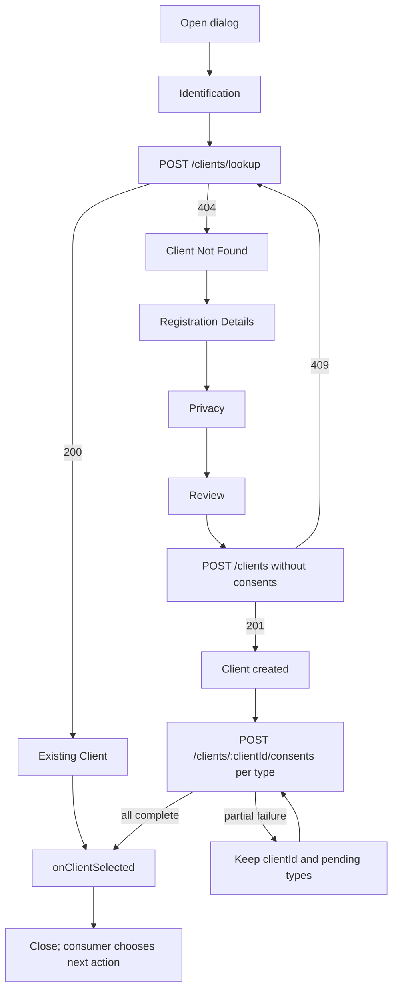

## 1. Objective

Implement `ClientRegisterDialog` as the shared flow for finding an existing Client or
registering a natural or legal person and, after creation, separately recording each
explicitly granted consent. The component returns the resolved `ClientDetails` to its
consumer and ends its responsibility at the Identity module boundary: it does not
create, update, reserve an identifier for, or link an Intake.

## 2. Scope

### In scope

- implement the six Pencil states provided in the request:
  - `ajF8M` — Identification;
  - `hfLfd` — existing Client;
  - `u7yjFZ` — Client not found;
  - `yO9zK` — registration details;
  - `CmxME` — privacy and consent;
  - `v30SR` — review;
- validate and search for a normalized CPF/CNPJ before allowing a new registration;
- allow phone lookup as a supporting search when no tax ID is provided;
- register a natural-person or legal-person Client without implicit consent;
- after Client creation, record one independent grant for each explicitly selected
  consent type;
- preserve the created Client when a later consent grant fails and retry only pending
  grants;
- prevent duplicate Clients and duplicate active consents, including under concurrent
  requests;
- expose the required REST contracts through `IdentityService` and compose them in Web;
- centralize request and form schemas in `@hms/validation/identity` for Server and Web;
- cover Core use cases, real HTTP routes, and the widget's public behavior;
- support responsive layout, visible focus, reflow, and keyboard navigation according
  to WCAG 2.2 AA.

### Out of scope

- creating, updating, or linking an Intake;
- choosing the route or action that follows Client selection;
- updating or listing Clients;
- revoking or regranting consent outside this flow;
- looking up a postal code through an external service;
- registering or linking third parties, representatives, partners, or attorneys-in-fact;
- persisting lead source, third-party channel, or HMS owner because these belong to
  Intake;
- persisting birth date, RG, marital status, nationality, occupation, state
  registration, incorporation date, or legal nature because they do not exist in the
  current PRD or `Client` contract;
- changing tables or creating a migration: the consent table already enforces at most
  one active consent per Client and type;
- changing `apps/web/src/routeTree.gen.ts` or `design/hms.pen`.

## 3. Requirements

### Functional requirements

#### Public contract and dialog lifecycle

- `ClientRegisterDialog` must be controlled through `open` and `onOpenChange` and report
  the result through `onClientSelected(clientDetails)`.
- The widget must not embed a trigger, perform navigation, or know about Intake.
- Each new opening starts at Identification without data from a previous opening.
- Closing before Client creation discards only the local draft.
- If the Client has already been created and consent grants are pending, closing must not
  imply that registration will be undone. A retry during that flow must reuse the
  created `clientId` and must not repeat `POST /clients`.
- Lookup, registration, and consent-grant actions must block concurrent submissions of
  the same action.

#### Form state and validation

- Every form in the dialog must use React Hook Form. Native React state must not be used
  as a parallel source of truth for field values, touched state, dirty state, submission
  state, or field errors.
- Every React Hook Form instance must use `zodResolver` with a Zod schema imported from
  `@hms/validation/identity`. Validation
  rules must not be duplicated in submit handlers, click handlers, or step components.
- Identification uses its own React Hook Form instance and Zod schema because it owns a
  lookup request and can be reset independently.
- Registration Details, Privacy, and Review share one React Hook Form instance for the
  registration draft. The schema must model the `natural`/`legal` distinction, optional
  contact details, all-or-none address requirements, and the four consent booleans.
- Step navigation must call React Hook Form validation for the fields owned by the
  current step before advancing. Final completion must run through `handleSubmit` and
  validate the complete registration schema again.
- Types for form values must be inferred from the shared Zod schemas with `z.infer`;
  manually duplicated form-value interfaces are not allowed.
- Input masks and display formatting must not replace schema validation. Shared schemas
  must normalize masked values at their boundary or the validated values must be
  normalized immediately when mapped to Core request contracts.
- Zod issues must be rendered through the shared `FieldError` contract and associated
  with their controls. Server/domain errors remain form-level errors and must not be
  represented as fabricated field validation failures.

#### Identification and lookup

- The form accepts CPF/CNPJ or phone and requires at least one criterion.
- Identification submission must run through React Hook Form `handleSubmit` with the
  identification Zod schema before calling `identityService.lookupClient`.
- Masks are presentation-only; requests contain digits only for tax ID and phone.
- A tax ID must contain 11 or 14 digits and pass CPF/CNPJ check-digit validation;
  repeated-digit sequences are invalid.
- When both tax ID and phone are filled, lookup uses the tax ID as the deterministic
  identifier. The UI must not describe the phone as part of a combined search because
  the current contract prioritizes `taxId`.
- The primary search action calls `identityService.lookupClient`; the clear action resets
  only this step's criteria.
- During the request, the action displays the loading copy from `ajF8M`, remains
  unavailable, and announces state through an `aria-live` region.
- Success advances to Existing Client; `404` advances to Client Not Found; other errors
  preserve fields and show actionable guidance without internal details.

#### Existing Client

- The state explains that another registration cannot be created for the same tax ID.
- The summary displays the type-appropriate name, masked tax ID, and the state of all
  four consent types while limiting personal data to what is necessary.
- The action for opening the existing record calls `onClientSelected` with the returned
  `ClientDetails` and closes the dialog.
- The action for searching another tax ID clears the result and criteria and returns to
  Identification.

#### Client Not Found

- The state repeats the searched criteria in masked form.
- Back returns to Identification with the criteria preserved.
- Continue to registration advances to Registration Details and initializes tax ID and
  phone from the lookup.

#### Registration details

- Client type uses `natural`/`legal`, presented as natural person/legal person using the
  product's localized labels.
- An 11-digit tax ID initializes natural person; a 14-digit tax ID initializes legal
  person.
- Natural person requires full name and a valid CPF.
- Legal person requires legal name and a valid CNPJ; trade name is optional.
- Email, phone, and address are optional.
- When any address field is provided, street, number, district, city, state, and postal
  code become required together; complement remains optional.
- Name fields incompatible with the selected type are neither displayed nor included in
  the request.
- Changing type when type-specific data exists requires confirmation before discarding
  that data.
- Back preserves the draft; Continue validates the step and advances to Privacy.
- Registration fields must be registered or controlled through the shared React Hook
  Form instance. Continue must use React Hook Form step validation and must not advance
  while the registration portion of the Zod schema is invalid.

#### Privacy

- Display the four `ConsentType` values independently and unchecked by default:
  `data_processing`, `whatsapp_communication`, `email_communication`, and
  `third_party_sharing`.
- Each checkbox has a persistent label and a description of its effect; entering a phone
  number or email address must not select a consent automatically.
- No consent option blocks Client creation. Absence is presented through the product's
  localized equivalent of `Not registered`, never `Revoked`.
- Consent copy from frame `CmxME` may be used only after the legal validation required by
  the PRD.
- Back returns to Registration Details; Continue advances to Review.
- Consent checkboxes must be controlled through the same registration React Hook Form
  instance. Continue validates the privacy portion of the Zod schema before Review.

#### Review, creation, and consent grants

- Review presents Identification, Contact/address, and Privacy sections. Missing values
  use the product's localized equivalents of `Not provided` or `Not registered`, and
  Edit actions preserve the draft.
- The final message states only that the Client will be created. It must not reproduce
  frame `v30SR`'s promise of automatic Intake linking.
- On the first completion attempt, Web calls `registerClient` without consents. Only
  after success does it call `grantClientConsent(clientId, type)` once for each selected
  option.
- Completion must be the shared registration form's React Hook Form submission and use
  only the data returned by the successful Zod resolver pass.
- `POST /clients` no longer accepts `consents` and returns `ClientDetails` with
  `consents: []`.
- `POST /clients/:clientId/consents` receives exactly one `type` and returns the created
  `ClientConsent`.
- If registration returns `409`, Web performs another lookup by tax ID. Success advances
  to Existing Client; failure preserves the draft and displays an error.
- If a consent grant returns `409`, Web reloads the Client. If that type is active, the
  grant is treated as idempotently complete; otherwise it remains pending and an error
  is shown.
- A consent failure neither repeats nor rolls back Client registration. Review explains
  that the Client was created, lists pending types, and offers an action to retry pending
  consent grants.
- After all selected grants are confirmed—or immediately when none were selected—the
  widget calls `onClientSelected` with updated `ClientDetails` and closes.

#### Domain and persistence rules

- `RegisterClientUseCase` validates CPF/CNPJ format and check digits, rejects duplicate
  tax IDs, and persists only the Client.
- `GrantClientConsentUseCase` requires an existing Client, accepts one `ConsentType`,
  uses `DatetimeProvider`, and prevents duplicate active consent.
- Grant persistence must remain safe under concurrency: the existing unique constraint
  is the final safeguard, and the repository communicates a collision to the use case
  without leaking database errors.
- Repetition does not create a second active row; the use case returns
  `ClientConsentAlreadyGrantedError`, mapped to `409`.

### Non-functional requirements

- The dialog has semantically associated title and description and restores focus to its
  trigger when closed.
- Opening moves focus to the first field; a step transition moves focus to the new step's
  heading.
- The stepper communicates current and completed steps through text/icon and
  `aria-current`, never color alone. Existing Client and Client Not Found are states of
  the Search step.
- Field errors use accessible names and `aria-invalid`; asynchronous errors and loading
  are announced without moving focus unexpectedly.
- Narrow viewports use one column and no horizontal scrolling. Only content may scroll
  when necessary, keeping header and actions accessible.
- Use only existing semantic tokens and utilities; headings use `font-serif`, body and
  controls use `font-sans`, and the UI supports light/dark themes and
  `prefers-reduced-motion`.
- Personal data must not be written to browser logs or technical error messages.

## 4. Current state

### `packages/core`

- `packages/core/src/identity/domain/entities/client.ts` models natural/legal Clients,
  contacts, address, and `ClientDetails`.
- `packages/core/src/identity/use-cases/lookup-client-use-case.ts` looks up by tax ID or
  phone but validates tax IDs by length only.
- `packages/core/src/identity/use-cases/register-client-use-case.ts` currently creates a
  Client and its consents in one action, accepts `consents` in the request, and validates
  tax IDs by length only; this conflicts with PRD v8.
- `packages/core/src/identity/interfaces/client-consents-repository.ts` only provides
  `addMany` and lookup by Client; it lacks an atomic single-grant operation.
- `packages/core/src/identity/interfaces/identity-service.ts` does not expose consent
  granting.
- Consent domain errors already exist; no new error vocabulary is required.

### `packages/validation`

- `packages/validation/src/identity/schemas/lookup-client-schema.ts` and
  `register-client-schema.ts` already exist and are consumed by Server, but the current
  schemas are permissive and `registerClientSchema` still includes the obsolete
  `consents[]` field.
- Address, Client type, and consent type schemas already exist and should be composed
  rather than reimplemented in Web.
- A grant schema for one consent type does not yet exist.

### `apps/server`

- `POST /clients/lookup`, `POST /clients`, and `GET /clients/:clientId` already exist.
- `apps/server/src/identity/rest/controllers/register-client.controller.ts` injects both
  repositories and `DatetimeProvider` to register Client and consents together.
- `apps/server/src/identity/database/drizzle/models/client-consent-model.ts` already has
  a partial unique index for `(clientId, type)` where `revokedAt IS NULL`.
- `DrizzleClientConsentsRepository` does not provide single insertion with a concurrent
  collision represented in its contract.
- No consent-grant route exists.

### `apps/web`

- `apps/web/src/ui/shared/widgets/components/client-register-dialog/index.tsx` exists
  and is empty.
- `apps/web/src/rest/services/identity-service.ts` implements the three current Identity
  REST operations.
- `RestContextProvider` composes only `IntakeService`; `RootLayout` does not mount this
  provider, and `RestContext` casts an empty object instead of following the UI rules.
- The `Icon` wrapper exists but does not register every icon used by the Pencil frames.
- React Hook Form, Zod, Dialog, Checkbox, Field, and the required primitives are already
  available. `@hookform/resolvers` is also installed and already used with
  `zodResolver`; `@hms/validation` is already a Web workspace dependency, so no new
  dependency is needed.

## 5. Artifacts to create

### Validation — `packages/validation`

**`packages/validation/src/identity/schemas/grant-client-consent-schema.ts` (new)** —
validate a request containing exactly one `ConsentType` and export it through the
Identity schema barrel.

### Core — `packages/core`

**`packages/core/src/identity/use-cases/grant-client-consent-use-case.ts` (new)**

- use an internal request `{ clientId: string; type: ConsentType }`;
- verify the Client exists and no active consent of that type exists;
- persist one grant using the time from `DatetimeProvider`;
- convert both pre-check and concurrent collision into
  `ClientConsentAlreadyGrantedError`;
- return `ClientConsent`.

**`packages/core/src/identity/use-cases/tests/grant-client-consent-use-case.test.ts`
(new)** — cover success, missing Client, active consent, deterministic time, and a
concurrent collision.

### Server — `apps/server`

**`apps/server/src/identity/rest/controllers/grant-client-consent.controller.ts`
(new)** — expose `POST /clients/:clientId/consents`, derive its body type from the use
case request, and return `201` with `ClientConsent`.

**`apps/server/src/identity/rest/controllers/tests/grant-client-consent.controller.test.ts`
(new)** — cover HTTP/Drizzle integration for success, missing Client, repetition, and
the persisted effect.

### Web — `apps/web`

**`apps/web/src/ui/shared/widgets/components/client-register-dialog/use-client-register-dialog.ts`
(new)** — own the state machine, the Identification and registration `useForm`
instances, created `clientId`, confirmed/pending consents, REST calls, and callbacks;
configure both forms with `zodResolver` using schemas imported from
`@hms/validation/identity` and contain no markup.

Internal states:

```ts
type ClientRegisterDialogState =
  | 'identification'
  | 'existing-client'
  | 'not-found'
  | 'registration'
  | 'privacy'
  | 'review'
```

**`apps/web/src/ui/shared/widgets/components/client-register-dialog/client-register-dialog-stepper.tsx`
(new)** — render the five visual steps and their semantics.

**`apps/web/src/ui/shared/widgets/components/client-register-dialog/client-identification-step.tsx`
(new)** — render criteria, validation, lookup, and messages.

**`apps/web/src/ui/shared/widgets/components/client-register-dialog/client-search-result-step.tsx`
(new)** — render a discriminated union for an existing result or no result, including
masking.

**`apps/web/src/ui/shared/widgets/components/client-register-dialog/client-registration-step.tsx`
(new)** — render fields supported by `RegisterClientRequest` and the optional complete
address.

**`apps/web/src/ui/shared/widgets/components/client-register-dialog/client-privacy-step.tsx`
(new)** — render four independent choices and explicit-consent guidance.

**`apps/web/src/ui/shared/widgets/components/client-register-dialog/client-review-step.tsx`
(new)** — render summaries, edit actions, progress, and consent retry state; make no REST
calls directly.

**`apps/web/src/ui/shared/widgets/components/client-register-dialog/tests/client-register-dialog.test.tsx`
(new)** — cover the public flow with real steps, accessibility, focus, callbacks,
client-side validation, failures, and retry without repeated Client registration. Assert
that invalid fields expose accessible errors and prevent REST requests.

**`apps/web/src/ui/shared/widgets/components/client-register-dialog/tests/use-client-register-dialog.test.ts`
(new)** — cover transitions, preservation, requests without PII logging, concurrency,
schema-backed step validation, and final `ClientDetails` composition by mocking the
context contract rather than Axios.

## 6. Artifacts to modify

### Validation — `packages/validation`

- `packages/validation/src/identity/schemas/lookup-client-schema.ts` — require at least
  one lookup criterion, normalize masked tax ID/phone values, and expose form-safe
  messages without taking ownership of persistence decisions.
- `packages/validation/src/identity/schemas/register-client-schema.ts` — remove
  `consents[]`; validate natural/legal required fields, valid CPF/CNPJ, optional contact
  details, and the all-or-none address rule.
- `packages/validation/src/identity/schemas/address-schema.ts` — preserve the shared
  address shape and compose it with the conditional registration schema.
- `packages/validation/src/identity/schemas/index.ts` and
  `packages/validation/src/identity/index.ts` — export the grant schema and keep the
  Identity validation surface available to Server and Web.

### Core — `packages/core`

- `packages/core/src/identity/use-cases/register-client-use-case.ts` — remove
  `consents`, `ClientConsentsRepository`, and `DatetimeProvider`; validate CPF/CNPJ check
  digits and return `{ client, consents: [] }`.
- `packages/core/src/identity/use-cases/lookup-client-use-case.ts` — apply the same
  CPF/CNPJ validity rules before tax ID lookup.
- `packages/core/src/identity/use-cases/tests/register-client-use-case.test.ts` and
  `lookup-client-use-case.test.ts` — use valid tax IDs and cover invalid check digits,
  normalization, and absence of partial persistence.
- `packages/core/src/identity/interfaces/client-consents-repository.ts` — add active
  lookup by Client/type and a single insertion whose return value represents a collision
  without leaking Drizzle; retain `addMany` for seeding.
- `packages/core/src/identity/interfaces/identity-service.ts` — add
  `grantClientConsent(clientId, type): Promise<RestResponse<ClientConsent>>`.
- `packages/core/src/identity/use-cases/index.ts` — export the new use case.

### Server — `apps/server`

- `apps/server/src/identity/database/drizzle/repositories/drizzle-client-consents-repository.ts`
  — implement active lookup and single insertion with `onConflictDoNothing`, returning
  the absence represented by the contract on collision.
- `apps/server/src/identity/rest/controllers/register-client.controller.ts` — depend
  only on `ClientsRepository` and instantiate the corrected use case.
- `apps/server/src/identity/rest/controllers/tests/register-client.controller.test.ts`
  — assert that registration creates no consent and invalid tax IDs return an error.
- `apps/server/src/identity/rest/controllers/index.ts` and
  `apps/server/src/identity/identity.module.ts` — export/register the new controller.
- `apps/server/src/identity/fixtures/identity-module-fixture.ts` — expose only the extra
  helpers required by integration tests while keeping `RestFixture` responsible for the
  database lifecycle.
- `apps/server/rest-client/identity/clients.rest` — document every route in the group,
  including single consent grant, and remove `consents` from the registration example.

### Web — `apps/web`

- `apps/web/src/ui/shared/widgets/components/client-register-dialog/index.tsx` —
  implement the public boundary:

```ts
export type ClientRegisterDialogProps = {
  open: boolean
  onOpenChange: (open: boolean) => void
  onClientSelected: (clientDetails: ClientDetails) => void
}
```

- `apps/web/src/rest/services/identity-service.ts` — map `grantClientConsent` to
  `POST /clients/:clientId/consents`.
- `apps/web/src/ui/shared/contexts/rest-context/types/rest-context-value.ts` — add
  `identityService: ReturnType<typeof IdentityService>`.
- `apps/web/src/ui/shared/contexts/rest-context/use-rest-context-provider.ts` — compose
  `IdentityService` with the existing `RestClient`.
- `apps/web/src/ui/shared/contexts/rest-context/index.tsx` — initialize the context with
  `createContext<RestContextValue | null>(null)`.
- `apps/web/src/ui/shared/widgets/layouts/root-layout/index.tsx` — mount
  `RestContextProvider` inside `QueryClientProvider` and above consumers.
- `apps/web/src/ui/shared/widgets/components/icon/types/icon-name.ts` and
  `apps/web/src/ui/shared/widgets/components/icon/lucide-icon/icons.ts` — register only
  the icons required by these states while keeping Lucide encapsulated.

## 7. Artifacts to remove

Not applicable.

## 8. Technical decisions

### Separate Client registration from consent granting

- **Choice:** remove consents from registration and execute one grant per type after the
  Client exists.
- **Alternative:** retain `consents[]` in `RegisterClientRequest`.
- **Evidence:** PRD v8 states that registering a Client does not record consent, that the
  Client must exist first, and that each grant applies to one type.
- **Trade-off:** one visual completion may issue multiple requests, but consent failure
  cannot leave a partially registered Client and can be retried independently.

### Treat completed Client creation as durable state

- **Choice:** retain `clientId` after `POST /clients` and never repeat registration when
  retrying consent grants.
- **Alternative:** restart the entire submission after any request fails.
- **Evidence:** a Client may exist without Intake or consent, and accidental repetition
  must not create duplicates.
- **Trade-off:** the hook must distinguish an uncreated draft from a created Client with
  pending grants.

### Restrict registration to Identity-owned data

- **Choice:** implement only nominal identity, tax ID, contacts, and address.
- **Alternative:** persist every field illustrated in `yO9zK`.
- **Evidence:** extra fields do not appear in the PRD or `Client`; lead source and HMS
  owner explicitly belong to Intake.
- **Trade-off:** implementation intentionally differs from the frame until Pencil is
  revised, but it does not invent domain data.

### Prioritize tax ID lookup

- **Choice:** use CPF/CNPJ when present; phone remains an alternative criterion.
- **Alternative:** promise an intersection between tax ID and phone.
- **Evidence:** `LookupClientUseCase` treats tax ID as the deterministic identifier, and
  the PRD uses phone only to support Client location.
- **Trade-off:** copy in `u7yjFZ` must not claim both criteria were combined.

### Correct the Intake promise

- **Choice:** Review states only that the Client will be created.
- **Alternative:** reproduce `v30SR` literally.
- **Evidence:** PRD v8 says the dialog completes only the Client and Intake is created
  later by its own module.
- **Trade-off:** intentional copy difference from the current Pencil frame.

### Keep the shared component controlled

- **Choice:** expose `open`, `onOpenChange`, and `onClientSelected`, without a trigger or
  route.
- **Alternative:** couple the widget to the Intake flow.
- **Evidence:** the requested location is under `ui/shared`, and Identity is reused by
  different flows.
- **Trade-off:** each consumer decides how to open the dialog and what follows a resolved
  Client.

### Use React Hook Form and Zod for every form

- **Choice:** use one schema-backed React Hook Form instance for Identification and one
  schema-backed instance shared by Registration Details, Privacy, and Review.
- **Alternative:** keep field values in component state or validate each step through
  ad hoc handlers.
- **Evidence:** the approved frontend stack requires React Hook Form and Zod for forms;
  `apps/web/src/ui/intake/widgets/pages/new-intake-page/index.tsx` provides the current
  `useForm` + `zodResolver` + `FieldError` pattern.
- **Trade-off:** the multi-step form must validate selected field groups while sharing a
  single typed draft, but it avoids diverging state and duplicated validation rules.

### Test owning boundaries

- **Choice:** test use cases in Core, real routes in Server, and public behavior in the
  dialog/hook.
- **Alternative:** mirror each visual file with an isolated test.
- **Evidence:** repository rules require unit tests at use cases, integration tests at
  controllers, and the smallest owning public boundary for widgets.
- **Trade-off:** presentation-only steps are covered through the dialog instead of
  redundant suites.

### Centralize validation in `@hms/validation`

- **Choice:** define request and form schemas in `packages/validation` and consume them
  from both Server controllers and Web React Hook Form instances.
- **Alternative:** define equivalent schemas locally in `apps/web` and keep Server
  schemas separate.
- **Evidence:** `@hms/validation` is an existing workspace package already consumed by
  Identity Server controllers and the Web Intake form.
- **Trade-off:** shared schemas must support both API payloads and masked form values,
  but validation behavior cannot drift between the browser and server.

## 9. Flows and references



References:

- PRD v8 — `https://plataformahms.atlassian.net/wiki/x/BIAC`, version 8, whose version
  message translates to `Aligns Client, consents, and the Intake boundary`;
- `design/hms.pen` — frames `ajF8M`, `hfLfd`, `u7yjFZ`, `yO9zK`, `CmxME`, and `v30SR`;
- `documentation/modules.md` and `documentation/design.md`;
- `apps/web/src/ui/intake/widgets/pages/new-intake-page/index.tsx` — current React Hook Form,
  Zod, and `Field` reference;
- `apps/web/src/ui/shadcn/dialog.tsx` and `checkbox.tsx`;
- `packages/core/src/identity/` and `apps/server/src/identity/` — current contracts and
  adapters described in section 4.

## 10. Open questions

- HMS Legal must validate the final wording of all four consent options before
  production, as explicitly required by the PRD. Implementation may use the `CmxME`
  copy as provisional development content identified as such.
- The request mentions seven Node IDs but provides six. This specification covers all
  six provided IDs; a seventh frame requires review only if it introduces a state or
  rule not represented here.

## 11. Recommended execution

Use **`create-plan`** followed by **`implement-plan`**. This change spans three
workspaces, changes a public Core contract, adds a use case and route, modifies the
semantics of existing registration, and requires incremental domain, HTTP integration,
and UI validation. It is not a small specification suitable for direct implementation.
