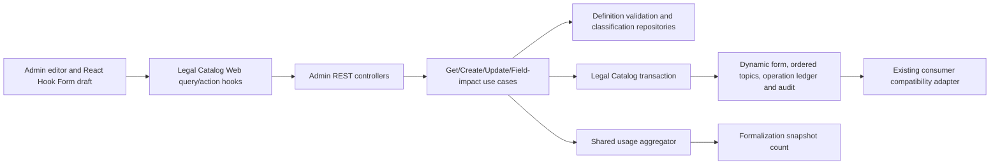

# 1. Context and scope

## Objective and source

Deliver the complete-mode editor requested by SCRUM-142 and PRD requirements REQ-CAT-016 through REQ-CAT-019. An authenticated active administrator can create and edit a Consultation or Formalization dynamic-form definition in one visual surface, preview unsaved changes, persist the whole definition atomically, recover safely from failures and concurrent edits, and remove fields without changing historical snapshots or answers. SCRUM-141 is the delivered lifecycle/list baseline.

## Current behavior and product gap

`/formularios-dinamicos` already lists definitions and provides protected `/novo` and `/$dynamicFormId` placeholders. Legal Catalog persists stage, status, one legal area, ordered topics and JSON fields, but has no definition version, editor write contract, field-level impact query or create/update audit. The existing consumer endpoint and immutable Consultation/Formalization snapshots already depend on the stored field representation and must remain compatible.

## Scope and product alignment

| Area | In scope | Out of scope |
| --- | --- | --- |
| Editor | Functional new/edit routes, identification, classification, field authoring, local preview and save-state bar | Public/client authoring, bulk import, version-history UI or draft workflow status |
| Field model | Nine field types, stable server identifiers/keys/option values, ordering, help, placeholder, required state, type-compatible defaults and numeric/option configuration | Conditional-rule authoring, currencies other than BRL or consumer answer-flow redesign |
| Persistence | Atomic create/full update, optimistic versioning, durable retry identity, audit, migration/backfill and semantic no-ops | Partial field endpoints, auto-merge or restoration of deleted definitions |
| Lifecycle | Existing availability/delete operations embedded in the editor with dirty-state protection | Reimplementing SCRUM-141 list, duplication, lifecycle or deletion backends |
| History | Informational field impact and immutable stored snapshots/answers | Editing snapshots, answers or past definition versions |
| Design | Named Pencil desktop states plus approved default-control and responsive extensions | Editing `design/hms.pen` or inventing adjacent administration features |

| Source requirement | Delivery | Notes |
| --- | --- | --- |
| PRD REQ-CAT-016 | partial | Editor consumes the established globally unique name and classification contracts; list/search remain SCRUM-141. |
| PRD REQ-CAT-017 | partial | Availability and permanent deletion are reused in the editor; duplication/list behavior remains SCRUM-141. |
| PRD REQ-CAT-018 | full | Visual form definition, supported types, type configuration, ordering, defaults and real-time preview. |
| PRD REQ-CAT-019 | full | Field-impact awareness, historical preservation, atomic save states and safe retry. |
| Jira SCRUM-142 | full | Core, persistence, admin REST, protected Web routes, design states and validation evidence. |

## Product decisions and assumptions

| Decision | Contract |
| --- | --- |
| Versions and retries | Definition version starts at `1`; update requires `expectedVersion`. Create/update use one durable client `operationKey` per immutable submit snapshot. |
| Validation | Client validation is immediate; `POST`/`PUT` are the only authoritative server validation boundary. There is no preflight endpoint. |
| Stage/classification | New forms select one stage, one active area and at least one active topic in that area. Persisted stage is read-only. Existing inactive associations may be retained, but never newly introduced. |
| Type changes | An existing field may change type after confirmation when incompatible configuration will be discarded. Its UUID/key remain stable. |
| Defaults | Every type supports an optional fixed, type-compatible default. Omission means no default; `null` is not a configured default. |
| Availability | New forms begin unavailable. The SCRUM-141 lifecycle endpoint owns availability and is disabled while the editor is new, dirty or saving. |
| Removal | Field impact is informational. Removal changes local state only and persists with the next atomic model save. |
| Conflicts | A stale response preserves local state and offers `Continuar editando` or destructive `Recarregar versão do servidor`; no merge occurs. |
| Navigation/deletion | Internal dirty navigation offers `Continuar editando` or `Descartar alterações`; browser unload uses the native warning. Delete stays available and adds an unsaved-edits warning to its single confirmation. |
| Design extensions | Existing Pencil field dialogs gain `Resposta padrão (opcional)` controls; narrow behavior follows the HMS design system. These extensions were explicitly accepted on 2026-09-15. |

# 2. Implementation Contract

## Functional requirements

| ID | PRD/Jira/source coverage | Required behavior |
| --- | --- | --- |
| `FR-01` | SCRUM-142 authorization; REQ-CAT-016 | Only an authenticated active administrator can discover/open either editor route or call its detail/create/update/field-impact operations. |
| `FR-02` | SCRUM-142 create/load; REQ-CAT-018 | `/novo` begins an unavailable empty definition; `/$dynamicFormId` loads the exact definition, version and selected classification, including inactive historical selections. |
| `FR-03` | SCRUM-142 association rules; REQ-CAT-018 | A definition has one stage, one area and at least one ordered same-area topic; new selections must be active. Changing area confirms and clears incompatible topics; stage becomes immutable after first save. |
| `FR-04` | SCRUM-142 type matrix; REQ-CAT-018; approved product amendment | Consulta and Formalização both enable all nine field types: short text, long text, date, multiple selection, Sim/Não, single selection, integer, BRL currency and percentage. |
| `FR-05` | SCRUM-142 field editor; REQ-CAT-018 | An administrator can add, edit, remove and order fields and selection options; configure label, help, placeholder, required state, default and type-specific rules; and confirm destructive type/option/stage changes. |
| `FR-06` | Accepted default contract; REQ-CAT-018 | Fixed defaults are validated by type: text string, ISO date, boolean, stable option value(s), integer, finite BRL amount, or percentage `0..100` respecting scale. |
| `FR-07` | SCRUM-142 stable identifiers | The server generates field/option UUIDs and normalized unique technical key/value identifiers for new items; edits never expose or regenerate them, and array order becomes contiguous zero-based positions. |
| `FR-08` | SCRUM-142 preview; REQ-CAT-018 | The Preview tab renders the local unsaved definition and defaults immediately without network persistence or changes to Consultation/Formalization records. |
| `FR-09` | SCRUM-142 atomic save; REQ-CAT-019 | Create/full update validates and commits definition, ordered topics, operation replay result and one append-only audit entry atomically; any failure leaves the persisted definition unchanged and retains the local payload. |
| `FR-10` | SCRUM-142 footer states; REQ-CAT-019 | The save bar exposes saved, dirty, saving and retryable-failure states from the Pencil frames. Retries reuse the same key only while the failed payload is unchanged; later edits create a new key. Semantic no-ops do not increment version or audit. |
| `FR-11` | SCRUM-142 optimistic concurrency | Update with a stale `expectedVersion` returns structured `409` and never overwrites either version. Local edits remain until the administrator explicitly reloads the server version. |
| `FR-12` | SCRUM-142 removal/history; REQ-CAT-019 | Before local field removal, the dialog reports total and in-progress Formalization snapshot usage; removal never mutates historical definitions or answers. Consultation usage is not counted. |
| `FR-13` | SCRUM-142 lifecycle integration; REQ-CAT-017 | Availability and deletion reuse SCRUM-141 semantics. Availability cannot race dirty definition state; successful deletion discards local state and returns to the list. |
| `FR-14` | SCRUM-142 UX states; repository UI rules | Loading, not-found, forbidden, validation, conflict, pending, retry, success, focus, keyboard, narrow-screen and reduced-motion behavior is understandable and accessible. |
| `FR-15` | SCRUM-142 compatibility exclusions | Existing consumer list/selection, rendering, snapshots and answers remain compatible; editor defaults are previewed and persisted but applying them automatically in consumer sessions is deferred. |

## Acceptance criteria

| ID | FR coverage | Requirement | Given | When | Then | Expected evidence |
| --- | --- | --- | --- | --- | --- | --- |
| `AC-01` | `FR-01` | Admin-only boundary | Admin and attendant accounts | Each opens both routes and calls all four editor APIs | Admin succeeds; attendant receives established route/API forbidden behavior and no data mutation | Controller tests; route tests; MV-05 |
| `AC-02` | `FR-02` | New and existing initialization | Seeded classifications and form | Admin opens `/novo` or a valid ID | New state is empty/unavailable/versionless; edit state exactly hydrates definition/version including inactive selected metadata | Widget/hook and GET controller tests; MV-01/MV-02 |
| `AC-03` | `FR-02`, `FR-14` | Missing/malformed IDs | Unknown or malformed UUID | Edit route loads | Malformed parameter is rejected by routing UI; unknown entity shows a not-found surface with list navigation and no editor mutation | Route and controller tests; MV-02 |
| `AC-04` | `FR-03` | Classification integrity | Active/inactive areas/topics | Admin creates or edits | New associations require one active area and one or more active same-area topics; retained inactive links save; new inactive/cross-area links are rejected | Core/REST tests; widget-hook tests |
| `AC-05` | `FR-04`, `FR-05` | Type availability and authoring | Consultation/Formalization drafts | Admin opens add/edit dialog | All nine types are enabled in both stages, controls match the selected type, and valid submit appends/updates local state without saving | Dialog/options tests; MV-01/MV-02 |
| `AC-06` | `FR-05`, `FR-06` | Default/type validation | Each field type | Admin configures default/rules | Compatible values are retained and previewed; invalid types, ranges, precision, empty/duplicate options and defaults referencing removed options are blocked with field errors | Validation consumers, Core validator and dialog tests |
| `AC-07` | `FR-05`, `FR-07` | Stable identity/order | Saved fields/options plus new items | Labels/types/order change and model saves | Existing UUID/key/value remain; new ones are unique and normalized; positions are contiguous; label edits do not change technical identifiers | Core create/update tests; controller persistence assertions |
| `AC-08` | `FR-08` | Local preview | Dirty valid or partially complete draft | Admin selects Preview | Current order, labels, help, required state, controls and valid defaults render without REST mutation | Preview tests; MV-01/MV-02 |
| `AC-09` | `FR-09`, `FR-10` | Atomic create/update states | Valid draft | Save succeeds, fails before commit or response is lost/retried | One complete definition/result/audit commits or none; UI shows exact footer state and retains failed payload; exact retry returns original result once | Core/REST/DB integration tests; save-bar/page tests; MV-01/MV-03 |
| `AC-10` | `FR-10` | Replay and no-op | Completed key or unchanged update | Same/different request reuses key, or new key sends identical definition | Exact replay returns the stored original result; mismatched reuse is `409`; semantic no-op preserves version/audit, persists one replay result and still replays it after a later effective update | Core/REST tests |
| `AC-11` | `FR-11` | Stale recovery | Two sessions load version N | First saves N+1 and second saves N | Second gets structured `409` with current version, retains local payload and can continue or explicitly reload N+1 | Core/REST tests; stale dialog/page hook; MV-03 |
| `AC-12` | `FR-12` | Field-impact removal | Field exists in current/historical snapshots | Removal dialog opens and confirms | Fresh Formalização counts identify total/in-progress usage; local field disappears only after confirm; database changes only on Save; history is unchanged | Core use-case/controller/dialog tests; MV-02 |
| `AC-13` | `FR-13` | Lifecycle with dirty state | New, dirty, saving and saved forms | Availability/delete controls are used | Availability is disabled except saved-clean; deletion uses one contextual confirmation, and success returns to `/formularios-dinamicos` without navigation warning | Page/delete/save-bar tests; MV-02 |
| `AC-14` | `FR-14` | Accessible/responsive operation | 320×800 and 1440×1200 viewports | Admin completes keyboard and pointer flows | Focus is visible/restored, dialogs trap focus, reorder has drag plus move controls/announcements, no page overflow occurs and reduced motion is respected | Widget tests; route tests; MV-04 |
| `AC-15` | `FR-14` | Recoverable boundary states | Failed detail/topics/impact/save/lifecycle requests | Admin retries or cancels | Error is scoped to owning surface, pending actions are disabled, local data remains, and success/error is announced | Hook/widget/controller tests; MV-03 |
| `AC-16` | `FR-15` | Consumer compatibility | Existing available definitions and snapshots | Migration/editor delivery is applied | Existing `/dynamic-forms` shape/selection and historical records remain readable; no editor save mutates consumer records | Existing consumer regressions plus controller/database checks |

## Cross-cutting restrictions

| Concern | Contract |
| --- | --- |
| Identifier normalization | Trim labels, normalize Unicode NFKD, remove combining marks, lowercase and convert non-alphanumerics to `_`; fallback `field`/`option`; suffix `_2`, `_3`, … deterministically within the owning field/form. |
| Legacy conditional rules | The editor does not create or edit `requiredWhen`. Existing valid rules are retained server-side by field UUID; removing their dependency is rejected rather than silently erasing an undesigned rule. |
| Sensitive data | Definitions, audit metadata and operation ledgers never contain answers, client data, access tokens or secrets. |
| Concurrency | Definition version covers definition metadata/topics/fields only; availability changes do not increment it. Database row locking/version predicates own races. |
| Browser state | TanStack Query owns server state; React Hook Form owns the editable draft; no unsaved draft is persisted to browser storage. |

## Design Contract

The implementation must follow [design/handoff.md](./design/handoff.md). The required authoritative nodes are editor `iX5sr`, save bars `avpzp`/`TN5wx`/`Ew8qq`/`AYJ95`, field dialogs `Z5OyY`/`Sys4w`/`qpDOo`/`WiFpJ`/`i194Af`/`lmvBH`/`TFlkr`/`Mv1W8`/`hgwKf`, and removal dialog `Lcpwf`. Use HMS tokens, serif headings, sans body, established shadcn wrappers, theme behavior and localized accessible names.

At 1440×1200, preserve the editor hierarchy, card rhythm, ordered rows and sticky 1184-pixel content save bar. At 320×800, stack form regions, constrain dialogs to the viewport, keep the save bar reachable without page-level horizontal overflow and expose explicit move controls. Dialogs trap focus; cancel/Escape returns focus to the trigger; destructive reload/removal/delete names the affected item; sortable announcements are localized; reduced-motion avoids transform animation. The optional default controls and unreferenced recovery/narrow states are approved extensions recorded in the handoff and must use existing HMS primitives rather than new visual language.

# 3. Technical Contract

## Current technical state

| Evidence | Current responsibility | Gap |
| --- | --- | --- |
| `packages/core/src/legal-catalog/domain/entities/dynamic-form.ts` | Canonical definition with stage/status/area/topic IDs and shared fields | No version or editor-owned field/option/default contract. |
| `DynamicFormAdministrationRepository` and Drizzle adapter | List/find/add/status/remove over `dynamic_forms` and topic join | No optimistic full replacement, replay ledger or inactive-classification hydration contract. |
| `dynamic_form_duplicate_operations` and audit table | Durable duplication replay and three administration actions | Replay identity is action-specific; audit excludes create/update. |
| Formalization usage provider | Count records by form ID | No snapshot field-ID impact count. |
| Legal Catalog REST/Web service | List/name conflict/duplicate/impact/availability/delete | No detail/create/update/field-impact methods or structured validation/version recovery. |
| `/formularios-dinamicos/novo` and `/$dynamicFormId` | Admin-protected, client-only placeholders | No editor widget, form state, preview, guards or route evidence. |
| `DynamicFormFieldsSection` | Existing compatible renderer for all nine answer controls | Can be reused by preview; it does not own definition editing or consumer default application. |

## Solution and runtime flow

Legal Catalog remains the definition owner. REST authenticates with `AuthGuard` and authorizes an active administrator with `ActiveAdminGuard`; actor identity is derived from `CurrentCollaborator`, never the request body. The create/update use cases normalize the request, validate classification and field semantics, compare a global operation ledger, generate missing identities through `IdProvider`, and commit the form row, ordered topics, operation result and audit entry inside `LegalCatalogDatabase.transaction`.

For update, the repository locks or predicates the current row by `expectedVersion`. A mismatch returns the current version without mutation. A semantically identical definition keeps the current form/version, writes the completed operation result once, and creates no audit entry. A successful effective update replaces the complete definition and topics and increments exactly once. Operation replay is checked before stale evaluation so a lost-response retry—including a no-op whose response was lost and whose form later changed—returns its original stored result. Same-key mismatches raise `IdempotencyKeyConflictError`.



| Boundary | Producer | Consumer | Canonical contract | Mapping/guarantees | Failure ownership |
| --- | --- | --- | --- | --- | --- |
| Editor HTTP | Validation schemas/Web service | Four Legal Catalog controllers | `CreateDynamicFormRequest`, `UpdateDynamicFormRequest`, `DynamicFormEditorDetails`, `DynamicFormUsageImpact` | Dates serialize ISO; actor is server-derived; generated keys/IDs are response-only | Zod → 400; guards → 401/403; GlobalErrorHandler → named 404/409/issues |
| Definition persistence | Create/update use cases | `DynamicFormAdministrationRepository` | `DynamicForm`, `DynamicFormReplaceResult` | Full atomic replace, ordered arrays, version predicate, no partial commit | Repository translates name race; use case owns not-found/stale/no-op |
| Idempotency | Create/update/duplicate use cases | `DynamicFormOperationsRepository` | `DynamicFormOperation` | One global UUID key, canonical request identity, exact stored result | Use case raises `IdempotencyKeyConflictError` |
| Field impact | Legal Catalog use case | Shared aggregator and Formalization provider | `getFieldImpact(dynamicFormId, fieldId)` → `DynamicFormUsageImpact` | Counts immutable Formalization snapshot field IDs; provider query remains retryable and no removal occurs | Provider/database failure remains retryable and no removal occurs |
| Consumer compatibility | Canonical repository | shared `DynamicFormsRepository` adapter | Existing shared `DynamicForm` | Drops editor-only concerns from the advertised type while preserving compatible field shape and history | Existing endpoint remains the regression owner |

## Domain declarations

| Declaration | Kind | Ownership/identity | Contract summary | Related declarations | Consumers |
| --- | --- | --- | --- | --- | --- |
| `DynamicForm` | Entity | Legal Catalog form UUID | Canonical versioned definition | `DynamicFormDefinitionField` | repositories, use cases, REST |
| `DynamicFormDefinitionField` | Entity | Stable field UUID within a definition | Editor-owned field configuration | `DynamicFormDefinitionOption`, shared field type/validation | editor, persistence, preview/compatibility |
| `DynamicFormDefinitionOption` | Entity | Stable option UUID within a field | Ordered label plus immutable generated value | field/default | editor, persistence |
| `DynamicFormDefinitionDraft` | Structure | Identity-free mutable write value | Full normalized create/update draft | field drafts | validation/use cases/REST |
| `DynamicFormEditorDetails` | Structure | Read projection | Definition plus selected area/topics, including inactive records | `LegalArea`, `LegalTopic` | GET/Web editor |
| `DynamicFormOperation` | Structure | Immutable operation-key fact | Global create/update/duplicate replay identity and result | `DynamicForm` | operation repository/use cases |
| `DynamicFormReplaceResult` | Structure | Repository result union | Updated/not-found/version-conflict result | `DynamicForm` | update use case |
| `DynamicFormDefinitionValidationError` | Error | Legal Catalog | Structured definition issues | `DynamicFormValidationIssue` | REST error mapping |
| `DynamicFormVersionConflictError` | Error | Legal Catalog | Stale expected/current version metadata | — | REST/Web recovery |

| Path | Change | Declaration | Domain role/schema | Invariants/transitions | Errors/events | Exports/consumers |
| --- | --- | --- | --- | --- | --- | --- |
| `packages/core/src/legal-catalog/domain/entities/dynamic-form.ts` | Modify | `DynamicForm` Entity | Use resulting declaration below | Version starts at 1 and advances only on effective definition update | — | entities barrel; repositories/DTOs |
| `packages/core/src/legal-catalog/domain/entities/dynamic-form-definition-field.ts` | Create | `DynamicFormDefinitionField` Entity | Use resulting declaration below | Key/UUID immutable; type-specific properties only; positions contiguous | Definition validation error | entities barrel/editor/DB |
| `packages/core/src/legal-catalog/domain/entities/dynamic-form-definition-option.ts` | Create | `DynamicFormDefinitionOption` Entity | Use resulting declaration below | UUID/value immutable; values unique within field | Definition validation error | entities barrel/editor/DB |
| `packages/core/src/legal-catalog/domain/entities/index.ts` | Modify | Public entity barrel | Export both new entities | No compatibility re-export elsewhere | — | Core subpath |
| `packages/core/src/legal-catalog/domain/structures/dynamic-form-definition-draft.ts` | Create | `DynamicFormDefinitionDraft` Structure | Full editable value and private nested field/option draft shapes | Client references existing items by `fieldId`/`optionId`; never supplies keys/values | Validation issues | create/update/schema/Web |
| `packages/core/src/legal-catalog/domain/structures/create-dynamic-form-request.ts` | Create | `CreateDynamicFormRequest` Structure | Draft plus operation/actor | Status is server-owned unavailable; no expected version | — | create use case/controller |
| `packages/core/src/legal-catalog/domain/structures/update-dynamic-form-request.ts` | Create | `UpdateDynamicFormRequest` Structure | Draft plus target/version/operation/actor | Stage must equal persisted stage | Version/idempotency errors | update use case/controller |
| `packages/core/src/legal-catalog/domain/structures/dynamic-form-editor-details.ts` | Create | `DynamicFormEditorDetails` Structure | Definition plus selected classification entities | Includes inactive persisted selections | Not found | detail use case/DTO/Web |
| `packages/core/src/legal-catalog/domain/structures/dynamic-form-operation.ts` | Create | `DynamicFormOperation` immutable Structure | Use resulting declaration below | Global key; action/request/actor/target/result exact replay identity | Idempotency conflict | operations repository |
| `packages/core/src/legal-catalog/domain/structures/dynamic-form-replace-result.ts` | Create | `DynamicFormReplaceResult` Structure union | Use resulting declaration below | Distinguishes no-op/update/stale/not-found without exceptions in adapter | — | repository/update use case |
| `packages/core/src/legal-catalog/domain/structures/duplicate-dynamic-form-operation.ts` | Remove | Replaced action-specific operation structure | Existing data migrates to `DynamicFormOperation` | Preserve completed replay results | — | duplicate use case migration |
| `packages/core/src/legal-catalog/domain/structures/dynamic-form-administration-action.ts` | Modify | `DynamicFormAdministrationAction` | Add `created` and `updated` | Existing values retained | — | audit entity/model |
| `packages/core/src/legal-catalog/domain/structures/dynamic-form-audit-details.ts` | Modify | `DynamicFormAuditDetails` | Add created/updated variants with version/field diff | No answers or full payload | — | audit entry/model |
| `packages/core/src/legal-catalog/domain/structures/idempotency-key-conflict-metadata.ts` | Modify | `IdempotencyKeyConflictMetadata` | Generalize to original action/target | Safe response metadata only | — | GlobalErrorHandler/Web |
| `packages/core/src/legal-catalog/domain/structures/dynamic-form-version-conflict-metadata.ts` | Create | `DynamicFormVersionConflictMetadata` | `dynamicFormId`, expected/current version | Safe response metadata | — | error handler/Web |
| `packages/core/src/legal-catalog/domain/structures/index.ts` | Modify | Public structures barrel | Export new structures; remove obsolete operation export | Preserve existing exports | — | Core subpath |
| `packages/core/src/legal-catalog/domain/errors/dynamic-form-definition-validation-error.ts` | Create | `DynamicFormDefinitionValidationError` | Bad-request error carrying ordered issues | No transport dependency | Named validation failure | errors barrel |
| `packages/core/src/legal-catalog/domain/errors/dynamic-form-version-conflict-error.ts` | Create | `DynamicFormVersionConflictError` | Conflict error with expected/current versions | No transport dependency | Named stale failure | errors barrel |
| `packages/core/src/legal-catalog/domain/errors/dynamic-form-field-not-found-error.ts` | Create | `DynamicFormFieldNotFoundError` | Not-found error with form/field IDs | No transport dependency | Named field-membership failure | errors barrel/impact use case |
| `packages/core/src/legal-catalog/domain/errors/idempotency-key-conflict-error.ts` | Modify | `IdempotencyKeyConflictError` | General action/target metadata and message | Covers create/update/duplicate global key reuse | Named conflict | duplicate/create/update/error handler |
| `packages/core/src/legal-catalog/domain/errors/index.ts` | Modify | Public errors barrel | Export new errors | Preserve existing exports | — | Core subpath |
| `packages/core/src/shared/use-cases/tests/validate-dynamic-form-answers-use-case.test.ts` | Modify | Consumer answer-validation regression | Exercise rich fields/options/default metadata through the unchanged shared validator | Existing answer normalization and issue semantics remain unchanged | Compatibility regression | validation contract |

### Resulting domain declarations

```ts
// packages/core/src/legal-catalog/domain/entities/dynamic-form-definition-option.ts
export type DynamicFormDefinitionOption = Entity & {
  value: string
  label: string
  position: number
}

// packages/core/src/legal-catalog/domain/entities/dynamic-form-definition-field.ts
export type DynamicFormDefinitionField = Entity & {
  key: string
  label: string
  type: DynamicFormFieldType
  position: number
  required: boolean
  description?: string
  placeholder?: string
  defaultValue?: Exclude<DynamicFormAnswerValue, null>
  options?: DynamicFormDefinitionOption[]
  validation?: DynamicFormFieldValidation
  currency?: 'BRL'
}

// packages/core/src/legal-catalog/domain/entities/dynamic-form.ts
export type DynamicForm = Entity & {
  name: string
  normalizedName: string
  description: string | null
  status: DynamicFormStatus
  stage: DynamicFormStage
  legalAreaId: string
  legalTopicIds: string[]
  fields: DynamicFormDefinitionField[]
  version: number
  createdAt: Date
  updatedAt: Date
}
```

**Schema — `DynamicFormDefinitionOption`**

| Field | Type | Required | Validation | Description |
| --- | --- | --- | --- | --- |
| `id` | `string` | Yes | UUID, immutable | Stable option identity. |
| `value` | `string` | Yes | Normalized, non-empty, unique within field, immutable | Stored answer/default value. |
| `label` | `string` | Yes | Trimmed 1–160 | Administrator-visible option label. |
| `position` | `number` | Yes | Contiguous integer `>= 0` | Display order. |

**Schema — `DynamicFormDefinitionField`**

| Field | Type | Required | Validation | Description |
| --- | --- | --- | --- | --- |
| `id` | `string` | Yes | UUID, immutable | Stable field identity. |
| `key` | `string` | Yes | Normalized, non-empty, unique in form, immutable | Technical answer key. |
| `label` | `string` | Yes | Trimmed 1–160 | Visible question/rótulo. |
| `type` | `DynamicFormFieldType` | Yes | All nine types in both stages | Control/answer type. |
| `position` | `number` | Yes | Contiguous integer `>= 0` | Form order. |
| `required` | `boolean` | Yes | — | Unconditional required state. |
| `description` | `string` | No | Trimmed, max 500, omit empty | Help/support copy. |
| `placeholder` | `string` | No | Trimmed, max 160, only supported controls | Input hint. |
| `defaultValue` | `Exclude<DynamicFormAnswerValue, null>` | No | Exact type/range/options/scale | Fixed optional default. |
| `options` | `DynamicFormDefinitionOption[]` | Conditional | Selection types only, at least one | Ordered answer options. |
| `validation` | `DynamicFormFieldValidation` | No | Numeric rules by type; preserved legacy `requiredWhen` | Field validation configuration. |
| `currency` | `'BRL'` | Conditional | Currency fields only and required there | Fixed monetary metadata. |

**Schema — `DynamicForm`**

| Field | Type | Required | Validation | Description |
| --- | --- | --- | --- | --- |
| `id` | `string` | Yes | UUID | Definition identity. |
| `name` | `string` | Yes | Trimmed 1–160 | Display name. |
| `normalizedName` | `string` | Yes | Derived; globally unique | Name conflict key. |
| `description` | `string \| null` | Yes | Trimmed max 500 or `null` | Suggestion/applicability description. |
| `status` | `DynamicFormStatus` | Yes | New is unavailable | Independent lifecycle state. |
| `stage` | `DynamicFormStage` | Yes | Immutable after create | Consultation/Formalization scope. |
| `legalAreaId` | `string` | Yes | Existing area; new association active | Selected area. |
| `legalTopicIds` | `string[]` | Yes | Unique, ordered, at least one, same area | Selected topics. |
| `fields` | `DynamicFormDefinitionField[]` | Yes | At least one for save | Complete ordered definition. |
| `version` | `number` | Yes | Integer `>=1` | Optimistic definition version. |
| `createdAt` | `Date` | Yes | Provider time | Creation time. |
| `updatedAt` | `Date` | Yes | Provider time; changes on effective definition/lifecycle writes | Latest catalog mutation time. |

```ts
// packages/core/src/legal-catalog/domain/structures/dynamic-form-definition-draft.ts
type DynamicFormDefinitionOptionDraft = { optionId?: string; label: string }
type DynamicFormDefinitionFieldDraftBase = {
  fieldId?: string
  label: string
  type: DynamicFormFieldType
  required: boolean
  description?: string
  validation?: DynamicFormFieldValidation
}
type DynamicFormDefinitionFieldDraft =
  | (DynamicFormDefinitionFieldDraftBase & {
      type: 'short_text' | 'long_text'
      placeholder?: string
      defaultValue?: string
    })
  | (DynamicFormDefinitionFieldDraftBase & {
      type: 'date'
      defaultValue?: string
    })
  | (DynamicFormDefinitionFieldDraftBase & {
      type: 'boolean'
      defaultValue?: boolean
    })
  | (DynamicFormDefinitionFieldDraftBase & {
      type: 'single_selection'
      placeholder?: string
      options: DynamicFormDefinitionOptionDraft[]
      defaultOptionIndex?: number
    })
  | (DynamicFormDefinitionFieldDraftBase & {
      type: 'multiple_selection'
      options: DynamicFormDefinitionOptionDraft[]
      defaultOptionIndexes?: number[]
    })
  | (DynamicFormDefinitionFieldDraftBase & {
      type: 'integer' | 'percentage'
      placeholder?: string
      defaultValue?: number
    })
  | (DynamicFormDefinitionFieldDraftBase & {
      type: 'currency'
      placeholder?: string
      defaultValue?: number
      currency: 'BRL'
    })
export type DynamicFormDefinitionDraft = {
  name: string
  description?: string
  stage: DynamicFormStage
  legalAreaId: string
  legalTopicIds: string[]
  fields: DynamicFormDefinitionFieldDraft[]
}

// packages/core/src/legal-catalog/domain/structures/create-dynamic-form-request.ts
export type CreateDynamicFormRequest = DynamicFormDefinitionDraft & {
  operationKey: string
  actorCollaboratorId: string
}

// packages/core/src/legal-catalog/domain/structures/update-dynamic-form-request.ts
export type UpdateDynamicFormRequest = DynamicFormDefinitionDraft & {
  dynamicFormId: string
  expectedVersion: number
  operationKey: string
  actorCollaboratorId: string
}

// packages/core/src/legal-catalog/domain/structures/dynamic-form-editor-details.ts
export type DynamicFormEditorDetails = {
  form: DynamicForm
  legalArea: LegalArea
  legalTopics: LegalTopic[]
}

// packages/core/src/legal-catalog/domain/structures/dynamic-form-operation.ts
type DynamicFormOperationCanonicalRequest =
  | {
      kind: 'duplicated'
      sourceDynamicFormId: string
      normalizedName: string
    }
  | {
      kind: 'created' | 'updated'
      definition: DynamicFormDefinitionDraft
    }
export type DynamicFormOperation = {
  readonly operationKey: string
  readonly action: 'duplicated' | 'created' | 'updated'
  readonly actorCollaboratorId: string
  readonly targetDynamicFormId: string
  readonly expectedVersion: number | null
  readonly canonicalRequest: DynamicFormOperationCanonicalRequest
  readonly result: DynamicForm
  readonly completedAt: Date
}

// packages/core/src/legal-catalog/domain/structures/dynamic-form-replace-result.ts
export type DynamicFormReplaceResult =
  | { kind: 'updated'; form: DynamicForm }
  | { kind: 'unchanged'; form: DynamicForm }
  | { kind: 'not_found' }
  | { kind: 'version_conflict'; currentVersion: number }
```

`canonicalRequest` is JSON-serializable normalized definition data plus the duplicate source ID where applicable; it contains no dates, actor/session data, answers or generated field/option identifiers absent from the submitted request. Implementations compare it structurally and deterministically.

Selection defaults in write requests reference the submitted ordered option array by zero-based `defaultOptionIndex` or unique, ascending `defaultOptionIndexes`. The server validates those indexes, generates any missing option UUID/value, and persists/returns the corresponding stable value or values in `DynamicFormDefinitionField.defaultValue`. Thus a new option never needs a client-supplied persistent identifier or guessed normalized value.

**Schema — `DynamicFormDefinitionDraft`**

| Field | Type | Required | Validation | Description |
| --- | --- | --- | --- | --- |
| `name` | `string` | Yes | Trimmed 1–160 | Requested display name. |
| `description` | `string` | No | Trimmed max 500; omit empty | Suggestion/applicability text. |
| `stage` | `DynamicFormStage` | Yes | Matrix and lifecycle rules | Requested stage. |
| `legalAreaId` | `string` | Yes | UUID | Selected area reference. |
| `legalTopicIds` | `string[]` | Yes | Unique, ordered, at least one UUID | Selected topics. |
| `fields` | `DynamicFormDefinitionFieldDraft[]` | Yes | At least one; array order is canonical | Editable field drafts; nested shapes are complete in the declaration above. |

### Field-type property matrix

All types require `label`, `type` and `required`; allow optional `description`; and forbid newly authored properties not listed for their row, subject only to the explicit unchanged-legacy exception below. Empty optional strings normalize to omission. `requiredWhen` is not authorable: an unchanged valid existing rule may be retained by `fieldId`, but a new/changed rule or removal of its referenced field is rejected.

| Type | Stage | Optional authorable properties | Default contract | Exact validation/normalization | Destructive type-change cleanup |
| --- | --- | --- | --- | --- | --- |
| `short_text` | Both | `placeholder` | Non-empty string after trim | No `options`, numeric rules or `currency`; empty default becomes omitted. | Clear options, numeric rules and non-string default. |
| `long_text` | Both | `placeholder` | Non-empty string after trim; line breaks retained | No `options`, numeric rules or `currency`; empty default becomes omitted. | Clear options, numeric rules and non-string default. |
| `date` | Both | — | Real fixed calendar date in canonical `YYYY-MM-DD` | No relative expressions, placeholder, options, numeric rules or currency. | Clear placeholder, options, numeric rules and non-date default. |
| `boolean` | Both | — | `true` or `false` | No placeholder, options, numeric rules or currency. | Clear all incompatible configuration/defaults. |
| `multiple_selection` | Both | `options`, `defaultOptionIndexes` | Unique ascending indexes into submitted options; empty array means no default and normalizes to omission | At least one non-empty option label; normalized generated values unique; no placeholder, numeric rules or currency. | Clear non-selection default/config; changing away clears options/default after confirmation. |
| `single_selection` | Both | `placeholder`, `options`, `defaultOptionIndex` | One in-range submitted option index | At least one non-empty option label; no numeric rules or currency. | Same selection cleanup; multiple default reduces only after explicit confirmation. |
| `integer` | Both | `placeholder`, `validation.min` | Integer at or above optional integer `min` | `min` is a safe integer; no `max`, `scale`, options or currency are newly authored. | Clear selection/currency configuration and non-integer default. |
| `currency` | Both | `placeholder`, required `currency:'BRL'` | Finite BRL amount with at most two decimal places | No options or authorable `min`/`max`/`scale`; transport number is locale-independent while UI formats BRL. | Clear selection/numeric-validation configuration and incompatible default. |
| `percentage` | Both | `placeholder`, required `validation.scale` | Finite `0..100` value with no more fractional digits than `scale` | `scale` is an integer `0..4`, defaults to `2` on new fields; range is fixed rather than stored as authorable `min`/`max`; no options/currency. | Clear selection/currency/min/max configuration and round nothing silently; an incompatible default must be cleared after confirmation. |

Existing `validation.max` or other now-nonauthorable legacy numeric metadata may be retained unchanged only while its field type remains compatible; the editor does not expose a control for it. Any type change that would discard placeholder, options, default, `min`, `max`, `scale`, currency or a retained legacy rule lists those losses and requires confirmation.

**Schema — `CreateDynamicFormRequest`**

| Field | Type | Required | Validation | Description |
| --- | --- | --- | --- | --- |
| Definition fields | `DynamicFormDefinitionDraft` | Yes | Draft schema | Complete requested definition. |
| `operationKey` | `string` | Yes | UUID | Global retry identity. |
| `actorCollaboratorId` | `string` | Yes | Trusted UUID | Server-derived administrator. |

**Schema — `UpdateDynamicFormRequest`**

| Field | Type | Required | Validation | Description |
| --- | --- | --- | --- | --- |
| Definition fields | `DynamicFormDefinitionDraft` | Yes | Draft schema; stage immutable | Complete replacement. |
| `dynamicFormId` | `string` | Yes | UUID | Target definition. |
| `expectedVersion` | `number` | Yes | Integer `>=1` | Loaded optimistic version. |
| `operationKey` | `string` | Yes | UUID | Global retry identity. |
| `actorCollaboratorId` | `string` | Yes | Trusted UUID | Server-derived administrator. |

**Schema — `DynamicFormEditorDetails`**

| Field | Type | Required | Validation | Description |
| --- | --- | --- | --- | --- |
| `form` | `DynamicForm` | Yes | Current persisted entity | Definition and version. |
| `legalArea` | `LegalArea` | Yes | Matches `form.legalAreaId` | Selected area including active flag. |
| `legalTopics` | `LegalTopic[]` | Yes | Same IDs/order as form | Selected topics including active flags. |

**Schema — `DynamicFormOperation`**

| Field | Type | Required | Validation | Description |
| --- | --- | --- | --- | --- |
| `operationKey` | `string` | Yes | UUID, immutable | Global replay identity. |
| `action` | `'duplicated' \| 'created' \| 'updated'` | Yes | Matches request/version variant | Completed action. |
| `actorCollaboratorId` | `string` | Yes | UUID, immutable | Initiating administrator. |
| `targetDynamicFormId` | `string` | Yes | UUID, immutable | Result/updated definition. |
| `expectedVersion` | `number \| null` | Yes | Positive only for update | Concurrency identity. |
| `canonicalRequest` | `DynamicFormOperationCanonicalRequest` | Yes | Deep JSON-serializable normalized value | Replay comparison payload. |
| `result` | `DynamicForm` | Yes | Exact committed result | Returned on replay even after later deletion. |
| `completedAt` | `Date` | Yes | Provider time | Completion timestamp. |

**Schema — `DynamicFormReplaceResult`**

| Field | Type | Required | Validation | Description |
| --- | --- | --- | --- | --- |
| `kind` | `'updated' \| 'unchanged' \| 'not_found' \| 'version_conflict'` | Yes | Discriminator | Repository outcome. |
| `form` | `DynamicForm` | Conditional | Updated/unchanged only | Returned current committed form. |
| `currentVersion` | `number` | Conditional | Version-conflict only, `>=1` | Current persisted version. |

```ts
// packages/core/src/legal-catalog/domain/structures/dynamic-form-administration-action.ts
export type DynamicFormAdministrationAction =
  | 'duplicated'
  | 'availability_changed'
  | 'deleted'
  | 'created'
  | 'updated'

// packages/core/src/legal-catalog/domain/structures/dynamic-form-audit-details.ts
export type DynamicFormAuditDetails =
  | { action: 'duplicated'; sourceDynamicFormId: string; targetDynamicFormId: string; targetName: string }
  | { action: 'availability_changed'; previousStatus: DynamicFormStatus; targetStatus: DynamicFormStatus; formName: string }
  | { action: 'deleted'; deletedFormName: string; previousStatus: DynamicFormStatus }
  | { action: 'created'; version: 1; formName: string; fieldIds: string[] }
  | {
      action: 'updated'
      previousVersion: number
      nextVersion: number
      addedFieldIds: string[]
      changedFieldIds: string[]
      removedFieldIds: string[]
      reorderedFieldIds: string[]
    }

// packages/core/src/legal-catalog/domain/structures/idempotency-key-conflict-metadata.ts
export type IdempotencyKeyConflictMetadata = {
  operationKey: string
  originalAction: 'duplicated' | 'created' | 'updated'
  originalTargetDynamicFormId: string
}

// packages/core/src/legal-catalog/domain/structures/dynamic-form-version-conflict-metadata.ts
export type DynamicFormVersionConflictMetadata = {
  dynamicFormId: string
  expectedVersion: number
  currentVersion: number
}

// packages/core/src/legal-catalog/domain/errors/dynamic-form-definition-validation-error.ts
export class DynamicFormDefinitionValidationError extends BadRequestError {
  constructor(public readonly issues: readonly DynamicFormValidationIssue[])
}

// packages/core/src/legal-catalog/domain/errors/dynamic-form-version-conflict-error.ts
export class DynamicFormVersionConflictError extends ConflictError {
  constructor(
    public readonly dynamicFormId: string,
    public readonly expectedVersion: number,
    public readonly currentVersion: number,
  )
}

// packages/core/src/legal-catalog/domain/errors/dynamic-form-field-not-found-error.ts
export class DynamicFormFieldNotFoundError extends NotFoundError {
  constructor(
    public readonly dynamicFormId: string,
    public readonly fieldId: string,
  )
}

// packages/core/src/legal-catalog/domain/errors/idempotency-key-conflict-error.ts
export class IdempotencyKeyConflictError extends ConflictError {
  constructor(
    public readonly operationKey: string,
    public readonly originalAction: 'duplicated' | 'created' | 'updated',
    public readonly originalTargetDynamicFormId: string,
  )
}
```

**Schema — `DynamicFormAdministrationAction`**

| Field | Type | Required | Validation | Description |
| --- | --- | --- | --- | --- |
| value | union literal | Yes | Five declared actions | Audit discriminator. |

**Schema — `DynamicFormAuditDetails`**

| Field | Type | Required | Validation | Description |
| --- | --- | --- | --- | --- |
| `action` | `DynamicFormAdministrationAction` | Yes | Discriminator | Selects exact variant. |
| Existing variant fields | Existing types | Conditional | Unchanged | SCRUM-141 metadata. |
| `version`/`formName`/`fieldIds` | `1`/`string`/`string[]` | Conditional | Created only | Initial audit summary. |
| version and four field-ID arrays | `number` and `string[]` | Conditional | Updated only; next = previous + 1 | Effective definition diff. |

**Schema — `IdempotencyKeyConflictMetadata`**

| Field | Type | Required | Validation | Description |
| --- | --- | --- | --- | --- |
| `operationKey` | `string` | Yes | UUID | Conflicting key. |
| `originalAction` | operation action union | Yes | Supported action | First committed action. |
| `originalTargetDynamicFormId` | `string` | Yes | UUID | First result target. |

**Schema — `DynamicFormVersionConflictMetadata`**

| Field | Type | Required | Validation | Description |
| --- | --- | --- | --- | --- |
| `dynamicFormId` | `string` | Yes | UUID | Stale target. |
| `expectedVersion` | `number` | Yes | Integer `>=1` | Client version. |
| `currentVersion` | `number` | Yes | Integer `>=1` | Server version. |


## Use cases

| Use case | Actor/trigger | Input/output | Direct collaborators | Consistency boundary | Failures/side effects |
| --- | --- | --- | --- | --- | --- |
| `GetDynamicFormForAdministrationUseCase` | Active admin via controller | ID → `DynamicFormEditorDetails` | form/area/topic repositories | Read one current definition and selected classifications | Not found; no writes |
| `ValidateDynamicFormDefinitionUseCase` | Create/update composition | draft + existing form → normalized fields | `IdProvider` | Pure normalization except deterministic ID generation for accepted new items | Ordered definition issues |
| `CreateDynamicFormUseCase` | Active admin | `CreateDynamicFormRequest` → `DynamicForm` | validator, repositories, database, ID/time | One transaction and global replay key | name/idempotency/validation failures; created audit |
| `UpdateDynamicFormUseCase` | Active admin | `UpdateDynamicFormRequest` → `DynamicForm` | validator, repositories, database, ID/time | Replay-first, expected version, full replacement | not-found/name/stale/idempotency/validation; updated audit |
| `GetDynamicFormFieldUsageImpactUseCase` | Active admin | form ID + field ID → `DynamicFormUsageImpact` | form repository, usage provider | Current field membership check then snapshot counts | form/field not found; no writes |
| `DuplicateDynamicFormUseCase` | Existing SCRUM-141 action | Existing request → `DynamicForm` | generalized operations repository plus existing dependencies | Same transaction/global replay namespace | Regenerates copied field/option UUIDs; existing semantics retained |

| Path | Change | Declaration/signature | Input/output/errors | Authorization/consistency | Side effects/dependencies | Consumers/tests |
| --- | --- | --- | --- | --- | --- | --- |
| `packages/core/src/legal-catalog/use-cases/get-dynamic-form-for-administration-use-case.ts` | Create | `GetDynamicFormForAdministrationUseCase.execute({ dynamicFormId })` | `Promise<DynamicFormEditorDetails>`; not found | Controller owns admin guard; read current data | form/area/topic repositories | GET controller/unit test |
| `packages/core/src/legal-catalog/use-cases/validate-dynamic-form-definition-use-case.ts` | Create | `ValidateDynamicFormDefinitionUseCase.execute(request)` | `Promise<DynamicFormDefinitionField[]>`; validation error | Enforces all field/type/default/identity rules and preserves valid legacy `requiredWhen` | `IdProvider`; no persistence | create/update/unit test |
| `packages/core/src/legal-catalog/use-cases/create-dynamic-form-use-case.ts` | Create | `CreateDynamicFormUseCase.execute(CreateDynamicFormRequest)` | `Promise<DynamicForm>`; validation/name/idempotency errors | Admin actor supplied by trusted controller; atomic operation | form/classification/operation/audit repositories, database, ID/time | POST controller/unit test |
| `packages/core/src/legal-catalog/use-cases/update-dynamic-form-use-case.ts` | Create | `UpdateDynamicFormUseCase.execute(UpdateDynamicFormRequest)` | `Promise<DynamicForm>`; validation/not-found/name/version/idempotency errors | Replay precedes stale check; full effective update increments once | same dependencies; field diff audit | PUT controller/unit test |
| `packages/core/src/legal-catalog/use-cases/get-dynamic-form-field-usage-impact-use-case.ts` | Create | `execute({ dynamicFormId, fieldId })` | `Promise<DynamicFormUsageImpact>`; form/field not found | Read only | administration repository and usage provider | field-impact controller/unit test |
| `packages/core/src/legal-catalog/use-cases/duplicate-dynamic-form-use-case.ts` | Modify | Existing `execute(DuplicateDynamicFormRequest)` | Existing output/errors plus generalized idempotency metadata | Uses global operation repository; copied definition version starts `1` | Generate new form/field/option UUIDs; preserve keys/values/config; one audit | existing controller/test |
| `packages/core/src/legal-catalog/use-cases/tests/get-dynamic-form-for-administration-use-case.test.ts` | Create | Unit suite | Current/inactive classification and not-found cases | Mocked Core ports | No persistence | use case |
| `packages/core/src/legal-catalog/use-cases/tests/validate-dynamic-form-definition-use-case.test.ts` | Create | Unit/property suite | Matrix, normalization, defaults, options, positions, legacy rules | Deterministic fake IDs | Ordered issues | validator |
| `packages/core/src/legal-catalog/use-cases/tests/create-dynamic-form-use-case.test.ts` | Create | Unit suite | success, classification rejection, name race, replay/mismatch, rollback | Mocked transaction/ports | audit/operation exactly once | create use case |
| `packages/core/src/legal-catalog/use-cases/tests/update-dynamic-form-use-case.test.ts` | Create | Unit suite | effective/no-op/stale/replay including no-op replay after later update, identity preservation, removal diff | Mocked transaction/ports | version/audit/operation guarantees | update use case |
| `packages/core/src/legal-catalog/use-cases/tests/get-dynamic-form-field-usage-impact-use-case.test.ts` | Create | Unit suite | valid, missing form/field, provider failure | Mocked ports | no writes | impact use case |
| `packages/core/src/legal-catalog/use-cases/tests/duplicate-dynamic-form-use-case.test.ts` | Modify | Existing unit suite | General operation ledger/idempotency metadata and regenerated nested identities | Existing transaction behavior | Existing single audit | duplicate use case |
| `packages/core/src/legal-catalog/use-cases/tests/change-dynamic-form-availability-use-case.test.ts` | Modify | Existing unit suite | Add versioned fixture and assert definition version is unchanged | Existing lifecycle transaction | Existing audit | availability use case |
| `packages/core/src/legal-catalog/use-cases/tests/delete-dynamic-form-use-case.test.ts` | Modify | Existing unit suite | Add versioned fixture | Existing delete semantics | Existing audit/history | delete use case |
| `packages/core/src/legal-catalog/use-cases/tests/get-dynamic-form-usage-impact-use-case.test.ts` | Modify | Existing unit suite | Add versioned fixture; retain full-form impact behavior | Read only | Existing provider | full impact use case |
| `packages/core/src/legal-catalog/use-cases/index.ts` | Modify | Public use-case barrel | Export five new use cases | Preserve existing exports | — | Server controllers |

### Use-case signatures

```ts
export class GetDynamicFormForAdministrationUseCase
  implements UseCase<{ dynamicFormId: string }, DynamicFormEditorDetails> {
  execute(request: { dynamicFormId: string }): Promise<DynamicFormEditorDetails>
}

type Request = {
  draft: DynamicFormDefinitionDraft
  existingForm?: DynamicForm
}
export class ValidateDynamicFormDefinitionUseCase
  implements UseCase<Request, DynamicFormDefinitionField[]> {
  execute(request: Request): Promise<DynamicFormDefinitionField[]>
}

export class CreateDynamicFormUseCase
  implements UseCase<CreateDynamicFormRequest, DynamicForm> {
  execute(request: CreateDynamicFormRequest): Promise<DynamicForm>
}

export class UpdateDynamicFormUseCase
  implements UseCase<UpdateDynamicFormRequest, DynamicForm> {
  execute(request: UpdateDynamicFormRequest): Promise<DynamicForm>
}

export class GetDynamicFormFieldUsageImpactUseCase
  implements UseCase<
    { dynamicFormId: string; fieldId: string },
    DynamicFormUsageImpact
  > {
  execute(request: {
    dynamicFormId: string
    fieldId: string
  }): Promise<DynamicFormUsageImpact>
}
```

## Interfaces

| Contract | Kind/owner | Capability | Implementers | Consumers | Guarantees/failures |
| --- | --- | --- | --- | --- | --- |
| `DynamicFormAdministrationRepository` | Repository / Legal Catalog | List/find/add/full replace/status/remove | Drizzle administration repository | all administration use cases; compatibility adapter | Version-aware replace and name-race translation |
| `DynamicFormOperationsRepository` | Repository / Legal Catalog | Global replay lookup and atomic add-or-get | Drizzle operations repository | duplicate/create/update | Exact completed result under one UUID namespace |
| `LegalAreasRepository` / `LegalTopicsRepository` | Repositories / Legal Catalog | Active choices and selected-ID hydration | existing Drizzle repositories | detail/create/update | `findByIds` includes inactive records |
| `DynamicFormUsageProvider` | Provider / Legal Catalog | Full-form and field-snapshot impact | shared aggregator | both impact use cases | Formalization source aggregation |
| Source usage provider | Provider / Formalization module | Source-owned counts | Formalization Drizzle provider | shared aggregator | Never expose source models to Legal Catalog |
| `LegalCatalogService` | REST service port / Legal Catalog | Browser-facing operations | Web REST adapter | query/action hooks | Preserves `RestResponse` status/body metadata |

| Path | Change | Contract/signature | Capability semantics | Guarantees/failures | Implementers/consumers | Exports |
| --- | --- | --- | --- | --- | --- | --- |
| `packages/core/src/legal-catalog/interfaces/dynamic-form-administration-repository.ts` | Modify | Add `replace(dynamicFormId, changes, expectedVersion)` | Atomic complete definition/topic replacement | `DynamicFormReplaceResult`; name conflict may throw | Drizzle repo; create/update/compatibility | interfaces barrel |
| `packages/core/src/legal-catalog/interfaces/dynamic-form-operations-repository.ts` | Create | `findByOperationKey`, `addOrGet` | Global duplicate/create/update replay ledger | Concurrent duplicate key returns stored operation | Drizzle repo; three use cases | interfaces barrel |
| `packages/core/src/legal-catalog/interfaces/dynamic-form-duplicate-operations-repository.ts` | Remove | Replaced by global operations repository | Existing completed records migrate | No replay loss | duplicate use case | remove export |
| `packages/core/src/legal-catalog/interfaces/legal-areas-repository.ts` | Modify | Add `findByIds(readonly string[])` | Hydrate selected areas regardless of active state | Empty input returns empty; no order assumption | existing Drizzle repo; detail/write use cases | interfaces barrel |
| `packages/core/src/legal-catalog/interfaces/legal-topics-repository.ts` | Modify | Add `findByIds(readonly string[])` | Hydrate selected topics regardless of active state | Empty input returns empty; caller restores requested order | existing Drizzle repo; detail/write use cases | interfaces barrel |
| `packages/core/src/legal-catalog/interfaces/dynamic-form-usage-provider.ts` | Modify | Add `getFieldImpact(dynamicFormId, fieldId)` | Aggregate snapshot field usage | Same count shape as full impact | shared aggregator; field-impact use case | interfaces barrel |
| `packages/core/src/formalization/interfaces/formalization-dynamic-form-usage-provider.ts` | Modify | Add `countByDynamicFormFieldId({ dynamicFormId, fieldId })` | Formalization snapshot field counts | In-progress defines in-progress | Drizzle provider/shared aggregator | formalization interface barrel unchanged |
| `packages/core/src/legal-catalog/interfaces/legal-catalog-service.ts` | Modify | Add detail/create/update/field-impact methods | Browser REST capability only | Typed success; structured failures remain inspectable | Web adapter/hooks | interfaces barrel |
| `packages/core/src/legal-catalog/interfaces/index.ts` | Modify | Public interface barrel | Export global operations repository; remove duplicate-specific export | Preserve all other exports | Server/Core | Core subpath |
| `packages/core/src/shared/responses/rest-response.ts` | Modify | Add read-only `failureBody: unknown` getter | Allows schema-safe inspection of structured error envelopes | Returns failure body only; success `body` behavior unchanged | Web actions; replaces private `_body` access | existing export path |

### Interface signatures

```ts
export interface DynamicFormAdministrationRepository {
  list(query: DynamicFormListQuery): Promise<DynamicFormListResult>
  findById(id: string): Promise<DynamicForm | null>
  findByNormalizedName(normalizedName: string): Promise<DynamicForm | null>
  add(form: DynamicForm): Promise<void>
  replace(
    dynamicFormId: string,
    changes: {
    name: string
    normalizedName: string
    description: string | null
    stage: DynamicFormStage
    legalAreaId: string
    legalTopicIds: string[]
    fields: DynamicFormDefinitionField[]
    updatedAt: Date
    },
    expectedVersion: number,
  ): Promise<DynamicFormReplaceResult>
  changeStatus(input: {
    id: string
    status: DynamicFormStatus
    updatedAt: Date
  }): Promise<DynamicForm | null>
  remove(id: string): Promise<boolean>
}

export interface DynamicFormOperationsRepository {
  findByOperationKey(operationKey: string): Promise<DynamicFormOperation | null>
  addOrGet(operation: DynamicFormOperation): Promise<DynamicFormOperation>
}

export interface DynamicFormUsageProvider {
  getImpact(dynamicFormId: string): Promise<DynamicFormUsageImpact>
  getFieldImpact(
    dynamicFormId: string,
    fieldId: string,
  ): Promise<DynamicFormUsageImpact>
}

export interface FormalizationDynamicFormUsageProvider {
  countByDynamicFormId(id: string): Promise<DynamicFormUsageCount>
  countByDynamicFormFieldId(input: {
    dynamicFormId: string
    fieldId: string
  }): Promise<DynamicFormUsageCount>
}

export interface LegalCatalogService {
  listLegalAreas(): Promise<RestResponse<LegalArea[]>>
  listLegalTopics(legalAreaId: string): Promise<RestResponse<LegalTopic[]>>
  listDynamicFormsForAdministration(
    query: DynamicFormListQuery,
  ): Promise<RestResponse<DynamicFormListResult>>
  findDynamicFormNameConflict(
    name: string,
  ): Promise<RestResponse<FindDynamicFormNameConflictResult>>
  duplicateDynamicForm(
    dynamicFormId: string,
    input: { name: string; operationKey: string },
  ): Promise<RestResponse<DynamicForm>>
  getDynamicFormUsageImpact(
    dynamicFormId: string,
  ): Promise<RestResponse<DynamicFormUsageImpact>>
  changeDynamicFormAvailability(
    dynamicFormId: string,
    input: { status: DynamicFormStatus },
  ): Promise<RestResponse<DynamicForm>>
  deleteDynamicForm(dynamicFormId: string): Promise<RestResponse<void>>
  getDynamicFormForAdministration(
    dynamicFormId: string,
  ): Promise<RestResponse<DynamicFormEditorDetails>>
  createDynamicForm(
    input: Omit<CreateDynamicFormRequest, 'actorCollaboratorId'>,
  ): Promise<RestResponse<DynamicForm>>
  updateDynamicForm(
    dynamicFormId: string,
    input: Omit<UpdateDynamicFormRequest, 'dynamicFormId' | 'actorCollaboratorId'>,
  ): Promise<RestResponse<DynamicForm>>
  getDynamicFormFieldUsageImpact(
    dynamicFormId: string,
    fieldId: string,
  ): Promise<RestResponse<DynamicFormUsageImpact>>
}
```

## Validation and REST

| Schema | Concern/owner | Shape responsibility | Composes/derives from | Boundary consumers | Error/type contract |
| --- | --- | --- | --- | --- | --- |
| `dynamicFormDefinitionSchema` | Legal Catalog definition | Shared draft fields, trimming, UUID references and type-shaped syntax | Core runtime enums and reusable Zod primitives | React Hook Form, POST/PUT controllers | `DynamicFormDefinitionInput` |
| `createDynamicFormSchema` | Create request | Definition plus UUID operation key | definition schema | Web create action/controller | `CreateDynamicFormInput` |
| `updateDynamicFormSchema` | Update request | Definition plus positive expected version and operation key | definition schema | Web update action/controller | `UpdateDynamicFormInput` |
| `errorResponseSchema` | Shared error envelope | Optional code/metadata/issues | issue object schema | Web recovery hooks | Structured field and stale errors |

| Path | Change | Schema/declaration | Fields/refinements | Composition/ownership | Consumers | Export/tests |
| --- | --- | --- | --- | --- | --- | --- |
| `packages/validation/src/legal-catalog/schemas/dynamic-form-definition-schema.ts` | Create | `dynamicFormDefinitionSchema`, `createDynamicFormSchema`, `updateDynamicFormSchema` and inferred types | Strict objects; trimmed lengths; UUIDs; non-empty arrays; discriminated type refinements; finite/range/scale/default syntax | Syntax only; Core owns active classification, stable identity, stage immutability, name race and version | Web form; create/update controllers | legal-catalog schema barrel; consuming tests |
| `packages/validation/src/legal-catalog/schemas/index.ts` | Modify | Schema barrel | Export new module | Preserve existing exports | root barrel | consuming tests |
| `packages/validation/src/legal-catalog/index.ts` | Modify | Public Legal Catalog barrel | Export new schema/types | No duplicate schema owner | Web/Server | package subpath |
| `packages/validation/src/shared/schemas/error-response-schema.ts` | Modify | `errorResponseSchema` | Add optional ordered `{ path, message }[]` issues while retaining code/metadata | Shared transport syntax | editor actions and existing error users | shared barrel unchanged; controller/Web consumers |

| Operation | Server entry | Core action/contract | Web consumer | Security/tenant source | Compatibility/error owner |
| --- | --- | --- | --- | --- | --- |
| `GET /legal-catalog/dynamic-forms/:dynamicFormId` | `GetDynamicFormForAdministrationController.handle` | detail use case | details query | bearer session + active admin | DTO; 400/401/403/404 |
| `POST /legal-catalog/dynamic-forms` | `CreateDynamicFormController.handle` | create use case | create action | bearer session + server collaborator ID | Zod/DTO/error handler; 201/400/401/403/409 |
| `PUT /legal-catalog/dynamic-forms/:dynamicFormId` | `UpdateDynamicFormController.handle` | update use case | update action | bearer session + server collaborator ID | Zod/DTO/error handler; 200/400/401/403/404/409 |
| `GET /legal-catalog/dynamic-forms/:dynamicFormId/fields/:fieldId/impact` | `GetDynamicFormFieldUsageImpactController.handle` | field-impact use case | impact query | bearer session + active admin | UUID pipes/DTO; 200/400/401/403/404 |

| Path | Change | Declaration/operation | Boundary/security | Request/response/errors | Effects/consumers | Registration/examples |
| --- | --- | --- | --- | --- | --- | --- |
| `apps/server/src/legal-catalog/rest/controllers/get-dynamic-form-for-administration.controller.ts` | Create | GET detail controller | `AuthGuard`, `ActiveAdminGuard`, UUID path | `DynamicFormEditorDetailsResponseDto`; named 404 | Read only | module/barrel/`.rest` |
| `apps/server/src/legal-catalog/rest/controllers/create-dynamic-form.controller.ts` | Create | POST create controller | Guards; `CurrentCollaborator` supplies actor | `createDynamicFormSchema`; admin DTO; structured 400/409 | One create use case | module/barrel/`.rest` |
| `apps/server/src/legal-catalog/rest/controllers/update-dynamic-form.controller.ts` | Create | PUT full update controller | Guards; path UUID; server actor | `updateDynamicFormSchema`; admin DTO; issues/name/idempotency/stale errors | One update use case | module/barrel/`.rest` |
| `apps/server/src/legal-catalog/rest/controllers/get-dynamic-form-field-usage-impact.controller.ts` | Create | GET field-impact controller | Guards and both UUID pipes | `DynamicFormFieldUsageImpactResponseDto`; 404 for form/nonmember field | Read-only provider aggregation | module/barrel/`.rest` |
| `apps/server/src/legal-catalog/rest/controllers/duplicate-dynamic-form.controller.ts` | Modify | Existing POST duplicate controller | Preserve guards, path/body and response contract | Inject `DynamicFormOperationsRepository` through `dynamicFormOperations` token | Existing duplicate use case | existing barrel/`.rest` |
| `apps/server/src/legal-catalog/rest/controllers/index.ts` | Modify | Controller barrel | Export four controllers | — | LegalCatalogModule | public local import |
| `apps/server/src/legal-catalog/rest/controllers/tests/get-dynamic-form-for-administration.controller.test.ts` | Create | Real Nest/database controller suite | Admin/attendant auth fixture | Loaded/inactive/not-found/invalid ID response | Database read | mirrored controller test |
| `apps/server/src/legal-catalog/rest/controllers/tests/create-dynamic-form.controller.test.ts` | Create | Real Nest/database controller suite | Admin/attendant | Successful atomic create, invalid fields/classification, conflict/replay | Persist/audit/operation counts | mirrored controller test |
| `apps/server/src/legal-catalog/rest/controllers/tests/update-dynamic-form.controller.test.ts` | Create | Real Nest/database controller suite | Admin/attendant | Effective/no-op/stale/replay/rollback and identity preservation | Atomic replace/audit/version | mirrored controller test |
| `apps/server/src/legal-catalog/rest/controllers/tests/get-dynamic-form-field-usage-impact.controller.test.ts` | Create | Real Nest/database controller suite | Admin/attendant | Successful source snapshot totals and missing field/form responses | Read only | mirrored controller test |
| `apps/server/src/legal-catalog/rest/controllers/tests/legal-catalog-controller-test-fixture.ts` | Modify | Shared integration fixture | Add versioned/rich field seeds and operation/audit inspection helpers | Real DB and guard overrides only | New controller suites | controller tests |
| `apps/server/src/legal-catalog/rest/dtos/dynamic-form-administration-response.dto.ts` | Modify | `DynamicFormAdministrationResponseDto` | Add version and rich field/default/option representation | Domain dates serialized by Nest | create/update/duplicate responses | DTO barrel |
| `apps/server/src/legal-catalog/rest/dtos/dynamic-form-editor-details-response.dto.ts` | Create | `DynamicFormEditorDetailsResponseDto` | Nested form plus full selected area/topics including `active` | No business logic | GET detail | DTO barrel |
| `apps/server/src/legal-catalog/rest/dtos/dynamic-form-field-usage-impact-response.dto.ts` | Create | `DynamicFormFieldUsageImpactResponseDto` | Formalization total/inProgress group | Mirrors Core structure | field-impact GET | DTO barrel |
| `apps/server/src/legal-catalog/rest/dtos/index.ts` | Modify | DTO barrel | Export two new classes | Preserve one class per file | controllers | local imports |
| `apps/server/src/legal-catalog/legal-catalog.module.ts` | Modify | `LegalCatalogModule` | Register four controllers; reuse database/provision/auth imports | Existing singleton providers and guard | Server app | Nest composition |
| `apps/server/src/shared/rest/filters/global-error-handler.ts` | Modify | `GlobalErrorHandler` | Map definition issues, `DYNAMIC_FORM_VERSION_CONFLICT` metadata and generalized idempotency metadata | Safe 400/409 envelopes; no payload leakage | Web error parsing | global filter |
| `apps/server/src/shared/rest/controllers/tests/list-dynamic-forms.controller.test.ts` | Modify | Consumer list-response regression | Exercise migrated versioned/rich definitions through the unchanged consumer endpoint | Existing availability/filter/response semantics remain unchanged | Compatibility read | validation contract |
| `apps/server/rest-client/legal-catalog/legal-catalog.rest` | Modify | Labeled editor requests | Cover every Legal Catalog route group operation with bearer variables, UUIDs and representative bodies | No secrets committed | Manual REST checks | exact methods/paths |
| `apps/web/src/rest/services/legal-catalog-service.ts` | Modify | `LegalCatalogService` adapter | Implement four interface methods with exact URLs/methods/bodies | Preserve status/error envelope and success mapping | query/action hooks | RestContext existing wiring |

### REST body contract

`POST /legal-catalog/dynamic-forms` accepts `CreateDynamicFormInput`: the complete `DynamicFormDefinitionDraft` JSON plus `operationKey`. `PUT /legal-catalog/dynamic-forms/:dynamicFormId` accepts the complete draft plus `expectedVersion` and `operationKey`. Neither accepts `status`, generated `id`/`key`/`value`, actor identity, timestamps or version output. Existing items reference `fieldId` and `optionId`; absence means create. Successful POST returns 201 and successful/replayed/no-op PUT returns 200 with `DynamicFormAdministrationResponseDto`.

Definition issues return status 400 with code `DYNAMIC_FORM_DEFINITION_INVALID` and ordered `issues`. Stale writes return 409 with code `DYNAMIC_FORM_VERSION_CONFLICT` and `{ dynamicFormId, expectedVersion, currentVersion }`. Name and operation-key conflicts retain their established 409 envelope, generalized safely across editor actions.

```ts
// packages/validation/src/legal-catalog/schemas/dynamic-form-definition-schema.ts
export type DynamicFormDefinitionInput = DynamicFormDefinitionDraft
export type CreateDynamicFormInput = DynamicFormDefinitionInput & {
  operationKey: string
}
export type UpdateDynamicFormInput = DynamicFormDefinitionInput & {
  expectedVersion: number
  operationKey: string
}

// apps/server/src/legal-catalog/rest/dtos/dynamic-form-administration-response.dto.ts
export class DynamicFormAdministrationResponseDto {
  id: string
  name: string
  description: string | null
  status: DynamicFormStatus
  stage: DynamicFormStage
  legalAreaId: string
  legalTopicIds: string[]
  fields: DynamicFormDefinitionField[]
  version: number
  createdAt: Date
  updatedAt: Date
  static fromDomain(input: DynamicForm): DynamicFormAdministrationResponseDto
}

// apps/server/src/legal-catalog/rest/dtos/dynamic-form-editor-details-response.dto.ts
export class DynamicFormEditorDetailsResponseDto {
  form: DynamicFormAdministrationResponseDto
  legalArea: LegalArea
  legalTopics: LegalTopic[]
  static fromDomain(input: DynamicFormEditorDetails): DynamicFormEditorDetailsResponseDto
}

// apps/server/src/legal-catalog/rest/dtos/dynamic-form-field-usage-impact-response.dto.ts
export class DynamicFormFieldUsageImpactResponseDto {
  formalization: DynamicFormUsageCount
  static fromDomain(input: DynamicFormUsageImpact): DynamicFormFieldUsageImpactResponseDto
}
```

Swagger decorators specify UUID/date-time/enums and nested array/object schemas without changing these field types. The reusable Zod schema is authoritative for request syntax; Core declarations are authoritative after transport validation.

## Database and composition

| Persistence capability | Domain owner | Core contract | Models/types | Mapper | Repository/transaction owner |
| --- | --- | --- | --- | --- | --- |
| Versioned definition | Legal Catalog | administration repository | `dynamic_forms`, topic join | `DynamicFormMapper` | Drizzle administration repository / Legal Catalog transaction |
| Global replay | Legal Catalog | operations repository | `dynamic_form_operations` | direct domain JSON/date mapping | Drizzle operations repository / same transaction |
| Audit | Legal Catalog | audit repository | administration audit table | direct mapping | existing audit repository / same transaction |
| Field impact | Formalization | source provider port | source form IDs and JSON snapshots | source adapter | Formalization Drizzle provider; no Legal Catalog table reach-through |

| Path | Change | Declaration/operation | Schema/mapping | Integrity/query contract | Migration/transaction | Registration/consumers |
| --- | --- | --- | --- | --- | --- | --- |
| `apps/server/src/legal-catalog/database/drizzle/models/dynamic-form-model.ts` | Modify | `dynamicFormModel` | Add version; JSON type becomes rich Legal Catalog fields | Version check; existing name/list indexes retained | Backfill version/options before not-null/check | schema barrel already exports models |
| `apps/server/src/legal-catalog/database/drizzle/models/dynamic-form-administration-audit-model.ts` | Modify | Audit model | Extend action check to created/updated | Existing operation unique index remains | Same save transaction | audit repository |
| `apps/server/src/legal-catalog/database/drizzle/models/dynamic-form-operation-model.ts` | Create | `dynamicFormOperationModel` | Global action/actor/target/version/request/result/time columns | PK operation key; action and expected-version checks | Rename/backfill old duplicate rows | operations repository/model barrel |
| `apps/server/src/legal-catalog/database/drizzle/models/dynamic-form-duplicate-operation-model.ts` | Remove | Replaced model | Table renamed, data retained | No ledger loss | migration-owned rename | remove barrel export |
| `apps/server/src/legal-catalog/database/drizzle/models/index.ts` | Modify | Model barrel | Swap operation model exports | Preserve all other exports | Drizzle schema discovery | repositories/migration generator |
| `apps/server/src/legal-catalog/database/drizzle/mappers/dynamic-form-mapper.ts` | Modify | `DynamicFormMapper` | Map version/rich fields and existing list projection | Preserve topic order | No writes | repositories/DTOs |
| `apps/server/src/legal-catalog/database/drizzle/repositories/drizzle-dynamic-form-administration-repository.ts` | Modify | Administration repository | Add version-aware `replace`; write rich fields/version | Lock/predicate row, replace topics, translate unique-name race, return discriminated result | Caller transaction; no partial topic replacement | database module/use cases/shared adapter |
| `apps/server/src/legal-catalog/database/drizzle/repositories/drizzle-dynamic-form-operations-repository.ts` | Create | `DrizzleDynamicFormOperationsRepository` | Implement global find/add-or-get | Concurrent key returns existing row | Caller transaction | database module/use cases |
| `apps/server/src/legal-catalog/database/drizzle/repositories/drizzle-dynamic-form-duplicate-operations-repository.ts` | Remove | Replaced adapter | Migrated table contract | No replay loss | migration | remove barrel/provider |
| `apps/server/src/legal-catalog/database/drizzle/repositories/index.ts` | Modify | Repository barrel | Swap operation repository exports | Preserve all other exports | — | database module |
| `apps/server/src/legal-catalog/database/drizzle/index.ts` | Modify | Drizzle barrel | Re-export updated model/repository graph | — | — | database module/schema |
| `apps/server/src/legal-catalog/constants/legal-catalog-repositories.ts` | Modify | Repository tokens | Replace duplicate-operation token with global operation token | Symbols only | Singleton binding | database module/controllers |
| `apps/server/src/legal-catalog/database/legal-catalog-database.module.ts` | Modify | Database module | Register/export global operations adapter/token and existing repositories | One implementation per token | Shared Drizzle transaction scope | LegalCatalogModule |
| `apps/server/src/shared/database/drizzle/repositories/drizzle-dynamic-forms-repository.ts` | Modify | Consumer compatibility adapter | Generate field/option UUIDs and version 1 when adapting legacy seed creations; map rich fields to compatible shared shape | Available-only consumer behavior retained | Uses administration repository transaction context as today | shared consumer endpoint/seeder |
| `apps/server/src/formalization/database/drizzle/repositories/drizzle-formalization-dynamic-form-usage-provider.ts` | Modify | Formalization source provider | Add contract snapshot-field membership count | Filter form ID and snapshot field UUID; in-progress count | Read-only query | shared aggregator |
| `apps/server/src/shared/dynamic-form-usage-provider.ts` | Modify | `DynamicFormUsageProvider` | Add parallel field-impact aggregation | No source model imports outside adapters | No transaction/write | Legal Catalog field-impact use case |
| `apps/server/src/shared/database/drizzle/migrations/0045_dynamic_form_editor.sql` | Generate | Ordered schema/data migration | Tables/columns below | Preserve existing forms, options, audit and duplicate replay | Generated with named command, then completed with deterministic backfills | Drizzle migrator |
| `apps/server/src/shared/database/drizzle/migrations/meta/0045_snapshot.json` | Generate | Drizzle schema snapshot | Resulting schema | Must match models | Generated artifact | drizzle-kit |
| `apps/server/src/shared/database/drizzle/migrations/meta/_journal.json` | Modify | Migration journal | Append 0045 entry | Ordering after 0044 | Generated artifact; never hand-edited | drizzle-kit |

### `dynamic_forms`

| Column | Type | Nullable | Default | Description |
| --- | --- | --- | --- | --- |
| Existing columns | Existing definitions | Unchanged | Unchanged | Name/status/stage/area/fields/timestamps remain. |
| `version` | integer | No | `1` | Optimistic definition version; backfill existing rows to 1. |

| Index name | Columns | Type | Purpose |
| --- | --- | --- | --- |
| `dynamic_forms_normalized_name_unique` | `normalized_name` | Unique btree | Existing global name uniqueness. |
| `dynamic_forms_admin_list_idx` | `stage,status,normalized_name,id` | Existing unique btree | Existing deterministic administration listing. |

| Constraint | Type | Definition | Purpose |
| --- | --- | --- | --- |
| Existing status/stage/area constraints | Existing | Unchanged | Preserve catalog integrity. |
| `dynamic_forms_version_check` | Check | `version >= 1` | Reject invalid optimistic versions. |

The JSON `fields` column is backfilled so every selection option has a stable generated UUID before the new contract becomes readable. Existing field UUIDs/keys/option values and array order remain unchanged; no historical Consultation/Formalization JSON is rewritten.

### `dynamic_form_operations`

| Column | Type | Nullable | Default | Description |
| --- | --- | --- | --- | --- |
| `operation_key` | uuid | No | — | Global primary replay key. |
| `action` | text | No | — | `duplicated`, `created` or `updated`. |
| `actor_collaborator_id` | uuid | No | — | Trusted initiating administrator. |
| `target_dynamic_form_id` | uuid | No | — | Result/updated definition ID; no FK so deleted results replay. |
| `expected_version` | integer | Yes | — | Required only for `updated`. |
| `canonical_request` | jsonb | No | — | Normalized safe request identity. |
| `result` | jsonb | No | — | Exact completed `DynamicForm` result. |
| `completed_at` | timestamptz | No | — | Provider completion time. |

| Index name | Columns | Type | Purpose |
| --- | --- | --- | --- |
| `dynamic_form_operations_pkey` | `operation_key` | Primary | One global replay namespace. |
| `dynamic_form_operations_target_time_idx` | `target_dynamic_form_id,completed_at` | Btree | Operational/audit lookup without scanning JSON. |

| Constraint | Type | Definition | Purpose |
| --- | --- | --- | --- |
| `dynamic_form_operations_action_check` | Check | action in supported values | Reject unknown operations. |
| `dynamic_form_operations_expected_version_check` | Check | expected version is non-null and `>=1` only for update; null otherwise | Keep action/version identity coherent. |

Existing `dynamic_form_duplicate_operations` is renamed and transformed in place: each row becomes `duplicated`, preserves its operation key/actor/result/completion, derives target ID from the result and stores `{ sourceDynamicFormId, normalizedName }` as canonical request. Result JSON receives version `1` and option UUID backfills when absent.

### `dynamic_form_administration_audit_entries`

Columns and indexes remain unchanged. `dynamic_form_admin_audit_action_check` expands to `duplicated`, `availability_changed`, `deleted`, `created`, `updated`. Created details contain `{ action:'created', version:1, formName, fieldIds }`; updated details contain `{ action:'updated', previousVersion, nextVersion, addedFieldIds, changedFieldIds, removedFieldIds, reorderedFieldIds }`. A first successful no-op writes its operation ledger row but no audit entry; replay writes neither a second ledger row nor an audit entry.

Cross-database note: the migration targets the repository’s PostgreSQL/Supabase runtime and may use `jsonb` operations and `gen_random_uuid()` for deterministic one-time identity backfill; no portable SQL alternative is required.

Migration delivery: run `pnpm --filter server db:migration:generate -- --name dynamic_form_editor` against the updated schema, producing `0045_dynamic_form_editor.sql`, `meta/0045_snapshot.json` and the journal update. Complete the generated SQL with ordered rename/backfill/not-null/check steps, then verify migration up and application compatibility. Never edit the snapshot or journal manually.

## Web UI

### Baseline compatibility corrections

The editor contract also owns the compatibility correction that narrows usage impact to Formalização and removes the obsolete Consultation provider/query from the already-delivered SCRUM-141 surface. These paths are part of this dependent slice because the approved product clarification changes their public contract.

| Path | Change | Declaration/surface | Contract | Validation/evidence |
| --- | --- | --- | --- | --- |
| `packages/core/src/consultation/interfaces/consultation-dynamic-form-usage-provider.ts` | Remove | Obsolete Consultation usage port | Consultation does not participate in editor field-impact totals | Core type/architecture and usage-scope tests |
| `packages/core/src/consultation/interfaces/index.ts` | Modify | Consultation interface barrel | Remove the obsolete provider export without changing consultation ownership | Core type/architecture |
| `packages/core/src/legal-catalog/domain/structures/dynamic-form-usage-impact.ts` | Modify | Usage-impact structure | Expose Formalização totals only | Core and Server controller tests |
| `apps/server/src/consultation/constants/consultation-providers.ts` | Remove | Obsolete Consultation provider token | No Consultation usage provider is composed | Server type/architecture |
| `apps/server/src/consultation/database/consultation-database.module.ts` | Modify | Consultation database composition | Remove obsolete provider binding/export | Server bootstrap and architecture |
| `apps/server/src/consultation/database/drizzle/repositories/drizzle-consultation-dynamic-form-usage-provider.ts` | Remove | Obsolete Consultation adapter | No direct Consultation usage query remains | Server architecture |
| `apps/server/src/consultation/database/drizzle/repositories/index.ts` | Modify | Consultation repository barrel | Remove obsolete adapter export | Server type/architecture |
| `apps/server/src/legal-catalog/rest/controllers/tests/get-dynamic-form-usage-impact.controller.test.ts` | Modify | Legacy impact controller regression | Assert Formalização-only response shape | Server integration |
| `apps/server/src/legal-catalog/rest/dtos/dynamic-form-usage-impact-response.dto.ts` | Modify | Legacy impact response DTO | Serialize Formalização totals only | Server type/architecture |
| `apps/web/src/ui/legal-catalog/hooks/use-dynamic-form-usage-impact-query.ts` | Remove | Obsolete full-form impact query | Form availability/deletion no longer query usage totals | Web checks and focused dialog tests |
| `apps/web/src/ui/legal-catalog/widgets/pages/dynamic-forms-page/availability-dynamic-form-dialog/index.tsx` | Modify | Availability dialog | Confirm lifecycle change without usage summary | Web component tests |
| `apps/web/src/ui/legal-catalog/widgets/pages/dynamic-forms-page/availability-dynamic-form-dialog/tests/availability-dynamic-form-dialog.test.tsx` | Modify | Availability component tests | Protect the no-usage-summary contract | Web tests |
| `apps/web/src/ui/legal-catalog/widgets/pages/dynamic-forms-page/availability-dynamic-form-dialog/tests/use-availability-dynamic-form-dialog.test.ts` | Modify | Availability hook tests | Protect action state without usage query | Web tests |
| `apps/web/src/ui/legal-catalog/widgets/pages/dynamic-forms-page/availability-dynamic-form-dialog/types.ts` | Modify | Availability dialog props | Remove obsolete impact props | Web type checks |
| `apps/web/src/ui/legal-catalog/widgets/pages/dynamic-forms-page/availability-dynamic-form-dialog/use-availability-dynamic-form-dialog.ts` | Modify | Availability dialog behavior | Delegate lifecycle mutation without usage impact orchestration | Web hook tests |
| `apps/web/src/ui/legal-catalog/widgets/pages/dynamic-forms-page/delete-dynamic-form-dialog/index.tsx` | Modify | Delete dialog | Preserve historical copy without live usage summary | Web component tests |
| `apps/web/src/ui/legal-catalog/widgets/pages/dynamic-forms-page/delete-dynamic-form-dialog/tests/delete-dynamic-form-dialog.test.tsx` | Modify | Delete component tests | Protect no-usage-summary contract | Web tests |
| `apps/web/src/ui/legal-catalog/widgets/pages/dynamic-forms-page/delete-dynamic-form-dialog/tests/use-delete-dynamic-form-dialog.test.ts` | Modify | Delete hook tests | Protect action state without usage query | Web tests |
| `apps/web/src/ui/legal-catalog/widgets/pages/dynamic-forms-page/delete-dynamic-form-dialog/types.ts` | Modify | Delete dialog props | Remove obsolete impact props | Web type checks |
| `apps/web/src/ui/legal-catalog/widgets/pages/dynamic-forms-page/delete-dynamic-form-dialog/use-delete-dynamic-form-dialog.ts` | Modify | Delete dialog behavior | Delegate delete mutation without usage impact orchestration | Web hook tests |
| `apps/web/src/ui/legal-catalog/widgets/pages/dynamic-forms-page/index.tsx` | Modify | Existing catalog page composition | Remove obsolete full-form usage state from the list surface | Web checks and page tests |
| `apps/web/src/ui/legal-catalog/widgets/pages/dynamic-forms-page/tests/dynamic-forms-page.test.tsx` | Modify | Existing catalog page tests | Protect the narrowed lifecycle surface | Web tests |
| `apps/web/src/ui/legal-catalog/widgets/pages/dynamic-forms-page/tests/use-dynamic-forms-page.test.ts` | Modify | Existing catalog page hook tests | Protect removal of usage orchestration | Web tests |
| `apps/web/src/ui/legal-catalog/widgets/pages/dynamic-forms-page/use-dynamic-forms-page.ts` | Modify | Existing catalog page behavior | Remove obsolete impact query and derived totals | Web hook tests |
| `apps/web/src/ui/shared/widgets/components/icon/lucide-icon/icons.ts` | Modify | Shared icon registry | Register editor-required shared icon mapping | Web architecture/type checks |
| `apps/web/src/ui/shared/widgets/components/icon/types/icon-name.ts` | Modify | Shared icon names | Expose the editor-required icon name | Web type/architecture checks |
| `apps/web/src/ui/shared/widgets/dynamic-form/dynamic-form-fields/index.tsx` | Modify | Shared dynamic field renderer | Preserve transparent checkbox resting surface used by preview | Shared renderer regression test |

| Widget | Kind | Parent/entry | Direct children | Public contract | Behavior owner |
| --- | --- | --- | --- | --- | --- |
| `DynamicFormEditorPage` | Page | both protected routes | field list/dialog, preview, four recovery/destructive dialogs, save bar | mode and optional form ID | `useDynamicFormEditorPage` |
| `DynamicFormEditorContent` | Composition | page | identification card, field list, preview, save bar and overlays | page controller projection | Delegates all behavior to the page controller and child widgets | page component coverage |
| `DynamicFormEditorIdentificationCard` | Composition | editor content | metadata controls and classification selectors | controller-backed draft fields | responsive metadata layout, labels and keyboard topic selector | page component coverage |
| `DynamicFormEditorOverlays` | Composition | editor content | field, removal, unsaved, stale and delete dialogs | controller-backed overlay projection | preserves dialog focus and recovery contracts | page component coverage |
| `DynamicFormEditorStatus` | Composition | page | loading, invalid-id, not-found and error cards | status discriminant and retry callback | scoped feedback surface; does not restyle the shell | page component coverage |
| `DynamicFormFieldList` | Component | page Fields tab | `DynamicFormFieldRow` | fields plus selected-field/reorder callbacks | `useDynamicFormFieldList` |
| `DynamicFormFieldRow` | Component | field list | — | one field, index/count and edit/remove/move callbacks | `useDynamicFormFieldRow` |
| `DynamicFormFieldDialog` | Component | page | five grouped configuration widgets | selected draft, stage/context, open/submit/cancel | `useDynamicFormFieldDialog` |
| `DynamicFormTextFieldConfiguration` | Component | field dialog | — | short/long text configuration and typed field bindings | `useDynamicFormTextFieldConfiguration` |
| `DynamicFormDateFieldConfiguration` | Component | field dialog | — | fixed-date default and typed field bindings | `useDynamicFormDateFieldConfiguration` |
| `DynamicFormBooleanFieldConfiguration` | Component | field dialog | — | optional boolean default and typed field bindings | `useDynamicFormBooleanFieldConfiguration` |
| `DynamicFormSelectionFieldConfiguration` | Component | field dialog | `DynamicFormOptionsEditor` | single/multiple selection configuration and typed field bindings | `useDynamicFormSelectionFieldConfiguration` |
| `DynamicFormNumericFieldConfiguration` | Component | field dialog | — | integer/currency/percentage configuration and typed field bindings | `useDynamicFormNumericFieldConfiguration` |
| `DynamicFormOptionsEditor` | Component | selection configuration | — | option drafts/default and ordered-change callback | `useDynamicFormOptionsEditor` |
| `DynamicFormOptionRow` | Component | options editor | — | one option, default, reorder and remove callbacks | `useDynamicFormOptionRow` |
| `DynamicFormPreview` | Component | page Preview tab | existing `DynamicFormFieldsSection` (unchanged) | current fields/defaults | `useDynamicFormPreview` |
| `DynamicFormFieldRemovalDialog` | Component | page | — | selected field/open/cancel/confirm | `useDynamicFormFieldRemovalDialog` |
| `DynamicFormUnsavedChangesDialog` | Component | page/router blocker | — | pending destination and stay/discard callbacks | `useDynamicFormUnsavedChangesDialog` |
| `DynamicFormStaleVersionDialog` | Component | page/update action | — | current version and continue/reload callbacks | `useDynamicFormStaleVersionDialog` |
| `DynamicFormDeleteDialog` | Component | page | — | form/dirty state/open/cancel/confirm | `useDynamicFormDeleteDialog` |
| `DynamicFormSaveBar` | Component | page | — | discriminated save state and save/delete callbacks | `useDynamicFormSaveBar` |

### Expected widget tree

```text
apps/web/package.json
pnpm-lock.yaml
apps/web/src/rest/services/legal-catalog-service.ts
apps/web/src/routes/formularios-dinamicos/novo.tsx
apps/web/src/routes/formularios-dinamicos/$dynamicFormId.tsx
apps/web/tests/routes/legal-catalog/formularios-dinamicos.novo.test.tsx
apps/web/tests/routes/legal-catalog/formularios-dinamicos.$dynamicFormId.test.tsx
apps/web/src/ui/legal-catalog/hooks/index.ts
apps/web/src/ui/legal-catalog/hooks/use-change-dynamic-form-availability-action.ts
apps/web/src/ui/legal-catalog/hooks/use-duplicate-dynamic-form-action.ts
apps/web/src/ui/legal-catalog/hooks/use-create-dynamic-form-action.ts
apps/web/src/ui/legal-catalog/hooks/use-update-dynamic-form-action.ts
apps/web/src/ui/legal-catalog/hooks/use-dynamic-form-for-administration-query.ts
apps/web/src/ui/legal-catalog/hooks/use-dynamic-form-field-usage-impact-query.ts
apps/web/src/ui/legal-catalog/hooks/use-legal-areas-for-administration-query.ts
apps/web/src/ui/legal-catalog/hooks/use-legal-topics-for-administration-query.ts
apps/web/src/ui/legal-catalog/widgets/pages/dynamic-form-editor-page/
├── index.tsx
├── types.ts
├── use-dynamic-form-editor-page.ts
├── dynamic-form-editor-content.tsx
├── dynamic-form-editor-identification-card.tsx
├── dynamic-form-editor-overlays.tsx
├── dynamic-form-editor-status.tsx
├── tests/
│   ├── dynamic-form-editor-page.test.tsx
│   └── use-dynamic-form-editor-page.test.ts
├── dynamic-form-field-list/
│   ├── index.tsx
│   ├── types.ts
│   ├── use-dynamic-form-field-list.ts
│   ├── tests/
│   │   ├── dynamic-form-field-list.test.tsx
│   │   └── use-dynamic-form-field-list.test.ts
│   └── dynamic-form-field-row/
│       ├── index.tsx
│       ├── types.ts
│       ├── use-dynamic-form-field-row.ts
│       └── tests/
│           ├── dynamic-form-field-row.test.tsx
│           └── use-dynamic-form-field-row.test.ts
├── dynamic-form-field-dialog/
│   ├── index.tsx
│   ├── types.ts
│   ├── use-dynamic-form-field-dialog.ts
│   ├── tests/
│   │   ├── dynamic-form-field-dialog.test.tsx
│   │   └── use-dynamic-form-field-dialog.test.ts
│   ├── dynamic-form-text-field-configuration/
│   │   ├── index.tsx
│   │   ├── types.ts
│   │   ├── use-dynamic-form-text-field-configuration.ts
│   │   └── tests/
│   │       ├── dynamic-form-text-field-configuration.test.tsx
│   │       └── use-dynamic-form-text-field-configuration.test.ts
│   ├── dynamic-form-date-field-configuration/
│   │   ├── index.tsx
│   │   ├── types.ts
│   │   ├── use-dynamic-form-date-field-configuration.ts
│   │   └── tests/
│   │       ├── dynamic-form-date-field-configuration.test.tsx
│   │       └── use-dynamic-form-date-field-configuration.test.ts
│   ├── dynamic-form-boolean-field-configuration/
│   │   ├── index.tsx
│   │   ├── types.ts
│   │   ├── use-dynamic-form-boolean-field-configuration.ts
│   │   └── tests/
│   │       ├── dynamic-form-boolean-field-configuration.test.tsx
│   │       └── use-dynamic-form-boolean-field-configuration.test.ts
│   ├── dynamic-form-selection-field-configuration/
│   │   ├── index.tsx
│   │   ├── types.ts
│   │   ├── use-dynamic-form-selection-field-configuration.ts
│   │   ├── tests/
│   │   │   ├── dynamic-form-selection-field-configuration.test.tsx
│   │   │   └── use-dynamic-form-selection-field-configuration.test.ts
│   │   └── dynamic-form-options-editor/
│   │       ├── index.tsx
│   │       ├── types.ts
│   │       ├── use-dynamic-form-options-editor.ts
│   │       ├── dynamic-form-option-row/
│   │       │   ├── index.tsx
│   │       │   ├── types.ts
│   │       │   └── use-dynamic-form-option-row.ts
│   │       └── tests/
│   │           ├── dynamic-form-options-editor.test.tsx
│   │           └── use-dynamic-form-options-editor.test.ts
│   └── dynamic-form-numeric-field-configuration/
│       ├── index.tsx
│       ├── types.ts
│       ├── use-dynamic-form-numeric-field-configuration.ts
│       └── tests/
│           ├── dynamic-form-numeric-field-configuration.test.tsx
│           └── use-dynamic-form-numeric-field-configuration.test.ts
├── dynamic-form-preview/
│   ├── index.tsx
│   ├── types.ts
│   ├── use-dynamic-form-preview.ts
│   └── tests/
│       ├── dynamic-form-preview.test.tsx
│       └── use-dynamic-form-preview.test.ts
├── dynamic-form-field-removal-dialog/
│   ├── index.tsx
│   ├── types.ts
│   ├── use-dynamic-form-field-removal-dialog.ts
│   └── tests/
│       ├── dynamic-form-field-removal-dialog.test.tsx
│       └── use-dynamic-form-field-removal-dialog.test.ts
├── dynamic-form-unsaved-changes-dialog/
│   ├── index.tsx
│   ├── types.ts
│   ├── use-dynamic-form-unsaved-changes-dialog.ts
│   └── tests/
│       ├── dynamic-form-unsaved-changes-dialog.test.tsx
│       └── use-dynamic-form-unsaved-changes-dialog.test.ts
├── dynamic-form-stale-version-dialog/
│   ├── index.tsx
│   ├── types.ts
│   ├── use-dynamic-form-stale-version-dialog.ts
│   └── tests/
│       ├── dynamic-form-stale-version-dialog.test.tsx
│       └── use-dynamic-form-stale-version-dialog.test.ts
├── dynamic-form-delete-dialog/
│   ├── index.tsx
│   ├── types.ts
│   ├── use-dynamic-form-delete-dialog.ts
│   └── tests/
│       ├── dynamic-form-delete-dialog.test.tsx
│       └── use-dynamic-form-delete-dialog.test.ts
└── dynamic-form-save-bar/
    ├── index.tsx
    ├── types.ts
    ├── use-dynamic-form-save-bar.ts
    └── tests/
        ├── dynamic-form-save-bar.test.tsx
        └── use-dynamic-form-save-bar.test.ts
```

The tree has 16 public editor widgets plus four page-composition modules and one nested option-row widget. The service path is contracted in REST below; every implementation leaf is contracted in the UI table or covered by its parent composition suite. The five configuration widgets group types by shared control contract rather than duplicating one widget per enum member; the field dialog owns RHF, validation, type switching and discarded-configuration confirmation, while child hooks only derive presentation/bindings and delegate callbacks.

| Path | Change | Declaration/surface | Widget/role | State/actions contract | Async/failure contract | Design/responsive/accessibility | Dependencies/tests |
| --- | --- | --- | --- | --- | --- | --- | --- |
| `apps/web/package.json` | Modify | Web dependencies | Composition support | Add dnd-kit core/sortable/utilities | Lockfile owns resolution | No visual defaults | Context7-verified APIs |
| `pnpm-lock.yaml` | Modify | Workspace lock | Generated dependency resolution | Exact transitive graph from pnpm | No manual version edits | — | `pnpm install --lockfile-only`/install workflow |
| `apps/web/src/routes/formularios-dinamicos/novo.tsx` | Modify | Protected new route | Thin route | Render page with `{ mode:'create' }` | No route-owned fetching | Existing admin middleware, `ssr:false` | route test |
| `apps/web/src/routes/formularios-dinamicos/$dynamicFormId.tsx` | Modify | Protected edit route | Thin route | Validate/use param and render edit page | Page owns load/not-found | Existing admin middleware, `ssr:false` | route test |
| `apps/web/tests/routes/legal-catalog/formularios-dinamicos.novo.test.tsx` | Modify | New-route Playwright suite | Browser integration | Replace placeholder assertions with editor flow | Mocked transport labeled; real MV separate | 1440 and 320 keyboard coverage | AC-01/02/05/14 |
| `apps/web/tests/routes/legal-catalog/formularios-dinamicos.$dynamicFormId.test.tsx` | Modify | Edit-route Playwright suite | Browser integration | Replace placeholder assertions with load/save/stale/removal | Mocked transport labeled; real MV separate | focus, URL, responsive checks | AC-01/03/09/11/12/14 |
| `apps/web/src/ui/legal-catalog/hooks/index.ts` | Modify | Hook barrel | UI composition | Export six new hooks | — | — | editor page |
| `apps/web/src/ui/legal-catalog/hooks/use-change-dynamic-form-availability-action.ts` | Modify | Availability action | Query action | Also invalidate editor-detail key | Preserve lifecycle failures | — | page hook/existing list tests |
| `apps/web/src/ui/legal-catalog/hooks/use-duplicate-dynamic-form-action.ts` | Modify | Duplicate action | Query action | Parse public `failureBody`; remove private `_body` reach-through | Generalized idempotency/name metadata | — | existing list behavior |
| `apps/web/src/ui/legal-catalog/hooks/use-create-dynamic-form-action.ts` | Create | Create action | Query action | Submit validated complete create payload | Parse issues/conflict; return form | — | page hook/controller |
| `apps/web/src/ui/legal-catalog/hooks/use-update-dynamic-form-action.ts` | Create | Update action | Query action | Submit full payload/version/key; invalidate detail/list | Return typed validation/stale/name/idempotency outcomes | — | page hook/controller |
| `apps/web/src/ui/legal-catalog/hooks/use-dynamic-form-for-administration-query.ts` | Create | Detail query/key | Query hook | Enabled only in edit mode/valid UUID | Retryable load, typed not-found | — | page hook/service |
| `apps/web/src/ui/legal-catalog/hooks/use-dynamic-form-field-usage-impact-query.ts` | Create | Field impact query/key | Query hook | Key by form and selected field; enabled on open | Retry without losing selected field | — | removal dialog |
| `apps/web/src/ui/legal-catalog/hooks/use-legal-areas-for-administration-query.ts` | Create | Area query | Query hook | Load active choices; merge selected inactive detail in page | Retryable scoped error | — | page hook/service |
| `apps/web/src/ui/legal-catalog/hooks/use-legal-topics-for-administration-query.ts` | Create | Topic query | Query hook | Key by area; active choices plus retained selected inactive topics | Disabled without area; retryable | — | page hook/service |
| `apps/web/src/ui/legal-catalog/widgets/pages/dynamic-form-editor-page/index.tsx` | Create | `DynamicFormEditorPage` | Page | Render shell, identification form, tabs and child widgets from hook state | Loading/not-found/error/save branches | `iX5sr`; stacked narrow layout; headings/labels | page hook/component test |
| `apps/web/src/ui/legal-catalog/widgets/pages/dynamic-form-editor-page/types.ts` | Create | Page props/state plus `DynamicFormEditorField`/`DynamicFormEditorOption` | Page contract | Mode, form ID, transient client identity, overlay/save discriminants and callbacks | Target-scoped errors only | Client IDs drive keyed/focus/DnD behavior | page/hook/tests |
| `apps/web/src/ui/legal-catalog/widgets/pages/dynamic-form-editor-page/use-dynamic-form-editor-page.ts` | Create | `useDynamicFormEditorPage` | Page behavior | RHF editor model, hydrate/submit identity/default mapping, queries, dialogs, confirmation, preview, blockers, save/delete/lifecycle | Strip client IDs; preserve draft; key per submit snapshot; reload stale; bypass blockers on success | `beforeunload`, focus/announcements, reduced motion | hook test and query/action hooks |
| `apps/web/src/ui/legal-catalog/widgets/pages/dynamic-form-editor-page/dynamic-form-editor-content.tsx` | Create | `DynamicFormEditorContent` | Page composition | Compose the editor surface from controller state and child widgets | Delegates save, validation and overlay failures to the page controller | Existing shell slot; semantic main/header and responsive stack | page component coverage |
| `apps/web/src/ui/legal-catalog/widgets/pages/dynamic-form-editor-page/dynamic-form-editor-identification-card.tsx` | Create | `DynamicFormEditorIdentificationCard` | Metadata composition | Bind name, stage, area, topics, description and availability controls | Topic/area queries remain retryable through the controller | Card layout, labels, keyboard topic selector and disabled availability | page component coverage |
| `apps/web/src/ui/legal-catalog/widgets/pages/dynamic-form-editor-page/dynamic-form-editor-overlays.tsx` | Create | `DynamicFormEditorOverlays` | Recovery composition | Project field, removal, unsaved, stale and delete overlays | Each dialog retains its local recovery/pending state | Dialog focus and action contracts remain owned by child dialogs | page component coverage |
| `apps/web/src/ui/legal-catalog/widgets/pages/dynamic-form-editor-page/dynamic-form-editor-status.tsx` | Create | `DynamicFormEditorStatus` | Status composition | Render loading, invalid-id, not-found and retryable error states | Retry delegates to the detail query; no route-owned mutation | Scoped feedback card; existing shell remains unchanged | page component coverage |
| `apps/web/src/ui/legal-catalog/widgets/pages/dynamic-form-editor-page/tests/dynamic-form-editor-page.test.tsx` | Create | Page component suite | Component test | Map mocked hook states to complete surface/children | Loading/error/not-found/saving/conflict branches | accessible landmarks/copy | page widget |
| `apps/web/src/ui/legal-catalog/widgets/pages/dynamic-form-editor-page/tests/use-dynamic-form-editor-page.test.ts` | Create | Page hook suite | Hook test | Hydration, dirty tracking, area/stage/type confirmations, navigation/delete/availability | create/update/retry/no-op/stale state machines | keyboard/focus intent | page hook |
| `apps/web/src/ui/legal-catalog/widgets/pages/dynamic-form-editor-page/dynamic-form-field-list/index.tsx` | Create | `DynamicFormFieldList` | Component | Render sortable ordered list and row children | Empty local list message | semantic list; localized DnD announcements | component test |
| `apps/web/src/ui/legal-catalog/widgets/pages/dynamic-form-editor-page/dynamic-form-field-list/types.ts` | Create | `DynamicFormFieldListProps` | Component contract | Fields and edit/remove/reorder callbacks | — | — | list/hook/tests |
| `apps/web/src/ui/legal-catalog/widgets/pages/dynamic-form-editor-page/dynamic-form-field-list/use-dynamic-form-field-list.ts` | Create | `useDynamicFormFieldList` | Component behavior | dnd-kit sensors/collision/order plus move callbacks | Cancelled drag is no-op | pointer/touch/keyboard sensors; reduced motion | hook test/rows |
| `apps/web/src/ui/legal-catalog/widgets/pages/dynamic-form-editor-page/dynamic-form-field-list/tests/dynamic-form-field-list.test.tsx` | Create | Field-list component suite | Component test | Empty/populated rows and delegated controls | — | list semantics/announcements | list widget |
| `apps/web/src/ui/legal-catalog/widgets/pages/dynamic-form-editor-page/dynamic-form-field-list/tests/use-dynamic-form-field-list.test.ts` | Create | Field-list hook suite | Hook test | Pointer/keyboard/end/cancel and boundary moves | Stable no-op at ends | announcements/reduced motion | list hook |
| `apps/web/src/ui/legal-catalog/widgets/pages/dynamic-form-editor-page/dynamic-form-field-list/dynamic-form-field-row/index.tsx` | Create | `DynamicFormFieldRow` | Component | Render label/key/type/required plus edit/remove/drag/move | Disabled boundary controls | `iX5sr`; accessible names per field | component test |
| `apps/web/src/ui/legal-catalog/widgets/pages/dynamic-form-editor-page/dynamic-form-field-list/dynamic-form-field-row/types.ts` | Create | `DynamicFormFieldRowProps` | Component contract | Field, index/count and callbacks | — | — | row/hook/tests |
| `apps/web/src/ui/legal-catalog/widgets/pages/dynamic-form-editor-page/dynamic-form-field-list/dynamic-form-field-row/use-dynamic-form-field-row.ts` | Create | `useDynamicFormFieldRow` | Component behavior | `useSortable`, boundary derivation and handlers | Target identity retained | keyboard labels and transform suppression | hook test/list |
| `apps/web/src/ui/legal-catalog/widgets/pages/dynamic-form-editor-page/dynamic-form-field-list/dynamic-form-field-row/tests/dynamic-form-field-row.test.tsx` | Create | Row component suite | Component test | Metadata/actions and disabled boundaries | — | accessible buttons/badge contrast | row widget |
| `apps/web/src/ui/legal-catalog/widgets/pages/dynamic-form-editor-page/dynamic-form-field-list/dynamic-form-field-row/tests/use-dynamic-form-field-row.test.ts` | Create | Row hook suite | Hook test | Sortable props, edit/remove/move delegation | no cross-row error | keyboard/announcements | row hook |
| `apps/web/src/ui/legal-catalog/widgets/pages/dynamic-form-editor-page/dynamic-form-field-dialog/index.tsx` | Create | `DynamicFormFieldDialog` | Component | Type chips and five grouped configuration children | Inline validation/pending submit | nine design nodes; focus trap/return | component test |
| `apps/web/src/ui/legal-catalog/widgets/pages/dynamic-form-editor-page/dynamic-form-field-dialog/types.ts` | Create | `DynamicFormFieldDialogProps` | Component contract | Mode, draft, stage/context, open/submit/cancel | Validation scoped to selected field | — | dialog/hook/tests |
| `apps/web/src/ui/legal-catalog/widgets/pages/dynamic-form-editor-page/dynamic-form-field-dialog/use-dynamic-form-field-dialog.ts` | Create | `useDynamicFormFieldDialog` | Component behavior | RHF/resolver, type matrix, defaults, confirmation of discarded config and typed child bindings | Retain input on errors; reset on close/success | initial invalid focus and live errors | hook test/grouped configuration contracts |
| `apps/web/src/ui/legal-catalog/widgets/pages/dynamic-form-editor-page/dynamic-form-field-dialog/tests/dynamic-form-field-dialog.test.tsx` | Create | Field-dialog component suite | Component test | All type states/controls/copy/disabled matrix | Inline errors/pending | compare nine references | dialog widget |
| `apps/web/src/ui/legal-catalog/widgets/pages/dynamic-form-editor-page/dynamic-form-field-dialog/tests/use-dynamic-form-field-dialog.test.ts` | Create | Field-dialog hook suite | Hook test | Add/edit/type-change/default normalization/confirm/cancel | Preserve/reset correctly | focus target | dialog hook |
| `apps/web/src/ui/legal-catalog/widgets/pages/dynamic-form-editor-page/dynamic-form-field-dialog/dynamic-form-text-field-configuration/index.tsx` | Create | `DynamicFormTextFieldConfiguration` | Component | Short/long text placeholder and default controls | Short/long differences remain visible | `Z5OyY/Sys4w`; shared dialog layout | component test |
| `apps/web/src/ui/legal-catalog/widgets/pages/dynamic-form-editor-page/dynamic-form-field-dialog/dynamic-form-text-field-configuration/types.ts` | Create | `DynamicFormTextFieldConfigurationProps` | Component contract | Type-compatible draft slice and update callbacks from dialog | No independent form ownership | Discriminated props prevent invalid controls | widget/hook/tests |
| `apps/web/src/ui/legal-catalog/widgets/pages/dynamic-form-editor-page/dynamic-form-field-dialog/dynamic-form-text-field-configuration/use-dynamic-form-text-field-configuration.ts` | Create | `useDynamicFormTextFieldConfiguration` | Component behavior | Type-narrowed text bindings and delegated updates | No local orchestration or validation duplication | Accessible labels/helper/error bindings | hook test/dialog |
| `apps/web/src/ui/legal-catalog/widgets/pages/dynamic-form-editor-page/dynamic-form-field-dialog/dynamic-form-text-field-configuration/tests/dynamic-form-text-field-configuration.test.tsx` | Create | Text configuration component suite | Component test | Render the grouped subtype control matrix and delegate changes | Render scoped invalid/disabled states | Compare applicable field references | configuration widget |
| `apps/web/src/ui/legal-catalog/widgets/pages/dynamic-form-editor-page/dynamic-form-field-dialog/dynamic-form-text-field-configuration/tests/use-dynamic-form-text-field-configuration.test.ts` | Create | Text configuration hook suite | Hook test | Derive subtype presentation and preserve callback identity | No state/effect invented for pure projection | Typed accessible binding contract | configuration hook |
| `apps/web/src/ui/legal-catalog/widgets/pages/dynamic-form-editor-page/dynamic-form-field-dialog/dynamic-form-date-field-configuration/index.tsx` | Create | `DynamicFormDateFieldConfiguration` | Component | Fixed ISO date-default control | No placeholder or relative-date control | `qpDOo`; shared dialog layout | component test |
| `apps/web/src/ui/legal-catalog/widgets/pages/dynamic-form-editor-page/dynamic-form-field-dialog/dynamic-form-date-field-configuration/types.ts` | Create | `DynamicFormDateFieldConfigurationProps` | Component contract | Type-compatible draft slice and update callbacks from dialog | No independent form ownership | Discriminated props prevent invalid controls | widget/hook/tests |
| `apps/web/src/ui/legal-catalog/widgets/pages/dynamic-form-editor-page/dynamic-form-field-dialog/dynamic-form-date-field-configuration/use-dynamic-form-date-field-configuration.ts` | Create | `useDynamicFormDateFieldConfiguration` | Component behavior | Type-narrowed date binding and delegated update | No local orchestration or validation duplication | Accessible labels/helper/error bindings | hook test/dialog |
| `apps/web/src/ui/legal-catalog/widgets/pages/dynamic-form-editor-page/dynamic-form-field-dialog/dynamic-form-date-field-configuration/tests/dynamic-form-date-field-configuration.test.tsx` | Create | Date configuration component suite | Component test | Render the grouped subtype control matrix and delegate changes | Render scoped invalid/disabled states | Compare applicable field references | configuration widget |
| `apps/web/src/ui/legal-catalog/widgets/pages/dynamic-form-editor-page/dynamic-form-field-dialog/dynamic-form-date-field-configuration/tests/use-dynamic-form-date-field-configuration.test.ts` | Create | Date configuration hook suite | Hook test | Derive subtype presentation and preserve callback identity | No state/effect invented for pure projection | Typed accessible binding contract | configuration hook |
| `apps/web/src/ui/legal-catalog/widgets/pages/dynamic-form-editor-page/dynamic-form-field-dialog/dynamic-form-boolean-field-configuration/index.tsx` | Create | `DynamicFormBooleanFieldConfiguration` | Component | Optional Sim/Não default control | Unset remains distinct from false | `WiFpJ`; shared dialog layout | component test |
| `apps/web/src/ui/legal-catalog/widgets/pages/dynamic-form-editor-page/dynamic-form-field-dialog/dynamic-form-boolean-field-configuration/types.ts` | Create | `DynamicFormBooleanFieldConfigurationProps` | Component contract | Type-compatible draft slice and update callbacks from dialog | No independent form ownership | Discriminated props prevent invalid controls | widget/hook/tests |
| `apps/web/src/ui/legal-catalog/widgets/pages/dynamic-form-editor-page/dynamic-form-field-dialog/dynamic-form-boolean-field-configuration/use-dynamic-form-boolean-field-configuration.ts` | Create | `useDynamicFormBooleanFieldConfiguration` | Component behavior | Type-narrowed boolean binding and delegated update | No local orchestration or validation duplication | Accessible labels/helper/error bindings | hook test/dialog |
| `apps/web/src/ui/legal-catalog/widgets/pages/dynamic-form-editor-page/dynamic-form-field-dialog/dynamic-form-boolean-field-configuration/tests/dynamic-form-boolean-field-configuration.test.tsx` | Create | Boolean configuration component suite | Component test | Render the grouped subtype control matrix and delegate changes | Render scoped invalid/disabled states | Compare applicable field references | configuration widget |
| `apps/web/src/ui/legal-catalog/widgets/pages/dynamic-form-editor-page/dynamic-form-field-dialog/dynamic-form-boolean-field-configuration/tests/use-dynamic-form-boolean-field-configuration.test.ts` | Create | Boolean configuration hook suite | Hook test | Derive subtype presentation and preserve callback identity | No state/effect invented for pure projection | Typed accessible binding contract | configuration hook |
| `apps/web/src/ui/legal-catalog/widgets/pages/dynamic-form-editor-page/dynamic-form-field-dialog/dynamic-form-selection-field-configuration/index.tsx` | Create | `DynamicFormSelectionFieldConfiguration` | Component | Single/multiple selection configuration and options composition | Option/default errors stay field-scoped | `i194Af/lmvBH`; shared dialog layout | component test |
| `apps/web/src/ui/legal-catalog/widgets/pages/dynamic-form-editor-page/dynamic-form-field-dialog/dynamic-form-selection-field-configuration/types.ts` | Create | `DynamicFormSelectionFieldConfigurationProps` | Component contract | Type-compatible draft slice and update callbacks from dialog | No independent form ownership | Discriminated props prevent invalid controls | widget/hook/tests |
| `apps/web/src/ui/legal-catalog/widgets/pages/dynamic-form-editor-page/dynamic-form-field-dialog/dynamic-form-selection-field-configuration/use-dynamic-form-selection-field-configuration.ts` | Create | `useDynamicFormSelectionFieldConfiguration` | Component behavior | Type-narrowed selection bindings/default mode | No local orchestration or validation duplication | Accessible labels/helper/error bindings | hook test/dialog |
| `apps/web/src/ui/legal-catalog/widgets/pages/dynamic-form-editor-page/dynamic-form-field-dialog/dynamic-form-selection-field-configuration/tests/dynamic-form-selection-field-configuration.test.tsx` | Create | Selection configuration component suite | Component test | Render the grouped subtype control matrix and delegate changes | Render scoped invalid/disabled states | Compare applicable field references | configuration widget |
| `apps/web/src/ui/legal-catalog/widgets/pages/dynamic-form-editor-page/dynamic-form-field-dialog/dynamic-form-selection-field-configuration/tests/use-dynamic-form-selection-field-configuration.test.ts` | Create | Selection configuration hook suite | Hook test | Derive subtype presentation and preserve callback identity | No state/effect invented for pure projection | Typed accessible binding contract | configuration hook |
| `apps/web/src/ui/legal-catalog/widgets/pages/dynamic-form-editor-page/dynamic-form-field-dialog/dynamic-form-numeric-field-configuration/index.tsx` | Create | `DynamicFormNumericFieldConfiguration` | Component | Integer/BRL/percentage rules and defaults | Subtype-specific min/scale/currency constraints | `TFlkr/Mv1W8/hgwKf`; shared dialog layout | component test |
| `apps/web/src/ui/legal-catalog/widgets/pages/dynamic-form-editor-page/dynamic-form-field-dialog/dynamic-form-numeric-field-configuration/types.ts` | Create | `DynamicFormNumericFieldConfigurationProps` | Component contract | Type-compatible draft slice and update callbacks from dialog | No independent form ownership | Discriminated props prevent invalid controls | widget/hook/tests |
| `apps/web/src/ui/legal-catalog/widgets/pages/dynamic-form-editor-page/dynamic-form-field-dialog/dynamic-form-numeric-field-configuration/use-dynamic-form-numeric-field-configuration.ts` | Create | `useDynamicFormNumericFieldConfiguration` | Component behavior | Type-narrowed numeric bindings and delegated updates | No local orchestration or validation duplication | Accessible labels/helper/error bindings | hook test/dialog |
| `apps/web/src/ui/legal-catalog/widgets/pages/dynamic-form-editor-page/dynamic-form-field-dialog/dynamic-form-numeric-field-configuration/tests/dynamic-form-numeric-field-configuration.test.tsx` | Create | Numeric configuration component suite | Component test | Render the grouped subtype control matrix and delegate changes | Render scoped invalid/disabled states | Compare applicable field references | configuration widget |
| `apps/web/src/ui/legal-catalog/widgets/pages/dynamic-form-editor-page/dynamic-form-field-dialog/dynamic-form-numeric-field-configuration/tests/use-dynamic-form-numeric-field-configuration.test.ts` | Create | Numeric configuration hook suite | Hook test | Derive subtype presentation and preserve callback identity | No state/effect invented for pure projection | Typed accessible binding contract | configuration hook |
| `apps/web/src/ui/legal-catalog/widgets/pages/dynamic-form-editor-page/dynamic-form-field-dialog/dynamic-form-selection-field-configuration/dynamic-form-options-editor/index.tsx` | Create | `DynamicFormOptionsEditor` | Component | Ordered option rows, add/remove/reorder and default selector | Inline option errors | `i194Af`/`lmvBH`; drag and move controls | component test |
| `apps/web/src/ui/legal-catalog/widgets/pages/dynamic-form-editor-page/dynamic-form-field-dialog/dynamic-form-selection-field-configuration/dynamic-form-options-editor/types.ts` | Create | `DynamicFormOptionsEditorProps` | Component contract | Option drafts, selection mode/default and onChange | Target option identity | — | editor/hook/tests |
| `apps/web/src/ui/legal-catalog/widgets/pages/dynamic-form-editor-page/dynamic-form-field-dialog/dynamic-form-selection-field-configuration/dynamic-form-options-editor/use-dynamic-form-options-editor.ts` | Create | `useDynamicFormOptionsEditor` | Component behavior | Field-array add/remove/reorder, default cleanup confirmation | At least one option; retain errors | dnd-kit keyboard/pointer announcements | hook test/selection configuration |
| `apps/web/src/ui/legal-catalog/widgets/pages/dynamic-form-editor-page/dynamic-form-field-dialog/dynamic-form-selection-field-configuration/dynamic-form-options-editor/dynamic-form-option-row/index.tsx` | Create | `DynamicFormOptionRow` | Option component | Render label/default/reorder/remove controls and delegate updates | Disabled/error state is option-scoped | Accessible drag handle, move controls and error description | options editor coverage |
| `apps/web/src/ui/legal-catalog/widgets/pages/dynamic-form-editor-page/dynamic-form-field-dialog/dynamic-form-selection-field-configuration/dynamic-form-options-editor/dynamic-form-option-row/types.ts` | Create | `DynamicFormOptionRowProps` | Option contract | One option plus index, default and callbacks | — | Typed option-level accessible names | options editor coverage |
| `apps/web/src/ui/legal-catalog/widgets/pages/dynamic-form-editor-page/dynamic-form-field-dialog/dynamic-form-selection-field-configuration/dynamic-form-options-editor/dynamic-form-option-row/use-dynamic-form-option-row.ts` | Create | `useDynamicFormOptionRow` | Option behavior | `useSortable`, boundary controls and delegated handlers | Stable client identity; no-op at boundaries | Keyboard drag semantics and transform state | options editor coverage |
| `apps/web/src/ui/legal-catalog/widgets/pages/dynamic-form-editor-page/dynamic-form-field-dialog/dynamic-form-selection-field-configuration/dynamic-form-options-editor/tests/dynamic-form-options-editor.test.tsx` | Create | Options component suite | Component test | Rows/add/delete/default/move states | Error association by option | accessible controls | options widget |
| `apps/web/src/ui/legal-catalog/widgets/pages/dynamic-form-editor-page/dynamic-form-field-dialog/dynamic-form-selection-field-configuration/dynamic-form-options-editor/tests/use-dynamic-form-options-editor.test.ts` | Create | Options hook suite | Hook test | Stable references, order, default clearing/cancel | No accidental removal | keyboard sorting | options hook |
| `apps/web/src/ui/legal-catalog/widgets/pages/dynamic-form-editor-page/dynamic-form-preview/index.tsx` | Create | `DynamicFormPreview` | Component | Compose unchanged `DynamicFormFieldsSection` with current fields/answers | No requests/persistence | Preview tab semantics | component test |
| `apps/web/src/ui/legal-catalog/widgets/pages/dynamic-form-editor-page/dynamic-form-preview/types.ts` | Create | `DynamicFormPreviewProps` | Component contract | Current field definitions | — | — | preview/hook/tests |
| `apps/web/src/ui/legal-catalog/widgets/pages/dynamic-form-editor-page/dynamic-form-preview/use-dynamic-form-preview.ts` | Create | `useDynamicFormPreview` | Component behavior | Derive answer map from type-compatible defaults and local preview edits | Invalid partial draft omitted safely | No consumer side effects | hook test/renderer |
| `apps/web/src/ui/legal-catalog/widgets/pages/dynamic-form-editor-page/dynamic-form-preview/tests/dynamic-form-preview.test.tsx` | Create | Preview component suite | Component test | Empty/populated/all types/required/help | — | responsive renderer | preview widget |
| `apps/web/src/ui/legal-catalog/widgets/pages/dynamic-form-editor-page/dynamic-form-preview/tests/use-dynamic-form-preview.test.ts` | Create | Preview hook suite | Hook test | Default derivation and local answer reset by field identity/type | No network calls | — | preview hook |
| `apps/web/src/ui/legal-catalog/widgets/pages/dynamic-form-editor-page/dynamic-form-field-removal-dialog/index.tsx` | Create | `DynamicFormFieldRemovalDialog` | Component | Name field/stage, impact callout and keep/remove actions | Loading/error/retry/pending impact and confirm | `Lcpwf`; destructive focus trap/return | component test |
| `apps/web/src/ui/legal-catalog/widgets/pages/dynamic-form-editor-page/dynamic-form-field-removal-dialog/types.ts` | Create | `DynamicFormFieldRemovalDialogProps` | Component contract | Form/field/open/impact/remove callbacks | Target-scoped state | — | dialog/hook/tests |
| `apps/web/src/ui/legal-catalog/widgets/pages/dynamic-form-editor-page/dynamic-form-field-removal-dialog/use-dynamic-form-field-removal-dialog.ts` | Create | `useDynamicFormFieldRemovalDialog` | Component behavior | Query impact on open; local removal on confirm | Retry keeps selected field; no save request | Focus restoration/live callout | hook test/query hook |
| `apps/web/src/ui/legal-catalog/widgets/pages/dynamic-form-editor-page/dynamic-form-field-removal-dialog/tests/dynamic-form-field-removal-dialog.test.tsx` | Create | Removal component suite | Component test | Unused/used/loading/error/pending copy/actions | Error retry | compare `Lcpwf` | dialog widget |
| `apps/web/src/ui/legal-catalog/widgets/pages/dynamic-form-editor-page/dynamic-form-field-removal-dialog/tests/use-dynamic-form-field-removal-dialog.test.ts` | Create | Removal hook suite | Hook test | Open/retry/cancel/confirm target lifecycle | No persisted write | focus intent | dialog hook |
| `apps/web/src/ui/legal-catalog/widgets/pages/dynamic-form-editor-page/dynamic-form-unsaved-changes-dialog/index.tsx` | Create | `DynamicFormUnsavedChangesDialog` | Component | Exact stay/discard actions | Pending navigation held until decision | Alert dialog/focus return | component test |
| `apps/web/src/ui/legal-catalog/widgets/pages/dynamic-form-editor-page/dynamic-form-unsaved-changes-dialog/types.ts` | Create | `DynamicFormUnsavedChangesDialogProps` | Component contract | Open/stay/discard callbacks | — | — | dialog/hook/tests |
| `apps/web/src/ui/legal-catalog/widgets/pages/dynamic-form-editor-page/dynamic-form-unsaved-changes-dialog/use-dynamic-form-unsaved-changes-dialog.ts` | Create | `useDynamicFormUnsavedChangesDialog` | Component behavior | Resolve/reset TanStack blocker | Preserve draft on stay; discard once | focus/keyboard | hook test/page |
| `apps/web/src/ui/legal-catalog/widgets/pages/dynamic-form-editor-page/dynamic-form-unsaved-changes-dialog/tests/dynamic-form-unsaved-changes-dialog.test.tsx` | Create | Unsaved component suite | Component test | Copy and action delegation | — | roles/focus | dialog widget |
| `apps/web/src/ui/legal-catalog/widgets/pages/dynamic-form-editor-page/dynamic-form-unsaved-changes-dialog/tests/use-dynamic-form-unsaved-changes-dialog.test.ts` | Create | Unsaved hook suite | Hook test | Stay/discard/close behavior | One navigation resolution | keyboard/focus | dialog hook |
| `apps/web/src/ui/legal-catalog/widgets/pages/dynamic-form-editor-page/dynamic-form-stale-version-dialog/index.tsx` | Create | `DynamicFormStaleVersionDialog` | Component | Continue/reload actions and version-conflict message | Reload pending/error remains recoverable | Alert dialog/destructive reload | component test |
| `apps/web/src/ui/legal-catalog/widgets/pages/dynamic-form-editor-page/dynamic-form-stale-version-dialog/types.ts` | Create | `DynamicFormStaleVersionDialogProps` | Component contract | Expected/current versions and callbacks | — | — | dialog/hook/tests |
| `apps/web/src/ui/legal-catalog/widgets/pages/dynamic-form-editor-page/dynamic-form-stale-version-dialog/use-dynamic-form-stale-version-dialog.ts` | Create | `useDynamicFormStaleVersionDialog` | Component behavior | Continue closes; reload refetches then resets RHF baseline | Failed reload retains local payload/dialog | focus/announcement | hook test/detail query |
| `apps/web/src/ui/legal-catalog/widgets/pages/dynamic-form-editor-page/dynamic-form-stale-version-dialog/tests/dynamic-form-stale-version-dialog.test.tsx` | Create | Stale component suite | Component test | Copy, versions, continue/reload/pending | Retry visible | accessible destructive action | dialog widget |
| `apps/web/src/ui/legal-catalog/widgets/pages/dynamic-form-editor-page/dynamic-form-stale-version-dialog/tests/use-dynamic-form-stale-version-dialog.test.ts` | Create | Stale hook suite | Hook test | Preserve versus reload/reset | Refetch failure recovery | focus intent | dialog hook |
| `apps/web/src/ui/legal-catalog/widgets/pages/dynamic-form-editor-page/dynamic-form-delete-dialog/index.tsx` | Create | `DynamicFormDeleteDialog` | Component | Reuse impact/deletion copy plus dirty warning | Impact/delete loading/error/pending | Existing SCRUM-141 visual language | component test |
| `apps/web/src/ui/legal-catalog/widgets/pages/dynamic-form-editor-page/dynamic-form-delete-dialog/types.ts` | Create | `DynamicFormDeleteDialogProps` | Component contract | Current form/dirty/open callbacks | Target-scoped errors | — | dialog/hook/tests |
| `apps/web/src/ui/legal-catalog/widgets/pages/dynamic-form-editor-page/dynamic-form-delete-dialog/use-dynamic-form-delete-dialog.ts` | Create | `useDynamicFormDeleteDialog` | Component behavior | Reuse full-form impact and delete actions; navigate on success | Cancellation/failure keeps draft; success bypasses blocker | focus return/announcement | hook test/existing hooks |
| `apps/web/src/ui/legal-catalog/widgets/pages/dynamic-form-editor-page/dynamic-form-delete-dialog/tests/dynamic-form-delete-dialog.test.tsx` | Create | Delete component suite | Component test | Clean/dirty/impact/error/pending/success copy | Retry/cancel | accessible destructive flow | dialog widget |
| `apps/web/src/ui/legal-catalog/widgets/pages/dynamic-form-editor-page/dynamic-form-delete-dialog/tests/use-dynamic-form-delete-dialog.test.ts` | Create | Delete hook suite | Hook test | Open/impact/delete/navigate/bypass lifecycle | Preserve context on error | focus intent | dialog hook |
| `apps/web/src/ui/legal-catalog/widgets/pages/dynamic-form-editor-page/dynamic-form-save-bar/index.tsx` | Create | `DynamicFormSaveBar` | Component | Render saved/dirty/saving/failure state and actions | Retry and pending semantics | four footer references; sticky/narrow | component test |
| `apps/web/src/ui/legal-catalog/widgets/pages/dynamic-form-editor-page/dynamic-form-save-bar/types.ts` | Create | `DynamicFormSaveBarProps` | Component contract | Discriminated state, save/retry/delete callbacks | Prevent invalid transitions | — | bar/hook/tests |
| `apps/web/src/ui/legal-catalog/widgets/pages/dynamic-form-editor-page/dynamic-form-save-bar/use-dynamic-form-save-bar.ts` | Create | `useDynamicFormSaveBar` | Component behavior | Derive copy/enabled actions from state | Retry delegates unchanged snapshot | live status/reduced motion | hook test/page |
| `apps/web/src/ui/legal-catalog/widgets/pages/dynamic-form-editor-page/dynamic-form-save-bar/tests/dynamic-form-save-bar.test.tsx` | Create | Save-bar component suite | Component test | Exact four states/actions | Pending/disabled/retry | compare four references | bar widget |
| `apps/web/src/ui/legal-catalog/widgets/pages/dynamic-form-editor-page/dynamic-form-save-bar/tests/use-dynamic-form-save-bar.test.ts` | Create | Save-bar hook suite | Hook test | State copy/action derivation | Prevent double-submit | announcements | bar hook |

### UI public contracts

```ts
export type DynamicFormEditorPageProps =
  | { mode: 'create'; dynamicFormId?: never }
  | { mode: 'edit'; dynamicFormId: string }

export type DynamicFormEditorSaveState =
  | { kind: 'saved' }
  | { kind: 'dirty'; isValid: boolean }
  | { kind: 'saving' }
  | { kind: 'failure'; failedOperationKey: string; message: string }

export type DynamicFormEditorOverlayState =
  | { kind: 'closed' }
  | { kind: 'field'; mode: 'create' | 'edit'; fieldIndex?: number }
  | { kind: 'remove-field'; fieldClientId: string }
  | { kind: 'unsaved-navigation' }
  | { kind: 'stale-version'; expectedVersion: number; currentVersion: number }
  | { kind: 'delete-form' }

export type DynamicFormEditorOption = {
  clientId: string
  optionId?: string
  value?: string
  label: string
}
export type DynamicFormEditorField = {
  clientId: string
  fieldId?: string
  key?: string
  label: string
  type: DynamicFormFieldType
  required: boolean
  description?: string
  placeholder?: string
  defaultValue?: string | number | boolean
  defaultOptionClientIds?: readonly string[]
  options?: DynamicFormEditorOption[]
  validation?: DynamicFormFieldValidation
  currency?: 'BRL'
}

export type DynamicFormFieldListProps = {
  fields: readonly DynamicFormEditorField[]
  onEdit: (fieldClientId: string) => void
  onRemove: (fieldClientId: string) => void
  onMove: (fieldClientId: string, targetIndex: number) => void
}
export type DynamicFormFieldRowProps = {
  field: DynamicFormEditorField
  index: number
  count: number
  onEdit: () => void
  onRemove: () => void
  onMove: (targetIndex: number) => void
}
export type DynamicFormFieldDialogProps = {
  open: boolean
  mode: 'create' | 'edit'
  stage: DynamicFormStage
  legalAreaName: string
  legalTopicNames: readonly string[]
  initialValue?: DynamicFormEditorField
  onOpenChange: (open: boolean) => void
  onSubmit: (field: DynamicFormEditorField) => void
}
export type DynamicFormTextFieldConfigurationProps = {
  fieldClientId: string
  type: 'short_text' | 'long_text'
  placeholder?: string
  defaultValue?: string
  isDisabled: boolean
  placeholderError?: string
  defaultValueError?: string
  onPlaceholderChange: (value: string | undefined) => void
  onDefaultValueChange: (value: string | undefined) => void
}
export type DynamicFormDateFieldConfigurationProps = {
  fieldClientId: string
  defaultValue?: string
  isDisabled: boolean
  defaultValueError?: string
  onDefaultValueChange: (value: string | undefined) => void
}
export type DynamicFormBooleanFieldConfigurationProps = {
  fieldClientId: string
  defaultValue?: boolean
  isDisabled: boolean
  defaultValueError?: string
  onDefaultValueChange: (value: boolean | undefined) => void
}
export type DynamicFormSelectionFieldConfigurationProps = {
  fieldClientId: string
  mode: 'single_selection' | 'multiple_selection'
  options: readonly DynamicFormEditorOption[]
  defaultOptionClientIds: readonly string[]
  isDisabled: boolean
  defaultValueError?: string
  optionErrors: readonly DynamicFormEditorOptionError[]
  onChange: DynamicFormOptionsEditorProps['onChange']
}
export type DynamicFormNumericFieldConfigurationProps = {
  fieldClientId: string
  type: 'integer' | 'currency' | 'percentage'
  defaultValue?: number
  validation?: DynamicFormFieldValidation
  currency?: 'BRL'
  isDisabled: boolean
  errors: Readonly<Partial<Record<'defaultValue' | 'min' | 'scale', string>>>
  onDefaultValueChange: (value: number | undefined) => void
  onValidationChange: (value: DynamicFormFieldValidation | undefined) => void
}
export type DynamicFormEditorOptionError = {
  optionClientId: string
  label?: string
}
export type DynamicFormOptionsEditorProps = {
  mode: 'single_selection' | 'multiple_selection'
  options: readonly DynamicFormEditorOption[]
  defaultOptionClientIds: readonly string[]
  isDisabled: boolean
  errors: readonly DynamicFormEditorOptionError[]
  onChange: (input: {
    options: DynamicFormEditorOption[]
    defaultOptionClientIds: string[]
  }) => void
}
export type DynamicFormPreviewProps = {
  fields: readonly DynamicFormEditorField[]
}
export type DynamicFormFieldRemovalDialogProps = {
  open: boolean
  dynamicFormId?: string
  stage: DynamicFormStage
  field: DynamicFormEditorField | null
  onOpenChange: (open: boolean) => void
  onConfirm: (fieldClientId: string) => void
}
export type DynamicFormUnsavedChangesDialogProps = {
  open: boolean
  onContinueEditing: () => void
  onDiscardChanges: () => void
}
export type DynamicFormStaleVersionDialogProps = {
  open: boolean
  expectedVersion: number
  currentVersion: number
  isReloading: boolean
  errorMessage: string | null
  onContinueEditing: () => void
  onReloadServerVersion: () => Promise<void>
}
export type DynamicFormDeleteDialogProps = {
  open: boolean
  form: DynamicForm | null
  isDirty: boolean
  onOpenChange: (open: boolean) => void
  onDeleted: () => void
}
export type DynamicFormSaveBarProps = {
  state: DynamicFormEditorSaveState
  canDelete: boolean
  onSave: () => void
  onRetry: () => void
  onDelete: () => void
}
```

`useDynamicFormFieldDialog` initializes and owns the only RHF instance, resolver, submit/reset lifecycle and type-change cleanup. It converts RHF state into the explicit value, `isDisabled`, error and callback props above; configuration widgets do not call `useForm`, `useFormContext` or the resolver. Each child hook derives stable input/error IDs from `fieldClientId`, binds visible labels, applies `aria-invalid` when its error prop exists and connects the corresponding message through `aria-describedby`. `DynamicFormSelectionFieldConfiguration` forwards its typed option state to `DynamicFormOptionsEditor`, including option errors keyed by `optionClientId`; no other dialog child imports or composes the options editor.

`clientId` is an editor-session-only UUID generated for every hydrated or new field/option and is the sole React/DnD/dialog selection key. Hydration retains persisted `fieldId`/`key` and `optionId`/`value` when present, then translates persisted selection `defaultValue` values to `defaultOptionClientIds`. Submission strips every `clientId`, maps existing persistent identities to `fieldId`/`optionId`, and converts selected client IDs to ordered request indexes. New items therefore send neither persistent IDs nor technical keys/values. Preview creates an in-memory compatible rendering projection using `fieldId ?? clientId` and `value ?? clientId`; those fallback values never leave the browser or enter consumer records. Field-impact querying is enabled only when both `dynamicFormId` and the selected field's persisted `fieldId` exist; a new field removes locally without an impact request.

## Technical decisions

| Decision | Chosen approach | Alternative considered | Reason | Accepted trade-off |
| --- | --- | --- | --- | --- |
| Retry identity | Rename/generalize the delivered duplicate ledger into one global operation ledger | Separate create/update ledger | Enforces cross-action key mismatch and preserves exact lost-response replay | Migration/refactor touches SCRUM-141 operation declarations. |
| Definition writes | POST create and PUT full replacement | Field-level CRUD or PATCH | One validation/transaction boundary matches the visual editor and atomic requirement | Larger payloads; no collaborative merge. |
| Concurrency | Integer version and expected-version predicate | Timestamp/last-write-wins | Deterministic stale detection and structured recovery | User reconciles manually. |
| Sortable UI | dnd-kit sensors plus explicit move controls | Native HTML DnD or buttons only | Pointer/touch/keyboard support with announcements; current docs verified through Context7 | Three Web dependencies and lockfile change. |
| Rich canonical fields | Legal Catalog field/option entities structurally compatible with shared consumer fields | Mutate all shared consumer contracts | Adds stable option identity/default metadata without forcing excluded consumer redesign | Compatibility adapter remains explicit until consumers adopt editor metadata. |
| Missing design states | Existing HMS primitives and approved handoff assumptions | Block implementation on new Pencil frames | Behavior/copy is fully resolved and user accepted extensions | Runtime screenshots become the supplemental evidence. |

# 4. Validation Contract

## Testing strategy

Validation follows the Rule Pack: Core use-case unit tests own business branches; each new controller has one mirrored real Nest/database integration test; every widget has isolated component and hook tests; protected routes have focused Playwright suites. Validation schemas remain test-free and are exercised at consumers. Mocked route transport is labeled and does not replace the authenticated real-server manual flows.

### Test file structure

| Test file | Test type | Target | Coverage goal |
| --- | --- | --- | --- |
| `packages/core/src/legal-catalog/use-cases/tests/get-dynamic-form-for-administration-use-case.test.ts` | Unit | detail use case | Current/inactive classifications and not found. |
| `packages/core/src/legal-catalog/use-cases/tests/validate-dynamic-form-definition-use-case.test.ts` | Unit | definition validator | Complete matrix, normalization, defaults, options and legacy rules. |
| `packages/core/src/legal-catalog/use-cases/tests/create-dynamic-form-use-case.test.ts` | Unit | create use case | Atomic success/replay/conflict/rollback. |
| `packages/core/src/legal-catalog/use-cases/tests/update-dynamic-form-use-case.test.ts` | Unit | update use case | Effective/no-op/stale/replay/diff behavior, including durable no-op replay after a later update. |
| `packages/core/src/legal-catalog/use-cases/tests/get-dynamic-form-field-usage-impact-use-case.test.ts` | Unit | field-impact use case | Membership, aggregation and failures. |
| `packages/core/src/legal-catalog/use-cases/tests/duplicate-dynamic-form-use-case.test.ts` | Unit | duplicate use case | Global ledger and new nested identities. |
| `packages/core/src/legal-catalog/use-cases/tests/change-dynamic-form-availability-use-case.test.ts` | Unit | availability use case | Definition version remains unchanged. |
| `packages/core/src/legal-catalog/use-cases/tests/delete-dynamic-form-use-case.test.ts` | Unit | delete use case | Versioned fixture and retained lifecycle semantics. |
| `packages/core/src/legal-catalog/use-cases/tests/get-dynamic-form-usage-impact-use-case.test.ts` | Unit | full impact use case | Versioned fixture and unchanged full impact. |
| `apps/server/src/legal-catalog/rest/controllers/tests/get-dynamic-form-for-administration.controller.test.ts` | Integration | GET detail controller | Real DB/auth/serialization/not-found. |
| `apps/server/src/legal-catalog/rest/controllers/tests/create-dynamic-form.controller.test.ts` | Integration | POST create controller | Real atomic persistence, authorization and errors. |
| `apps/server/src/legal-catalog/rest/controllers/tests/update-dynamic-form.controller.test.ts` | Integration | PUT update controller | Real version/replay/no-op/rollback and field identity. |
| `apps/server/src/legal-catalog/rest/controllers/tests/get-dynamic-form-field-usage-impact.controller.test.ts` | Integration | GET field-impact controller | Real source snapshot counts and authorization. |
| `apps/web/src/ui/legal-catalog/widgets/pages/dynamic-form-editor-page/tests/dynamic-form-editor-page.test.tsx` | Component | editor page | Surface/state composition. |
| `apps/web/src/ui/legal-catalog/widgets/pages/dynamic-form-editor-page/tests/use-dynamic-form-editor-page.test.ts` | Hook | page controller | Full draft/save/navigation/lifecycle orchestration. |
| `apps/web/src/ui/legal-catalog/widgets/pages/dynamic-form-editor-page/dynamic-form-field-list/tests/dynamic-form-field-list.test.tsx` | Component | field list | Empty/populated semantic list. |
| `apps/web/src/ui/legal-catalog/widgets/pages/dynamic-form-editor-page/dynamic-form-field-list/tests/use-dynamic-form-field-list.test.ts` | Hook | field-list controller | Drag/move ordering. |
| `apps/web/src/ui/legal-catalog/widgets/pages/dynamic-form-editor-page/dynamic-form-field-list/dynamic-form-field-row/tests/dynamic-form-field-row.test.tsx` | Component | field row | Metadata and accessible actions. |
| `apps/web/src/ui/legal-catalog/widgets/pages/dynamic-form-editor-page/dynamic-form-field-list/dynamic-form-field-row/tests/use-dynamic-form-field-row.test.ts` | Hook | row controller | Sortable/boundary callbacks. |
| `apps/web/src/ui/legal-catalog/widgets/pages/dynamic-form-editor-page/dynamic-form-field-dialog/tests/dynamic-form-field-dialog.test.tsx` | Component | field dialog | Nine types, controls and state matrix. |
| `apps/web/src/ui/legal-catalog/widgets/pages/dynamic-form-editor-page/dynamic-form-field-dialog/tests/use-dynamic-form-field-dialog.test.ts` | Hook | dialog controller | Add/edit/type/default/validation lifecycle. |
| `apps/web/src/ui/legal-catalog/widgets/pages/dynamic-form-editor-page/dynamic-form-field-dialog/dynamic-form-text-field-configuration/tests/dynamic-form-text-field-configuration.test.tsx` | Component | text configuration | Short/long text controls and delegated bindings. |
| `apps/web/src/ui/legal-catalog/widgets/pages/dynamic-form-editor-page/dynamic-form-field-dialog/dynamic-form-text-field-configuration/tests/use-dynamic-form-text-field-configuration.test.ts` | Hook | text configuration controller | Subtype presentation and callback projection. |
| `apps/web/src/ui/legal-catalog/widgets/pages/dynamic-form-editor-page/dynamic-form-field-dialog/dynamic-form-date-field-configuration/tests/dynamic-form-date-field-configuration.test.tsx` | Component | date configuration | Fixed-date default without placeholder/relative controls. |
| `apps/web/src/ui/legal-catalog/widgets/pages/dynamic-form-editor-page/dynamic-form-field-dialog/dynamic-form-date-field-configuration/tests/use-dynamic-form-date-field-configuration.test.ts` | Hook | date configuration controller | Typed date binding projection. |
| `apps/web/src/ui/legal-catalog/widgets/pages/dynamic-form-editor-page/dynamic-form-field-dialog/dynamic-form-boolean-field-configuration/tests/dynamic-form-boolean-field-configuration.test.tsx` | Component | boolean configuration | Unset/true/false default controls. |
| `apps/web/src/ui/legal-catalog/widgets/pages/dynamic-form-editor-page/dynamic-form-field-dialog/dynamic-form-boolean-field-configuration/tests/use-dynamic-form-boolean-field-configuration.test.ts` | Hook | boolean configuration controller | Optional boolean binding projection. |
| `apps/web/src/ui/legal-catalog/widgets/pages/dynamic-form-editor-page/dynamic-form-field-dialog/dynamic-form-selection-field-configuration/tests/dynamic-form-selection-field-configuration.test.tsx` | Component | selection configuration | Single/multiple composition and defaults. |
| `apps/web/src/ui/legal-catalog/widgets/pages/dynamic-form-editor-page/dynamic-form-field-dialog/dynamic-form-selection-field-configuration/tests/use-dynamic-form-selection-field-configuration.test.ts` | Hook | selection configuration controller | Selection-mode binding projection. |
| `apps/web/src/ui/legal-catalog/widgets/pages/dynamic-form-editor-page/dynamic-form-field-dialog/dynamic-form-selection-field-configuration/dynamic-form-options-editor/tests/dynamic-form-options-editor.test.tsx` | Component | options editor | Ordered rows/default/action rendering. |
| `apps/web/src/ui/legal-catalog/widgets/pages/dynamic-form-editor-page/dynamic-form-field-dialog/dynamic-form-selection-field-configuration/dynamic-form-options-editor/tests/use-dynamic-form-options-editor.test.ts` | Hook | options controller | Add/remove/reorder/default confirmation. |
| `apps/web/src/ui/legal-catalog/widgets/pages/dynamic-form-editor-page/dynamic-form-field-dialog/dynamic-form-numeric-field-configuration/tests/dynamic-form-numeric-field-configuration.test.tsx` | Component | numeric configuration | Integer/BRL/percentage subtype controls. |
| `apps/web/src/ui/legal-catalog/widgets/pages/dynamic-form-editor-page/dynamic-form-field-dialog/dynamic-form-numeric-field-configuration/tests/use-dynamic-form-numeric-field-configuration.test.ts` | Hook | numeric configuration controller | Numeric subtype binding projection. |
| `apps/web/src/ui/legal-catalog/widgets/pages/dynamic-form-editor-page/dynamic-form-preview/tests/dynamic-form-preview.test.tsx` | Component | preview | All controls and empty/local states. |
| `apps/web/src/ui/legal-catalog/widgets/pages/dynamic-form-editor-page/dynamic-form-preview/tests/use-dynamic-form-preview.test.ts` | Hook | preview controller | Default/answer derivation without network. |
| `apps/web/src/ui/legal-catalog/widgets/pages/dynamic-form-editor-page/dynamic-form-field-removal-dialog/tests/dynamic-form-field-removal-dialog.test.tsx` | Component | removal dialog | Usage/loading/error/pending/destructive states. |
| `apps/web/src/ui/legal-catalog/widgets/pages/dynamic-form-editor-page/dynamic-form-field-removal-dialog/tests/use-dynamic-form-field-removal-dialog.test.ts` | Hook | removal controller | Impact and local-remove lifecycle. |
| `apps/web/src/ui/legal-catalog/widgets/pages/dynamic-form-editor-page/dynamic-form-unsaved-changes-dialog/tests/dynamic-form-unsaved-changes-dialog.test.tsx` | Component | unsaved dialog | Exact copy/actions/focus semantics. |
| `apps/web/src/ui/legal-catalog/widgets/pages/dynamic-form-editor-page/dynamic-form-unsaved-changes-dialog/tests/use-dynamic-form-unsaved-changes-dialog.test.ts` | Hook | blocker controller | Stay/discard resolution. |
| `apps/web/src/ui/legal-catalog/widgets/pages/dynamic-form-editor-page/dynamic-form-stale-version-dialog/tests/dynamic-form-stale-version-dialog.test.tsx` | Component | stale dialog | Conflict/pending/error actions. |
| `apps/web/src/ui/legal-catalog/widgets/pages/dynamic-form-editor-page/dynamic-form-stale-version-dialog/tests/use-dynamic-form-stale-version-dialog.test.ts` | Hook | stale controller | Preserve/refetch/reset lifecycle. |
| `apps/web/src/ui/legal-catalog/widgets/pages/dynamic-form-editor-page/dynamic-form-delete-dialog/tests/dynamic-form-delete-dialog.test.tsx` | Component | delete dialog | Clean/dirty/impact/error/destructive states. |
| `apps/web/src/ui/legal-catalog/widgets/pages/dynamic-form-editor-page/dynamic-form-delete-dialog/tests/use-dynamic-form-delete-dialog.test.ts` | Hook | delete controller | Impact/delete/navigation/bypass lifecycle. |
| `apps/web/src/ui/legal-catalog/widgets/pages/dynamic-form-editor-page/dynamic-form-save-bar/tests/dynamic-form-save-bar.test.tsx` | Component | save bar | Four authoritative visual states. |
| `apps/web/src/ui/legal-catalog/widgets/pages/dynamic-form-editor-page/dynamic-form-save-bar/tests/use-dynamic-form-save-bar.test.ts` | Hook | save-bar controller | Copy/action/disabled derivation. |
| `apps/web/tests/routes/legal-catalog/formularios-dinamicos.novo.test.tsx` | Route | new editor route | Protection, create flow and responsive keyboard behavior. |
| `apps/web/tests/routes/legal-catalog/formularios-dinamicos.$dynamicFormId.test.tsx` | Route | edit route | Load/save/stale/removal/not-found behavior. |
| `apps/server/src/shared/rest/controllers/tests/list-dynamic-forms.controller.test.ts` | Integration | consumer endpoint | Existing available-response behavior remains compatible after migration. |
| `packages/core/src/shared/use-cases/tests/validate-dynamic-form-answers-use-case.test.ts` | Unit | consumer answer validator | Existing answer behavior remains compatible with rich canonical fields. |

### Test cases by file

| Test file | Test case | Description | Assertions |
| --- | --- | --- | --- |
| `packages/core/src/legal-catalog/use-cases/tests/get-dynamic-form-for-administration-use-case.test.ts` | Loads selected context | Resolve current form and inactive selected records | Exact form/version and ordered area/topics; missing relationships fail safely. |
| `packages/core/src/legal-catalog/use-cases/tests/validate-dynamic-form-definition-use-case.test.ts` | Validates and canonicalizes definitions | Cover every type/default/rule and new/existing identity branch | Ordered issues; stable IDs/keys/values; contiguous positions; no incompatible properties. |
| `packages/core/src/legal-catalog/use-cases/tests/create-dynamic-form-use-case.test.ts` | Commits once or rolls back | Success, exact replay, mismatch, name/classification/validation failures | One form/operation/audit or zero; new status/version; exact replay result. |
| `packages/core/src/legal-catalog/use-cases/tests/update-dynamic-form-use-case.test.ts` | Replaces with version safety | Effective/no-op/stale/replay/removal/type/order/name cases | Version/diff/audit/operation counts, stable identity, and original no-op replay after a later effective update. |
| `packages/core/src/legal-catalog/use-cases/tests/get-dynamic-form-field-usage-impact-use-case.test.ts` | Counts only member field | Valid/missing form/missing field/provider failure | Correct provider input/result and no write. |
| `packages/core/src/legal-catalog/use-cases/tests/duplicate-dynamic-form-use-case.test.ts` | Uses global replay and fresh nested IDs | Replay/mismatch plus copied fields/options | New form/field/option UUIDs, preserved keys/values/config, one audit. |
| `packages/core/src/legal-catalog/use-cases/tests/change-dynamic-form-availability-use-case.test.ts` | Leaves definition version stable | Effective and replay lifecycle | Status/time change only; version unchanged; audit semantics retained. |
| `packages/core/src/legal-catalog/use-cases/tests/delete-dynamic-form-use-case.test.ts` | Deletes versioned form safely | First/replayed deletion | Existing idempotent/audit/history outcomes. |
| `packages/core/src/legal-catalog/use-cases/tests/get-dynamic-form-usage-impact-use-case.test.ts` | Preserves full-form impact | Versioned definition | Existing totals and failure behavior unchanged. |
| `apps/server/src/legal-catalog/rest/controllers/tests/get-dynamic-form-for-administration.controller.test.ts` | Serializes protected detail | Admin/attendant/unknown/invalid with inactive links | 200 shape/version/active flags, 400/403/404 as applicable. |
| `apps/server/src/legal-catalog/rest/controllers/tests/create-dynamic-form.controller.test.ts` | Creates atomically | Valid and invalid/replayed/concurrent-name requests | Status codes/envelopes and database form/topic/operation/audit rows. |
| `apps/server/src/legal-catalog/rest/controllers/tests/update-dynamic-form.controller.test.ts` | Updates atomically with concurrency | Effective/no-op/stale/replay/invalid requests | 200/400/404/409 metadata, version/audit/identity/topic persistence. |
| `apps/server/src/legal-catalog/rest/controllers/tests/get-dynamic-form-field-usage-impact.controller.test.ts` | Aggregates historical field usage | Formalization snapshots and missing IDs | Exact total/inProgress group, 400/403/404 and no state change. |
| `apps/web/src/ui/legal-catalog/widgets/pages/dynamic-form-editor-page/tests/dynamic-form-editor-page.test.tsx` | Renders page state matrix | Mock each page-hook branch | Correct landmarks, controls, child props and scoped feedback. |
| `apps/web/src/ui/legal-catalog/widgets/pages/dynamic-form-editor-page/tests/use-dynamic-form-editor-page.test.ts` | Orchestrates editor | Create/edit hydration, dirty/confirm/save/retry/stale/lifecycle/navigation | Draft and keys retained/reset at exact transitions; correct action/query calls. |
| `apps/web/src/ui/legal-catalog/widgets/pages/dynamic-form-editor-page/dynamic-form-field-list/tests/dynamic-form-field-list.test.tsx` | Renders ordered fields | Empty and populated list | Semantic order, row props and accessible empty text. |
| `apps/web/src/ui/legal-catalog/widgets/pages/dynamic-form-editor-page/dynamic-form-field-list/tests/use-dynamic-form-field-list.test.ts` | Reorders accessibly | Drag end/cancel and keyboard/move controls | Correct target indices, announcements and boundary no-ops. |
| `apps/web/src/ui/legal-catalog/widgets/pages/dynamic-form-editor-page/dynamic-form-field-list/dynamic-form-field-row/tests/dynamic-form-field-row.test.tsx` | Exposes row actions | First/middle/last required/type cases | Visible metadata and named edit/remove/move controls. |
| `apps/web/src/ui/legal-catalog/widgets/pages/dynamic-form-editor-page/dynamic-form-field-list/dynamic-form-field-row/tests/use-dynamic-form-field-row.test.ts` | Owns row identity | Invoke sortable/edit/remove/move | Callbacks retain selected field and disable invalid moves. |
| `apps/web/src/ui/legal-catalog/widgets/pages/dynamic-form-editor-page/dynamic-form-field-dialog/tests/dynamic-form-field-dialog.test.tsx` | Renders nine type variants | Consultation/Formalization and add/edit states | Exact controls/copy, disabled explanation, errors, confirm/cancel/focus. |
| `apps/web/src/ui/legal-catalog/widgets/pages/dynamic-form-editor-page/dynamic-form-field-dialog/tests/use-dynamic-form-field-dialog.test.ts` | Validates field draft | Submit every valid/invalid type and destructive type change | Normalized output or field error; config/default preserved or confirmed-cleared. |
| `apps/web/src/ui/legal-catalog/widgets/pages/dynamic-form-editor-page/dynamic-form-field-dialog/dynamic-form-text-field-configuration/tests/dynamic-form-text-field-configuration.test.tsx` | Renders text configuration | Short and long text | Correct placeholder/default controls and delegated updates. |
| `apps/web/src/ui/legal-catalog/widgets/pages/dynamic-form-editor-page/dynamic-form-field-dialog/dynamic-form-text-field-configuration/tests/use-dynamic-form-text-field-configuration.test.ts` | Derives text bindings | Short and long text | Presentation differs by subtype without owning dialog state. |
| `apps/web/src/ui/legal-catalog/widgets/pages/dynamic-form-editor-page/dynamic-form-field-dialog/dynamic-form-date-field-configuration/tests/dynamic-form-date-field-configuration.test.tsx` | Renders date configuration | Empty and fixed ISO default | Date default is available; placeholder and relative controls are absent. |
| `apps/web/src/ui/legal-catalog/widgets/pages/dynamic-form-editor-page/dynamic-form-field-dialog/dynamic-form-date-field-configuration/tests/use-dynamic-form-date-field-configuration.test.ts` | Derives date binding | Empty and populated default | Delegates typed values without local state. |
| `apps/web/src/ui/legal-catalog/widgets/pages/dynamic-form-editor-page/dynamic-form-field-dialog/dynamic-form-boolean-field-configuration/tests/dynamic-form-boolean-field-configuration.test.tsx` | Renders boolean configuration | Unset, true and false | All optional-default states remain distinguishable. |
| `apps/web/src/ui/legal-catalog/widgets/pages/dynamic-form-editor-page/dynamic-form-field-dialog/dynamic-form-boolean-field-configuration/tests/use-dynamic-form-boolean-field-configuration.test.ts` | Derives boolean binding | Unset, true and false | Delegates optional boolean without coercing unset to false. |
| `apps/web/src/ui/legal-catalog/widgets/pages/dynamic-form-editor-page/dynamic-form-field-dialog/dynamic-form-selection-field-configuration/tests/dynamic-form-selection-field-configuration.test.tsx` | Renders selection configuration | Single and multiple modes | Composes options editor and correct default-selection mode. |
| `apps/web/src/ui/legal-catalog/widgets/pages/dynamic-form-editor-page/dynamic-form-field-dialog/dynamic-form-selection-field-configuration/tests/use-dynamic-form-selection-field-configuration.test.ts` | Derives selection bindings | Single and multiple modes | Preserves option/default identities and delegates changes. |
| `apps/web/src/ui/legal-catalog/widgets/pages/dynamic-form-editor-page/dynamic-form-field-dialog/dynamic-form-selection-field-configuration/dynamic-form-options-editor/tests/dynamic-form-options-editor.test.tsx` | Renders options state | Single/multiple/empty/error/default cases | Ordered rows/actions/default selectors and target-scoped errors. |
| `apps/web/src/ui/legal-catalog/widgets/pages/dynamic-form-editor-page/dynamic-form-field-dialog/dynamic-form-selection-field-configuration/dynamic-form-options-editor/tests/use-dynamic-form-options-editor.test.ts` | Changes ordered options | Add/remove/reorder/default-reference branches | Stable option IDs, correct order and confirmation before default clearing. |
| `apps/web/src/ui/legal-catalog/widgets/pages/dynamic-form-editor-page/dynamic-form-field-dialog/dynamic-form-numeric-field-configuration/tests/dynamic-form-numeric-field-configuration.test.tsx` | Renders numeric configuration | Integer, BRL and percentage | Correct subtype rule/default controls and fixed BRL metadata. |
| `apps/web/src/ui/legal-catalog/widgets/pages/dynamic-form-editor-page/dynamic-form-field-dialog/dynamic-form-numeric-field-configuration/tests/use-dynamic-form-numeric-field-configuration.test.ts` | Derives numeric bindings | Integer, BRL and percentage | Delegates typed values/rules without duplicating validation. |
| `apps/web/src/ui/legal-catalog/widgets/pages/dynamic-form-editor-page/dynamic-form-preview/tests/dynamic-form-preview.test.tsx` | Shows local preview | Empty and all-type definitions | Compatible controls, labels/help/required/default presentation; no persistence action. |
| `apps/web/src/ui/legal-catalog/widgets/pages/dynamic-form-editor-page/dynamic-form-preview/tests/use-dynamic-form-preview.test.ts` | Derives preview values | Defaults and local input across type/order changes | Field-ID keyed answers and safe reset; no query/action calls. |
| `apps/web/src/ui/legal-catalog/widgets/pages/dynamic-form-editor-page/dynamic-form-field-removal-dialog/tests/dynamic-form-field-removal-dialog.test.tsx` | Shows field impact | New/unused/used/loading/error/pending cases | Correct history copy/counts and enabled/focused actions. |
| `apps/web/src/ui/legal-catalog/widgets/pages/dynamic-form-editor-page/dynamic-form-field-removal-dialog/tests/use-dynamic-form-field-removal-dialog.test.ts` | Removes locally | Open/retry/cancel/confirm | Query only for persisted field; selection retained on failure; confirm emits field ID only. |
| `apps/web/src/ui/legal-catalog/widgets/pages/dynamic-form-editor-page/dynamic-form-unsaved-changes-dialog/tests/dynamic-form-unsaved-changes-dialog.test.tsx` | Warns on navigation | Dirty dialog | Exact two actions, alert semantics and focus trap. |
| `apps/web/src/ui/legal-catalog/widgets/pages/dynamic-form-editor-page/dynamic-form-unsaved-changes-dialog/tests/use-dynamic-form-unsaved-changes-dialog.test.ts` | Resolves blocker | Continue versus discard | Blocker resets or proceeds exactly once; draft ownership unchanged here. |
| `apps/web/src/ui/legal-catalog/widgets/pages/dynamic-form-editor-page/dynamic-form-stale-version-dialog/tests/dynamic-form-stale-version-dialog.test.tsx` | Shows stale recovery | Idle/reloading/error | Versions, exact actions, disabled pending and visible retry error. |
| `apps/web/src/ui/legal-catalog/widgets/pages/dynamic-form-editor-page/dynamic-form-stale-version-dialog/tests/use-dynamic-form-stale-version-dialog.test.ts` | Preserves or reloads | Continue/refetch success/refetch failure | Local state preserved unless successful explicit reload resets baseline. |
| `apps/web/src/ui/legal-catalog/widgets/pages/dynamic-form-editor-page/dynamic-form-delete-dialog/tests/dynamic-form-delete-dialog.test.tsx` | Confirms definition deletion | Clean/dirty/impact/loading/error/pending | Dirty warning, existing irreversibility/impact copy and one confirmation. |
| `apps/web/src/ui/legal-catalog/widgets/pages/dynamic-form-editor-page/dynamic-form-delete-dialog/tests/use-dynamic-form-delete-dialog.test.ts` | Deletes then navigates | Cancel/failure/success | Context retained on cancel/failure; success bypasses blocker and reaches list. |
| `apps/web/src/ui/legal-catalog/widgets/pages/dynamic-form-editor-page/dynamic-form-save-bar/tests/dynamic-form-save-bar.test.tsx` | Renders four footer states | Saved/dirty/saving/failure | Exact Pencil copy/actions/disabled status and live region. |
| `apps/web/src/ui/legal-catalog/widgets/pages/dynamic-form-editor-page/dynamic-form-save-bar/tests/use-dynamic-form-save-bar.test.ts` | Derives allowed actions | Valid/invalid dirty and retry states | No double submit; correct save/retry/delete delegates. |
| `apps/web/tests/routes/legal-catalog/formularios-dinamicos.novo.test.tsx` | Completes new editor route | Admin/attendant, valid/invalid draft, 1440/320 and keyboard | Protection, create request, edit URL after save, no overflow and visible feedback. |
| `apps/web/tests/routes/legal-catalog/formularios-dinamicos.$dynamicFormId.test.tsx` | Completes edit route | Load/not-found/update/stale/removal/navigation/delete | URLs, preserved/reloaded draft, request bodies, dialogs, focus and error recovery. |
| `apps/server/src/shared/rest/controllers/tests/list-dynamic-forms.controller.test.ts` | Preserves consumer response | Migrated available form | Existing response shape/selection and rich-field tolerance. |
| `packages/core/src/shared/use-cases/tests/validate-dynamic-form-answers-use-case.test.ts` | Preserves answer validation | Rich field/options/default extras | Existing answer normalization/issues remain unchanged. |

## Acceptance coverage

| Acceptance | Automated boundary | Manual scenario | Evidence target |
| --- | --- | --- | --- |
| `AC-01` | Four new controller tests; two route tests | `MV-05` | `evaluation.md` authorization matrix |
| `AC-02` | detail controller; page hook/component; both route tests | `MV-01`, `MV-02` | initialization screenshots/network |
| `AC-03` | detail controller and edit route | `MV-02` | not-found/invalid route evidence |
| `AC-04` | validator/create/update Core and controller tests; page hook | `MV-01`, `MV-02` | classification persistence |
| `AC-05` | field dialog/options/field-list pairs; route tests | `MV-01`, `MV-02` | all-type screenshots/keyboard trace |
| `AC-06` | validation consumers, validator and dialog/options/preview tests | `MV-01`, `MV-02` | default/validation screenshots |
| `AC-07` | validator/create/update/duplicate Core and controller tests | `MV-02` | response/database identity evidence |
| `AC-08` | preview pair and page hook | `MV-01`, `MV-02` | preview screenshot/no-request log |
| `AC-09` | create/update Core/controller; page/save-bar pairs; route tests | `MV-01`, `MV-03` | footer states and audit/operation rows |
| `AC-10` | create/update/duplicate Core/controller tests | `MV-03` | replay/no-op network/database evidence |
| `AC-11` | update Core/controller; page/stale dialog; edit route | `MV-03` | two-context conflict trace |
| `AC-12` | field-impact Core/controller/provider; removal dialog/edit route | `MV-02` | impact screenshot/history query |
| `AC-13` | page/delete/save-bar and existing lifecycle action tests | `MV-02` | availability/delete navigation trace |
| `AC-14` | all widget pairs and both route tests | `MV-04` | 320×800 trace/screenshot/accessibility checks |
| `AC-15` | controller, query/action consumer, page/dialog/save-bar tests | `MV-03` | failure/retry console/network evidence |
| `AC-16` | existing consumer controller and answer-validator regressions | `MV-02` | compatibility response/history checks |

## Manual validation scenarios

### `MV-01` — create and preview a Consultation form

1. Confirm Docker/Auth/Inngest health per root `AGENTS.md`; start real Server and Web sessions and wait for successful bootstrap.
2. In a fresh 1440×1200 context, sign in as `admin@hmsadvogados.com.br`, verify `/home` and successful collaborator completion, then open `/formularios-dinamicos/novo`.
3. Select one active area and topics, add all nine field types in Consulta, configure each optional default, reorder fields/options by pointer and keyboard, and compare the editor/dialog/save states with the handoff.
4. Verify all nine type controls are enabled in Consulta. Open Preview and confirm local defaults/order without a save request.
5. Save once, assert POST success, resulting `/$dynamicFormId` URL, unavailable/version-1 response, saved footer, one operation/audit row and no console, hydration, 4xx/5xx or failed-request error.

### `MV-02` — edit, remove and lifecycle a used Formalization form

1. Seed/use a Formalization definition so one field appears in completed and in-progress Formalization snapshots; open it as admin at 1440×1200.
2. Verify all nine types, edit labels without changing technical IDs, configure type-compatible defaults, retain any inactive selected classification and confirm an area-change topic clear/cancel branch.
3. Open removal for the used field, verify live totals, remove locally and confirm historical data is unchanged before and after `Salvar modelo`.
4. Save the effective update; verify version increment, one update audit with field diff, stable remaining IDs/keys/values and unchanged historical snapshots/answers.
5. With a clean editor, toggle availability through the existing endpoint. Make another local edit and verify availability disables. Open delete, verify the dirty warning and cancel preserves state; then confirm delete and verify list navigation/history preservation.

### `MV-03` — failures, exact retry and stale recovery

1. Open the same form in two fresh admin browser contexts at 1440×900 and confirm both loaded version N.
2. Save context A to N+1. Save a distinct local payload in context B and assert structured 409, unchanged B draft and the stale dialog.
3. Choose `Continuar editando`; confirm the payload remains. Reopen conflict, choose reload, confirm the destructive warning and successful reset to N+1. Repeat with one forced reload failure and verify recovery without data loss.
4. Force a save response failure after commit, retry the unchanged payload and verify the same operation key returns the original result without a second version/audit. Edit after failure and verify the next submit uses a new key.
5. Submit a semantic no-op with a new key through REST and confirm unchanged version/audit plus one operation row. Make a later effective update, retry the no-op key and confirm its original representation is replayed; reuse a completed key with changed payload and confirm idempotency 409 metadata.

### `MV-04` — narrow and keyboard accessibility

1. At 320×800, open create and edit routes as admin and complete identification, add/edit/default, option reorder, field reorder, preview, removal, stale and unsaved-navigation interactions using the keyboard only.
2. Verify visible focus, dialog focus trap/return, localized drag announcements, explicit move buttons, disabled reasons, live status/errors, sticky save actions and no page-level horizontal overflow.
3. Repeat with reduced motion enabled and confirm reorder/state feedback does not depend on animation. Capture trace and screenshots for the handoff's supplemental states.

### `MV-05` — authorization and real integration health

1. In separate fresh contexts, verify admin success and authenticated content, then exercise both editor routes and all four editor APIs against real REST/Auth.
2. Sign out; in a fresh context sign in as `attendant@hmsadvogados.com.br`. Verify the sidebar exclusion, established forbidden route behavior and 403 from each editor API, with no database mutation.
3. Record console, failed requests and all 4xx/5xx responses, classifying expected authorization rejections separately. Stop recorded Web/Server sessions and leave shared Docker services running.

## Commands

| Command | Purpose/coverage |
| --- | --- |
| `pnpm --filter @hms/core test -- src/legal-catalog/use-cases/tests` | Core definition, operation, version and impact behavior. |
| `pnpm --filter @hms/core check-types && pnpm --filter @hms/core lint && pnpm --filter @hms/core check:architecture` | Core typing/style/dependency direction. |
| `pnpm --filter @hms/validation check-types && pnpm --filter @hms/validation lint && pnpm --filter @hms/validation check:architecture` | Shared schema typing, style and dependency direction through the actual workspace name. |
| `pnpm --filter server check:types && pnpm --filter server check:code && pnpm --filter server check:architecture` | Server typing/style/module boundaries through its actual application scripts. |
| `pnpm --filter server test:integration -- src/legal-catalog/rest/controllers/tests` | Real controller/database integration suites through the Server's Vitest integration config. |
| `pnpm --filter web generate-routes` | Regenerate route metadata after route-file edits; the expected route set is unchanged because no route file is added, removed, renamed or moved, and any generated diff must be reviewed. |
| `pnpm --filter web check:code && pnpm --filter web check:types && pnpm --filter web check:architecture` | Web route/UI style, typing and dependency direction in the required pre-test order. |
| `pnpm --filter web test -- src/ui/legal-catalog/widgets/pages/dynamic-form-editor-page` | Widget component/hook tests. |
| `pnpm --filter web exec playwright test tests/routes/legal-catalog/formularios-dinamicos.novo.test.tsx 'tests/routes/legal-catalog/formularios-dinamicos.$dynamicFormId.test.tsx'` | Focused protected route suites; mocked transport remains labeled. |
| `pnpm --filter web test:integration` | Full configured browser integration regression. |
| `pnpm check:complexity` | Verify the page-hook/widget decomposition against the committed complexity baseline. |
| `pnpm check-types && pnpm check && pnpm check:architecture && pnpm check:test-integrity && pnpm test` | Ordered monorepo type, Biome, architecture, test-boundary and regression gate. |
| `docker compose ps -a` plus Auth/Inngest health curls from root `AGENTS.md` | Real integration prerequisites. |

Actual outcomes, screenshots, traces, network/console evidence, migration verification and findings belong in `evaluation.md`, created at implementation kickoff.

# 5. Documentation alignment and revision history

## Governing authority

| Document | Authority for | State | Required change/confirmation |
| --- | --- | --- | --- |
| [Confluence PRD — Módulo de Catálogo Jurídico](https://plataformahms.atlassian.net/wiki/spaces/~712020e69febeaca304dffb2d8d156ea17d2c4/pages/2654209/PRD+M+dulo+de+Cat+logo+Jur+dico) v10 | REQ-CAT-016–019 product outcomes and journeys | confirmed | The 2026-09-16 product amendment makes all nine field types available in both stages; the editor reuses the applicable 016/017 contracts. |
| [Jira SCRUM-142](https://plataformahms.atlassian.net/browse/SCRUM-142) | Feature scope, field types, states, concurrency and exclusions | confirmed | Complete ticket mapped to FR/AC; the approved PRD amendment supersedes the former stage restriction; SCRUM-141 remains the dependency baseline. |
| `documentation/features/legal-catalog/dynamic-forms-page/spec.md` revision 19 | Delivered list/lifecycle/API/persistence baseline | confirmed | Reuse existing routes, lifecycle/delete actions and compatible catalog ownership. |
| `documentation/architecture.md` | Layer direction and module isolation | confirmed | Legal Catalog owns definition actions; source modules expose narrow usage ports. |
| `documentation/modules.md` | Bounded-module responsibilities | confirmed | No Legal Catalog access to Consultation/Formalization tables outside source adapters. |
| `documentation/design.md` | Tokens, typography, themes, accessibility and responsive principles | confirmed | Apply to referenced and approved-extension states. |
| `design/hms.pen` | Desktop editor, save, field-dialog and removal visuals | confirmed | Fifteen named nodes exported; source file remains unchanged. |
| `documentation/features/legal-catalog/dynamic-form-editor-page/design/handoff.md` | File-backed visual handoff | changed | Added 15 verified PNG mappings, extracted Pencil-to-HMS token/component recipes, layout inspection and supplemental-state decisions. |
| `documentation/infrastructure.md` | Approved technology stack | changed | Added dnd kit with accessible fallback/announcement obligations after explicit approval. |
| `documentation/tooling.md` | pnpm, Vitest, Playwright, Biome and Drizzle commands | confirmed | Use workspace filters and generated migration artifacts. |
| `documentation/sdd.md` | Contract lifecycle, evidence ownership and offline design-handoff convention | changed | Repository-wide authority now names `design/handoff.md`, preserves legacy manifests and requires implementation-grade token/component/layout/state mappings. |

## Rule Pack

| Rule | Applies to | Evaluated revision |
| --- | --- | --- |
| `documentation/rules/code-conventions-rules.md` | Names, exports and exact source organization | `325764682a8814d15bd621039c8506737171725d` |
| `documentation/rules/core-package-rules.md` | Entities, structures, errors, interfaces and use cases | `325764682a8814d15bd621039c8506737171725d` |
| `documentation/rules/use-case-testing-rules.md` | Core unit-test ownership and mocks | `325764682a8814d15bd621039c8506737171725d` |
| `documentation/rules/validation-package-rules.md` | Zod composition, exports and test-free boundary | `325764682a8814d15bd621039c8506737171725d` |
| `documentation/rules/rest-layer-rules.md` | Controller/DTO/service/error and `.rest` contracts | `325764682a8814d15bd621039c8506737171725d` |
| `documentation/rules/controllers-testing-rules.md` | One real integration suite per controller | `325764682a8814d15bd621039c8506737171725d` |
| `documentation/rules/database-layer-rules.md` | Models, repositories, transactions, migrations and tokens | `325764682a8814d15bd621039c8506737171725d` |
| `documentation/rules/server-app-layer-rules.md` | Nest feature/database/shared composition | `325764682a8814d15bd621039c8506737171725d` |
| `documentation/rules/provision-layer-rules.md` | Shared ID/time providers and cross-module usage aggregation | `325764682a8814d15bd621039c8506737171725d` |
| `documentation/rules/ui-layer-rules.md` | Widget decomposition, query/actions, forms, tokens and accessibility | `325764682a8814d15bd621039c8506737171725d` |
| `documentation/rules/web-app-routing-rules.md` | Protected TanStack routes, client-only behavior and route tests | `325764682a8814d15bd621039c8506737171725d` |
| `documentation/rules/widget-testing-rules.md` | Mandatory component/hook pairs and browser boundary | `325764682a8814d15bd621039c8506737171725d` |

## Alignment and delivery boundaries

| Boundary | Contract |
| --- | --- |
| Allowed implementation paths | Only metadata `scope` entries and their named affected paths. Generated migration artifacts are updated only through the declared Drizzle command. |
| Prohibited paths/behavior | No `.pen` edit, consumer answer-screen redesign, browser draft storage, field-level write endpoints, auto-merge, new status, other currency, conditional-rule editor or historical mutation. |
| Design artifact convention | `design/handoff.md` follows the repository-wide SDD convention, supersedes this feature's former manifest name and preserves the required inventory while adding the offline implementation contract. |
| Owning module/layers | Legal Catalog Core/Validation/Server/Web own definitions and editor; Formalization owns the field-usage query; shared composition aggregates only that public port. |
| Builder exits | Canonical affected paths, migration/data compatibility, all automated commands, MV-01–MV-05, design comparisons and complete `evaluation.md` evidence. Plan-backed execution is recommended due cross-layer and migration risk. |

## Revision history

| Revision | Date | Material change | Reason |
| --- | --- | --- | --- |
| 3 | 2026-09-15 | Split type-specific field configuration into five grouped nested widgets with explicit hooks, props and test pairs; nested the options editor under selection configuration | User requested clearer per-field component ownership; grouping by shared control contract avoids nine duplicated orchestration surfaces while complying with mandatory widget boundaries. |
| 4 | 2026-09-16 | Made all nine field types available in both Consulta and Formalização, removing the stage-specific availability restriction | Approved product amendment to REQ-CAT-018; PRD updated to v10 before implementation. |
| 5 | 2026-09-16 | Removed Consultation dynamic-form usage counting; impact contracts and UI now expose only Formalização usage | Product clarification: Consultation records do not need to participate in dynamic-form usage impact totals. |
| 6 | 2026-09-16 | Reconciled the affected Web tree with the current branch by contracting the editor composition modules and nested option-row leaves, and selected the already integrated dynamic-forms branch as the delivery baseline | The canonical Core/Server/Web baseline is already present in `feat/dynamic-form-editor-page`; the selected dependent gate must compare the editor changes against `origin/feat/dynamic-forms-page`. |
| 7 | 2026-09-16 | Contracted the compatibility corrections that remove Consultation usage-impact plumbing, preserve the Formalização-only impact response and protect the shared checkbox/icon behavior used by the editor delivery | These already-implemented current-branch changes are part of the approved editor clarification and must be included in the exact affected-path comparison. |
| 2 | 2026-09-15 | Renamed the feature design manifest to `design/handoff.md` and added extracted Pencil-to-HMS token, component, layout, icon, theme and responsive implementation recipes | User direction to make the design contract usable as a Claude-style implementation handoff without Pencil access; subsequently adopted as the repository-wide SDD convention. No product behavior or implementation path changed. |
| 1 | 2026-09-15 | Created complete editor Contract, file-backed design bundle, approved dnd-kit authority, global replay/version model and exhaustive validation handoff | SCRUM-142, PRD v9, repository baseline and confirmed Q1–Q20 decisions. |
