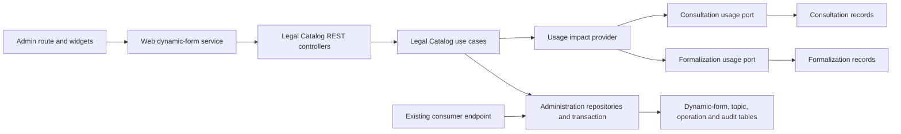

# 1. Context and scope

## Objective and source

Deliver the complete-mode administration surface requested by SCRUM-141 and PRD requirements REQ-CAT-016/017: an administrator can find, inspect, duplicate, activate, deactivate and permanently remove dynamic-form definitions while historical consultation and formalization snapshots remain intact. The canonical product sources are linked in the metadata; the PRD and Jira ticket were updated with explicit approval on 2026-09-11 so search is by form name only.

## Current behavior and product gap

HMS currently exposes available dynamic forms to consumer flows through `/dynamic-forms`, stores definitions in the shared server layer, and has no protected administration page, audit trail, impact query, uniqueness guarantee or admin navigation entry. The existing consultation and formalization records already preserve snapshots and answers; this delivery must keep those consumers and historical values compatible while moving administration ownership into Legal Catalog.

## Scope and product alignment

| Area | In scope | Out of scope |
| --- | --- | --- |
| Catalog | Paginated admin list, name search, stage/status filters, separate legal area/topics, field count and status | Editing form structure and question authoring |
| Operations | Duplicate as unavailable, make available/unavailable, impact preview, permanent definition deletion, durable audit | Restoring deleted definitions or editing historical snapshots |
| Entry points | Admin sidebar item and protected list/new/edit routes | Functional editor; `/novo` and `/$dynamicFormId` are explicit placeholders |
| Compatibility | Preserve the existing authenticated consumer list contract and historical answers/snapshots | Broad redesign of consultation/formalization flows |

| Source requirement | Delivery | Notes |
| --- | --- | --- |
| PRD REQ-CAT-016 | full | Admin listing, name-only search, filters, status and classification metadata |
| PRD REQ-CAT-017 | full | Duplicate, availability, deletion, impact awareness and audit |
| SCRUM-141 | full | Page, operations, server authorization, persistence and validation evidence |
| Confirmed editor decision | partial | Entry routes work; editor content is deferred |
| Confirmed navigation decision | full | Sidebar entry is visible only to administrators |

## Product decisions and assumptions

| Decision | Contract |
| --- | --- |
| Search | Case-insensitive server search matches only the trimmed form name; visible placeholder is `Buscar por nome`. |
| Table | `Área jurídica` and `Temas` remain separate; topics render the first ordered topic plus `+N`. |
| Row actions | `Editar` is explicit. Overflow contains `Duplicar formulário`, the status-dependent availability action, and `Excluir formulário`. |
| Editor entry | `Novo formulário`, `Editar` and conflict action `Abrir formulário` navigate to protected placeholder routes. |
| Page size/order | Five items per page; deterministic ascending normalized name, then ID. |
| History | Deactivation and deletion never mutate consultation/formalization snapshots or answers. |

# 2. Implementation Contract

## Functional requirements

| ID | Observable requirement | Source |
| --- | --- | --- |
| FR-01 | Only an authenticated active administrator can discover or open the list and placeholder routes or call administration operations. | SCRUM-141; confirmed sidebar decision |
| FR-02 | The list presents name/description, stage, legal area, ordered topic summary, field count, availability and actions, five per page. | REQ-CAT-016; Pencil `DWg64` |
| FR-03 | Search matches only name; stage and status filters combine with it and all list state is represented in the URL. | Updated REQ-CAT-016 and SCRUM-141 |
| FR-04 | Duplicating copies stage, area, ordered topics, fields and rules under a unique name; the copy begins unavailable and the source/history is unchanged. | REQ-CAT-017; Pencil `V7nH8` |
| FR-05 | A duplicate-name conflict disables confirmation when known and, after authoritative server rejection, identifies the existing form and offers `Abrir formulário`. | SCRUM-141; confirmed editor decision |
| FR-06 | Before deactivation or deletion the UI obtains live impact totals; deactivation prevents future selection while preserving existing usage. | REQ-CAT-017; Pencil `WjuC6` |
| FR-07 | An unavailable definition can be made available directly; repeated requests for the already-target status are successful no-ops. | REQ-CAT-017; Pencil `iu2Vg`/`tErvw` |
| FR-08 | Permanent deletion removes only the catalog definition after confirmation, preserves historical structures/answers and is idempotent when repeated. | REQ-CAT-017; Pencil `aSbsz` |
| FR-09 | Each effective duplicate, availability change and deletion records one append-only audit entry with actor, time, action and safe metadata. | SCRUM-141 |
| FR-10 | Loading, empty, filtered-empty, recoverable failure, pending, success and narrow/keyboard states remain understandable and accessible. | SCRUM-141; repository UI rules |
| FR-11 | Existing dynamic-form consumers continue receiving only available compatible definitions. | PRD compatibility outcome |

## Acceptance criteria

| ID | Acceptance criterion | FR |
| --- | --- | --- |
| AC-01 | Admin sees the sidebar item and can open `/formularios-dinamicos`; attendant cannot see it and receives the established forbidden behavior for all three routes and admin APIs. | FR-01 |
| AC-02 | Populated list, badges, separate classification columns, five-item pagination and `principal +N` topic summary match the manifest. | FR-02 |
| AC-03 | Typing a name or changing a filter resets page to 1, updates canonical URL search parameters and produces the corresponding server result; unrelated area/topic text does not match name search. | FR-03 |
| AC-04 | Duplicate dialog suggests `<nome> — cópia`; a unique submit creates one unavailable copy and refreshes/navigates predictably without changing the original. | FR-04 |
| AC-05 | Normalized duplicate names (`trim` + lowercase) conflict globally; the UI keeps the dialog open, announces the error and can open the existing placeholder route. | FR-05 |
| AC-06 | Deactivation and deletion dialogs display consultation/formalization totals and in-progress totals from the server immediately before confirmation. | FR-06, FR-08 |
| AC-07 | Effective status changes update the row and audit once; replaying the same target status adds no audit. | FR-07, FR-09 |
| AC-08 | First deletion returns success and records one audit; a replay returns success without a second audit or historical mutation. | FR-08, FR-09 |
| AC-09 | Failed reads show retry; pending mutations disable duplicate submission; failures retain context/focus and successes are announced. | FR-10 |
| AC-10 | At 320 CSS px and by keyboard, every filter, row value, menu/dialog action and focus return remains operable without page-level horizontal overflow. | FR-10 |
| AC-11 | The existing `/dynamic-forms` endpoint retains its response compatibility and excludes unavailable/deleted definitions. | FR-11 |

## Design obligations

The authoritative visual inventory and allowed deviations are in [design/manifest.md](./design/manifest.md). Production uses documented HMS tokens, serif headings, sans body copy, theme behavior and existing shell/components. Accessible names must use the exact Portuguese action labels in the manifest. Dialog focus is trapped, Escape/cancel restores the triggering row control, destructive confirmations identify the selected form, and status or error changes use the existing live-region/toast convention.

# 3. Technical Contract

## Current technical state and boundary flow

Today `packages/core/src/shared/domain/entities/dynamic-form.ts` and the shared repository/list use case own definitions; `apps/server/src/shared/database/drizzle/models/dynamic-form-model.ts` persists `contexts` and JSON fields; `apps/server/src/shared/rest/controllers/list-dynamic-forms.controller.ts` exposes the consumer endpoint; and `apps/web/src/rest/services/dynamic-form-service.ts` feeds consultation/formalization selectors. Legal Catalog currently owns only area/topic contracts and read controllers. No administration write path, impact port, audit storage, normalized-name index, route, widget or navigation item exists.



## Runtime flow and decisions

| Decision | Contract and rationale |
| --- | --- |
| Ownership | Legal Catalog owns dynamic-form definitions and administration. Neutral field/snapshot/answer value types may remain shared; consumer modules depend on public Legal Catalog contracts, not its tables. |
| Authorization | Web middleware gives early UX protection; every server controller uses `AuthGuard` and `ActiveAdminGuard`. Actor identity comes from `CurrentCollaborator`. |
| Metadata | `dynamic_forms` gains canonical stage, legal-area and normalized-name columns; ordered topics use a join table. The legacy `contexts` response is derived for compatibility, not retained as a second database truth. |
| Uniqueness | Persist `normalized_name = name.trim().toLowerCase()` and enforce one unique database index. Repository translates its violation into `DynamicFormNameConflictError(existingDynamicFormId)`. |
| Atomicity | Duplicate, effective availability change and first deletion couple definition writes and audit insert in one Drizzle transaction. No audit is written for semantic replays. |
| Impact | Legal Catalog depends on small Core usage-provider ports implemented by Consultation and Formalization; it never imports their models/repositories directly. |
| Historical safety | Consultation/formalization snapshots and answers remain self-contained. Definition deletion has no cascading FK into historical tables. |
| Compatibility | Existing `GET /dynamic-forms` remains authenticated, URL/shape-compatible and maps canonical metadata back to its current `contexts` projection. |
| UI state | TanStack Router owns validated URL search; TanStack Query owns server state; widgets own only overlay/form state. No new dependency. |

## Layer ownership and test boundaries

| Layer | Owns | Must not own or reach through |
| --- | --- | --- |
| Core (`packages/core`) | Legal Catalog entities, structures, errors, use cases and ports; consumer-module usage-provider contracts | Framework/HTTP concerns, database implementations, Web widgets or a dependency on `packages/validation` |
| Validation (`packages/validation`) | Zod schemas, inferred transport types and public barrels for Legal Catalog input contracts | Domain behavior, persistence, HTTP controllers, Web state or package-local test files; schema behavior is proved by consuming boundaries |
| Server (`apps/server`) | Nest module composition, Drizzle models/repositories/migrations, DTOs, guards and REST controllers | Direct access from controllers to database tables or consumer-module internals; each controller owns exactly one mirrored real integration test file |
| Web (`apps/web`) | Protected routes, REST service adapters, page/widget composition and controller hooks for interaction state | Core/database imports, duplicated authorization decisions or business rules outside the service/use-case boundary |
| Consumer modules (`consultation`, `formalization`) | Their own usage-provider implementations and historical records/snapshots | Legal Catalog table/repository access; communication occurs through Core-owned ports and public references |

Test ownership follows the same boundaries: Core use cases are tested in Core, Server controllers are tested as real Nest/database integrations one file per controller, Web widgets have one component test plus one controller-hook test each, and every protected route has its own Playwright route test. The Validation package remains test-free and is validated through Core, Server and Web consumers.

## Domain declarations

| Declaration | Kind/owner | Contract summary | Consumers |
| --- | --- | --- | --- |
| `DynamicForm` | Entity / Legal Catalog | Canonical identified form definition and availability lifecycle | administration repository, use cases, consumer compatibility adapter |
| `DynamicFormListItem` | Structure / Legal Catalog | Administrative list projection | list use case/REST/web |
| `DynamicFormUsageImpact` | Structure / Legal Catalog | Cross-module historical-use totals | impact use case/dialogs |
| `DynamicFormAdministrationAuditEntry` | Entity / Legal Catalog | Durable append-only administration fact | repository/tests |
| `DynamicFormNameConflictError` | Error / Legal Catalog | Carries `existingDynamicFormId` | duplicate/name-conflict REST translation |

| Path | Change | Declaration and responsibility |
| --- | --- | --- |
| `packages/core/src/legal-catalog/domain/entities/dynamic-form.ts` | Create | `DynamicForm` composed as `Entity & {...}`; canonical definition metadata and lifecycle. |
| `packages/core/src/legal-catalog/domain/entities/dynamic-form-administration-audit-entry.ts` | Create | Append-only audit entity. |
| `packages/core/src/legal-catalog/domain/structures/dynamic-form-administration-action.ts` | Create | Audit action union. |
| `packages/core/src/legal-catalog/domain/structures/dynamic-form-audit-details.ts` | Create | Action-correlated safe audit metadata union. |
| `packages/core/src/legal-catalog/domain/structures/dynamic-form-stage.ts` | Create | Canonical stage values. |
| `packages/core/src/legal-catalog/domain/structures/dynamic-form-status.ts` | Create | Canonical availability values. |
| `packages/core/src/legal-catalog/domain/structures/dynamic-form-list-item.ts` | Create | Administrative list projection with explicit external identity. |
| `packages/core/src/legal-catalog/domain/structures/dynamic-form-list-query.ts` | Create | Validated list query. |
| `packages/core/src/legal-catalog/domain/structures/dynamic-form-list-result.ts` | Create | Paginated list result. |
| `packages/core/src/legal-catalog/domain/structures/dynamic-form-usage-count.ts` | Create | Per-consumer total/in-progress count. |
| `packages/core/src/legal-catalog/domain/structures/dynamic-form-usage-impact.ts` | Create | Consultation/formalization totals. |
| `packages/core/src/legal-catalog/domain/structures/duplicate-dynamic-form-operation.ts` | Create | Immutable duplicate replay record. |
| `packages/core/src/legal-catalog/domain/errors/dynamic-form-not-found-error.ts` | Create | Named missing-definition failure. |
| `packages/core/src/legal-catalog/domain/errors/dynamic-form-name-conflict-error.ts` | Create | Named normalized-name conflict with existing ID. |
| `packages/core/src/legal-catalog/domain/errors/idempotency-key-conflict-error.ts` | Create | Named replay-key identity conflict with safe metadata. |
| `packages/core/src/legal-catalog/domain/entities/index.ts` | Modify | Export the definition and audit entities. |
| `packages/core/src/legal-catalog/domain/structures/index.ts` | Create | Export each administration structure from its own declaration file. |
| `packages/core/src/legal-catalog/domain/errors/index.ts` | Create | Export administration named errors. |
| `packages/core/package.json` | Modify | Add Legal Catalog structures/errors export subpaths while retaining existing entities/interfaces/use-cases subpaths. |

Each exported declaration above has one canonical source file named in the affected-path map;
the Core one-exported-type-per-file rule applies to every type alias, while each entity and
use-case class remains in its own file. `DynamicForm` composes `Entity`, and list projections
use explicit external identity fields because they are transport-facing structures rather
than persisted entities. The legacy shared `DynamicForm` and `DynamicFormsRepository` remain
compatibility contracts for consumer flows; the administration contract is a separate
`DynamicFormAdministrationRepository` and is adapted at the Server boundary.

### Domain schema

| Declaration | Required fields and validation | Invariants |
| --- | --- | --- |
| `DynamicForm` | All fields above; UUID IDs; trimmed 1–160 name; `normalizedName` derived; ordered unique topic IDs; at least one valid field | One stage/area, global normalized-name uniqueness; copies start unavailable |
| `DynamicFormListItem` | All fields above; topic positions are non-negative and unique | Projection preserves topic order and canonical status/stage |
| `DynamicFormListQuery` | `page >= 1`, exact `pageSize = 5`; optional trimmed search/enums | Search is name-only; ordering is normalized name then ID |
| `DynamicFormListResult` | Items plus non-negative totals/page count | Empty out-of-range pages canonicalize through UI to a valid page |
| `DynamicFormUsageImpact` | Non-negative integers; `inProgress <= total` | Consultation pending and formalization in-progress define in-progress |
| `DynamicFormAdministrationAuditEntry` | UUID IDs, actor, timestamp, action-correlated `DynamicFormAuditDetails` | Immutable; survives definition deletion; no sensitive answers/snapshots |
| `DuplicateDynamicFormOperation` | UUID key/source/actor, normalized requested name, complete result snapshot and completion time | Globally keyed replay record; never recreates a later-deleted copy |

The following signatures are the executable Core contract. Each block represents the single
exported declaration in the file named by its heading; nested object types are intentionally
structural and are not separately exported.

`packages/core/src/legal-catalog/domain/entities/dynamic-form.ts`

```ts
export type DynamicForm = Entity & {
  name: string
  normalizedName: string
  description: string | null
  status: DynamicFormStatus
  stage: DynamicFormStage
  legalAreaId: string
  legalTopicIds: string[]
  fields: DynamicFormField[]
  createdAt: Date
  updatedAt: Date
}
```

`packages/core/src/legal-catalog/domain/structures/dynamic-form-list-item.ts`

```ts
export type DynamicFormListItem = {
  id: string
  name: string
  description: string | null
  status: DynamicFormStatus
  stage: DynamicFormStage
  legalArea: { id: string; name: string }
  legalTopics: Array<{ id: string; name: string; position: number }>
  fieldCount: number
}
```

`packages/core/src/legal-catalog/domain/structures/dynamic-form-list-query.ts`

```ts
export type DynamicFormListQuery = {
  search?: string
  stage?: DynamicFormStage
  status?: DynamicFormStatus
  page: number
  pageSize: 5
}
```

`packages/core/src/legal-catalog/domain/structures/dynamic-form-list-result.ts`

```ts
export type DynamicFormListResult = {
  items: DynamicFormListItem[]
  page: number
  pageSize: 5
  total: number
  pageCount: number
}
```

`packages/core/src/legal-catalog/domain/structures/dynamic-form-usage-count.ts`

```ts
export type DynamicFormUsageCount = { total: number; inProgress: number }
```

`packages/core/src/legal-catalog/domain/structures/dynamic-form-usage-impact.ts`

```ts
export type DynamicFormUsageImpact = {
  consultation: DynamicFormUsageCount
  formalization: DynamicFormUsageCount
}
```

`packages/core/src/legal-catalog/domain/structures/dynamic-form-administration-action.ts`

```ts
export type DynamicFormAdministrationAction =
  | 'duplicated'
  | 'availability_changed'
  | 'deleted'
```

`packages/core/src/legal-catalog/domain/structures/dynamic-form-audit-details.ts`

```ts
export type DynamicFormAuditDetails =
  | { action: 'duplicated'; sourceDynamicFormId: string; targetDynamicFormId: string; targetName: string }
  | { action: 'availability_changed'; previousStatus: DynamicFormStatus; targetStatus: DynamicFormStatus; formName: string }
  | { action: 'deleted'; deletedFormName: string; previousStatus: DynamicFormStatus }
```

`packages/core/src/legal-catalog/domain/entities/dynamic-form-administration-audit-entry.ts`

```ts
export type DynamicFormAdministrationAuditEntry = Entity & {
  dynamicFormId: string
  actorCollaboratorId: string
  action: DynamicFormAdministrationAction
  occurredAt: Date
  operationKey: string | null
  details: DynamicFormAuditDetails
}
```

`packages/core/src/legal-catalog/domain/structures/duplicate-dynamic-form-operation.ts`

```ts
export type DuplicateDynamicFormOperation = {
  operationKey: string
  sourceDynamicFormId: string
  requestedNormalizedName: string
  actorCollaboratorId: string
  result: DynamicForm
  completedAt: Date
}
```

`packages/core/src/legal-catalog/domain/structures/find-dynamic-form-name-conflict-result.ts`

```ts
export type FindDynamicFormNameConflictResult = {
  conflict: boolean
  existingDynamicFormId?: string
}
```

`packages/core/src/legal-catalog/domain/structures/duplicate-dynamic-form-request.ts`

```ts
export type DuplicateDynamicFormRequest = {
  dynamicFormId: string
  name: string
  operationKey: string
  actorCollaboratorId: string
}
```

`packages/core/src/legal-catalog/domain/structures/change-dynamic-form-availability-request.ts`

```ts
export type ChangeDynamicFormAvailabilityRequest = {
  dynamicFormId: string
  status: DynamicFormStatus
  actorCollaboratorId: string
}
```

`packages/core/src/legal-catalog/domain/structures/delete-dynamic-form-request.ts`

```ts
export type DeleteDynamicFormRequest = {
  dynamicFormId: string
  actorCollaboratorId: string
}
```

`packages/core/src/legal-catalog/domain/structures/dynamic-form-name-conflict-metadata.ts`

```ts
export type DynamicFormNameConflictMetadata = { existingDynamicFormId: string }
```

`packages/core/src/legal-catalog/domain/structures/idempotency-key-conflict-metadata.ts`

```ts
export type IdempotencyKeyConflictMetadata = {
  operationKey: string
  originalSourceDynamicFormId: string
}
```

## Use cases and interfaces

| Use case | Input → output | Direct collaborators | Consistency/failures |
| --- | --- | --- | --- |
| `ListDynamicFormsForAdministrationUseCase` | `DynamicFormListQuery` → `DynamicFormListResult` | `DynamicFormAdministrationRepository` | Admin guard at controller; deterministic order |
| `FindDynamicFormNameConflictUseCase` | `{ name: string }` → `{ conflict: boolean; existingDynamicFormId?: string }` | `DynamicFormAdministrationRepository` | Advisory only; write-time unique check authoritative |
| `DuplicateDynamicFormUseCase` | `{ dynamicFormId; name; operationKey; actorCollaboratorId }` → `DynamicForm` | administration repository, transaction, ID/time providers | Same operation key returns original result; unique conflict is named |
| `GetDynamicFormUsageImpactUseCase` | `{ dynamicFormId }` → `DynamicFormUsageImpact` | usage provider | Not found is named; read is live and side-effect free |
| `ChangeDynamicFormAvailabilityUseCase` | `{ dynamicFormId; status; actorCollaboratorId }` → `DynamicForm` | administration repository, transaction, ID/time | Same target is no-op; effective change/audit atomic |
| `DeleteDynamicFormUseCase` | `{ dynamicFormId; actorCollaboratorId }` → `void` | administration repository, transaction, ID/time | Missing is successful replay; first delete/audit atomic |

| Interface | Complete resulting signature |
| --- | --- |
| `DynamicFormAdministrationRepository` | Administration list, identity/name reads, insert, status update and delete signatures declared below. |
| `DynamicFormsRepository` | Existing consumer `list`, `addMany` and `removeAll` contract remains unchanged and is implemented by a compatibility adapter over canonical Legal Catalog persistence. |
| `DynamicFormDuplicateOperationsRepository` | Persist and retrieve immutable operation request/result snapshots by globally unique key. |
| `DynamicFormAdministrationAuditRepository` | `add(entry: DynamicFormAdministrationAuditEntry): Promise<void>` |
| `LegalCatalogDatabase` | `transaction<T>(work: () => Promise<T>): Promise<T>` using the existing async-local Drizzle transaction context |
| `DynamicFormUsageProvider` | `getImpact(dynamicFormId: string): Promise<DynamicFormUsageImpact>` |
| `ConsultationDynamicFormUsageProvider` | `countByDynamicFormId(id: string): Promise<DynamicFormUsageCount>` |
| `FormalizationDynamicFormUsageProvider` | `countByDynamicFormId(id: string): Promise<DynamicFormUsageCount>` |

Use-case and interface files live under `packages/core/src/legal-catalog/{use-cases,interfaces}` with one action per file and colocated `.test.ts` use-case tests. The two consumer usage-provider ports live under their owning `packages/core/src/{consultation,formalization}/interfaces` and are exported by existing module barrels.

The canonical administration persistence port is:

```ts
export interface DynamicFormAdministrationRepository {
  list(query: DynamicFormListQuery): Promise<DynamicFormListResult>
  findById(id: string): Promise<DynamicForm | null>
  findByNormalizedName(normalizedName: string): Promise<DynamicForm | null>
  add(form: DynamicForm): Promise<void>
  changeStatus(input: {
    id: string
    status: DynamicFormStatus
    updatedAt: Date
  }): Promise<DynamicForm | null>
  remove(id: string): Promise<boolean>
}
```

The unchanged consumer port remains:

```ts
export interface DynamicFormsRepository {
  list(): Promise<DynamicForm[]>
  addMany(forms: readonly DynamicFormCreation[]): Promise<DynamicForm[]>
  removeAll(): Promise<void>
}
```

The request/result, error-metadata and provider declarations also each have a named
one-declaration file in the affected-path map. The six concrete use-case classes remain one
class per file. The administration repository is deliberately distinct from the unchanged
consumer repository: its Server implementation reads/writes canonical Legal Catalog tables,
while the existing shared adapter preserves consumer `contexts`, `list`, `addMany` and
`removeAll` behavior for consultation, formalization and seed flows.

Duplicate replay is globally scoped by UUID `operationKey`. In one transaction, the use case locks or inserts the operation key, verifies that any existing record has the same source ID, normalized requested name and actor, and returns its stored result snapshot without a new definition/audit. Reusing a key with different request identity raises `IdempotencyKeyConflictError` with the metadata above. If the returned copy was later deleted, replay still returns the original immutable result snapshot and never recreates it; the subsequent list correctly omits it.

## Validation and REST contracts

| Schema | Fields/refinements | Consumers |
| --- | --- | --- |
| `dynamicFormAdministrationSearchSchema` | `search` trimmed optional max 160; stage/status enums; positive page default 1; pageSize literal/default 5 | route and list controller |
| `duplicateDynamicFormSchema` | trimmed `name` 1–160; UUID `operationKey` | dialog and duplicate controller |
| `changeDynamicFormAvailabilitySchema` | status enum | menu and availability controller |
| `dynamicFormNameConflictSearchSchema` | trimmed name 1–160 | duplicate dialog/controller |

Add the schemas under `packages/validation/src/legal-catalog/schemas/`, export them from the
Legal Catalog and root barrels, and infer request/search types from Zod. The Validation package
is intentionally test-free; schema behavior is proved through consuming Core, Server and Web
boundaries. Syntax belongs here; existence, uniqueness and authorization remain Core/Server
decisions.

```ts
export type DynamicFormAdministrationSearch = z.infer<typeof dynamicFormAdministrationSearchSchema>
export type DuplicateDynamicFormInput = z.infer<typeof duplicateDynamicFormSchema>
export type ChangeDynamicFormAvailabilityInput = z.infer<typeof changeDynamicFormAvailabilitySchema>
export type DynamicFormNameConflictSearch = z.infer<typeof dynamicFormNameConflictSearchSchema>

export interface LegalCatalogService {
  listLegalAreas(): Promise<RestResponse<LegalArea[]>>
  listLegalTopics(legalAreaId: string): Promise<RestResponse<LegalTopic[]>>
  listDynamicFormsForAdministration(
    query: DynamicFormListQuery,
  ): Promise<RestResponse<DynamicFormListResult>>
  findDynamicFormNameConflict(
    name: string,
  ): Promise<RestResponse<FindDynamicFormNameConflictResult>>
  duplicateDynamicForm(
    dynamicFormId: string,
    input: { name: string; operationKey: string },
  ): Promise<RestResponse<DynamicForm>>
  getDynamicFormUsageImpact(
    dynamicFormId: string,
  ): Promise<RestResponse<DynamicFormUsageImpact>>
  changeDynamicFormAvailability(
    dynamicFormId: string,
    input: { status: DynamicFormStatus },
  ): Promise<RestResponse<DynamicForm>>
  deleteDynamicForm(dynamicFormId: string): Promise<RestResponse<void>>
}
```

`LegalCatalogService` is the single public REST-facing catalog contract. Its existing area/topic methods remain unchanged, and its administration methods preserve the established `RestResponse<T>` boundary. The interface imports only Core-owned declarations; Validation-inferred search/body types are structurally checked and mapped by the Web/REST boundaries to `DynamicFormListQuery`, `{ name; operationKey }`, and `{ status }`. Core never imports `@hms/validation`. No `DynamicFormAdministrationService` declaration is introduced.

REST DTOs serialize every `Date` as ISO 8601 and otherwise preserve the Core field names above. A 409 name-conflict response uses the existing error envelope with `code: 'DYNAMIC_FORM_NAME_CONFLICT'` and `metadata: DynamicFormNameConflictMetadata`; an operation-key mismatch uses `code: 'IDEMPOTENCY_KEY_CONFLICT'` and `metadata: IdempotencyKeyConflictMetadata`. Authentication/authorization failures use the established envelope without leaking whether a form exists.

| Operation | Core action | Web method | Security and response |
| --- | --- | --- | --- |
| `GET /legal-catalog/dynamic-forms` | `ListDynamicFormsForAdministrationUseCase` | `LegalCatalogService.listDynamicFormsForAdministration(query)` | Auth + active admin; 200 `DynamicFormListResult` |
| `GET /legal-catalog/dynamic-form-name-conflicts?name=` | `FindDynamicFormNameConflictUseCase` | `LegalCatalogService.findDynamicFormNameConflict(name)` | Auth + active admin; 200 conflict projection |
| `POST /legal-catalog/dynamic-forms/:dynamicFormId/duplicates` | `DuplicateDynamicFormUseCase` | `LegalCatalogService.duplicateDynamicForm(id,input)` | Auth + active admin; 201 on first/replay; 404 source; 409 with `existingDynamicFormId` |
| `GET /legal-catalog/dynamic-forms/:dynamicFormId/impact` | `GetDynamicFormUsageImpactUseCase` | `LegalCatalogService.getDynamicFormUsageImpact(id)` | Auth + active admin; 200 impact; 404 definition |
| `PATCH /legal-catalog/dynamic-forms/:dynamicFormId/availability` | `ChangeDynamicFormAvailabilityUseCase` | `LegalCatalogService.changeDynamicFormAvailability(id,input)` | Auth + active admin; 200 effective/no-op; 404 definition |
| `DELETE /legal-catalog/dynamic-forms/:dynamicFormId` | `DeleteDynamicFormUseCase` | `LegalCatalogService.deleteDynamicForm(id)` | Auth + active admin; 204 first/replay |
| `GET /dynamic-forms` | Existing consumer list | Existing consumer method | Preserve auth, query and response; available definitions only |

Add one controller per action under `apps/server/src/legal-catalog/rest/controllers`, boundary DTO/serializer tests where needed, controller integration tests using the real Nest module and test database, exports/registration in `LegalCatalogModule`, and complete labeled examples for every route in `apps/server/rest-client/legal-catalog/legal-catalog.rest`. Controllers derive actor IDs from session context and translate named errors through the existing REST error contract. The shared error envelope is extended backward-compatibly with optional `code` and `metadata`; only named dynamic-form conflicts and idempotency-key conflicts populate those fields, while all existing error consumers retain their current fields.

## Database and composition contract

`LegalCatalogModule` imports `IdentityDatabaseModule`, `LegalCatalogDatabaseModule`,
`LegalCatalogProvisionModule` and the existing `AuthModule`, and registers
`ActiveAdminGuard` locally alongside the six controllers and use cases. To avoid the current
cycle, `IdentityDatabaseModule` imports `LegalCatalogDatabaseModule` (the lower-level database
module) rather than `LegalCatalogModule`; the root Legal Catalog module is then free to import
`IdentityDatabaseModule` for the guard's repository tokens. The shared
`SharedModule` owns the cross-module usage composition and consumes only the
public provider tokens exported by Consultation and Formalization; `LegalCatalogProvisionModule`
adapts that shared provider to the Legal Catalog token. No feature module imports another
module's private repository or database implementation.

## Canonical affected-path map

Every implementation path below is contractual; tests use the repository-required `.test.ts`/`.test.tsx` suffix and generated files are produced only by their named generator.

| Path | Change | Declarations/runtime guarantee |
| --- | --- | --- |
| `packages/core/src/legal-catalog/use-cases/list-dynamic-forms-for-administration-use-case.ts` | Create | `ListDynamicFormsForAdministrationUseCase` and complete request/result contract |
| `packages/core/src/legal-catalog/use-cases/find-dynamic-form-name-conflict-use-case.ts` | Create | `FindDynamicFormNameConflictUseCase` advisory read |
| `packages/core/src/legal-catalog/use-cases/duplicate-dynamic-form-use-case.ts` | Create | `DuplicateDynamicFormUseCase` atomic duplicate/idempotent replay orchestration |
| `packages/core/src/legal-catalog/use-cases/get-dynamic-form-usage-impact-use-case.ts` | Create | `GetDynamicFormUsageImpactUseCase` live impact aggregation |
| `packages/core/src/legal-catalog/use-cases/change-dynamic-form-availability-use-case.ts` | Create | `ChangeDynamicFormAvailabilityUseCase` idempotent target-state mutation |
| `packages/core/src/legal-catalog/use-cases/delete-dynamic-form-use-case.ts` | Create | `DeleteDynamicFormUseCase` idempotent definition deletion |
| `packages/core/src/legal-catalog/use-cases/tests/list-dynamic-forms-for-administration-use-case.test.ts` | Create | List query, ordering, filtering and pagination behavior |
| `packages/core/src/legal-catalog/use-cases/tests/find-dynamic-form-name-conflict-use-case.test.ts` | Create | Advisory normalization/conflict behavior |
| `packages/core/src/legal-catalog/use-cases/tests/duplicate-dynamic-form-use-case.test.ts` | Create | Duplicate transaction, named failures, races and replay behavior |
| `packages/core/src/legal-catalog/use-cases/tests/get-dynamic-form-usage-impact-use-case.test.ts` | Create | Live impact aggregation and missing-definition behavior |
| `packages/core/src/legal-catalog/use-cases/tests/change-dynamic-form-availability-use-case.test.ts` | Create | Status transitions, no-op replay and audit behavior |
| `packages/core/src/legal-catalog/use-cases/tests/delete-dynamic-form-use-case.test.ts` | Create | Deletion transaction, idempotent replay and historical safety |
| `packages/core/src/legal-catalog/use-cases/index.ts` | Modify | Export six actions |
| `packages/core/src/legal-catalog/interfaces/dynamic-form-administration-repository.ts` | Create | `DynamicFormAdministrationRepository`, separate canonical administration persistence port |
| `packages/core/src/legal-catalog/interfaces/dynamic-form-duplicate-operations-repository.ts` | Create | Immutable operation replay port |
| `packages/core/src/legal-catalog/interfaces/dynamic-form-administration-audit-repository.ts` | Create | Append-only audit port |
| `packages/core/src/legal-catalog/interfaces/legal-catalog-database.ts` | Create | `LegalCatalogDatabase`, the module transaction port |
| `packages/core/src/legal-catalog/interfaces/dynamic-form-usage-provider.ts` | Create | Aggregated impact port |
| `packages/core/src/legal-catalog/domain/structures/find-dynamic-form-name-conflict-result.ts` | Create | Conflict lookup result |
| `packages/core/src/legal-catalog/domain/structures/duplicate-dynamic-form-request.ts` | Create | Duplicate command input |
| `packages/core/src/legal-catalog/domain/structures/change-dynamic-form-availability-request.ts` | Create | Availability command input |
| `packages/core/src/legal-catalog/domain/structures/delete-dynamic-form-request.ts` | Create | Delete command input |
| `packages/core/src/legal-catalog/domain/structures/dynamic-form-name-conflict-metadata.ts` | Create | Safe 409 conflict metadata |
| `packages/core/src/legal-catalog/domain/structures/idempotency-key-conflict-metadata.ts` | Create | Safe replay-key conflict metadata |
| `packages/core/src/legal-catalog/interfaces/legal-catalog-service.ts` | Modify | Extend the existing public catalog REST contract with six `RestResponse`-wrapped methods using Core-owned `DynamicFormListQuery`, results and transport-neutral inline command fields; retain area/topic methods and prohibit a Core → Validation dependency. |
| `packages/core/src/legal-catalog/interfaces/index.ts` | Modify | Export administration ports |
| `packages/core/src/consultation/interfaces/consultation-dynamic-form-usage-provider.ts` | Create | Consultation-owned count port |
| `packages/core/src/consultation/interfaces/index.ts` | Modify | Export count port |
| `packages/core/src/formalization/interfaces/formalization-dynamic-form-usage-provider.ts` | Create | Formalization-owned count port |
| `packages/core/src/formalization/interfaces/index.ts` | Modify | Export count port |
| `packages/validation/src/legal-catalog/schemas/dynamic-form-administration-schema.ts` | Create | Four schemas and inferred public types |
| `packages/validation/src/legal-catalog/schemas/index.ts` | Modify | Export schemas/types |
| `packages/validation/src/shared/schemas/error-response-schema.ts` | Modify | Backward-compatible optional `code` and `metadata` fields for named REST failures |
| `apps/server/src/legal-catalog/rest/controllers/list-dynamic-forms-for-administration.controller.ts` | Create | Admin GET list boundary |
| `apps/server/src/legal-catalog/rest/controllers/find-dynamic-form-name-conflict.controller.ts` | Create | Admin GET conflict boundary |
| `apps/server/src/legal-catalog/rest/controllers/duplicate-dynamic-form.controller.ts` | Create | Admin POST duplicate boundary |
| `apps/server/src/legal-catalog/rest/controllers/get-dynamic-form-usage-impact.controller.ts` | Create | Admin GET impact boundary |
| `apps/server/src/legal-catalog/rest/controllers/change-dynamic-form-availability.controller.ts` | Create | Admin PATCH availability boundary |
| `apps/server/src/legal-catalog/rest/controllers/delete-dynamic-form.controller.ts` | Create | Admin DELETE boundary |
| `apps/server/src/legal-catalog/rest/controllers/tests/list-dynamic-forms-for-administration.controller.test.ts` | Create | Real Nest/database HTTP integration for admin listing, filters, ordering, pagination and 400/401/403 responses |
| `apps/server/src/legal-catalog/rest/controllers/tests/find-dynamic-form-name-conflict.controller.test.ts` | Create | Real Nest/database HTTP integration for conflict lookup, validation and authorization responses |
| `apps/server/src/legal-catalog/rest/controllers/tests/duplicate-dynamic-form.controller.test.ts` | Create | Real Nest/database HTTP integration for duplicate success, 404/409 handling, idempotency replay, persistence and audit |
| `apps/server/src/legal-catalog/rest/controllers/tests/get-dynamic-form-usage-impact.controller.test.ts` | Create | Real Nest/database HTTP integration for consultation/formalization impact and authorization/not-found responses |
| `apps/server/src/legal-catalog/rest/controllers/tests/change-dynamic-form-availability.controller.test.ts` | Create | Real Nest/database HTTP integration for PATCH status transitions, no-op behavior, authorization/not-found responses, persistence and audit |
| `apps/server/src/legal-catalog/rest/controllers/tests/delete-dynamic-form.controller.test.ts` | Create | Real Nest/database HTTP integration for DELETE success/replay, authorization, persistence, historical preservation and audit |
| `apps/server/src/legal-catalog/rest/controllers/tests/legal-catalog-controller-test-fixture.ts` | Create | Shared real-module controller integration fixture |
| `apps/server/src/legal-catalog/rest/controllers/index.ts` | Modify | Export controllers |
| `apps/server/src/legal-catalog/rest/dtos/dynamic-form-administration-response.dto.ts` | Create | Administration form response DTO and Swagger declarations |
| `apps/server/src/legal-catalog/rest/dtos/dynamic-form-list-item-response.dto.ts` | Create | List-item response DTO and Swagger declarations |
| `apps/server/src/legal-catalog/rest/dtos/dynamic-form-list-response.dto.ts` | Create | Paginated list response DTO and item metadata |
| `apps/server/src/legal-catalog/rest/dtos/dynamic-form-name-conflict-response.dto.ts` | Create | Name-conflict response DTO |
| `apps/server/src/legal-catalog/rest/dtos/dynamic-form-usage-impact-response.dto.ts` | Create | Usage-impact response DTO and domain mapping |
| `apps/server/src/legal-catalog/rest/dtos/index.ts` | Modify | Export DTOs |
| `apps/server/src/shared/rest/filters/global-error-handler.ts` | Modify | Preserve named error codes/metadata in the shared error envelope |
| `apps/server/rest-client/legal-catalog/legal-catalog.rest` | Modify | Labeled authenticated examples for all Legal Catalog routes |
| `apps/server/src/legal-catalog/database/drizzle/models/dynamic-form-model.ts` | Create | Canonical definition table moved to Legal Catalog |
| `apps/server/src/legal-catalog/database/drizzle/models/dynamic-form-legal-topic-model.ts` | Create | Ordered topic association |
| `apps/server/src/legal-catalog/database/drizzle/models/dynamic-form-administration-audit-model.ts` | Create | Append-only audit table |
| `apps/server/src/legal-catalog/database/drizzle/models/dynamic-form-duplicate-operation-model.ts` | Create | Idempotency request/result table |
| `apps/server/src/legal-catalog/database/drizzle/models/index.ts` | Modify | Export all four models |
| `apps/server/src/legal-catalog/database/drizzle/mappers/dynamic-form-mapper.ts` | Create | Domain/write/legacy-context projection mapping |
| `apps/server/src/legal-catalog/database/drizzle/mappers/index.ts` | Modify | Export mapper |
| `apps/server/src/legal-catalog/database/drizzle/repositories/drizzle-dynamic-form-administration-repository.ts` | Create | `DrizzleDynamicFormAdministrationRepository` implements canonical admin list and definition writes |
| `apps/server/src/legal-catalog/database/drizzle/repositories/drizzle-dynamic-form-administration-audit-repository.ts` | Create | Audit insert only |
| `apps/server/src/legal-catalog/database/drizzle/repositories/drizzle-dynamic-form-duplicate-operations-repository.ts` | Create | Locked operation-key insert/read |
| `apps/server/src/legal-catalog/database/drizzle/repositories/drizzle-legal-catalog-database.ts` | Create | `DrizzleLegalCatalogDatabase` adapts the existing async-local Drizzle client to `LegalCatalogDatabase`. |
| `apps/server/src/legal-catalog/database/drizzle/repositories/index.ts` | Modify | Export repositories |
| `apps/server/src/legal-catalog/database/legal-catalog-database.module.ts` | Modify | Bind/export repositories and transaction adapter |
| `apps/server/src/legal-catalog/constants/legal-catalog-repositories.ts` | Modify | Add repository/database tokens |
| `apps/server/src/legal-catalog/constants/legal-catalog-providers.ts` | Modify | Add aggregated usage-provider token |
| `apps/server/src/shared/dynamic-form-usage-provider.ts` | Create | Compose the two public count providers without business persistence access |
| `apps/server/src/shared/constants/shared-providers.ts` | Create | Shared provider token |
| `apps/server/src/shared/shared.module.ts` | Modify | Register and export the shared cross-module usage provider |
| `apps/server/src/legal-catalog/provision/legal-catalog-provision.module.ts` | Create | Adapt and export the shared usage-provider token required by the feature root module |
| `apps/server/src/legal-catalog/provision/index.ts` | Create | Export the Legal Catalog provision module |
| `apps/server/src/consultation/database/drizzle/repositories/drizzle-consultation-dynamic-form-usage-provider.ts` | Create | Count total and `pending` by dynamic form |
| `apps/server/src/consultation/constants/consultation-providers.ts` | Create | Provider token |
| `apps/server/src/consultation/database/consultation-database.module.ts` | Modify | Bind/export count provider |
| `apps/server/src/consultation/database/drizzle/repositories/index.ts` | Modify | Export the consultation usage provider |
| `apps/server/src/formalization/database/drizzle/repositories/drizzle-formalization-dynamic-form-usage-provider.ts` | Create | Count total and `in_progress` by contract form |
| `apps/server/src/formalization/constants/formalization-providers.ts` | Modify | Provider token |
| `apps/server/src/formalization/database/formalization-database.module.ts` | Modify | Bind/export count provider |
| `apps/server/src/formalization/database/drizzle/repositories/index.ts` | Modify | Export the formalization usage provider |
| `apps/server/src/formalization/provision/formalization-provision.module.ts` | Modify | Bind the formalization usage provider into the existing provision module |
| `apps/server/src/legal-catalog/legal-catalog.module.ts` | Modify | Register controllers/use cases/`ActiveAdminGuard`, import IdentityDatabaseModule, database and provision modules without cycles |
| `apps/server/src/identity/database/identity-database.module.ts` | Modify | Import only `LegalCatalogDatabaseModule` for the legal-expertise provider, removing the root-module cycle |
| `apps/server/src/identity/identity.module.ts` | Modify | Preserve Identity module composition while exposing the database dependency required by the cycle-safe graph |
| `apps/server/src/shared/database/drizzle/models/dynamic-form-model.ts` | Remove | Retire shared definition model after canonical move |
| `apps/server/src/shared/database/drizzle/mappers/dynamic-form-mapper.ts` | Remove | Retire shared mapper after import migration |
| `apps/server/src/shared/database/drizzle/mappers/index.ts` | Modify | Remove the retired shared mapper export and expose the compatibility mapping boundary |
| `apps/server/src/shared/database/drizzle/repositories/drizzle-dynamic-forms-repository.ts` | Modify | Compatibility adapter implementing the unchanged consumer repository contract over canonical Legal Catalog persistence |
| `apps/server/src/shared/database/drizzle/schema.ts` | Modify | Register canonical Legal Catalog tables for Drizzle generation |
| `apps/server/src/shared/database/drizzle/database.module.ts` | Modify | Bind the unchanged consumer repository to the canonical Legal Catalog compatibility adapter |
| `apps/server/src/shared/database/drizzle/types/entities/dynamic-form.ts` | Modify | Align inferred row types/imports |
| `apps/server/rest-client/shared/dynamic-forms.rest` | Modify | Preserve and exercise consumer request example |
| `apps/server/src/shared/database/drizzle/migrations/0044_harsh_romulus.sql` | Generate | Backfill/move metadata and create topic/operation/audit integrity |
| `apps/server/src/shared/database/drizzle/migrations/meta/0044_snapshot.json` | Generate | Drizzle schema snapshot |
| `apps/server/src/shared/database/drizzle/migrations/meta/_journal.json` | Generate | Ordered migration journal entry |

Provider registration uses existing `DatetimeProvider` and ID-provider contracts from `ProvisionModule`; no duplicate clock/UUID implementation is added. The feature adapter has no dedicated provider test; its aggregation behavior is proven through the real usage-impact controller integration boundary.

| Persistence capability | Models/adapter | Integrity and registration |
| --- | --- | --- |
| Definitions | `dynamic-form-model.ts`, topic join model, mapper, `DrizzleDynamicFormAdministrationRepository` | Legal Catalog database module owns canonical bindings; the shared consumer adapter reuses the public persistence boundary without owning the tables |
| Audit | audit model/repository | Append-only insert capability; no update/remove methods; actor reference and definition ID retained after deletion |
| Usage impact | Consultation/Formalization count adapters | Each owning database module exports only its provider token; Legal Catalog composes both providers |

### `dynamic_forms`

| Column | Type | Nullable | Default | Description |
| --- | --- | --- | --- | --- |
| `id` | uuid | No | — | Definition identity |
| `name` | text | No | — | Trimmed display name |
| `normalized_name` | text | No | — | Lowercased trimmed uniqueness key |
| `description` | text | Yes | null | Optional supporting text |
| `status` | text | No | `unavailable` for new copies | Available/unavailable check enum |
| `stage` | text | No | — | Consultation/formalization check enum |
| `legal_area_id` | uuid | No | — | FK to legal areas |
| `fields` | jsonb | No | — | Existing ordered field definitions |
| `created_at` / `updated_at` | timestamp with time zone | No | now | Lifecycle timestamps |

| Index name | Columns | Type | Purpose |
| --- | --- | --- | --- |
| `dynamic_forms_normalized_name_unique` | `normalized_name` | unique btree | Global duplicate prevention |
| `dynamic_forms_admin_list_idx` | `stage,status,normalized_name,id` | btree | Stable filtered administration list |

| Constraint | Type | Definition | Purpose |
| --- | --- | --- | --- |
| `dynamic_forms_status_check` | check | status in available/unavailable | Valid lifecycle state |
| `dynamic_forms_stage_check` | check | stage in consultation/formalization | Valid owning flow |
| `dynamic_forms_legal_area_fk` | FK | legal area, restrict delete | Preserve classification integrity |

### `dynamic_form_legal_topics`

| Column | Type | Nullable | Default | Description |
| --- | --- | --- | --- | --- |
| `dynamic_form_id` | uuid | No | — | Cascades only when definition is deleted |
| `legal_topic_id` | uuid | No | — | Restrict-delete FK to topic |
| `position` | integer | No | — | Stable display/copy order |

| Index name | Columns | Type | Purpose |
| --- | --- | --- | --- |
| `dynamic_form_legal_topics_pk` | form ID, topic ID | primary | Prevent duplicate topic |
| `dynamic_form_legal_topics_position_unique` | form ID, position | unique | Stable unique order |

| Constraint | Type | Definition | Purpose |
| --- | --- | --- | --- |
| topic/form FKs | FK | topic restrict, form cascade | Definition-owned association only |
| position check | check | position >= 0 | Valid ordering |

### `dynamic_form_administration_audit_entries`

| Column | Type | Nullable | Default | Description |
| --- | --- | --- | --- | --- |
| `id` | uuid | No | — | Audit identity |
| `dynamic_form_id` | uuid | No | — | Historical ID without deletion FK |
| `actor_collaborator_id` | uuid | No | — | Acting collaborator |
| `action` | text | No | — | Fixed audit action check |
| `occurred_at` | timestamp with time zone | No | — | Provider-controlled time |
| `operation_key` | uuid | Yes | null | Duplicate replay key |
| `details` | jsonb | No | `{}` | Safe names/status/source-target metadata only |

| Index name | Columns | Type | Purpose |
| --- | --- | --- | --- |
| `dynamic_form_admin_audit_operation_unique` | `operation_key` where non-null | partial unique | Duplicate replay deduplication |
| `dynamic_form_admin_audit_form_time_idx` | form ID, occurred at | btree | Historical lookup/diagnosis |

| Constraint | Type | Definition | Purpose |
| --- | --- | --- | --- |
| action check | check | three declared actions | Stable vocabulary |
| actor FK | FK | collaborator restrict | Attributable administration |

### `dynamic_form_duplicate_operations`

| Column | Type | Nullable | Default | Description |
| --- | --- | --- | --- | --- |
| `operation_key` | uuid | No | — | Globally unique idempotency key |
| `source_dynamic_form_id` | uuid | No | — | Requested source identity; no FK so replay survives deletion |
| `requested_normalized_name` | text | No | — | Request identity comparison |
| `actor_collaborator_id` | uuid | No | — | Request identity comparison and attribution |
| `result` | jsonb | No | — | Immutable serialized `DynamicForm` response snapshot |
| `completed_at` | timestamp with time zone | No | — | Completion time |

| Index name | Columns | Type | Purpose |
| --- | --- | --- | --- |
| `dynamic_form_duplicate_operations_pk` | `operation_key` | primary | Serialize and deduplicate concurrent requests |

| Constraint | Type | Definition | Purpose |
| --- | --- | --- | --- |
| actor FK | FK | collaborator restrict | Keep replay attributable |

This table deliberately has no definition foreign keys: it is a command-result ledger, so replay remains deterministic after either source or target deletion. PostgreSQL row/unique-key locking serializes concurrent attempts; the use case compares source, normalized name and actor before returning a stored result.

Generate the next Drizzle migration (currently `apps/server/src/shared/database/drizzle/migrations/0044_harsh_romulus.sql`), its `meta/0044_snapshot.json`, and update `meta/_journal.json` through `pnpm --filter server db:migration:generate`. The migration backfills stage/area/topic rows from existing contexts, derives normalized names, fails safely on pre-existing normalized duplicates, verifies every form has one supported stage/area, then drops the contexts column only after compatibility mapping is implemented. Verify migration behavior through approved controller/application integration boundaries.

Composition changes include Legal Catalog database models/mappers/repositories/seeders and provider constants; `SharedModule` composes the public Consultation/Formalization provider tokens, while `LegalCatalogModule` imports only the shared composition boundary alongside `IdentityDatabaseModule` and its own database/provision modules. Update shared/server barrels and seeding entrypoints as ownership moves.

## Web contract

### Expected widget tree

```text
apps/web/src/
├── routes/formularios-dinamicos/
│   ├── index.tsx
│   ├── novo.tsx
│   └── $dynamicFormId.tsx
├── ui/legal-catalog/widgets/pages/dynamic-forms-page/
│   ├── index.tsx
│   ├── use-dynamic-forms-page.ts
│   ├── tests/
│   │   ├── dynamic-forms-page.test.tsx
│   │   └── use-dynamic-forms-page.test.ts
│   ├── dynamic-forms-table/
│   │   ├── index.tsx
│   │   ├── use-dynamic-forms-table.ts
│   │   ├── types.ts
│   │   └── tests/
│   │       ├── dynamic-forms-table.test.tsx
│   │       └── use-dynamic-forms-table.test.ts
│   ├── dynamic-form-actions/
│   │   ├── index.tsx
│   │   ├── use-dynamic-form-actions.ts
│   │   └── tests/
│   │       ├── dynamic-form-actions.test.tsx
│   │       └── use-dynamic-form-actions.test.ts
│   ├── duplicate-dynamic-form-dialog/
│   │   ├── index.tsx
│   │   ├── use-duplicate-dynamic-form-dialog.ts
│   │   ├── types.ts
│   │   └── tests/
│   │       ├── duplicate-dynamic-form-dialog.test.tsx
│   │       └── use-duplicate-dynamic-form-dialog.test.ts
│   ├── availability-dynamic-form-dialog/
│   │   ├── index.tsx
│   │   ├── use-availability-dynamic-form-dialog.ts
│   │   ├── types.ts
│   │   └── tests/
│   │       ├── availability-dynamic-form-dialog.test.tsx
│   │       └── use-availability-dynamic-form-dialog.test.ts
│   └── delete-dynamic-form-dialog/
│       ├── index.tsx
│       ├── use-delete-dynamic-form-dialog.ts
│       ├── types.ts
│       └── tests/
│           ├── delete-dynamic-form-dialog.test.tsx
│           └── use-delete-dynamic-form-dialog.test.ts
├── rest/services/
│   ├── dynamic-form-service.ts
│   └── legal-catalog-service.ts
├── constants/
│   ├── routes.ts
│   └── sidebar-items.ts
├── ui/shared/widgets/layouts/app-layout/tests/use-app-layout.test.ts
└── routeTree.gen.ts
```

The page and dialog controllers consume these domain-specific hooks; they do not import
TanStack Query or call REST services directly:

```text
apps/web/src/ui/legal-catalog/hooks/
├── index.ts
├── use-dynamic-forms-administration-query.ts
├── use-dynamic-form-name-conflict-query.ts
├── use-duplicate-dynamic-form-action.ts
├── use-dynamic-form-usage-impact-query.ts
├── use-change-dynamic-form-availability-action.ts
└── use-delete-dynamic-form-action.ts
```

The route integration suites are also explicit implementation leaves:

```text
apps/web/tests/routes/legal-catalog/
├── formularios-dinamicos.index.test.tsx
├── formularios-dinamicos.novo.test.tsx
└── formularios-dinamicos.$dynamicFormId.test.tsx
```

This surface has six widgets and 48 literal Web implementation leaves, including 12 widget
test files and seven domain-specific query/action hook files. The 48 leaves must have one-for-one
parity with the Web rows below. Routes, REST services, constants, the layout test, generated
route tree and route integration suites are non-widget leaves but remain explicit because they
belong to the same UI surface. Per the REST rules, service adapters have no dedicated tests;
their HTTP mapping is proved through consuming widget, route or browser coverage.

| Path | Change | Exact responsibility |
| --- | --- | --- |
| `apps/web/src/routes/formularios-dinamicos/index.tsx` | Create | Admin middleware, SSR disabled, validated URL search and page widget |
| `apps/web/src/routes/formularios-dinamicos/novo.tsx` | Create | Protected “editor forthcoming” placeholder with return action |
| `apps/web/src/routes/formularios-dinamicos/$dynamicFormId.tsx` | Create | Protected existing-form placeholder with validated UUID and return action |
| `apps/web/src/ui/legal-catalog/widgets/pages/dynamic-forms-page/index.tsx` | Create | Page composition only |
| `apps/web/src/ui/legal-catalog/widgets/pages/dynamic-forms-page/use-dynamic-forms-page.ts` | Create | URL/overlay orchestration and mutation invalidation through domain-specific hooks |
| `apps/web/src/ui/legal-catalog/hooks/index.ts` | Create | Export domain-specific query/action hooks |
| `apps/web/src/ui/legal-catalog/hooks/use-dynamic-forms-administration-query.ts` | Create | Query hook for URL-owned administration list state |
| `apps/web/src/ui/legal-catalog/hooks/use-dynamic-form-name-conflict-query.ts` | Create | Query hook for advisory duplicate-name conflicts |
| `apps/web/src/ui/legal-catalog/hooks/use-duplicate-dynamic-form-action.ts` | Create | Action hook for idempotent duplication |
| `apps/web/src/ui/legal-catalog/hooks/use-dynamic-form-usage-impact-query.ts` | Create | Query hook for live usage totals |
| `apps/web/src/ui/legal-catalog/hooks/use-change-dynamic-form-availability-action.ts` | Create | Action hook for status mutation |
| `apps/web/src/ui/legal-catalog/hooks/use-delete-dynamic-form-action.ts` | Create | Action hook for idempotent deletion |
| `apps/web/src/ui/legal-catalog/widgets/pages/dynamic-forms-page/dynamic-forms-table/index.tsx` | Create | Responsive semantic table/cards, pagination and action triggers |
| `apps/web/src/ui/legal-catalog/widgets/pages/dynamic-forms-page/dynamic-forms-table/use-dynamic-forms-table.ts` | Create | Responsive row projection, pagination handlers and row-action callbacks. |
| `apps/web/src/ui/legal-catalog/widgets/pages/dynamic-forms-page/dynamic-forms-table/types.ts` | Create | Non-cyclic table prop contracts shared by the widget and controller hook. |
| `apps/web/src/ui/legal-catalog/widgets/pages/dynamic-forms-page/dynamic-form-actions/index.tsx` | Create | Edit and accessible status-dependent overflow |
| `apps/web/src/ui/legal-catalog/widgets/pages/dynamic-forms-page/dynamic-form-actions/use-dynamic-form-actions.ts` | Create | Status-dependent menu state, keyboard handling and focus restoration. |
| `apps/web/src/ui/legal-catalog/widgets/pages/dynamic-forms-page/duplicate-dynamic-form-dialog/index.tsx` | Create | Duplicate dialog; its colocated controller and widget/hook tests share this directory. |
| `apps/web/src/ui/legal-catalog/widgets/pages/dynamic-forms-page/availability-dynamic-form-dialog/index.tsx` | Create | Availability dialog; its colocated controller and widget/hook tests share this directory. |
| `apps/web/src/ui/legal-catalog/widgets/pages/dynamic-forms-page/delete-dynamic-form-dialog/index.tsx` | Create | Delete dialog; its colocated controller and widget/hook tests share this directory. |
| `apps/web/src/ui/legal-catalog/widgets/pages/dynamic-forms-page/duplicate-dynamic-form-dialog/use-duplicate-dynamic-form-dialog.ts` | Create | Suggested name, dialog validation, pending/error state and confirm callback through domain hooks. |
| `apps/web/src/ui/legal-catalog/widgets/pages/dynamic-forms-page/duplicate-dynamic-form-dialog/types.ts` | Create | Non-cyclic duplicate-dialog prop contracts shared by the widget and controller hook. |
| `apps/web/src/ui/legal-catalog/widgets/pages/dynamic-forms-page/availability-dynamic-form-dialog/use-availability-dynamic-form-dialog.ts` | Create | Impact display, pending/error state and target-status confirmation through domain hooks. |
| `apps/web/src/ui/legal-catalog/widgets/pages/dynamic-forms-page/availability-dynamic-form-dialog/types.ts` | Create | Non-cyclic availability-dialog prop contracts shared by the widget and controller hook. |
| `apps/web/src/ui/legal-catalog/widgets/pages/dynamic-forms-page/delete-dynamic-form-dialog/use-delete-dynamic-form-dialog.ts` | Create | Impact display, pending/error state and idempotent deletion through domain hooks. |
| `apps/web/src/ui/legal-catalog/widgets/pages/dynamic-forms-page/delete-dynamic-form-dialog/types.ts` | Create | Non-cyclic deletion-dialog prop contracts shared by the widget and controller hook. |
| `apps/web/src/ui/legal-catalog/widgets/pages/dynamic-forms-page/tests/dynamic-forms-page.test.tsx` | Create | Page loading/empty/error/URL composition coverage. |
| `apps/web/src/ui/legal-catalog/widgets/pages/dynamic-forms-page/tests/use-dynamic-forms-page.test.ts` | Create | Query, overlay, operation-key and mutation orchestration coverage. |
| `apps/web/src/ui/legal-catalog/widgets/pages/dynamic-forms-page/dynamic-forms-table/tests/dynamic-forms-table.test.tsx` | Create | Desktop/narrow semantic rendering and callbacks. |
| `apps/web/src/ui/legal-catalog/widgets/pages/dynamic-forms-page/dynamic-forms-table/tests/use-dynamic-forms-table.test.ts` | Create | Pagination and row-action controller behavior. |
| `apps/web/src/ui/legal-catalog/widgets/pages/dynamic-forms-page/dynamic-form-actions/tests/dynamic-form-actions.test.tsx` | Create | Accessible status-dependent menu and keyboard behavior. |
| `apps/web/src/ui/legal-catalog/widgets/pages/dynamic-forms-page/dynamic-form-actions/tests/use-dynamic-form-actions.test.ts` | Create | Menu state, focus return and status-derived actions. |
| `apps/web/src/ui/legal-catalog/widgets/pages/dynamic-forms-page/duplicate-dynamic-form-dialog/tests/duplicate-dynamic-form-dialog.test.tsx` | Create | Idle/pending/conflict/focus states. |
| `apps/web/src/ui/legal-catalog/widgets/pages/dynamic-forms-page/duplicate-dynamic-form-dialog/tests/use-duplicate-dynamic-form-dialog.test.ts` | Create | Suggested name, validation and conflict orchestration. |
| `apps/web/src/ui/legal-catalog/widgets/pages/dynamic-forms-page/availability-dynamic-form-dialog/tests/availability-dynamic-form-dialog.test.tsx` | Create | Impact, pending, cancellation and destructive confirmation. |
| `apps/web/src/ui/legal-catalog/widgets/pages/dynamic-forms-page/availability-dynamic-form-dialog/tests/use-availability-dynamic-form-dialog.test.ts` | Create | Impact lifecycle and mutation state. |
| `apps/web/src/ui/legal-catalog/widgets/pages/dynamic-forms-page/delete-dynamic-form-dialog/tests/delete-dynamic-form-dialog.test.tsx` | Create | Irreversibility, both impact groups and focus restoration. |
| `apps/web/src/ui/legal-catalog/widgets/pages/dynamic-forms-page/delete-dynamic-form-dialog/tests/use-delete-dynamic-form-dialog.test.ts` | Create | Impact/delete lifecycle and error retention. |
| `apps/web/src/rest/services/dynamic-form-service.ts` | Modify | Preserve the legacy consumer endpoint while mapping canonical metadata back to its compatible response. |
| `apps/web/src/rest/services/legal-catalog-service.ts` | Modify | Implement the six administration methods added to `LegalCatalogService`, alongside unchanged area/topic methods. |
| `apps/web/src/constants/sidebar-items.ts` | Modify | Add `Formulários dinâmicos` only to `CollaboratorProfile.Admin`. |
| `apps/web/src/ui/shared/widgets/layouts/app-layout/tests/use-app-layout.test.ts` | Modify | Prove administrator visibility and non-administrator exclusion. |
| `apps/web/src/constants/routes.ts` | Modify | Add list/new/detail route constants/builders |
| `apps/web/src/routeTree.gen.ts` | Generate | Run `pnpm --filter web generate-routes`; never edit manually |
| `apps/web/tests/routes/legal-catalog/formularios-dinamicos.index.test.tsx` | Create | Browser integration coverage for the protected list route, URL-owned search/filter/page state, request/response outcomes, retry and mutation-visible results |
| `apps/web/tests/routes/legal-catalog/formularios-dinamicos.novo.test.tsx` | Create | Browser integration coverage for the protected new-form placeholder route and return navigation |
| `apps/web/tests/routes/legal-catalog/formularios-dinamicos.$dynamicFormId.test.tsx` | Create | Browser integration coverage for the protected existing-form placeholder, UUID parameter and return navigation |

Widget props are explicit: table receives `items`, `page`, `pageCount`, `isPending`, and callbacks `onEdit(id)`, `onDuplicate(item)`, `onChangeAvailability(item)`, `onDelete(item)`, `onPageChange(page)`; each dialog receives its selected `DynamicFormListItem|null`, `open`, pending/error/impact state and `onOpenChange`, `onConfirm` callbacks. Parent/controller state is the discriminated union `{kind:'closed'} | {kind:'duplicate'|'availability'|'delete'; form: DynamicFormListItem}` so stale row state cannot cross overlays.

```ts
export type DynamicFormOverlayState =
  | { kind: 'closed' }
  | { kind: 'duplicate' | 'availability' | 'delete'; form: DynamicFormListItem }

export type DynamicFormsTableProps = {
  items: DynamicFormListItem[]
  page: number
  pageCount: number
  isPending: boolean
  onEdit: (dynamicFormId: string) => void
  onDuplicate: (form: DynamicFormListItem) => void
  onChangeAvailability: (form: DynamicFormListItem) => void
  onDelete: (form: DynamicFormListItem) => void
  onPageChange: (page: number) => void
}
export type DuplicateDynamicFormDialogProps = {
  form: DynamicFormListItem | null
  open: boolean
  isPending: boolean
  conflict: FindDynamicFormNameConflictResult | null
  errorMessage: string | null
  onOpenChange: (open: boolean) => void
  onConfirm: (input: DuplicateDynamicFormInput) => Promise<void>
  onOpenExisting: (dynamicFormId: string) => void
}
export type AvailabilityDynamicFormDialogProps = {
  form: DynamicFormListItem | null
  open: boolean
  impact: DynamicFormUsageImpact | null
  isImpactPending: boolean
  isMutationPending: boolean
  errorMessage: string | null
  onOpenChange: (open: boolean) => void
  onConfirm: () => Promise<void>
}
export type DeleteDynamicFormDialogProps = AvailabilityDynamicFormDialogProps
```

Each page/table/action/dialog widget directory contains its `index.tsx`, a colocated `use-*.ts` whenever it owns interaction state, `tests/<widget>.test.tsx`, and `tests/use-<widget>.test.ts`. The root page controller generates one UUID operation key when the duplicate dialog opens, retains it across retries, and discards it only when the dialog closes or duplication succeeds.

# 4. Validation Contract

| AC | Automated proof | Manual/integrated proof |
| --- | --- | --- |
| AC-01 | `apps/web/tests/routes/legal-catalog/formularios-dinamicos.index.test.tsx`, `apps/web/tests/routes/legal-catalog/formularios-dinamicos.novo.test.tsx`, `apps/web/tests/routes/legal-catalog/formularios-dinamicos.$dynamicFormId.test.tsx`; layout tests; the six controller-specific real-module integration test files for admin success and attendant 403 | Fresh admin and attendant browser contexts; sidebar and all routes/API rejection |
| AC-02 | Page/table/widget tests with five-item fixture and ordered topics | Compare 1440×900 populated page with `DWg64.png` in light/dark themes |
| AC-03 | Package lint/typecheck, consuming Core/Server/Web validation and route-search tests, plus repository integration tests including non-name negative match | Change search/filters/back-forward; verify URL and real REST rows |
| AC-04 | Duplicate use-case, DB transaction, controller and dialog/hook tests | Duplicate seeded form; verify unavailable copy and unchanged source/history |
| AC-05 | Normalization/property cases, unique-race DB test, 409 mapping and dialog conflict test | Trigger conflict, hear message and open existing placeholder |
| AC-06 | Usage-provider integration and impact controller tests for both modules/status sets | Compare dialog totals to seeded database records |
| AC-07 | Status use-case/repository replay tests and audit count assertion | Toggle both directions and confirm table/status/audit behavior |
| AC-08 | Deletion transaction/replay/migration FK tests; snapshot/answer preservation assertion | Delete used form and reopen related historical records |
| AC-09 | Widget/hook tests for loading/empty/error/pending/retry/focus/live feedback | Throttle/fail request once, retry, then complete operation |
| AC-10 | Widget accessibility tests and narrow Playwright coverage | 320×800 keyboard-only flow through filters, menus and dialogs; no page overflow |
| AC-11 | Existing consumer use-case/controller/service regression tests | Real REST consumer flow before/after unavailable/deleted definitions |

Run targeted Core/Validation/Server/Web Vitest suites, package lint/typecheck, type checks, Biome checks and `pnpm --filter web generate-routes` verification. The Validation package remains test-free; schema and migration behavior are proven at approved consuming Core, Server and Web boundaries. Each of the six administration controllers receives exactly one real Nest/database integration test file under `apps/server/src/legal-catalog/rest/controllers/tests/`, and each file mirrors its controller filename; controller suites must never be combined in a shared test file. Each of the three route files above receives one focused Playwright CLI suite under `apps/web/tests/routes/legal-catalog/`. Then follow the authenticated-browser workflow from root `AGENTS.md`: confirm Docker/Auth/Inngest health, start real server/web sessions, resolve seed password without logging it, use fresh contexts for `admin@hmsadvogados.com.br` and `attendant@hmsadvogados.com.br`, and collect trace, screenshots, console and failed-request evidence. Mocked `page.route` tests count only as isolated widget/route evidence, never real REST/Auth proof. Stop recorded app sessions afterward and leave shared containers unchanged.

# 5. Documentation alignment and revision history

## Governing authority

| Authority | Applied contract |
| --- | --- |
| Confluence PRD `PRD Módulo de Catálogo Jurídico` v9 | REQ-CAT-016 name-only administration search and REQ-CAT-017 operations/history behavior |
| Jira SCRUM-141 | Delivery scope, acceptance language and admin operation expectations; updated to name-only search |
| `documentation/architecture.md` | Layer and dependency direction |
| `documentation/modules.md` | Legal Catalog ownership and consumer-module isolation |
| `documentation/design.md` | HMS tokens, typography, accessibility and theme behavior |
| `documentation/tooling.md` | pnpm, Drizzle generation, route generation and validation commands |
| `documentation/sdd.md` | Spec lifecycle and evidence ownership |

## Rule Pack

| Rule | Governed boundary |
| --- | --- |
| `documentation/rules/code-conventions-rules.md` | Naming, exports and source organization |
| `documentation/rules/core-package-rules.md` | Domain entities, structures, ports and use cases |
| `documentation/rules/use-case-testing-rules.md` | Core action tests |
| `documentation/rules/validation-package-rules.md` | Zod modules, inference, barrels and test-free package boundary |
| `documentation/rules/rest-layer-rules.md` | Controllers, DTOs, serializers, error mapping and `.rest` coverage |
| `documentation/rules/controllers-testing-rules.md` | Real Nest/database controller integration boundary; exactly one test file per controller, with a mirrored filename and no combined controller suites |
| `documentation/rules/database-layer-rules.md` | Models, repositories, transactions, migrations and seeds |
| `documentation/rules/server-app-layer-rules.md` | Module composition and provider registration |
| `documentation/rules/provision-layer-rules.md` | Core provider ports, shared time/ID adapters, feature aggregation adapter and consumer-boundary coverage; no dedicated Legal Catalog provider tests |
| `documentation/rules/ui-layer-rules.md` | UI layering, tokens, state and accessibility |
| `documentation/rules/web-app-routing-rules.md` | TanStack protected routes, search and generated route tree |
| `documentation/rules/widget-testing-rules.md` | Widget/controller-hook test pairs |

## Alignment changes

| Date | Authority/artifact | Change |
| --- | --- | --- |
| 2026-09-11 | Confluence PRD v9 | Replaced multi-dimension dynamic-form search with name-only search after explicit approval. |
| 2026-09-11 | Jira SCRUM-141 | Aligned scope and acceptance criteria to name-only search. |
| 2026-09-11 | `design/hms.pen` and local manifest | Split area/topic columns, added explicit edit plus complete overflow states, and generalized deletion impact. |
| 2026-09-11 | `documentation/prompts/create-spec-prompt.md` | Made CodeGraph-first codebase navigation explicit for indexed repositories and regenerated command/skill representations. |
| 2026-09-11 | `documentation/rules/*.md` | Clarified Core, Validation, Server, database, REST, Web, widget-testing and consumer-module ownership/dependency boundaries used by this feature. |

## Revision history

| Revision | Date | Status | Summary |
| --- | --- | --- | --- |
| 1 | 2026-09-11 | open | Initial implementation-ready contract after source alignment, Pencil update and confirmed admin-sidebar/editor/search/action decisions. |
| 2 | 2026-09-11 | open | Consolidated administration operations into the existing Core/Web `LegalCatalogService`; removed the proposed competing service contract and preserved the Core → Validation dependency direction. |
| 3 | 2026-09-11 | open | Renamed the module transaction contract to `LegalCatalogDatabase` and the definition repository to `DynamicFormsRepository`, with matching Drizzle adapter names and paths. |
| 4 | 2026-09-11 | open | Added the literal expected Web/widget tree and completed table/action hook source and test paths; strengthened the canonical `create-spec` prompt to require explicit tree/path parity. |
| 5 | 2026-09-11 | open | Applied the repository `UseCase` suffix to all six concrete classes and filenames; removed prohibited dedicated Web REST-service tests from the tree and path map. |
| 6 | 2026-09-11 | draft | Reconciled Validation ownership with the package test-free Rule and added one canonical Playwright route test path for each of the three protected routes. |
| 7 | 2026-09-11 | draft | Split Legal Catalog controller integration coverage into one test file per controller and made the repository controller-test ownership rule explicit in the Spec. |
| 8 | 2026-09-11 | draft | Added an explicit layer-ownership and test-boundary contract tying Core, Validation, Server, Web and consumer-module responsibilities to the governing repository Rules. |
| 9 | 2026-09-11 | draft | Updated the governing repository Rule documents to make the same layer ownership, dependency direction and test-boundary contract normative. |
| 10 | 2026-09-11 | open | Reconciled the Spec Reviewer findings: separated administration from consumer persistence contracts, added the provision module and cycle-breaking composition, split Core use-case tests, removed Validation tests, specified the shared error-envelope extension, completed Core declaration paths, and added domain-specific Web query/action hooks; independent review passed. |
| 11 | 2026-09-11 | open | Reconciled the implementation path gate: removed unchanged compatibility/barrel/DTO/seed paths from the affected-path contract and recorded the current repository-generated Drizzle migration filename. |
| 12 | 2026-09-11 | open | Added the five modified Server barrel/module paths and two created route/controller fixture paths identified by the revision-11 Spec Reviewer re-audit. |
| 13 | 2026-09-11 | open | Corrected the Web tree/path parity counts: 44 total Web rows and 12 widget test files, with the remaining route/layout test files listed separately. |
| 14 | 2026-09-11 | open | Added the deterministic route-test authentication fixture to the literal Web tree so tree and affected-path parity are exact. |
| 15 | 2026-09-11 | open | Added the four non-cyclic widget/controller-hook type-contract files introduced to satisfy the Web architecture sensor. |
| 16 | 2026-09-14 | in_progress | Removed the unnecessary Legal Catalog provider test and aligned the test-integrity policy to the complete allowlist; provider aggregation remains covered through controller integration. |
| 17 | 2026-09-14 | in_progress | Split Legal Catalog administration response DTOs into one class per file and reinforced the REST DTO ownership rule. |
| 18 | 2026-09-14 | in_progress | Moved cross-module usage composition into a shared module, kept source-owned providers behind public tokens, and removed the Consultation-to-Legal-Catalog feature-module dependency. |
| 19 | 2026-09-14 | completed | Registered the shared usage composition in the existing `SharedModule` instead of creating a dedicated dynamic-form-usage module; final Core, Server and Web PR CI gates passed. |
