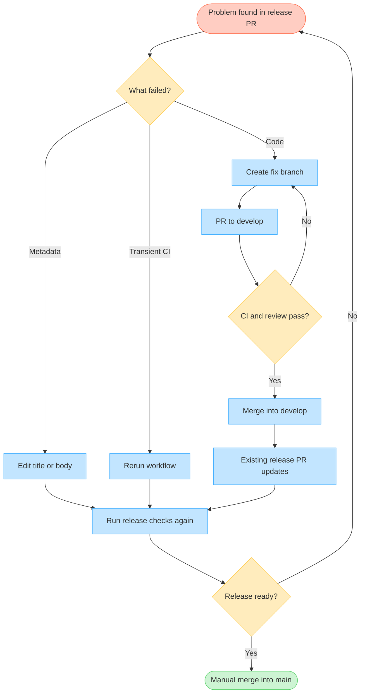
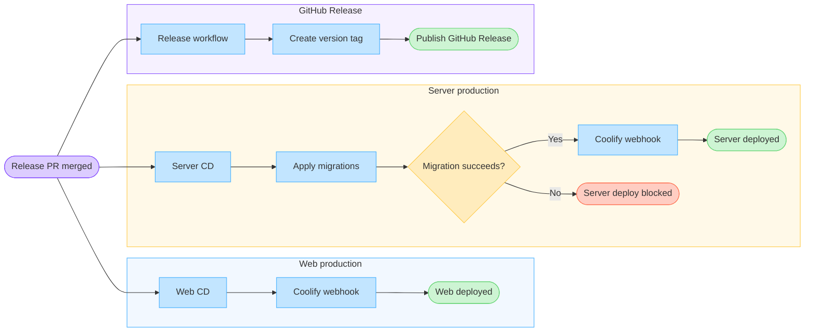

# GitHub Flow

This document defines the HMS workflow for development, review, integration,
staging, production, and releases.

Despite the document name, the project uses a **simplified Gitflow** with two
permanent branches:

- `main` represents the version currently released to production
- `develop` represents the integrated version currently deployed to staging

Every code change starts from `develop` and returns to `develop` through a Pull
Request. A version reaches production only through a release Pull Request directly
from `develop` to `main`.

---

## Permanent branches

| Branch | Responsibility | Deployment |
| --- | --- | --- |
| `main` | Stable and versioned production state | Web and server production |
| `develop` | Integration of approved changes | Web and server staging |

Rules:

- do not develop directly on `main` or `develop`
- do not push directly to `main`
- integrate changes through Pull Requests
- protect `main` and `develop` with required review and CI checks
- do not create `release/*`; release PRs start directly from `develop`
- do not create production tags or GitHub Releases manually

---

## Branch naming

Working branches follow this format:

```text
<category>/<short-kebab-case-description>
```

When a Jira issue exists, prefix the description with its lowercase key:

```text
<category>/scrum-123-<short-description>
```

Allowed categories:

| Category | Purpose | Example |
| --- | --- | --- |
| `feature` | New functionality | `feature/scrum-123-appointment-scheduling` |
| `fix` | Defect correction | `fix/scrum-124-healthcheck-timeout` |
| `refactor` | Behavior-preserving restructuring | `refactor/server-database-provider` |
| `chore` | Maintenance, configuration, or infrastructure | `chore/scrum-125-coolify-infra` |
| `docs` | Documentation | `docs/github-flow` |
| `test` | Test coverage or test infrastructure | `test/core-http-status` |
| `ci` | GitHub Actions and automation | `ci/production-release` |

Naming rules:

- use only lowercase letters, numbers, `/`, and `-`
- use kebab-case for the description
- keep the name short and tied to one intent
- do not include a person's name
- do not use `main`, `develop`, or a version as the category
- do not use `release/*` or `hotfix/*`; PRs to `main` accept only `develop` as
  their source

An urgent production fix still uses `fix/*` from `develop`, is validated in
staging, and reaches `main` through a patch release.

---

## Development cycle

### 1. Update `develop`

Before starting a change:

```bash
git switch develop
git pull --ff-only origin develop
```

### 2. Create a working branch

```bash
git switch -c feature/scrum-123-appointment-scheduling
```

Use the corresponding category for fixes, refactors, documentation, tests, and
technical work.

### 3. Implement and validate

- keep the change within the issue scope
- create or update the required tests
- validate all affected workspaces
- do not include secrets, `.env` files, or unrelated local changes

Common validation commands:

```bash
pnpm lint
pnpm check-types
pnpm test
pnpm build
```

When the scope is limited, prefer the workspace filters documented in
[`tooling.md`](tooling.md).

### 4. Create commits

Commits must be atomic and follow Conventional Commits:

```text
<type>(<scope>): <subject>
```

Examples:

```text
feat(web): add appointment filters
fix(server): validate database URL at startup
test(core): cover HTTP status constants
ci: deploy staging from develop
```

Never use `--no-verify`. See [`rules/commit-rules.md`](rules/commit-rules.md) for
the complete rules and [`prompts/commit-code-prompt.md`](prompts/commit-code-prompt.md)
for the automated commit procedure.

### 5. Publish the branch

```bash
git push -u origin feature/scrum-123-appointment-scheduling
```

### 6. Create the Pull Request to `develop`

```bash
gh pr create \
  --base develop \
  --head feature/scrum-123-appointment-scheduling \
  --title "Configuração do agendamento de atendimentos" \
  --body-file <description-file>
```

PR titles and descriptions are written in PT-BR. The title must be short, use a
noun phrase, and contain no branch or Conventional Commit prefix. The body must
describe the objective, changelog, validation, and related issues according to
[`prompts/create-pr-prompt.md`](prompts/create-pr-prompt.md).

After creating or updating the PR, request automated review:

```bash
gh pr comment <pr-number> --body "@code review"
```

### 7. Review and integrate

Merge the PR into `develop` only when:

- the scope is clear and reviewed
- all actionable comments are resolved
- all three CI workflows pass
- there are no conflicts with `develop`
- skipped validation or known risks are documented

The working branch may be deleted after the merge.

---

## Continuous integration

Pull Requests targeting `develop` or `main` run:

| Workflow | Checks |
| --- | --- |
| `core-package-ci.yaml` | Lint, type checking, and tests for `@hms/core` |
| `server-app-ci.yaml` | Lint, type checking, tests, build, and server Docker build |
| `web-app-ci.yaml` | Lint, type checking, tests, build, and web Docker build |

The workflows run when a PR is opened, updated, reopened, or marked ready for
review. A newer update cancels the previous run of the same CI workflow to avoid
stale results.

---

## Staging deployment

Merging a PR into `develop` creates a push that automatically triggers:

| Workflow | Execution order |
| --- | --- |
| `server-app-staging-cd.yml` | Install dependencies, apply migrations, then trigger the server Coolify webhook |
| `web-app-staging-cd.yml` | Trigger the web Coolify webhook |

The jobs use the `staging` GitHub Environment. Coolify clones the private
repository through a read-only Deploy Key and deploys:

- web staging from `develop` on internal port `3000`
- server staging from `develop` on internal port `3333`

Validate the applications in staging before creating a release PR.

---

## Release Pull Request

When `develop` is approved in staging, manually create a release PR:

```text
develop -> main
```

Do not create an intermediate branch. The `check-release-pr-source.yml` workflow
rejects any PR to `main` whose source is not exactly `develop`.

### Version and metadata

The title must contain exactly one SemVer version:

```text
Publicação da versão vX.Y.Z
```

The body must describe the main changes, fixes, migrations, breaking changes, and
validation instructions in PT-BR. GitHub Actions reuses it as the GitHub Release
description.

Use [`prompts/create-release-pr-prompt.md`](prompts/create-release-pr-prompt.md)
to analyze the changes, calculate the version, and create the PR through `gh`.

### Correcting an open release PR

Keep the existing release PR open when a problem is found before merge. Do not
close and recreate it for normal corrections.

| Problem | Correct action |
| --- | --- |
| Incorrect title, version, or description | Edit the same release PR |
| Transient GitHub Actions failure | Rerun the failed workflow |
| Code defect | Create `fix/*` from `develop`, open a PR to `develop`, then merge it after review |
| Additional functionality | Create `feature/*` from `develop` and use the normal development cycle |

After a fix or feature PR is merged into `develop`, the open `develop -> main`
release PR updates automatically and its CI runs again. Update the release title,
version, and description if the scope changed.

Do not:

- commit directly to `develop` to repair a release
- push a correction directly to `main`
- create a `release/*` branch to hold the correction
- merge while CI or review is pending

If the problem is discovered after merge into `main`, create a new fix through
`develop` and publish a new patch release, for example `v1.2.0 -> v1.2.1`.

### Manual merge

Do not enable auto-merge. After CI, review, and staging validation succeed, a
responsible reviewer manually merges the release PR into `main`.

Closing the PR with a merge triggers three independent workflows:

| Workflow | Result |
| --- | --- |
| `server-app-production-cd.yml` | Apply production migrations, then trigger the server deployment |
| `web-app-production-cd.yml` | Trigger the web production deployment |
| `release-production.yml` | Extract `vX.Y.Z` from the title and create the tag and GitHub Release from the PR body |

The deployments use the `production` GitHub Environment. The server deployment
starts only after its migrations complete successfully.

---

## Applications and environments

| Component | CI | Staging | Production |
| --- | --- | --- | --- |
| `apps/web` | Yes | Coolify, `develop`, port `3000` | Coolify, `main`, port `3000` |
| `apps/server` | Yes | Coolify, `develop`, port `3333` | Coolify, `main`, port `3333` |
| `packages/core` | Yes | Consumed by the applications | Consumed by the applications |

`packages/core` has no independent deployment. It is built, tested, and included
through its consuming applications.

---

## GitHub Environment secrets

### `staging`

- `COOLIFY_WEBHOOK_WEB_STG`
- `COOLIFY_WEBHOOK_SERVER_STG`
- `DATABASE_URL_STAGING`

### `production`

- `COOLIFY_WEBHOOK_WEB_PROD`
- `COOLIFY_WEBHOOK_SERVER_PROD`
- `DATABASE_URL_PRODUCTION`

GitHub Actions provides `GITHUB_TOKEN` automatically. Application build-time and
runtime variables belong in Coolify, not in GitHub Environments.

---

## Development lifecycle

The main diagram shows only the successful path. Corrections during a release are
shown separately to keep the lifecycle readable.

```mermaid
flowchart LR
    developStart(["develop"])

    subgraph developmentPhase ["Development"]
        direction LR
        workBranch["Working branch"] --> localChecks["Commits and checks"]
        localChecks --> developmentPR["PR to develop"]
        developmentPR --> reviewChecks{"CI and review pass?"}
    end

    subgraph stagingPhase ["Integration and staging"]
        direction LR
        mergeDevelop["Merge into develop"] --> stagingDeploy["Migrate and deploy"]
        stagingDeploy --> stagingValidation{"Staging approved?"}
    end

    subgraph releasePhase ["Release"]
        direction LR
        releasePR["Release PR"] --> releaseChecks{"CI and review pass?"}
        releaseChecks --> mergeMain["Merge into main"]
        mergeMain --> productionRelease(["Production release"])
    end

    developStart --> workBranch
    reviewChecks -->|"Yes"| mergeDevelop
    stagingValidation -->|"Yes"| releasePR
    releaseChecks -->|"Yes"| mergeMain

    reviewChecks -.->|"No: update branch"| workBranch
    stagingValidation -.->|"No: create fix"| workBranch

    classDef permanent fill:#DCCCFF,stroke:#874FFF
    classDef work fill:#C2E5FF,stroke:#3DADFF
    classDef decision fill:#FFECBD,stroke:#FFC943
    classDef success fill:#CDF4D3,stroke:#66D575
    classDef release fill:#FFE0C2,stroke:#FF9E42

    class developStart permanent
    class workBranch,localChecks,developmentPR,mergeDevelop,stagingDeploy work
    class reviewChecks,stagingValidation,releaseChecks decision
    class releasePR,mergeMain release
    class productionRelease success

    style developmentPhase fill:#F2F8FF,stroke:#3DADFF
    style stagingPhase fill:#FFF9E8,stroke:#FFC943
    style releasePhase fill:#FFF4E8,stroke:#FF9E42
```



---

## Correcting a release candidate

This diagram clarifies how to preserve the same release PR while routing code
changes through the protected development flow.



---

## Production pipelines

The production workflows start independently after the release PR is merged. A
server migration failure blocks only the server deployment; the web and release
workflows have their own execution paths.



---

## Operational summary

```text
develop
  -> working branch
  -> PR to develop
  -> CI and review
  -> merge into develop
  -> automatic staging deployment
  -> staging validation
  -> manual release PR from develop to main
  -> CI and review
  -> manual merge into main
  -> production migrations and deployments
  -> automatic version tag and GitHub Release
```
