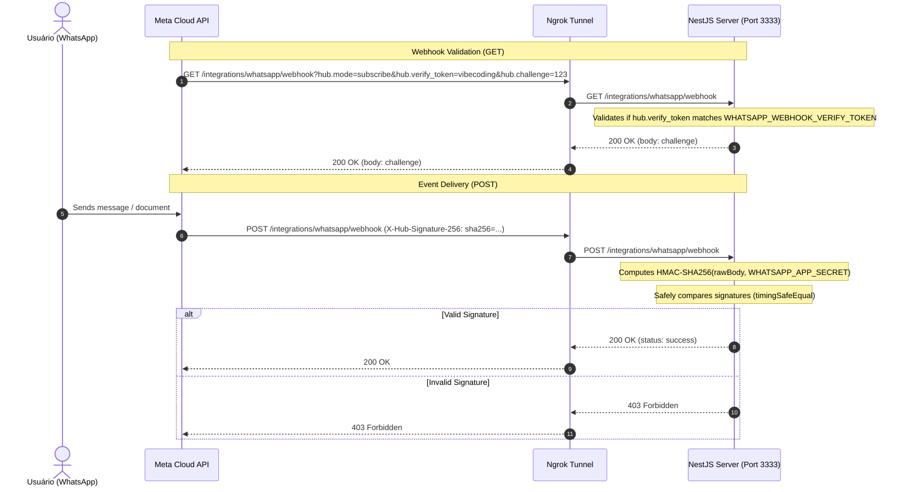

# Infrastructure

## **Front-end**

### Base and Styling

* **TypeScript (TS):** Provides static typing, reduces development-time errors, and improves editor autocomplete.
* **TanStack Start:** React-based full-stack framework, ideal for SSR, typed routes, loaders, and modern integration with TanStack Router.
* **Tailwind CSS:** Utility-first framework for fast, responsive styling based on classes directly in JSX.
* **shadcn/ui:** Accessible, customizable, and editable UI components integrated with Tailwind CSS.
* **React Email:** Used to build email templates in React/TSX, shared within the monorepo.

### State, Data, and Navigation

* **TanStack Query:** Manages requests, cache, synchronization, and asynchronous state between the front-end and the NestJS server.
* **TanStack Router:** Manages navigation, typed routes, loaders, page protection, and natural integration with TanStack Start.
* **nuqs:** Provides typed, synchronized URL query-state parsers for page filters and pagination.
* **Supabase Auth Client:** Used on the front-end for session management, login, logout, refresh tokens, and authenticated reads from Supabase Storage.

### Forms and Validation

* **React Hook Form:** Controls complex forms efficiently, avoiding unnecessary re-renders.
* **Zod:** Validates form data, server payloads, and shared contracts between front-end and back-end.

### Code Quality and Automation

* **BiomeJS:** Analyzes code to find errors and inconsistencies, standardizes code formatting across the monorepo, and enforces good practices with React, TypeScript, and Node.
* **Turborepo:** Organizes the monorepo, sharing packages between front-end, back-end, database, emails, UI, and tests.

### Testing and Reliability

* **Vitest:** Fast test runner for functions, components, schemas, and business rules.
* **Testing Library:** React component tests focused on behavior and accessibility.
* **Route integration tests:** Validate main page flows, navigation, loading states, errors, and data integration.

---

## **Back-end**

### Server Base

* **NestJS:** Main server framework, responsible for modules, controllers, services, authentication, authorization, and integration between services.
* **TypeScript:** Strong typing on the back-end, reducing errors and improving maintainability.
* **Drizzle ORM:** SQL-first ORM for modeling tables, generating migrations, and querying PostgreSQL with strong typing.
* **Zod:** Validation of DTOs, shared contracts, server inputs, webhooks, and internal payloads.

### Database

* **Supabase PostgreSQL:** Main application database, used for application users, tenants, permissions, files, metadata, and product data.
* **Drizzle Migrations:** Version-controlled management of database changes.

### Authentication and Authorization

* **Supabase Auth:** Responsible for signup, login, sessions, refresh tokens, password reset, magic links, and email confirmation.
* **RLS in Supabase Storage:** Controls reading/downloading of private files by user, tenant, and administrative role.

### Storage

* **Supabase Storage:** Main file storage, located in the São Paulo region.
* **Signed Upload URL:** Used for direct front-end uploads to Storage without passing file bytes through the VPS.
* **RLS for Reading:** Users download private files using JWT and RLS policies.

### Emails

* **Resend:** Email delivery service for staging and production.
* **React Email:** Transactional email templates using React/TSX.
* **Mailpit:** Captures and displays emails locally.
* **Local SMTP:** Used by local Supabase Auth and local NestJS to send emails to Mailpit.
* **Supabase Auth Email Templates:** Specific templates for confirmation, recovery, magic link, and invitation emails.

### Jobs and Workflows

* **Inngest:** Orchestrates jobs, retries, asynchronous workflows, and automations.
* **Inngest Dev Server:** Local environment for testing workflows.
* **Inngest Cloud:** Used in staging and production.

Typical flow:

```text
Meta Cloud API webhook

→ NestJS validates and records the event

→ NestJS sends the event to Inngest

→ Inngest executes the workflow

→ Inngest / Resend / Meta Cloud API / PostgreSQL
```

### AI

* **Mastra AI:** AI orchestration layer for agents, tools, and intelligent flows.
* **DeepSeek V4:** Main language model for AI agents. Two variants are available:

  * **DeepSeek V4-Pro:** 1.6T total parameters, 49B active per token. Used for tasks requiring complex reasoning, assisted legal drafting, and document analysis.
  * **DeepSeek V4-Flash:** 284B total parameters, 13B active per token. Used for fast and cost-efficient tasks such as classification, data extraction, and triage.
* **1M-token context:** Both variants support a 1-million-token context window, ideal for analyzing long legal documents.
* **Operation modes:** Supports Thinking mode, meaning step-by-step reasoning, and Non-Thinking mode, meaning direct response, configurable by agent/task.
* **API compatibility:** Supports OpenAI ChatCompletions and Anthropic API formats, directly integrable with Mastra AI.
* **MIT License:** Open-source weights, with possible future self-hosting if volume justifies it.
* **Controlled tools:** The AI does not access the database, storage, or service role directly; it uses specific tools exposed by the back-end.
* **NestJS feature AI modules:** Intermediate layers expose Core workflow interfaces through injection tokens while keeping concrete Mastra agents, tools, and workflows internal.

### Hermes AI Agents and Composio

* **Hermes:** AI agent service deployed on Coolify as a Docker Compose service for
  HMS project assistance and automated pull-request code review.
* **`code-reviewer` profile:** Technical reviewer for HMS pull requests. It reviews
  changed application and package code, reports actionable defects, and publishes
  inline GitHub comments through Composio.
* **`vera` profile:** HMS project assistant with verified context from the monorepo,
  GitHub, Jira, and Confluence. It supports architecture, requirements,
  implementation, testing, and delivery traceability.
* **Composio integrations:** The profiles use Composio for the HMS-connected
  applications: GitHub, Supabase, Google Drive, Jira, and Confluence.
* **Deployment boundary:** Hermes is an operational assistant and review service;
  it does not replace the NestJS application, domain packages, or repository CI.

### WhatsApp

* **Meta Cloud API:** Official WhatsApp integration used only for automatic messages and receiving documents.
* **Meta Webhooks:** Deliver incoming messages, documents, and delivery-status updates to NestJS.

#### Local Testing & Tunneling (Webhooks)

To avoid changing Meta Cloud API access tokens or Webhook Callback URLs on every local run, follow this shared environment workflow:

1. **Meta System User Token (Permanent Credential):**
   - In Meta Business Manager, create a **System User** with Admin/Developer permissions.
   - Assign the System User to your WhatsApp Business App and generate a permanent **System User Access Token** with permissions `whatsapp_business_messaging` and `whatsapp_business_management`.
   - Set `WHATSAPP_API_TOKEN` and `WHATSAPP_PHONE_NUMBER_ID` in `.env`.

2. **Static Ngrok Domain Setup:**
   - Reserve a free static domain on your [Ngrok Dashboard](https://dashboard.ngrok.com/cloud-edge/domains) (e.g. `buckle-stinger-swoop.ngrok-free.dev`).
   - Add `NGROK_DOMAIN=buckle-stinger-swoop.ngrok-free.dev` to your backend `.env` (`apps/server/.env`).

3. **One-Time Meta Webhook Configuration:**
   - In the Meta App Dashboard under **WhatsApp > Configuration**, set the Callback URL once to:
     `https://buckle-stinger-swoop.ngrok-free.dev/integrations/whatsapp/webhook`
   - Enter `WHATSAPP_WEBHOOK_VERIFY_TOKEN` (default: `vibecoding`).
   - Subscribe to the `messages` event field under **Webhook fields**.

4. **Start Tunnel:**
   - Run `pnpm ngrok` in the root workspace to automatically open the static HTTPS tunnel forwarding to local NestJS port (`3333`).


#### Webhook Lifecycle Flow




### Back-end Tests

* **Vitest:** Unit tests for services, business rules, schemas, and helpers.
* **Supertest:** HTTP integration tests for the NestJS server.
* **Testcontainers:** Spins up real databases/services in tests when needed.
* **FakeWhatsAppProvider:** In-memory provider used in the main automated tests.
* **Route integration tests:** Validate controllers, middlewares, authentication, permissions, contracts, and HTTP responses.

---

## **Infrastructure**

### Monorepo

* **Turborepo:** Organizes the project into apps and shared packages.

Suggested structure:

```text
apps/

├── web

└── server

packages/

├── email

├── validation

├── core
```

### Local Environment

* **Single Docker Compose:** Starts the entire local infrastructure without depending on `supabase start`.
* **Local Supabase via Docker:** Auth, PostgreSQL, Storage, PostgREST, Kong, and Mailpit.
* **templates-server:** Internal container that serves the HTML templates for local Supabase Auth.
* **NestJS and TanStack Start outside Docker:** Run via `pnpm dev`.

Local services:

```text
docker-compose.yml

├── supabase-db

├── supabase-auth / GoTrue

├── supabase-storage

├── supabase-meta / postgres-meta

├── supabase-studio

├── supabase-rest

├── supabase-kong

├── mailpit

└── templates-server
```

### Staging and Production

* **Managed Supabase in São Paulo:** Auth, PostgreSQL, and Storage.
* **Coolify:** Deploys the server and web app. WhatsApp is consumed as a managed Meta Cloud API. Hermes is also deployed on Coolify through a Docker Compose service, with the `code-reviewer` and `vera` profiles connected to the HMS applications through Composio.
* **Hostinger VPS:** Main server for Coolify.
* **Cloudflare:** DNS, proxy, TLS, basic WAF, and domain protection.
* **Coolify integrated Traefik:** Internal reverse proxy for containers.
* **Grafana Cloud:** Central storage, visualization, and alerting for staging and
  production infrastructure telemetry.
* **Grafana Alloy:** One collector per Coolify host, deployed from
  `apps/observability`, collecting Linux metrics plus selected Coolify container
  metrics and logs. Coolify environment labels keep staging and production
  telemetry separated inside the same Grafana Cloud stack.

The server image checks `GET /health` every 30 seconds. This route probes
PostgreSQL and Supabase Auth (`services["supabase-auth"]`) and returns 503 when
either required dependency is unavailable; later successful probes make the
container healthy again. The health response also reports Supabase Storage,
`services.inngest`, and `services.documenso` independently. Failures of these
auxiliary services produce `degraded` with HTTP 200 rather than removing the whole API
from service. In local development, the Inngest check verifies the local
`/api/inngest` handler. In staging and production, set an environment-scoped
`INNGEST_API_KEY` and the public `INNGEST_APP_URL` (including `/api/inngest`).
The check reads `hms-server` from the Inngest Cloud v2 API and requires an active
app with functions, a successful latest sync, and a matching endpoint URL. A
missing key or URL reports `NOT_CONFIGURED`. This verifies registration, not
whether individual function executions succeed. The API key is distinct from
the event and signing keys and must be stored as a server secret.

Set `DOCUMENSO_URL` on the Server App to the reachable Documenso base URL to
include its `/api/health` response; if omitted, its state is `NOT_CONFIGURED`.
Documenso reports `warning` when its signing certificate has an issue, which
readiness exposes as `DEGRADED`. Each dependency probe has a five-second
deadline, and Docker gives the readiness request seven seconds. A separate
database watchdog in staging and production checks every 30 seconds and exits
the process only after two consecutive database health queries stall for 15
seconds. An ordinary database error does not trigger a restart. The database
connection timeout remains 12 seconds. The Postgres.js client disables prepared
statements because staging uses Supavisor transaction pooling. The shared
communication badge polls one grouped summary endpoint every 10 seconds,
starting the next poll only after the previous request completes, instead of
requesting each client's full message history.

#### Grafana Cloud observability deployment

The self-contained `apps/observability/docker-compose.yaml` embeds the Alloy
configuration and writes it inside the container at startup. Deploy it as a
Git-backed Coolify **Docker Compose Application** after the file is committed and
pushed. Select the HMS Git repository, choose the Docker Compose build pack, set
Base Directory to `apps/observability`, and set Docker Compose Location to
`docker-compose.yaml` relative to that directory. A Docker Compose Empty Service
can also use the same file pasted into its Compose editor. No separate config
file, repository preservation setting, or public domain is required.

Set `GRAFANA_CLOUD_API_KEY`, `GRAFANA_CLOUD_LOKI_URL`,
`GRAFANA_CLOUD_LOKI_USER`, `GRAFANA_CLOUD_PROMETHEUS_URL`,
`GRAFANA_CLOUD_PROMETHEUS_USER`, `HMS_COOLIFY_PROJECTS_REGEX`,
`HMS_ENVIRONMENT`, and `HMS_OBSERVABILITY_HOST` in Coolify. The access-policy
token requires `metrics:write` and `logs:write` scopes and must be stored as a
Coolify secret. The embedded `HMS_ALLOY_CONFIG` contains no credentials.

Use `HMS_COOLIFY_PROJECTS_REGEX` to limit collection to the relevant Coolify
project names. For the current HMS projects, use
`^(HMS Hermes|HMS Server App|HMS Web App)$`. When staging and production share a host, set
`HMS_ENVIRONMENT=shared`; Alloy derives each container's environment from its
`coolify.environmentName` label while retaining `shared` for host-level metrics.
The `hms-documenso-staging` service is in the `HMS Server App` project, so its
container metrics and logs are included when Alloy runs on the same Docker host.
This collector does not, by itself, test Documenso's public availability or
alert on failed document workflows.

#### Server application telemetry

The NestJS production image preloads `apps/server/instrumentation.cjs` before
the application bundle. When `OTEL_EXPORTER_OTLP_ENDPOINT` is set, it sends
OpenTelemetry HTTP/Express traces, request-duration metrics, and Node.js runtime
metrics directly to Grafana Cloud over OTLP/HTTP. Without the endpoint, the
instrumentation is disabled. Alloy continues to collect host/container metrics
and Docker logs; no additional Compose service or inbound collector port is
needed. Coolify may place the server and Alloy Compose service on separate
networks, so the server does not assume it can reach Alloy by hostname.

Set these values on **each HMS Server App** in Coolify (staging and production):

* `OTEL_EXPORTER_OTLP_ENDPOINT`: the stack's OTLP gateway URL, ending in `/otlp`
  (not the Prometheus remote-write URL).
* `OTEL_EXPORTER_OTLP_HEADERS`: a secret `Authorization=Basic <base64>` header,
  where the base64 input is `OTLP_INSTANCE_ID:ACCESS_POLICY_TOKEN`. The token
  needs `metrics:write` and `traces:write`. Store it as a Coolify secret; never
  commit or display it in logs.
* `OTEL_SERVICE_NAME=hms-server` in both environments.
* `OTEL_RESOURCE_ATTRIBUTES=service.namespace=hms,deployment.environment.name=staging`
  for staging, or replace `staging` with `production` for production.

The instrumentation excludes all `/health` routes and `/docs` from HTTP tracing and
redacts raw URL/path/query span attributes; route templates remain available
from Express. It does not capture request/response bodies or headers. It does
time Drizzle's Postgres.js operations, including those inside transactions,
as `postgresql SELECT`/`INSERT`/`UPDATE`/`DELETE` client spans and a
`db.client.operation.duration` histogram (seconds). Only the operation type
and a bounded SQLSTATE error code are exported; SQL text, parameters, result
rows, and error messages are not. Queries executed outside the shared Drizzle
client (for example Supabase Auth and Documenso) are not covered. The standard
`pg` instrumentation does not instrument Postgres.js. To validate, redeploy a
server, make a real database-backed request, and check for a PostgreSQL child
span and `db.client.operation.duration` in the matching Grafana Cloud
environment. Dashboard panels and alerts must be created separately after
the first telemetry arrives.

#### Managed Supabase database metrics

The application query duration histogram does not show database-wide CPU,
disk, WAL, connection use, or queries made by other clients. Connect **both**
managed HMS Supabase projects to the same Grafana Cloud stack using the
Supabase/Grafana Cloud integration: in each Supabase project, open
**Integrations → Grafana Cloud Observability Platform**, select the HMS
Grafana Cloud stack, and authorize. Alternatively, in Grafana Cloud use
**Connections → Supabase** and configure two scrape jobs named clearly for
staging and production, each with its own project ID and Supabase Secret API
key. Keep the key in the integration's credential store, never in Git or
Alloy Compose environment variables. Install the supplied Supabase Project
dashboard and verify that both projects appear in its selectors. Managed
Supabase metrics come from the Supabase Metrics API; they do not require a
Postgres exporter in the HMS Alloy service. The local/self-hosted Supabase
stack is not covered by this managed-project integration. For individual slow
SQL statements across all database clients, use Supabase's Query Performance
view backed by `pg_stat_statements`; this setup intentionally does not export
statement text to Grafana.

Alloy requires privileged host access for cAdvisor and access to the Docker
socket. Treat that access as root-equivalent, do not expose Alloy's HTTP port,
and deploy the collector only from the trusted HMS repository.

### Network Security

Public ports:

```text
22 — SSH, preferably restricted to your IP

80 — HTTP

443 — HTTPS
```

Ports that should not be public:

```text
5432 — PostgreSQL

3000 — Direct front-end access

3001 — Direct server access

8000 — Direct Coolify access after configuring a domain
```

### Domains

Suggestion:

```text
app.yourdomain.com

→ TanStack Start

api.yourdomain.com

→ NestJS server

```

### Tests and CI

* **Local/test Docker Compose:** Base for running Supabase Auth, Storage, DB, and Mailpit. WhatsApp tests use the Meta test number and a public webhook tunnel.
* **Vitest:** Unit and integration tests.
* **Supertest:** HTTP server tests.
* **Testing Library:** Front-end component and route tests.
* **Mailpit:** Allows testing email confirmation, magic links, and password reset.
* **Fake providers:** Used for WhatsApp and external services in the main tests.

---

## **Final Stack Summary**

### Front-end

* **TanStack Start**
* **TanStack Router**
* **TanStack Query**
* **TypeScript**
* **Tailwind CSS**
* **shadcn/ui**
* **React Hook Form**
* **Zod**
* **Vitest**
* **Testing Library**

### Back-end

* **NestJS**
* **Drizzle ORM**
* **Zod**
* **Supabase Auth**
* **Supabase PostgreSQL**
* **Supabase Storage**
* **Inngest**
* **Resend**
* **React Email**
* **Mastra AI**
* **DeepSeek V4 — Pro + Flash**
* **Vitest**
* **Supertest**
* **Testcontainers**

### WhatsApp

* **Meta Cloud API**
* **Meta Webhooks**

### Electronic Signature

* **DocuSeal — Self-Hosted**

### Infra

* **Turborepo**
* **Single local Docker Compose**
* **Coolify**
* **Integrated Traefik**
* **Hostinger VPS**
* **Cloudflare DNS/Proxy/WAF**
* **Grafana Cloud**
* **Grafana Alloy**
* **Local Mailpit**

---

## ✍️ Electronic Signature

* **DocuSeal — Self-Hosted:** Open-source electronic document signature platform, hosted on the VPS itself. Replaces paid platforms like DocuSign, Clicksign, and D4Sign with zero cost per document.
* **REST API:** DocuSeal exposes a complete REST API for creating templates, sending documents for signature, pre-filling fields, and checking status. SDKs are available for JavaScript, TypeScript, Python, PHP, Ruby, Java, C#, and Go.
* **Webhooks:** Real-time notifications when documents are signed, allowing NestJS to automatically update the client status in the database.
* **Embedding:** Embeddable components, React and HTML, to include the signature form directly inside the HMS system interface.
* **Database:** Internal SQLite database inside the container’s `/data` volume. No external database dependency.
* **Storage:** Templates, filled PDFs, signed PDFs, and audit certificates remain in DocuSeal’s `/data` volume. After signing, NestJS copies the signed PDF to Supabase Storage, inside the client folder, via webhook.
* **Audit trail:** Automatically generated with signer email, IP, timestamps, and document hash. Embedded as the final page of the signed PDF and stored in the database.
* **Legal validity:** Simple electronic signature with legal validity in Brazil under MP 2.200-2/2001, Law 14.063/2020, and articles 104/107 of the Civil Code. Covers power of attorney, legal fee agreement, poverty declaration, and intake form. Does not replace ICP-Brasil signature, meaning the lawyer’s digital certificate, for petitions and judicial acts.
* **SMTP:** Reuses Resend already configured in the stack to send signature links by email.
* **Deploy:** Docker container on Coolify, behind Traefik, with a dedicated subdomain, for example `signature.yourdomain.com.br`.
* **Backup:** `/data` volume, including SQLite and PDFs, included in the existing VPS backup routine. Backup and restoration should be tested periodically.

### DocuSeal ↔ HMS System Integration Flow

1. The lawyer decides to formalize the engagement in the HMS system.
2. NestJS calls the DocuSeal API and creates a submission with `template_id` plus pre-filled, read-only client data.
3. DocuSeal generates the filled PDF and sends the signature link by email through Resend, or the system sends it through the Meta Cloud API.
4. The client opens the link on their phone and signs with a finger or typed signature.
5. DocuSeal embeds the signature in the PDF and generates an audit certificate.
6. DocuSeal triggers a webhook to NestJS.
7. NestJS receives the event and downloads the signed PDF through the DocuSeal API.
8. NestJS saves a copy in Supabase Storage, inside the client folder.
9. NestJS updates the client status in the database to `"hired"`.

### Electronic Signature Scope

| Document                           | Who signs | Method                        | Solution                |
| ---------------------------------- | --------- | ----------------------------- | ----------------------- |
| Power of attorney                  | Client    | Simple electronic signature   | DocuSeal                |
| Legal fee agreement                | Client    | Simple electronic signature   | DocuSeal                |
| Poverty declaration                | Client    | Simple electronic signature   | DocuSeal                |
| Intake form                        | Client    | Simple electronic signature   | DocuSeal                |
| Petitions and procedural documents | Lawyer    | ICP-Brasil certificate, A1/A3 | Court system, PJe/e-SAJ |

### Suggested Domain

```text
signature.yourdomain.com.br → DocuSeal via Traefik on Coolify
```

---

## 💾 Backup Strategy — 3-2-1 Rule

The backup strategy follows the 3-2-1 rule: 3 copies of the data, on 2 different types of media, with at least 1 offsite copy.

### Copies

| Copy          | Location         | Type          | Purpose                                |
| ------------- | ---------------- | ------------- | -------------------------------------- |
| 1 — Primary   | Supabase managed | Managed cloud | Supabase native automatic daily backup |
| 2 — Offsite A | Google Drive     | Cloud storage | Automatic daily backup                 |
| 3 — Offsite B | Dropbox          | Cloud storage | Automatic daily backup, redundancy     |

### What is included in the backup

| Data                               | Source                   | Backup format                 |
| ---------------------------------- | ------------------------ | ----------------------------- |
| Supabase PostgreSQL, main database | Managed Supabase         | Compressed pg_dump, `.sql.gz` |
| DocuSeal, SQLite + signed PDFs     | Container `/data` volume | Full volume `tar.gz`          |
| Environment variables and configs  | Coolify / `.env` files   | Encrypted copy                |

### Recommended Tool: rclone

rclone is the default tool for synchronization with cloud storage providers. It supports Google Drive and Dropbox natively, with encryption in transit and at rest.

Configuration:

```bash
rclone config
# Configure remote "gdrive" → Google Drive
# Configure remote "dropbox" → Dropbox
```

### Retention Policy

| Location         | Retention                      |
| ---------------- | ------------------------------ |
| Supabase managed | Automatic, managed by Supabase |
| Google Drive     | 90 days                        |
| Dropbox          | 90 days                        |

### Monitoring and Alerts

* The script should send success/failure notifications through a webhook to NestJS or directly through Resend/Meta Cloud API.
* Quarterly restoration test: start an isolated environment, restore the backup, and validate data integrity.

### Note on Managed Supabase

Managed Supabase, the main application database, is the primary copy in the 3-2-1 rule, with automatic daily backups handled by Supabase itself. The backup script adds offsite copies, Google Drive and Dropbox, for DocuSeal and configs.

For full autonomy, it is also recommended to keep a periodic `pg_dump` of Supabase as an additional copy in the remote storage providers, especially for migration or disaster-recovery scenarios.
