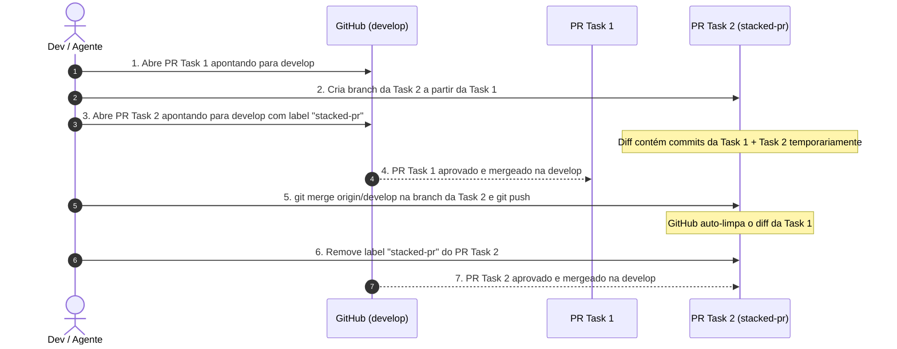

# Git Workflow Rules

This document establishes the repository-wide Git versioning standard, branching policy,
User Story decomposition, Pull Request lifecycle, and synchronization rules for all
developers and AI agents.

---

## 1. Diretriz Fundamental: `develop` como Única Fonte da Verdade

A branch `develop` (`origin/develop`) é a base canônica e o único destino de integração.

- **Origem**: Todas as branches de trabalho (features, bugfixes, refatorações, documentação)
  nascem a partir da `develop` (ou da branch da task imediatamente anterior em caso de fluxo encadeado).
- **Destino obrigatório de PRs**: Todo Pull Request deve ter como destino (`base`) única e
  obrigatoriamente a branch `develop`.
- **Proibição estrita de PRs intermediários**: **Nunca** abra um Pull Request apontando para
  branches pessoais ou intermediárias (por exemplo, apontar a Task 2 para a branch da Task 1).
  Isso gera encadeamento de PRs no GitHub, duplicação de revisões, conflitos de merge e perda
  de rastreabilidade.

---

## 2. Fatiamento de User Stories (Small PRs)

Para garantir agilidade, revisões de código de alta qualidade, menor superfície de conflito
e execução suave no CI, divida cada User Story (US) em tarefas/fatias menores (*Small PRs*).

O fatiamento fica a critério do desenvolvedor ou agente de acordo com a coesão do escopo, sendo
recomendado o seguinte modelo de 3 camadas para entregas completas:

```text
User Story
├── Task 1: Contratos, Schemas, DTOs e Interfaces (packages/core, packages/validation)
├── Task 2: Backend, Casos de Uso, Repositórios, Controllers e Testes (apps/server)
└── Task 3: Frontend, Telas, Componentes de UI, Rotas e Testes de Widget (apps/web)
```

Cada fatia deve ser entregue em seu próprio PR, contendo seus testes unitários e de integração
pertinentes à camada.

---

## 3. Sincronização Prévia Obrigatória

Antes de iniciar qualquer nova tarefa ou criar uma nova branch:

```bash
git checkout develop
git pull origin develop
```

Garanta que sua branch local esteja 100% atualizada com a `origin/develop` para evitar retrabalho
de resolução de conflitos e divergência de base.

---

## 4. Continuidade entre Tasks e Ciclo da Label `stacked-pr`

Quando uma User Story é fatiada e você precisa iniciar a **Task 2** antes que o PR da **Task 1**
tenha sido mergeado na `develop`, siga este ciclo:



### Passo a passo operacional:

1. **Criação da Branch Dependente**:
   Crie a branch da Task 2 a partir da branch da Task 1:
   ```bash
   git checkout -b <branch-task-2> <branch-task-1>
   ```

2. **Abertura Imediata do PR para `develop` com Label `stacked-pr`**:
   Abra o PR da Task 2 apontando para `develop` e adicione a label `stacked-pr`:
   ```bash
   gh pr create --base develop --label "stacked-pr" --title "..." --body "..."
   ```
   *Nota*: No corpo do PR, indique que a tarefa é dependente do PR da Task 1.

3. **Atualização após o Merge da Predecessora**:
   Assim que o PR da Task 1 for mergeado na `develop`:
   ```bash
   git fetch origin develop
   git checkout <branch-task-2>
   git merge origin/develop
   git push origin <branch-task-2>
   ```

4. **Remoção da Label `stacked-pr`**:
   Após o push com a `develop` atualizada (o que limpa automaticamente os commits da Task 1 do diff
   do PR no GitHub), remova a label `stacked-pr`:
   ```bash
   gh pr edit <pr-task-2-number> --remove-label "stacked-pr"
   ```

---

## 5. Estratégia de Sincronização e Resolução de Conflitos

- **Estratégia preferencial**: Utilize `git merge origin/develop` (ou `git pull origin develop`)
  para sincronizar branches em andamento, preservando o histórico explícito sem necessidade de
  *force-push*.
- **Conflitos simples**: Conflitos puramente textuais em arquivos de domínio da tarefa devem ser
  resolvidos preservando a lógica pretendida e validados via testes locais (`pnpm test`).
- **Conflitos complexos**: Se houver conflito em contratos de negócio compartilhados, migrações de
  banco de dados ou arquivos gerados, pause e alinhe a resolução com o responsável pela alteração
  concorrente.

---

## 6. Nomenclatura de Branches

O padrão de nomenclatura é flexível, desde que cumpra as seguintes diretrizes:
- Contenha o identificador do ticket Jira ou escopo funcional (ex: `HMS-123` ou `auth-refresh`).
- Seja claro quanto ao escopo da fatia (ex: `feat/HMS-123-contracts`, `HMS-123-server`, `feat/agenda-ui`).
- Seja derivado da `develop` (ou da task precedente caso encadeada).

---

## 7. Checklist para Agentes e Desenvolvedores

Antes de abrir ou atualizar qualquer PR:
- [ ] A base do PR está configurada como `develop`?
- [ ] A branch foi sincronizada com a última versão de `origin/develop`?
- [ ] Se a tarefa depende de um PR anterior não mergeado, a label `stacked-pr` foi aplicada?
- [ ] Se o PR anterior foi mergeado, a branch foi sincronizada com `develop` e a label `stacked-pr` foi removida?
- [ ] O tamanho do PR cumpre os limites do repositório (máximo de 5.000 linhas de TypeScript adicionadas)?
