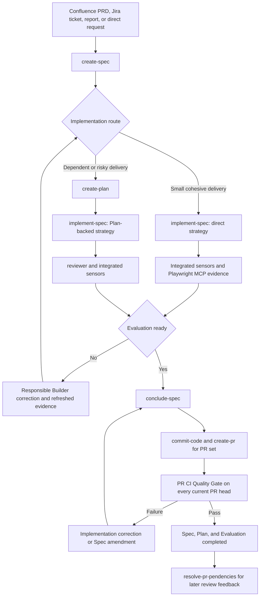

# Specification-Driven Development Rules

Specification-Driven Development (SDD) is the delivery workflow for HMS features and
feature-scoped changes. It keeps product intent, implementation contracts, execution state,
evidence, review, and pull-request closure in durable repository artifacts.

SDD is not required for maintenance that does not need a feature Contract. The Orchestrator
uses a direct maintenance workflow when a Spec would add no useful authority or traceability.

## Mandatory authority preflight

Before starting or resuming SDD, read these authorities in full:

1. root and applicable nested `AGENTS.md` and `AGENTS.local.md` files;
2. [`../modules.md`](../modules.md) for business ownership;
3. [`../architecture.md`](../architecture.md) for system invariants;
4. [`rules.md`](rules.md), followed by every dynamically selected Rule;
5. [`../tooling.md`](../tooling.md) for real commands and environments;
6. the applicable Confluence PRD and Jira ticket when they exist;
7. [`../design.md`](../design.md) for UI or visual work.

Use the Atlassian HMS MCP to search and read the complete canonical Confluence page or Jira
ticket. Reads gather evidence; never change external records unless the user explicitly
authorizes that mutation. Re-run Rule discovery whenever scope expands.

## Sources of authority

| Authority | Governs |
| --- | --- |
| Human decision | Product, scope, architecture, or policy decisions that require approval. |
| Confluence PRD | Product outcomes, actors, capabilities, experience, dependencies, and journeys. |
| Jira ticket or report | Delivery scope and external traceability. |
| `AGENTS.md` and `AGENTS.local.md` | Agent behavior, safety, and required tooling. |
| Architecture and Modules | System boundaries, dependency direction, and business ownership. |
| Rule router and selected Rules | Reusable implementation and validation conventions. |
| Design documentation and references | Visual system and feature-specific visual intent. |
| Tooling | Real generation, validation, build, and environment commands. |
| Spec | Feature-specific product, technical, and validation Contract. |
| Plan | Optional execution sequencing and operational state. |
| Current implementation | Lowest-level evidence of existing behavior. |

When the requested delivery changes a PRD, global Rule, architecture, module ownership,
design authority, or tooling convention, update that authority first. Product behavior,
global Rules, architecture, and module ownership require explicit user approval. Update the
canonical Confluence PRD rather than creating a local `prd.md` substitute.

HMS PRDs do not need a repository-specific requirement-ID or checkbox format. A Spec maps the
relevant PRD sections and Jira scope to its own observable `RF-*` requirements and `CA-*`
acceptance criteria. Jira workflow state and Confluence content are never changed
automatically by `create-spec`, `implement-spec`, or `conclude-spec`.

## Roles

Prompt names such as `create-spec` and `conclude-spec` are workflows, not agents.

| Role | Responsibility | Restrictions |
| --- | --- | --- |
| Orchestrator | Selects workflows, owns artifact state, creates subagents, integrates diffs, runs sensors, records evidence, publishes the PR, and routes failures. | Does not delegate the official evidence verdict, skip required sensors, or claim unexecuted evidence. |
| [Builder](../agents/builder-agent.md) | Implements one bounded direct, ownership, phase, task, or correction scope. | Does not edit Spec, Plan, Evaluation, PRD, Rules, commits, branches, or PRs. |
| [Searcher](../agents/searcher-agent.md) | Researches one bounded repository boundary and returns exact read-only evidence. | Does not edit files, decide the Contract, or create subagents. |
| [Integrated Reviewer](../agents/reviewer-agent.md) | Independently audits one integrated Plan-backed candidate. | Does not edit, implement fixes, or decide the official readiness verdict. |

All subagents are siblings created by the Orchestrator in the current task. No subagent creates
another subagent, user-owned task, fork, or handoff.

## Durable artifacts

```text
documentation/features/<domain>/<feature>/
├── spec.md
├── plan.md                         # optional
├── evaluation.md                   # created at implementation kickoff
└── design/                         # for design-backed UI
    ├── manifest.md
    └── <reference screenshots>.png
```

New behavior for a completed feature uses:

```text
documentation/features/<domain>/<feature>/changes/<change-name>/
```

| Artifact | Owns | Does not own |
| --- | --- | --- |
| `spec.md` | Product, design, technical, and validation Contracts. | Attempts or actual test results. |
| `plan.md` | Waves, dependencies, stable Builder ownership, status, blockers, and next action. | Duplicate product or technical Contracts. |
| `evaluation.md` | Commands, runtime/manual/visual evidence, findings, history, and PR CI. | Product or architecture authority. |
| `design/manifest.md` | Reference inventory, Pencil node, state, viewport, implementation surface, and comparison requirement. | Implementation-generated proof. |

Implementation screenshots are transient validation artifacts. Store them in ignored test or
browser output, or retain them as CI artifacts, and record their path or identifier in
`evaluation.md`. Do not create new feature-local `evidence/` directories.

## Artifact statuses

| Artifact | Statuses |
| --- | --- |
| Spec | `draft`, `open`, `in_progress`, `completed`, `cancelled` |
| Plan | `pending`, `in_progress`, `completed`, `superseded` |
| Phase, task, or coverage row | `pending`, `in_progress`, `completed` |
| Evaluation | `in_progress`, `ready`, `completed` |

Failures do not create extra artifact statuses. Keep the affected item `in_progress` and
record its finding, invalidated evidence, and next action. `ready` means implementation
evidence can enter conclusion; it does not close Jira or alter the Confluence PRD.

### Legacy artifact migration

Completed artifacts created under the former Judge-based workflow remain immutable historical
records. Do not rewrite their evidence merely to match the current template. Before resuming an
`open` or `in_progress` legacy Spec, reconcile its metadata and section ownership with the current
five-section Contract, create or reconcile Evaluation from the canonical template, and convert
operational Judge history into historical findings/evidence. Purely structural reconciliation
does not increment the Spec revision; any product, design, or technical Contract change does.

An existing Plan may be reconciled to stable ownership Builders or marked `superseded` when the
current Spec qualifies for direct execution. Removed workflows such as `implement-plan` and
Judge roles must not be revived for legacy artifacts.

## End-to-end lifecycle



Routes named by a workflow are immediate transitions in the current task. The Orchestrator
invokes the destination and resumes the caller; it does not tell the user to run another
prompt for routine in-scope work.

## 1. Optional Jira ticket creation

A Jira ticket is optional only when a direct request or report is sufficient and repository
traceability does not require one. [`create-jira-feat-ticket`](../prompts/create-jira-feat-ticket.md)
creates a scoped Jira delivery ticket from an approved product requirement. Present the exact
draft before creating the ticket and mutate Jira only with explicit user authorization.

Detailed layer contracts belong in the Spec, not the ticket. Ticket approval does not
authorize implementation, commits, or pull-request publication.

## 2. Spec creation

[`create-spec`](../prompts/create-spec-prompt.md) researches the repository and authors an
implementation-ready Contract. It resolves every material product, technical, design, and
validation ambiguity before writing.

The Spec has five top-level sections:

| Section | Content |
| --- | --- |
| Context and scope | Objective, source, current gap, boundaries, product alignment, and accepted assumptions. |
| Implementation Contract | Observable `RF-*`, `CA-*` Given/When/Then acceptance, restrictions, and conditional Design Contract. |
| Technical Contract | Current state, runtime flow, exact layer contracts, file/widget tree, and consequential decisions. |
| Validation Contract | Automated boundaries, executable `MV-*` scenarios, commands, and evidence targets. |
| Documentation alignment and revision history | Confluence PRD, Jira ticket, Architecture, Modules, Design, Tooling, Rule Pack, and revisions. |

The Spec stays `draft` until metadata, RF/CA traceability, technical mapping, design bundle,
manual scenarios, commands, links, and Rule Pack pass integrity checks. There is no separate
Spec Judge. A valid Spec moves to `open` and recommends either direct execution or a Plan.

## 3. Design-backed Specs

For UI backed by Pencil or supplied screenshots, the Spec creator:

1. loads the `pencil-design` skill and inspects the exact Pencil file and nodes through MCP;
2. visually inventories every relevant frame and asks about uncontracted behavior;
3. identifies missing states or viewports and classifies supplemental references;
4. saves one reference image per required state under the feature-local `design/` directory;
5. writes `design/manifest.md` with node, state, viewport, implementation surface, and CA/MV mapping;
6. verifies every saved image exists, is non-empty, has the expected dimensions, and was visually inspected.

The Spec stays `draft` if a required reference cannot be captured or a design-derived product
ambiguity is unresolved. Builders use the saved bundle. Reopen Pencil when the Design Contract
changes, the user requests a refresh, or final visual validation requires the canonical node.

## 4. Optional Plan creation

[`create-plan`](../prompts/create-plan-prompt.md) creates `plan.md` only when an `open` Spec
needs dependent phases, multiple ownership boundaries, meaningful parallelism, migration or
integration risk, complex validation, or durable recovery state.

The Plan contains execution status, one wave/ownership ledger, task cards, validation handoff,
and a conditional execution log. It cannot redefine the Spec. Builders never edit it; the
Orchestrator keeps it current.

## 5. Implementation and living evidence

Implementation always starts through [`implement-spec`](../prompts/implement-spec-prompt.md):

1. freeze the Spec revision;
2. set the Spec and current Plan to `in_progress`;
3. create or reconcile `evaluation.md` from the canonical template embedded in
   [`implement-spec`](../prompts/implement-spec-prompt.md#canonical-evaluation-template);
4. activate a bounded direct assignment or stable ownership Builders with RF/CA, allowed paths,
   Rule Pack, Architecture, design references, and exits;
5. integrate diffs and run repository-approved sensors;
6. for Plan-backed work, activate exactly one read-only subagent named `reviewer` after integration;
7. verify findings, invalidate stale evidence, resume the responsible Builder, and rerun affected
   validation until Evaluation is `ready`.

The direct route uses `Builder Direct` in the current agent context. Plan-backed work uses the
exact names `builder_core`, `builder_validation`, `builder_server`, and `builder_web` for affected
boundaries, plus exactly one read-only `reviewer` after integration. Use
`builder_fix_<boundary>` only for an independent correction when the owning Builder cannot be
resumed. Default to at most three concurrent implementation Builders and reuse them across
related phases and corrections. Do not create one Builder per task, phase, package, or retry.

Builder and Reviewer reports are inputs, not official evidence. The Orchestrator verifies the
diff, commands, browser behavior, and findings. `evaluation.md` is updated after every material
implementation or validation change, and affected earlier evidence is marked stale.

## 6. Integrated validation

Run the exact Core, Validation, Server, Web, database, architecture, build, integration, and
browser sensors required by the Spec and [`../tooling.md`](../tooling.md). Build is part of the
integrated Quality Gate rather than every small correction unless bundler, exports, environment,
Docker, workflows, or generated artifacts make it immediately relevant.

Authenticated UI validation follows the root `AGENTS.md` Playwright MCP workflow: verify local
dependencies and health, start persistent Server/Web sessions, resolve seed credentials from
source and environment, authenticate through the visible login form, validate the real protected
flow, refresh snapshots after state changes, inspect console/network failures, exercise a narrow
viewport and keyboard path, and stop processes started for validation.

For Plan-backed execution, the same `reviewer` subagent rechecks corrected candidates. The
Orchestrator independently verifies accepted findings and owns the readiness verdict.

## 7. Changes before conclusion

| Classification | Meaning | Action |
| --- | --- | --- |
| Implementation correction | The candidate does not satisfy the current Spec, Design Contract, or Rule. | Keep the revision, record a finding, reopen affected work/evidence, resume the responsible Builder, and rerun validation. |
| Contract change | Requested product behavior, design intent, or technical boundary differs from the Spec. | Set the Spec to `draft`, update the Confluence PRD or other higher authority first when required, increment revision, refresh affected contracts/design/validation, and reroute implementation. |

Earlier evidence invalidated by a revision remains historical. If a revised Spec no longer
needs its Plan, set the Plan to `superseded`.

## 8. Publication, CI, and closure

[`conclude-spec`](../prompts/conclude-spec-prompt.md) starts only when the Spec is
`in_progress`, Evaluation is `ready`, Plan work is complete when present, evidence is current,
and no blocking finding remains.

With explicit authorization to commit, push, and publish, conclusion:

1. runs local closure preflight and final Spec-to-diff conformance;
2. verifies generated artifacts, migrations, design evidence, and documentation;
3. invokes `commit-code` for intentional scoped commits;
4. invokes `create-pr` whenever the current delivery PR set is absent or stale; `create-pr`
   applies the repository's 5,000-added-TypeScript-line limit and splits oversized deliveries
   only across semantic or explicitly dependent PR slices;
5. waits for every applicable GitHub Actions check on every current delivery PR head SHA;
6. routes failures immediately through implementation or amendment and repeats publication/CI;
7. records each workflow result, URL, PR head SHA and delivery-PR dependency in Evaluation;
8. sets Spec, Plan, and Evaluation to `completed` only after current-head CI passes and blocking
   review conversations are resolved.

Before staging a delivery commit, audit the complete candidate diff against the
Spec scope. Pre-existing SDD, Rule, prompt, or other governance changes outside
that scope are inherited changes: exclude them unless the user explicitly
authorizes their inclusion, and record the disposition in Evaluation. A green
sensor does not authorize unrelated files to ship.

Do not alter Jira status or Confluence content automatically. Apply authorized factual updates
and record traceability; product or normative changes still require explicit user approval. Do
not merge or deploy unless the user explicitly asks.

## 9. Pull-request feedback and reopening

[`resolve-pr-pendencies`](../prompts/resolve-pr-pendencies.md) classifies each actionable
conversation as explanation, PR metadata, implementation correction, or Contract change.
Implementation corrections reopen the same Spec without a revision increment; Contract changes
return it to `draft` and increment the revision after authority alignment. The workflow routes
implementation and conclusion automatically and never changes Jira or Confluence without
authorization.

## Workflow registry

| Workflow | Source |
| --- | --- |
| Create an authorized Jira feature ticket | [`create-jira-feat-ticket.md`](../prompts/create-jira-feat-ticket.md) |
| Create or amend a Spec | [`create-spec-prompt.md`](../prompts/create-spec-prompt.md) |
| Create an optional Plan | [`create-plan-prompt.md`](../prompts/create-plan-prompt.md) |
| Implement directly or through a Plan | [`implement-spec-prompt.md`](../prompts/implement-spec-prompt.md) |
| Publish, run PR CI, and close | [`conclude-spec-prompt.md`](../prompts/conclude-spec-prompt.md) |
| Create or update the delivery PR | [`create-pr-prompt.md`](../prompts/create-pr-prompt.md) |
| Resolve later PR comments | [`resolve-pr-pendencies.md`](../prompts/resolve-pr-pendencies.md) |

Files under `documentation/prompts/` are canonical. `scripts/sync-commands.sh` synchronizes
their generated command and skill representations.
