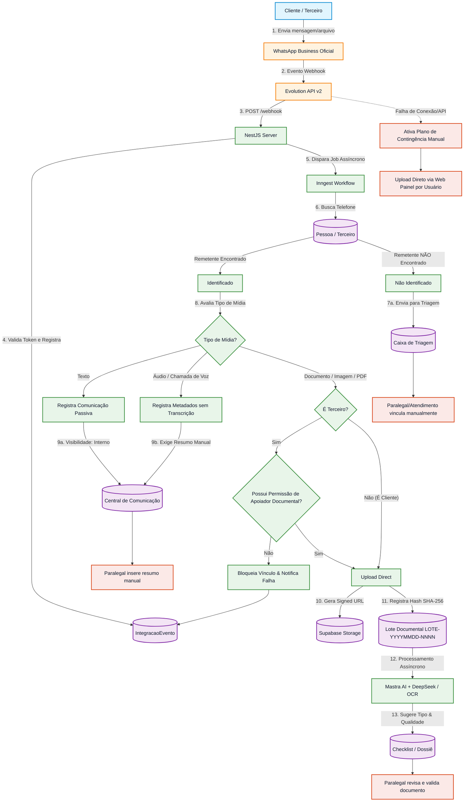

```mermaid
flowchart TD
    classDef cliente fill:#e1f5fe,stroke:#0288d1,stroke-width:2px,color:#0f172a;
    classDef infra fill:#fff3e0,stroke:#f57c00,stroke-width:2px,color:#0f172a;
    classDef sistema fill:#e8f5e9,stroke:#388e3c,stroke-width:2px,color:#0f172a;
    classDef banco fill:#f3e5f5,stroke:#7b1fa2,stroke-width:2px,color:#0f172a;
    classDef operacao fill:#fbe9e7,stroke:#d84315,stroke-width:2px,color:#0f172a;

    %% Atores e Entrada
    C[Cliente / Terceiro]:::cliente -->|1. Envia mensagem/arquivo| W[WhatsApp Business Oficial]:::infra
    W -->|2. Evento Webhook| E[Evolution API v2]:::infra
    E -->|3. POST /webhook| N[NestJS Server]:::sistema

    %% Validação e Logs
    N -->|4. Valida Token e Registra| IE[(IntegracaoEvento)]:::banco
    N -->|5. Dispara Job Assíncrono| I[Inngest Workflow]:::sistema

    %% Tratamento de Identificação
    I -->|6. Busca Telefone| DB_P[(Pessoa / Terceiro)]:::banco
    
    DB_P -->|Remetente Encontrado| ID[Identificado]:::sistema
    DB_P -->|Remetente NÃO Encontrado| NO_ID[Não Identificado]:::sistema

    %% Fluxo Não Identificado
    NO_ID -->|7a. Envia para Triagem| CT[(Caixa de Triagem)]:::banco
    CT --> O_CT[Paralegal/Atendimento vincula manualmente]:::operacao

    %% Fluxo Identificado por Tipo de Mídia
    ID -->|8. Avalia Tipo de Mídia| MEDIA{Tipo de Mídia?}:::sistema

    %% Ramo Texto
    MEDIA -->|Texto| TXT[Registra Comunicação Passiva]:::sistema
    TXT -->|9a. Visibilidade: Interno| COM[(Central de Comunicação)]:::banco

    %% Ramo Áudio / Chamada
    MEDIA -->|Áudio / Chamada de Voz| AUD[Registra Metadados sem Transcrição]:::sistema
    AUD -->|9b. Exige Resumo Manual| COM
    COM --> O_AUD[Paralegal insere resumo manual]:::operacao

    %% Ramo Mídia / Arquivos (Documentos/PDFs/Imagens)
    MEDIA -->|Documento / Imagem / PDF| DOC{É Terceiro?}:::sistema

    DOC -->|Sim| PERM{Possui Permissão de Apoiador Documental?}:::sistema
    PERM -->|Não| BLOQ[Bloqueia Vínculo & Notifica Falha]:::sistema
    BLOQ --> IE

    PERM -->|Sim| UPL[Upload Direct]:::sistema
    DOC -->|"Não (É Cliente)"| UPL

    UPL -->|10. Gera Signed URL| ST[(Supabase Storage)]:::banco
    UPL -->|11. Registra Hash SHA-256| LD[(Lote Documental LOTE-YYYYMMDD-NNNN)]:::banco
    
    LD -->|12. Processamento Assíncrono| OCR[Mastra AI + DeepSeek / OCR]:::sistema
    OCR -->|13. Sugere Tipo & Qualidade| CHK[(Checklist / Dossiê)]:::banco
    CHK --> O_PAR[Paralegal revisa e valida documento]:::operacao

    %% Contingência
    E -.->|Falha de Conexão/API| ERR[Ativa Plano de Contingência Manual]:::operacao
    ERR --> O_MAN[Upload Direto via Web Painel por Usuário]:::operacao
```